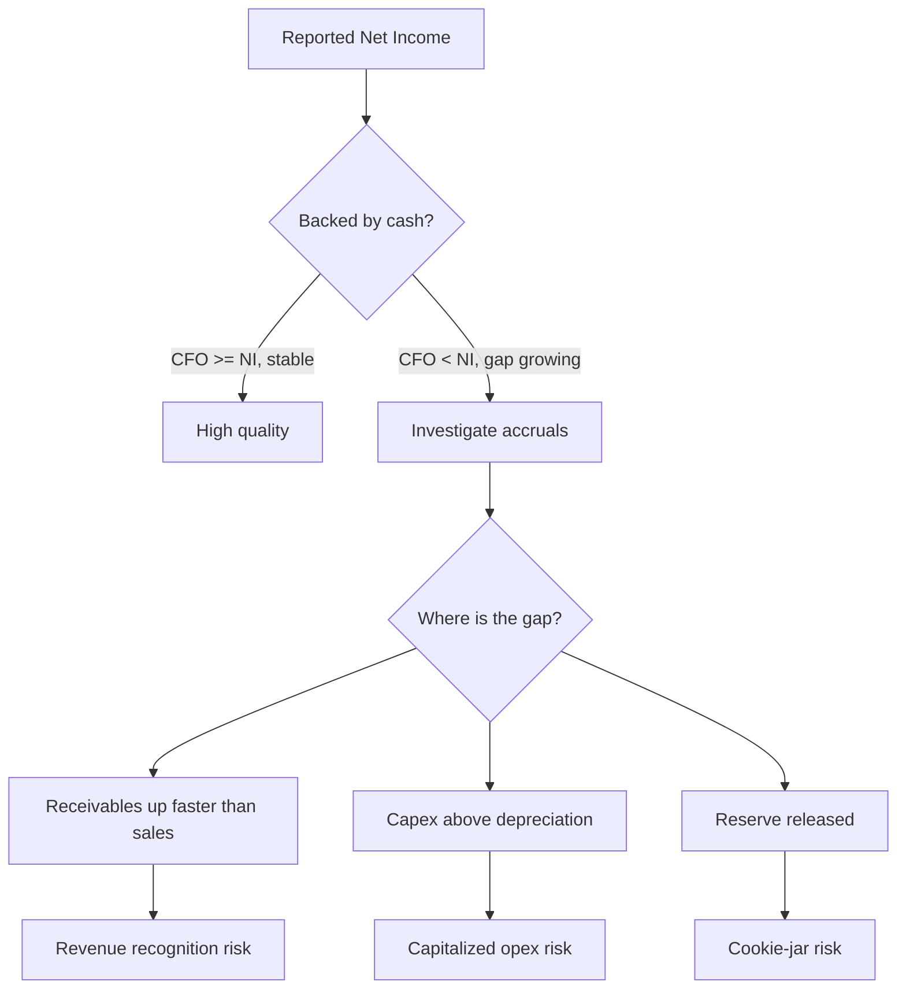
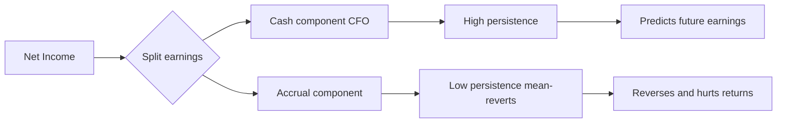
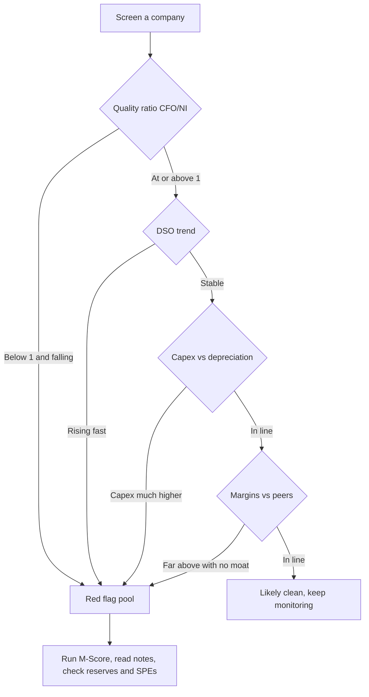

# Earnings Quality, Red Flags & Forensic Accounting

## The Problem / Why this matters

Two companies in the same industry both report $100 million of net income this year. On the surface they are twins. But dig one layer down and the truth diverges violently.

Company A collected $110 million of cash from customers, paid its suppliers and staff, and its $100 million of profit is sitting — as cash — in the bank. Next year, with no change in the business, it will earn roughly the same again. Its earnings are **real, repeatable, and cash-backed**.

Company B reports the same $100 million of profit, but its operating cash flow was *negative* $30 million. How? It booked revenue on shipments distributors did not actually want and will return next quarter; it capitalized $40 million of ordinary operating costs as "assets" so they never hit the P&L; it released $25 million from a reserve it had quietly over-stocked in a good year; and a big one-time land sale is buried inside "operating income." Company B did not earn $100 million. It *manufactured* $100 million. Next year, when the reserve is empty, the capitalized costs start depreciating, and the channel is choked with returns, the earnings collapse.

The reported number is identical. The **quality** of that number is worlds apart. And here is the brutal part: the market pays the same multiple for both — until it figures out the difference. The analyst who spots Company B *before* the market does makes the career-defining short call. The analyst who misses it recommends the stock at 25x earnings right before it falls 90%.

This is the entire discipline of **earnings quality analysis and forensic accounting**: the art of asking not "how much did they report?" but "**how much did they really earn, and will it last?**" It is tested relentlessly in equity research, credit, and IB interviews because it is the single skill that separates someone who reads a P&L from someone who *interrogates* one. Enron, WorldCom, Satyam, Lehman, Wirecard, Luckin Coffee — every one of these was detectable in the financials *years* before it blew up, by analysts who knew where to look. This chapter teaches you where to look.

---

## Core Idea

**High-quality earnings are sustainable and cash-backed; low-quality earnings are one-time, non-cash, or manufactured through accounting discretion.**

Two questions define quality:

1. **Sustainability** — will this profit repeat next year? A recurring subscription margin is high quality. A one-off asset-sale gain, a legal-settlement windfall, or a reserve release is low quality — it will not be there next year.
2. **Cash conversion** — is the profit backed by cash, or only by accounting entries? Profit that consistently converts into operating cash flow is real. Profit that persistently *diverges* from cash flow is a red flag: it lives only in accruals (receivables, inventory, capitalized costs, deferred items) that management controls.

The unifying insight: **accounting gives management discretion, and discretion can be used to inform or to deceive.** Accrual accounting (Chapter 5) is what makes financials meaningful — but the same estimates that let a firm report economic reality also let a firm *distort* it. Forensic accounting is the practice of measuring how much of reported earnings comes from hard cash versus soft, management-controlled accruals, and treating a large or growing soft component as a warning.

The single most powerful tool is the relationship:

```
Net income  =  Cash flow  +  Accruals
```

The bigger and more persistent the accrual component relative to cash, the lower the earnings quality — and, empirically, the worse the future stock returns (the "accrual anomaly," Sloan 1996).

---

## Why it works this way

Start from first principles. Why can two identical reported profits mean opposite things? Because **net income is an opinion; cash is a fact.**

Net income is built on hundreds of estimates: how much of receivables will be collected (bad-debt allowance), how long a machine will last (depreciation life), whether a cost creates a future asset (capitalize) or is consumed now (expense), how much warranty/return/litigation will cost (provisions), whether revenue has been "earned" yet (recognition timing). Every one of these is a judgment. Judgments have ranges. Two honest accountants can land on different numbers — and a dishonest one can land wherever it is convenient.

Cash, by contrast, is nearly un-fakeable in the short run at the point of collection. You either received money from a customer or you did not. That is why the cash flow statement is the forensic analyst's anchor: **it is far harder to fake cash than to fake profit.** (Not impossible — Enron faked cash flow via disguised loans, and Satyam faked bank balances outright — but far harder, and the fakes leave fingerprints elsewhere.)

So the reason the accrual gap works as a signal is mechanical. If a company books revenue it has not collected, net income rises but cash does not — the difference piles up in **receivables**. If it capitalizes operating costs, profit rises but cash spent is unchanged — the difference piles up in **assets / capex**. If it releases a reserve, profit rises with no cash at all — a pure accrual. In *every* manipulation, profit outruns cash, and the excess must lodge somewhere on the balance sheet, because double-entry demands a second side to every entry. **Manipulation cannot destroy the evidence; it can only relocate it.** The balance sheet is the crime scene. Forensic accounting is reading the crime scene.

And why is low quality *punished* over time? Because accruals mean-revert. A receivable either gets collected (becomes cash — fine) or gets written off (becomes an expense — the profit reverses). A capitalized cost gets depreciated (future expense). An over-stocked reserve, once emptied, can no longer be released. Every manufactured dollar of profit today borrows from a future period. The bill always comes due. Forensic accounting is simply reading the balance sheet to find out how large the unpaid bill has grown.

---

## Full technical content

### 1. High-quality vs low-quality earnings

| Attribute | High quality | Low quality |
|---|---|---|
| Sustainability | Recurring, from core operations | One-time, non-operating, or windfall |
| Cash backing | Converts to operating cash flow | Diverges from OCF; lives in accruals |
| Source of the estimate | Conservative assumptions | Aggressive assumptions at edge of GAAP |
| Composition | Organic, operating | Boosted by gains, tax items, reserve releases |
| Predictive value | Good guide to next year | Poor guide; likely to reverse |
| Volatility | Reflects real economics | Artificially smoothed or spiked |

Two dimensions are often drawn as a matrix: **persistence** (will it recur?) on one axis, **cash conversion** (is it real?) on the other. Top-right (persistent + cash-backed) is gold; bottom-left (one-off + non-cash) is a mirage.

### 2. Accruals and the accrual ratio

**Total accruals** = the portion of earnings *not* backed by cash flow. Two standard measures:

**(a) Balance-sheet (aggregate) accruals** — change in net operating assets:

```
Accruals(BS) = (ΔNOA)
NOA = Operating assets − Operating liabilities
    = (Total assets − Cash) − (Total liabilities − Total debt)
```

**(b) Cash-flow-statement accruals** (cleaner, preferred):

```
Accruals(CF) = Net income − (CFO + CFI)
```
or the simpler operating-only version:
```
Accruals = Net income − CFO
```

**Accrual ratio** (Sloan / Richardson) normalizes by average net operating assets:

```
Accrual ratio(BS) = (NOA_end − NOA_beg) / [(NOA_end + NOA_beg) / 2]

Accrual ratio(CF) = [NI − (CFO + CFI)] / [(NOA_end + NOA_beg) / 2]
```

**Interpretation:** a *high or rising* accrual ratio means earnings are increasingly driven by accruals rather than cash — lower quality. The famous **accrual anomaly** (Richard Sloan, 1996): firms in the highest accrual decile subsequently *underperform* the lowest decile by ~10% per year, because the market naively fixates on the earnings total and ignores its composition. The accrual component of earnings is *less persistent* than the cash component; the market learns this too slowly.

A blunt but powerful screen used on every desk:

```
Cash conversion (quality) ratio = CFO / Net income
```
Consistently **≥ 1.0** is healthy. **< 1.0** persistently, or *falling*, means profit is outrunning cash — investigate. A number that is *negative* while net income is positive is a screaming flag.

### 3. Where manipulation hides — the five main levers

Every scheme is a variation on making profit look bigger or smoother than the cash economics justify. The five classic levers:

| Lever | Mechanism | Where it lands on the BS | Reverses via |
|---|---|---|---|
| Revenue recognition abuse | Book revenue too early or that isn't real | Receivables / contract assets balloon | Returns, write-offs, DSO spike |
| Capitalizing operating costs | Push expenses onto the BS as "assets" | PP&E / intangibles / capitalized costs rise | Future depreciation / amortization / impairment |
| Cookie-jar reserves | Over-provide in good years, release in bad | Provisions / allowances swing | Reserve release with no cash |
| Off-balance-sheet | Hide debt and losses in SPEs / leases | Debt understated, ratios flattered | Consolidation / collapse |
| Below-the-line / classification | Bury losses; lift one-offs into "operating" | Reclassification, "one-time" abuse | Recurring "one-time" charges |

#### 3a. Revenue-recognition abuse

Under IFRS 15 / ASC 606 revenue is recognized when control of goods/services transfers to the customer (Chapter 5). Abuse means recognizing **before** that test is truly met, or recognizing revenue that has **no economic substance**:

- **Premature recognition** — booking a sale before delivery/acceptance, before the earnings process is complete, or when the right of return is so large that "control" hasn't really passed. E.g., "bill-and-hold" sales where goods are invoiced but never shipped.
- **Channel stuffing** — shipping far more product to distributors/wholesalers than they can sell, often with generous return rights, extended payment terms, or price discounts, to pull *next* quarter's sales into *this* quarter. Revenue and receivables spike now; returns and write-offs hit later. Classic in pharma, consumer goods, and beverages (Bristol-Myers Squibb, Sunbeam under "Chainsaw Al" Dunlap).
- **Round-tripping / grossing up** — two firms sell each other the same value to inflate reported revenue with no real profit (energy traders like Enron/Dynegy; ad-swap deals in dot-coms). Or booking gross (full sale) when acting only as an agent who should book net (a fee).
- **Fictitious revenue** — pure fabrication: fake customers, fake invoices, back-dated contracts (Satyam, ZZZZ Best, Wirecard's phantom Asian escrow accounts).
- **Bill-and-hold, side letters, consignment dressed as sale** — arrangements that give the appearance of a sale while the seller retains risks and rewards.

**Tell-tales:** revenue growth outpacing cash collections; **DSO (days sales outstanding) rising**; a spike in revenue in the *last* week of the quarter; deferred revenue *falling* while revenue rises (pulling forward); "unbilled receivables"/contract assets ballooning.

#### 3b. Capitalizing what should be expensed

An outlay is **capitalized** (put on the balance sheet as an asset, expensed slowly over years via depreciation/amortization) only if it creates a *future economic benefit* the firm controls. If it is consumed now, it must be **expensed** immediately. Aggressive firms capitalize ordinary operating costs to keep them off the current P&L:

- **The WorldCom playbook** — classifying "line costs" (fees paid to other telecoms to use their networks — a pure operating expense) as capital expenditure. ~$3.8bn (ultimately ~$11bn) of expenses moved to the balance sheet, converting losses into "profits."
- Capitalizing routine R&D, software maintenance, marketing/customer-acquisition costs, or ordinary repairs as "assets."
- Over-long depreciation lives / inflated salvage values to shrink the annual depreciation charge.

**Effect:** current expense ↓, so net income ↑; but **capex ↑ in investing cash flow**, so *free cash flow is unaffected* — which is exactly why free cash flow and the CFO-vs-capex relationship are forensic tools. Watch for: capex persistently and inexplicably above depreciation; "capitalized software/development costs" growing faster than revenue; rising gross PP&E with flat sales; margins improving while peers' don't.

#### 3c. Cookie-jar reserves (a.k.a. "big bath" and income smoothing)

Provisions and allowances (bad-debt allowance, warranty reserve, restructuring provision, litigation reserve — Chapter 12) require estimates. The trick:

- In a **good year**, over-provide — book an unnecessarily large expense/reserve. This depresses the good year (which had profit to spare) and creates a "cookie jar."
- In a **bad year**, *release* the reserve — reverse it into income with no cash — to hit the earnings target. Smooth, predictable earnings result, which the market rewards with a higher multiple.
- **Big bath**: when a year is already lost (new CEO, recession), pile *every* possible charge and write-off into it — kitchen-sink it — so future years look great by comparison and the reserve jar is refilled. (Beloved by incoming CEOs: blame the predecessor, reset the base.)

**Tell-tales:** earnings suspiciously smoother than cash flow or than the business's real volatility; reserve/allowance balances swinging inversely to profitability; a big restructuring charge followed by a suspicious earnings recovery; the allowance for doubtful accounts falling as a % of receivables while receivables grow (under-reserving to boost income).

#### 3d. Off-balance-sheet financing

Moving debt and loss-making assets off the balance sheet to flatter leverage and returns (Chapter 10). Vehicles: **special-purpose entities (SPEs / VIEs)**, operating leases (pre-IFRS 16 / ASC 842), factoring/securitization of receivables, take-or-pay and through-put contracts, joint ventures. Enron's SPEs (LJM, Raptors, Chewco) are the canonical case: they hid billions of debt and parked losses off the mother company's books while booking gains on transactions *with themselves*.

#### 3e. Classification and "one-time" abuse

Not fraud, but quality-destroying:
- Recurring costs labeled "**non-recurring**," "one-time," "special," or "restructuring" every single year so analysts add them back to "adjusted" earnings — inflating the number the Street models.
- **Non-operating gains** (asset sales, investment gains, pension gains, insurance recoveries) tucked into operating income.
- Aggressive use of **pro-forma / adjusted EBITDA** — "EBITDA before bad stuff." (WeWork's "Community Adjusted EBITDA" became the poster child.)
- **Classifying cash flows** to flatter CFO: e.g., pushing outflows into investing/financing, or (Enron) disguising financing inflows as operating.

### 4. The classic frauds — anatomy

| Fraud | Year | Core scheme | Lever | The tell in the numbers |
|---|---|---|---|---|
| Enron | 2001 | SPEs to hide debt & fabricate gains; mark-to-market on speculative long-term deals; round-trip energy trades | Off-BS + revenue + MTM | Rising debt-like obligations off-BS; CFO far below reported profit; opaque related-party SPEs |
| WorldCom | 2002 | Capitalized ~$11bn of line-cost operating expenses as capex | Capitalize opex | Capex wildly above peers; margins defying an industry downturn |
| Satyam | 2009 | Fabricated ~₹5,040 crore of cash & bank balances, fake invoices, fake interest income | Fictitious assets/revenue | Huge "cash" earning implausibly low interest; margins too good for the sector |
| Sunbeam | 1998 | Channel stuffing + cookie-jar reserves ("bill and hold") | Revenue + reserves | Revenue up, receivables & inventory up faster; reserve swings |
| Tyco / Adelphia | 2002 | Looting, off-BS loans, capitalized costs | Multiple | Related-party loans; classification games |
| Lehman | 2008 | "Repo 105" — repos booked as sales to remove assets/debt at quarter-end | Off-BS / classification | Quarter-end leverage dipping then rebounding |
| Wirecard | 2020 | €1.9bn of non-existent escrow cash; fake third-party acquiring revenue | Fictitious cash/revenue | "Cash" that couldn't be independently confirmed; profits not in the group's own accounts |
| Luckin Coffee | 2020 | Fabricated ~RMB 2.2bn of sales via fake vouchers | Fictitious revenue | Sales per store defying physical capacity |

**The pattern across all of them:** reported *profit* looked wonderful; *cash flow*, the *balance sheet* (ballooning receivables, unconfirmable cash, off-BS debt), and *ratios* (DSO, capex/sales, margin vs peers) told the true story — often years earlier.

### 5. The red-flag checklist analysts actually use

Organize the hunt into categories.

**A. Cash vs earnings (the master test)**
- CFO consistently below net income (quality ratio < 1) or falling
- Growing gap between net income and free cash flow
- Rising accrual ratio
- Profit up while operating cash flow flat or negative

**B. Revenue & receivables**
- **DSO rising** (revenue growing faster than cash collected)
- Receivables/contract assets growing faster than revenue
- Large last-week-of-quarter revenue; heavy quarter-end shipments
- Deferred revenue falling while revenue rises (pull-forward)
- Unusual "bill-and-hold," side agreements, or generous return/rebate terms
- Revenue booked gross where an agent should book net

**C. Expenses & margins**
- **Capex persistently above depreciation** with no growth story
- Capitalized software/development/customer-acquisition costs rising fast
- Depreciation lives lengthened / salvage values raised
- Margins improving against an industry trend / far above peers
- Declining allowance for doubtful accounts as % of receivables

**D. Inventory (a leading indicator)**
- **Inventory growing faster than sales / rising DIO** — signals demand weakness, obsolescence risk, or under-costed COGS to inflate margin
- Falling inventory turnover

**E. Reserves & provisions**
- Reserve/allowance balances swinging inversely with earnings
- Big-bath restructuring charges, especially around management change
- "One-time" charges that recur every year

**F. Structure, disclosure & governance**
- Off-balance-sheet vehicles, SPEs, extensive operating leases, receivables factoring
- Related-party transactions
- Frequent changes of auditor or CFO; auditor is small/unknown relative to firm size
- Late filings, restatements, qualified audit opinions
- Complex, opaque structure; results that are "too smooth"
- Aggressive tone / heavy reliance on non-GAAP metrics
- Management compensation heavily tied to short-term EPS/stock

**G. Analytical / statistical**
- **Beneish M-Score** (8 ratios → probability of manipulation; M > −1.78 flags likely manipulator). Inputs include DSRI (days-sales-in-receivables index), GMI (gross-margin index), AQI (asset-quality index), SGI (sales-growth index), TATA (total accruals to total assets).
- **Altman Z-Score** (bankruptcy/distress screen; distress can motivate manipulation)
- **Benford's Law** on transaction digit distributions (fabricated numbers deviate from the natural leading-digit frequency)
- **Piotroski F-Score** (9-point fundamental strength check)

### 6. Diagrams







---

## Worked examples

### Worked Example 1 — Diagnosing earnings quality from the accrual gap

**Setup.** Zenith Products reports the following (all $000s):

| Item | Year 1 | Year 2 |
|---|---|---|
| Revenue | 4,000 | 5,200 |
| Net income | 400 | 620 |
| Cash flow from operations (CFO) | 380 | 210 |
| Accounts receivable | 500 | 1,050 |
| Inventory | 300 | 640 |
| Net operating assets (NOA) | 2,000 | 2,900 |

Reported profit jumped +55% ($400 → $620). Bull case: "operating leverage." Assess the **quality** of that growth.

**Step 1 — Quality (cash conversion) ratio.**
```
Year 1: CFO/NI = 380 / 400 = 0.95
Year 2: CFO/NI = 210 / 620 = 0.34
```
Cash conversion collapsed from 95% to 34%. Profit rose 55% while operating cash fell 45% ($380 → $210). Profit and cash are moving in *opposite directions* — the master red flag.

**Step 2 — Accruals (CFO version).**
```
Year 2 accruals = NI − CFO = 620 − 210 = 410
```
$410k of the $620k profit — **66%** — is non-cash accrual. Only $210k is cash-backed.

**Step 3 — Accrual ratio (balance-sheet version).**
```
ΔNOA = 2,900 − 2,000 = 900
Average NOA = (2,900 + 2,000)/2 = 2,450
Accrual ratio = 900 / 2,450 = 36.7%
```
A ~37% accrual ratio is very high (single-digit % is normal). Net operating assets ballooned far faster than the business economically justifies.

**Step 4 — Where did the accruals go? Ratio decomposition.**
```
DSO Year 1 = 500 / 4,000 × 365 = 45.6 days
DSO Year 2 = 1,050 / 5,200 × 365 = 73.7 days      → +28 days
Receivables growth = 1,050/500 − 1 = +110%  vs revenue growth = +30%
DIO Year 1 = 300 / (COGS...) — use inventory/sales proxy:
Inventory growth = 640/300 − 1 = +113%  vs revenue +30%
```
Receivables grew 110% and inventory 113% while sales grew only 30%. DSO jumped 28 days.

**Interpretation.** The profit growth is low quality. The +$220k of extra profit is more than fully explained by a $550k rise in receivables and $340k rise in inventory — cash the company has *not* collected and product it has *not* sold. This is the fingerprint of **channel stuffing / premature revenue recognition** (receivables up 110%) combined with **inventory build** (demand weaker than the P&L implies). Model conclusion: strip the accrual-driven growth; treat sustainable earnings as closer to the $210k cash figure; expect a receivables write-off / return wave and margin reversal next year. **Sell / short candidate.**

*Self-check:* NI − CFO = 620 − 210 = 410 ✓. The accrual is largely ΔAR + ΔInv = 550 + 340 = 890 gross, partly offset by other working-capital and non-cash items to net to the 410 gap and the 900 ΔNOA — directionally consistent. ✓

---

### Worked Example 2 — WorldCom-style capitalizing of operating costs

**Setup.** Telecom Corp incurs $500m of "line costs" (network-access fees paid to other carriers — an operating expense). Honest accounting expenses all $500m. Management instead **capitalizes $300m** as "network assets," depreciated straight-line over 10 years, and expenses only $200m. Other data:

| Item | Honest | Aggressive |
|---|---|---|
| Revenue | 2,000 | 2,000 |
| Other operating expenses | 1,400 | 1,400 |
| Line costs expensed | 500 | 200 |
| Depreciation on capitalized line cost | 0 | 30 (=300/10) |
| Pre-tax profit | ? | ? |

**Step 1 — Pre-tax profit.**
```
Honest:     2,000 − 1,400 − 500 = 100
Aggressive: 2,000 − 1,400 − 200 − 30 = 370
```
Capitalizing turns a $100m profit into a **$370m profit** — a $270m boost (= $300m shifted off P&L, minus $30m first-year depreciation).

**Step 2 — Effect on the balance sheet and cash flow.**
```
Balance sheet: PP&E rises by 300 − 30 = 270 (net of first-year depreciation)
Cash flow from operations:
  Honest CFO:     starts from NI 100, add back depr 0  → base CFO
  Aggressive CFO: starts from NI 370, add back depr 30 → but $300m of the
                  cash outflow is reclassified from operating (opex) to
                  investing (capex)
  => Aggressive CFO is HIGHER by ~300 than honest CFO
  Investing cash flow: 300 MORE outflow (the fake "capex")
Free cash flow (CFO − capex): UNCHANGED.
```
This is the giveaway. Reported profit and CFO both jump, but **free cash flow is identical** because the $300m of real cash still left the business — it was merely relabeled from operating expense to capital expenditure.

**Step 3 — The forensic tells.**
```
Capex/sales spikes; capex >> depreciation.
Operating margin: honest 100/2,000 = 5% → aggressive 370/2,000 = 18.5%,
  defying an industry in decline.
```

**Step 4 — The reversal.** The $300m now sits on the balance sheet and must be depreciated $30m/year for 10 years. Each future year carries a $30m phantom charge with no offsetting benefit, and if the "asset" is ever impaired the whole remaining balance crashes through the P&L at once. Manufactured profit today = guaranteed drag tomorrow.

**Model conclusion:** normalize by re-expensing the $300m. True economic pre-tax profit = **$100m**, not $370m. Value on $100m. Flag capex/depreciation divergence in the report.

*Self-check:* Honest profit 100; aggressive 370; difference 270 = 300 deferred − 30 depreciation ✓. FCF: the $500m cash for line costs is spent in both cases; only its classification differs, so FCF ties out ✓.

---

### Worked Example 3 — Cookie-jar reserve and income smoothing

**Setup.** Steady Co wants to report smooth EPS. Its *real* (cash-economic) pre-tax profit is volatile:

| Year | Real economic profit |
|---|---|
| 1 | 300 |
| 2 | 100 |

The market pays a premium for stable earnings, so management targets **$200 reported both years.**

**Year 1 (good) — build the jar.** Real profit $300. Management books a $100 "restructuring / warranty" reserve it does not really need (a non-cash expense creating a liability):
```
Journal entry (Year 1):
  Dr Restructuring expense (P&L)      100
     Cr Restructuring provision (BS)      100
Reported profit Year 1 = 300 − 100 = 200
```
Cash is untouched — the $100 charge is a pure accrual. The jar (provision) now holds $100.

**Year 2 (bad) — raid the jar.** Real profit $100. Management *releases* the $100 reserve (reverses it into income, no cash):
```
Journal entry (Year 2):
  Dr Restructuring provision (BS)     100
     Cr Restructuring expense / other income (P&L)  100
Reported profit Year 2 = 100 + 100 = 200
```
The provision balance returns to $0.

**Result:**
| | Year 1 | Year 2 |
|---|---|---|
| Real economic profit | 300 | 100 |
| Reported profit | 200 | 200 |
| Reserve balance (end) | 100 | 0 |

Reported EPS is perfectly smooth; the underlying business swung 3-to-1. The market, seeing "stable" earnings, awards a higher multiple than the volatile reality deserves.

**Forensic tells:**
- Reported earnings *smoother* than cash flow (cash mirrors the real 300/100 swing; profit does not).
- The provision balance moved *inversely* to profitability — built when profit was high, released when profit was low.
- Year 2 "other income" or a shrinking reserve line in the notes reveals the release.

**Step — quantify the distortion.** Over two years, total real profit = 400 and total reported = 400 (smoothing nets to zero over the full cycle — reserves are timing, not magnitude). But *within* each year the signal is corrupted: Year 2's "$200" is 50% manufactured. An analyst extrapolating Year 2's smooth $200 forward over-values the firm; the correct run-rate, once the empty jar can no longer be raided, is the real $100.

**Model conclusion:** un-smooth the series back to 300/100. Recognize that future bad years can **no longer** be rescued (jar empty) — so downside earnings volatility will suddenly *appear* real going forward, often shocking the market. This is why cookie-jar firms tend to blow up on the *first* year they run out of reserve.

*Self-check:* Reserve built +100 (Yr1), released −100 (Yr2), ends at 0 ✓. Reported profit each year = 200 ✓. Debits = credits in both entries ✓. Cumulative reported (400) = cumulative real (400) ✓.

---

## How it is tested in interviews

Earnings-quality questions are the interviewer's favorite because they can't be answered by rote — they reveal whether you *think* like an analyst.

**Q1. "A company reports growing net income but its stock is falling / we're short it. Why might that be?"**
Model answer: "The market is questioning the *quality* of that income. I'd check three things fast: one, cash conversion — is CFO keeping pace with net income, or is the quality ratio falling below one? Two, receivables and DSO — if revenue is growing but receivables are growing faster and DSO is rising, the 'growth' may be channel stuffing or premature recognition that hasn't converted to cash. Three, the composition — is the growth coming from a reserve release, an asset-sale gain, a tax item, or capitalized costs rather than the core business? If profit is up while cash is flat or down, the earnings are low quality and likely to reverse."

**Q2. "How do you tell if earnings are high or low quality? Give me the one number you'd look at first."**
Crisp line: "**CFO divided by net income** — the cash conversion ratio. Persistently at or above one means the profit is real. Below one and falling means profit is outrunning cash and living in accruals I don't control — that's my cue to find *where* the accrual is hiding: receivables, inventory, capitalized costs, or a reserve."

**Q3. "Walk me through how a company can boost profit by capitalizing costs. What happens to the three statements?"**
Model answer: "Say they capitalize $100 of operating cost instead of expensing it. **Income statement:** the $100 expense disappears, so pre-tax profit rises $100 (minus a small first-year depreciation charge). **Balance sheet:** PP&E or intangibles rises by ~$100, and retained earnings rises by the after-tax profit boost. **Cash flow:** net income is higher, but in the cash flow statement the $100 cash outflow moves from operating out to investing as capex — so *CFO rises, capex rises, and free cash flow is unchanged*. That last point is the tell: real free cash flow didn't improve at all. And the $100 now has to be depreciated over future years, so it's borrowing profit from the future. WorldCom is the textbook case — line costs capitalized as network assets."

**Q4. "What is a cookie-jar reserve? Is it illegal?"**
Crisp line: "Over-provisioning in a good year — booking an unnecessarily large reserve or provision — to create a cushion you release into income in a bad year, smoothing earnings. It's a form of income smoothing. It's a non-cash accrual, so the tell is earnings that are smoother than cash flow and reserve balances that swing inversely to profitability. It sits on a spectrum: conservative estimation is fine, but deliberately over- or under-stating reserves to hit targets is earnings management and, if material and intentional, it's securities fraud — the SEC has brought cases on exactly this."

**Q5. "Pick a famous accounting fraud and explain it, then tell me the one ratio that would have flagged it."**
- Enron → off-balance-sheet SPEs hiding debt + mark-to-market gains on speculative deals; **tell: CFO far below reported profit, and debt-like obligations off-BS.**
- WorldCom → capitalizing line-cost opex as capex; **tell: capex vs depreciation and capex/sales spiking against an industry downturn.**
- Satyam → fabricated cash and revenue; **tell: enormous 'cash' balance earning implausibly little interest, margins too good for an IT-services peer set.**
Say one crisply and you've demonstrated you connect scheme → statement → ratio.

**Q6. "Revenue is up 20% but receivables are up 50%. What's your read?"**
Crisp line: "Receivables growing 2.5x faster than revenue means DSO is rising sharply — the company is booking sales it isn't collecting. Could be channel stuffing, easier credit terms to pull demand forward, premature recognition, or a genuine large-customer timing issue. I'd check the return-rights language, whether deferred revenue is falling, and whether it clusters in the last week of the quarter. Default stance: earnings quality is deteriorating and a receivables write-off is a risk."

**Q7. "What's the accrual anomaly?"**
Crisp line: "Sloan 1996: the accrual component of earnings is less persistent than the cash component, but the market prices earnings as if all dollars are equal. So high-accrual firms are systematically over-valued and subsequently underperform — buying low-accrual and shorting high-accrual firms historically earned ~10% a year. It's the academic backbone of earnings-quality investing."

**Q8. "How would you screen a whole universe of stocks for accounting risk?"**
Model answer: "Rank on a handful of quality signals: CFO/NI cash conversion, accrual ratio (ΔNOA / avg NOA), DSO and DIO trends, capex vs depreciation, and the Beneish M-Score. Flag the tail — say the worst decile — then go bottom-up: read the reserve and revenue-recognition notes, check for SPEs and related-party deals, and look at auditor/CFO turnover and restatements. Screens narrow the field; the notes convict."

---

## Traps & common mistakes

- **Confusing earnings management with outright fraud.** Most earnings management is *legal* use of discretion at the aggressive edge of GAAP; fraud is intentional misrepresentation. In an interview, distinguish them — but note the slope: reserves-to-hit-targets is where legal shades into illegal.
- **Trusting a single quarter.** Quality signals are about *trend and persistence.* One quarter of CFO < NI can be seasonal or a one-off. It's the *sustained* divergence that damns.
- **Forgetting that free cash flow un-does capitalized costs.** Candidates say "capitalizing boosts CFO" and stop. The sharp answer adds "but FCF is unchanged, because the cash still went out — as capex." That one sentence separates you.
- **Thinking cash flow can't be faked.** It's *harder*, not impossible. Enron disguised financing as operating CFO; Satyam/Wirecard fabricated the cash balance itself. Always ask whether the cash is *independently confirmable*.
- **Adding back every "one-time" charge.** If "non-recurring" recurs every year, it's recurring. Don't let management define your normalized earnings for you.
- **Ignoring inventory.** Rising DIO is a *leading* indicator — demand is softening, or COGS is being under-costed to flatter margin — often before receivables tell the story.
- **Reserve smoothing nets to zero, so 'no harm'?** Wrong. Over a full cycle magnitudes net out, but *within* periods the signal is corrupted, valuation is distorted, and the firm blows up the year the jar runs dry.
- **Assuming big audit firm = safe.** Arthur Andersen (Enron), PwC India (Satyam), EY (Wirecard) all signed off. Auditors are a check, not a guarantee.
- **Treating high accruals as automatically fraudulent.** A fast-growing firm *legitimately* builds working capital. Context matters — compare to peers, to the growth rate, and to the cash trend.
- **Over-reliance on adjusted EBITDA.** It excludes exactly the items (SBC, restructuring, "one-time" costs, capitalized-cost amortization) that quality analysis cares about. Always reconcile back to GAAP net income and to cash.

---

## First-principles recap

- **Net income is an opinion; cash is a fact.** Quality analysis measures how much of the opinion is backed by fact.
- **Manipulation cannot destroy evidence, only relocate it.** Double-entry forces every inflated profit to lodge as an asset or a shrunken liability on the balance sheet — the crime scene.
- **Earnings = cash component + accrual component.** The cash part persists; the accrual part mean-reverts. High/rising accruals → lower quality → worse future returns (the accrual anomaly).
- **Every manufactured dollar today is borrowed from the future.** Premature revenue reverses as returns/write-offs; capitalized costs reverse as depreciation/impairment; released reserves can't be released twice.
- **Free cash flow is the acid test for capitalized-cost games** — CFO and profit can be inflated, but FCF sees through the reclassification.
- **The four master screens:** cash conversion (CFO/NI), receivables/DSO vs revenue, capex vs depreciation, and reserve balances vs profitability. Anomalies in any of these open the investigation.
- **Screens narrow; notes convict.** Ratios flag risk; the disclosures (revenue recognition, reserves, SPEs, related parties, auditor changes) confirm it.

---

## Quick-reference

| Concept | Formula / definition | Red-flag reading |
|---|---|---|
| Cash conversion (quality) ratio | CFO / Net income | < 1 and falling = low quality |
| Accruals (CF method) | NI − CFO (or NI − (CFO+CFI)) | Large, growing = low quality |
| Accrual ratio (BS) | (NOA_end − NOA_beg) / avg NOA | High single-digit+ % = warning |
| NOA | (Total assets − Cash) − (Total liab − Total debt) | Ballooning vs sales = warning |
| DSO | AR / Revenue × 365 | Rising = collection/recognition risk |
| DIO | Inventory / COGS × 365 | Rising = demand/obsolescence/margin risk |
| Capex vs depreciation | Capex ÷ Depreciation | >> 1 with no growth = capitalize-opex risk |
| FCF | CFO − Capex | Unmoved by capitalizing games |
| Beneish M-Score | 8-ratio manipulation model | M > −1.78 = likely manipulator |
| Altman Z-Score | 5-ratio distress model | Low Z = distress → motive to manipulate |

**Cookie-jar reserve entries**
| Action | Entry |
|---|---|
| Build (good year) | Dr Expense / Cr Provision |
| Release (bad year) | Dr Provision / Cr Income |

**The five manipulation levers → where they hide**
| Lever | Balance-sheet footprint | Forensic tell |
|---|---|---|
| Premature / fake revenue | Receivables, contract assets ↑ | DSO ↑, deferred rev ↓ |
| Capitalize opex | PP&E / intangibles ↑ | Capex >> depreciation, FCF flat |
| Cookie-jar reserves | Provisions swing | Earnings smoother than cash |
| Off-balance-sheet | Debt understated (SPE/leases) | Leverage flatters, CFO < profit |
| Classification / one-offs | Reclassification | "One-time" recurs; opex in investing |

**One-line master test:** *If profit is rising while cash is not, find the accrual — it is either in receivables (revenue), in assets (capitalized costs), or in a released reserve — and treat that portion of earnings as unearned until proven otherwise.*
