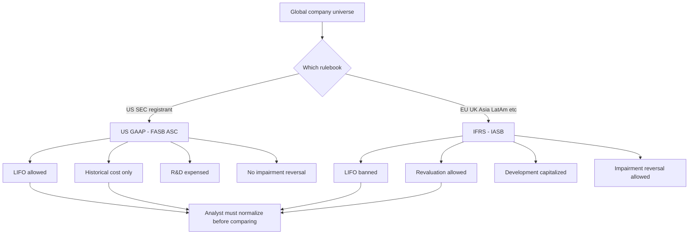
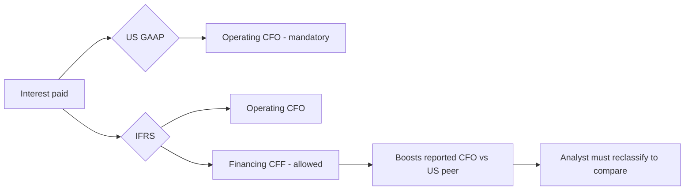
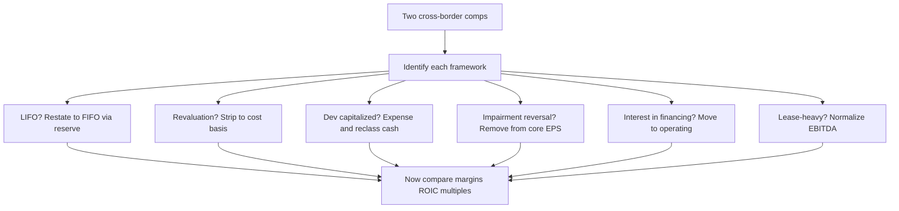

# GAAP vs IFRS — the Differences That Matter

## The Problem / Why this matters

You are an equity research analyst covering the global steel sector. Your coverage list has **Nucor (US, reports under US GAAP)** and **ArcelorMittal (Luxembourg, reports under IFRS)**. Your job is to rank them on valuation — who is cheaper on EV/EBITDA, who earns a higher ROIC, whose margins are really expanding. You pull both income statements. Nucor values inventory on **LIFO**. ArcelorMittal *cannot* use LIFO — IFRS bans it. In a year of rising steel prices, Nucor's COGS is higher and its reported inventory on the balance sheet is stale and understated. ArcelorMittal's COGS is lower and its inventory is closer to current cost.

If you just line up the two P&Ls and compare gross margins, **you are comparing a distortion, not a business.** Nucor might look less profitable purely because of an accounting choice, not because it runs a worse mill. And that inventory difference cascades: into COGS, into EBITDA, into net income, into the tax bill, into the balance sheet carrying value, into every multiple you compute.

Now multiply this across every line item where the two frameworks diverge — property revaluation, R&D capitalization, impairment reversals, how the cash flow statement is laid out, how interest paid is classified. A cross-border analyst who does not normalize for these is not doing analysis. They are reading two documents written in two different dialects and pretending they mean the same thing.

This chapter is the translation manual. In interviews for equity research, credit, and any role that touches global comparables, **"walk me through the differences between US GAAP and IFRS and why they matter for analysis"** is a standard, high-signal question. It separates candidates who memorized a P&L from candidates who understand that financial statements are the *output of a rulebook* — and that there are two rulebooks.

## Core Idea

There are two dominant financial-reporting frameworks in the world:

- **US GAAP** — Generally Accepted Accounting Principles, set by the **FASB** (Financial Accounting Standards Board), codified in the **ASC** (Accounting Standards Codification). Used by US domestic registrants filing with the SEC.
- **IFRS** — International Financial Reporting Standards, set by the **IASB** (International Accounting Standards Board). Used in 140+ jurisdictions — the EU, UK, most of Asia (ex-China/India/Japan quirks), Australia, Canada, Latin America, and adopted or converged-with almost everywhere except the US.

They agree on the vast majority of things: double-entry, accrual accounting, the four core statements, most revenue recognition (post the converged ASC 606 / IFRS 15), most lease capitalization logic. But they diverge on a specific, **memorizable set of high-impact areas**, and those are exactly the areas interviewers probe. The differences that *matter* for analysis are:

1. **Philosophy** — US GAAP is more **rules-based**; IFRS is more **principles-based**.
2. **Inventory** — US GAAP **allows LIFO**; IFRS **bans LIFO**.
3. **PP&E and intangibles** — IFRS allows upward **revaluation** to fair value; US GAAP locks assets at **historical cost** (cost model only).
4. **Development costs** — IFRS **capitalizes** development costs that meet criteria; US GAAP **expenses** almost all R&D as incurred.
5. **Impairment** — IFRS uses a one-step test and **allows reversal** of impairments (except goodwill); US GAAP uses a two-step-ish model and **prohibits reversal**.
6. **Presentation** — different balance-sheet ordering, different flexibility on the income statement, and crucially different **cash-flow classification** of interest and dividends.

The single most important meta-point: **neither framework is "right."** They are different lenses. The analyst's job is to pick one lens (usually the one your model is built in) and restate the other company onto it before comparing.



## Why it works this way

To understand the differences, you have to understand the two design philosophies that generated them.

**US GAAP grew up rules-based.** The US has the most litigious capital market on earth and the most aggressive plaintiffs' bar. When a standard is vague, US preparers and auditors get sued over judgment calls. So US GAAP evolved toward **bright-line rules**: specific numeric thresholds, detailed scope exceptions, industry-specific guidance, and "if-then" decision trees. The FASB's Codification is thousands of pages precisely because it tries to answer every edge case in advance. The benefit: **comparability and defensibility** — if everyone follows the same explicit rule, statements are consistent and an auditor can point to the rule when challenged. The cost: **form over substance** — companies structure transactions to fall just on the favorable side of a bright line (the classic pre-2019 operating-lease game, where you engineered a lease to stay just under the 90%-of-fair-value / 75%-of-life thresholds to keep debt off the balance sheet).

**IFRS grew up principles-based.** The IASB had to write one standard that works across 140 legal systems, cultures, and industries. You cannot write a bright-line rule that fits German manufacturing, Brazilian mining, and Australian banking simultaneously. So IFRS states a **principle** ("recognize revenue when control transfers," "capitalize development costs when future economic benefits are probable and measurable") and relies on **management judgment** guided by that principle. The benefit: **substance over form** — you report the economic reality, and it is harder to game a principle than a number. The cost: **less comparability and more room for manipulation of judgment** — two identical companies can reach different answers, and a management team under pressure can lean its judgment optimistically.

Every specific difference in this chapter is a downstream consequence of these two philosophies, plus **history**:

- **LIFO** survives in US GAAP because of the US tax code's **LIFO conformity rule**: if you use LIFO for tax (to lower taxable income in inflation), you *must* use it for financial reporting too. IFRS, having no such tax linkage and viewing LIFO as producing a nonsensical, stale balance-sheet inventory value, simply banned it (IAS 2) on the principle that the balance sheet should reflect something close to recent cost.
- **Revaluation** is allowed under IFRS (IAS 16) because the *principle* is relevance — a building bought in 1985 for $2m that is now worth $50m is more faithfully represented at $50m. US GAAP prioritizes **reliability and verifiability** over relevance and refuses to book unrealized holding gains on operating assets, fearing subjectivity and manipulation.
- **Development capitalization** (IAS 38) follows the matching principle: if development spend creates a probable future asset, it belongs on the balance sheet and should be expensed over the periods it benefits. US GAAP distrusts the reliability of "probable future benefit" for R&D and, outside narrow exceptions (software, website costs), **expenses it immediately** for conservatism.
- **Impairment reversal** (IAS 36) follows economic reality: if the thing that impaired an asset reverses, the asset's recoverable value genuinely came back, so the write-down should reverse. US GAAP treats an impairment as establishing a **new, permanent cost basis** — once you write down, you never write back up (except assets held for sale), again prioritizing conservatism and preventing earnings management via reversal.

Notice the pattern: **US GAAP consistently chooses conservatism, verifiability, and bright lines; IFRS consistently chooses economic relevance, substance, and judgment.** If you internalize that one sentence, you can *derive* most of the specific differences in an interview instead of memorizing a list.

## Full technical content

### 1. Rules-based vs principles-based — the master difference

| Dimension | US GAAP | IFRS |
|---|---|---|
| Standard setter | FASB | IASB |
| Codification | ASC (Accounting Standards Codification) | Individual IAS / IFRS standards |
| Design philosophy | Rules-based, bright lines | Principles-based, judgment |
| Guidance volume | Very detailed, industry-specific | Broader, fewer scope exceptions |
| Primary value | Comparability, verifiability, conservatism | Relevance, substance over form |
| Main weakness | Form over substance, structuring games | Lower comparability, judgment can be gamed |
| Used by | US SEC registrants | 140+ jurisdictions (EU, UK, Asia, LatAm, etc.) |

**Convergence note:** FASB and IASB ran a joint convergence project for ~15 years. It delivered **big wins** — revenue recognition (**ASC 606 / IFRS 15**, essentially identical) and leases (**ASC 842 / IFRS 16**, both now capitalize most leases, though with residual differences). But convergence **stalled and is effectively dead** as an active project. The differences below persist and you must know them.

### 2. Inventory — LIFO, the flagship difference

**Standards:** US GAAP = ASC 330. IFRS = IAS 2.

**Cost-flow assumptions permitted:**

| Method | US GAAP (ASC 330) | IFRS (IAS 2) |
|---|---|---|
| FIFO (First-In, First-Out) | Allowed | Allowed |
| Weighted-average cost | Allowed | Allowed |
| **LIFO (Last-In, First-Out)** | **Allowed** | **BANNED** |
| Specific identification | Allowed | Allowed |

**Why LIFO matters (in rising prices):**
- **LIFO** assumes the *last* (most recent, most expensive) units are sold first → **higher COGS**, **lower gross profit**, **lower net income**, **lower taxes**, and **older/cheaper costs stuck on the balance sheet** → **understated inventory**.
- **FIFO** assumes the *first* (oldest, cheapest) units are sold first → **lower COGS**, **higher profit**, **higher taxes**, **inventory close to current cost**.

**The LIFO Reserve** — the bridge. US GAAP companies on LIFO must disclose the **LIFO reserve** in the footnotes:

$$\text{LIFO Reserve} = \text{FIFO Inventory} - \text{LIFO Inventory}$$

This single disclosed number lets you **convert a LIFO company to FIFO** and make it comparable to an IFRS peer. The restatement formulas:

| Convert from LIFO to FIFO | Formula |
|---|---|
| Inventory (FIFO) | LIFO Inventory + LIFO Reserve |
| COGS (FIFO) | LIFO COGS − (ΔLIFO Reserve for the period) |
| Net income (pre-tax adj) | Increase by ΔLIFO Reserve |
| Tax effect on the reserve | LIFO Reserve × tax rate (a deferred liability) |
| Retained earnings | Increase by LIFO Reserve × (1 − tax rate) |
| Cash | *No change from restatement itself — but note real cash taxes were lower under LIFO* |

**Other inventory differences (IAS 2 vs ASC 330):**

| Item | US GAAP | IFRS |
|---|---|---|
| Measurement | Lower of cost or **market** (for LIFO/retail) or lower of cost or **NRV** (others) | Lower of cost or **NRV** (net realizable value) always |
| Write-down **reversal** | **Prohibited** | **Allowed** (up to original cost) if NRV recovers |

*"Market" under US GAAP historically means replacement cost bounded by a ceiling (NRV) and floor (NRV − normal margin) — a rules-based construct. IFRS just uses NRV.*

### 3. PP&E and intangibles — revaluation

**Standards:** IAS 16 (PP&E), IAS 38 (intangibles) under IFRS; ASC 360 / ASC 350 under US GAAP.

| Model | US GAAP | IFRS |
|---|---|---|
| **Cost model** (cost − accumulated depreciation − impairment) | Required — only option | Allowed |
| **Revaluation model** (fair value at revaluation date − subsequent depreciation) | **Not permitted** | **Allowed** (must apply to whole class, revalue regularly) |

**How the revaluation model works under IFRS (IAS 16):**
- Revalue an entire **class** of assets (e.g., all land & buildings) to fair value, regularly enough that carrying value ≈ fair value.
- An **upward** revaluation goes to **Other Comprehensive Income (OCI)** and accumulates in a **Revaluation Surplus** reserve in equity (it does *not* hit the income statement — you cannot book an unrealized gain through P&L).
- A **downward** revaluation hits the **income statement** as an expense — *unless* it reverses a previously recognized surplus for that same asset, in which case it first reduces the surplus in OCI.
- **Depreciation** is then based on the *revalued* amount → higher depreciation → lower future net income.
- On disposal, the revaluation surplus is transferred directly to retained earnings (not recycled through P&L).

**Journal entries — upward revaluation (IFRS):**

```
Dr  PP&E (asset)                          XXX
    Cr  Revaluation Surplus (OCI/equity)      XXX
```

**Downward revaluation (no prior surplus):**

```
Dr  Revaluation Loss (income statement)   XXX
    Cr  PP&E (asset)                          XXX
```

**Intangibles (IAS 38):** revaluation model is *technically* allowed but only if an **active market** exists for the intangible — extremely rare, so in practice intangibles sit at cost. The far more important intangible difference is development-cost capitalization (next).

### 4. Research & development / development costs

**Standards:** IAS 38 (IFRS); ASC 730 (US GAAP).

| Phase | US GAAP (ASC 730) | IFRS (IAS 38) |
|---|---|---|
| **Research** phase | **Expense** as incurred | **Expense** as incurred |
| **Development** phase | **Expense** as incurred (with narrow exceptions) | **Capitalize** if the 6 criteria are met |

**IFRS's 6 capitalization criteria (mnemonic: PIRATE):** capitalize development costs once *all* are met —
1. **P**robable future economic benefits will flow
2. **I**ntention to complete the asset
3. **R**esources (technical, financial) adequate to complete
4. **A**bility to use or sell the asset
5. **T**echnical feasibility of completing it
6. **E**xpenditure can be measured reliably

**US GAAP exceptions where capitalization *is* required:**
- **Internal-use software** (ASC 350-40) — capitalize once the application development stage begins.
- **Software to be sold** (ASC 985-20) — capitalize after **technological feasibility** is established.
- **Website development costs**, certain **film/media** costs.
- **In-process R&D (IPR&D) acquired in a business combination** — capitalized as an indefinite-lived intangible under *both* frameworks (this is an exception where they agree).

**Analytical impact:** an IFRS pharma or tech company that capitalizes development will show **higher assets, higher near-term net income, and lower reported R&D expense** than an otherwise-identical US GAAP peer that expenses everything. Capitalized development then **amortizes** over future years and reduces future earnings, and the cash outflow shows up in **investing** activities (CFI) rather than operating (CFO), *flattering* IFRS operating cash flow. To compare, analysts often **reverse the capitalization** — expense all development, remove the intangible, and reclassify the cash flow.

### 5. Impairment of long-lived assets

**Standards:** IAS 36 (IFRS); ASC 360 for PP&E, ASC 350 for goodwill/intangibles (US GAAP).

**The test — mechanics differ fundamentally:**

| Step | US GAAP (ASC 360, held-and-used PP&E) | IFRS (IAS 36) |
|---|---|---|
| Trigger | Indicator of impairment | Indicator of impairment (goodwill/indefinite intangibles: annual regardless) |
| **Recoverability test** | Step 1: is carrying value > **undiscounted** future cash flows? If no → no impairment | No separate undiscounted screen |
| **Measurement** | Step 2 (if failed): write down to **fair value** | Write down to **recoverable amount** |
| Recoverable amount def. | Fair value | **Higher of** (a) fair value less costs to sell, and (b) **value in use** = PV of future cash flows |
| **Reversal of impairment** | **PROHIBITED** (new cost basis) | **ALLOWED** for assets other than goodwill (up to what carrying value would have been, net of depreciation) |

**Two structural consequences:**

1. **US GAAP's undiscounted screen makes impairments less frequent but "lumpier."** Because you first compare carrying value to *undiscounted* cash flows, an asset can be economically impaired (PV < carrying) yet pass the US GAAP screen and take **no** write-down — until it finally fails, then it takes a big one. IFRS, comparing to a discounted recoverable amount, catches impairments **earlier and smaller**.

2. **The reversal difference is the exam favorite.** IFRS: if a previously impaired machine's recoverable amount rebounds, you **reverse** the impairment (up to the depreciated original cost, gain to P&L). US GAAP: **never** reverse — the written-down value is the new permanent basis. **Goodwill impairment is never reversed under either framework.**

**Goodwill impairment specifics:**

| Item | US GAAP (ASC 350, post-ASU 2017-04) | IFRS (IAS 36) |
|---|---|---|
| Tested at | Reporting unit | Cash-generating unit (CGU) or group of CGUs |
| Method | One-step: carrying value of unit vs fair value; impairment = excess (capped at goodwill) | Recoverable amount of CGU vs carrying value |
| Reversal | Never | Never |

### 6. Presentation & disclosure differences

**Balance sheet ordering:**

| | US GAAP | IFRS |
|---|---|---|
| Typical order | **Most liquid first** — current assets at top, then non-current; liabilities before equity | Often **least liquid first** — non-current assets at top, then current; equity often before liabilities (common in EU) |
| Classified balance sheet | Current/non-current split required | Current/non-current required *unless* liquidity presentation is more relevant (e.g., banks) |

*Ordering is presentational — it does not change totals — but it will trip you up reading a European filing if you expect the US layout. Note IFRS terminology too: "non-current assets," "trade receivables," "share premium" (= additional paid-in capital), "reserves," "provisions."*

**Income statement:**

| | US GAAP | IFRS |
|---|---|---|
| Expense classification | By **function** (COGS, SG&A) is standard | By **function** *or* by **nature** (raw materials, employee benefits, depreciation) permitted |
| **Extraordinary items** | **Prohibited** (removed 2015) | Prohibited |
| Format flexibility | Some line items mandated (esp. SEC) | More flexible, minimum line items specified |

**Cash flow statement — the classification difference that changes ratios:**

| Cash flow item | US GAAP | IFRS |
|---|---|---|
| **Interest paid** | **Operating (CFO)** — required | Operating **or** Financing — policy choice |
| **Interest received** | **Operating (CFO)** | Operating **or** Investing |
| **Dividends received** | **Operating (CFO)** | Operating **or** Investing |
| **Dividends paid** | **Financing (CFF)** | Operating **or** Financing |
| Method (operating) | Direct or indirect (indirect dominant) | Direct or indirect (indirect dominant); IFRS mildly encourages direct |
| Bank overdrafts | Financing | Can be part of cash & equivalents |

**Why this matters:** an IFRS company can classify **interest paid** as *financing*, pulling it out of operating cash flow. That **inflates its reported CFO** relative to a US GAAP peer that is forced to put interest paid in operating. If you compare "CFO" or "CFO/debt" or FCF across the two without adjusting, you can be comparing a company that parked its interest in financing against one that did not. **Always normalize interest classification before comparing operating cash flow cross-border.**



### 7. Other differences worth a mention (quick hits)

| Area | US GAAP | IFRS |
|---|---|---|
| Fixed-asset **componentization** | Permitted, not required | **Required** — depreciate significant components separately |
| **Deferred tax** classification | All **non-current** | All non-current |
| Deferred tax on intra-group / recognition | Slightly different thresholds | "Probable" recognition threshold for DTAs |
| **Debt covenant breach** at year-end (waiver after) | Can stay non-current if waiver obtained before issuance | Classified **current** unless waiver obtained **by balance-sheet date** |
| **Convertible debt** | Usually one instrument (mostly) | **Split** into liability + equity components |
| Contingent liabilities threshold | "Probable" ≈ likely (high bar ~70-80%) | "Probable" = **more likely than not (>50%)** → provisions recognized **more readily** |
| Leases (lessee) | ASC 842: finance vs operating; operating lease keeps straight-line single expense | IFRS 16: **single model** — almost all leases are finance-type (front-loaded expense, interest + amortization) |
| SBC forfeitures / tax | Detailed rules | Judgment-based |

The **lease difference** deserves emphasis: post-2019, both capitalize leases onto the balance sheet (ROU asset + lease liability), so the old off-balance-sheet game is gone under both. But on the **income statement**, US GAAP keeps a dual model — an *operating* lease still shows a single, straight-line **lease expense** in operating income. IFRS 16 has **one model**: every lease produces **depreciation** (in operating) + **interest** (below the line), which is **front-loaded** and **boosts EBITDA** (because the whole expense leaves the EBITDA line). So an IFRS retailer with huge store leases will report **higher EBITDA** than an identical US GAAP retailer with operating-lease treatment. Cross-border EBITDA comparisons of lease-heavy businesses are landmines.

## Worked examples

### Worked Example 1 — LIFO to FIFO restatement (making a US company comparable to an IFRS peer)

**Facts.** ForgeCo (US GAAP, LIFO) and EuroForge (IFRS, FIFO) are competitors. ForgeCo's filings show:

| ForgeCo (LIFO) | Year 1 | Year 2 |
|---|---|---|
| Ending inventory (LIFO) | 800 | 900 |
| **LIFO reserve** (footnote) | 200 | 320 |
| COGS (LIFO) | 5,000 | 5,600 |
| Pre-tax income | 1,000 | 1,150 |
| Tax rate | 25% | 25% |

**Task:** restate Year 2 to FIFO so it is comparable to EuroForge.

**Step 1 — Restate ending inventory to FIFO.**
$$\text{FIFO Inv} = \text{LIFO Inv} + \text{LIFO Reserve} = 900 + 320 = \mathbf{1{,}220}$$
(Year 1 FIFO inventory = 800 + 200 = 1,000.)

**Step 2 — Restate COGS to FIFO.** The change in the LIFO reserve tells you how much extra COGS LIFO loaded in:
$$\Delta \text{LIFO Reserve} = 320 - 200 = 120$$
$$\text{COGS (FIFO)} = \text{COGS (LIFO)} - \Delta\text{Reserve} = 5{,}600 - 120 = \mathbf{5{,}480}$$

**Step 3 — Restate pre-tax income.** Lower COGS → higher profit by the same 120:
$$\text{Pre-tax income (FIFO)} = 1{,}150 + 120 = \mathbf{1{,}270}$$

**Step 4 — Tax and net income effect.**
$$\text{Extra tax} = 120 \times 25\% = 30$$
$$\text{Net income increase} = 120 \times (1-25\%) = \mathbf{90}$$

**Step 5 — Balance sheet / equity effects (cumulative).** The *cumulative* reserve of 320 sits in inventory, split between deferred tax and retained earnings:
- Inventory ↑ 320
- Deferred tax liability ↑ 320 × 25% = 80
- Retained earnings ↑ 320 × 75% = 240

**Check the balance sheet identity:** Assets ↑ 320 = Liabilities ↑ 80 + Equity ↑ 240. **320 = 320. Ties. ✓**

**Step 6 — The analyst's takeaway.** On a comparable FIFO basis, ForgeCo's Year 2 gross profit is 120 higher and its inventory is 320 higher than the raw LIFO statements show. **Critically, note what did NOT change: ForgeCo's actual cash taxes were lower under LIFO** (it paid 30 less tax this year by keeping LIFO), so LIFO is genuinely *cash-accretive in inflation* even though it depresses reported earnings. When comparing to EuroForge you use FIFO numbers for margin/inventory comparability, but you *credit ForgeCo* the real cash-tax savings LIFO delivers. **That nuance — "LIFO makes the P&L look worse but the cash flow better" — is what senior interviewers want to hear.**

---

### Worked Example 2 — IFRS PP&E revaluation vs US GAAP cost model

**Facts.** On 1 Jan Year 1, both TowerCo (IFRS) and BuildCo (US GAAP) buy an identical building for **10,000**, useful life **20 years**, straight-line, no residual. On **31 Dec Year 2**, the building's fair value has risen to **12,600**. TowerCo uses the **revaluation model**; BuildCo can only use cost.

**Step 1 — Depreciation for Years 1-2 (both, before any revaluation).**
$$\text{Annual dep} = 10{,}000 / 20 = 500 \text{ per year}$$
After 2 years, accumulated depreciation = 1,000. Carrying value at 31 Dec Year 2 (pre-revaluation) = 10,000 − 1,000 = **9,000** for both.

**Step 2 — TowerCo revalues to fair value (IFRS, 31 Dec Year 2).**
$$\text{Revaluation surplus} = \text{Fair value} - \text{Carrying value} = 12{,}600 - 9{,}000 = \mathbf{3{,}600}$$

**Journal entry (using the elimination method — reset carrying value to fair value):**
```
Dr  Building (to bring carrying value to 12,600)   3,600
    Cr  Revaluation Surplus (OCI / equity)             3,600
```
TowerCo's building now sits at **12,600**; the 3,600 gain is in equity via OCI — **it never touches net income.**

**Step 3 — Depreciation AFTER revaluation (Year 3 onward, TowerCo).** New carrying value 12,600 over the **remaining 18 years**:
$$\text{New annual dep} = 12{,}600 / 18 = \mathbf{700 \text{ per year}}$$
BuildCo continues at **500 per year** on cost.

**Step 4 — Compare the two companies in Year 3.**

| Year 3 | TowerCo (IFRS reval) | BuildCo (US GAAP cost) |
|---|---|---|
| Building carrying value (start) | 12,600 | 9,000 |
| Depreciation expense | 700 | 500 |
| Net income impact | −700 | −500 |
| Total equity | Higher by 3,600 surplus | — |

**Step 5 — Analytical distortions this creates.**
- **TowerCo reports LOWER net income** (700 vs 500 depreciation) precisely *because* it revalued upward — a perverse-looking result: the "richer" company shows worse earnings.
- **TowerCo reports HIGHER assets and HIGHER equity** → its **ROE and ROA are depressed** by the larger denominator, even though nothing about the underlying business differs.
- The 3,600 gain **bypassed the income statement** — if you only read net income you would miss 3,600 of value creation sitting in OCI/equity.

**The normalization move:** to compare them, strip TowerCo's revaluation — restate its building to depreciated cost (9,000, then 500/yr) and remove the 3,600 surplus from equity. Now both are on a cost basis and ROE/ROA/margins are comparable. **Model answer line:** *"IFRS revaluation inflates the asset base and equity while raising depreciation, so it simultaneously depresses margins and returns ratios — I'd reverse it to a cost basis before comparing to a US GAAP peer."*

---

### Worked Example 3 — Development-cost capitalization (IFRS) vs expensing (US GAAP), full three-statement impact

**Facts.** BioIFRS (IFRS) and BioUS (US GAAP) each spend **900** on a development project in Year 1 that meets the IFRS PIRATE criteria. Both have Year 1 revenue of 5,000 and other operating costs of 3,000. Tax rate 25%. BioIFRS capitalizes the 900 and will amortize it straight-line over **3 years** starting Year 2. BioUS expenses all 900 immediately.

**Step 1 — Year 1 income statement.**

| Year 1 | BioIFRS (capitalize) | BioUS (expense) |
|---|---|---|
| Revenue | 5,000 | 5,000 |
| Other operating costs | (3,000) | (3,000) |
| Development expense | **0** | **(900)** |
| Amortization | 0 | 0 |
| Pre-tax income | **2,000** | **1,100** |
| Tax @ 25% | (500) | (275) |
| **Net income** | **1,500** | **825** |

BioIFRS reports **675 more net income** in Year 1 (1,500 vs 825) purely from the accounting choice.

**Step 2 — Year 1 cash flow (this is the key insight).** Both actually **spent 900 in cash** on development. But:

| Year 1 cash flow | BioIFRS | BioUS |
|---|---|---|
| Net income | 1,500 | 825 |
| Add back: amortization | 0 | 0 |
| **Development cash in CFO** | 0 (it's in investing) | **(900)** |
| Cash tax paid | (500) | (275) |
| **Operating cash flow (CFO)** | **1,500 − 500 = 1,000*** | 825 + 0 − ... |

Let me do CFO cleanly. **CFO = cash revenue − cash operating costs − cash tax:**
- BioIFRS CFO = 5,000 − 3,000 − 500 (tax) = **1,500**; the 900 development cash sits in **CFI (investing)** → Free cash flow = 1,500 − 900 = **600**.
- BioUS CFO = 5,000 − 3,000 − 900 (dev) − 275 (tax) = **825**; no dev in investing → Free cash flow = **825**.

**Reconcile total cash generated (should be identical except for the tax timing):**
- BioIFRS total cash = CFO 1,500 + CFI (−900) = **+600**.
- BioUS total cash = CFO 825 + CFI 0 = **+825**.

The **225 difference (825 − 600) is exactly the tax difference**: BioUS deducted 900 immediately and paid 225 less tax this year (275 vs 500). **Check: 500 − 275 = 225. ✓** So BioUS generated **225 more actual cash** in Year 1 — the mirror image of the P&L, where BioIFRS *looked* 675 richer in net income but is actually 225 poorer in cash because it deferred its tax deduction.

**Step 3 — Balance sheet at end of Year 1.**
- BioIFRS: an **intangible asset of 900** on the balance sheet; higher retained earnings.
- BioUS: **no intangible**; the 900 is gone through the P&L.

**Step 4 — Year 2 (the reversal begins).** BioIFRS now amortizes 900/3 = **300**:

| Year 2 | BioIFRS | BioUS |
|---|---|---|
| Development / amortization expense | (300) amort | 0 (already expensed) |
| Effect vs BioUS | 300 lower income than it would otherwise have | — |

BioIFRS's earnings advantage **unwinds over Years 2-4** as the capitalized asset amortizes. Over the full life, cumulative net income is identical between the two — capitalization only **shifts the timing** of expense recognition (and, via cash taxes, the timing of cash).

**Step 5 — Analyst normalization.** To compare, expense BioIFRS's development: remove the 900 intangible, cut Year 1 pre-tax income by 900, reclassify the 900 from CFI back into CFO. **Model line:** *"IFRS capitalization flatters near-term earnings AND operating cash flow — the earnings via lower expense, the CFO because the cash outflow is parked in investing. I reverse it: expense the development, move the cash to CFO, and the two companies line up. Note the US company also captured the tax shield earlier, so it generated more real cash."*

---

## How it is tested in interviews

**Q1. "What are the main differences between US GAAP and IFRS?"** *(The opener — they want structure, not a random list.)*

**Model answer:** *"At the highest level, US GAAP is rules-based and set by the FASB; IFRS is principles-based, set by the IASB. That philosophy drives the specifics. The five that matter most for analysis: one, LIFO — allowed under GAAP, banned under IFRS. Two, asset revaluation — IFRS lets you revalue PP&E up to fair value, GAAP is historical cost only. Three, development costs — IFRS capitalizes them if criteria are met, GAAP expenses R&D. Four, impairment — IFRS lets you reverse impairments except goodwill, GAAP never reverses. Five, presentation — especially that IFRS lets you classify interest paid in financing rather than operating cash flow. Each one distorts cross-border comparisons, so I'd normalize before comparing."*

**Q2. "A US company uses LIFO, a European peer uses FIFO. Prices are rising. Who looks more profitable, and how do you compare them?"**

**Model answer:** *"The FIFO company looks more profitable — in rising prices LIFO pushes the newest, most expensive costs into COGS, so the LIFO company shows higher COGS, lower gross margin, and lower net income. But that's an accounting artifact, not a worse business. I convert using the LIFO reserve from the footnotes: FIFO inventory equals LIFO inventory plus the reserve, and I reduce COGS by the change in the reserve to lift the LIFO company's earnings onto a FIFO basis. One nuance — the LIFO company actually paid lower cash taxes, so it's generating more real cash even though its P&L looks worse. I'd restate the P&L for comparability but credit the cash-tax benefit."*

**Q3. "What happens to the financials when an IFRS company revalues a building upward?"** *(A "what happens to X if Y" walk-through.)*

**Model answer:** *"The asset's carrying value goes up to fair value, and the gain goes to Other Comprehensive Income into a revaluation surplus in equity — it does NOT hit net income, because it's an unrealized holding gain. Assets up, equity up, net income unchanged this period. But going forward, depreciation is now based on the higher revalued amount, so future depreciation is higher and future net income is lower. Net effect: higher assets and equity, so ROA and ROE are both depressed, and margins fall on the higher depreciation. It looks perverse — revaluing up makes your returns look worse — which is exactly why I'd reverse it to a cost basis to compare with a US GAAP peer that can't revalue at all."*

**Q4. "IFRS company capitalizes R&D, US company expenses it. Who has higher earnings and higher cash flow?"**

**Model answer:** *"The IFRS company shows higher near-term earnings because it capitalizes instead of expensing, and it also shows higher operating cash flow — the development cash goes into investing, not operating, so CFO is flattered on both counts. But it's timing, not value: the capitalized asset amortizes and the earnings advantage unwinds over the amortization period; cumulative earnings are the same. And the US company actually captured its tax deduction earlier, so it generated more real cash. To compare, I expense the IFRS company's development, remove the intangible, and move the cash back from investing to operating."*

**Q5. "One of your two comps just reversed a big impairment and earnings jumped. Is that GAAP or IFRS, and how do you treat it?"**

**Model answer:** *"That has to be IFRS — US GAAP prohibits impairment reversals for held-and-used assets; once you write down, that's your new permanent cost basis. Under IFRS you can reverse an impairment, other than goodwill, up to what the depreciated carrying value would have been, and the reversal flows through the income statement as a gain. So that earnings jump is a non-cash, non-recurring reversal — I'd strip it out of core earnings, treat it as low quality, and check whether the original impairment was itself aggressive. Goodwill, note, is never reversed under either framework."*

**Q6. "Why might an IFRS retailer show higher EBITDA than an identical US GAAP retailer?"** *(Tests the lease nuance.)*

**Model answer:** *"Leases. Under IFRS 16 there's a single lease model — every lease becomes a right-of-use asset with depreciation plus interest, and both of those sit below the EBITDA line, so the entire lease cost is excluded from EBITDA. Under US GAAP's ASC 842, an operating lease keeps a single straight-line lease expense inside operating income, so it stays in EBITDA. For a lease-heavy retailer that gap is huge. I'd put them on the same basis — either add lease expense back for both, or strip it out for both — before comparing EV/EBITDA."*

**Q7. "Why does interest classification in the cash flow statement matter for credit analysis?"**

**Model answer:** *"Under US GAAP interest paid is always operating. Under IFRS the company can choose to classify interest paid as financing, which pulls it out of operating cash flow and inflates reported CFO. For credit work — where I'm looking at CFO/debt, interest coverage from cash flow, free cash flow to service debt — that overstates the IFRS borrower's cash-generating ability. I reclassify interest paid into operating for every company so the coverage and CFO metrics are apples-to-apples."*

**Q8. "Is principles-based or rules-based better?"** *(A judgment/opinion question — they want balance.)*

**Model answer:** *"Neither is strictly better; it's a trade-off. Rules-based GAAP gives comparability and is defensible in a litigious market, but it invites structuring — companies engineer transactions to land on the favorable side of a bright line, like the old operating-lease game. Principles-based IFRS reports economic substance and is harder to game structurally, but it relies on management judgment, so two identical firms can report differently and an aggressive team can lean its judgment. As an analyst I actually prefer having the footnotes from both — the reconciliation disclosures are where the real information is."*

## Traps & common mistakes

1. **Comparing LIFO and FIFO companies on raw gross margin.** The LIFO company will look less profitable in inflation for no economic reason. Always restate via the LIFO reserve first.
2. **Forgetting the LIFO cash-tax benefit.** Candidates dutifully restate the P&L but forget that LIFO *saved real cash taxes*. The P&L looks worse; the cash flow is better. Senior interviewers listen for this.
3. **Thinking the IFRS revaluation gain hits net income.** It does NOT — upward revaluation goes to OCI/revaluation surplus in equity. Only *downward* revaluations (beyond any prior surplus) hit the income statement.
4. **Assuming revaluing up improves ratios.** It inflates the asset and equity base and raises depreciation, so it *depresses* ROA, ROE, and margins. Counterintuitive but important.
5. **Believing capitalized development is "free" earnings.** It's timing. The intangible amortizes and the advantage reverses; cumulative earnings are identical to expensing. And CFO is flattered because the cash sits in investing.
6. **Saying US GAAP allows impairment reversal.** It does not — never, for held-and-used assets. Only IFRS reverses, and only for non-goodwill assets. Goodwill is never reversed under either.
7. **Missing the US GAAP undiscounted-cash-flow screen.** US GAAP first compares carrying value to *undiscounted* cash flows; an asset can be economically impaired but pass the screen and take no write-down. IFRS uses discounted recoverable amount and catches it earlier.
8. **Comparing EBITDA across the lease divide.** IFRS 16 lifts all lease cost out of EBITDA; US GAAP operating leases keep it in. Lease-heavy IFRS firms show structurally higher EBITDA.
9. **Ignoring interest classification in the cash flow statement.** IFRS lets interest paid go to financing, inflating CFO. Normalize before any CFO-based ratio.
10. **Assuming convergence made everything the same.** Revenue (606/15) and leases (842/16) converged, but LIFO, revaluation, development costs, impairment reversal, and interest classification all still diverge. Convergence is effectively over.
11. **Confusing "provision" (IFRS term for a recognized liability) with a US GAAP contingency, or thinking IFRS's >50% "probable" is the same as GAAP's higher "probable" bar** — IFRS recognizes provisions more readily.

## First-principles recap

- **Two rulebooks, one goal:** US GAAP (FASB, rules-based, conservative, comparable) and IFRS (IASB, principles-based, relevance, substance). Every specific difference falls out of that philosophical split plus history.
- **US GAAP defaults to conservatism and verifiability; IFRS defaults to economic relevance and judgment.** Memorize that and you can *derive* the differences instead of listing them.
- **The differences that move the numbers:** LIFO (GAAP only), upward revaluation (IFRS only), development capitalization (IFRS only), impairment reversal (IFRS only, ex-goodwill), and cash-flow interest classification (IFRS optional).
- **Accounting choices distort comparisons, not economics.** The LIFO firm isn't worse; the revalued firm isn't richer in earnings; the capitalizing firm isn't more profitable. The analyst's job is to normalize onto one basis.
- **Watch the cash, not just the P&L.** LIFO hurts earnings but helps cash taxes; capitalization flatters earnings and CFO but the cash is really in investing and the tax shield came later. Reported profit and real cash often move in opposite directions across these differences.
- **Reversibility and OCI are the sneaky ones.** IFRS impairment reversals and revaluation surpluses create value or income that lives *outside* net income or shows up as low-quality earnings spikes — read OCI and the footnotes.
- **Normalize before you compare, every time.** Pick the basis your model uses, restate the other company to it, and only then compute multiples, margins, and returns.

## Quick-reference

| Topic | US GAAP | IFRS | Key restatement / effect |
|---|---|---|---|
| Standard setter | FASB (ASC) | IASB (IAS/IFRS) | — |
| Philosophy | Rules-based | Principles-based | — |
| LIFO | **Allowed** | **Banned** | FIFO Inv = LIFO Inv + Reserve; COGS(FIFO) = COGS(LIFO) − ΔReserve |
| Inventory measure | Lower of cost or market / NRV | Lower of cost or NRV | IFRS allows write-down reversal; GAAP doesn't |
| PP&E model | Cost only | Cost or revaluation | Reval gain → OCI/surplus; strip to cost to compare |
| Dev costs | Expense (R&D) | Capitalize if criteria met | Reverse: expense it, move cash CFI→CFO |
| Impairment test | Undiscounted screen, then FV | Recoverable amount (higher of FVLCS, VIU) | IFRS catches earlier |
| Impairment reversal | **Never** | **Allowed (ex-goodwill)** | Strip IFRS reversal from core earnings |
| Goodwill reversal | Never | Never | Agreement |
| Interest paid (CF) | Operating | Operating or **Financing** | Reclassify to operating before CFO ratios |
| Leases (IS) | Dual model; operating in EBITDA | Single model; out of EBITDA | Normalize EBITDA for lease-heavy firms |
| Balance-sheet order | Liquid first | Often least-liquid first | Presentational only |
| Contingency threshold | "Probable" (high bar) | "Probable" = >50% | IFRS books provisions more readily |

**Key restatement formulas:**

$$\text{FIFO Inventory} = \text{LIFO Inventory} + \text{LIFO Reserve}$$
$$\text{FIFO COGS} = \text{LIFO COGS} - \Delta\text{LIFO Reserve}$$
$$\Delta\text{Net Income (FIFO)} = \Delta\text{LIFO Reserve} \times (1 - t)$$
$$\Delta\text{Retained Earnings} = \text{LIFO Reserve} \times (1 - t); \quad \Delta\text{DTL} = \text{LIFO Reserve} \times t$$
$$\text{Revaluation Surplus} = \text{Fair Value} - \text{Carrying Value (to OCI)}$$
$$\text{Recoverable Amount (IFRS)} = \max(\text{Fair Value} - \text{Costs to sell},\ \text{Value in Use})$$


