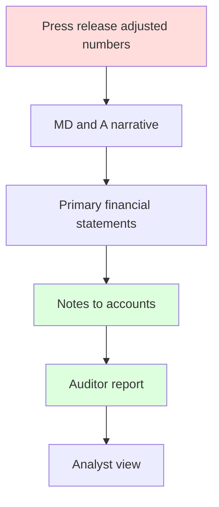
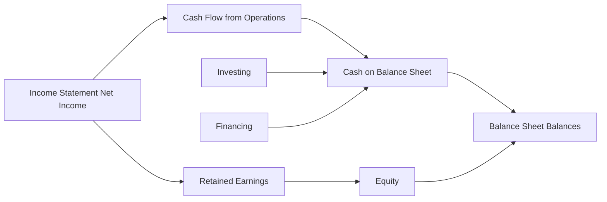
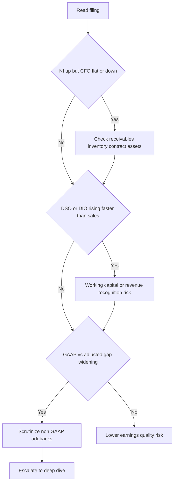

# Reading a 10-K / Annual Report Like an Analyst

## The Problem / Why this matters

A company's three financial statements are the *outputs* of accounting. But a 10-K (the annual report filed with the U.S. SEC) or its international cousin (the statutory annual report under IFRS, or Form 20-F for foreign issuers) is the *whole system*: the numbers, the language management uses to explain them, the fine print in the notes that tells you how the numbers were built, the risks management is legally required to disclose, and an independent auditor's verdict on whether you can trust any of it.

Here is the situation this chapter addresses. You are handed a 200-page filing. You have 90 minutes before an interview, an investment committee, a credit-approval memo, or an FP&A board pack. Ninety-five percent of that document is boilerplate you can skim. Five percent contains the entire story — the accounting choice that flatters earnings, the off-balance-sheet obligation that changes the leverage picture, the customer concentration buried in the risk factors, the one sentence in the auditor's report that says "we spent most of our time on revenue recognition because it's where things could go wrong."

Amateurs read the income-statement top line and stop. Analysts read the notes first, reconcile the cash flow to the income statement, cross-check the MD&A narrative against the numbers, and treat every accounting choice as a decision that could have gone the other way. The gap between those two readers is the gap between getting fooled by Enron, Valeant, Luckin Coffee, or Wirecard — and being the analyst who flagged them early.

In interviews this is the ultimate integration question. "Here's a 10-K, what do you look at?" tests whether you actually understand how accounting fits together, or whether you just memorized that depreciation is a non-cash expense. This chapter is the capstone: it ties revenue recognition, working capital, leases, deferred tax, goodwill, the cash-flow statement, and ratio analysis into a single repeatable workflow.

## Core Idea

**A 10-K is a controlled disclosure document. Management chooses what to emphasize; the accounting standards and the SEC choose what must be disclosed no matter what. The analyst's job is to read *against* the emphasis — to use the mandatory disclosures (notes, risk factors, auditor report, cash-flow statement) to check the voluntary narrative (MD&A, press-release headline numbers).**

The whole discipline reduces to one habit: **never take a reported number at face value until you know how it was constructed and whether it converted to cash.** Earnings are an opinion; cash is a fact. The notes tell you how strong the opinion is.

## Why it works this way

Financial reporting exists because of a *principal–agent problem*. Owners (shareholders, lenders) delegate the running of the business to managers (agents). Managers know more than owners, and managers' pay is often tied to reported numbers. Left unchecked, agents would report whatever makes them look best. Accounting standards, mandatory disclosure, and independent audit are the institutional answer to that conflict.

From first principles, that gives you three "layers of trust" in any filing, and you read them in reverse order of how much the company *wants* you to:

1. **The audited financial statements + notes** — prepared by management but constrained by GAAP/IFRS and checked by an independent auditor. Highest evidentiary value.
2. **The MD&A (Management Discussion & Analysis)** — management's own narrative. Regulated in form (the SEC requires it) but the *spin* is management's. Useful, but read adversarially.
3. **The press release / earnings headline / non-GAAP "adjusted" numbers** — least constrained, most flattering, often the first thing you're shown. Lowest evidentiary value.

The reason the notes are the analyst's home base is that accounting is a set of *choices within rules*. Two identical businesses can report very different earnings by choosing different depreciation lives, revenue-recognition timing, inventory methods (FIFO vs weighted average), or capitalization policies — all perfectly legal. The only place those choices are visible is the notes. So the notes are where accounting stops being arithmetic and starts being *interpretation*, which is exactly where the analyst adds value.



Read bottom-up: the greener the box, the more you trust it.

---

## Full technical content

### 1. Anatomy of a 10-K (US) and the IFRS annual report

A U.S. Form 10-K is organized into four Parts and standard Items. Know the Item numbers cold — interviewers use them as shorthand.

| Part | Item | Content | What the analyst extracts |
|------|------|---------|---------------------------|
| I | 1 | Business | Business model, segments, how it makes money, customers, suppliers |
| I | 1A | **Risk Factors** | The company's own list of what could go wrong: customer concentration, litigation, leverage, key-person, regulation |
| I | 1B | Unresolved staff comments | Open SEC issues — rare, a red flag |
| I | 2 | Properties | Owned vs leased footprint |
| I | 3 | Legal Proceedings | Litigation, regulatory actions |
| II | 5 | Market for stock | Buybacks, dividends, shares outstanding |
| II | 7 | **MD&A** | Management narrative: revenue drivers, margin bridges, liquidity, capital resources |
| II | 7A | Market risk | Interest-rate, FX, commodity sensitivity |
| II | 8 | **Financial Statements & Notes** | Audited numbers + notes + auditor report |
| II | 9A | Controls & Procedures | ICFR (internal control over financial reporting) effectiveness |
| III | 10–14 | Governance, exec comp | Compensation structure (incentives to manage earnings) |
| IV | 15 | Exhibits | Material contracts, debt indentures, subsidiary list |

The IFRS statutory annual report (or Form 20-F) contains the same substance under different labels: a **Strategic Report / Operating & Financial Review** (the MD&A equivalent), **Principal Risks** (risk factors), the four primary statements, and notes. The **auditor's report under ISA 700/701** includes **Key Audit Matters (KAMs)** — the international equivalent of the U.S. **Critical Audit Matters (CAMs)**.

### 2. The four primary statements and how they lock together

You must be able to state, without hesitation, how the statements articulate:

- **Income statement** → produces **net income**.
- Net income flows to the **top of the cash-flow statement** (indirect method) and to **retained earnings** on the balance sheet.
- The **cash-flow statement** explains the **change in the cash line** on the balance sheet.
- **Ending retained earnings = opening RE + net income − dividends.**
- **Assets = Liabilities + Equity** must hold every period.



If any of these ties fails to hold, either you have misread the filing or something is wrong — and both are worth knowing before you speak.

### 3. Reading the MD&A like an analyst

The MD&A is management explaining the numbers in prose. It is *required* by SEC Regulation S-K Item 303 to cover: results of operations, liquidity, and capital resources. The analyst reads it for four things:

1. **The revenue bridge** — how much growth is price vs volume vs FX vs acquisitions? Organic growth (ex-M&A, ex-FX) is the real signal. Management loves to headline total growth when organic is flat.
2. **The margin bridge** — what moved gross margin and operating margin? Mix, input costs, operating leverage, one-offs?
3. **Liquidity & capital resources** — debt maturities, undrawn revolver, covenant headroom, expected capex. This is the credit analyst's home.
4. **Known trends and uncertainties** — Item 303 requires disclosure of any *known* trend reasonably likely to have a material effect. A softening order book, a customer loss, a pricing headwind often lives here in one careful sentence.

**Adversarial reading rules for the MD&A:**

- Compare adjectives to arithmetic. If revenue "grew strongly" but the number is +2%, note the gap.
- Watch for **non-GAAP metrics** (adjusted EBITDA, adjusted EPS, "core" earnings). Under SEC Reg G, companies must reconcile non-GAAP to GAAP. Read the reconciliation: recurring "one-time" charges (restructuring every single year, "non-recurring" acquisition costs for a serial acquirer) are the classic tell.
- Watch what changed *from last year's MD&A*. Dropped disclosures, changed definitions of a KPI (e.g., how "active users" is counted), or a metric that quietly disappears are among the strongest red flags in the whole document.

### 4. Reading the notes for the real story

The notes are numbered and largely standardized. The first note is almost always **Summary of Significant Accounting Policies** — the single most important page in the filing, because it lists every accounting *choice*. Here is the analyst's note-by-note map:

| Note | What it reveals | Red-flag signal |
|------|-----------------|-----------------|
| Significant accounting policies | Revenue recognition method, depreciation lives, inventory method, capitalization policy | A change in policy vs prior year; unusually long asset lives; aggressive capitalization |
| Revenue (ASC 606 / IFRS 15) | Disaggregation, performance obligations, timing (point-in-time vs over-time), contract balances | Growing **unbilled receivables / contract assets** faster than revenue = revenue booked before billing |
| Receivables & allowance | DSO trend, allowance for doubtful accounts, aging | Receivables growing faster than sales; shrinking allowance while sales grow |
| Inventory | FIFO/weighted-average, write-downs, LIFO reserve (US) | Rising inventory vs flat sales = demand weakening or channel stuffing |
| PP&E & depreciation | Useful lives, capex vs depreciation | Extending useful lives to lower depreciation; capitalizing costs peers expense |
| Leases (ASC 842 / IFRS 16) | ROU assets, lease liabilities, maturities | Large operating-lease obligations now on balance sheet; still-hidden short-term/variable leases |
| Goodwill & intangibles | Acquisition history, impairment tests, reporting-unit headroom | Goodwill large vs equity; repeated no-impairment despite falling segment performance |
| Debt | Maturity schedule, rates, covenants, secured vs unsecured | Near-term maturity wall; tight covenant headroom |
| Income taxes | Effective vs statutory rate reconciliation, deferred tax assets/liabilities, valuation allowance | Low cash tax vs book tax sustained; large DTA reliant on future profits; VA changes flattering EPS |
| Commitments & contingencies | Off-balance-sheet guarantees, purchase commitments, litigation | Guarantees, take-or-pay contracts, unreserved litigation |
| Segments | Revenue/profit by segment and geography | One segment subsidizing losses in another; concentration |
| Related-party transactions | Deals with insiders/affiliates | Any material related-party revenue — a top fraud marker |
| Subsequent events | What happened after year-end but before filing | Debt raise, covenant waiver, major loss |

**The single highest-value habit: reconcile net income to operating cash flow using the notes.** If earnings are rising but operating cash flow is flat or falling, the notes on receivables, inventory, and revenue tell you why. Accrual-heavy earnings that never convert to cash are the number-one warning sign of low earnings quality.

### 5. Accounting choices — the same business, two different profits

Accounting standards permit ranges. The analyst's job is to normalize across them. Key choice points:

| Item | Choice A | Choice B | Effect of the more aggressive choice |
|------|----------|----------|--------------------------------------|
| Depreciation | Shorter life / accelerated | Longer life / straight-line | Longer life → lower depreciation → higher near-term earnings |
| Inventory (US) | FIFO | LIFO | In inflation, FIFO → lower COGS → higher profit, higher tax |
| Revenue timing | Point-in-time | Over-time / percentage-of-completion | Over-time can pull revenue forward, create unbilled receivables |
| Cost treatment | Expense (e.g., R&D, software) | Capitalize | Capitalizing boosts current earnings, defers cost |
| Leases | — | ASC 842 / IFRS 16 (all on B/S now) | IFRS 16 shifts lease cost from operating expense to D&A + interest, flattering EBITDA |

The mechanism to remember: **aggressive choices pull income into the present and push expense into the future.** They boost *this year's* EPS at the cost of *next year's*. The cash-flow statement is largely immune to these choices (cash is cash), which is exactly why cross-checking earnings against cash is the master test.

### 6. Earnings-quality red-flag toolkit

Red flags are patterns, not single numbers. The strongest are *divergences* — two things that should move together but don't.

1. **Net income up, operating cash flow down/flat.** Accruals inflating earnings.
2. **Receivables (DSO) rising faster than sales.** Channel stuffing, aggressive revenue recognition, or collection problems.
3. **Inventory (DIO) rising faster than sales.** Demand softening, obsolescence risk, or hidden margin problem.
4. **Contract assets / unbilled receivables growing fast.** Revenue booked ahead of cash and billing.
5. **Falling effective tax rate boosting EPS**, especially from a deferred-tax valuation-allowance release.
6. **Serial "one-time" charges.** Restructuring every year is a recurring cost dressed as non-recurring.
7. **Capitalizing costs peers expense** (interest, software dev, subscriber-acquisition costs).
8. **Extending useful lives / changing estimates** in a way that just happens to hit a target.
9. **Growing gap between GAAP and "adjusted" numbers.**
10. **Frequent changes**: auditor, CFO, accounting policy, KPI definition, or fiscal year-end.
11. **Related-party revenue** or round-trip transactions.
12. **Goodwill large relative to equity with no impairment** despite a declining share price or segment.
13. **A "going concern" paragraph** or covenant-waiver disclosure in subsequent events.



### 7. The auditor's report — reading the verdict

The auditor's report is short and every word is load-bearing. Structure (US PCAOB AS 3101 / international ISA 700):

- **Opinion paragraph** — the verdict. Four possibilities:

| Opinion | Meaning | Analyst reaction |
|---------|---------|------------------|
| **Unqualified / Unmodified ("clean")** | Statements present fairly in all material respects | Normal — proceed |
| **Qualified ("except for")** | Fair *except* for one specific issue | Isolate and quantify the exception |
| **Adverse** | Statements do *not* present fairly | Do not rely on the numbers |
| **Disclaimer** | Auditor cannot form an opinion (scope limitation) | Major red flag |

- **Basis for opinion** — auditor independence and standards followed.
- **Going-concern paragraph** — if present, the auditor has substantial doubt the company survives 12 months. This is one of the most powerful single signals in any filing.
- **Critical Audit Matters (CAMs, US) / Key Audit Matters (KAMs, intl)** — areas that were especially difficult, subjective, or judgmental for the auditor. This is a *gift* to the analyst: **the auditor is telling you where the accounting is most fragile.** If revenue recognition or goodwill impairment is a CAM, that is exactly where you focus.
- **ICFR opinion (US, Item 9A / SOX 404)** — a separate opinion on internal controls. A **"material weakness"** disclosure means a real possibility that a material misstatement would not be prevented or detected. Serious.
- The **auditor's name, tenure, and city**. Long undisturbed tenure, a tiny unknown auditor for a large company, or a recent auditor change all warrant a second look.

### 8. From statements to an analytical view — normalization

The reported statements are the raw material. The analyst builds an *analytical* view:

1. **Normalize earnings** — strip genuine one-offs (real restructuring, asset sales, litigation settlements), but *add back* fake "one-offs" that recur. Goal: sustainable, repeatable earnings power.
2. **Reclassify** — move operating leases, capitalize/decapitalize items, treat unusual items consistently across peers and years.
3. **Build the cash view** — free cash flow = CFO − maintenance capex. Test how much reported profit becomes cash.
4. **Recompute leverage on a true-economic basis** — include lease liabilities, pension deficits, and off-balance-sheet guarantees in net debt.
5. **Ratio and trend analysis** — margins, returns (ROE, ROIC), turnover (DSO, DIO, DPO → cash conversion cycle), coverage (EBIT/interest), and liquidity (current, quick).
6. **Compare across time and peers** — a ratio is meaningless alone; the trend and the peer gap carry the signal.

---

## Worked examples

### Worked Example 1 — Earnings up, cash flat: the accruals test

**Setup.** MapleTech reports two years. You want to know whether rising profit is real.

| Income statement | Year 1 | Year 2 |
|---|---|---|
| Revenue | 1,000 | 1,200 |
| COGS | (600) | (700) |
| Gross profit | 400 | 500 |
| Operating expenses | (250) | (300) |
| Depreciation | (50) | (55) |
| Operating profit (EBIT) | 100 | 145 |
| Interest | (20) | (25) |
| Pre-tax profit | 80 | 120 |
| Tax at 25% | (20) | (30) |
| **Net income** | **60** | **90** |

Net income jumped 50% (60 → 90). Management headlines it. Now the balance-sheet working-capital lines from the notes:

| Balance sheet (working capital) | Year 1 | Year 2 | Change |
|---|---|---|---|
| Accounts receivable | 150 | 260 | +110 |
| Inventory | 100 | 170 | +70 |
| Accounts payable | 90 | 100 | +10 |

**Step 1 — Build operating cash flow (indirect method), Year 2.**

```
Net income                         90
+ Depreciation (non-cash)          55
− Increase in receivables        (110)
− Increase in inventory           (70)
+ Increase in payables             10
= Cash flow from operations       (25)
```

**Step 2 — Interpret.** Net income is +90, but operating cash flow is **−25**. Earnings rose 50% while the business *consumed* cash. Every extra dollar of profit (and more) was tied up in receivables and inventory.

**Step 3 — Diagnose using the notes.**
- DSO Year 1 = 150 / 1,000 × 365 = **54.8 days**; Year 2 = 260 / 1,200 × 365 = **79.1 days.** Receivables ballooned — either aggressive revenue recognition or customers not paying.
- DIO Year 1 = 100 / 600 × 365 = **60.8 days**; Year 2 = 170 / 700 × 365 = **88.6 days.** Inventory piling up — demand softening or obsolescence risk.

**Conclusion.** Low earnings quality. The 50% profit growth did not convert to cash; it converted to receivables and inventory. Interview line: *"Net income grew 50% but operating cash flow went negative — the entire increase and more was absorbed by a 24-day jump in DSO and a 28-day jump in DIO. I'd challenge revenue recognition and collectability before believing the earnings."* All figures internally consistent: the CFO of −25 exactly equals 90 + 55 − 110 − 70 + 10.

### Worked Example 2 — Normalizing "adjusted" earnings and the tax tell

**Setup.** ClearWave presents GAAP and "adjusted" results. You test the add-backs.

| Item | Amount |
|---|---|
| GAAP net income | 120 |
| Add-back: restructuring | 40 |
| Add-back: stock-based compensation | 60 |
| Add-back: "one-time" acquisition costs | 25 |
| Add-back: amortization of acquired intangibles | 30 |
| **Company "adjusted" net income** | **275** |

The company also notes: it has run a restructuring charge in **each of the last four years**, and it has closed **three acquisitions in two years**.

**Step 1 — Scrutinize each add-back.**
- **Stock-based compensation (+60):** a *real, recurring* economic cost — it dilutes shareholders. Adding it back is aggressive. **Reject.**
- **Restructuring (+40):** charged every year for four years — this is a recurring operating cost, not a one-off. **Reject as non-recurring.**
- **"One-time" acquisition costs (+25):** the company is a serial acquirer; deal costs recur. **Reject as one-time.**
- **Amortization of acquired intangibles (+30):** non-cash, and analysts often add it back for cash-earnings views — but it reflects a real capital outlay (the acquisition). **Accept only for a cash-EPS view, not for economic earnings.**

**Step 2 — Build the analyst's normalized earnings (economic view).**

```
GAAP net income                              120
+ Amortization of acquired intangibles        30   (accept, non-cash)
− Nothing else added back
= Analyst normalized net income              150
```

Company claims 275; analyst gets 150. The company's "adjusted" figure is **83% higher than GAAP** and **83% higher than a defensible normalized number.**

**Step 3 — The tax tell.** Suppose GAAP tax expense is 40 (on pre-tax book profit of 160, a 25% effective rate) but cash taxes paid per the cash-flow statement are only 8. A sustained gap where cash tax << book tax means either large timing differences (deferred tax liabilities building) or a valuation-allowance release flattering the P&L. Either way, book earnings overstate the cash the business actually keeps.

**Conclusion.** Interview line: *"Their adjusted number adds back stock comp and 'one-time' restructuring that has recurred four years running — those are real recurring costs. I'd normalize to roughly 150, not 275, and I'd flag that cash taxes are running far below book tax, so even the GAAP number overstates cash earnings."*

### Worked Example 3 — Off-balance-sheet leverage and the true credit picture

**Setup.** You are a credit analyst on RetailCo. The reported balance sheet looks moderately levered, but the notes reveal lease obligations.

| Reported (pre-lease-cap view) | Amount |
|---|---|
| Reported debt | 400 |
| Cash | 100 |
| EBITDA (reported) | 200 |
| Operating-lease commitments (undiscounted, from notes) | 500 |
| Present value of lease liabilities (from ASC 842 / IFRS 16 note) | 420 |
| Annual lease/rent expense (in EBITDA as operating cost) | 60 |

**Step 1 — Reported leverage (ignoring leases).**

```
Net debt = 400 − 100 = 300
Net debt / EBITDA = 300 / 200 = 1.5x   (looks comfortable)
```

**Step 2 — Capitalize the leases into net debt and adjust EBITDA.** Under IFRS 16 the lease liability (420) is already on the balance sheet, and rent (60) is removed from operating expense and split into depreciation + interest — so IFRS EBITDA is *higher*. For a like-for-like economic view, add the lease liability to debt and add rent back to the pre-IFRS EBITDA to get "EBITDAR."

```
Adjusted net debt = 400 + 420 − 100 = 720
Adjusted EBITDAR  = 200 + 60 = 260
Adjusted leverage = 720 / 260 = 2.77x
```

**Step 3 — Coverage check.** Suppose reported interest is 25 and the imputed interest on the lease liability is ~20 (≈ 420 × ~4.8%).

```
EBITDAR / (interest + rent) = 260 / (25 + 60) = 260 / 85 = 3.06x
```

versus the naive EBIT/interest that ignored leases entirely.

**Step 4 — Interpret.** True economic leverage is **2.8x, not 1.5x** — nearly double. For a covenant set at, say, 3.0x, RetailCo has far less headroom than the reported balance sheet suggests, and a single weak year could breach it. Interview line: *"On a reported basis leverage is 1.5x, but the lease note adds 420 of PV lease liabilities. On an economic EBITDAR basis, leverage is 2.8x with only 3x fixed-charge coverage — that changes the credit decision. Off-balance-sheet obligations in the notes are exactly where reported leverage hides."* All numbers tie: 720/260 = 2.77x; 260/85 = 3.06x.

---

## How it is tested in interviews

**Q1. "Walk me through what you look at first in a 10-K."**
Model answer: *"I start at the back, not the front. First the auditor's report — is the opinion clean, is there a going-concern paragraph, and what are the Critical Audit Matters, because that's where the auditor thinks the accounting is most fragile. Then the cash-flow statement, and I reconcile net income to operating cash flow. Then the notes — significant accounting policies, revenue recognition, receivables, debt, and leases. I read the MD&A last, adversarially, checking the narrative against the numbers. The press-release adjusted figures I trust least."*

**Q2. "A company's earnings are growing but I'm worried. What one thing do you check?"**
*"Whether earnings are converting to cash. I'd compare net income to operating cash flow over three years. If profit is rising while operating cash flow is flat or negative, the accruals — receivables, inventory, contract assets — are inflating earnings. Then I'd pull DSO and DIO to locate it."*

**Q3. "What's a Critical Audit Matter and why do you care?"**
*"A CAM is an area the auditor found especially subjective or difficult — usually revenue recognition, goodwill impairment, or complex valuations. It's the auditor pointing at where the numbers are most judgment-driven. It tells me exactly where to spend my time and where a restatement is most likely."*

**Q4. "How can two identical companies report different profits legally?"**
*"Accounting choices. Longer depreciation lives, FIFO vs LIFO in inflation, capitalizing vs expensing R&D or software, revenue timing (point-in-time vs over-time). All are legal and all live in the notes. Aggressive choices pull income forward and push expense out. Cash flow is largely immune, which is why I cross-check earnings against cash."*

**Q5. "You see restructuring charges add-backs in adjusted EPS. Reaction?"**
*"I check how many years running. A genuine one-time restructuring I'll accept; restructuring every year for four years is a recurring operating cost dressed as non-recurring, and I'd add it back into the cost base. Same logic for stock comp — it's a real recurring cost that dilutes shareholders, so I don't accept adding it back for an economic view."*

**Q6. "Where does off-balance-sheet leverage hide, and how do you find it?"**
*"Leases (now mostly on-balance-sheet under ASC 842 / IFRS 16, but variable and short-term leases still aren't fully captured), purchase commitments and take-or-pay contracts, guarantees, and pension deficits — all in the commitments-and-contingencies and lease notes. I capitalize the lease liabilities into net debt and recompute leverage on an EBITDAR basis to get the true credit picture."*

**Q7. "What in the notes would make you suspect revenue-recognition problems?"**
*"Contract assets or unbilled receivables growing much faster than revenue means revenue is booked ahead of billing and cash. Rising DSO, a shrinking bad-debt allowance while sales grow, a change in the revenue-recognition policy, or material related-party revenue. And if revenue recognition is a CAM, that's confirmation of where to dig."*

**Q8. "Net income is 90, D&A is 55, receivables up 110, inventory up 70, payables up 10. What's operating cash flow?"**
*"90 + 55 − 110 − 70 + 10 = negative 25. Profit of 90 but cash burn of 25 — the earnings aren't converting; working capital is eating them."*

**Q9. "What does a 'material weakness' in internal controls tell you?"**
*"That there's a reasonable possibility a material misstatement in the financials wouldn't be prevented or detected in time. It doesn't mean the numbers are wrong, but it means the control environment that's supposed to guarantee them is broken — I'd discount reliability and watch for restatement."*

**Q10. "Adverse vs disclaimer vs qualified opinion — rank by how worried you are."**
*"Clean is fine. Qualified 'except for' is contained — one issue, quantify it. Adverse means the statements as a whole don't present fairly — I can't rely on them. Disclaimer means the auditor couldn't even form an opinion, usually a scope limitation — that's the worst, because it signals the auditor was blocked or the records don't support an opinion at all."*

## Traps & common mistakes

- **Reading front-to-back.** The glossy front is marketing. Start with the auditor's report and cash-flow statement.
- **Trusting adjusted/non-GAAP numbers.** Always reconcile to GAAP and reject recurring "one-offs" and stock-comp add-backs for an economic view.
- **Looking at one year.** Red flags are trends and divergences. One year of high DSO is noise; three rising years is a signal.
- **Ignoring the cash-flow statement.** It's the lie-detector. Earnings can be engineered; cash is far harder to fake for long.
- **Forgetting off-balance-sheet items.** Leases, pensions, guarantees, and purchase commitments change leverage materially.
- **Skipping the "significant accounting policies" note.** It lists every choice; a change there is often the whole story.
- **Confusing the ICFR opinion with the financial-statement opinion.** They are two separate opinions in a US 10-K; a company can have clean financials but a material weakness in controls.
- **Treating CAMs/KAMs as boilerplate.** They are the auditor's map to the riskiest accounting — the opposite of boilerplate.
- **Assuming a clean opinion means "healthy."** A clean opinion means "fairly stated per GAAP," not "good business" or "will survive." Going concern and covenant risk can sit behind a clean opinion.
- **Ignoring changes in KPI definitions.** A quietly redefined "active user" or "bookings" metric can manufacture growth.

## First-principles recap

- A 10-K is a controlled disclosure built to resolve the owner–manager conflict; read the *mandatory* parts (notes, auditor report, cash flow) to check the *voluntary* narrative (MD&A, adjusted numbers).
- Earnings are an opinion; cash is a fact. The master test of earnings quality is whether net income converts to operating cash flow.
- Every reported number is the output of a *choice within rules*; those choices are visible only in the notes, and aggressive choices pull income forward.
- Red flags are divergences — profit vs cash, receivables vs sales, GAAP vs adjusted, narrative vs arithmetic — not single numbers.
- The auditor's report is short and load-bearing: the opinion type, any going-concern paragraph, and the CAMs/KAMs tell you where to focus and whether to trust the numbers at all.
- The analyst's job is to *normalize*: strip fake one-offs, capitalize off-balance-sheet obligations, and rebuild leverage and earnings on an economic basis before comparing across time and peers.

## Quick-reference

| Concept | Formula / rule |
|---|---|
| Operating cash flow (indirect) | Net income + non-cash charges − Δ working capital |
| Days sales outstanding (DSO) | Receivables / Revenue × 365 |
| Days inventory outstanding (DIO) | Inventory / COGS × 365 |
| Days payables outstanding (DPO) | Payables / COGS × 365 |
| Cash conversion cycle | DSO + DIO − DPO |
| Free cash flow | CFO − maintenance capex |
| Net debt | Total debt − cash (add lease liabilities, pension deficit for economic view) |
| Leverage | Net debt / EBITDA (or EBITDAR incl. leases) |
| Fixed-charge coverage | EBITDAR / (interest + rent) |
| Accruals ratio | (Net income − CFO) / average total assets (high = low quality) |
| Effective tax rate | Tax expense / pre-tax income (compare to cash tax paid) |

| 10-K map | Where to look |
|---|---|
| What could go wrong (company's own view) | Item 1A Risk Factors |
| Revenue drivers, liquidity, known trends | Item 7 MD&A |
| The numbers + notes + auditor report | Item 8 |
| Internal-control effectiveness | Item 9A (ICFR / SOX 404) |
| Off-balance-sheet obligations | Commitments & contingencies; lease note |
| Where accounting is most fragile | Auditor report — CAMs / KAMs |

| Auditor opinion | Trust level |
|---|---|
| Unqualified / clean | Proceed |
| Qualified ("except for") | Isolate & quantify the exception |
| Adverse | Do not rely |
| Disclaimer | Worst — auditor could not opine |
| + Going-concern paragraph | Survival doubt — major flag regardless of opinion type |
