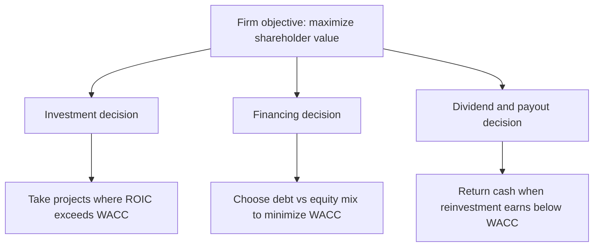
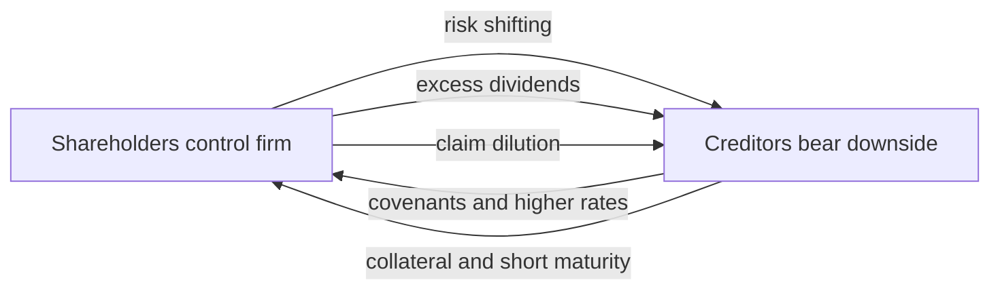
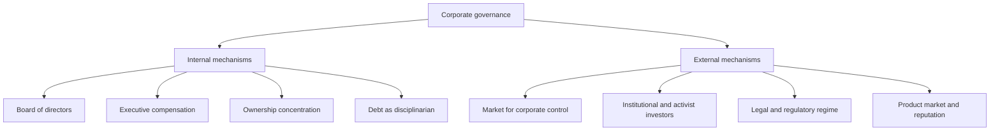
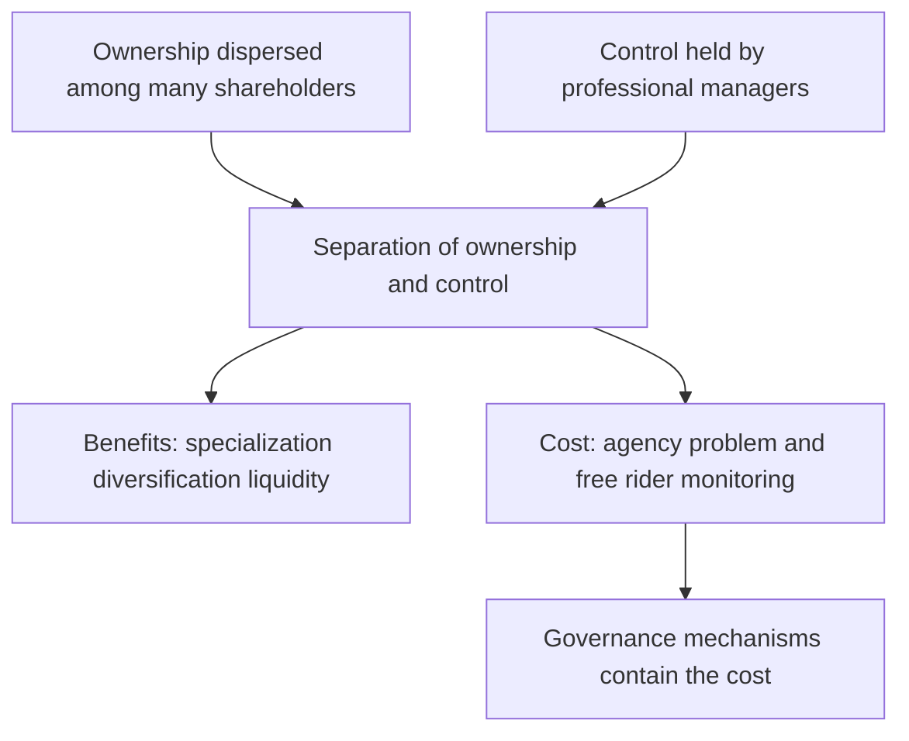

# The Goals of Corporate Finance & the Agency Problem

## The Problem / Why this matters

Every decision a company makes — building a factory, issuing debt, buying back stock, paying a dividend, acquiring a rival, granting the CEO stock options — is ultimately answerable to one question: **whose interests is this decision serving, and how do we know it's the right one?**

Corporate finance is not, at its core, about spreadsheets. It is about **allocating scarce capital under conflicting incentives**. A firm is a legal fiction that sits at the center of a web of contracts: shareholders who supply equity, creditors who lend money, managers who run operations, employees who supply labor, customers who buy output, suppliers who extend trade credit, and governments who tax and regulate. Each of these parties wants something different, and the resources to satisfy them all are finite. Somebody has to decide.

The reason this is the **first** chapter of a corporate-finance book — and the reason it shows up in interviews across equity research, credit, FP&A, and investment banking — is that **every valuation model and every financing decision rests on an assumption about the firm's objective.** When you build a DCF, you are implicitly assuming the firm is trying to maximize the present value of cash flows to its capital providers. When a credit analyst worries about a leveraged dividend recap, they are worrying about an *agency conflict* between shareholders and creditors. When an FP&A analyst designs a bonus scorecard, they are trying to *align incentives*. If you don't understand the objective function and the frictions that stop firms from achieving it, you're just doing arithmetic without knowing what you're solving for.

The uncomfortable truth that makes this chapter necessary is: **the people who make corporate decisions (managers) are usually not the people who own the firm (shareholders).** This *separation of ownership and control* is the single most consequential fact in corporate governance. It creates the **agency problem** — and almost the entire apparatus of modern corporate finance (governance, executive compensation, capital structure discipline, activist investors, takeovers) exists to manage it.

## Core Idea

In plain language:

> **The standard objective of corporate finance is to maximize the long-run value of the firm to its owners — that is, to maximize shareholder wealth, measured as the present value of expected future cash flows discounted at a rate that reflects their risk. But because managers act as *agents* for shareholders (the *principals*) and have their own interests, real firms suffer *agency costs* that pull them away from that objective. Corporate governance is the system of mechanisms — boards, incentives, monitoring, markets — designed to close that gap.**

Three ideas do most of the work in this chapter:

1. **The objective:** Maximize shareholder value (with important debate about stakeholders). Value, not accounting profit; long-run, not short-run; cash flow, not earnings.
2. **The three decisions:** Every act of corporate finance reduces to (i) the **investment decision** — what real assets to buy; (ii) the **financing decision** — how to fund them (debt vs equity); and (iii) the **dividend / payout decision** — how much cash to return vs reinvest.
3. **The frictions:** The **agency problem** — manager-vs-shareholder and shareholder-vs-creditor conflicts — plus **information asymmetry**, which prevent the objective from being reached automatically. **Governance** is the response.

## Why it works this way — first-principles reasoning

Why *shareholders*? Why not employees, or society, or the CEO's ego?

Start from the structure of the claims on a firm. A company generates a stream of cash. Out of that cash, it pays parties in a **fixed, contractual order of priority** (the "waterfall"):

1. Suppliers and employees (operating costs) — paid first, fixed claims.
2. Government (taxes).
3. Creditors (interest and principal) — **fixed** claims with legal priority; they get paid a contractually agreed amount, no more.
4. Preferred shareholders — a fixed dividend, senior to common.
5. **Common shareholders** — they get **whatever is left**, and only if there is anything left.

Common shareholders are the **residual claimants**. This is the key to the whole logic. Because every other party has a *fixed* claim that must be satisfied first, the residual claimant only prospers if the firm generates *more* than enough to pay everyone else. This has three profound consequences:

- **Aligned with efficiency.** To maximize the residual, you must first maximize the total pie *and* control costs — which means you must have served customers well, paid suppliers, and honored debt. Maximizing the residual therefore tends (in a world of complete contracts and no externalities) to maximize total value. This is the classic economic defense of shareholder primacy.
- **Bears the most risk.** Because they are last in line, shareholders absorb the firm's risk. In exchange, they get **control rights** — the vote. It is efficient to give control to the party whose payoff is most sensitive to the quality of decisions, because they have the sharpest incentive to decide well.
- **A clean, measurable objective.** "Maximize shareholder value" gives managers a single, well-defined maximand. "Balance all stakeholders" gives them a vector with no defined trade-off weights — which, as we'll see, can become a license to be accountable to no one.

Why *value* and not *profit*? Because profit is an accounting number for a single period; it ignores (a) the *timing* of cash (a rupee next year is worth less than a rupee today), (b) the *risk* of the cash (uncertain cash is worth less than certain cash), and (c) the *investment required* to earn it. Value — the risk-adjusted present value of all future cash flows — captures all three. A manager can boost this year's EPS by cutting R&D and maintenance, but destroy value. Value is the honest scorecard.

Why does the **agency problem** arise at all? Because of the separation of ownership and control plus **incomplete contracts**. You cannot write a contract that specifies the right managerial action in every future state of the world — the world is too complex. So shareholders must delegate **discretion** to managers. Discretion + divergent interests + asymmetric information (managers know more about the business than owners do) = the manager can pursue their own goals (empire-building, perks, quiet life, entrenchment) at the owners' expense, and the owners can't perfectly detect or prevent it. That residual loss, plus the cost of trying to prevent it, is the **agency cost.**

Everything else in the chapter — governance, compensation, leverage, dividends, takeovers — is a *response* to that irreducible fact.

## Full technical content

### 1. The objective of the firm

**Shareholder wealth maximization (SWM).** The normative goal of corporate finance under the classical (Anglo-American) view is to **maximize the wealth of the firm's common shareholders**, operationalized as maximizing the **market value of the firm's equity** (or, for private firms, the intrinsic value of equity).

Formally, the value of equity is:

```
Value of Equity (E) = Σ [ FCFE_t / (1 + k_e)^t ]   for t = 1 … ∞
```

where `FCFE_t` = free cash flow to equity in year *t*, and `k_e` = cost of equity (the return shareholders require for the risk they bear).

Equivalently, at the whole-firm (enterprise) level:

```
Enterprise Value (EV) = Σ [ FCFF_t / (1 + WACC)^t ]
Equity Value = EV − Net Debt
```

where `FCFF` = free cash flow to the firm, and `WACC` = weighted average cost of capital.

**Why "maximize value" ≠ "maximize profit":**

| Objective | What it ignores | Why it can mislead |
|---|---|---|
| Maximize accounting profit / EPS | Timing, risk, capital invested, non-cash distortions | Can be gamed by cutting good long-term spend or by aggressive accruals |
| Maximize this year's sales / market share | Profitability, cost, capital | "Growth at any cost" destroys value if ROIC < WACC |
| Maximize **shareholder value** | Nothing of the above | Captures cash, timing, risk, and reinvestment together |

**Value is created only when ROIC > WACC.** A firm that grows while earning a return on invested capital *below* its cost of capital **destroys** value with every rupee it invests. This single inequality — *return on capital vs cost of capital* — is the beating heart of value-based management and the thing interviewers most want you to internalize.

```
Economic Value Added (EVA) = (ROIC − WACC) × Invested Capital
Value created > 0  ⟺  ROIC > WACC
```

**Shareholder value vs Stakeholder theory.** The **stakeholder** view (associated with R. Edward Freeman, and echoed in the 2019 US Business Roundtable statement and in ESG) holds that the firm should be run for the benefit of *all* stakeholders — employees, customers, suppliers, communities, environment — not shareholders alone. The debate:

| Dimension | Shareholder primacy (Friedman, Jensen) | Stakeholder theory (Freeman, ESG) |
|---|---|---|
| Primary objective | Maximize shareholder value | Balance all stakeholders' interests |
| Accountability | Clear, single maximand | Diffuse — "accountable to all = accountable to none" (Jensen's critique) |
| Long-run reconciliation | **Enlightened value maximization:** you *cannot* maximize long-run value while abusing employees, customers, or the environment | Serving stakeholders *is* the route to durable value |
| Risk | Short-termism; ignoring externalities | Managerial unaccountability; empire-building disguised as "purpose" |
| Legal (varies) | Directors owe fiduciary duty to the company/shareholders | Some jurisdictions permit/require stakeholder consideration (e.g., UK s.172 "enlightened shareholder value") |

The mature, interview-ready synthesis is **enlightened value maximization** (Jensen, 2001): the firm's *objective function* is long-run market value, but management recognizes that value cannot be maximized while ignoring key stakeholders, because unhappy employees, cheated customers, and litigating regulators all destroy future cash flows. Stakeholder *satisfaction* is largely an *input* to long-run shareholder value, not a competing objective. Where they genuinely conflict (e.g., pollution as an uncompensated externality), that's a job for regulation/taxation, not for abandoning a coherent corporate objective.

### 2. The three core corporate-finance decisions

Everything a corporate finance function does maps to three decisions.



**(a) The investment (capital budgeting) decision.** *Which real assets should the firm own?* Rule: invest in every project whose **NPV > 0**, i.e., whose return exceeds the risk-adjusted cost of capital.

```
NPV = −Initial Outlay + Σ [ CF_t / (1 + r)^t ]
Accept if NPV > 0  (equivalently, if IRR > cost of capital, for conventional cash flows)
```

This is where value is *created*. Financing and dividend decisions mostly determine how value is *divided and packaged*; the investment decision determines how much value there is.

**(b) The financing (capital structure) decision.** *How should the firm fund its assets — debt, equity, or a mix?* The goal is to choose the mix that **minimizes WACC** (and thereby maximizes firm value), balancing:

- **Benefits of debt:** interest is tax-deductible (the *tax shield*); debt is cheaper than equity; leverage imposes discipline on managers (Jensen's *free-cash-flow* argument — debt forces cash out as mandatory interest, curbing empire-building).
- **Costs of debt:** rising probability of **financial distress** and **bankruptcy costs**; **agency costs of debt** (see below).

```
WACC = (E/V) × k_e + (D/V) × k_d × (1 − Tax rate)
```

The trade-off theory says an optimal (interior) capital structure exists where the marginal tax benefit of more debt equals the marginal distress + agency cost.

**(c) The dividend / payout decision.** *Of the cash generated, how much to return to shareholders (dividends or buybacks) vs reinvest?* First-principles rule:

> **Return cash to shareholders whenever the firm cannot reinvest it in projects earning more than the cost of capital.** Retaining cash to fund NPV-negative projects (or to sit idle) destroys value; shareholders can invest it elsewhere at the market rate.

Payout can be via **dividends** (sticky, signal stability) or **share buybacks** (flexible, tax-efficient in many regimes, signal undervaluation). Miller–Modigliani showed that in perfect markets dividend policy is *irrelevant* to value; real-world frictions (taxes, signaling, agency, clientele effects) make it matter.

These three decisions are interdependent, and the agency problem shows up in *each* of them:

| Decision | Value-maximizing rule | How agency distorts it |
|---|---|---|
| Investment | Accept NPV > 0 | Empire-building (overinvestment); pet projects; excessive diversification |
| Financing | Minimize WACC | Too little debt (managers avoid discipline & risk) or too much (equity risk-shifting) |
| Dividend | Pay out when ROIC < WACC | Hoarding free cash flow to control it; underpayment |

### 3. The agency problem

An **agency relationship** exists whenever one party (the **principal**) hires another (the **agent**) to act on their behalf and delegates decision-making authority to them. In a company, shareholders (principals) hire managers (agents). The **agency problem** is the conflict that arises because the agent has *different interests* from the principal and *superior information*, and contracts cannot fully constrain the agent's discretion.

**Jensen & Meckling (1976)** defined **agency costs** as the sum of three components:

```
Agency Cost = Monitoring costs + Bonding costs + Residual loss
```

| Component | Who bears it | Example |
|---|---|---|
| **Monitoring costs** | Principal | Audits, board oversight, analyst scrutiny, proxy advisors |
| **Bonding costs** | Agent | Manager accepting restrictive covenants, holding equity, reputation-building |
| **Residual loss** | Principal | The value still lost despite monitoring + bonding — the irreducible gap |

#### 3.1 Conflict A — Managers vs Shareholders (the classic agency problem)

Because managers control the firm but own little of it, they can pursue private benefits at owners' expense:

- **Empire-building:** growing the firm (via low-return projects or value-destroying M&A) because bigger firms mean more prestige, pay, and power — even when it lowers per-share value.
- **Perquisite consumption ("perks"):** corporate jets, plush offices, entourage.
- **Managerial entrenchment:** protecting their own jobs — resisting takeovers (poison pills, golden parachutes), avoiding beneficial risk, retaining excess cash as a buffer.
- **The "quiet life":** avoiding hard decisions (plant closures, layoffs, restructuring) because effort is costly and conflict is unpleasant.
- **Short-termism / earnings management:** hitting quarterly EPS targets tied to bonuses at the expense of long-term investment.
- **Excessive risk-aversion:** managers' human capital and reputation are undiversified and tied to the firm, so they may reject positive-NPV *risky* projects that diversified shareholders would want.
- **Free-cash-flow problem (Jensen 1986):** managers of cash-rich, low-growth firms would rather *keep* free cash flow (to invest in empire-building) than pay it out, even when payout is value-maximizing.

**Root causes:**
1. **Separation of ownership and control** (Berle & Means, 1932) — see §5.
2. **Information asymmetry** — managers know more about the firm than dispersed owners; owners can't fully observe effort or intent.
3. **Diffuse ownership & the free-rider problem** — when thousands of small shareholders each own a sliver, no single one has the incentive to bear the cost of monitoring; they all hope someone else does, so *no one does*.

#### 3.2 Conflict B — Shareholders vs Creditors (agency costs of debt)

Once a firm has debt, shareholders (who control the firm and are residual claimants) have incentives to expropriate value from creditors (fixed claimants). Because equity is like a **call option** on the firm's assets (limited liability caps the downside at zero, unlimited upside), shareholders like *volatility*; creditors, holding what is essentially a *short put*, hate it. Four classic conflicts:

| Conflict | Mechanism | Who loses |
|---|---|---|
| **Asset substitution / risk-shifting** | After borrowing, swap safe assets/projects for riskier ones. Upside → shareholders; downside → creditors | Creditors (their fixed claim gets riskier without higher yield) |
| **Underinvestment / debt overhang (Myers 1977)** | When a firm is near distress, shareholders reject positive-NPV projects because the gains accrue mostly to creditors (shoring up their claim) | Shareholders *and* firm value — good projects skipped |
| **Claim dilution** | Issue new debt of equal/higher priority, diluting existing creditors' claim | Existing creditors |
| **Excessive dividends / cash payout (leveraged recap)** | Borrow or drain cash and pay it to shareholders, leaving less asset backing for creditors | Creditors |

**Creditors are not naïve.** They anticipate these behaviors and **price them in** (higher interest rates) or **contract against them** via **covenants** — restrictions on dividends, additional debt, asset sales, and minimum coverage ratios; plus security/collateral, shorter maturities, and convertibility. These protections are the *bonding/monitoring* response to the debt agency problem, and understanding them is the core of credit analysis.



### 4. Corporate governance mechanisms

**Corporate governance** is the system of rules, practices, incentives, and institutions by which companies are directed and controlled, aligning managerial behavior with the interests of shareholders (and, in broader definitions, other stakeholders). Governance mechanisms split into **internal** and **external**.



#### 4.1 Internal mechanisms

**(a) Board of directors.** Elected by shareholders, the board hires/fires/compensates the CEO, ratifies major strategy, and monitors on behalf of owners. Effectiveness drivers:
- **Independence:** a majority of *independent* (non-executive, non-affiliated) directors who can objectively challenge management.
- **Separation of Chair and CEO:** if the CEO also chairs the board, the person being monitored controls the monitor. Splitting the roles (or appointing a strong *Lead Independent Director*) improves oversight.
- **Key committees, all independent:** **Audit** (financial integrity), **Compensation/Remuneration** (pay-for-performance), **Nomination** (board composition).
- **Board expertise, diversity, and engagement;** avoidance of overboarding and cronyism.

**(b) Executive compensation — aligning incentives.** The most direct fix for the manager-shareholder conflict is to make managers *think like owners*:
- **Equity-based pay:** stock options and restricted stock units (RSUs) tie wealth to share price. Options give upside leverage but can encourage excessive risk; **restricted/performance shares** with vesting are now preferred.
- **Long-term incentive plans (LTIPs)** with multi-year vesting and **performance conditions** (e.g., relative TSR, ROIC targets) combat short-termism.
- **Clawbacks** (recover pay after misstatement), **share ownership guidelines**, and **malus** provisions.
- *Caveat:* poorly designed pay *creates* agency problems — options can incentivize earnings manipulation and risk-shifting; peer-benchmarking ratchets pay upward. Comp is a double-edged sword.

**(c) Concentrated ownership / blockholders.** A large shareholder (founder, family, PE sponsor, sovereign fund) has both the *incentive* and the *power* to monitor management, overcoming the free-rider problem. Trade-off: risk of the blockholder extracting **private benefits of control** at the expense of minority shareholders (Conflict "C" — controlling vs minority — see §5).

**(d) Debt as a governance device.** Leverage forces managers to disgorge cash as contractual interest, reducing free cash flow available for empire-building (Jensen 1986), and subjects them to creditor + market monitoring. This is why **LBOs** are considered a governance technology, not just a financing structure.

#### 4.2 External mechanisms

**(a) Market for corporate control (takeover market).** If managers underperform and the share price sags below the firm's potential value, an acquirer or activist can buy the company, replace management, and capture the upside. The *threat* of takeover disciplines incumbents. Anti-takeover defenses (poison pills, staggered boards, golden parachutes) can entrench management and *blunt* this discipline — a governance red flag.

**(b) Institutional & activist investors.** Large institutions (pension funds, mutual funds, index funds like BlackRock/Vanguard, hedge fund activists like Elliott, ValueAct) vote proxies, engage privately, run proxy contests, and push for board seats, capital return, spin-offs, or strategic change. They partly solve the free-rider problem via scale.

**(c) Legal & regulatory framework.** Fiduciary duties (**duty of care**, **duty of loyalty**), securities law and mandatory disclosure, listing rules, and codes (US **Sarbanes-Oxley 2002** post-Enron; UK **Cadbury Report 1992** and the **UK Corporate Governance Code**; OECD Principles; in India the **Companies Act 2013** and **SEBI LODR**). Strong minority-shareholder protection (the "law and finance" view, La Porta et al.) correlates with deeper capital markets.

**(d) Product-market competition & reputation / auditors & analysts.** Competitive markets punish inefficiency; a manager's reputation in the managerial labor market bonds behavior; external auditors, credit-rating agencies, sell-side analysts, and financial media provide monitoring.

### 5. Separation of ownership and control

**Berle & Means (1932)**, in *The Modern Corporation and Private Property*, documented the defining feature of the modern public company: **ownership is dispersed across thousands of shareholders, while control is concentrated in the hands of professional managers who own little of the firm.** The stockholders own it; the managers run it; the two are different people. This separation is the *source* of the agency problem — but it also delivers enormous benefits.

**Why the separation is efficient (not a bug but a feature):**
- **Specialization:** professional managers with skill run the firm; capital providers who lack managerial skill just provide capital.
- **Risk-bearing & diversification:** shareholders can hold small stakes across many firms, diversifying idiosyncratic risk, rather than sinking their wealth into one company they must personally run.
- **Liquidity & capital formation:** separating ownership from control lets shares trade freely, enabling firms to raise large amounts of capital from many passive investors — the foundation of deep equity markets.

**The cost:** the agency problem it creates. Governance exists to preserve the *benefits* of separation while containing its *costs*.

**The free-rider problem of dispersed ownership.** If I own 0.001% of a company, and monitoring management costs me time and money, I bear 100% of the monitoring cost but capture only 0.001% of the benefit (the rest accrues to other shareholders). So I rationally *don't* monitor and hope others do. But everyone reasons identically, so **no one monitors** — collective inaction. This is precisely why **blockholders, institutions, and activists** (who internalize a larger share of the benefit) are so valuable to governance.

**A third conflict — controlling vs minority shareholders.** In much of the world (Europe, Asia, India, Latin America), the Berle-Means picture of dispersed ownership is *not* the norm; instead firms have a **controlling shareholder** (a family, founder, or the state), often amplified by **dual-class shares** or **pyramid structures** that grant *control rights exceeding cash-flow rights* (a "wedge"). Here the primary agency conflict is not manager-vs-owner but **controlling shareholder vs minority shareholders**, via **tunneling** (diverting value through related-party transactions, transfer pricing, or dilutive issuance). Interview-relevant because it reframes governance risk depending on the jurisdiction and ownership structure.



## Worked examples

### Worked Example 1 — Value creation depends on ROIC vs WACC, not growth

**Setup.** Novak Industries can invest ₹100 crore of new capital. Its WACC is 12%. Management proposes a growth plan that will earn a return on that new capital (ROIC) of **9%**, generating perpetual after-tax operating cash flow. A rival plan invests the same ₹100 crore at an ROIC of **16%**. Assume each project is a level perpetuity (cash flow = ROIC × capital, forever) and ignore depreciation reinvestment for simplicity.

**Question.** Which plan creates value? By how much? What does this say about "growth"?

**Solution.**

Value of a perpetuity = annual cash flow / discount rate. Value created (NPV) = value of the perpetuity − capital invested.

*Low-return "growth" plan (ROIC 9%):*
```
Annual cash flow = 0.09 × 100 = ₹9 crore
Value of perpetuity = 9 / 0.12 = ₹75 crore
NPV = 75 − 100 = −₹25 crore   → DESTROYS ₹25 crore of value
```

*High-return plan (ROIC 16%):*
```
Annual cash flow = 0.16 × 100 = ₹16 crore
Value of perpetuity = 16 / 0.12 = ₹133.33 crore
NPV = 133.33 − 100 = +₹33.33 crore   → CREATES ₹33.33 crore
```

**Verification via the EVA identity:** `NPV = (ROIC − WACC)/WACC × Capital`.
- Plan 1: `(0.09 − 0.12)/0.12 × 100 = (−0.03/0.12) × 100 = −25`. ✓
- Plan 2: `(0.16 − 0.12)/0.12 × 100 = (0.04/0.12) × 100 = +33.33`. ✓

**Interpretation.** Both plans *grow* the firm (more assets, more earnings). Only the second *creates value*. The first grows earnings while **destroying** shareholder wealth because it earns below the cost of capital. **This is the single most important quantitative intuition in corporate finance:** growth is only valuable when `ROIC > WACC`. An empire-building manager who chases the first plan for the prestige of a bigger firm is the manager-shareholder agency problem in numbers.

### Worked Example 2 — Agency cost of a perk: the free-rider math of ownership

**Setup.** Meridian Corp is run by CEO Anita, who owns **2%** of the equity; the remaining 98% is held by dispersed public shareholders. Anita is considering a lavish new corporate headquarters that will cost the company **₹50 crore** but delivers her personal benefit (prestige, comfort) she values at **₹6 crore**. The building adds no value to operations.

**Question.** Is this decision in Anita's private interest? In shareholders' collective interest? Quantify the agency cost. How would raising her ownership stake change the calculus?

**Solution.**

*Effect on Anita:* She bears her 2% share of the ₹50 crore cost, and gains the ₹6 crore private benefit.
```
Anita's cost = 2% × 50 = ₹1 crore
Anita's private benefit = ₹6 crore
Anita's net payoff = 6 − 1 = +₹5 crore   → she WANTS to build it
```

*Effect on shareholders as a whole (the value-maximizing view):* The company spends ₹50 crore for zero operating value.
```
Total value destroyed = ₹50 crore (of which outside shareholders bear 98% = ₹49 crore)
```

**Agency cost = ₹50 crore of firm value destroyed** so that Anita can capture ₹6 crore of private benefit — a deadweight loss of **₹44 crore** (₹50 crore spent minus ₹6 crore of benefit created), plus a ₹49 crore *transfer* away from outside owners.

*Now raise Anita's stake to 60%:*
```
Anita's cost = 60% × 50 = ₹30 crore
Anita's private benefit = ₹6 crore
Anita's net payoff = 6 − 30 = −₹24 crore   → she REJECTS it
```

**Interpretation.** The agency problem shrinks as the manager's ownership rises, because she internalizes more of the cost of her own empire-building. This is the theoretical basis for **equity-based compensation** — give the agent a bigger residual claim and her incentives converge toward the principals'. It also shows the **free-rider problem**: with a 2% stake she captures only 2% of any value she creates and bears only 2% of any she destroys, so private benefits dominate her decision-making.

### Worked Example 3 — Shareholder-creditor conflict: risk-shifting after debt

**Setup.** Cobalt Ltd has assets and a single debt issue of face value **₹80 crore** due in one year. The firm currently plans a **safe** strategy. It can instead switch to a **risky** strategy. Payoffs in one year (two equally likely states):

| | Safe strategy | Risky strategy |
|---|---|---|
| Good state (prob 0.5) | Firm value ₹100 cr | Firm value ₹150 cr |
| Bad state (prob 0.5) | Firm value ₹90 cr | Firm value ₹40 cr |

Debt holders are owed ₹80 crore; equity gets the residual (firm value − 80, floored at 0 by limited liability). Ignore discounting.

**Question.** Which strategy do shareholders prefer? Which do creditors prefer? Which maximizes total firm value? Illustrate asset substitution / risk-shifting.

**Solution.**

*Expected total firm value:*
```
Safe:  0.5 × 100 + 0.5 × 90 = 50 + 45 = ₹95 crore
Risky: 0.5 × 150 + 0.5 × 40 = 75 + 20 = ₹95 crore
```
Total value is **equal (₹95 cr)** — but note the risky strategy is *not* higher; let's see who gets what.

*Payoff to creditors (min of firm value and 80):*
```
Safe:  Good → min(100,80)=80 ; Bad → min(90,80)=80  ⇒ E = 0.5×80 + 0.5×80 = ₹80 crore
Risky: Good → min(150,80)=80 ; Bad → min(40,80)=40  ⇒ E = 0.5×80 + 0.5×40 = ₹60 crore
```

*Payoff to shareholders (max of firm value − 80, and 0):*
```
Safe:  Good → 100−80=20 ; Bad → 90−80=10   ⇒ E = 0.5×20 + 0.5×10 = ₹15 crore
Risky: Good → 150−80=70 ; Bad → max(40−80,0)=0 ⇒ E = 0.5×70 + 0.5×0 = ₹35 crore
```

**Check the pieces sum to the whole:** Safe: 80 + 15 = ₹95 cr ✓. Risky: 60 + 35 = ₹95 cr ✓.

**Interpretation.**
- **Shareholders prefer the risky strategy** (expected equity ₹35 cr vs ₹15 cr) — they capture the upside (₹150 cr state) fully but are shielded from the downside by **limited liability** (in the ₹40 cr state their loss is capped at 0, not −40).
- **Creditors prefer the safe strategy** (₹80 cr vs ₹60 cr) — the extra risk transfers ₹20 cr of expected value *from* them *to* shareholders, even though total firm value is unchanged.
- This is **asset substitution / risk-shifting**: after borrowing, equity holders have an incentive to gamble with creditors' money. Rational creditors anticipate it and respond with **covenants** (restricting the firm's risk profile, asset sales, and additional leverage), **higher interest rates**, **collateral**, and **shorter maturities**. Recognizing this conflict is the essence of credit analysis.

## How it is tested in interviews

Interviewers across IB, ER, credit, and FP&A use this material to test whether you actually understand *why* finance works, not just formulas. Below are the exact questions, crisp model answers, and the one-liners to say.

**Q1. "What is the primary goal of a company / of corporate finance?"**
> *Model answer:* "To maximize long-run shareholder value — the present value of the firm's future cash flows discounted at a risk-adjusted rate. Not accounting profit or EPS, because those ignore the timing, risk, and capital required to earn the cash. Value creation ultimately comes down to earning a return on invested capital above the cost of capital."
> *Crisp line:* **"Maximize value, not profit — and value is created only when ROIC exceeds WACC."**

**Q2. "Shouldn't companies serve all stakeholders, not just shareholders?"**
> *Model answer:* "The reconciling view is *enlightened value maximization*: the objective is long-run value, but you can't maximize long-run value while mistreating employees, customers, or the environment — unhappy stakeholders destroy future cash flows. Stakeholder welfare is largely an input to durable shareholder value. Where they truly conflict, like uncompensated externalities, that's a job for regulation, not for abandoning a coherent corporate objective. A firm accountable to everyone is accountable to no one."
> *Crisp line:* **"Stakeholder satisfaction is usually a *means* to long-run shareholder value, not a competing end."**

**Q3. "What are the three main decisions in corporate finance?"**
> *Model answer:* "Investment — which assets to buy, take positive-NPV projects where ROIC > WACC; financing — the debt/equity mix that minimizes WACC; and dividend/payout — return cash whenever you can't reinvest it above the cost of capital. The investment decision *creates* value; the other two mostly package and distribute it."

**Q4. "What is the agency problem? Give a real example."**
> *Model answer:* "It's the conflict from separating ownership (shareholders/principals) and control (managers/agents): managers have their own interests and better information, and contracts can't fully constrain their discretion. Classic examples: empire-building through value-destroying M&A, hoarding free cash flow rather than paying it out, entrenchment via anti-takeover defenses, and short-termism to hit EPS-linked bonuses. Jensen and Meckling decompose the cost into monitoring + bonding + residual loss."
> *Crisp line:* **"Separation of ownership and control plus information asymmetry equals agency cost."**

**Q5. "How do you align managers with shareholders?"**
> *Model answer:* "Internal mechanisms — an independent board with a separate chair and CEO and independent audit/comp committees; equity-based, long-vesting, performance-linked compensation with clawbacks so managers think like owners; and concentrated/institutional ownership that overcomes the free-rider problem. External mechanisms — the takeover market, activist and institutional investors, debt discipline, and the legal/regulatory regime. And leverage itself disciplines by forcing cash out as interest."

**Q6 (credit-focused). "What's the conflict between shareholders and creditors, and how do lenders protect themselves?"**
> *Model answer:* "Equity is a call option on the firm's assets, so shareholders like volatility while creditors, effectively short a put, hate it. That drives risk-shifting/asset substitution, debt-overhang underinvestment, claim dilution, and excessive dividends. Lenders anticipate this and protect themselves with covenants — restrictions on dividends, additional debt, and asset sales, plus minimum coverage/leverage ratios — as well as collateral, shorter maturities, and higher spreads."
> *Crisp line:* **"Equity holders gamble with creditors' money via limited liability; covenants and pricing are the creditor's defense."**

**Q7 (numerical). "A company grows earnings 20% a year. Is it creating value?"**
> *Model answer:* "Not necessarily — it depends entirely on the return on the capital funding that growth. If ROIC exceeds WACC, growth creates value; if ROIC is below WACC, faster growth *destroys* value faster. I'd want ROIC vs WACC before judging." (Then, if pushed, run the perpetuity math as in Worked Example 1.)

**Q8. "What is the separation of ownership and control, and why does it exist if it causes agency costs?"**
> *Model answer:* "Berle and Means, 1932 — in the modern public firm, ownership is dispersed while control sits with professional managers who own little of it. It persists because its benefits are huge: specialization of management, risk diversification for owners, and the liquidity that lets firms raise large pools of capital. Governance exists to keep those benefits while containing the agency cost the separation creates."

**Q9. "Why don't small shareholders just monitor management themselves?"**
> *Model answer:* "The free-rider problem. A 0.01% owner bears 100% of the monitoring cost but captures only 0.01% of the benefit, so no dispersed owner rationally monitors — and since everyone reasons the same way, no one does. That's why blockholders, institutions, and activists, who internalize a bigger share of the benefit, are central to governance."

**Q10. "Why is debt sometimes called a governance mechanism?"**
> *Model answer:* "Jensen's free-cash-flow argument: mandatory interest payments force managers to disgorge cash they'd otherwise waste on empire-building, and expose them to creditor and market monitoring. That's a big part of why LBOs can create value — the leverage disciplines management."

## Traps & common mistakes

- **Confusing profit maximization with value maximization.** Saying "the goal is to maximize profit/EPS" is an instant tell of shallow understanding. Value accounts for timing, risk, and capital; profit doesn't.
- **Thinking growth is always good.** Growth *below* the cost of capital destroys value. Always ask ROIC vs WACC first.
- **Saying "the goal is to maximize share price *today*."** The goal is long-run/intrinsic value; short-term price can be manipulated or noisy. Enlightened value maximization is explicitly long-run.
- **Treating stakeholder theory as simply "nicer" and therefore correct.** The rigorous answer engages Jensen's critique (a diffuse objective creates unaccountability) and lands on enlightened value maximization.
- **Forgetting the shareholder-creditor conflict entirely.** Many candidates only know manager-vs-shareholder. In credit interviews, the shareholder-vs-creditor conflict (risk-shifting, dividends, covenants) is the whole game.
- **Assuming equity comp *solves* agency problems cleanly.** Badly designed options can *cause* risk-shifting and earnings manipulation. Comp is a two-edged sword.
- **Ignoring the controlling-vs-minority conflict outside the US/UK.** In family- or state-controlled firms, tunneling and dual-class wedges are the dominant governance risk — not the Berle-Means manager problem.
- **Saying separation of ownership and control is purely a problem.** It's efficient (specialization, diversification, liquidity) — the agency cost is the *price* of those benefits, which governance manages.
- **Confusing NPV rule with IRR rule blindly.** For agency framing it's fine, but remember IRR can mislead with non-conventional cash flows or mutually exclusive projects; NPV is the primary rule.
- **Mixing up monitoring vs bonding costs.** Monitoring is borne by the *principal* (owner watches agent); bonding is borne by the *agent* (manager commits to constraints to reassure owners).

## First-principles recap

- Common shareholders are **residual claimants**: they get paid last and bear the most risk, which is why (i) they get control rights and (ii) maximizing their residual tends to maximize total efficient value.
- The objective is **long-run value, not short-run profit** — and value is created **only when ROIC > WACC.** Growth without that inequality destroys value.
- All of corporate finance reduces to three interdependent decisions: **invest** (NPV > 0), **finance** (minimize WACC), **pay out** (return cash you can't reinvest above the cost of capital).
- **Separation of ownership and control** is efficient (specialization, diversification, liquidity) but creates the **agency problem** because of divergent interests, information asymmetry, and incomplete contracts.
- **Agency cost = monitoring + bonding + residual loss.** It appears as manager-vs-shareholder conflict (empire-building, entrenchment, free-cash-flow hoarding) and shareholder-vs-creditor conflict (risk-shifting, underinvestment, dilution, excess dividends).
- **Governance** — boards, incentive pay, blockholders, debt, takeover market, activists, law — exists to contain agency costs while preserving the benefits of separation; the **free-rider problem** is why concentrated/institutional owners matter.
- The "right" answer on stakeholders is **enlightened value maximization**: stakeholder welfare is mostly an input to durable long-run shareholder value.

## Quick-reference

| Concept | Formula / Rule |
|---|---|
| Firm objective | Maximize PV of future cash flows to owners (long-run shareholder value) |
| Value creation test | Create value ⟺ **ROIC > WACC** |
| Equity value (DCF) | `E = Σ FCFE_t / (1+k_e)^t` |
| Enterprise value (DCF) | `EV = Σ FCFF_t / (1+WACC)^t`; `Equity = EV − Net Debt` |
| WACC | `WACC = (E/V)·k_e + (D/V)·k_d·(1−T)` |
| Investment rule | Accept if **NPV > 0** (`NPV = −Outlay + Σ CF_t/(1+r)^t`) |
| Economic Value Added | `EVA = (ROIC − WACC) × Invested Capital` |
| NPV from spread | `NPV = (ROIC − WACC)/WACC × Capital` (level perpetuity) |
| Payout rule | Return cash when reinvestment ROIC < WACC |
| Agency cost | `Monitoring + Bonding + Residual loss` (Jensen & Meckling 1976) |
| Manager–shareholder conflicts | Empire-building, perks, entrenchment, FCF hoarding, short-termism |
| Shareholder–creditor conflicts | Risk-shifting, underinvestment (overhang), claim dilution, excess dividends |
| Creditor defenses | Covenants, collateral, shorter maturity, higher spread |
| Governance — internal | Independent board, incentive pay, blockholders, debt discipline |
| Governance — external | Takeover market, activists/institutions, law/regulation, product market |
| Separation of ownership & control | Berle & Means 1932; benefits = specialization, diversification, liquidity |
| Free-rider problem | Dispersed owners under-monitor; blockholders/institutions solve it |
| Reconciliation on stakeholders | Enlightened value maximization (Jensen 2001) |
