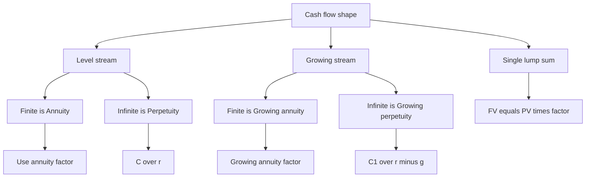

# Time Value of Money

> "A bird in the hand is worth two in the bush." Finance takes that folk wisdom and puts an exact exchange rate on it. That exchange rate is the interest rate, and the machinery that converts money across time is the Time Value of Money.

---

## The Problem / Why this matters

Every decision in corporate finance is, at bottom, a swap of cash flows across time. You spend ₹100 crore today to build a factory that pays out for fifteen years. You buy a bond that dribbles coupons for a decade. You take a loan now and repay it in EMIs for twenty years. You value a company by projecting the cash it throws off forever.

In every one of these cases you are comparing **money that arrives at different dates**. And here is the uncomfortable truth: **you cannot add or compare cash flows that occur at different points in time.** ₹100 today and ₹100 next year are *different goods*, as different as apples and oranges, and adding them naively gives you a nonsense number.

The Time Value of Money (TVM) is the single conceptual tool that makes all of finance coherent. It gives you a way to translate every future rupee into its equivalent *today*, so that everything is denominated in the same units and can be added, subtracted, and compared. Get TVM wrong and every valuation, every NPV, every bond price, every DCF is wrong. Get it right and you hold the master key.

For interviews this matters twice over. First, **TVM is the substrate of every technical question you will face** — DCF, bond pricing, LBO returns, WACC, dividend discount models all sit on top of it. Second, **TVM itself is tested directly**, because it is the fastest way for an interviewer to check whether you actually understand finance or merely memorised formulas. "What's a perpetuity worth?" "Why does compounding beat simple interest?" "Rank these three: annual, semi-annual, continuous compounding." These take thirty seconds and reveal everything.

---

## Core Idea

**A rupee today is worth more than a rupee tomorrow**, because a rupee today can be invested to earn a return, so it *grows* into more than a rupee by tomorrow. Equivalently, a rupee promised in the future is worth *less* than a rupee now.

Two operations move money through time:

- **Compounding** pushes money *forward* in time. Present value → Future value. You multiply by growth factors.
- **Discounting** pulls money *backward* in time. Future value → Present value. You divide by growth factors.

They are exact inverses of each other. The rate that governs both is the **interest rate** (also called the **discount rate**, the **required return**, or the **opportunity cost of capital** — different names, same object, chosen to emphasise different angles).

The one golden rule underneath everything:

> **You may only add cash flows that sit at the same point in time.** To compare or combine cash flows at different dates, first move them all to a common date (usually today, "time 0") using compounding or discounting.

That's it. Everything else in this chapter is machinery for doing that translation efficiently.

---

## Why it works this way — first principles

Why is a future rupee worth less? Students often mumble "inflation" and stop. Inflation is real but it is **not the main reason**, and saying so in an interview marks you as shallow. The deeper reasons, in order of importance:

**1. Opportunity cost / productivity of capital.** This is the true engine. If I have ₹100 today I can put it to work — lend it, buy a T-bill, invest in a project — and it will *produce* more money. So having ₹100 today is strictly better than having ₹100 next year, because today's ₹100 can *become* ₹106 by next year. The interest rate is the market's price for renting money, and it exists because capital is productive. Even in a world of **zero inflation**, a positive real interest rate would exist because real investment opportunities exist. This is the point most candidates miss.

**2. Impatience / time preference.** Humans (and the businesses they run) prefer consumption now to consumption later. To persuade someone to defer consumption — to lend rather than spend — you must pay them. That payment is interest. This is a *preference* fact about people, and it survives even without productive investment.

**3. Risk / uncertainty.** A future rupee may not arrive — the borrower may default, the project may fail, the world may change. A promise is worth less than cash in hand because promises can be broken. The riskier the promise, the higher the return demanded, and the harder future cash is discounted.

**4. Inflation.** If prices rise, a future rupee buys fewer goods than a rupee today. This erodes *purchasing power* and adds to the required return — but note it is the *last* factor, not the first.

Stack these up and you get the required return, often decomposed as:

$$\text{nominal rate} \approx \text{real risk-free rate} + \text{inflation} + \text{risk premium}$$

The first three drivers (opportunity cost, impatience, risk) explain why even a perfectly safe, inflation-indexed government bond still pays a positive real yield. **The interest rate is not an arbitrary number — it is the market-clearing price that balances the supply of savings against the demand for capital.**

Now, *why* does moving money forward one period mean multiplying by $(1+r)$? Because that is the *definition* of the periodic rate: if you invest ₹1 for one period at rate $r$, you get back your ₹1 plus $r$ in interest, i.e. $1 + r$. Do it for two periods and — if interest itself earns interest — you multiply twice: $(1+r) \times (1+r) = (1+r)^2$. That "interest on interest" is compounding, and it is why growth is *exponential*, not linear. The whole edifice is just this one multiplicative step, repeated.

---

## Full technical content

### 1. Notation

| Symbol | Meaning |
|---|---|
| $PV$ | Present value (value today, at time 0) |
| $FV$ | Future value (value at some future date) |
| $r$ | Interest / discount rate **per period** (decimal, e.g. 0.08) |
| $n$ | Number of **periods** (not necessarily years) |
| $C$ or $CF$ | A cash flow |
| $PMT$ | A recurring, equal cash flow (annuity payment) |
| $g$ | Growth rate of a cash flow stream |
| $m$ | Compounding frequency per year |
| $r_{nom}$ | Nominal (stated, quoted) annual rate — the APR |
| $EAR$ / $EFF$ | Effective annual rate |

**Critical discipline:** $r$ and $n$ must always be expressed in the *same* time unit. If cash flows are monthly, $r$ is a monthly rate and $n$ counts months. Mismatching the period is the single most common numerical error in finance.

### 2. Single cash flow: future value and present value

**Future value of a lump sum** (compounding forward $n$ periods):

$$FV = PV \times (1+r)^n$$

The term $(1+r)^n$ is the **future value factor** (or compound factor).

**Present value of a lump sum** (discounting back $n$ periods) — just rearrange:

$$PV = \frac{FV}{(1+r)^n} = FV \times (1+r)^{-n}$$

The term $\dfrac{1}{(1+r)^n}$ is the **discount factor** (or present value factor). It is always between 0 and 1 for positive $r$ — it *shrinks* future money.

These two formulas are the atoms. Every other formula in this chapter is built by summing these.

**Simple interest** (for contrast — used in some money-market and short-term instruments, and a common trap):

$$FV_{simple} = PV \times (1 + r \times n)$$

Under simple interest, only the *principal* earns interest; interest does **not** earn interest. Under **compound interest**, interest earns interest. Compound always beats simple for $n>1$, and the gap widens dramatically with time. Unless told otherwise, finance assumes **compounding**.

### 3. The four TVM levers

Any single-cash-flow problem is a relationship among four quantities: $PV$, $FV$, $r$, $n$. Given any three, you solve for the fourth. This is the workhorse of interview mental math.

| Solve for | Formula |
|---|---|
| $FV$ | $PV(1+r)^n$ |
| $PV$ | $FV / (1+r)^n$ |
| $r$ | $(FV/PV)^{1/n} - 1$ |
| $n$ | $\dfrac{\ln(FV/PV)}{\ln(1+r)}$ |

### 4. Compounding more than once a year

If a nominal annual rate $r_{nom}$ is compounded $m$ times per year, then each period's rate is $r_{nom}/m$ and there are $m \times (\text{years})$ periods. Over $t$ years:

$$FV = PV \left(1 + \frac{r_{nom}}{m}\right)^{m t}$$

More frequent compounding → more interest-on-interest → higher effective growth, for the *same* stated rate. Monthly beats quarterly beats annual.

### 5. Nominal vs Effective rates (APR vs EAR)

The **nominal annual rate** (a.k.a. APR, stated rate) is just the periodic rate multiplied by the number of periods — a *quoting convention*. It ignores compounding within the year. **It is not a true rate of return and you must never compare two rates on nominal terms if their compounding frequencies differ.**

The **Effective Annual Rate (EAR)** is the *actual* rate of growth over a year once intra-year compounding is included. It is the true, apples-to-apples measure.

$$EAR = \left(1 + \frac{r_{nom}}{m}\right)^{m} - 1$$

To go the other way (find the nominal rate that delivers a target EAR under $m$-compounding):

$$r_{nom} = m\left[(1+EAR)^{1/m} - 1\right]$$

| Frequency | $m$ | Periodic rate on 12% nominal | EAR |
|---|---|---|---|
| Annual | 1 | 12.000% | 12.000% |
| Semi-annual | 2 | 6.000% | 12.360% |
| Quarterly | 4 | 3.000% | 12.551% |
| Monthly | 12 | 1.000% | 12.683% |
| Daily | 365 | 0.0329% | 12.747% |
| Continuous | ∞ | — | 12.750% |

Notice the EAR *rises* with frequency but at a *decreasing* rate, converging to a ceiling — the continuous-compounding limit. That ceiling is the next topic.

### 6. Continuous compounding

Push $m \to \infty$ and the compound factor approaches a beautiful limit using Euler's number $e \approx 2.71828$:

$$\lim_{m\to\infty}\left(1+\frac{r}{m}\right)^{mt} = e^{rt}$$

So under continuous compounding:

$$FV = PV \cdot e^{rt} \qquad\qquad PV = FV \cdot e^{-rt}$$

And the effective annual rate under continuous compounding of nominal $r$:

$$EAR = e^{r} - 1$$

Continuous compounding is the mathematical idealisation of "interest credited every instant." It matters because:
- It is analytically clean — $e^{rt}$ differentiates and integrates trivially, so **derivatives pricing (Black–Scholes), fixed-income analytics, and academic finance use it universally.**
- Continuously-compounded rates are **additive across time** and symmetric ($\ln$ returns), which discrete rates are not.

To convert between a continuously-compounded rate $r_c$ and an equivalent annually-compounded (effective) rate $r_e$:

$$r_c = \ln(1 + r_e) \qquad\qquad r_e = e^{r_c} - 1$$

### 7. Perpetuities

A **perpetuity** is a stream of *equal* cash flows $C$ that arrives at the end of every period, **forever**. It sounds exotic but underpins the dividend discount model, preferred stock valuation, and the terminal value in a DCF. The astonishing result: an infinite stream has a *finite* value, because far-off cash flows are discounted into near-nothingness.

$$PV_{perpetuity} = \frac{C}{r}$$

The first cash flow arrives **one period from now** (end of period 1). This is the "ordinary" perpetuity.

*Derivation (worth knowing — interviewers love asking):* The PV is an infinite geometric series
$$PV = \frac{C}{1+r} + \frac{C}{(1+r)^2} + \frac{C}{(1+r)^3} + \cdots$$
A geometric series $a + ax + ax^2 + \cdots$ with $|x|<1$ sums to $\dfrac{a}{1-x}$. Here $a = \frac{C}{1+r}$ and $x = \frac{1}{1+r}$, so
$$PV = \frac{C/(1+r)}{1 - 1/(1+r)} = \frac{C/(1+r)}{r/(1+r)} = \frac{C}{r}.$$

### 8. Growing perpetuities

If each cash flow grows at a constant rate $g$ forever (and $g < r$, else the value is infinite / undefined), then:

$$PV_{growing\ perpetuity} = \frac{C_1}{r - g}$$

where $C_1$ is the cash flow **one period from now** — the *first* payment, already grown. If you are given today's cash flow $C_0$, then $C_1 = C_0(1+g)$ and:

$$PV = \frac{C_0(1+g)}{r-g}$$

This is the **Gordon Growth Model** — the most famous formula in equity valuation and the standard **terminal value** formula in a DCF. The constraint $g < r$ is not a technicality: if cash flows grew faster than the discount rate forever, their present value would be infinite, which is economically impossible.

### 9. Annuities

An **annuity** is a stream of equal cash flows $C$ for a *finite* number of periods $n$. Loans (EMIs), leases, bonds' coupon streams, and retirement payouts are all annuities.

**Present value of an ordinary annuity** (payments at end of each period):

$$PV = C \times \frac{1 - (1+r)^{-n}}{r}$$

The bracketed term is the **annuity PV factor**. Intuition: it is the perpetuity value $C/r$ *minus* the value of a perpetuity that starts at period $n+1$ (which you don't receive). That's why the formula is $\frac{C}{r}\left[1-(1+r)^{-n}\right]$.

**Future value of an ordinary annuity** (value at the end, right after the last payment):

$$FV = C \times \frac{(1+r)^n - 1}{r}$$

The bracketed term is the **annuity FV factor**. Use this for "how much will my monthly SIP be worth in 20 years" questions.

**Annuity-due** (payments at the *beginning* of each period — leases, rent, some pensions). Each cash flow is discounted one period *less*, so every value is simply $(1+r)$ times the ordinary version:

$$PV_{due} = PV_{ordinary} \times (1+r) \qquad FV_{due} = FV_{ordinary} \times (1+r)$$

### 10. Growing annuities

Equal-*growing* cash flows for a finite $n$ (first payment $C_1$ one period out, growing at $g$):

$$PV = \frac{C_1}{r-g}\left[1 - \left(\frac{1+g}{1+r}\right)^{n}\right]$$

Used for salary-growth savings plans, escalating-rent leases, and DCFs with a finite high-growth stage. When $r = g$ the formula collapses (0/0); the correct value in that special case is $PV = \dfrac{n \cdot C_1}{1+r}$.

### 11. Solving for the annuity payment (the loan/EMI formula)

Rearranging the annuity PV formula to isolate $C$ gives the **loan amortisation / EMI** formula. Given a loan principal $PV$, periodic rate $r$, and $n$ payments:

$$C = PV \times \frac{r}{1 - (1+r)^{-n}} = PV \times \frac{r(1+r)^n}{(1+r)^n - 1}$$

This is exactly how your home-loan EMI is computed. Each payment is part interest (on the outstanding balance) and part principal; early payments are mostly interest, later ones mostly principal.

### 12. Master map of the formulas

---

## Worked examples

### Example 1 — Lump sum both directions, and finding the rate

**Setup.** You invest ₹50,000 today in a fixed deposit paying **8% per annum, compounded annually**, for **6 years**.

**(a) What is it worth at maturity?**

$$FV = 50{,}000 \times (1.08)^6$$

Compute $(1.08)^6$ step by step: $1.08^2 = 1.1664$; $1.08^3 = 1.259712$; $1.08^6 = (1.259712)^2 = 1.586874$.

$$FV = 50{,}000 \times 1.586874 = ₹79{,}343.7$$

**(b) Sanity-check by discounting back.** $PV = 79{,}343.7 / 1.586874 = ₹50{,}000$. ✓ Discounting exactly undoes compounding.

**(c) Suppose instead you were promised ₹79,344 in 6 years for ₹50,000 today — what annual return does that imply?**

$$r = \left(\frac{79{,}344}{50{,}000}\right)^{1/6} - 1 = (1.586874)^{1/6} - 1$$

The sixth root of 1.586874 is 1.08 (by construction), so $r = 8\%$. ✓

**(d) How long to double your money at 8%?** Using the rule and the exact formula:

$$n = \frac{\ln 2}{\ln 1.08} = \frac{0.693147}{0.076961} = 9.006 \text{ years}$$

The famous **Rule of 72** estimates $72/8 = 9$ years — essentially exact here. (Rule of 72: doubling time ≈ 72 ÷ rate-in-percent. Handy for mental math in interviews.)

### Example 2 — Compounding frequency and effective rates

**Setup.** A bank quotes a **12% nominal annual rate**. You deposit ₹1,00,000 for **1 year**. Compare outcomes under different compounding frequencies, and state the true (effective) rate.

**Annual ($m=1$):** $FV = 100{,}000 \times 1.12 = ₹1{,}12{,}000$. EAR = 12.000%.

**Quarterly ($m=4$):** periodic rate = 3%.
$$FV = 100{,}000 \times (1.03)^4 = 100{,}000 \times 1.125509 = ₹1{,}12{,}550.9$$
$$EAR = (1.03)^4 - 1 = 12.551\%$$

**Monthly ($m=12$):** periodic rate = 1%.
$$FV = 100{,}000 \times (1.01)^{12} = 100{,}000 \times 1.126825 = ₹1{,}12{,}682.5$$
$$EAR = (1.01)^{12} - 1 = 12.683\%$$

**Continuous:**
$$FV = 100{,}000 \times e^{0.12} = 100{,}000 \times 1.127497 = ₹1{,}12{,}749.7$$
$$EAR = e^{0.12} - 1 = 12.750\%$$

**Reading the result.** Same 12% sticker rate, but the depositor earns anywhere from ₹12,000 to ₹12,750 depending on frequency — a real ₹750 difference on ₹1 lakh. The lesson interviewers want: **the nominal rate is a quoting convention; only the EAR tells you what you actually earn.** More frequent compounding always helps the receiver of interest and hurts the payer, and the effect saturates toward the continuous limit.

### Example 3 — Home loan EMI (annuity), with principal/interest split

**Setup.** You borrow **₹30,00,000** for a home at **9% nominal annual, compounded monthly**, over **20 years**.

**Step 1 — get period-consistent inputs.** Monthly rate $r = 0.09/12 = 0.0075$. Number of payments $n = 20 \times 12 = 240$.

**Step 2 — EMI formula.**
$$C = PV \times \frac{r(1+r)^n}{(1+r)^n - 1}$$

Compute $(1.0075)^{240}$. Using $\ln$: $240 \times \ln(1.0075) = 240 \times 0.00746890 = 1.792537$, so $(1.0075)^{240} = e^{1.792537} = 6.009152$.

$$C = 3{,}000{,}000 \times \frac{0.0075 \times 6.009152}{6.009152 - 1} = 3{,}000{,}000 \times \frac{0.04506864}{5.009152}$$
$$C = 3{,}000{,}000 \times 0.00899726 = ₹26{,}992$$

So the EMI is about **₹26,992 per month.**

**Step 3 — total paid and total interest.**
Total paid $= 26{,}992 \times 240 = ₹64{,}78{,}080$. Of this, ₹30,00,000 is principal, so **interest paid ≈ ₹34,78,080** — you pay more in interest than you borrowed. This is the emotional punchline of long-dated amortisation.

**Step 4 — principal/interest split of the *first* EMI.** Interest portion = outstanding balance × monthly rate $= 3{,}000{,}000 \times 0.0075 = ₹22{,}500$. Principal portion $= 26{,}992 - 22{,}500 = ₹4{,}492$. So in month 1, **83% of your payment is just interest.** Twenty years later it flips — the last payment is almost all principal. This front-loading of interest is why prepaying early saves so much.

### Example 4 — Perpetuity, growing perpetuity, and a terminal value

**Setup.** A preferred share pays a fixed dividend of **₹8 per year forever**. Investors require **10%**.

**(a) Value:** $PV = C/r = 8/0.10 = ₹80.$

**(b) Now a common share** whose dividend next year is expected to be ₹8 and to **grow 4% forever**, with a 10% required return (Gordon Growth):
$$PV = \frac{C_1}{r-g} = \frac{8}{0.10 - 0.04} = \frac{8}{0.06} = ₹133.33.$$
The growth adds ₹53.33 of value over the flat perpetuity — growth is valuable, and small changes in $g$ move the price a lot (a sensitivity trap we'll flag below).

**(c) DCF terminal value.** A company's free cash flow in year 5 is ₹500 crore, expected to grow **3% forever** thereafter; WACC is **11%**. The terminal value **as of the end of year 5** is a growing perpetuity using year-6 cash flow:
$$TV_5 = \frac{FCF_6}{r-g} = \frac{500 \times 1.03}{0.11 - 0.03} = \frac{515}{0.08} = ₹6{,}437.5 \text{ crore.}$$
To use it in the DCF you would then discount $TV_5$ back 5 years: $TV_5 / (1.11)^5 = 6{,}437.5 / 1.685058 = ₹3{,}820.3$ crore. **Note the terminal value is dated at year 5, not today** — forgetting to discount it is one of the most common DCF errors, discussed below.

### Example 5 — Retirement SIP (annuity FV) then drawdown (annuity PV)

**Setup.** You invest **₹15,000 at the end of every month** for **25 years** in a fund returning **10% nominal, compounded monthly.** 

**Accumulation (FV of ordinary annuity).** Monthly rate $= 0.10/12 = 0.0083333$; $n = 300$.
$(1.0083333)^{300}$: $300 \times \ln(1.0083333) = 300 \times 0.00829876 = 2.489629$, so factor $= e^{2.489629} = 12.056$.
$$FV = 15{,}000 \times \frac{12.056 - 1}{0.0083333} = 15{,}000 \times \frac{11.056}{0.0083333} = 15{,}000 \times 1326.7 = ₹1{,}99{,}00{,}500$$
You accumulate roughly **₹1.99 crore** from total contributions of only ₹15,000 × 300 = ₹45 lakh. The other ₹1.54 crore is compounding at work — the single most persuasive advertisement for starting early.

**Drawdown (solve annuity payment).** From that ₹1.99 crore corpus, how much can you withdraw at the end of each month for **20 years (240 months)** if it now earns **8% nominal monthly** ($r=0.0066667$)?
$(1.0066667)^{240} = e^{240 \times 0.00664452} = e^{1.594685} = 4.926803$.
$$C = 19{,}900{,}500 \times \frac{0.0066667 \times 4.926803}{4.926803 - 1} = 19{,}900{,}500 \times \frac{0.03284535}{3.926803} = 19{,}900{,}500 \times 0.00836429 = ₹1{,}66{,}450$$
So the corpus supports about **₹1.66 lakh per month for 20 years.** This two-stage problem — accumulate as an annuity, then decumulate as an annuity — is a classic FP&A / wealth-planning interview setup.

---

## How it is tested in interviews

TVM shows up as (a) quick conceptual gut-checks, (b) mental-math estimation, and (c) as the hidden engine of a bigger valuation question. Here are the exact questions, with model answers and crisp lines to say.

**Q: "Why is a rupee today worth more than a rupee tomorrow?"**
*Model answer / crisp line:* "Primarily because of opportunity cost — a rupee today can be invested and earn a return, so it grows into more than a rupee tomorrow. On top of that, people prefer consumption now, future cash carries risk it may not arrive, and inflation erodes purchasing power. Even with zero inflation and zero risk, a positive real interest rate exists because capital is productive." *(Leading with opportunity cost, not inflation, signals depth.)*

**Q: "What's the present value of a perpetuity of ₹10 at a 5% discount rate? Derive it."**
*Say:* "₹200 — it's C over r. It's a geometric series; the sum of C/(1+r) + C/(1+r)² + … converges to C/r because the ratio 1/(1+r) is less than one. An infinite stream has a finite value because distant cash flows discount to nearly zero."

**Q: "Terminal value in a DCF — what formula, and what's the most common mistake?"**
*Say:* "Gordon Growth: next-year cash flow over (WACC minus g). Two classic mistakes: using *this* year's cash flow instead of next year's in the numerator, and forgetting that the terminal value is dated at the *final explicit year*, so it must still be discounted back to today. Also, g must be below WACC and shouldn't exceed long-run GDP growth, or you're implying the company eventually becomes the whole economy."

**Q: "You have three deposits: 10% annual, 9.8% monthly, 9.9% continuous. Which is best?"**
*Say:* "Convert all to EAR — nominal rates aren't comparable across frequencies. 10% annual = 10.00% EAR. 9.8% monthly = (1+0.098/12)¹² − 1 ≈ 10.25%. 9.9% continuous = e^0.099 − 1 ≈ 10.41%. So continuous 9.9% wins, then monthly 9.8%, then annual 10%. The takeaway: a lower nominal rate can beat a higher one if it compounds more often."

**Q: "How long to double your money at 6%? At 12%?"**
*Say:* "Rule of 72 — about 12 years at 6%, about 6 years at 12%. It comes from ln 2 over ln(1+r); 72 is a convenient numerator because it divides cleanly and matches the log math well in the 6–10% range."

**Q: "A growing perpetuity — what happens to value as g approaches r?"**
*Say:* "Value goes to infinity, because C/(r−g) blows up as the denominator shrinks. That's why the model requires g strictly below r. It also means terminal values are hyper-sensitive to the spread between r and g — moving g from 3% to 4% when r is 9% raises TV by roughly 17%. Always sensitivity-test that assumption."

**Q (numerical, whiteboard): "Value a 5-year bond, ₹1,000 face, 8% annual coupon, 10% yield."**
*Say and do:* "It's an annuity of ₹80 coupons plus a lump-sum ₹1,000 at year 5, both discounted at 10%. PV of coupons = 80 × [1 − 1.10⁻⁵]/0.10 = 80 × 3.7908 = ₹303.3. PV of face = 1,000/1.10⁵ = 1,000/1.61051 = ₹620.9. Price = ₹924.2. It trades below par because the 8% coupon is below the 10% required yield — a discount bond." *(This shows you can decompose any instrument into annuity + lump sum, the master skill.)*

**Q: "Ordinary annuity vs annuity due — which is worth more and by how much?"**
*Say:* "Annuity due is worth more — payments come one period earlier, so each is discounted one period less. Its value is exactly (1+r) times the ordinary annuity. Leases and rent are typically annuities due; loans and bond coupons are ordinary."

**The meta-signal:** interviewers use these to check whether you *reduce every instrument to lump sums and annuities* and always *keep rate and period consistent*. Verbalise those two habits and you look like someone who has actually built models.

---

## Traps & common mistakes

| Trap | What goes wrong | Fix |
|---|---|---|
| **Rate/period mismatch** | Using an annual rate with a monthly period count, or vice versa. Off by an order of magnitude. | Always convert both $r$ and $n$ to the *same* unit first. Monthly cash flows → monthly rate, monthly count. |
| **Nominal ≠ effective** | Comparing a 12% monthly rate with a 12.4% annual rate as if equal. | Convert everything to EAR before comparing. |
| **Perpetuity timing** | $C/r$ assumes the first payment is *one period from now*. If it starts today, add one more $C$; if it starts in year 3, discount $C/r$ back. | Locate the first cash flow explicitly; $C/r$ gives value *one period before* the first payment. |
| **Terminal value numerator** | Using year-$n$ cash flow instead of year-$(n{+}1)$ in Gordon Growth. | Grow one more period: $TV_n = CF_n(1+g)/(r-g)$. |
| **Forgetting to discount TV** | Terminal value sits at the last explicit year, not today. | Discount $TV_n$ back $n$ periods before summing. |
| **g ≥ r** | Growing perpetuity gives negative or infinite (nonsense) value. | Require $g < r$; cap $g$ at long-run GDP growth (~3–5%). |
| **Simple vs compound** | Assuming simple interest, understating long-horizon growth badly. | Assume compounding unless explicitly told simple. |
| **Annuity due vs ordinary** | Off by a factor of $(1+r)$ — silent but real error. | Identify payment timing (start vs end of period). |
| **Sign/direction confusion** | Multiplying when you should divide (compounding vs discounting). | Future→now = divide (shrink); now→future = multiply (grow). |
| **Rounding factors too early** | Rounding $(1+r)^n$ to 2 dp on a 240-period loan swings the EMI by rupees. | Carry 5–6 significant figures until the final step. |
| **TV over-sensitivity ignored** | Presenting a single-point DCF as precise when TV is 60–80% of value and hyper-sensitive to $g$. | Always sensitivity-table $r$ and $g$. |

---

## First-principles recap

- **You can only add cash flows at the same date.** All of TVM exists to move cash flows to a common date so they can be compared. Everything else is mechanics.
- **A rupee today beats a rupee tomorrow chiefly because of opportunity cost** — capital is productive — with impatience, risk, and inflation piling on top. A positive *real* rate survives even zero inflation.
- **Compounding multiplies forward, discounting divides backward**, and they are exact inverses governed by the same rate. Growth is exponential because interest earns interest.
- **The nominal rate is a quote; the effective rate is the truth.** Never compare rates of different compounding frequency without converting to EAR. Frequency helps the lender, and its benefit saturates at the continuous limit $e^{rt}$.
- **Every instrument decomposes into lump sums and level/growing streams.** A bond = annuity + lump sum. A stock = growing perpetuity. Master those atoms and you can value anything.
- **An infinite stream can have a finite value** because distant cash flows discount to near-zero — the basis of perpetuities and terminal value.
- **Consistency of rate and period, and correct cash-flow timing, cause more errors than any formula.** Discipline on units beats cleverness.

---

## Quick-reference

| Concept | Formula |
|---|---|
| FV of lump sum | $FV = PV(1+r)^n$ |
| PV of lump sum | $PV = FV/(1+r)^n$ |
| Solve for rate | $r = (FV/PV)^{1/n} - 1$ |
| Solve for periods | $n = \ln(FV/PV)/\ln(1+r)$ |
| $m$-times compounding | $FV = PV(1 + r_{nom}/m)^{mt}$ |
| Effective annual rate | $EAR = (1 + r_{nom}/m)^m - 1$ |
| Continuous compounding | $FV = PV\,e^{rt}$;  $EAR = e^r - 1$ |
| Discrete ↔ continuous | $r_c = \ln(1+r_e)$;  $r_e = e^{r_c}-1$ |
| Perpetuity | $PV = C/r$ |
| Growing perpetuity (Gordon) | $PV = C_1/(r-g)$, need $g<r$ |
| Ordinary annuity PV | $PV = C\,[1-(1+r)^{-n}]/r$ |
| Ordinary annuity FV | $FV = C\,[(1+r)^n - 1]/r$ |
| Annuity due | multiply ordinary by $(1+r)$ |
| Growing annuity PV | $PV = \dfrac{C_1}{r-g}\left[1-\left(\dfrac{1+g}{1+r}\right)^n\right]$ |
| Loan payment (EMI) | $C = PV\cdot \dfrac{r(1+r)^n}{(1+r)^n - 1}$ |
| Rule of 72 | doubling time ≈ $72 / (\text{rate in }\%)$ |

*The entire chapter in one sentence: pick a consistent period, reduce everything to lump sums and annuities, discount to today, add — and never let a nominal rate fool you.*
