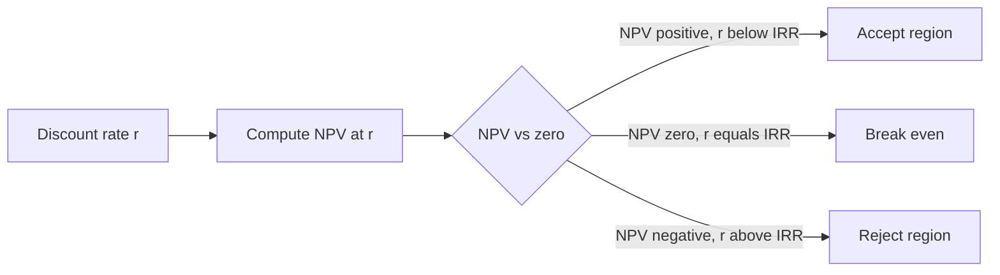
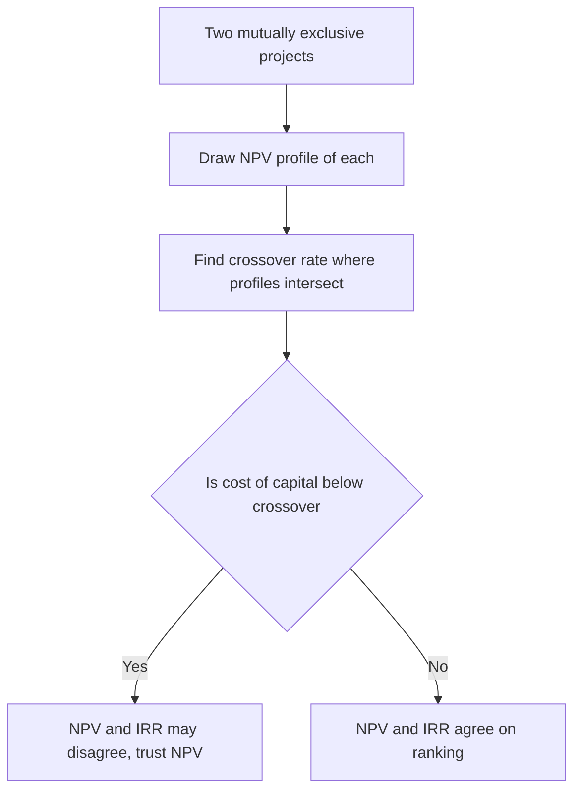
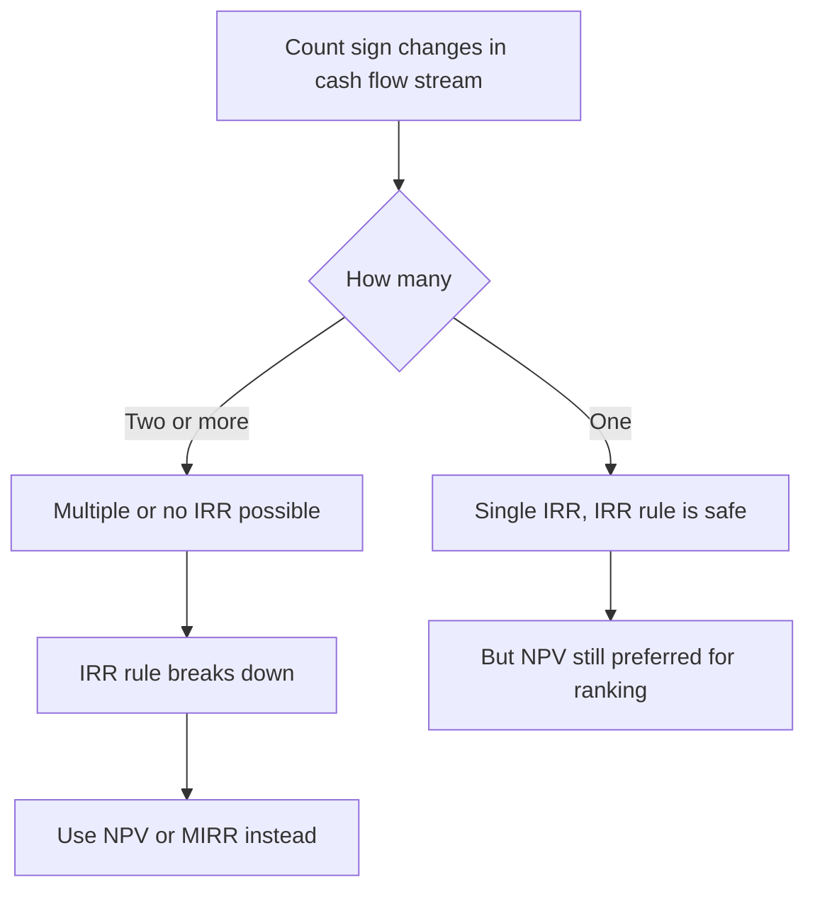

# NPV, IRR & Investment Decision Rules

## The Problem / Why this matters

Every business is, at bottom, a machine for turning cash outflows today into cash inflows tomorrow. Build a factory now; sell widgets for the next fifteen years. Spend on a marketing campaign this quarter; harvest customer lifetime value over the next three. Acquire a competitor today; integrate and monetise the synergies over a decade. The central question of corporate finance is embarrassingly simple to state and surprisingly easy to get wrong: **is this trade worth making?**

The difficulty is that the cash going out and the cash coming in do not arrive at the same time, do not carry the same risk, and are not measured on the same footing. A dollar spent today is a *certain* dollar. A dollar promised in year seven is a *risky, distant* promise. You cannot simply add up all the inflows, subtract all the outflows, and see if the number is positive — that treats a year-7 dollar as identical to a year-0 dollar, which it emphatically is not. You need a common yardstick that translates cash flows arriving at different dates, carrying different risks, into a single comparable unit: **value today.**

That yardstick is the set of investment decision rules — chiefly **Net Present Value (NPV)** and **Internal Rate of Return (IRR)**, supported by payback, discounted payback, and the profitability index. These are not academic curiosities. They are the operating logic of capital allocation. When a CFO decides whether to greenlight a project, when a PE fund underwrites a buyout, when an equity research analyst builds a DCF to price a stock, when an FP&A team ranks a slate of internal initiatives against a limited budget — they are running these rules, explicitly or implicitly.

And they are *the* most heavily tested topic in finance interviews. "Walk me through why NPV is better than IRR" is nearly a rite of passage. "A project has two IRRs — what's going on?" separates the candidates who memorised a formula from the ones who understand the machinery. "Would you rather have a project with a higher IRR or a higher NPV?" is a trap that catches people every single day. This chapter builds the entire apparatus from first principles, then shows you exactly how it is examined and exactly what to say.

## Core Idea

Here is the whole chapter in four sentences.

1. **A rupee today is worth more than a rupee tomorrow**, because today's rupee can be invested to earn a return — so future cash must be *discounted* back to the present before it can be compared with present cash.
2. **NPV** is the sum of all a project's cash flows, each pulled back to today at a discount rate reflecting the opportunity cost and risk of the capital, and it answers the only question that matters: *how much value does this project create, measured in today's money?* Accept if NPV > 0.
3. **IRR** is the single discount rate that makes NPV exactly zero — the project's own "break-even" rate of return — and it answers a related but subtly different question: *what compound annual return does this project deliver on the capital tied up in it?* Accept if IRR > cost of capital.
4. When NPV and IRR disagree about *ranking* two projects, **NPV is always right**, because NPV measures value created in currency while IRR measures a percentage that ignores scale and makes a hidden, usually false, assumption about reinvestment.

Everything else — payback, discounted payback, profitability index, multiple IRRs, the reinvestment-rate debate, the crossover rate — is detail, nuance, and the specific machinery that lets you defend those four sentences under fire.

## Why it works this way — first principles

### The time value of money is not a convention; it is an arbitrage fact

Suppose someone offers you ₹100 now or ₹100 in one year, and you can lend/borrow at 8% with no risk. Take the ₹100 now, lend it, and in a year you have ₹108. So ₹100-now dominates ₹100-in-a-year by ₹8. The two are *not* the same good. To make them comparable you must either push the present forward (compounding: ₹100 × 1.08 = ₹108) or pull the future backward (discounting: ₹100 ÷ 1.08 = ₹92.59). Discounting is compounding run in reverse. That is the entire foundation.

The **discount rate** is not an arbitrary knob. It is the return you could earn on *the next-best investment of equivalent risk* — the opportunity cost of capital. If your money could earn 12% in an equally risky alternative, then a project must clear 12% just to break even against what you gave up. Discounting at 12% asks precisely: *how much would I have to set aside today, in that 12% alternative, to replicate this project's future cash?* If the project costs less than that replicating amount, it is cheaper than the alternative — it creates value. That gap is the NPV.

### Value additivity: why present values can simply be added

A deep and load-bearing property: present values are **additive**. The value today of receiving cash flow A *and* cash flow B equals the value of A plus the value of B, each discounted separately. This holds because discounting is linear. It is why we can decompose a messy project into a stream of individual dated cash flows, discount each one in isolation, and sum them — and why a firm's value equals the sum of the values of its projects. IRR, being a rate found by solving a polynomial, is *not* additive: you cannot average two projects' IRRs to get the IRR of the combined project. This single asymmetry is the mathematical root of most NPV-vs-IRR conflicts.

### Why "value in currency" beats "value as a percentage"

A shareholder does not eat percentages. She eats rupees of wealth. A rule that maximises the *amount* of wealth created (NPV) is therefore aligned with the actual objective — maximise shareholder value — in a way that a rule maximising a *rate* (IRR) is not. A 100% return on ₹10 (₹10 of profit) is a worse outcome than a 20% return on ₹1,000 (₹200 of profit), even though the first "looks" more impressive. NPV sees the ₹200 > ₹10 correctly and immediately. IRR sees 100% > 20% and points you to the wrong project. Hold that example in your head; it is the seed of the entire scale-conflict discussion.

## Full technical content

### 1. Present value, future value, and discount factors

The building block. A cash flow $C_t$ arriving at time $t$ has present value:

$$PV = \frac{C_t}{(1+r)^t}$$

where $r$ is the per-period discount rate. The term $\frac{1}{(1+r)^t}$ is the **discount factor** for period $t$ — the price today of ₹1 delivered at time $t$. Discount factors fall monotonically toward zero as $t$ grows: distant cash is worth progressively less. At $r = 10\%$, ₹1 in year 1 is worth ₹0.909, in year 5 worth ₹0.621, in year 20 worth ₹0.149, in year 50 worth ₹0.0085. This decay is why terminal-value assumptions in a DCF matter enormously in the near term and why cash flows beyond ~15–20 years contribute little at ordinary discount rates.

### 2. Net Present Value (NPV) — the master rule

**Definition.** NPV is the sum of the present values of *all* project cash flows, inflows and outflows, including the initial investment:

$$NPV = \sum_{t=0}^{n} \frac{C_t}{(1+r)^t} = C_0 + \frac{C_1}{(1+r)^1} + \frac{C_2}{(1+r)^2} + \cdots + \frac{C_n}{(1+r)^n}$$

Conventionally $C_0$ is negative (the upfront outlay). For a project with a single upfront cost $I$ followed by inflows:

$$NPV = -I + \sum_{t=1}^{n} \frac{C_t}{(1+r)^t}$$

**Decision rule.**
- Independent project: **accept if NPV > 0**, reject if NPV < 0, indifferent if NPV = 0.
- Mutually exclusive projects: **choose the one with the highest positive NPV.**

**Interpretation.** NPV is the *immediate increase in the firm's value* (and, absent leverage/agency effects, in shareholder wealth) from undertaking the project. NPV = ₹40 crore means: doing this project is financially equivalent to receiving ₹40 crore in cash today. NPV = 0 does **not** mean "no benefit" — it means the project earns *exactly* its cost of capital, i.e., it compensates investors for time and risk but produces no surplus. That is still an acceptable project (you'd be indifferent), just not a value-creating one.

**Why NPV = 0 is the theoretically correct accept/reject boundary.** At the cost of capital, investors are exactly compensated. Anything above zero is surplus handed to owners. This aligns the rule with the firm's objective function.

### 3. Internal Rate of Return (IRR)

**Definition.** The IRR is the discount rate $r^*$ that sets NPV to zero:

$$\sum_{t=0}^{n} \frac{C_t}{(1+r^*)^t} = 0$$

Equivalently, it is the rate at which the present value of inflows equals the present value of outflows. There is no closed-form solution for general cash-flow patterns (it is a root of an $n$-degree polynomial in $\frac{1}{1+r^*}$); it is found numerically — Excel's `=IRR()`, a financial calculator, or trial-and-error interpolation.

**Decision rule (independent project, conventional cash flows).**
- **Accept if IRR > cost of capital** ($r^* > r$), reject if IRR < r.

**Interpretation.** IRR is the project's intrinsic compound annual growth rate on the capital *while that capital remains invested in the project*. A 24% IRR means the cash tied up in the project is effectively earning 24% per year. Compare that to the "hurdle rate" (cost of capital); if the project out-earns what the capital costs, it creates value.

**The relationship between NPV and IRR** is captured by the **NPV profile** — a plot of NPV (y-axis) against discount rate (x-axis). For a conventional project (one sign change: outflow then inflows), the profile slopes downward: NPV is high at low discount rates and falls as $r$ rises, crossing zero exactly once. The crossing point *is* the IRR.

For a conventional project the two rules **agree** on accept/reject: NPV > 0 exactly when r < IRR. Conflicts arise only in *ranking* mutually exclusive projects, or when cash flows are non-conventional.

### 4. Interpolation formula for IRR (manual computation)

When you must compute IRR by hand (common in exams and some interviews), bracket it with two rates: a lower rate $r_L$ giving positive NPV$_L$ and a higher rate $r_H$ giving negative NPV$_H$. Linearly interpolate:

$$IRR \approx r_L + \frac{NPV_L}{NPV_L - NPV_H} \times (r_H - r_L)$$

This is an approximation (the profile is convex, not linear), so keep the bracket tight — within ~5 percentage points — for accuracy. Always verify by plugging the answer back in.

### 5. Payback period

**Definition.** The number of years to recover the initial investment from undiscounted cash flows.

$$\text{Payback} = \text{years before full recovery} + \frac{\text{unrecovered cost at start of recovery year}}{\text{cash flow during recovery year}}$$

**Decision rule.** Accept if payback < a management-set cutoff; among alternatives, prefer shorter payback.

**Strengths.** Dead simple; intuitive; a rough *liquidity* and *risk* screen (how long is my capital exposed?); useful when cash is scarce or the future is highly uncertain.

**Fatal weaknesses.**
1. **Ignores the time value of money** entirely (a ₹1 in year 1 counted equal to ₹1 in year 4).
2. **Ignores all cash flows after the cutoff** — a project that gushes cash in years 6–20 but pays back slowly is wrongly rejected; a project that pays back fast then collapses is wrongly accepted.
3. **No link to value creation.** A short payback does not mean positive NPV.

Payback survives in practice as a *supplementary* screen, never the primary rule.

### 6. Discounted payback period

**Definition.** Same as payback, but cash flows are first discounted to present value before accumulating. It answers: how long until the *present value* of inflows recovers the initial outlay?

**Improvement over plain payback.** Fixes weakness #1 (it respects time value). A project with positive NPV will always have a finite discounted payback within its life; a negative-NPV project's discounted cumulative cash never reaches the outlay.

**Remaining weakness.** Still ignores cash flows beyond the cutoff (weakness #2). So it is better than payback but still inferior to NPV. Discounted payback is *always longer* than simple payback (discounting shrinks each inflow, so recovery takes longer).

### 7. Profitability Index (PI) — the "bang for the buck" ratio

**Definition.** The ratio of the present value of future cash inflows to the initial investment:

$$PI = \frac{PV \text{ of future cash flows}}{|\text{Initial investment}|} = 1 + \frac{NPV}{|\text{Initial investment}|}$$

**Decision rule.**
- Independent project: **accept if PI > 1** (equivalent to NPV > 0).
- Under **capital rationing**: rank projects by PI to squeeze the most NPV out of each unit of scarce capital.

**Why PI exists.** NPV tells you the absolute value created but not the *efficiency* of the capital used. When capital is limited (a fixed budget you cannot exceed), you want the projects that create the most value *per rupee invested*. PI = NPV per rupee of outlay, plus one. Two projects, both NPV-positive, but you can only fund one rupee's worth: pick the higher PI.

**Its limitation.** PI can mislead when projects are of very different sizes and the budget can be fully absorbed by combinations — then you must check total NPV of feasible *bundles*, not just rank individual PIs. PI is a heuristic for rationing, not a replacement for NPV.

### 8. The NPV–IRR conflict for mutually exclusive projects

For **independent** projects with conventional cash flows, NPV and IRR give the same accept/reject verdict. The trouble is **ranking mutually exclusive projects** — where accepting one means rejecting the other. Here the two rules can disagree, and the disagreement has two distinct causes.

**Cause 1 — Scale (size) differences.** IRR is a percentage; it is blind to how much capital the percentage is earned on. A small project can have a spectacular IRR on a tiny base while a large project has a lower IRR on a huge base and creates far more total value. IRR ranks the small one first; NPV (correctly) ranks the large one first.

**Cause 2 — Timing (cash-flow pattern) differences.** One project front-loads its cash (returns quickly), another back-loads it (returns later but more in total). Front-loaded cash has a higher IRR (capital is returned fast and "reinvested" implicitly at the high IRR). But at a low cost of capital, the back-loaded project can have a higher NPV because those later, larger cash flows aren't discounted away as harshly.

**The crossover rate.** Plot both projects' NPV profiles on the same axes. They intersect at the **crossover rate** (also called Fisher's intersection) — the discount rate at which both projects have *equal* NPV. Below the crossover rate, one project has higher NPV; above it, the other does. Meanwhile each project's IRR is fixed (where its own profile hits zero). The conflict exists precisely when your cost of capital lies *below* the crossover rate but the IRRs rank the projects in the opposite order.

**To find the crossover rate:** compute the *incremental* cash flows (Project A minus Project B, year by year) and solve for the IRR of that incremental stream. That incremental IRR *is* the crossover rate. Intuition: the crossover is where you'd be indifferent, so the "extra" investment of the bigger/later project earns exactly the crossover return.

**The resolution.** Always follow NPV. Reason below.

### 9. The reinvestment-rate assumption — the heart of why IRR misleads

This is the single most important conceptual point in the chapter and the most-asked interview idea.

When you compute NPV, every intermediate cash flow is discounted at the **cost of capital** $r$. Implicitly, this treats interim cash as if it is reinvested (or its equivalent, returned to investors who can invest) at $r$ — the realistic opportunity cost. When you compute IRR, the mathematics implicitly assumes every intermediate cash flow is reinvested at the **IRR itself**.

Why? Because the IRR equation forces the project to "grow" its capital at rate $r^*$ throughout. Solving $\sum C_t/(1+r^*)^t = 0$ is algebraically equivalent to assuming released cash compounds forward at $r^*$. If a project's IRR is 40%, the IRR figure is only achievable in reality if you can *redeploy* the interim cash at 40% too. But if your firm's opportunity cost is 12%, you cannot realistically reinvest at 40% — so the 40% overstates the true economic return you'll actually earn on the *whole* invested-and-reinvested capital.

**NPV's reinvestment assumption (at r) is realistic; IRR's (at the IRR) is optimistic and usually false.** This is *the* reason IRR overstates returns for high-IRR projects and misranks projects with different cash-flow timing. The higher the IRR relative to the cost of capital, the more the reinvestment fantasy inflates it.

**Modified IRR (MIRR)** is the fix. MIRR explicitly assumes interim inflows are reinvested at the cost of capital (or a specified reinvestment rate), compounds them all forward to a terminal value, and solves for the single rate that grows the initial outlay into that terminal value:

$$MIRR = \left( \frac{FV \text{ of inflows at reinvestment rate}}{|PV \text{ of outflows at finance rate}|} \right)^{1/n} - 1$$

MIRR is always between the IRR and the cost of capital, produces a unique answer even with non-conventional cash flows, and ranks mutually exclusive projects consistently with NPV in the scale-free case. It is the "IRR you can actually defend."

### 10. Multiple IRRs and no IRR — non-conventional cash flows

The IRR equation is a polynomial of degree $n$. By **Descartes' rule of signs**, the number of positive real roots is at most the number of **sign changes** in the cash-flow stream.

- **Conventional cash flows** — one sign change (─ then all +): exactly one IRR. Clean.
- **Non-conventional cash flows** — multiple sign changes (e.g., ─ + + ─, an outflow at the end for decommissioning, cleanup, a mine reclamation, an asset-retirement obligation, or a mid-life re-investment): **as many IRRs as sign changes.** Two sign changes → up to two IRRs, both mathematically valid, neither economically meaningful.
- **No real IRR** — some streams have *no* real root at all (NPV positive at every discount rate, or negative everywhere): IRR is undefined even though NPV gives a perfectly clear answer.

**Why multiple IRRs break the decision rule.** With two IRRs of, say, 8% and 34%, "accept if IRR > cost of capital" is meaningless — greater than *which* IRR? The NPV profile is no longer monotonic; it can rise, peak, and fall, crossing zero twice. The accept region becomes an *interval* of discount rates, not a simple "below the IRR." IRR simply fails to give a usable signal.

**The fix.** Use NPV (always unambiguous — plug in your cost of capital, read the sign) or MIRR (collapses the multiple roots into one by imposing a single reinvestment rate). This is a favourite interview scenario; recognise it instantly by counting sign changes.

### 11. Why NPV is the theoretically correct rule — the full case

Assemble the arguments:

| Property | NPV | IRR |
|---|---|---|
| Measures value in currency (aligned with wealth maximisation) | Yes | No — a rate |
| Reinvestment assumption | Realistic (at cost of capital) | Unrealistic (at IRR itself) |
| Always gives a unique answer | Yes | No — multiple/no IRR possible |
| Handles non-conventional cash flows | Yes | Breaks down |
| Respects scale of investment | Yes | No — blind to size |
| Value-additive across projects | Yes | No |
| Ranks mutually exclusive projects correctly | Yes | Can misrank |
| Directly uses the discount rate as input | Yes | Solves for a rate, compares after |
| Intuitive to non-finance stakeholders | Less (abstract ₹ of value) | More (a % return) |

NPV wins on every dimension that determines *correctness*. IRR wins only on *communicability* — a percentage return is more intuitive to a non-finance audience and lets you compare against a hurdle rate without knowing the exact cost of capital. That is why IRR persists in practice (PE and real estate quote deals in IRR, credit analysts think in yields) despite its theoretical inferiority. The mature professional's stance: **compute both, decide with NPV, and communicate with IRR — while knowing exactly where IRR lies to you.**

### 12. The equivalent annual annuity (EAA) — comparing unequal lives

A subtle but interview-relevant wrinkle: comparing mutually exclusive projects with *different lifespans* by raw NPV is unfair (a 3-year project and a 9-year project aren't like-for-like — the shorter one frees capital sooner for redeployment). Convert each project's NPV into an **equivalent annual annuity** — the level annual cash flow, over the project's life, with the same present value as its NPV:

$$EAA = \frac{NPV}{\text{Annuity factor}(r, n)}, \quad \text{Annuity factor} = \frac{1 - (1+r)^{-n}}{r}$$

Then compare EAAs (higher is better), which puts both on a per-year footing as if each were repeated indefinitely. Mention this when an interviewer gives you two projects of different lengths — it signals depth.

## Worked examples

### Worked Example 1 — NPV, IRR, payback, discounted payback, PI on one project

**Setup.** A project costs ₹10,00,000 today and returns the following at each year-end. Cost of capital = 10%.

| Year | Cash flow (₹) |
|---|---|
| 0 | −10,00,000 |
| 1 | 3,00,000 |
| 2 | 3,50,000 |
| 3 | 4,00,000 |
| 4 | 3,00,000 |

**Step 1 — Discount factors at 10%.**
- Yr1: 1/1.10 = 0.9091
- Yr2: 1/1.21 = 0.8264
- Yr3: 1/1.331 = 0.7513
- Yr4: 1/1.4641 = 0.6830

**Step 2 — Present values of inflows.**
- Yr1: 3,00,000 × 0.9091 = 2,72,730
- Yr2: 3,50,000 × 0.8264 = 2,89,240
- Yr3: 4,00,000 × 0.7513 = 3,00,520
- Yr4: 3,00,000 × 0.6830 = 2,04,900
- **Sum of PV of inflows = 10,67,390**

**Step 3 — NPV.**
$$NPV = 10,67,390 - 10,00,000 = +₹67,390$$
Positive → **accept.** The project creates ₹67,390 of value today.

**Step 4 — Profitability Index.**
$$PI = \frac{10,67,390}{10,00,000} = 1.067$$
PI > 1, consistent with NPV > 0. Every rupee invested returns ₹1.067 of present value.

**Step 5 — Simple payback.** Cumulative undiscounted inflows:
- End Yr1: 3,00,000 (unrecovered 7,00,000)
- End Yr2: 6,50,000 (unrecovered 3,50,000)
- End Yr3: 10,50,000 → crossed during Yr3.

Payback = 2 + 3,50,000 / 4,00,000 = 2 + 0.875 = **2.88 years.**

**Step 6 — Discounted payback.** Cumulative *discounted* inflows:
- End Yr1: 2,72,730 (unrecovered 7,27,270)
- End Yr2: 5,61,970 (unrecovered 4,38,030)
- End Yr3: 8,62,490 (unrecovered 1,37,510)
- End Yr4: 10,67,390 → crossed during Yr4.

Discounted payback = 3 + 1,37,510 / 2,04,900 = 3 + 0.671 = **3.67 years.** (Longer than simple payback, as always.)

**Step 7 — IRR by interpolation.** Try 12% and 14%.

At 12%: DFs 0.8929, 0.7972, 0.7118, 0.6355.
- PVs: 2,67,870 + 2,79,020 + 2,84,720 + 1,90,650 = 10,22,260. NPV = +22,260.

At 14%: DFs 0.8772, 0.7695, 0.6750, 0.5921.
- PVs: 2,63,160 + 2,69,325 + 2,70,000 + 1,77,630 = 9,80,115. NPV = −19,885.

Interpolate:
$$IRR \approx 12\% + \frac{22,260}{22,260 - (-19,885)} \times (14\% - 12\%) = 12\% + \frac{22,260}{42,145} \times 2\% = 12\% + 1.056\% = 13.06\%$$

**IRR ≈ 13.1%**, comfortably above the 10% cost of capital — accept, consistent with NPV. (The true IRR is ~13.05%; interpolation nailed it because the bracket was tight.)

**Verdict.** Every rule that respects time value (NPV, PI, IRR, discounted payback within life) says accept. Payback and discounted payback additionally tell us capital is exposed for ~2.9 / 3.7 years respectively.

### Worked Example 2 — The NPV vs IRR conflict (scale + the crossover rate)

**Setup.** Two mutually exclusive projects, cost of capital 10%.

| Year | Project S (small) | Project L (large) |
|---|---|---|
| 0 | −1,00,000 | −10,00,000 |
| 1 | 70,000 | 3,00,000 |
| 2 | 60,000 | 4,00,000 |
| 3 | 30,000 | 6,50,000 |

**Step 1 — NPV of each at 10%.** DFs: 0.9091, 0.8264, 0.7513.

Project S:
- 70,000×0.9091 = 63,637; 60,000×0.8264 = 49,584; 30,000×0.7513 = 22,539.
- PV inflows = 1,35,760. NPV = 1,35,760 − 1,00,000 = **+₹35,760.**

Project L:
- 3,00,000×0.9091 = 2,72,730; 4,00,000×0.8264 = 3,30,560; 6,50,000×0.7513 = 4,88,345.
- PV inflows = 10,91,635. NPV = 10,91,635 − 10,00,000 = **+₹91,635.**

**Step 2 — IRR of each.**

Project S: solve −1,00,000 + 70,000/(1+r) + 60,000/(1+r)² + 30,000/(1+r)³ = 0.
- At 30%: 53,846 + 35,503 + 13,655 = 1,03,004 → NPV +3,004.
- At 34%: 52,239 + 33,415 + 12,469 = 98,123 → NPV −1,877.
- Interpolate: 30% + 3,004/(3,004+1,877)×4% = 30% + 2.46% ≈ **32.5%.**

Project L: solve −10,00,000 + 3,00,000/(1+r) + 4,00,000/(1+r)² + 6,50,000/(1+r)³ = 0.
- At 15%: 2,60,870 + 3,02,457 + 4,27,469 = 9,90,796 → NPV −9,204.
- At 14%: 2,63,158 + 3,07,787 + 4,38,816 = 10,09,761 → NPV +9,761.
- Interpolate: 14% + 9,761/(9,761+9,204)×1% = 14% + 0.51% ≈ **14.5%.**

**Step 3 — The conflict, laid bare.**

| Metric | Project S | Project L | Winner |
|---|---|---|---|
| NPV | ₹35,760 | ₹91,635 | **L** |
| IRR | 32.5% | 14.5% | **S** |

IRR says pick S (32.5% > 14.5%). NPV says pick L (creates ₹91,635 vs ₹35,760). **They disagree.** This is a pure scale conflict: S earns a dazzling rate on a tiny ₹1,00,000 base; L earns a modest rate on a large ₹10,00,000 base but generates nearly *three times* the absolute value.

**Step 4 — Which is right? Follow NPV → choose L.** The firm's objective is to maximise wealth in rupees. L adds ₹91,635; S adds ₹35,760. Choosing S to chase the higher percentage would leave ₹55,875 of value on the table. The 32.5% on S is only impressive if you can redeploy the freed-up ₹9,00,000 (that L would have used) at comparably high rates — but the cost of capital is 10%, so you cannot. Reinvestment fantasy exposed.

**Step 5 — The crossover rate (incremental analysis).** Compute L − S incremental cash flows:

| Year | L − S |
|---|---|
| 0 | −9,00,000 |
| 1 | 2,30,000 |
| 2 | 3,40,000 |
| 3 | 6,20,000 |

The crossover rate is the IRR of this incremental stream.
- At 12%: 2,05,357 + 2,71,046 + 4,41,281 = 9,17,684 → NPV +17,684.
- At 13%: 2,03,540 + 2,66,269 + 4,29,793 = 8,99,602 → NPV −398.
- Crossover ≈ 12% + 17,684/(17,684+398)×1% ≈ **12.98%, call it 13%.**

**Interpretation.** Because our cost of capital (10%) is *below* the crossover rate (~13%), Project L has the higher NPV — and NPV rules, so choose L. Only if our cost of capital exceeded ~13% would S also win on NPV (and the conflict would vanish). The incremental ₹9,00,000 that L requires earns ~13% (the crossover IRR), which beats our 10% cost of capital — so spending it on L is worthwhile. This is the rigorous way to resolve the conflict, and stating it this way in an interview is gold.

### Worked Example 3 — Multiple IRRs from non-conventional cash flows

**Setup.** A strip-mining project: big inflow while the mine operates, then a large cleanup/reclamation outflow at the end.

| Year | Cash flow (₹ lakh) |
|---|---|
| 0 | −16 |
| 1 | +100 |
| 2 | −100 |

Sign pattern: − + − → **two sign changes → up to two IRRs.**

**Step 1 — Set up the NPV equation.** Let $x = 1/(1+r)$.
$$NPV = -16 + 100x - 100x^2$$
Set to zero: $100x^2 - 100x + 16 = 0$, i.e., $25x^2 - 25x + 4 = 0$.

**Step 2 — Solve the quadratic.**
$$x = \frac{25 \pm \sqrt{625 - 400}}{50} = \frac{25 \pm 15}{50}$$
So $x = 0.80$ or $x = 0.20$.

Convert back ($x = 1/(1+r) \Rightarrow r = 1/x - 1$):
- $x = 0.80 → r = 0.25 = $ **25%.**
- $x = 0.20 → r = 4.00 = $ **400%.**

**Two IRRs: 25% and 400%.** Both are mathematically valid roots. "Accept if IRR > cost of capital" is now nonsense — is 12% > 25%? No. Is 12% > 400%? No. Do we reject? But is the project actually good?

**Step 3 — Let NPV settle it.** Evaluate NPV across discount rates:
- At 10%: −16 + 90.91 − 82.64 = **−7.73** (negative).
- At 25%: −16 + 80 − 64 = **0** (root).
- At 50%: −16 + 66.67 − 44.44 = **+6.23** (positive).
- At 100%: −16 + 50 − 25 = **+9.00** (positive).
- At 400%: −16 + 20 − 4 = **0** (root).
- At 500%: −16 + 16.67 − 2.78 = **−2.11** (negative).

The NPV profile is negative below 25%, positive between 25% and 400%, negative above 400% — it is a *hump*, not a downward slope. The project is only value-creating for discount rates *between* the two IRRs.

**Step 4 — Decision.** At a realistic cost of capital of 10%, NPV = −7.73 lakh < 0 → **reject.** The IRR rule gave two useless numbers; NPV gave a clean, correct answer. This is exactly why, whenever cash flows change sign more than once, you abandon IRR and reach for NPV (or compute MIRR for a single defensible rate).

**Step 5 — MIRR sanity check (reinvest/finance at 10%).**
- PV of outflows at 10%: 16 (year 0) + 100/1.21 (year-2 outflow) = 16 + 82.64 = 98.64.
- FV of inflows at 10% to year 2: 100 × 1.10 = 110.
- MIRR = (110/98.64)^(1/2) − 1 = (1.1152)^0.5 − 1 = 1.0560 − 1 = **5.6%.**

MIRR = 5.6% < 10% cost of capital → reject. One unambiguous number, consistent with NPV. Clean.

## How it is tested in interviews

Interviewers use this topic to separate memorisers from understanders. Below are the exact questions, the model answer, and the crisp line to actually say.

**Q1. "Why is NPV better than IRR?"** *(The single most common corporate-finance question.)*
Model answer — hit four points fast: (1) NPV measures value in currency, which is what shareholders care about; IRR is a percentage that ignores scale. (2) NPV assumes reinvestment at the cost of capital, which is realistic; IRR assumes reinvestment at the IRR, which is usually too optimistic. (3) NPV always gives one answer; non-conventional cash flows can produce multiple IRRs or none. (4) NPV ranks mutually exclusive projects correctly; IRR can misrank on scale or timing.
**Crisp line:** *"NPV tells you how much value you create in dollars; IRR tells you a rate that quietly assumes you can reinvest at that same rate. When they disagree, I follow NPV, because you bank dollars, not percentages."*

**Q2. "Would you rather have a project with a 50% IRR or one with a higher NPV?"** *(The scale trap.)*
Model answer: The higher NPV, assuming both are positive-NPV and mutually exclusive, because NPV maximises absolute wealth. A 50% IRR on a small base can create less value than a 15% IRR on a large base.
**Crisp line:** *"A 50% return on ten dollars is five dollars; a 15% return on a million is a hundred and fifty thousand. I'll take the NPV."*

**Q3. "What's the reinvestment rate assumption, and why does it matter?"**
Model answer: NPV implicitly reinvests interim cash flows at the cost of capital; IRR implicitly reinvests them at the IRR. For a high-IRR project you usually can't actually redeploy cash at that high rate, so IRR overstates the true return. MIRR fixes this by forcing reinvestment at the cost of capital.
**Crisp line:** *"IRR flatters high-return projects because it assumes you can keep reinvesting at that same high rate — MIRR is the honest version."*

**Q4. "A project has two IRRs. What's going on and what do you do?"**
Model answer: The cash flows are non-conventional — they change sign more than once (e.g., a cleanup cost at the end). By Descartes' rule, the number of IRRs can equal the number of sign changes. Neither IRR is meaningful as a decision rule. Use NPV at your actual cost of capital, or compute MIRR for one defensible rate.
**Crisp line:** *"Two sign changes, two IRRs — the IRR rule just broke. I'd discount at the real cost of capital and read the NPV sign."*

**Q5. "Walk me through an NPV profile / what's the crossover rate?"**
Model answer: An NPV profile plots NPV against discount rate; it slopes down for a conventional project and hits zero at the IRR. For two mutually exclusive projects, the crossover rate is where their profiles intersect — equal NPV. Below it, one project dominates on NPV; above it, the other. You find it as the IRR of the incremental cash flows. If your cost of capital is below the crossover, NPV and IRR can conflict; trust NPV.
**Crisp line:** *"The crossover is the IRR of the difference between the two projects — below it, the bigger/later project wins on NPV."*

**Q6. "When would you actually use IRR / payback in the real world?"**
Model answer: IRR is great for communication — PE and real estate quote returns as IRR, and it lets you compare to a hurdle without pinning the exact cost of capital. Payback is a quick liquidity and risk screen — how long is my capital exposed — useful when cash is tight or the environment is uncertain. But neither is the primary decision rule; NPV is.
**Crisp line:** *"I decide with NPV and communicate with IRR — and I always know which way IRR is biased."*

**Q7. "If IRR > cost of capital, is the project always good?"**
Model answer: For an independent project with conventional cash flows, yes — it's equivalent to NPV > 0. But not for mutually exclusive ranking (scale/timing conflicts) and not for non-conventional cash flows (multiple IRRs). So "IRR > hurdle" is a *necessary check for a standalone conventional project*, not a universal rule.

**Q8. Rapid-fire numericals.** Be ready to: compute NPV given cash flows and a rate in under a minute; state that a positive-NPV project has IRR above the discount rate *without* computing it; recognise a two-sign-change stream on sight; convert NPV to a profitability index (PI = 1 + NPV/investment); and explain why discounted payback exceeds simple payback.

## Traps & common mistakes

1. **Chasing IRR on scale conflicts.** The classic error: picking the higher-IRR project when the lower-IRR project has a much higher NPV. Always ask "IRR on how much capital?"
2. **Forgetting sign changes → assuming one IRR.** If there's an end-of-life outflow (decommissioning, cleanup, ARO) or a mid-life reinvestment, count the sign changes *before* trusting any IRR.
3. **Believing the IRR is a return you'll actually earn.** It's only realisable if you can reinvest interim cash at the IRR. For a 40% IRR with a 12% cost of capital, you won't. Reach for MIRR.
4. **Using payback as a value rule.** Payback ignores time value and everything past the cutoff. A short payback is not a proxy for positive NPV.
5. **Discounting at the wrong rate.** The discount rate must reflect the project's *risk*, not the firm's blended average when the project's risk differs. A risky project discounted at a low rate looks fake-good.
6. **Comparing unequal-life projects by raw NPV.** Use equivalent annual annuity (EAA) to put them on a per-year footing.
7. **Double-counting or omitting the terminal outflow.** In DCFs, forgetting salvage, working-capital release, or decommissioning costs corrupts both NPV and IRR.
8. **Treating NPV = 0 as "bad."** It means the project earns *exactly* its cost of capital — investors are fully compensated. It's the accept/reject boundary, not a failure.
9. **Confusing PI ranking with total-NPV maximisation under rationing.** PI ranks efficiency per rupee, but when the budget can be filled by combinations, check the total NPV of feasible bundles.
10. **Mixing nominal and real.** Discount nominal cash flows at a nominal rate, real cash flows at a real rate — never cross them.

## First-principles recap

- **A rupee today beats a rupee tomorrow** because today's rupee earns a return; discounting translates future cash into today's money using the opportunity cost of capital.
- **NPV is value created in currency** — the sum of discounted cash flows — and it is the theoretically correct rule because it directly measures the increase in shareholder wealth. Accept if NPV > 0.
- **IRR is the project's own break-even rate** (NPV = 0). It's intuitive and useful for communication, but it's a percentage that ignores scale and secretly assumes reinvestment at the IRR.
- **NPV and IRR agree** for independent, conventional-cash-flow projects but can **conflict** when ranking mutually exclusive projects (scale or timing) or when cash flows change sign more than once.
- **The reinvestment assumption is the crux:** NPV reinvests at the realistic cost of capital; IRR at the fantastical IRR. MIRR fixes this and is unique even for messy cash flows.
- **Multiple sign changes → multiple (or no) IRRs;** the IRR rule breaks and NPV (or MIRR) must be used.
- **Payback and PI are supplements:** payback screens for liquidity/risk, PI ranks value-per-rupee under capital rationing — neither replaces NPV.

## Quick-reference

| Rule | Formula | Accept if | Key weakness |
|---|---|---|---|
| **NPV** | $\sum_{t=0}^{n} \frac{C_t}{(1+r)^t}$ | NPV > 0 | Needs a discount rate; abstract to non-finance folk |
| **IRR** | rate $r^*$ s.t. NPV = 0 | IRR > cost of capital | Ignores scale; multiple/no IRR; bad reinvestment assumption |
| **MIRR** | $\left(\frac{FV\,\text{inflows @ }r}{|PV\,\text{outflows @ }r|}\right)^{1/n}-1$ | MIRR > cost of capital | Needs a reinvestment-rate assumption |
| **Payback** | Years to recover outlay (undiscounted) | < cutoff | Ignores TVM and post-cutoff cash |
| **Disc. payback** | Years to recover outlay (discounted) | < cutoff | Ignores post-cutoff cash |
| **PI** | $\frac{PV\,\text{inflows}}{|\text{investment}|} = 1 + \frac{NPV}{|I|}$ | PI > 1 | Can misrank without bundle check under rationing |
| **EAA** | $\frac{NPV}{\text{annuity factor}(r,n)}$ | Higher EAA | Assumes indefinite replication |

| Concept | One-line takeaway |
|---|---|
| Discount factor | Price today of ₹1 at time $t$: $1/(1+r)^t$ |
| Crossover rate | IRR of incremental (A − B) cash flows; where NPV profiles intersect |
| Reinvestment assumption | NPV → cost of capital (real); IRR → IRR itself (fantasy) |
| Sign-change rule | # of IRRs ≤ # of sign changes (Descartes) |
| NPV = 0 | Project earns exactly its cost of capital — the accept/reject boundary |
| Interpolated IRR | $r_L + \frac{NPV_L}{NPV_L - NPV_H}(r_H - r_L)$ |
| Golden rule | Decide with NPV, communicate with IRR |
