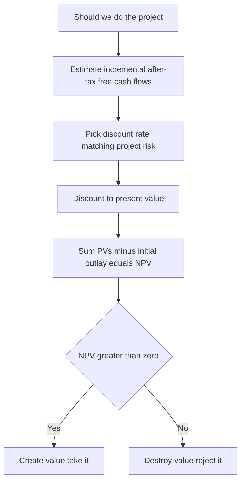
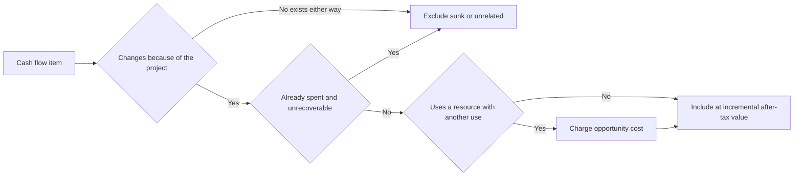
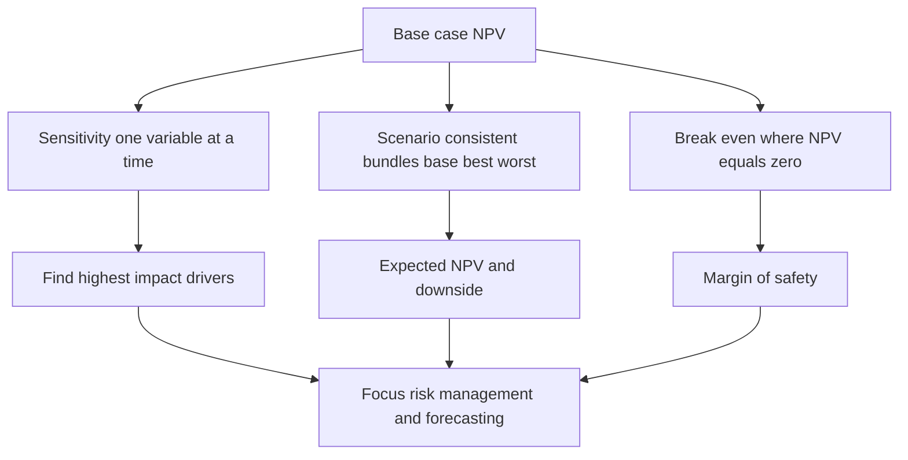

# Capital Budgeting & Project Analysis

## The Problem / Why this matters

A company is a machine for turning cash today into more cash tomorrow. Every big decision it makes — build a new plant, launch a product, buy a competitor, replace a fleet of trucks, enter a new country — is a bet: **spend money now, receive uncertain money later.** Capital budgeting is the discipline of deciding *which* of those bets to take.

Here is why this is the most important thing a corporate-finance professional does. Operating decisions (should we discount this order 3%?) are reversible and small. Capital budgeting decisions are **large, largely irreversible, and long-lived.** A steel plant built in 2010 still shapes the P&L in 2035. A bad plant cannot be un-built; a good one compounds for decades. Warren Buffett calls the person who allocates a company's capital its most important employee, because over time *capital allocation IS the company.*

And yet the mechanics are where almost everyone — including experienced analysts — quietly gets it wrong. Not the discounting; a spreadsheet does the discounting. The errors live in the **cash flows**: what to include, what to exclude, what is incremental, whose money it is, and at what rate to discount it. An interviewer for equity research, credit, IB, or FP&A will not test whether you can press the NPV button. They will test whether you know that R&D already spent is irrelevant, that the factory floor you "already own" still has an opportunity cost, that a new product steals sales from your old one, and that you must discount project cash flows at the *project's* risk, not the *company's* borrowing rate.

This chapter builds the entire cash-flow engine from first principles, then layers on the risk tools — sensitivity, scenario, break-even, and equivalent annual cost — that let you say something intelligent about a project when (as always) the forecast is wrong.

## Core Idea

Strip capital budgeting down and it is three sentences:

1. **A project is worth the present value of the extra cash it puts in shareholders' pockets, minus what it costs to build.** That number is **Net Present Value (NPV)**. Take the project if NPV > 0.

2. **"Extra cash" means incremental, after-tax, free cash flow** — the difference between the world *with* the project and the world *without* it. Everything hinges on getting that difference right: include everything that changes because of the project, exclude everything that does not.

3. **Discount those cash flows at the rate that reflects the project's own risk** — the opportunity cost of capital for *this* risk class. Cash and rate must match: a safe cash flow discounted at a risky rate, or vice versa, gives a wrong answer.

Everything else in this chapter — sunk costs, opportunity costs, cannibalization, working capital, salvage, EAC, sensitivity — is just the careful application of these three sentences.

## Why it works this way — first principles

**Why present value, and not just total profit?** Because a rupee today is worth more than a rupee next year. You could invest today's rupee and have more than a rupee next year, so future money must be *discounted* to be comparable to present money. NPV converts a stream of differently-timed cash flows into a single number denominated in today's rupees. The discount rate is the exchange rate between "money then" and "money now," and it is set by what investors could earn elsewhere on equally risky money — the **opportunity cost of capital.**

**Why incremental?** Because the decision is not "does the firm make money," it is "does the firm make *more* money by doing this than by not doing this." The only things relevant to a decision are the things the decision *changes.* This single principle — the **stand-alone / with-vs-without principle** — generates the entire treatment of sunk costs, opportunity costs, and cannibalization. Ask, always: *does this cash flow exist because we said yes?* If it exists either way, it is not the project's.

**Why after-tax?** Because shareholders keep what is left after the government takes its share. Tax is a real cash outflow. And because depreciation — a non-cash accounting entry — reduces taxable income, it shelters cash from tax and therefore *has* a cash consequence even though depreciation itself is not a cash flow. Ignore tax and you will systematically overvalue projects.

**Why cash, not accounting profit?** Because you cannot spend earnings; you can only spend cash. Accounting profit is an opinion (it spreads costs over time via depreciation, recognizes revenue before cash arrives, etc.); cash is a fact. Valuation is about cash in the door. Accrual accounting deliberately *breaks* the timing between profit and cash — capital budgeting must undo that and get back to when the cash actually moves.

**Why the project's risk, not the firm's?** Because value comes from investors, and investors price risk. Money going into a risky venture must clear a higher bar (higher required return) than money going into a safe one, because investors demand compensation for bearing risk. A pharma company evaluating a safe toll-road investment should discount it like a toll road, not like a drug pipeline. The discount rate belongs to the **use** of funds (the project), not the **source** of funds (the company).



---

## Full technical content

### 1. The NPV rule and its cousins

**Net Present Value.** For a project with initial outlay `CF0` (a negative number, cash out) and future free cash flows `CF1 … CFn`:

```
NPV = CF0 + CF1/(1+r) + CF2/(1+r)^2 + ... + CFn/(1+r)^n
    = Σ  CFt / (1+r)^t   for t = 0 to n
```

**Decision rule:** accept if NPV > 0; among mutually exclusive projects, take the highest positive NPV. NPV measures value *created* in today's rupees — it is directly additive to shareholder wealth, which is why it is the theoretically correct rule.

**Internal Rate of Return (IRR)** is the discount rate that makes NPV = 0:

```
0 = Σ CFt / (1+IRR)^t
```

Decision rule: accept if IRR > cost of capital (the "hurdle rate"). IRR is intuitive (a percentage return) and beloved by practitioners, but it has traps (below). NPV is the master rule; IRR is a communication tool.

**Payback period** = time to recover the initial outlay from cumulative cash flows. **Discounted payback** uses discounted cash flows. Payback is a crude liquidity/risk screen — it ignores everything after the cutoff and (in simple form) the time value of money — but interviewers still ask it, and credit analysts genuinely care about it.

**Profitability Index (PI)** = PV of future cash flows / initial investment = 1 + NPV/Investment. Useful for ranking under a capital constraint (bang for buck).

| Rule | Question it answers | Strength | Weakness |
|---|---|---|---|
| NPV | How much value created (₹) | Correct, additive, absolute | Not a % — hard to compare sizes intuitively |
| IRR | What % return | Intuitive, no rate needed to compute | Multiple/no IRR, reinvestment assumption, scale-blind |
| Payback | How fast do we get money back | Simple liquidity/risk screen | Ignores post-payback and TVM |
| PI | Value per rupee invested | Good for capital rationing | Can mislead on mutually exclusive scale |

> **Interview one-liner:** "NPV is the only rule that always gives the wealth-maximizing answer because it is measured in rupees and is additive. I use IRR and payback as supporting color, not as the decision."

### 2. Estimating incremental free cash flow — the heart of it

The free cash flow (to the firm / project, unlevered) in a given year is built as follows:

```
  Revenue
- Operating costs (cash)
- Depreciation & amortization
= EBIT
- Taxes = EBIT × tax rate           (unlevered — ignore interest)
= NOPAT  (net operating profit after tax)
+ Depreciation & amortization        (add back — it was non-cash)
- Increase in net working capital (ΔNWC)
- Capital expenditure (CapEx)
= Free Cash Flow (project)
```

Equivalently, the tax-shield form, which is very interview-friendly:

```
FCF = (Revenue − Cash costs) × (1 − t)  +  Depreciation × t  −  ΔNWC  −  CapEx
```

Read that second line carefully — it is the whole engine:
- **`(Revenue − Cash costs) × (1 − t)`** — after-tax operating cash profit.
- **`Depreciation × t`** — the **depreciation tax shield**. Depreciation is not cash, but it reduces taxable income, so it *saves* `Depreciation × t` in tax. That saving IS cash. This is why we add depreciation back but only its tax effect matters to value.
- **`− ΔNWC`** — cash tied up in working capital (see below).
- **`− CapEx`** — cash spent on long-lived assets.

**Three golden rules of cash-flow estimation:**

1. **Incremental only** — with-vs-without, not before-vs-after.
2. **After tax** — always.
3. **Cash, on a consistent basis with the discount rate** — nominal cash flows with a nominal rate (the norm), or real with real; unlevered cash flows with WACC (never subtract interest AND discount at WACC — that double-counts financing).

### 3. Sunk costs — the money already gone

A **sunk cost** is a cash outlay that has *already been incurred and cannot be recovered,* regardless of whether you go ahead. It is **irrelevant** to the decision because it does not change with the decision.

Classic example: you spent ₹50 lakh on a market study for a product. The study is done; the ₹50 lakh is gone whether you launch or not. It does **not** belong in the NPV. Including it (the "sunk cost fallacy" / "we've come too far to quit") destroys value by pushing you to throw good money after bad.

> Test: "Would this cash flow be different if we said no right now?" If no → it is sunk → exclude it. The R&D already spent, the consultant already paid, the option premium already paid: all sunk.

Nuance: costs are sunk only to the extent they are *unrecoverable.* If you can sell the half-finished thing for scrap, that recoverable amount is *not* sunk — it is an opportunity cost of continuing (see next).

### 4. Opportunity costs — the value you give up

An **opportunity cost** is the value of the best alternative use of a resource the project consumes. Even resources the firm *already owns* are not free if they could be used or sold elsewhere.

Canonical example: a project will be housed in a warehouse the firm already owns "for free." Not free. If the warehouse could be **rented out for ₹20 lakh/year** or **sold for ₹4 crore,** using it for the project *forgoes* that. The forgone amount is a real economic cost and **must** be charged to the project.

Rule: value the resource at its **market/next-best-use value,** after tax. If you'd otherwise sell an owned asset for ₹4 cr, the project's initial outlay should include an opportunity cost of the after-tax sale proceeds you gave up.

> **Trap the interviewer sets:** "The land is already on our books at ₹1 crore, so the project's land cost is ₹1 crore." Wrong twice. Book value is irrelevant (sunk/accounting). Use the ₹4 cr market value it could fetch today, after tax. Opportunity cost is about the *forgone alternative*, not the historical cost.

### 5. Cannibalization (and its cousin, positive spillovers)

**Cannibalization** (erosion) is when a new project *steals* cash flows from the firm's existing products. Because we evaluate on a with-vs-without basis, lost profit on existing products caused by the new project is an **incremental cost of the new project** and must be subtracted.

Example: a snack company launches "Chips Lite." It sells ₹100 cr; but ₹30 cr of those buyers would otherwise have bought regular Chips. The *incremental* revenue is not ₹100 cr — the lost contribution margin on the ₹30 cr of cannibalized regular Chips must be deducted.

The subtle, important refinement: **only lost sales that would truly have been retained count.** If a competitor was about to launch its own light chip and would have taken that ₹30 cr *anyway,* then those sales were leaving regardless — they are not incremental to *your* decision, so you should NOT deduct them. The with-vs-without world assumes you keep only what you'd realistically keep by *not* launching.

**Positive spillovers** run the other way: a razor sold at a loss drives blade sales; a loss-leader product boosts the whole basket. Those *incremental* gains to other products belong in the project too. Incrementality cuts both ways.



### 6. Working capital — the cash the P&L hides

Growing a business ties up cash in **net working capital (NWC)** = (inventory + accounts receivable) − accounts payable. When sales rise you must fund more inventory and give customers credit (receivables) before cash comes back; suppliers finance part of it (payables). The *net* amount is cash locked away — invisible in accounting profit but very real.

Rules:
- An **increase** in NWC is a cash **outflow** (`−ΔNWC`); a **decrease** is a cash **inflow**.
- NWC is usually funded **at the start of the period** it supports — model the investment in year 0 (or the year before sales ramp), and each subsequent year fund only the *incremental* change.
- **At the end of the project, NWC is recovered** — inventory is sold down and receivables collected — so add it all back as a terminal inflow. This is a very common exam/interview point: people forget the recovery.

Example logic: if NWC needs are 20% of next year's sales, and sales grow from ₹100 → ₹150 → ₹150, then NWC = 20, 30, 30. ΔNWC = +20 (yr0), +10 (yr1), 0 (yr2), and −30 recovered at the end.

### 7. Salvage value and terminal cash flows

At the end of a project you may sell the equipment. The **after-tax salvage value** is:

```
After-tax salvage = Sale price − Tax × (Sale price − Book value)
                  = Sale price × (1 − t) + Book value × t     [rearranged]
```

Why the tax term? If you sell an asset for more than its depreciated book value, the excess (`Sale − Book`) is a taxable gain — you'd previously over-depreciated, so the tax authority claws it back. If you sell for *less* than book value, you book a loss, which *saves* tax (a tax benefit). Book value here is the tax book value = original cost − accumulated tax depreciation.

Terminal-year cash flow therefore typically bundles: last year's operating FCF **+** after-tax salvage **+** NWC recovery.

> **Interview trap:** "Salvage is ₹10 lakh so add ₹10 lakh." No — if book value is 0 and tax is 25%, after-tax salvage is 10 × (1 − 0.25) = ₹7.5 lakh. Always tax the gain.

### 8. The correct discount rate

The discount rate is the **opportunity cost of capital for the project's risk** — the return investors could get on an equally risky alternative. Practical rules:

- **Use the project's risk, not the firm's.** If the project's risk ≈ the firm's typical business, the firm's **WACC** is a fair proxy. If the project is riskier (new market, new tech) or safer (regulated toll road), adjust up or down. Discounting a low-risk project at the high firm WACC wrongly rejects good projects; discounting a high-risk project at a low rate wrongly accepts bad ones ("risk-shifting").
- **WACC** = weighted average cost of equity and after-tax debt:

```
WACC = (E/V) × Re + (D/V) × Rd × (1 − t)
```
where `Re` = cost of equity (often from CAPM: `Re = Rf + β×(Rm − Rf)`), `Rd` = cost of debt, `t` = tax rate, and weights are **market**, target weights. Debt is after-tax because interest is tax-deductible — the tax shield is captured in the *rate*, so cash flows are kept unlevered (don't subtract interest again).

- **Match nominal/real.** Nominal cash flows (which include inflation) → nominal discount rate. Real cash flows → real rate. Mixing them is a classic error.
- **The financing source is irrelevant to the rate.** Funding a project with cheap debt does *not* make the project's hurdle rate low. Every project draws on the whole capital pool; use the risk-appropriate cost of capital. This is the "**WACC is for average-risk projects; adjust for the project**" point plus the "**don't use the marginal source's cost**" point.

> **Interview one-liner:** "The discount rate is a property of the *use* of the money, not the *source*. I discount at the opportunity cost of capital for the project's risk — WACC only if the project has firm-average risk."

### 9. Dealing with uncertainty — the forecast is always wrong

A single NPV is a point estimate built on assumptions that *will* be wrong. Good analysts pressure-test it. Three standard tools, in order of sophistication:

#### (a) Sensitivity analysis ("what-if, one at a time")
Change **one** input at a time (holding others at base case), recompute NPV, see how much it moves. It answers: *which variable is NPV most sensitive to?* Rank variables by the swing they produce. The steepest ones are where forecasting effort and risk management should focus. Output is often a **tornado chart** (bars sorted by impact). Limitation: ignores that variables move *together* and gives no probability.

#### (b) Scenario analysis ("consistent bundles")
Change **several** inputs together into internally consistent stories — typically **Base / Best (optimistic) / Worst (pessimistic).** In a recession, volume AND price AND margins fall together; scenario analysis captures those correlations. You can attach probabilities and compute an expected NPV. Limitation: only a few discrete scenarios; you pick them.

#### (c) Break-even analysis ("where does it stop mattering")
Find the value of an input at which **NPV = 0** (or accounting/operating break-even). "How low can volume go before this project destroys value?" If the break-even volume is far below realistic worst-case volume, you have a margin of safety. Two flavors:
- **Accounting break-even:** units where operating profit (incl. depreciation) = 0.
- **NPV / financial break-even:** units where NPV = 0 — a *higher* bar, because it must also cover the opportunity cost of capital. This distinction is a favorite interview probe.

**Operating leverage** connects to break-even: high fixed costs → high break-even → NPV very sensitive to volume → riskier project. A tool beyond these three is **Monte Carlo simulation** (draw thousands of random input combinations from distributions → distribution of NPV), and **decision trees / real options** for staged decisions — worth naming in an interview.



### 10. Equivalent Annual Cost / Annuity (EAC / EAA)

**The problem it solves:** you cannot compare two projects with **different lifespans** using raw NPV. A machine costing ₹10 lakh that lasts 3 years vs. one costing ₹15 lakh that lasts 5 years — the 3-year machine will be replaced sooner, so comparing a single 3-year NPV to a single 5-year NPV is apples to oranges.

**EAC** converts a project's whole-life cost (its NPV of costs) into a **level annual cash flow** — the constant amount per year that has the same present value over the asset's life. Then you compare *per-year* costs, which are directly comparable regardless of life, because each is a perpetual-replacement equivalent.

```
EAC = NPV of costs / Annuity factor(r, n)

where Annuity factor A(r,n) = [1 − (1+r)^(−n)] / r
```

Pick the option with the **lowest EAC** (for cost problems) or **highest equivalent annual annuity (EAA)** (for value problems). This is exactly the tool for **replacement timing** ("when should we replace the truck?") and **choosing between equipment of different lives.** It implicitly assumes the asset is **replaced repeatedly** (a chain of identical projects) — flag that assumption; if technology will change or the need ends, EAC is less appropriate.

---

## Worked examples

### Worked Example 1 — Full project NPV with WC, depreciation, salvage, cannibalization

**Setup.** SnackCo evaluates a new baked-chips line. Facts:
- New equipment (CapEx): ₹300 lakh, depreciated straight-line to zero over 5 years (₹60 lakh/yr). Project life 5 years.
- Salvage (sale) at end of year 5: ₹40 lakh.
- Revenue: ₹400 lakh/yr. Cash operating costs: ₹250 lakh/yr.
- **Cannibalization:** ₹50 lakh/yr of sales come from existing fried-chips customers; contribution margin on those lost fried-chips sales is 40%, so lost contribution = ₹20 lakh/yr (pre-tax).
- Net working capital = 15% of annual revenue, in place at start of each year, funded at year 0, fully recovered at end.
- A ₹30 lakh market study was already done (sunk).
- The plant sits in an owned building that could be rented for ₹10 lakh/yr (opportunity cost).
- Tax rate 25%. Discount rate 12%.

**Step 1 — Screen the irrelevant/opportunity items.**
- ₹30 lakh study = **sunk → exclude.**
- Building rent forgone ₹10 lakh/yr = **opportunity cost → include as a cost** each year.

**Step 2 — Initial outlay (Year 0).**
- CapEx: −300
- NWC = 15% × 400 = 60 → −60
- Year-0 total = **−360**

**Step 3 — Annual operating FCF (Years 1–5).**
Incremental pre-tax operating profit before depreciation:
- Revenue 400 − cash costs 250 = 150
- Less cannibalized contribution lost: −20
- Less opportunity cost (rent forgone): −10
- = 120 (cash operating profit before depreciation)

Now apply the tax-shield form: `(120)×(1−0.25) + Dep×t`
- After-tax operating cash: 120 × 0.75 = 90
- Depreciation tax shield: 60 × 0.25 = 15
- **Annual FCF (yr 1–4) = 90 + 15 = 105**

(NWC is flat at 60 since revenue is flat, so ΔNWC = 0 in years 1–5.)

**Step 4 — Terminal year (Year 5) extras.**
- After-tax salvage: book value = 0, so tax on gain = 40 × 0.25 = 10 → after-tax = 40 − 10 = **30**
- NWC recovery: **+60**
- Year-5 FCF = 105 + 30 + 60 = **195**

**Step 5 — Discount at 12%.** Discount factors: 0.8929, 0.7972, 0.7118, 0.6355, 0.5674.

| Year | FCF | DF @12% | PV |
|---|---|---|---|
| 0 | −360 | 1.0000 | −360.00 |
| 1 | 105 | 0.8929 | 93.75 |
| 2 | 105 | 0.7972 | 83.71 |
| 3 | 105 | 0.7118 | 74.74 |
| 4 | 105 | 0.6355 | 66.73 |
| 5 | 195 | 0.5674 | 110.65 |

PV of years 1–4 = 93.75 + 83.71 + 74.74 + 66.73 = 318.93. Plus year 5 = 110.65. Sum of inflows PV = 429.58.

**NPV = 429.58 − 360 = ₹69.58 lakh > 0 → accept.**

*Self-check:* the ₹30 lakh study correctly never appears; drop the opportunity cost and cannibalization and FCF would rise to 150×0.75+15 = 127.5, materially changing NPV — showing why those adjustments matter.

### Worked Example 2 — Equivalent Annual Cost, two machines with different lives

**Setup.** A factory needs a compressor. Two options, discount rate 10%, ignore tax for simplicity:
- **Machine A:** cost ₹90 lakh now, life 3 years, running cost ₹20 lakh/yr.
- **Machine B:** cost ₹120 lakh now, life 5 years, running cost ₹15 lakh/yr.

Raw NPV of costs is misleading (different lives). Use EAC.

**Machine A.** Annuity factor A(10%,3) = [1 − 1.1^−3]/0.10 = [1 − 0.7513]/0.10 = 2.4869.
- PV of costs = 90 + 20 × 2.4869 = 90 + 49.74 = 139.74
- EAC_A = 139.74 / 2.4869 = **₹56.19 lakh/yr**

(Equivalently: 90/2.4869 + 20 = 36.19 + 20 = 56.19. ✓)

**Machine B.** Annuity factor A(10%,5) = [1 − 1.1^−5]/0.10 = [1 − 0.6209]/0.10 = 3.7908.
- PV of costs = 120 + 15 × 3.7908 = 120 + 56.86 = 176.86
- EAC_B = 176.86 / 3.7908 = **₹46.66 lakh/yr**

(Check: 120/3.7908 + 15 = 31.66 + 15 = 46.66. ✓)

**Decision:** Machine B has the lower equivalent annual cost (46.66 < 56.19) → **choose B.** Even though B costs more upfront and has a larger total NPV of costs, on a per-year, replace-forever basis it is ₹9.5 lakh/yr cheaper. Comparing raw NPVs (139.74 vs 176.86) would have wrongly favored A.

### Worked Example 3 — Sensitivity, scenario, and NPV break-even

**Setup.** A project: sell `Q` units/yr for 4 years at price ₹500, variable cost ₹300, fixed cash costs ₹40 lakh/yr. CapEx ₹100 lakh, depreciated straight-line to zero over 4 years (₹25 lakh/yr), no salvage, no working capital. Tax 25%, discount rate 10%. Base case Q = 60,000 units.

**Base-case FCF.** Contribution/unit = 500 − 300 = ₹200. At Q = 60,000 → contribution = ₹120 lakh.
- Pre-dep operating profit = 120 − 40 (fixed) = 80 lakh
- After-tax: 80 × 0.75 = 60; + dep shield 25 × 0.25 = 6.25 → **FCF = 66.25 lakh/yr**
- Annuity factor A(10%,4) = [1 − 1.1^−4]/0.10 = [1 − 0.6830]/0.10 = 3.1699
- PV inflows = 66.25 × 3.1699 = 210.01; **NPV = 210.01 − 100 = ₹110.0 lakh.**

**(a) Sensitivity — price −10% (₹500 → ₹450), one variable.**
Contribution/unit = 450 − 300 = 150 → contribution 60k×150 = 90 lakh.
- Pre-dep profit = 90 − 40 = 50; after-tax 37.5 + shield 6.25 = 43.75 FCF
- NPV = 43.75 × 3.1699 − 100 = 138.68 − 100 = **₹38.7 lakh.**
- A 10% price cut wiped out ~65% of NPV → **NPV is highly sensitive to price.** (Doing the same for volume −10% gives contribution 108→ pre-dep 68 → FCF 25×... let's see: 108−40=68; ×0.75=51+6.25=57.25; NPV=57.25×3.1699−100=₹81.5 lakh, a 26% drop.) So **price matters more than volume** here — that's the actionable insight.

**(b) Scenario — pessimistic bundle.** Recession: Q falls to 45,000 **and** price to ₹460 **and** fixed costs rise to ₹45 lakh (all together).
- Contribution/unit = 460 − 300 = 160; contribution = 45,000 × 160 = 72 lakh
- Pre-dep = 72 − 45 = 27; after-tax 20.25 + shield 6.25 = 26.5 FCF
- NPV = 26.5 × 3.1699 − 100 = 84.0 − 100 = **−₹16.0 lakh.** The consistent downside bundle turns NPV negative — the single-variable view understated the risk because the bad inputs correlate.

**(c) NPV break-even volume.** Find Q where NPV = 0.
Let FCF as a function of Q: contribution = 200Q (Q in units, ₹). Pre-dep profit = 200Q − 40,00,000. After-tax = (200Q − 40,00,000)×0.75. Plus dep shield 6,25,000.
FCF(Q) = 0.75×(200Q − 40,00,000) + 6,25,000 = 150Q − 30,00,000 + 6,25,000 = 150Q − 23,75,000.
NPV = 0 requires PV inflows = 100 lakh = 1,00,00,000, so required annual FCF = 1,00,00,000 / 3.1699 = 31,54,940.
Set 150Q − 23,75,000 = 31,54,940 → 150Q = 55,29,940 → **Q ≈ 36,866 units.**

- **NPV break-even ≈ 36,900 units.** Base case is 60,000, so volume can fall ~38% before value is destroyed — a healthy margin of safety.
- Compare **accounting break-even** (operating profit incl. depreciation = 0, ignoring TVM): contribution 200Q = fixed 40 lakh + dep 25 lakh = 65 lakh → Q = 32,500 units. Note the **NPV break-even (36,866) is higher than the accounting break-even (32,500)** — because NPV must also earn the 10% opportunity cost of capital, not merely break even on the books. This gap is the exact point interviewers love.

---

## How it is tested in interviews

Interviewers rarely ask you to build a full model on a whiteboard. They probe whether you *understand incrementality and the discount rate.* Here are the exact questions and crisp model answers.

**Q: "What cash flows go into a capital budgeting decision?"**
> "Incremental, after-tax, unlevered free cash flows — the difference between the firm with and without the project. Include the depreciation tax shield, changes in working capital, and salvage; exclude sunk costs and financing cash flows, and charge opportunity costs and cannibalization. Then discount at the project's risk-adjusted cost of capital."

**Q: "We already spent ₹50 lakh on R&D. Does it go in the NPV?"**
> "No — it's sunk. It's the same whether we proceed or not, so it can't affect an incremental decision. The only relevant costs are ones that change with the decision going forward."

**Q: "The project will use a building we already own. Cost to the project?"**
> "The opportunity cost — what we forgo by not renting it out or selling it, valued at market and after tax. Book value is irrelevant. If we could rent it for ₹10 lakh a year, that's a real annual cost to the project."

**Q: "Why do we add back depreciation but it still affects value?"**
> "Depreciation isn't cash, so we add it back to get from accounting profit to cash flow. But it's tax-deductible, so it shelters income — the depreciation × tax-rate 'tax shield' is a genuine cash saving. So depreciation matters to value only through its tax effect."

**Q: "New product cannibalizes our existing one — how do you treat it?"**
> "Subtract the lost contribution margin on the cannibalized existing sales as an incremental cost — but only sales we'd realistically have kept. If a competitor would've taken them anyway, they're not incremental to our decision."

**Q: "What discount rate — the company's cost of debt, since we're funding it with a loan?"**
> "No. The rate reflects the project's risk, not how it's financed. It's the opportunity cost of capital for this risk class — WACC if the project is firm-average risk, adjusted up or down otherwise. Cheap debt doesn't lower a risky project's hurdle rate."

**Q: "NPV vs IRR — which and why?"**
> "NPV. It's in rupees, it's additive, and it always maximizes shareholder wealth. IRR is intuitive but can give multiple values with unconventional cash flows, assumes reinvestment at the IRR, and ignores scale — so for mutually exclusive projects it can rank wrong. I use IRR to communicate, NPV to decide."

**Q: "Two machines, different lives — how compare?"**
> "Equivalent annual cost. Convert each project's whole-life cost into a level annual figure by dividing its PV of costs by the annuity factor, then pick the lowest EAC. It assumes repeated replacement, which I'd flag."

**Q: "Difference between accounting and NPV break-even?"**
> "Accounting break-even is where operating profit including depreciation is zero. NPV break-even is higher — it's where the project also earns the cost of capital, i.e., NPV = 0. Clearing accounting break-even can still destroy value."

**Q: "Sensitivity vs scenario analysis?"**
> "Sensitivity flexes one variable at a time to find which driver NPV is most sensitive to. Scenario analysis flexes several correlated variables together into consistent stories — base, best, worst — capturing the fact that in a downturn price and volume fall together. Scenario shows realistic downside; sensitivity shows where to focus."

**Numerical you might get on the spot:** "Equipment ₹100, 5-yr straight-line, sells for ₹20 at end, tax 25% — after-tax salvage?" → book value 0, gain 20, tax 5, after-tax = **₹15.** Or: "Sales up ₹100, costs up ₹40, dep ₹20, tax 30% — incremental FCF?" → EBIT = 100−40−20 = 40; NOPAT = 28; +dep 20 = **₹48.**

---

## Traps & common mistakes

1. **Including sunk costs.** "We've spent so much already" is not a reason to continue. Only future incremental cash flows count.
2. **Treating owned resources as free.** Land/building/equipment already owned still carry opportunity cost at market value.
3. **Using book value instead of market value** for opportunity cost or salvage. Book value is an accounting artifact.
4. **Forgetting the depreciation tax shield** — or, worse, subtracting full depreciation as if it were cash. Add depreciation back; capture only its tax effect.
5. **Ignoring working capital,** especially the **terminal recovery** of NWC. Also modeling NWC as a cost in the wrong year.
6. **Forgetting to tax the salvage gain.** After-tax salvage ≠ sale price.
7. **Ignoring cannibalization** (overstating incremental revenue) — or over-deducting sales a competitor would've taken anyway.
8. **Subtracting interest AND discounting at WACC** — double-counting the cost of debt. Use unlevered FCF with WACC.
9. **Wrong discount rate:** using firm WACC for an off-risk project, or the marginal financing source's cost. Rate follows the *project's* risk.
10. **Mixing nominal and real** — nominal cash flows must meet a nominal rate.
11. **Comparing different-life projects by raw NPV** instead of EAC.
12. **Ranking mutually exclusive projects by IRR or PI** when scales differ — NPV is the tiebreaker.
13. **Confusing accounting and NPV break-even** — the latter is the higher, value-relevant bar.
14. **One-variable sensitivity mistaken for downside risk** — correlated variables (scenario analysis) reveal the true downside.

---

## First-principles recap

- A project creates value only if it returns **more than the opportunity cost of the capital** it consumes; NPV, in today's rupees, measures exactly that.
- The only cash flows that matter are those that **change because of the decision** — incremental, with-vs-without. This one idea generates sunk costs (exclude), opportunity costs (include), and cannibalization (include lost margin).
- Value lives in **cash, after tax,** not accounting profit — hence add back depreciation but keep its tax shield, and tax the salvage gain.
- Growth **consumes cash through working capital,** which is invisible in profit and **recovered at the end.**
- The discount rate is a property of the **project's risk (use of funds), not its financing (source).**
- Because forecasts are always wrong, **sensitivity, scenario, break-even, and EAC** turn a single fragile NPV into a defensible view of drivers, downside, and margin of safety.
- **NPV decides; IRR, payback, and PI inform.**

---

## Quick-reference

| Concept | Formula / Rule |
|---|---|
| NPV | `Σ CFt/(1+r)^t`; accept if > 0 |
| IRR | rate where NPV = 0; accept if > hurdle |
| Free cash flow | `(Rev − Cash costs)(1−t) + Dep×t − ΔNWC − CapEx` |
| NOPAT route | `EBIT×(1−t) + Dep − ΔNWC − CapEx` |
| Depreciation tax shield | `Depreciation × tax rate` |
| After-tax salvage | `Sale − t×(Sale − Book)` |
| ΔNWC | outflow if NWC rises; recover full NWC at end |
| Sunk cost | already spent, unrecoverable → **exclude** |
| Opportunity cost | forgone value of resource at market, after tax → **include** |
| Cannibalization | lost contribution on retained existing sales → **subtract** |
| Discount rate | opportunity cost for **project's** risk; WACC if firm-average |
| WACC | `(E/V)Re + (D/V)Rd(1−t)` |
| CAPM (Re) | `Rf + β(Rm − Rf)` |
| Annuity factor | `A(r,n) = [1 − (1+r)^(−n)] / r` |
| EAC | `PV of costs / A(r,n)`; choose lowest |
| Accounting break-even (units) | `(Fixed + Dep) / (Price − VC)` |
| NPV break-even | Q where NPV = 0 (higher than accounting BE) |
| Sensitivity | one variable at a time → find key driver |
| Scenario | correlated bundles: base / best / worst |
| PI | `PV of inflows / investment = 1 + NPV/Inv` |
