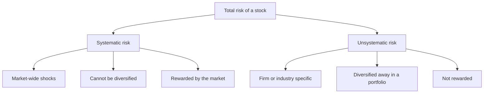
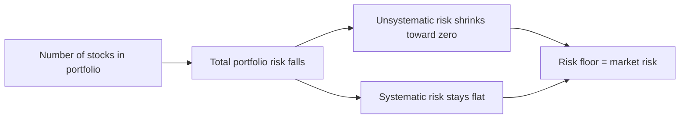
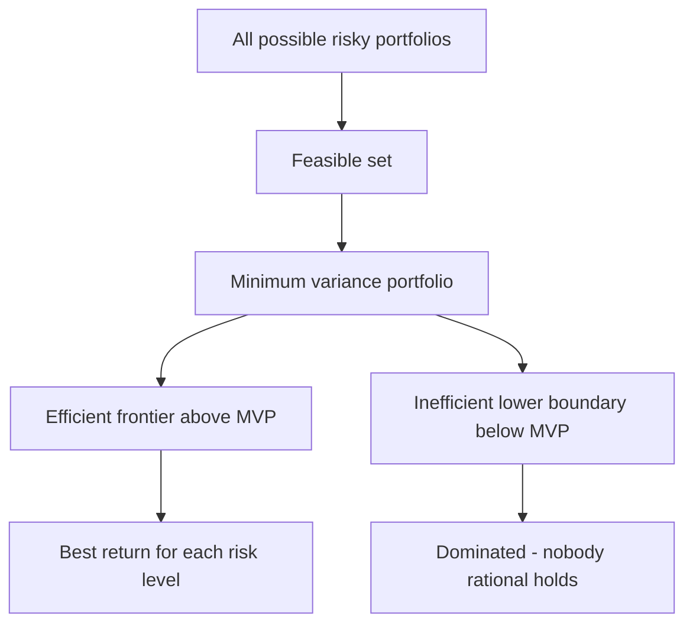
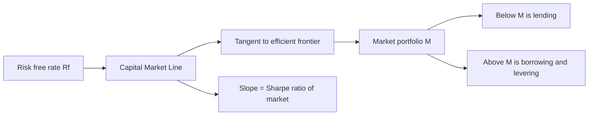

# Risk & Return Fundamentals

## The Problem / Why this matters

Every finance decision is a trade of money-now for money-later, and money-later is *uncertain*. An equity research analyst pricing a stock, a credit analyst sizing a spread, an FP&A lead choosing between two capex projects, and an IB associate building a WACC — all four are secretly answering the same question: **how much extra return does this uncertainty deserve?**

If you cannot measure risk, you cannot price it. And if you cannot price risk, every other number you produce — a target price, a required yield, a discount rate, a hurdle rate — is a guess dressed up as a spreadsheet. Risk-and-return is the *grammar* of finance. WACC, CAPM, DCF, beta, cost of equity, the equity risk premium — none of them make sense until you can answer three questions cleanly:

1. **How do we measure the return we expect?**
2. **How do we measure the risk around that expectation?**
3. **Why does combining assets change the risk but not (necessarily) the return?**

This chapter builds all of that from first principles. It is also, bluntly, the single most heavily tested topic in generalist finance interviews. "What's the difference between systematic and unsystematic risk?" "Why does diversification work?" "If two stocks each have 30% vol, what's the vol of a 50/50 portfolio?" "What does the Sharpe ratio tell you?" — you will be asked some version of these, and a crisp answer signals you actually understand markets rather than having memorized a formula sheet.

## Core Idea

In plain language:

- **Return** is what you get. We summarize a set of possible returns by their **average** (the *expected return*, the center of the distribution).
- **Risk** is how much reality can deviate from that average. We summarize it by **variance** and its square root, **standard deviation** (a.k.a. *volatility*).
- When you **combine assets into a portfolio**, the portfolio's expected return is just the weighted average of the pieces — but the portfolio's *risk is less than* the weighted average of the pieces, as long as the assets don't move in perfect lockstep. That "free" risk reduction is **diversification**, and it is the closest thing to a free lunch in finance.
- Diversification kills the risk that is *specific* to individual companies (**unsystematic risk**) but cannot kill the risk that hits the whole market (**systematic risk**). The market pays you a premium *only* for bearing systematic risk, because that is the only risk you can't diversify away.
- Put every possible portfolio on a risk-vs-return chart, and the best ones trace out the **efficient frontier**. Add a risk-free asset and the best achievable set becomes a straight line — the **Capital Market Line** — whose slope is the market's reward-per-unit-of-risk. The **Sharpe ratio** is exactly that slope for any portfolio: excess return per unit of total risk.

That's the whole chapter in six bullets. The rest is making each one rigorous and interview-ready.

## Why it works this way — first principles

**Why average for return?** If you had to bet on a single number to represent a random payoff — and you'll repeat the bet many times — the *expected value* (probability-weighted mean) is the number that makes your long-run average come out right. It's the unbiased "center of mass" of the distribution.

**Why standard deviation for risk?** We want a measure of *spread* — how far outcomes stray from the mean. A natural choice is average deviation from the mean, but plain deviations cancel (positives offset negatives, summing to zero by definition). So we **square** the deviations (making them all positive and penalizing large misses more than small ones), average them (that's **variance**), then **take the square root** to get back to the original units (rupees, or %). Standard deviation is therefore "typical distance from the mean, in the same units as the return." That unit-matching is why we quote *volatility* in %, not %².

**Why does diversification reduce risk?** Because risk (variance) is not additive when assets move independently. If Stock A has a bad month for a reason specific to A (a failed drug trial, a plant fire, a CEO scandal), and Stock B's fortunes are driven by unrelated forces, then in any given month A's surprise and B's surprise partially cancel. Averaging many *imperfectly correlated* surprises shrinks the combined surprise — the same statistical reason polling many people gives a tighter estimate than asking one. The mathematics: variance of a sum includes **covariance** terms, and when correlations are below 1, those cross-terms drag portfolio variance *below* the weighted-average variance.

**Why can't you diversify everything away?** Because some shocks hit *every* company at once — a recession, a rate hike, a war, a pandemic. No amount of adding stocks helps, because they all fall together. That common, undiversifiable component is systematic (market) risk. Since investors *can* eliminate company-specific risk for free (just hold many names), the market refuses to pay a premium for bearing it — you only get compensated for the risk you're *forced* to carry. This single insight is the seed of CAPM (next chapter).

## Full technical content

### 1. Measuring return

**Holding-period return (single period).** If you buy at price $P_0$, receive cash flow (dividend/coupon) $D_1$, and the price becomes $P_1$:

$$R = \frac{P_1 - P_0 + D_1}{P_0} = \underbrace{\frac{P_1 - P_0}{P_0}}_{\text{capital gain}} + \underbrace{\frac{D_1}{P_0}}_{\text{income yield}}$$

**Expected return from a probability distribution.** If returns $R_i$ occur with probabilities $p_i$:

$$E[R] = \sum_{i=1}^{n} p_i R_i$$

**Expected return from historical data** (each of $T$ observations equally likely, $1/T$):

$$\bar{R} = \frac{1}{T}\sum_{t=1}^{T} R_t$$

**Arithmetic vs geometric mean.** Two different averages, two different questions:

| Mean | Formula | Answers |
|---|---|---|
| Arithmetic | $\frac{1}{T}\sum R_t$ | Best estimate of *next period's* expected return |
| Geometric | $\left[\prod_{t}(1+R_t)\right]^{1/T} - 1$ | The *actually realized* compound growth rate over the whole period |

The geometric mean is always ≤ the arithmetic mean (equal only if every return is identical). The gap grows with volatility — approximately $\text{Geometric} \approx \text{Arithmetic} - \tfrac{1}{2}\sigma^2$. **Interview-relevant:** a +50% then −50% sequence has an arithmetic mean of 0% but a geometric mean of −13.4% (you end with 0.75 of your money). Volatility is a *drag* on compounded wealth.

### 2. Measuring risk — variance and standard deviation

**Variance (probability distribution):**

$$\sigma^2 = \sum_{i=1}^{n} p_i \,(R_i - E[R])^2$$

**Standard deviation:** $\sigma = \sqrt{\sigma^2}$.

**Variance from historical data.** Use $T-1$ in the denominator for a *sample* (Bessel's correction — you "used up" one degree of freedom estimating the mean); use $T$ for a full population:

$$s^2 = \frac{1}{T-1}\sum_{t=1}^{T}(R_t - \bar{R})^2$$

**Annualizing volatility.** If returns are independent across periods, variance scales with time and standard deviation scales with the square root of time:

$$\sigma_{\text{annual}} = \sigma_{\text{period}} \times \sqrt{k}$$

where $k$ = periods per year. Daily → annual uses $\sqrt{252}$ (trading days); monthly → annual uses $\sqrt{12}$. This "square-root-of-time" rule is a favorite quick-fire interview check.

**Other risk measures you should be able to name** (know they exist, know their one-line purpose):

| Measure | What it captures | Why/when |
|---|---|---|
| Variance / SD | Total dispersion (both sides of mean) | Standard, but treats upside vol as "risk" |
| Semi-variance / downside deviation | Only below-target deviations | Investors fear losses, not gains |
| Beta ($\beta$) | Sensitivity to the *market* | Isolates systematic risk (next chapter) |
| Value at Risk (VaR) | Loss threshold at a confidence level | "95% of days you won't lose more than X" |
| Coefficient of variation | Risk *per unit of return* = $\sigma / E[R]$ | Compares assets with different means |

### 3. Two assets — covariance and correlation

To combine assets we need to know how they *move together*.

**Covariance** measures the direction and magnitude of joint movement:

$$\text{Cov}(A,B) = \sigma_{AB} = \sum_i p_i\,(R_{A,i}-E[R_A])(R_{B,i}-E[R_B])$$

Its sign tells you the relationship; its magnitude is in awkward squared units, so we standardize it into **correlation**:

$$\rho_{AB} = \frac{\sigma_{AB}}{\sigma_A\,\sigma_B}, \qquad -1 \le \rho_{AB} \le +1$$

| $\rho$ | Meaning | Diversification benefit |
|---|---|---|
| $+1$ | Perfect positive — move in lockstep | **None** (risk is a straight weighted average) |
| $0$ | Uncorrelated — independent | Substantial |
| between 0 and 1 | Typical for two stocks (~0.3–0.7) | Real, partial |
| $-1$ | Perfect negative — perfect hedge | **Maximum** — risk can be driven to zero |

Key identity connecting the two: $\sigma_{AB} = \rho_{AB}\,\sigma_A\,\sigma_B$.

### 4. Portfolio return and risk (two assets)

**Portfolio expected return** — always a simple weighted average, no correlation involved:

$$E[R_P] = w_A E[R_A] + w_B E[R_B], \qquad w_A + w_B = 1$$

**Portfolio variance** — this is where correlation enters:

$$\sigma_P^2 = w_A^2\sigma_A^2 + w_B^2\sigma_B^2 + 2\,w_A w_B\,\rho_{AB}\,\sigma_A\sigma_B$$

**Portfolio standard deviation:** $\sigma_P = \sqrt{\sigma_P^2}$.

Stare at that middle equation — it is the mathematical heart of this entire chapter. The first two terms are the "own risk" of each asset. The third term, the **covariance term**, is the *interaction*. Because $\rho \le 1$:

$$\sigma_P \le w_A\sigma_A + w_B\sigma_B$$

with equality *only* when $\rho = +1$. For any $\rho < 1$, the portfolio's volatility is strictly less than the weighted average of the two volatilities. **That inequality is diversification, in one line.**

**Special cases worth memorizing:**

- $\rho = +1$: $\sigma_P = w_A\sigma_A + w_B\sigma_B$ (weighted average — no benefit).
- $\rho = -1$: $\sigma_P = |w_A\sigma_A - w_B\sigma_B|$, which can be driven to **zero** by choosing $w_A = \dfrac{\sigma_B}{\sigma_A+\sigma_B}$.
- $\rho = 0$: $\sigma_P = \sqrt{w_A^2\sigma_A^2 + w_B^2\sigma_B^2}$.

### 5. Portfolio risk with N assets

For $N$ assets the variance is a double sum over every pair:

$$\sigma_P^2 = \sum_{i=1}^{N}\sum_{j=1}^{N} w_i w_j \sigma_{ij} = \sum_{i} w_i^2\sigma_i^2 + \sum_{i}\sum_{j\ne i} w_i w_j \sigma_{ij}$$

The diagonal ($i=j$) gives the **variance** terms; the off-diagonal gives the **covariance** terms. As $N$ grows, the number of variance terms grows like $N$, but the number of covariance terms grows like $N^2 - N$. Covariances *swamp* variances.

**The punchline of finance.** Take an equally weighted portfolio ($w_i = 1/N$). Portfolio variance simplifies to:

$$\sigma_P^2 = \frac{1}{N}\overline{\sigma^2} + \left(1 - \frac{1}{N}\right)\overline{\text{Cov}}$$

where $\overline{\sigma^2}$ is the average variance and $\overline{\text{Cov}}$ is the average covariance. As $N \to \infty$:

$$\sigma_P^2 \;\longrightarrow\; \overline{\text{Cov}}$$

The first term (individual variance) vanishes — that is **unsystematic risk being diversified away**. The second term (average covariance) survives — that is **systematic risk**, the irreducible floor. You cannot diversify below the average covariance among assets, because that shared co-movement *is* market risk.

### 6. Systematic vs unsystematic risk

| | Systematic (market / non-diversifiable) | Unsystematic (specific / diversifiable) |
|---|---|---|
| Source | Macro forces hitting all firms | Events unique to one firm/industry |
| Examples | Recession, interest rates, inflation, war, tax policy, GDP | Product recall, lawsuit, CEO exit, plant fire, failed launch |
| Diversifiable? | **No** | **Yes** |
| Rewarded with return? | **Yes** (risk premium) | **No** |
| Measured by | Beta ($\beta$), covariance with market | Falls to ~0 in a large portfolio |

The central economic claim — and the bridge to CAPM: **investors are only compensated for systematic risk**, because unsystematic risk is something they can eliminate at no cost simply by holding many stocks. The market does not pay you to take a risk you didn't have to take.

### 7. The efficient frontier

Now consider *all* the portfolios you can build from a universe of risky assets, plotting each as a point with risk ($\sigma$, x-axis) and expected return ($E[R]$, y-axis). Two assets with $\rho < 1$ trace a *curve* (bowed to the left because of diversification), not a straight line. With many assets, the achievable points fill a region — the **feasible set**.

A rational investor wants **more return for less risk**, so they only care about the *upper-left boundary* of that region:

- **Minimum-variance portfolio (MVP):** the single leftmost point — lowest possible risk.
- **Efficient frontier:** the part of the boundary *above and to the right of* the MVP. Every point on it offers the **highest return for its level of risk** (equivalently, the lowest risk for its level of return).

Any portfolio *below* the frontier is **dominated** — you can get more return for the same risk, or the same return for less risk, so no rational investor holds it. This is the essence of **Markowitz mean-variance optimization** (1952), for which he won the Nobel Prize.

### 8. Adding a risk-free asset — the Capital Market Line

Now introduce a **risk-free asset** (think T-bills) with return $R_f$ and *zero* volatility. Combine it with any risky portfolio and something beautiful happens: because the risk-free asset has $\sigma = 0$ (and zero covariance with everything), the risk–return combinations trace a **straight line** from $R_f$ through the risky portfolio.

Which risky portfolio should that line touch? To get the steepest, best line, you rotate it upward until it is *tangent* to the efficient frontier. That single tangency portfolio is the **market portfolio (M)** — the best possible bundle of risky assets. The resulting straight line is the **Capital Market Line (CML):**

$$E[R_P] = R_f + \underbrace{\frac{E[R_M]-R_f}{\sigma_M}}_{\text{market price of risk}} \times \sigma_P$$

Interpretation:

- **Intercept** $R_f$: the reward for waiting (time value), with zero risk.
- **Slope** $\dfrac{E[R_M]-R_f}{\sigma_M}$: the *market price of risk* — extra expected return per unit of *total* risk taken. This slope is the **Sharpe ratio of the market portfolio.**
- Points on the segment from $R_f$ to $M$: **lending** portfolios (part cash, part market). Points beyond $M$: **borrowing** at $R_f$ to lever up the market (buying on margin).

**Two-fund separation:** every investor, regardless of risk appetite, holds the *same* risky portfolio ($M$) and simply mixes it with the risk-free asset in different proportions. Risk-tolerance changes *where on the line* you sit, not *what risky portfolio* you hold. This is a deep, clean result — and a great thing to state in an interview.

**CML vs SML — do not confuse them** (classic trap): the CML plots return against **total risk ($\sigma$)** and only *efficient* portfolios lie on it. The Security Market Line (SML, from CAPM, next chapter) plots return against **systematic risk ($\beta$)** and *every* asset — efficient or not — lies on it in equilibrium.

### 9. The Sharpe ratio

The **Sharpe ratio** (William Sharpe, 1966) generalizes the CML slope to *any* portfolio: it is **excess return per unit of total risk.**

$$\text{Sharpe} = \frac{E[R_P] - R_f}{\sigma_P}$$

- Numerator: **risk premium** — return above the risk-free rate (return you can't get for free).
- Denominator: **total volatility** — the risk you took to earn it.

It answers "how much reward am I getting for each unit of risk?" and lets you compare a low-risk/low-return fund against a high-risk/high-return fund on a level playing field. Higher is better. On the CML, *every* efficient portfolio shares the *same* (maximum) Sharpe ratio — that's why the CML is a straight line and why the market portfolio is the Sharpe-maximizing bundle of risky assets.

**Cousins to know:**

| Ratio | Numerator | Denominator | Use |
|---|---|---|---|
| Sharpe | $E[R_P]-R_f$ | Total SD $\sigma_P$ | Reward per unit of *total* risk |
| Treynor | $E[R_P]-R_f$ | Beta $\beta_P$ | Reward per unit of *systematic* risk |
| Sortino | $E[R_P]-R_f$ | Downside deviation | Penalizes only *bad* volatility |
| Information ratio | $R_P - R_{\text{benchmark}}$ | Tracking error | Active return per unit of active risk |

## Worked examples

### Example 1 — Expected return, variance, SD from scenarios

Stock X has these scenario returns:

| State | Probability $p$ | Return $R$ |
|---|---|---|
| Boom | 0.25 | +30% |
| Normal | 0.50 | +12% |
| Recession | 0.25 | −10% |

**Step 1 — Expected return.**
$E[R] = 0.25(30) + 0.50(12) + 0.25(-10) = 7.5 + 6.0 - 2.5 = \mathbf{11\%}$

**Step 2 — Deviations and squared deviations.**

| State | $R - E[R]$ | $(R-E[R])^2$ | $p\times(R-E[R])^2$ |
|---|---|---|---|
| Boom | $30-11=19$ | 361 | $0.25\times361=90.25$ |
| Normal | $12-11=1$ | 1 | $0.50\times1=0.50$ |
| Recession | $-10-11=-21$ | 441 | $0.25\times441=110.25$ |

**Step 3 — Variance.** $\sigma^2 = 90.25 + 0.50 + 110.25 = 201\ (\%^2)$

**Step 4 — Standard deviation.** $\sigma = \sqrt{201} = \mathbf{14.18\%}$

**Step 5 — Coefficient of variation.** $CV = 14.18/11 = \mathbf{1.29}$ (risk per unit of expected return).

*Sanity check:* the SD (14.2%) is comfortably larger than the individual deviations' rough midpoint would suggest because the two tail states (±19, −21) dominate — consistent with squaring penalizing large misses.

### Example 2 — Two-asset portfolio: the diversification effect

Two stocks:

| | $E[R]$ | $\sigma$ |
|---|---|---|
| Equity A | 14% | 20% |
| Bond fund B | 6% | 8% |

Weights: $w_A = 0.60$, $w_B = 0.40$. We compute portfolio risk for three correlation assumptions.

**Portfolio return (same for all $\rho$):**
$E[R_P] = 0.60(14) + 0.40(6) = 8.4 + 2.4 = \mathbf{10.8\%}$

**Portfolio variance formula:**
$\sigma_P^2 = w_A^2\sigma_A^2 + w_B^2\sigma_B^2 + 2w_Aw_B\rho\,\sigma_A\sigma_B$

Fixed pieces:
- $w_A^2\sigma_A^2 = 0.36\times400 = 144$
- $w_B^2\sigma_B^2 = 0.16\times64 = 10.24$
- $2w_Aw_B\sigma_A\sigma_B = 2(0.6)(0.4)(20)(8) = 76.8$, so the cross term is $76.8\,\rho$.

**Case $\rho = +1$:**
$\sigma_P^2 = 144 + 10.24 + 76.8 = 231.04 \Rightarrow \sigma_P = \mathbf{15.20\%}$
Check against weighted average: $0.6(20)+0.4(8) = 12+3.2 = 15.2\%$. Identical, as theory demands.

**Case $\rho = +0.30$:**
$\sigma_P^2 = 144 + 10.24 + 76.8(0.30) = 144 + 10.24 + 23.04 = 177.28 \Rightarrow \sigma_P = \mathbf{13.32\%}$

**Case $\rho = -1$:**
$\sigma_P^2 = 144 + 10.24 - 76.8 = 77.44 \Rightarrow \sigma_P = \mathbf{8.80\%}$
Check with the shortcut $|w_A\sigma_A - w_B\sigma_B| = |12 - 3.2| = 8.8\%$. Matches.

**Reading the result.** Same 10.8% expected return in every case, but volatility falls from 15.2% (ρ=+1) to 13.3% (ρ=+0.3) to 8.8% (ρ=−1). *The return is bought once; the risk shrinks for free purely because the assets don't move together.* That is the entire argument for diversification, quantified.

**Bonus — the zero-risk hedge.** At $\rho=-1$, the weight that fully eliminates risk is $w_A = \sigma_B/(\sigma_A+\sigma_B) = 8/28 = 0.2857$. Then $\sigma_P = |0.2857(20) - 0.7143(8)| = |5.714 - 5.714| = 0\%$. A perfect (theoretical) hedge.

### Example 3 — Historical mean and sample volatility

Annual returns for a fund over 5 years: **+15%, −5%, +20%, +10%, −10%.**

**Step 1 — Arithmetic mean.**
$\bar{R} = (15 - 5 + 20 + 10 - 10)/5 = 30/5 = \mathbf{6\%}$

**Step 2 — Deviations from mean and squares.**

| Year | $R_t$ | $R_t - 6$ | $(R_t-6)^2$ |
|---|---|---|---|
| 1 | 15 | 9 | 81 |
| 2 | −5 | −11 | 121 |
| 3 | 20 | 14 | 196 |
| 4 | 10 | 4 | 16 |
| 5 | −10 | −16 | 256 |
| | | **Sum** | **670** |

**Step 3 — Sample variance** (divide by $T-1 = 4$):
$s^2 = 670/4 = 167.5\ (\%^2)$

**Step 4 — Sample SD:** $s = \sqrt{167.5} = \mathbf{12.94\%}$

**Step 5 — Geometric (compound) return:**
$(1.15)(0.95)(1.20)(1.10)(0.90) = 1.15\times0.95 = 1.0925;\ \times1.20 = 1.311;\ \times1.10 = 1.4421;\ \times0.90 = 1.29789$
$G = 1.29789^{1/5} - 1 = 1.05355 - 1 = \mathbf{5.36\%}$

Note the geometric (5.36%) sits below the arithmetic (6%) — the ~0.64% gap is the volatility drag, and the approximation $6\% - \tfrac12(0.1294)^2 = 6\% - 0.84\% \approx 5.16\%$ lands in the right neighborhood.

### Example 4 — Sharpe ratio comparison and the CML

Risk-free rate $R_f = 4\%$. Two funds:

| Fund | $E[R]$ | $\sigma$ | Sharpe = $(E[R]-R_f)/\sigma$ |
|---|---|---|---|
| Aggressive | 18% | 25% | $(18-4)/25 = 0.56$ |
| Balanced | 10% | 9% | $(10-4)/9 = 0.667$ |

Despite lower raw return, **Balanced has the higher Sharpe (0.667 vs 0.56)** — it delivers more excess return per unit of risk. On a risk-adjusted basis it is the better *building block*.

**Using the CML / two-fund separation.** Suppose the market portfolio has $E[R_M]=10\%$, $\sigma_M=9\%$ (i.e., "Balanced" is the tangency portfolio). An investor wants $E[R_P]=13\%$. What risk must they accept, and how?

CML: $E[R_P] = R_f + \dfrac{E[R_M]-R_f}{\sigma_M}\sigma_P = 4 + 0.667\,\sigma_P$.
Set $13 = 4 + 0.667\sigma_P \Rightarrow \sigma_P = 9/0.667 = \mathbf{13.5\%}$.

Weight in the market: $E[R_P] = w R_M + (1-w)R_f \Rightarrow 13 = 10w + 4(1-w) = 4 + 6w \Rightarrow w = 1.5$.

So the investor puts **150% in the market portfolio, financed by borrowing 50% at the risk-free rate** (a levered position beyond $M$ on the CML). Check the risk: $\sigma_P = w\,\sigma_M = 1.5\times9 = 13.5\%$. Consistent. The Sharpe ratio of this levered position is unchanged: $(13-4)/13.5 = 0.667$ — leverage moves you *along* the line, it doesn't improve the reward-to-risk trade.

### Example 5 — Three-asset portfolio variance (matrix approach)

Weights $w = (0.5, 0.3, 0.2)$ for assets 1, 2, 3. SDs: $\sigma_1=20\%, \sigma_2=15\%, \sigma_3=10\%$. Correlations: $\rho_{12}=0.4,\ \rho_{13}=0.2,\ \rho_{23}=0.5$.

First convert to covariances ($\sigma_{ij}=\rho_{ij}\sigma_i\sigma_j$):
- $\sigma_{12} = 0.4(20)(15) = 120$
- $\sigma_{13} = 0.2(20)(10) = 40$
- $\sigma_{23} = 0.5(15)(10) = 75$

Variance terms ($w_i^2\sigma_i^2$):
- $0.25\times400 = 100$
- $0.09\times225 = 20.25$
- $0.04\times100 = 4$
- Subtotal = 124.25

Covariance terms ($2w_iw_j\sigma_{ij}$):
- $2(0.5)(0.3)(120) = 36$
- $2(0.5)(0.2)(40) = 8$
- $2(0.3)(0.2)(75) = 9$
- Subtotal = 53

$\sigma_P^2 = 124.25 + 53 = 177.25 \Rightarrow \sigma_P = \sqrt{177.25} = \mathbf{13.31\%}$

Compare to the weighted-average SD: $0.5(20)+0.3(15)+0.2(10) = 10+4.5+2 = 16.5\%$. The portfolio's 13.3% is well below 16.5% — diversification saved ~3.2 percentage points of volatility.

## How it is tested in interviews

**Q: "Why does diversification reduce risk?"**
Model answer: "Because portfolio variance depends on the *covariance* between assets, not just their individual variances. As long as assets aren't perfectly positively correlated, their firm-specific surprises partially offset each other, so the combined volatility comes in below the weighted average of the individual volatilities. Mathematically, the cross term $2w_Aw_B\rho\sigma_A\sigma_B$ shrinks as $\rho$ falls below 1." One-liner to say: *"Diversification works because $\rho < 1$ makes the covariance term less than a full weighted average — risk cancels, return doesn't."*

**Q: "What's the difference between systematic and unsystematic risk?"**
Model answer: "Systematic risk is market-wide — recessions, rate moves, inflation — it hits every company and can't be diversified away, so investors are compensated for it with a risk premium. Unsystematic risk is firm-specific — a lawsuit, a recall, a bad quarter — and it disappears in a large portfolio, so the market doesn't reward it." Crisp line: *"You only get paid for the risk you can't diversify away."*

**Q: "If two stocks each have 30% volatility and correlation 0.5, what's the vol of a 50/50 portfolio?"**
Work it live: $\sigma_P^2 = 0.25(900)+0.25(900)+2(0.5)(0.5)(0.5)(30)(30) = 225+225+225 = 675$; $\sigma_P=\sqrt{675}=25.98\%$. Say: *"About 26% — below 30% even though both stocks are equally volatile, because correlation is below 1."*

**Q: "What does the Sharpe ratio tell you, and what's a limitation?"**
Model answer: "It's excess return over the risk-free rate per unit of total volatility — reward per unit of risk. Limitation: it uses *total* risk (SD), which penalizes upside volatility as if it were bad, and it assumes returns are roughly normal, so it understates the risk of fat-tailed or skewed strategies. Sortino (downside deviation) or Treynor (beta) address parts of that."

**Q: "What's the efficient frontier?"**
Model answer: "The set of portfolios that offer the maximum expected return for each level of risk. Everything below it is dominated. Adding a risk-free asset turns the best achievable set into a straight line — the Capital Market Line — tangent to the frontier at the market portfolio."

**Q: "CML vs SML?"**
Model answer: "CML plots return against *total* risk (SD) and only efficient portfolios lie on it. SML plots return against *systematic* risk (beta) and *every* security lies on it in equilibrium. CML is about portfolio construction; SML is about pricing individual assets."

**Q: "Arithmetic or geometric mean for expected return?"**
Model answer: "Arithmetic for a *single future period's* expected return — it's the unbiased estimate. Geometric for describing *realized* multi-period compound growth. The geometric is always lower, and the gap is roughly half the variance — the volatility drag on compounding."

**Q: "Your portfolio has a great Sharpe ratio. Should I add a low-return, low-vol bond fund?"**
Trap-aware answer: "Possibly yes, even though it lowers raw return — if its correlation with my portfolio is low enough, the diversification benefit can raise the *portfolio's* Sharpe. You evaluate an asset by its marginal contribution to portfolio risk-adjusted return, not by its standalone return."

## Traps & common mistakes

1. **Averaging standard deviations.** $\sigma_P \ne w_A\sigma_A + w_B\sigma_B$ unless $\rho = +1$. You must go through variance (with the covariance term), then square-root. Averaging vols is the single most common numerical error in interviews.
2. **Adding standard deviations instead of variances.** Variances (with covariance) add; standard deviations do not. Always work in variance space, convert at the end.
3. **Forgetting the covariance term entirely.** Writing $\sigma_P^2 = w_A^2\sigma_A^2 + w_B^2\sigma_B^2$ silently assumes $\rho=0$. State your correlation assumption.
4. **Confusing covariance and correlation.** Covariance is unbounded and unit-dependent; correlation is covariance scaled to $[-1,+1]$. $\sigma_{AB}=\rho_{AB}\sigma_A\sigma_B$.
5. **Believing diversification kills *all* risk.** It only removes *unsystematic* risk. Systematic risk is the floor (the average covariance).
6. **CML/SML mix-up.** Total risk vs systematic risk; efficient portfolios only vs all assets.
7. **Sample vs population variance.** Historical data → divide by $T-1$. Using $T$ understates the true variance of a sample.
8. **Sharpe ratio without subtracting $R_f$.** The numerator is *excess* return, not raw return. Using raw return inflates the ratio.
9. **Annualizing wrong.** Volatility scales with $\sqrt{k}$, not $k$. Monthly 5% → annual $5\sqrt{12}=17.3\%$, not 60%.
10. **Treating upside vol as "risk."** SD punishes big gains as much as big losses; when the interviewer probes limitations of variance, mention semi-variance/Sortino.

## First-principles recap

- **Return is the mean of the outcome distribution; risk is its spread** — we square deviations, average them (variance), and square-root back to get standard deviation in the same units.
- **Portfolio return is a plain weighted average; portfolio risk is not** — risk depends on *covariance*, so combining imperfectly correlated assets makes total volatility fall below the weighted average.
- **Diversification is the only free lunch:** same expected return, lower risk, purely because $\rho < 1$.
- **Total risk splits into systematic (undiversifiable, rewarded) and unsystematic (diversifiable, unrewarded)** — and averaging many assets drives the portfolio's risk down toward the *average covariance*, never below it.
- **The efficient frontier** is the upper-left boundary of achievable risk/return; **adding a risk-free asset** straightens the best set into the **Capital Market Line**, tangent at the market portfolio.
- **The Sharpe ratio is the slope of that line for any portfolio** — excess return per unit of total risk — and the market portfolio maximizes it.
- **You are paid only for risk you cannot avoid.** Everything downstream — beta, CAPM, WACC — is this one idea, formalized.

## Quick-reference

| Concept | Formula |
|---|---|
| Holding-period return | $R = \dfrac{P_1-P_0+D_1}{P_0}$ |
| Expected return (scenarios) | $E[R]=\sum p_i R_i$ |
| Variance (scenarios) | $\sigma^2=\sum p_i(R_i-E[R])^2$ |
| Sample variance (history) | $s^2=\frac{1}{T-1}\sum(R_t-\bar R)^2$ |
| Standard deviation | $\sigma=\sqrt{\sigma^2}$ |
| Covariance | $\sigma_{AB}=\sum p_i(R_{A,i}-E[R_A])(R_{B,i}-E[R_B])$ |
| Correlation | $\rho_{AB}=\dfrac{\sigma_{AB}}{\sigma_A\sigma_B}\in[-1,1]$ |
| Portfolio return | $E[R_P]=\sum w_i E[R_i]$ |
| Portfolio variance (2 assets) | $\sigma_P^2=w_A^2\sigma_A^2+w_B^2\sigma_B^2+2w_Aw_B\rho_{AB}\sigma_A\sigma_B$ |
| Portfolio variance (N assets) | $\sigma_P^2=\sum_i\sum_j w_iw_j\sigma_{ij}$ |
| Large-N limit (equal weight) | $\sigma_P^2\to\overline{\text{Cov}}$ |
| Annualize volatility | $\sigma_{\text{ann}}=\sigma_{\text{period}}\sqrt{k}$ |
| Geometric mean | $\left[\prod(1+R_t)\right]^{1/T}-1$ |
| Vol drag | $G\approx A-\tfrac12\sigma^2$ |
| Capital Market Line | $E[R_P]=R_f+\dfrac{E[R_M]-R_f}{\sigma_M}\sigma_P$ |
| Sharpe ratio | $\dfrac{E[R_P]-R_f}{\sigma_P}$ |
| Treynor ratio | $\dfrac{E[R_P]-R_f}{\beta_P}$ |
| Coefficient of variation | $\dfrac{\sigma}{E[R]}$ |
| Zero-risk weight ($\rho=-1$) | $w_A=\dfrac{\sigma_B}{\sigma_A+\sigma_B}$ |
