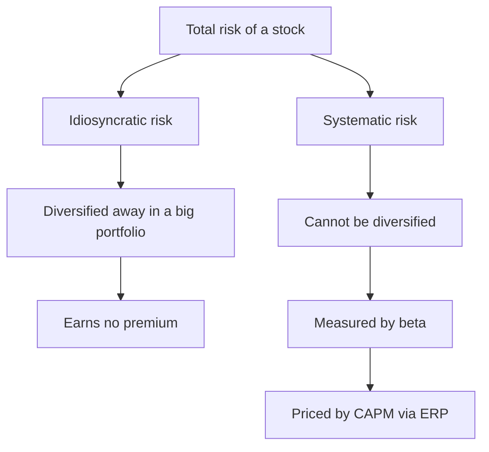
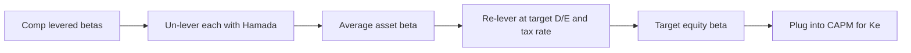
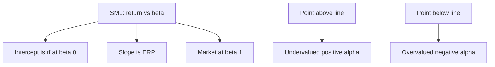

# Cost of Equity & CAPM

## The Problem / Why this matters

Every valuation, every capital-budgeting decision, every "is this deal accretive?" question eventually collides with one deceptively simple number: **what return do equity investors require to hold this company's shares?** That number is the **cost of equity** (often written *Ke* or *rE*). It is the discount rate you apply to equity cash flows, the equity component of WACC, the hurdle a project must clear before it creates value for shareholders, and the anchor of every DCF you will ever build.

Here is why it is hard. Debt has a contractual coupon — you can *read* the cost of debt off the loan agreement or the bond's yield. Equity has **no contract**. Shareholders are promised nothing. There is no coupon, no maturity, no schedule. So the cost of equity is not observed; it must be **inferred** from a model of how investors price risk. Get that model wrong and everything downstream is wrong: your DCF target price, your WACC, your economic-value-added, your football-field valuation range.

In interviews, cost of equity is the single most-tested concept in all of corporate finance because it sits at the intersection of three things an interviewer wants to check simultaneously:

1. **Do you understand risk?** (Not all risk is compensated.)
2. **Can you manipulate the CAPM mechanically?** (Plug numbers, re-lever a beta, walk the SML.)
3. **Do you have judgment?** (Which risk-free rate, which ERP, is a beta of 0.4 for a utility sensible?)

A candidate who can compute a WACC but cannot explain *why* only systematic risk is priced, or who re-levers a beta with the wrong formula, gets found out in ninety seconds. This chapter builds the whole thing from first principles so you can defend every number you quote.

## Core Idea

In plain language: **investors demand a higher expected return for taking more of the *right kind* of risk.** The "right kind" is risk that cannot be diversified away — the risk that moves with the market as a whole. Risk that is specific to one company (a factory fire, a botched product launch, a CEO scandal) can be diluted to nothing by holding many stocks, so the market refuses to pay you a premium for bearing it. You could have avoided it for free by diversifying.

The **Capital Asset Pricing Model (CAPM)** packages this into one line:

> Required return = the return you'd get for taking *no* risk, **plus** a premium that scales with how much *market* risk the asset carries.

The measure of "how much market risk" is **beta (β)**. A beta of 1 means the stock moves one-for-one with the market. A beta of 2 means it amplifies market moves. A beta of 0.5 means it dampens them. The premium per unit of beta is the **equity risk premium (ERP)** — the extra return investors demand for holding the market portfolio instead of a T-bill.

That's the entire idea. Everything else — estimating beta, un-levering and re-levering it, the security market line, the dividend growth model, multifactor models — is either a way to *measure the inputs* or a *refinement* of this single insight.

## Why it works this way — first principles

Let's derive the intuition rather than memorise the formula.

**Step 1 — Diversification is free risk reduction.** Suppose you hold two stocks whose specific risks are unrelated. When one has a bad quarter, the other might have a good one; the shocks partially cancel. Add a third, a tenth, a fiftieth stock, and the idiosyncratic bumps wash out. Mathematically, the variance of an equally-weighted portfolio of *n* stocks is:

$$\sigma_p^2 = \frac{1}{n}\overline{\text{var}} + \frac{n-1}{n}\overline{\text{cov}}$$

As *n* → ∞, the first term (average variance ÷ n) vanishes and only the **average covariance** survives. Translation: **in a big portfolio, a stock's contribution to risk is not its own volatility — it is how it co-moves with everything else.** The standalone volatility is diversified into irrelevance.

**Step 2 — The market won't pay for avoidable risk.** If idiosyncratic risk can be eliminated for free by diversifying, then in equilibrium no investor can demand extra return for bearing it — because any rational, diversified investor already isn't bearing it. Competition among diversified investors bids away any premium for diversifiable risk. **Only non-diversifiable (systematic) risk earns a return.** This is the moral core of CAPM: *you are compensated for risk you cannot escape, not for risk you chose not to escape.*

**Step 3 — Measure systematic risk relative to the one portfolio everyone holds.** If every investor holds a well-diversified portfolio, in aggregate they hold *the market portfolio* (every asset in proportion to its value). So the relevant question for any stock is: *how much does it add to the risk of the market portfolio?* That contribution is its covariance with the market, scaled by the market's own variance:

$$\beta_i = \frac{\text{Cov}(r_i, r_m)}{\text{Var}(r_m)}$$

Beta is literally "the sensitivity of the stock's return to market return" — the slope you'd get from regressing the stock on the market.

**Step 4 — Price risk linearly.** In equilibrium, expected return must be a straight-line function of beta, because if it weren't, you could build a portfolio that dominates (same beta, higher return) and arbitrage the gap. That straight line, running from the risk-free rate (beta 0) through the market (beta 1), is the CAPM:

$$E(r_i) = r_f + \beta_i \big[E(r_m) - r_f\big]$$

Every piece now has a *reason*, not just a place in a formula. The risk-free rate is the reward for waiting (time value). The bracket is the reward per unit of systematic risk (the market's price of risk). Beta is how many units you're carrying.

## Full technical content

### 1. The CAPM equation and its three inputs

$$\boxed{\;K_e = r_f + \beta \times (r_m - r_f)\;}$$

where $(r_m - r_f)$ is the **equity risk premium (ERP)**, sometimes written **MRP** (market risk premium). Let's take each input seriously, because interviews probe the *choice* of each.

#### 1a. The risk-free rate ($r_f$)

The risk-free rate is the return on an asset with **no default risk and no reinvestment risk over the relevant horizon**. In practice:

| Choice | When used | Watch-outs |
|---|---|---|
| 10-year government bond yield | **Default choice for valuation/DCF** | Matches the long duration of equity cash flows |
| 3-month T-bill | Short-horizon, textbook CAPM | Too short for equity; ignores term premium |
| 30-year government bond | Very-long-duration assets (infra) | Illiquidity/term-premium distortions |

**Rules of thumb the interviewer wants to hear:**
- Use the yield on a **government bond whose maturity matches the cash-flow horizon** — for a going-concern DCF, that's the **10-year** (US Treasury, or the local sovereign for local-currency valuations).
- **Currency consistency**: the risk-free rate must be in the **same currency** as the cash flows. INR cash flows → Indian G-Sec yield; USD cash flows → US Treasury.
- For countries with sovereign default risk, the local government bond is **not** truly risk-free. Strip out the **default spread**: $r_f = \text{local govt bond yield} - \text{country default spread}$, or build up from a US Treasury + inflation differential.

#### 1b. Beta (β)

Beta measures **systematic risk** — sensitivity to market moves. Formally $\beta = \rho_{im}\,\sigma_i / \sigma_m = \text{Cov}(r_i, r_m)/\text{Var}(r_m)$.

| Beta value | Interpretation |
|---|---|
| β = 0 | Uncorrelated with the market (behaves like cash) |
| 0 < β < 1 | Defensive — moves less than the market (utilities, staples) |
| β = 1 | Moves with the market |
| β > 1 | Aggressive — amplifies market moves (tech, cyclicals, high-leverage firms) |
| β < 0 | Moves against the market (rare — gold miners, some hedges) |

Beta estimation is covered in depth in Section 2.

#### 1c. The equity risk premium (ERP)

The ERP is the **extra return investors demand for holding equities (the market portfolio) over the risk-free asset.** Three ways to estimate it:

1. **Historical (realised) ERP** — average of $(r_m - r_f)$ over a long history (e.g., 1928–today). Choices that matter: arithmetic vs geometric mean (arithmetic is higher and is the theoretically correct one for a single-period discount rate; geometric better reflects compounded experience), and the horizon. US historical ERP is typically quoted **~4.5%–6.5%**.
2. **Implied (forward-looking) ERP** — solve for the discount rate that sets the present value of expected market cash flows (dividends + buybacks) equal to the current index level. This is Damodaran's preferred method and is **market-consistent** (updates daily). Often **~4.5%–5.5%** for the US.
3. **Survey ERP** — ask CFOs/academics. Noisy; used as a sanity check.

**Emerging-market ERP** = mature-market ERP + **country risk premium (CRP)**. CRP is often the default spread of the country's sovereign bond, scaled up by relative equity volatility ($\sigma_{\text{equity}}/\sigma_{\text{bond}}$).

$$\text{ERP}_{\text{country}} = \text{ERP}_{\text{mature}} + \text{CRP}, \qquad \text{CRP} = \text{default spread} \times \frac{\sigma_{\text{equity}}}{\sigma_{\text{bond}}}$$

### 2. Estimating and interpreting beta

Beta is the input that separates a mechanical candidate from a thoughtful one. There are two routes.

#### 2a. Regression (historical) beta

Run an OLS regression of the stock's returns on the market's returns:

$$r_i - r_f = \alpha + \beta (r_m - r_f) + \varepsilon$$

The **slope** is beta; the **intercept (α)** is "Jensen's alpha" (excess return unexplained by market risk); the **R²** tells you what fraction of the stock's variance is systematic (the rest is diversifiable).

Practical choices, all interview-relevant:
- **Return frequency**: weekly or monthly (daily is noisy and picks up non-synchronous trading; annual gives too few points). Monthly over 5 years (60 obs) is the classic Bloomberg default; 2 years of weekly is common for faster-moving names.
- **Index choice**: a broad value-weighted index (S&P 500, Nifty 500), not a narrow one.
- **Estimation window**: 2–5 years. Longer = more stable but staler; shorter = timelier but noisier.

**Raw beta vs adjusted beta.** Empirically, betas revert toward 1 over time (a high-beta firm today tends to be less extreme tomorrow). Bloomberg reports an **adjusted beta**:

$$\beta_{\text{adj}} = 0.67 \times \beta_{\text{raw}} + 0.33 \times 1.0$$

This shrinks the raw estimate two-thirds of the way from 1... actually **two-thirds weight on raw, one-third pull to 1**. It's a Bayesian nudge that improves out-of-sample forecasts.

#### 2b. Bottom-up (industry) beta — the professional's choice

Regression betas for a single stock are noisy (high standard error) and contaminated by the firm's own leverage and one-off events. The cleaner approach:

1. Take a set of **comparable public companies** in the same business.
2. Get each comp's **levered (equity) beta** (regression beta).
3. **Un-lever** each to strip out its financing choice, giving the **asset (unlevered) beta** — pure business risk.
4. **Average** the unlevered betas (median is more robust) to get an industry asset beta with far lower standard error.
5. **Re-lever** that average at the **target firm's own capital structure**.

This "bottom-up beta" is what banks actually use, especially for **private companies and divisions** (which have no traded stock to regress) and for **firms changing their leverage**.

### 3. Levered vs unlevered beta — the Hamada framework

A firm's **equity beta (levered beta, βL)** reflects **two** sources of risk:
- **Business risk** — the cyclicality of the underlying operations (captured by the **asset/unlevered beta, βU**).
- **Financial risk** — the amplification from debt (fixed interest claims make equity returns more volatile).

More leverage → more volatile equity returns → higher equity beta. Unlevering removes the leverage effect to isolate pure business risk so you can compare firms with different capital structures on an apples-to-apples basis, then re-lever to the target structure.

**Hamada equation (with a tax shield, assuming debt beta = 0):**

$$\boxed{\;\beta_L = \beta_U \left[\,1 + (1 - t)\frac{D}{E}\,\right]\;}$$

Rearranged to un-lever:

$$\beta_U = \frac{\beta_L}{\,1 + (1 - t)\dfrac{D}{E}\,}$$

where $t$ = marginal tax rate, $D/E$ = debt-to-equity (market values). The $(1-t)$ term appears because interest is tax-deductible, so the debt tax shield partially offsets the risk-amplifying effect of leverage.

**Variants you should know:**

| Assumption | Un-lever formula | When used |
|---|---|---|
| Debt beta = 0, tax shield with risk of equity (Hamada) | $\beta_U = \dfrac{\beta_L}{1+(1-t)D/E}$ | Standard, most common in interviews |
| Debt beta ≠ 0 | $\beta_U = \dfrac{\beta_L + \beta_D (1-t)\,D/E}{1+(1-t)D/E}$ | Firms with material default risk / rated debt |
| No tax adjustment (Harris–Pringle, debt rebalanced) | $\beta_U = \dfrac{\beta_L}{1+D/E}$ | Firm keeps constant D/E; tax shield discounted at $r_U$ |

The default in nearly every interview is the **Hamada** version with debt beta = 0. Know it cold and be able to explain *why* the $(1-t)$ is there.

### 4. The Security Market Line (SML)

The **SML** is the CAPM plotted as a line: expected return on the vertical axis, **beta** on the horizontal axis.

- **Intercept** = risk-free rate $r_f$ (at β = 0).
- **Slope** = the ERP $(r_m - r_f)$.
- The market portfolio sits at (β = 1, return = $r_m$).

$$E(r) = r_f + \beta \times \text{ERP}$$

**Interpretation and uses:**
- Any asset that is **fairly priced** plots *on* the SML.
- An asset **above** the SML offers more return than its beta warrants → **undervalued** (positive alpha) → buy.
- An asset **below** the SML → **overvalued** (negative alpha) → sell/avoid.
- The SML shifts and rotates: a change in $r_f$ or expected inflation shifts the whole line **up/down (parallel)**; a change in risk aversion (ERP) **rotates** it (steeper = more risk-averse market).

**SML vs CML (a classic trap):** The **Capital Market Line** plots expected return against **total risk (σ)** and applies only to *efficient* portfolios (combinations of the risk-free asset and the market). The **SML** plots return against **systematic risk (β)** and applies to *every* asset, efficient or not. Don't confuse them.

### 5. Dividend growth model (DGM / Gordon) — the alternative

CAPM is not the only way to back out the cost of equity. If a company pays a stable, growing dividend, you can **invert the Gordon Growth valuation** to solve for the return investors are implicitly demanding.

Gordon: $P_0 = \dfrac{D_1}{K_e - g}$. Solve for $K_e$:

$$\boxed{\;K_e = \frac{D_1}{P_0} + g\;}$$

where $D_1$ = next year's expected dividend (= $D_0(1+g)$), $P_0$ = current price, $g$ = sustainable dividend growth rate.

- The first term $D_1/P_0$ is the **forward dividend yield**; the second is **growth**. Cost of equity = income + growth. Clean intuition.
- **Estimating g**: (i) the **sustainable growth rate** $g = b \times \text{ROE}$, where $b$ = retention ratio = $(1 - \text{payout})$; or (ii) analyst consensus long-term growth; or (iii) historical dividend CAGR.

**DGM vs CAPM — when to use which:**

| | CAPM | Dividend growth model |
|---|---|---|
| Needs | β, $r_f$, ERP | Dividend, price, growth |
| Works for | Any listed firm, even non-payers | Only stable dividend payers |
| Key weakness | Beta estimation noise; ERP debate | Hyper-sensitive to g; breaks if g ≥ Ke or g unstable |
| Best for | Cyclicals, growth, private (bottom-up) | Mature utilities, REITs, banks, consumer staples |

Good practice: compute **both** and triangulate. If CAPM says 9% and DGM says 9.5%, you're confident. If they diverge wildly, interrogate your inputs.

**Bond-yield-plus-risk-premium** is a third quick method: $K_e \approx$ company's own long-term bond yield + a judgmental equity premium of ~3–5%. Rough, but a useful sanity check and sometimes asked.

### 6. Multifactor extensions

CAPM's single factor (the market) explains only part of the cross-section of returns. Empirically, some patterns persist that beta alone can't explain. Multifactor models add factors.

**Fama–French three-factor model:**

$$E(r_i) - r_f = \beta_{\text{mkt}}\,\text{MRP} + \beta_{\text{SMB}}\,\text{SMB} + \beta_{\text{HML}}\,\text{HML}$$

- **SMB (Small Minus Big)** — small-cap stocks have historically outperformed large-caps → a **size** premium.
- **HML (High Minus Low)** — high book-to-market (value) stocks have outperformed low (growth) → a **value** premium.

**Fama–French five-factor** adds **RMW** (profitability: robust minus weak) and **CMA** (investment: conservative minus aggressive). **Carhart four-factor** adds **momentum (WML/UMD)** to the three-factor model.

**Arbitrage Pricing Theory (APT)** is the general framework: expected return is a linear function of *several* macro risk factors (e.g., inflation surprises, industrial production, term spread, credit spread), each with its own beta and risk premium:

$$E(r_i) = r_f + \sum_{k} \beta_{ik}\,\lambda_k$$

APT doesn't tell you *which* factors — that's empirical. It just says returns are driven by a handful of priced systematic factors and that arbitrage forces the pricing to be linear.

**Why practitioners still default to CAPM:** it needs only one beta, its inputs are estimable, and for corporate valuation the extra factors add complexity without reliably improving the discount rate. Multifactor models dominate in **portfolio management, performance attribution, and academic asset pricing**; single-factor CAPM dominates in **corporate finance / valuation**. Know the distinction — interviewers test whether you can say *when* each is used.

## Worked examples

### Worked Example 1 — Straight CAPM cost of equity

**Setup.** A US-listed industrial firm. Risk-free rate (10-yr Treasury) = **4.2%**. Equity risk premium = **5.0%**. The firm's equity beta = **1.25**. Compute the cost of equity.

**Solution.**
$$K_e = r_f + \beta \times \text{ERP} = 4.2\% + 1.25 \times 5.0\%$$
$$= 4.2\% + 6.25\% = \mathbf{10.45\%}$$

**Interpretation.** Investors require 10.45% to hold this stock. The 6.25% is the risk premium: 1.25 units of market risk × 5% per unit. **Sanity check:** beta > 1, so Ke > the market return $r_m = 4.2\% + 5.0\% = 9.2\%$. ✓ (10.45% > 9.2%, as it must be for an above-market-risk stock.)

### Worked Example 2 — Bottom-up beta: un-lever, average, re-lever

**Setup.** You are valuing **PrivateCo**, an unlisted specialty-chemicals maker, so you build a bottom-up beta from three listed comps. Target tax rate = **25%**. PrivateCo's target capital structure is **D/E = 0.40**.

| Comp | Levered β | D/E | Tax rate |
|---|---|---|---|
| A | 1.30 | 0.60 | 25% |
| B | 1.10 | 0.30 | 25% |
| C | 1.45 | 0.80 | 25% |

Risk-free = **4.0%**, ERP = **5.5%**.

**Step 1 — Un-lever each comp** using $\beta_U = \dfrac{\beta_L}{1+(1-t)D/E}$, with $(1-t) = 0.75$.

- Comp A: denominator $= 1 + 0.75 \times 0.60 = 1.45$; $\beta_U = 1.30 / 1.45 = 0.8966$
- Comp B: denominator $= 1 + 0.75 \times 0.30 = 1.225$; $\beta_U = 1.10 / 1.225 = 0.8980$
- Comp C: denominator $= 1 + 0.75 \times 0.80 = 1.60$; $\beta_U = 1.45 / 1.60 = 0.9063$

**Step 2 — Average asset beta** $= (0.8966 + 0.8980 + 0.9063)/3 = 2.7009/3 = \mathbf{0.9003}$.

Notice how tight the unlevered betas are (0.897–0.906) even though the levered betas ranged 1.10–1.45 — un-levering stripped out the financing noise. That's the whole point.

**Step 3 — Re-lever at PrivateCo's D/E = 0.40:**
$$\beta_L = \beta_U\left[1 + (1-t)\frac{D}{E}\right] = 0.9003 \times \left[1 + 0.75 \times 0.40\right]$$
$$= 0.9003 \times 1.30 = \mathbf{1.170}$$

**Step 4 — Cost of equity via CAPM:**
$$K_e = 4.0\% + 1.170 \times 5.5\% = 4.0\% + 6.44\% = \mathbf{10.44\%}$$

**Interpretation.** PrivateCo's business risk (asset beta 0.90) plus its chosen leverage (D/E 0.40) gives an equity beta of 1.17 and a 10.44% cost of equity. Change the target leverage and only Step 3 onward changes — the business risk (0.90) is invariant.

### Worked Example 3 — CAPM vs Dividend Growth Model triangulation

**Setup.** A mature regulated utility. Current price $P_0 = \$50$. Just-paid dividend $D_0 = \$2.40$. ROE = **10%**, dividend payout = **60%** (so retention $b = 40\%$). For CAPM: β = **0.55**, $r_f = 4.2\%$, ERP = **5.0%**.

**Method A — Dividend growth model.**
Sustainable growth $g = b \times \text{ROE} = 0.40 \times 10\% = 4.0\%$.
Next dividend $D_1 = D_0(1+g) = 2.40 \times 1.04 = \$2.496$.
$$K_e = \frac{D_1}{P_0} + g = \frac{2.496}{50} + 0.04 = 0.04992 + 0.04 = 0.08992 \approx \mathbf{8.99\%}$$

**Method B — CAPM.**
$$K_e = 4.2\% + 0.55 \times 5.0\% = 4.2\% + 2.75\% = \mathbf{6.95\%}$$

**Triangulation.** DGM says ~9.0%, CAPM says ~6.95% — a **2-point gap**. Which is right? This is exactly the judgment an interviewer wants. The gap tells us an input is stressed:
- The utility's **beta of 0.55** is very defensive, dragging CAPM low.
- The DGM is sensitive to **g**: if the sustainable growth of 4% is optimistic (regulated returns cap ROE), the true DGM Ke is lower.

A defensible answer: take a **blend / range of ~7.5%–8%**, note the sensitivity, and flag that for a rate-regulated utility the DGM is often the more trusted anchor because the dividend is stable and predictable — while acknowledging the CAPM as a floor. **Self-check on DGM:** g (4%) < Ke (9%), so the Gordon model is valid (denominator positive). ✓

### Worked Example 4 — Walking the Security Market Line (alpha)

**Setup.** $r_f = 4\%$, ERP = **6%**. A stock has β = **1.2** and analysts expect it to return **13%** next year. Is it cheap or dear?

**Solution.** The SML (required) return for β = 1.2:
$$E(r)_{\text{required}} = 4\% + 1.2 \times 6\% = 4\% + 7.2\% = 11.2\%$$
Expected return (13%) **> required (11.2%)**, so the stock plots **above** the SML.

**Alpha** $= 13\% - 11.2\% = +1.8\%$. Positive alpha ⇒ **undervalued ⇒ buy.** In one line: *"For the risk it carries, the market only demands 11.2%, but you expect 13% — you're being paid 1.8% more than the risk warrants, so it's a buy until the price rises and the expected return falls back to the line."*

## How it is tested in interviews

Below are the exact questions, the crisp model answer, and the line to say.

**Q1. "Walk me through the CAPM."**
> "Cost of equity equals the risk-free rate plus beta times the equity risk premium. The risk-free rate is the reward for time; beta measures the stock's sensitivity to overall market moves — its systematic risk; and the ERP is the extra return investors demand for holding equities over risk-free bonds. So you're being paid for time plus for the amount of *undiversifiable* market risk you carry."

**Q2. "Why only systematic risk? Why isn't total volatility priced?"**
> "Because idiosyncratic risk can be diversified away for free. A rational investor holding a broad portfolio has already eliminated firm-specific risk, so in equilibrium the market won't pay a premium for risk you didn't have to bear. Only the risk that survives diversification — co-movement with the market — earns a return. That's what beta captures."

**Q3. "What risk-free rate do you use and why?"**
> "The 10-year government bond yield, in the same currency as the cash flows. It matches the long duration of equity cash flows, and it's the most liquid long-dated risk-free instrument. Short T-bills are too short-dated for a going-concern DCF." (Bonus: for emerging markets, strip the sovereign default spread out of the local bond yield.)

**Q4. "A private company has no stock price — how do you get its beta?"**
> "Bottom-up beta. Take listed comps in the same business, un-lever each comp's equity beta with Hamada to strip out financing, average the asset betas — which cuts the estimation noise — then re-lever at the private company's target capital structure and tax rate. Plug that into CAPM."

**Q5. "Un-lever this beta." (They give you βL, D/E, t.)**
> Say the formula out loud, then compute: "$\beta_U = \beta_L / [1 + (1-t)D/E]$." Don't forget the $(1-t)$. Interviewers love watching whether you drop the tax term.

**Q6. "Why does leverage raise the equity beta?"**
> "Debt has a fixed claim. When operating cash flows swing, equity holders absorb the full swing after the fixed interest is paid, so their returns become more volatile — and more correlated with the market cycle. Financial leverage amplifies business risk into equity risk. The $(1-t)$ term softens it because the interest tax shield offsets part of that amplification."

**Q7. "CAPM vs dividend growth model — when do you use each?"**
> "CAPM works for any listed firm and for cyclicals and non-dividend-payers; DGM only works for stable dividend payers like utilities and REITs and is very sensitive to the growth assumption. In practice I compute both and triangulate — agreement gives confidence, divergence tells me which input to interrogate."

**Q8. "A stock plots above the SML — what does that mean and what do you do?"**
> "It's offering more return than its beta justifies — positive alpha, undervalued. You buy it. As investors buy, the price rises, expected return falls, and it moves back down onto the line. In equilibrium everything sits on the SML."

**Q9. "What are the limitations of CAPM?"**
> "Beta is estimated with error and is unstable; the ERP is debated and unobservable; it's a single-period, single-factor model; the true market portfolio is unobservable (Roll's critique); and empirically it under-explains value and size effects, which is why Fama-French added factors. But for corporate valuation it's still the workhorse because it's parsimonious and its inputs are estimable."

**Q10. "Your DCF is too sensitive to the discount rate — what drives Ke most?"**
> "Beta and the ERP, and for long-duration/high-growth firms even small Ke changes swing the value a lot because more of the value is in the terminal value / distant cash flows. That's why I sanity-check Ke with a bottom-up beta and cross-check against DGM."

## Traps & common mistakes

- **Dropping the $(1-t)$ in Hamada.** Un-levering with $\beta_L/(1+D/E)$ instead of $\beta_L/(1+(1-t)D/E)$ is the single most common mechanical error. Know *which* variant (Hamada vs Harris–Pringle) you're using and why.
- **Currency mismatch.** Discounting INR cash flows with a USD risk-free rate (or a US ERP) inflates/deflates value spuriously. Match currency across $r_f$, ERP, and cash flows.
- **Using the wrong risk-free maturity.** T-bill for a long-horizon DCF understates $r_f$. Use the 10-year.
- **Mixing book and market values for D/E.** Hamada and WACC weights need **market-value** debt and equity, not book.
- **Arithmetic vs geometric ERP confusion.** For a single-period discount rate the **arithmetic** mean is theoretically correct; quoting a geometric ERP without flagging it understates Ke.
- **Confusing SML and CML.** SML: return vs **beta**, all assets. CML: return vs **total σ**, efficient portfolios only.
- **Treating a raw regression beta as gospel.** Single-stock regression betas have large standard errors and event contamination. Prefer adjusted or bottom-up betas.
- **DGM with g ≥ Ke.** The Gordon model breaks (negative or absurd denominator). If your sustainable g exceeds Ke, your growth assumption is wrong — no company grows faster than its cost of equity forever.
- **Forgetting country risk in emerging markets.** A CAPM Ke built on a US ERP for an Indian or Brazilian company understates the risk premium; add a country risk premium.
- **Re-levering at the wrong (current vs target) structure.** Re-lever the asset beta at the **target/normalised** capital structure you're assuming for the forecast, not necessarily today's snapshot.
- **Negative-alpha ≠ bad company.** A stock below the SML is *overvalued at its current price*, not a bad business. Alpha is about price vs risk, not quality.

## First-principles recap

- **You are paid for risk you cannot avoid, not risk you chose not to avoid.** Diversifiable (idiosyncratic) risk earns nothing; systematic risk earns the premium.
- **Beta is co-movement, not volatility.** A stock's relevant risk is how it moves with the market portfolio, because that's all that survives diversification.
- **Cost of equity = time value + quantity of systematic risk × price of that risk**, i.e., $r_f + \beta \times \text{ERP}$. Every term has a reason.
- **Equity beta = business risk × financial-leverage amplifier.** Un-lever to isolate business risk, re-lever to apply a chosen capital structure (Hamada).
- **The SML turns the model into a decision rule:** on the line = fairly priced; above = buy; below = sell.
- **DGM is the same question from the market's mouth:** dividend yield + growth is the return investors are implicitly demanding — a cross-check on CAPM.
- **CAPM is one factor; the world has more.** Fama-French/APT add size, value, and macro factors — dominant in portfolio work, while single-factor CAPM stays the corporate-valuation default.

## Quick-reference

| Concept | Formula / Rule |
|---|---|
| CAPM cost of equity | $K_e = r_f + \beta(r_m - r_f)$ |
| Beta (definition) | $\beta = \text{Cov}(r_i,r_m)/\text{Var}(r_m) = \rho_{im}\sigma_i/\sigma_m$ |
| Adjusted beta (Bloomberg) | $\beta_{adj} = 0.67\,\beta_{raw} + 0.33$ |
| Un-lever (Hamada, βD=0) | $\beta_U = \beta_L / [1 + (1-t)D/E]$ |
| Re-lever (Hamada, βD=0) | $\beta_L = \beta_U[1 + (1-t)D/E]$ |
| Un-lever (debt beta ≠ 0) | $\beta_U = [\beta_L + \beta_D(1-t)D/E] / [1+(1-t)D/E]$ |
| Un-lever (no-tax / Harris–Pringle) | $\beta_U = \beta_L / (1 + D/E)$ |
| SML | $E(r) = r_f + \beta \times \text{ERP}$ |
| Alpha | $\alpha = \text{expected return} - \text{SML required return}$ |
| Dividend growth model | $K_e = D_1/P_0 + g$ |
| Sustainable growth | $g = b \times \text{ROE}$, with $b = 1 - \text{payout}$ |
| Bond-yield-plus | $K_e \approx$ firm's LT bond yield + 3–5% |
| Country ERP | $\text{ERP}_{mature} + \text{default spread}\times(\sigma_{eq}/\sigma_{bond})$ |
| Fama–French 3F | $E(r)-r_f = \beta_m\text{MRP} + \beta_s\text{SMB} + \beta_h\text{HML}$ |
| Typical US ERP | ~4.5%–6.0% |
| Risk-free default | 10-yr government bond, matched currency |
