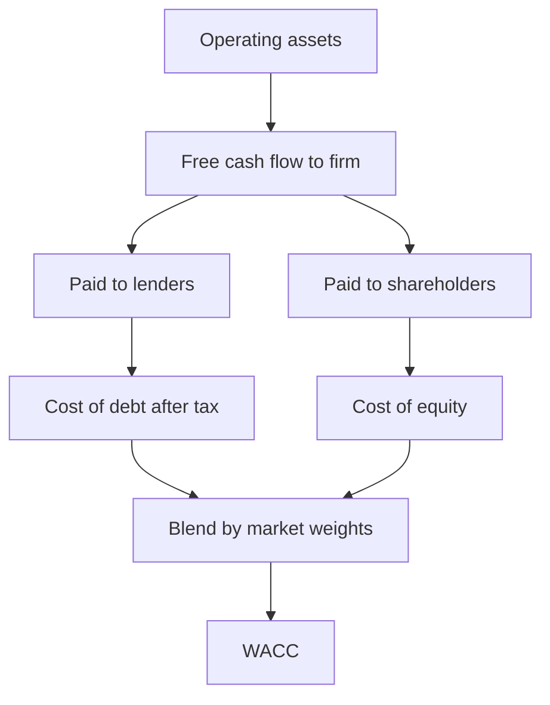
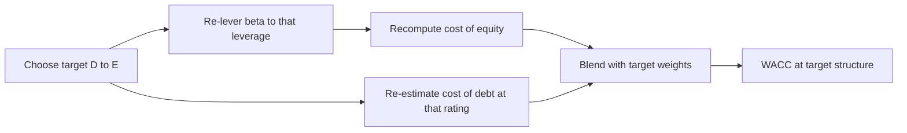
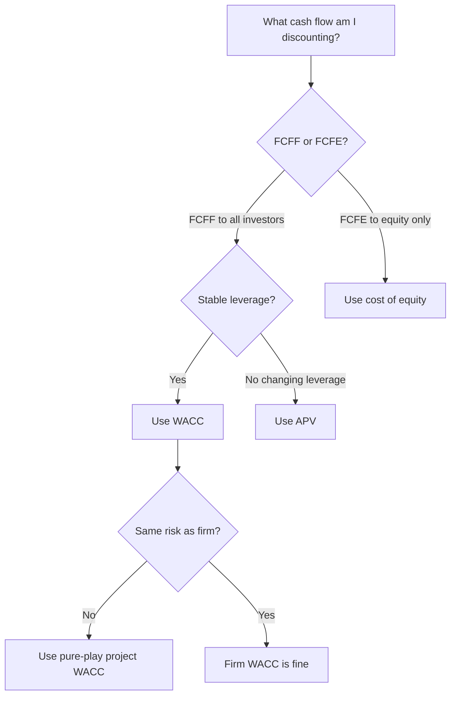
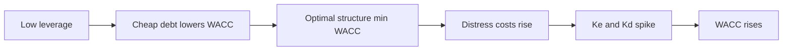

# Cost of Debt & WACC

## The Problem / Why this matters

A company is a machine that consumes capital and produces cash flows. Two kinds of investors feed the machine: **lenders** (who buy the debt) and **shareholders** (who buy the equity). Each group demands a return. The **weighted average cost of capital (WACC)** is the single blended rate that answers one enormously consequential question:

> *What return must the firm's assets earn, in total, to keep everyone who financed those assets happy?*

Get WACC right and your DCF prices the business correctly, your capital-budgeting decisions accept the value-creating projects and reject the value-destroying ones, and your leveraged-buyout model produces a defensible entry multiple. Get it wrong — by a single percentage point — and a 15-year DCF can move 20-30% in value. WACC is the denominator of corporate finance, and small errors in denominators are lethal.

The previous chapter built the **cost of equity** from CAPM. That was the hard half, because equity has no contract and its cost must be *inferred*. This chapter completes the picture with the **cost of debt** — which, refreshingly, is far more observable because debt *does* have a contract — and then blends the two into WACC. But "observable" is not "trivial." The cost of debt hides three subtleties that interviewers love: it is a **forward-looking yield**, not the coupon you happen to be paying; it is **tax-advantaged** because interest is deductible; and it must be married to **the right weights** (target, not accidental).

In interviews, WACC is tested more than almost any other single number, for three reasons:

1. **It is mechanical enough to check quickly.** An interviewer can ask you to build a WACC from six inputs in ninety seconds and instantly see whether you know the formula and the tax shield.
2. **It is conceptual enough to expose fakes.** "Why do we tax-affect debt but not equity?" "Why does WACC fall and then rise as you add leverage?" separate people who memorised the formula from people who understand it.
3. **It has judgment landmines.** Book vs market weights, current vs target capital structure, when WACC is *not* the right discount rate — these are the traps that reveal whether you've actually built models or just read a textbook.

This chapter builds every piece from first principles so you can defend each number and answer the follow-up behind the follow-up.

## Core Idea

In plain language: **the cost of capital is a weighted average of what each provider of money demands, weighted by how much money each one provided.**

If a firm is financed 40% by debt at 6% and 60% by equity at 12%, then on average its financing costs `0.40 × 6% + 0.60 × 12% = 9.6%`. That is the intuition of WACC in one line. Every project the firm undertakes has to clear roughly this bar, because the cash it throws off has to service the 6% lenders *and* satisfy the 12% shareholders in the proportions they funded the business.

Two refinements turn that plain average into the real WACC:

- **The tax shield.** Interest is tax-deductible; dividends are not. So each rupee of interest paid saves the firm `tax rate × interest` in taxes. The government effectively subsidises debt. We capture this by using the **after-tax** cost of debt, `Kd × (1 − t)`, in the blend. Equity gets no such discount — its cost enters at full strength.

- **Market-value weights.** The weights are not book values from the balance sheet; they are the **market values** of debt and equity — what investors would pay *today* to own each claim. WACC is a forward-looking, opportunity-cost concept, so it must use the values that reflect today's opportunity costs.

Putting it together, the canonical formula is:

$$\text{WACC} = \frac{E}{V}\,K_e \;+\; \frac{D}{V}\,K_d(1 - t)$$

where `E` = market value of equity, `D` = market value of debt, `V = D + E`, `Ke` = cost of equity, `Kd` = pre-tax cost of debt, and `t` = marginal tax rate.

Everything else in this chapter — how to find `Kd` from a bond's yield, why you use target weights, when WACC is the wrong rate, how leverage bends the curve — either *estimates an input* or *guards against a misuse* of this one equation.

## Why it works this way — first principles

Let's derive WACC rather than accept it, because the derivation is exactly what interviewers probe.

**Step 1 — The firm's assets are owned jointly by all capital providers.** Think of the balance sheet in market-value terms. The left side is the enterprise: the operating assets that generate cash. The right side is the *claims* on those assets: debt and equity. By identity, the market value of the assets equals the market value of the claims:

$$V_{\text{assets}} = D + E$$

The cash the assets produce (before any financing) is divided between lenders and shareholders. So the **return on the assets** must be the value-weighted average of the returns *to* the two claimant groups. That is not a formula to memorise — it is an accounting identity about how one pie is sliced.

**Step 2 — Each claimant's required return is their cost to the firm.** A lender's required return *is* the firm's cost of debt. A shareholder's required return *is* the firm's cost of equity. "Cost of capital" and "investor's required return" are two names for the same number viewed from opposite sides of the transaction. The firm pays exactly what investors demand, no more (competition) and no less (or capital flees).

**Step 3 — Weight by market value, because that's how the pie is actually split.** If debt is 30% of total market value and equity 70%, then 30% of the asset cash flows are "owed" to the debt-return and 70% to the equity-return. Book values are historical accidents — the price paid years ago, depreciated by accounting conventions. They do not tell you how the *current* cash flows are divided among *current* claimholders. Market values do. This is why WACC uses market weights: it is describing how *today's* value is apportioned.

**Step 4 — Tax-affect the debt because the government pays part of the interest bill.** Here is the subtle one. Suppose the firm pays ₹100 of interest and faces a 25% tax rate. That ₹100 is deducted before computing taxable income, so it *reduces the tax bill by ₹25*. The firm's true, out-of-pocket cost of that ₹100 interest is only ₹75. The lender still receives their full return (`Kd`), but the *firm's* cost is `Kd × (1 − t)`. Dividends, by contrast, are paid out of after-tax profit — no deduction, no shield — so equity's cost is not reduced. This asymmetry is the entire reason debt looks "cheap" and the reason capital structure matters at all.

Why not tax-affect equity? Because there is nothing to affect. The tax shield exists *because interest is subtracted on the income statement before tax*. Dividends and retained earnings sit *below* the tax line. There is no deduction to shield, so `Ke` enters WACC at full, un-discounted strength.

**Step 5 — WACC is an opportunity cost, hence forward-looking.** WACC is not "the average interest we historically paid." It is "the return investors could get *today* on an equally risky alternative" — the rate they'd demand *now* to fund this business *now*. That is why every input is current and market-based: today's yield to maturity (not the old coupon), today's cost of equity (today's risk-free rate, today's beta), today's market weights. WACC discounts *future* cash flows, so it must reflect *current, forward-looking* opportunity costs.

## Full technical content

### Part 1 — The cost of debt

The cost of debt, `Kd`, is **the return lenders currently require to hold the firm's debt** — equivalently, the rate at which the firm could borrow *today*. Three principles govern it.

#### 1.1 It is a yield, not a coupon

A bond's **coupon** is fixed at issuance; it tells you the cash interest paid, not the current cost of borrowing. If a firm issued a 4% bond three years ago and rates have since risen so the bond now trades at a discount to yield 7%, then the firm's cost of debt *today* is **7%, not 4%.** The 7% is the **yield to maturity (YTM)** — the single discount rate that sets the present value of the bond's remaining cash flows equal to its current market price:

$$P = \sum_{t=1}^{N} \frac{C}{(1 + \text{YTM})^t} + \frac{F}{(1 + \text{YTM})^N}$$

where `P` = current price, `C` = coupon payment, `F` = face (par) value, `N` = periods to maturity. YTM is the internal rate of return of holding the bond to maturity, and it is the correct, market-based cost of debt because it reflects what a *new* lender demands *now*.

**Why YTM and not the coupon?** WACC is forward-looking. If you want to know the cost of the next rupee of debt, you must ask what the market charges today — and that is the yield, embedded in the current price.

#### 1.2 It decomposes into a risk-free rate plus a credit spread

The yield on a corporate bond is the risk-free yield of matching maturity **plus a credit spread** compensating lenders for default risk (and, secondarily, illiquidity):

$$K_d = r_f + \text{credit spread}$$

The **credit spread** widens with default probability and loss-given-default. It is priced off the firm's **credit rating** (or, for private firms, a *synthetic* rating inferred from coverage ratios). A rough investment-grade ladder:

| Rating | Illustrative spread over Treasuries |
|---|---|
| AAA | 0.40% – 0.60% |
| AA | 0.55% – 0.80% |
| A | 0.85% – 1.25% |
| BBB | 1.30% – 2.00% |
| BB (high yield) | 2.50% – 4.50% |
| B | 4.50% – 7.00% |
| CCC | 8.00%+ |

(Spreads move with the credit cycle — they blow out in recessions and compress in booms. Treat the table as indicative, not gospel.)

**How to estimate `Kd` in practice**, in order of preference:

1. **Traded bonds** — if the firm has liquid public bonds, read the YTM directly off the most recent, longest-dated liquid issue.
2. **Recent borrowing** — the interest rate on debt the firm raised in the last year or two.
3. **Synthetic rating** — estimate the firm's interest coverage ratio (`EBIT / interest`), map it to an implied rating using a table (Damodaran publishes one), read off the default spread, and add the risk-free rate.
4. **Average interest rate** *(weakest)* — `interest expense / total debt`. This is a **book** rate, backward-looking and contaminated by old fixed-rate debt. Use only as a last-resort sanity check, never as the primary estimate.

**Do not use the coupon rate, and do not use the average interest rate as your primary estimate.** Both are backward-looking; WACC needs a forward-looking cost.

#### 1.3 The tax shield: use the after-tax cost of debt

Because interest is tax-deductible, the firm's true cost of debt is reduced by the marginal tax rate:

$$K_d^{\text{after-tax}} = K_d \,(1 - t)$$

If a firm borrows at 8% and faces a 25% tax rate, its after-tax cost of debt is `8% × (1 − 0.25) = 6.0%`. The lender still earns 8%; the government refunds 2% via lower taxes; the firm nets 6%.

Two cautions:

- Use the **marginal** tax rate (the rate on the next rupee of income), not the effective rate (a blended historical average distorted by one-offs). For WACC we care about the tax saved on incremental interest.
- The shield is only worth the full `t` if the firm is **profitable enough to use the deduction**. A firm with no taxable income (losses, or interest already exceeding EBIT) cannot shield anything this year, and its effective after-tax cost of debt approaches the pre-tax rate. Interest-deductibility caps (e.g., limits on interest as a % of EBITDA, like Section 94B in India or §163(j) in the US) can also blunt the shield for highly levered firms.

#### 1.4 Cost of preferred stock (the third slice)

Some firms have **preferred equity** — a hybrid paying a fixed dividend, senior to common but junior to debt, with *no* tax deduction (it's a dividend). Its cost is simply the dividend yield:

$$K_p = \frac{D_p}{P_p}$$

where `Dp` = annual preferred dividend, `Pp` = current market price of the preferred. When present, it enters WACC as its own weighted term at full (un-tax-shielded) strength.

### Part 2 — The weights

#### 2.1 Market value, not book value

The weights `E/V` and `D/V` use **market values**:

- **Market value of equity** = share price × diluted shares outstanding (the **market capitalisation**). Never use book equity — it can be a wildly stale or even negative number that says nothing about what shareholders' claim is worth today.
- **Market value of debt** = the traded price of the firm's bonds/loans. In practice, book value of debt is often used as a proxy because (a) most corporate debt is not liquidly traded, and (b) debt trades near par unless the firm is distressed or rates have moved sharply. This proxy is acceptable for healthy firms; for distressed firms, where debt trades far below par, you must use market values or you will badly overstate the debt weight.

**Why market, not book?** WACC describes how *today's* enterprise value is split among *today's* claimholders and what they demand *today*. Book values are historical costs. A firm whose stock has 10×'d since IPO has a book equity that bears no relation to its ₹-billions of market cap; using book weights would massively understate the equity weight and produce a nonsensical WACC.

#### 2.2 Target vs current weights

This is a favourite interview distinction. Two philosophies:

- **Current (actual) weights** — the firm's *present* market-value mix of debt and equity. Appropriate when the current structure is stable and expected to persist.

- **Target (optimal) weights** — the capital structure the firm is *managing toward* — its long-run policy mix. Appropriate when (a) the current mix is temporarily off-target (e.g., mid-way through a deleveraging, or just after a big debt-funded acquisition), or (b) you're valuing over a long horizon during which the firm will drift to its target.

**The professional default for a long-horizon DCF is target weights**, because you are discounting cash flows for 10+ years and the firm's structure at year 8 will reflect its *policy*, not today's accident. Using a temporarily-distorted current weight (say, 70% debt right after an LBO that the sponsor intends to pay down to 30%) would give a WACC that is wrong for most of the forecast.

The catch: **WACC and the weights are jointly determined.** As leverage changes, `Ke` changes (equity gets riskier), `Kd` may change (credit deteriorates), and the weights change. You cannot pick weights independently of the costs. This circularity is why re-levering beta (from the previous chapter) matters — you must re-estimate `Ke` at the *target* leverage before blending.

### Part 3 — Assembling WACC

The general formula, including preferred stock:

$$\text{WACC} = \frac{E}{V}K_e + \frac{D}{V}K_d(1-t) + \frac{P}{V}K_p$$

with `V = E + D + P`. Most exam and interview problems drop the preferred term:

$$\text{WACC} = \frac{E}{V}K_e + \frac{D}{V}K_d(1-t)$$

**A disciplined build has six inputs.** The table shows where each comes from:

| Input | Symbol | Where it comes from |
|---|---|---|
| Cost of equity | `Ke` | CAPM: `rf + β(ERP)` — re-levered to target leverage |
| Pre-tax cost of debt | `Kd` | YTM on bonds / recent borrowing / synthetic rating |
| Tax rate | `t` | Marginal statutory rate |
| Market value of equity | `E` | Share price × diluted shares |
| Market value of debt | `D` | Traded price, or book value as proxy |
| Weights | `E/V`, `D/V` | From `D` and `E` — target if long-horizon |

**Checklist for internal consistency** (interviewers test this):

- Currency and inflation of the discount rate must match the cash flows (nominal ₹ cash flows → nominal ₹ WACC).
- The risk-free rate in `Ke` should match the horizon of the cash flows (long-dated government bond for a going-concern DCF).
- The beta must be re-levered to the *same* capital structure used for the weights.
- The tax rate in `Kd(1−t)` should be the same `t` used to tax-affect the operating cash flows.

### Part 4 — When WACC is (and is not) the right discount rate

WACC is the correct discount rate **only when three conditions hold**:

1. **You are discounting free cash flow to the firm (FCFF)** — unlevered cash flow available to *all* capital providers. WACC already blends debt and equity returns, so it belongs with the cash flow that belongs to debt *and* equity. (If you discount **free cash flow to equity (FCFE)** — cash after debt service — you must use the **cost of equity**, not WACC, because FCFE belongs to shareholders alone.)

2. **The project/firm has the same business risk as the firm whose WACC you computed.** WACC embeds a specific asset beta. Applying one firm's WACC to a project of different risk mis-prices it.

3. **The project/firm maintains roughly constant leverage** over the forecast. WACC assumes a stable `D/V`. If leverage changes materially year to year (classic in LBOs, where debt is paid down aggressively), a constant WACC is wrong.

**Where WACC breaks — and what to use instead:**

| Situation | Why WACC fails | Better tool |
|---|---|---|
| Project riskier/safer than firm average | Firm WACC embeds the wrong beta | Project-specific WACC using a comparable-company (pure-play) beta |
| Discounting FCFE (post-debt cash flow) | WACC double-counts the debt benefit | Cost of equity `Ke` |
| Changing capital structure (LBO, deleveraging) | Constant `D/V` assumption violated | **APV** — adjusted present value: value unlevered, then add PV of tax shields separately |
| Distressed firm | Weights and costs unstable; debt trades far below par | APV, or explicit scenario/probability-weighted DCF |
| Divisions with different risks in a conglomerate | One firm-wide WACC over- and under-hurdles divisions | Divisional WACCs from pure-play comps |

The **single most common real-world error** is using a firm-wide WACC to evaluate a project whose risk differs from the firm's core business — e.g., a stable utility using its low WACC to justify a speculative tech venture. The venture *looks* value-creating only because it's being discounted at the utility's artificially low rate. The right rate is the WACC of a *pure-play* comparable in the tech business.

### Part 5 — How leverage affects WACC

This is the conceptual crown jewel of the chapter, and the question that most reliably separates candidates.

#### 5.1 The naive intuition (and why it's incomplete)

"Debt is cheaper than equity (lenders bear less risk and get the tax shield), so adding debt lowers WACC." True — *up to a point*. But this ignores that **adding debt makes the remaining equity riskier**, pushing `Ke` up. The net effect is the whole story.

#### 5.2 Modigliani–Miller, without taxes

In a frictionless world (no taxes, no bankruptcy costs), MM Proposition I says **capital structure is irrelevant** — the value of the firm, and therefore its WACC, is independent of leverage. Why? Because the cheapness of debt is *exactly* offset by the rising cost of equity. MM Proposition II makes this precise:

$$K_e = K_a + (K_a - K_d)\frac{D}{E}$$

where `Ka` is the cost of the *unlevered* firm (the pure asset return). As `D/E` rises, `Ke` rises **linearly**, and it rises by just enough to keep WACC pinned at `Ka`. The pie doesn't change; you're only re-slicing it. WACC is a flat line.

#### 5.3 Add taxes: WACC falls (up to a point)

Introduce the corporate tax shield and the symmetry breaks. Now each rupee of debt carries a *subsidised* after-tax cost `Kd(1−t)`, while `Ke` still rises with leverage — but the tax subsidy means WACC **declines** as leverage increases:

$$\text{WACC} = K_a\left(1 - t\,\frac{D}{V}\right)$$

More debt → lower WACC → higher firm value, purely from the tax shield. Taken to its logical extreme, this says "borrow 100%." That's obviously wrong, which brings in the third force.

#### 5.4 Add distress costs: the U-shaped WACC (trade-off theory)

Beyond some leverage, the probability of **financial distress** rises: suppliers tighten terms, customers flee, talent leaves, fire-sales loom, and `Kd` itself spikes as the credit rating collapses. These **expected bankruptcy/distress costs** eventually swamp the incremental tax shield. The result is the classic **trade-off theory** picture:

- WACC first **falls** as cheap, tax-shielded debt replaces expensive equity.
- WACC reaches a **minimum** at the *optimal capital structure*.
- WACC then **rises** as distress costs and a ballooning `Ke` (and `Kd`) overwhelm the shield.

The minimum-WACC point is, by definition, the **value-maximising capital structure** — because minimising the discount rate on a fixed stream of cash flows maximises the present value.

**The crisp interview summary:** *"Adding debt has two opposing effects. The direct effect lowers WACC because debt is cheaper and tax-deductible. The indirect effect raises WACC because more leverage makes equity riskier, pushing up the cost of equity — and, past a point, raises the cost of debt too as distress risk climbs. Net of taxes, WACC falls at first, bottoms at the optimal structure, then rises. So WACC is U-shaped in leverage."*

## Worked examples

### Worked Example 1 — Cost of debt from a bond's YTM, then after-tax

**Setup.** A firm has a bond outstanding: face value ₹1,000, annual coupon 6% (₹60/year), 5 years to maturity, currently trading at ₹920. The marginal tax rate is 25%. Find the pre-tax and after-tax cost of debt.

**Step 1 — Set up the YTM equation.** We need the rate `y` such that:

$$920 = \sum_{t=1}^{5}\frac{60}{(1+y)^t} + \frac{1000}{(1+y)^5}$$

**Step 2 — Solve by iteration.** The bond trades *below* par (₹920 < ₹1,000), so its yield must exceed its 6% coupon. Try `y = 8%`:

- PV of coupons = 60 × annuity factor(8%, 5). Annuity factor = `(1 − 1.08⁻⁵)/0.08 = (1 − 0.68058)/0.08 = 0.31942/0.08 = 3.9927`. → `60 × 3.9927 = 239.6`.
- PV of face = `1000 × 0.68058 = 680.6`.
- Total = `239.6 + 680.6 = 920.2`. ✓

That lands almost exactly on ₹920, so **YTM ≈ 8.0%**. The pre-tax cost of debt is **`Kd = 8.0%`** — note it is *not* the 6% coupon.

**Step 3 — Apply the tax shield.**

$$K_d^{\text{after-tax}} = 8.0\% \times (1 - 0.25) = 6.0\%$$

**Answer.** Pre-tax cost of debt = **8.0%**; after-tax cost of debt = **6.0%**. The key lesson: the coupon (6%) was a red herring — the market yield (8%) is the real cost, and only after the tax shield does the *effective* cost coincidentally return to 6%.

---

### Worked Example 2 — Build a WACC from scratch (market weights, tax shield)

**Setup.** Assemble the WACC for "Meridian Ltd" from these facts:

| Item | Value |
|---|---|
| Share price | ₹150 |
| Diluted shares | 40 million |
| Book value of debt (proxy for market) | ₹1,800 million |
| Pre-tax cost of debt `Kd` | 9% |
| Risk-free rate | 7% |
| Equity beta | 1.20 |
| Equity risk premium | 5.5% |
| Marginal tax rate | 25% |

**Step 1 — Cost of equity via CAPM.**

$$K_e = r_f + \beta(\text{ERP}) = 7\% + 1.20 \times 5.5\% = 7\% + 6.6\% = 13.6\%$$

**Step 2 — After-tax cost of debt.**

$$K_d(1-t) = 9\% \times (1 - 0.25) = 6.75\%$$

**Step 3 — Market values and weights.**

- Market value of equity `E = 150 × 40m = ₹6,000 million`.
- Debt `D = ₹1,800 million`.
- Total `V = 6,000 + 1,800 = ₹7,800 million`.
- `E/V = 6,000 / 7,800 = 0.7692` (76.9%).
- `D/V = 1,800 / 7,800 = 0.2308` (23.1%).

**Step 4 — Blend.**

$$\text{WACC} = 0.7692 \times 13.6\% + 0.2308 \times 6.75\%$$
$$= 10.46\% + 1.56\% = 12.02\%$$

**Answer. WACC ≈ 12.0%.** Sanity check: the answer sits between the after-tax cost of debt (6.75%) and the cost of equity (13.6%), much closer to equity because the firm is ~77% equity-financed. That's the smell test — WACC must always lie between the cheapest and most expensive component, tilted toward the heavier weight.

---

### Worked Example 3 — WACC as leverage changes (re-lever beta, watch the U)

**Setup.** "Vector Corp" is currently financed 20% debt / 80% equity (`D/E = 0.25`). Its equity beta is 1.10, risk-free rate 7%, ERP 5.5%, tax rate 25%. Its pre-tax cost of debt at current leverage is 8%. Management is considering moving to a 50% debt / 50% equity target, at which the credit rating would slip and pre-tax `Kd` would rise to 10%. Compare WACC at the two structures. Use the Hamada relation to re-lever beta.

**Recall the un-lever / re-lever formulas** (from the cost-of-equity chapter):

$$\beta_U = \frac{\beta_L}{1 + (1-t)\frac{D}{E}}, \qquad \beta_L = \beta_U\left[1 + (1-t)\frac{D}{E}\right]$$

**Step 1 — Un-lever the current beta.** Current `D/E = 20/80 = 0.25`.

$$\beta_U = \frac{1.10}{1 + 0.75 \times 0.25} = \frac{1.10}{1 + 0.1875} = \frac{1.10}{1.1875} = 0.9263$$

**Step 2 — Current-structure WACC (20/80).**

- `Ke = 7% + 1.10 × 5.5% = 7% + 6.05% = 13.05%`.
- After-tax `Kd = 8% × 0.75 = 6.0%`.
- WACC = `0.80 × 13.05% + 0.20 × 6.0% = 10.44% + 1.20% = 11.64%`.

**Step 3 — Re-lever beta to the 50/50 target.** New `D/E = 50/50 = 1.0`.

$$\beta_L = 0.9263 \times [1 + 0.75 \times 1.0] = 0.9263 \times 1.75 = 1.6210$$

**Step 4 — Target-structure WACC (50/50).**

- New `Ke = 7% + 1.6210 × 5.5% = 7% + 8.92% = 15.92%`.
- New after-tax `Kd = 10% × 0.75 = 7.5%`.
- WACC = `0.50 × 15.92% + 0.50 × 7.5% = 7.96% + 3.75% = 11.71%`.

**Answer.**

| Structure | `Ke` | After-tax `Kd` | WACC |
|---|---|---|---|
| 20% debt / 80% equity | 13.05% | 6.00% | **11.64%** |
| 50% debt / 80% equity → 50/50 | 15.92% | 7.50% | **11.71%** |

**Interpretation.** Moving from 20% to 50% debt *raised* WACC slightly (11.64% → 11.71%), even though we added "cheap" debt. Why? Two forces bit back: (1) re-levering pushed `Ke` up sharply from 13.05% to 15.92% because equity became much riskier, and (2) the credit rating slipped, so `Kd` jumped from 8% to 10%. The tax-shield benefit of more debt was *more* than offset by the rising cost of both claims — a sign that Vector's optimal structure lies *below* 50% debt. This is the U-curve in action: past the optimum, adding debt hurts. Had `Kd` stayed at 8% and distress not bitten, the extra debt would have lowered WACC — the whole point is that the answer depends on where you are on the curve.

**Self-check on the mechanics:** at the current structure, note that if we un-lever and immediately re-lever back to `D/E = 0.25`, we recover `βL = 0.9263 × (1 + 0.75 × 0.25) = 0.9263 × 1.1875 = 1.10` ✓ — the round-trip is internally consistent.

---

### Worked Example 4 — When WACC is the wrong rate (project risk ≠ firm risk)

**Setup.** "SafeGrid Utilities" has a firm-wide WACC of 6.5% (low, because it's a stable regulated utility with a beta of 0.45). It is evaluating a new **battery-tech venture** whose comparable pure-play firms have an unlevered beta of 1.40. The venture will be funded to a 30% debt / 70% equity structure. Risk-free 7%, ERP 5.5%, pre-tax `Kd` for the venture 9%, tax 25%. Should SafeGrid discount the venture at 6.5%?

**Step 1 — Diagnose.** No. The 6.5% firm WACC embeds a utility's 0.45 beta. The venture is far riskier. Discounting a risky venture at a safe utility's rate will make almost *any* venture look value-creating — a classic capital-misallocation trap.

**Step 2 — Build a project-specific WACC from pure-play comps.** Re-lever the comps' unlevered beta to the venture's 30/70 structure (`D/E = 0.4286`):

$$\beta_L = 1.40 \times [1 + 0.75 \times 0.4286] = 1.40 \times 1.3214 = 1.850$$

**Step 3 — Project cost of equity and WACC.**

- `Ke = 7% + 1.850 × 5.5% = 7% + 10.18% = 17.18%`.
- After-tax `Kd = 9% × 0.75 = 6.75%`.
- Project WACC = `0.70 × 17.18% + 0.30 × 6.75% = 12.02% + 2.03% = 14.05%`.

**Answer.** The venture must be discounted at roughly **14%**, not 6.5%. Using the firm WACC would have understated the hurdle by ~7.5 percentage points and almost certainly greenlit a value-destroying project. **The right discount rate reflects the risk of the *project*, not the *company* undertaking it.** This is the single most important practical lesson about WACC.

## How it is tested in interviews

Interviewers cycle through a predictable set. Here are the exact questions with model answers and crisp lines to deliver.

**Q1 — "Walk me through the WACC formula."**
> *"WACC is the after-tax weighted average of the cost of equity and cost of debt, weighted by their market values. It's `E over V times Ke plus D over V times Kd times one minus the tax rate.` The weights are market values, not book. We tax-affect the debt because interest is deductible, so the government pays part of the interest bill. Equity isn't tax-affected because dividends come out of after-tax profit. WACC is the discount rate for unlevered free cash flow in a DCF."*

**Q2 — "Why do we use the after-tax cost of debt but not an after-tax cost of equity?"**
> *"Because interest is deducted on the income statement before tax, so every rupee of interest saves you `t` in taxes — the firm's real cost is `Kd times one minus t`. Dividends and retained earnings sit below the tax line; there's no deduction to shield, so the cost of equity enters at full strength."*

**Q3 — "Is the cost of debt the coupon rate?"**
> *"No. The coupon is fixed at issuance and is backward-looking. The cost of debt is the current yield to maturity — the rate the firm would pay to borrow today. If the bond trades at a discount, the yield is above the coupon, and the yield is what counts."*

**Q4 — "Should WACC use book or market weights? Why?"**
> *"Market weights. WACC is an opportunity cost — it describes how today's enterprise value is split among today's claimholders and what they demand today. Book values are historical costs and can be wildly stale. Market cap for equity; traded value for debt, though book debt is an acceptable proxy for a healthy firm because debt trades near par."*

**Q5 — "Current or target capital structure?"**
> *"Target, for a long-horizon DCF. You're discounting 10-plus years of cash flow, and the firm's structure will reflect its long-run policy, not today's snapshot — especially if today's mix is temporarily distorted, like right after an acquisition or mid-deleveraging. And you have to re-lever beta to that target so the cost of equity is consistent with the weights."*

**Q6 — "What happens to WACC as you add debt?" (the classic)**
> *"Two opposing forces. Debt is cheaper and tax-deductible, which pulls WACC down. But more leverage makes equity riskier, so the cost of equity rises — and past a point the cost of debt rises too as the credit rating deteriorates. Net of the tax shield, WACC falls at first, bottoms at the optimal capital structure, then rises. So WACC is U-shaped in leverage, and the minimum is the value-maximising structure."*

**Q7 — "When is WACC NOT the right discount rate?"**
> *"Three cases. One, if you're discounting free cash flow to equity — cash after debt service — you use the cost of equity, not WACC. Two, if the project's risk differs from the firm's, you need a project-specific WACC from pure-play comps, not the firm WACC. Three, if leverage changes materially over time — like an LBO paying down debt — the constant-`D/V` assumption breaks, and you should use APV: value the firm unlevered and add the present value of the tax shields separately."*

**Q8 — "A utility uses its 6% WACC to justify a risky new venture. What's wrong?"**
> *"The 6% embeds the utility's low beta. The venture is much riskier, so discounting it at 6% flatters it — almost anything clears a 6% hurdle. You should build a project WACC using the beta of pure-play comparables in the venture's business, re-levered to the venture's financing. The right rate reflects the risk of the project, not the company."*

**Q9 — "How would you estimate the cost of debt for a private company with no traded bonds?"**
> *"Synthetic rating. Compute interest coverage — EBIT over interest — map it to an implied credit rating using a coverage-to-rating table, read off the default spread for that rating, and add it to the risk-free rate. That gives a forward-looking, market-based `Kd` without needing traded bonds. As a cross-check I'd look at the rate on any debt they've raised recently."*

**Q10 — Rapid-fire numerical.** *"Beta 1.5, risk-free 4%, ERP 6%, pre-tax cost of debt 7%, tax 30%, 25% debt / 75% equity. WACC?"*
> `Ke = 4 + 1.5×6 = 13%`. `Kd(1−t) = 7×0.70 = 4.9%`. `WACC = 0.75×13 + 0.25×4.9 = 9.75 + 1.225 = 10.975% ≈ 11.0%`. Deliver the number *and* the sanity check: *"It's between 4.9% and 13%, closer to equity because we're 75% equity — makes sense."*

**Q11 — "Why does WACC circularity arise, and how do you handle it?"**
> *"The weights depend on market values, and the market value of equity is itself the output of the DCF you're discounting with WACC — so the input depends on the answer. In practice you either use target weights as a policy assumption to break the loop, or you iterate: guess a WACC, get an equity value, recompute weights, re-run, until it converges."*

**Interview meta-tip:** always end a WACC calculation with the *sandwich check* — "the answer must lie between the after-tax cost of debt and the cost of equity, tilted toward the bigger weight." Saying this unprompted signals you understand what the number *means*, not just how to compute it.

## Traps & common mistakes

- **Using the coupon instead of the yield.** The coupon is history; the YTM is the cost of borrowing today. Discounted bonds have yields above their coupons.
- **Using book weights instead of market weights.** Book equity is a historical accident; market cap is what shareholders' claim is worth. Book weights can grossly distort the mix.
- **Tax-affecting the cost of equity.** There is no tax shield on dividends. Only debt gets the `(1 − t)`. Applying it to `Ke` is an instant red flag.
- **Forgetting to tax-affect debt at all.** The opposite error — blending the *pre-tax* `Kd` into WACC — overstates the discount rate and undervalues the firm.
- **Not re-levering beta when you change the weights.** If you move to a target structure but keep the old equity beta, your `Ke` is inconsistent with your weights. Un-lever, then re-lever to the new `D/E`.
- **Applying firm WACC to a differently-risky project.** The cardinal sin. Use pure-play, project-specific WACC when business risk differs.
- **Using WACC to discount FCFE.** WACC pairs with FCFF (all-investor cash flow). FCFE (equity-only cash flow) pairs with `Ke`. Mismatching them double-counts or omits the debt benefit.
- **Using WACC when leverage is changing (LBOs).** Constant-`D/V` is baked into WACC. When debt is being paid down aggressively, WACC is systematically wrong — use APV.
- **Using the effective tax rate instead of the marginal.** WACC cares about the tax saved on the *next* rupee of interest, i.e., the marginal statutory rate, not a blended historical effective rate.
- **Assuming the full tax shield when the firm can't use it.** A loss-making firm, or one whose interest already exceeds EBIT (or hits a deductibility cap), gets a reduced or zero shield; its effective after-tax `Kd` approaches the pre-tax rate.
- **Mismatching cash-flow and discount-rate conventions.** Nominal cash flows need a nominal WACC; ₹ cash flows need a ₹ WACC; a long-dated DCF needs a long-dated risk-free rate. Consistency is everything.
- **Believing "more debt always lowers WACC."** True only up to the optimum. Past it, rising `Ke` and `Kd` and distress costs push WACC back up.

## First-principles recap

- **WACC is an accounting identity, not a magic formula.** The assets are owned jointly by lenders and shareholders; the return on the assets must be the value-weighted average of the returns each group demands. That's WACC.
- **The cost of debt is a forward-looking yield, not a backward-looking coupon.** It is the risk-free rate plus a credit spread that widens with default risk. Use the YTM or a synthetic-rating estimate.
- **The tax shield makes debt asymmetrically cheap.** Interest is deductible, so the firm's real cost of debt is `Kd(1 − t)`. Equity gets no such shield because dividends sit below the tax line.
- **Weights are market values, and for a long horizon they're target values.** Book values are stale; today's opportunity costs demand today's market weights, projected to the firm's policy structure.
- **WACC discounts FCFF for a stable-leverage firm of matching risk — and nothing else.** FCFE → `Ke`; different-risk project → pure-play WACC; changing leverage → APV.
- **Leverage bends WACC into a U.** Cheap, tax-shielded debt lowers WACC at first; rising equity risk, deteriorating credit, and distress costs raise it past the optimum. The minimum-WACC point is the value-maximising capital structure.
- **Every input must be internally consistent.** Currency, inflation, horizon, tax rate, and leverage must line up across the cash flows, the beta, and the weights — or the number is meaningless.

## Quick-reference

| Concept | Formula / Rule |
|---|---|
| WACC (no preferred) | `WACC = (E/V)·Ke + (D/V)·Kd·(1−t)` |
| WACC (with preferred) | `WACC = (E/V)·Ke + (D/V)·Kd·(1−t) + (P/V)·Kp` |
| After-tax cost of debt | `Kd(1−t)` |
| Cost of debt decomposition | `Kd = rf + credit spread` |
| Cost of debt (from bond) | YTM solving `P = Σ C/(1+y)^t + F/(1+y)^N` |
| Cost of preferred | `Kp = Dp / Pp` |
| Cost of equity (CAPM) | `Ke = rf + β·ERP` |
| Market value of equity | `share price × diluted shares` |
| Un-lever beta (Hamada) | `βU = βL / [1 + (1−t)·D/E]` |
| Re-lever beta (Hamada) | `βL = βU·[1 + (1−t)·D/E]` |
| MM Prop II (with tax) | `Ke = Ka + (Ka − Kd)(1−t)·D/E` |
| WACC with tax shield (MM) | `WACC = Ka·[1 − t·(D/V)]` |
| Weight choice | Market values; target structure for long-horizon DCF |
| WACC pairs with | FCFF, stable leverage, matching risk |
| Ke pairs with | FCFE (equity-only cash flow) |
| Changing leverage → use | APV (value unlevered + PV of tax shields) |
| Different project risk → use | Pure-play project-specific WACC |
| Sandwich sanity check | `Kd(1−t) < WACC < Ke`, tilted to the heavier weight |
| Leverage effect | U-shaped: falls to optimum, then rises |
