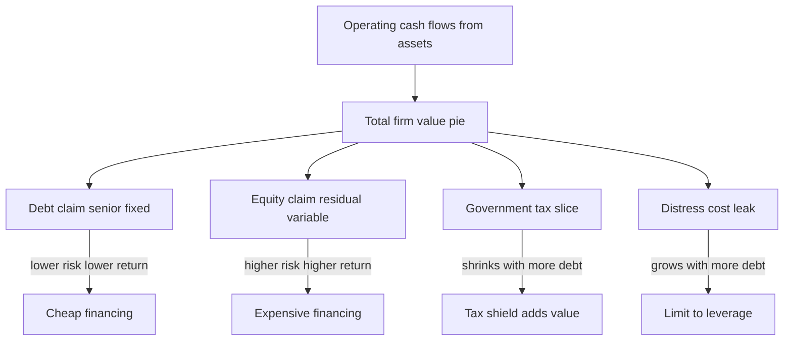
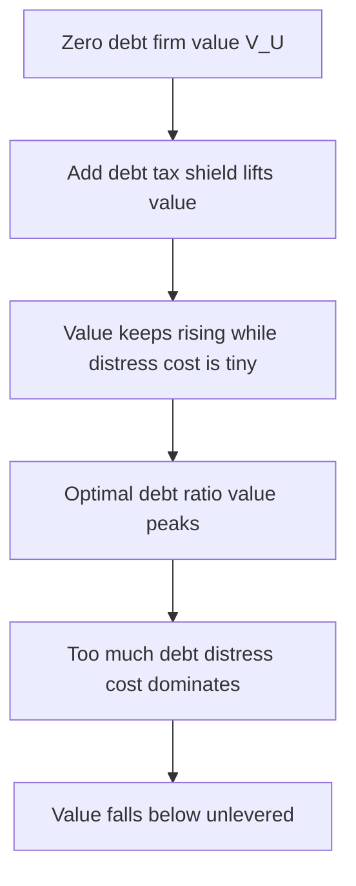

# Capital Structure Theory

## The Problem / Why this matters

Every firm that has ever existed has faced one deceptively simple question: **where should the money come from?** A company needs capital to buy machines, fund working capital, acquire rivals, and pay salaries. It can raise that capital in essentially two flavours — **debt** (borrowed money it must repay with interest) and **equity** (ownership stakes it sells to shareholders). The *mix* of these two — how much debt versus how much equity sits on the right-hand side of the balance sheet — is called the firm's **capital structure**.

The question sounds like an accounting footnote. It is actually one of the deepest questions in all of finance, and it is the single most tested topic in corporate-finance interviews across equity research, credit, FP&A, and investment banking. Here is why it matters so much:

- **It moves valuation directly.** Change the debt-to-equity mix and you change the weighted average cost of capital (WACC), the discount rate you apply to free cash flows. Change the discount rate and you change the enterprise value. A DCF is only as good as its WACC, and WACC is a capital-structure question.
- **It decides who bears risk and who captures reward.** Debt holders get paid first but capped; equity holders get paid last but keep the upside. The mix determines how the pie of business risk is sliced.
- **It can bankrupt an otherwise healthy business.** A profitable company with too much debt dies when a recession hits because it cannot service fixed interest payments. Capital structure is where operational success and financial survival collide.
- **It is a signal.** How a firm chooses to fund itself tells the market what management believes about the future. A company issuing equity at a 52-week high is telling you something; a company loading up on cheap debt is telling you something else.

The intellectual heart of the topic is a genuine paradox. In 1958, two economists — Franco Modigliani and Merton Miller — proved, with airtight logic, that **capital structure does not matter at all**. Yet every CFO on earth agonizes over it, and both economists later won Nobel prizes partly for this work. Resolving that paradox — understanding *exactly* which assumption you have to break for capital structure to start mattering, and by how much — is the whole game. Master it and you can answer almost any capital-structure interview question from first principles rather than memorized rules.

## Core Idea

In plain language, capital structure theory is a layered story, and each layer is built by *relaxing one unrealistic assumption* from the layer before it:

1. **In a perfect world, the mix is irrelevant (Modigliani-Miller, no taxes).** The total value of a firm is set by the cash flows its assets produce, not by how you slice the financing. Debt is cheaper than equity, but adding cheap debt makes the remaining equity riskier by *exactly* enough to cancel the benefit. You cannot create value by financial engineering alone.

2. **Add corporate taxes and debt suddenly becomes valuable.** Interest is tax-deductible; dividends and retained earnings are not. So debt lets the firm keep money that would otherwise go to the government. This "tax shield" means, mechanically, that more debt = more firm value. Taken literally, the theory says firms should be 100% debt.

3. **They obviously aren't — so something must push back.** The **trade-off theory** says firms balance the tax benefit of debt against the rising costs of **financial distress** (bankruptcy, lost customers, fire-sale asset values, dysfunctional decision-making). The optimal structure is where the marginal tax benefit equals the marginal distress cost.

4. **But firms don't behave like they're solving that equation either.** The **pecking-order theory** says managers, who know more than investors, prefer to fund with **internal cash first, then debt, then equity as a last resort** — because issuing equity signals the stock is overvalued and gets punished. Profitable firms end up with *low* debt (they don't need it), which trade-off theory struggles to explain.

5. **Layered on top: signaling and market timing.** Capital-structure choices broadcast information, and managers opportunistically issue whichever security is currently overpriced. Structure becomes partly the accumulated residue of past timing decisions.

The punchline for interviews: **there is no universal optimal capital structure formula.** There is a set of forces — tax shields pulling toward debt, distress and information costs pulling toward equity — and the "answer" is always about which force dominates for *this* firm in *this* situation.

## Why it works this way — first principles

Let us build the intuition from the ground up, because if you understand *why*, you never need to memorize the propositions.

**Start with what a firm actually is.** A firm is a machine that generates a stream of operating cash flows (EBIT — earnings before interest and taxes). Those cash flows are produced by the *assets* and the *business model* — the factories, the brand, the customer contracts. The riskiness of those cash flows is called **business risk**, and it is a property of the assets, not the financing.

**Now think about the claims on those cash flows.** Financing is just the act of writing contracts that divide up the operating cash flow stream. A bond is a contract: "you get $X of interest, senior and fixed." A share is a contract: "you get whatever is left, junior and variable." Debt and equity are simply two different *tranches* carved out of the same underlying cash-flow pie.

**Here is the key insight of Modigliani-Miller:** cutting a pizza into more slices does not create more pizza. If the total cash flow produced by the assets is fixed, and if capital markets are frictionless, then the *total value* of all the claims must equal the value of the assets — regardless of how you carve the claims up. Value comes from the left side of the balance sheet (the assets), not the right side (the financing). This is why in a perfect world, capital structure is irrelevant.

**Why is debt cheaper than equity, then?** Two reasons, both real: (1) debt holders have a **senior, contractual, fixed claim** — they get paid before equity and can force bankruptcy if not paid — so they bear less risk and demand a lower return; (2) once we add taxes, **interest is tax-deductible**, lowering the effective cost further. So the cost of debt is genuinely below the cost of equity.

**So why can't you just load up on cheap debt and lower your WACC forever?** Because — in the no-tax world — **adding debt makes equity riskier.** Equity is the *residual* claim. If you promise more of the fixed cash flow to bondholders, the leftover stream to shareholders becomes more volatile and more sensitive to business swings (this is **financial risk**, layered on top of business risk). Shareholders see that their slice got riskier, so they demand a *higher* return. The cost of equity rises by exactly enough to offset the cheap debt you added. WACC stays flat. The pizza is unchanged.

**What breaks the irrelevance?** A leak in the pizza — some slice that goes to a party *other* than debt and equity holders. The two big leaks:

- **The government (taxes).** Because interest is deductible, a levered firm pays less tax. The tax authority's slice *shrinks*, so the combined debt+equity slice *grows*. Debt literally shifts value away from the government to the investors. This is the tax shield, and it's why the perfect-world irrelevance breaks in favour of debt.
- **Bankruptcy lawyers, distressed customers, fleeing employees (distress costs).** When debt gets too high, the probability of not being able to pay rises, and distress imposes *real* costs — legal fees, lost sales, panicked suppliers demanding cash upfront, key staff quitting, managers making short-sighted decisions. These costs are another leak, and they grow faster as leverage rises.

Everything else in the chapter — trade-off, pecking order, signaling — is a more refined story about *the size and nature of these leaks* and *what managers know that investors don't.* Hold that mental model and the whole topic snaps into place.

## Full technical content

### 1. The setup and key definitions

| Term | Meaning |
|---|---|
| **EBIT** | Earnings before interest and taxes; the operating cash flow the assets produce, independent of financing |
| **Business risk** | Volatility of EBIT; driven by operations, not financing |
| **Financial risk** | Extra volatility of equity returns caused by fixed debt obligations |
| **V_U** | Value of the unlevered (all-equity) firm |
| **V_L** | Value of the levered firm (has debt) |
| **D** | Market value of debt |
| **E** | Market value of equity |
| **r_a / r_0** | Cost of capital of the unlevered firm (return on assets); the "business risk" discount rate |
| **r_d** | Cost of debt |
| **r_e** | Cost of equity |
| **T_c** | Corporate tax rate |
| **WACC** | Weighted average cost of capital |

The **weighted average cost of capital** is the blended return the firm must earn to satisfy all its capital providers:

$$
\text{WACC} = \frac{E}{D+E}\,r_e + \frac{D}{D+E}\,r_d\,(1 - T_c)
$$

The `(1 − T_c)` term on the debt piece is the tax shield showing up inside the discount rate — we will see exactly why.

### 2. Modigliani-Miller in a world without taxes

The MM analysis rests on a set of **perfect-market assumptions**: no taxes, no transaction costs, no bankruptcy costs, symmetric information (managers and investors know the same things), individuals can borrow and lend at the same rate as firms, and investment decisions are fixed (financing does not change what projects the firm takes).

**MM Proposition I (no taxes): Capital structure is irrelevant.**

$$
V_L = V_U
$$

The value of a firm is independent of its capital structure. A levered firm and an otherwise-identical unlevered firm must have the same total value.

**The proof is an arbitrage argument** (this is worth knowing cold for interviews). Suppose the levered firm were worth *more* than the unlevered firm. An investor could:
- Sell their shares in the overpriced levered firm.
- Recreate the exact same cash-flow stream by buying the unlevered firm's shares and borrowing personally in the right proportion (**homemade leverage**).
- Pocket the difference, risk-free.

This arbitrage would push prices until `V_L = V_U`. The critical enabling assumption is that **investors can lever themselves on personal account** at the same terms as the firm — so corporate leverage adds nothing they couldn't do for themselves. Anything a firm can do with its capital structure, an investor can undo or replicate. Hence financing is irrelevant.

**MM Proposition II (no taxes): The cost of equity rises linearly with leverage.**

$$
r_e = r_a + (r_a - r_d)\,\frac{D}{E}
$$

As you add debt (raise D/E), the cost of equity rises in a straight line. The slope is `(r_a − r_d)` — the spread between the asset return and the cost of debt. Intuition: shareholders demand compensation for the extra financial risk that leverage piles onto their residual claim.

**The two propositions are two sides of one coin.** Prop II is exactly what keeps WACC constant (Prop I). Plug the rising `r_e` back into the WACC formula (with `T_c = 0`) and the increase in the equity cost is precisely offset by the growing weight on cheap debt. WACC = r_a, flat, at every level of leverage:

$$
\text{WACC (no tax)} = r_a \quad \text{for all } D/E
$$

### 3. Modigliani-Miller with corporate taxes

Now relax the no-tax assumption. Interest paid to debt holders is deducted before computing taxable income; the return to equity holders is not. So a levered firm hands less cash to the tax authority. That saved cash is the **interest tax shield.**

Each year, the tax saved from deducting interest is:

$$
\text{Annual tax shield} = T_c \times r_d \times D = T_c \times \text{Interest}
$$

If the debt is permanent (perpetual) and the tax shield is discounted at the cost of debt, the present value of all future tax shields is:

$$
PV(\text{tax shield}) = \frac{T_c \times r_d \times D}{r_d} = T_c \times D
$$

**MM Proposition I (with taxes):**

$$
\boxed{V_L = V_U + T_c \times D}
$$

The levered firm is worth the unlevered firm *plus* the present value of the tax shield. More debt → more value, linearly. The extra value is exactly the government's shrunken slice.

**MM Proposition II (with taxes):**

$$
r_e = r_a + (r_a - r_d)(1 - T_c)\,\frac{D}{E}
$$

Cost of equity still rises with leverage, but the slope is *flatter* — dampened by the `(1 − T_c)` factor — because the tax shield absorbs part of the risk that would otherwise land on shareholders.

**WACC now falls as leverage rises:**

$$
\text{WACC} = r_a\left(1 - T_c\,\frac{D}{D+E}\right)
$$

Because each dollar of debt brings a tax subsidy, the more debt you use, the lower your WACC and the higher your value. The uncomfortable logical conclusion of MM-with-taxes taken literally: **the optimal capital structure is 100% debt.** Since no real firm is 100% debt, the theory is incomplete — which is exactly the doorway to the next layers.

### 4. Personal taxes — the Miller (1977) refinement

Merton Miller later noted that the story is not just about *corporate* taxes. Investors also pay *personal* taxes, and typically debt income (interest) is taxed at a higher personal rate than equity income (dividends and especially deferred capital gains). This personal-tax disadvantage of debt *partially offsets* the corporate tax shield. The net "gain from leverage" becomes:

$$
\text{Gain} = \left[1 - \frac{(1 - T_c)(1 - T_e)}{(1 - T_d)}\right] \times D
$$

where `T_e` is the personal tax rate on equity income and `T_d` the personal tax rate on debt income. If `(1 − T_c)(1 − T_e) = (1 − T_d)`, the gain vanishes and capital structure is irrelevant again — Miller's "neutral" equilibrium. The practical takeaway for interviews: **the real-world tax shield is smaller than a naive `T_c × D` because personal taxes claw some of it back.** You rarely compute this, but knowing it exists is a mark of depth.

### 5. Trade-off theory — where the optimum comes from

If tax shields alone drove everyone to 100% debt, and they don't, there must be an offsetting cost that grows with leverage. That cost is **financial distress.** The trade-off theory states:

$$
V_L = V_U + PV(\text{tax shield}) - PV(\text{financial distress costs})
$$

**Costs of financial distress come in two kinds:**

| Type | Examples |
|---|---|
| **Direct costs** | Legal fees, court costs, accountant and advisor fees in bankruptcy; typically small, ~3-5% of firm value |
| **Indirect costs** | Lost sales (customers fear you won't honour warranties), suppliers demand cash-on-delivery, key employees quit, competitors pounce, management distracted, fire-sale asset disposals, credit access dries up; often much larger, 10-20%+ of firm value |

There is also a set of **agency costs of debt** that behave like distress costs:
- **Underinvestment / debt overhang:** a near-distress firm skips positive-NPV projects because the gains would mostly go to bondholders, not the shareholders who must fund them.
- **Asset substitution / risk-shifting:** shareholders of a distressed firm prefer wild gambles ("bet the company") because they capture the upside while bondholders eat the downside.
- **Cash-out / milking the property:** paying large dividends to strip value before creditors can claim it.

Against these, high leverage also brings **agency benefits of debt** — the "disciplining effect." Fixed debt payments soak up free cash flow that empire-building managers might otherwise waste on pet projects (Jensen's *free-cash-flow hypothesis*). Debt is a commitment device that forces efficiency.

**The optimum:** value is maximized where the *marginal* tax benefit of one more dollar of debt equals the *marginal* expected distress + agency cost. This gives a hump-shaped value curve and a **target debt ratio** that differs by firm:

- Firms with **stable, tangible, redeployable assets** and steady cash flows (utilities, real estate, consumer staples) can carry lots of debt cheaply — low distress cost per dollar of debt → high optimal leverage.
- Firms with **volatile cash flows and intangible, growth-dependent assets** (biotech, software, early-stage tech) face high distress costs and should carry little debt.

### 6. Pecking-order theory — information asymmetry drives the choice

Trade-off theory assumes managers coolly solve for a target ratio. In practice, financing choices are driven by **information asymmetry**: managers know the true value of the firm; outside investors do not. Myers and Majluf (1984) showed this produces a *pecking order* of financing preferences:

1. **Internal funds first** (retained earnings / cash) — no information problem, no issuance cost, no signal.
2. **Debt next** — relatively information-insensitive; its value doesn't swing much on inside information, so issuing it sends a weak signal.
3. **Equity last** — the most information-sensitive security, issued only as a last resort.

**Why equity is the last resort — the adverse-selection logic:** Suppose management knows the stock is truly worth $100 but the market prices it at $80. Issuing new shares at $80 means selling cheap and *transferring value from existing shareholders to new investors.* A manager acting for existing owners won't do it. Conversely, management is happy to issue when the stock is *overvalued.* Rational investors know this — so **any equity issue is read as "management thinks we're overpriced,"** and the stock drops on announcement (empirically ~2-3% on average). Anticipating that punishment, firms avoid equity and prefer debt or internal cash.

**Key empirical prediction that distinguishes pecking order from trade-off:** *profitable firms borrow less.* Under pecking order, profitable firms generate lots of internal cash, so they sit at the top of the pecking order and rarely need external funds — leaving them with low debt. Under naive trade-off theory, profitable firms have more taxable income to shield and should borrow *more.* Real data lean toward the pecking-order pattern (there is a robust negative correlation between profitability and leverage), which is one of the strongest empirical facts in the field. Neither theory fully wins; both capture part of reality.

There is no well-defined target ratio in pure pecking order — leverage is just the cumulative result of the firm's history of profits and financing needs.

### 7. Signaling theory

Because managers know more, *every financing action is a message.* Signaling theory (Ross, 1977) formalizes this:

- **Issuing debt is a positive signal.** A manager who takes on fixed obligations is effectively saying "I'm confident our cash flows are strong enough to service this — and if I'm bluffing, I personally bear the bankruptcy consequences." Debt is a *credible* signal precisely because it is costly to fake; a weak firm can't safely mimic it.
- **Issuing equity is a negative signal** (see pecking order) — it whispers "we think our shares are dear."
- **Raising the dividend** signals confidence in sustainable future earnings (managers hate cutting dividends, so raising one is a commitment).
- **Share buybacks** signal management believes the stock is cheap.

The unifying idea: in a world of asymmetric information, capital-structure and payout decisions are *credible only when they are costly to fake.* Debt and dividends work as signals because they hurt if you're wrong.

### 8. Market-timing theory

Market timing (Baker and Wurgler, 2002) makes a sharper, more cynical claim: managers **issue equity when the market is high** (equity cheap to sell relative to true value) and **repurchase or issue debt when the market is low.** Capital structure is then not a deliberate target at all but the **cumulative outcome of past attempts to time the market.** Evidence: firms tend to do IPOs and seasoned equity offerings during market booms and high valuations, and leverage ratios are found to be correlated with *historical* market-to-book ratios long after the issuance. Structure becomes "financial-history-dependent."

### 9. Why debt is cheaper than equity — and the limits

**Debt is cheaper for three stacked reasons:**
1. **Seniority and security:** debt holders are paid first and can seize collateral; lower risk → lower required return.
2. **Fixed, contractual claim:** predictable cash flows are worth more per unit of risk than a residual claim.
3. **Tax deductibility:** the after-tax cost of debt is `r_d(1 − T_c)`, pushing it below even its own pre-tax rate.

**But you cannot lever infinitely, because:**
1. **Rising cost of equity:** each dollar of debt makes the residual equity riskier (MM Prop II), so r_e climbs.
2. **Rising cost of debt:** past a point, lenders demand higher spreads and covenants as default risk grows; r_d itself starts rising steeply.
3. **Financial distress and agency costs** eventually swamp the tax shield.
4. **Loss of financial flexibility:** a fully-levered firm has no dry powder for downturns or opportunities; debt capacity is a real option worth preserving.
5. **Debt capacity is finite:** it's bounded by asset tangibility, cash-flow stability, and credit-market appetite.

The net effect is the classic **U-shaped WACC curve**: WACC falls initially as cheap tax-advantaged debt is added, reaches a minimum at the optimal structure, then rises as distress costs and rising r_d and r_e take over. The value curve is the mirror image — an inverted U peaking at the same point.

### 10. How the theories stack up

| Theory | Key friction relaxed | Prediction | What it explains | What it misses |
|---|---|---|---|---|
| MM no tax | none (perfect market) | Structure irrelevant | The baseline logic | Ignores real frictions |
| MM with tax | taxes | 100% debt optimal | Value of tax shield | No firm is 100% debt |
| Trade-off | + distress cost | Interior optimum / target ratio | Why leverage varies with asset type | Profitable firms borrow *less* |
| Pecking order | + information asymmetry | Internal > debt > equity; no target | Profitability–leverage negative link, equity-issue drops | No clear target ratio |
| Signaling | + costly signals | Debt good news, equity bad news | Announcement-return patterns | Partial, overlaps pecking order |
| Market timing | + mispricing | Structure = past timing | Issuance clusters in booms | Weak long-run persistence debate |

## Worked examples

### Worked Example 1 — MM without taxes: proving WACC is constant

**Setup.** Alpha Corp is all-equity. Its assets generate a perpetual EBIT of $200 (no taxes in this world). The unlevered cost of capital `r_a = 10%`. The firm considers issuing $500 of perpetual debt at `r_d = 6%` and using it to buy back stock.

**Step 1 — Value the unlevered firm.**
With no taxes, all EBIT flows to equity. Value of a perpetuity = cash flow / discount rate:
$$V_U = \frac{200}{0.10} = 2{,}000$$

**Step 2 — MM Prop I (no tax) says value is unchanged.**
$$V_L = V_U = 2{,}000$$
After issuing $500 debt: `D = 500`, so `E = V_L − D = 2,000 − 500 = 1,500`.

**Step 3 — Compute the new cost of equity via MM Prop II.**
$$r_e = r_a + (r_a - r_d)\frac{D}{E} = 0.10 + (0.10 - 0.06)\times\frac{500}{1{,}500}$$
$$r_e = 0.10 + 0.04 \times 0.3333 = 0.10 + 0.01333 = 0.11333 = 11.33\%$$

**Step 4 — Verify with the income statement.**
Interest = `6% × 500 = 30`. Income to equity = `EBIT − interest = 200 − 30 = 170`.
Implied equity value = `170 / r_e = 170 / 0.11333 = 1,500.` ✓ Matches Step 2.

**Step 5 — Compute WACC.**
$$\text{WACC} = \frac{E}{V}r_e + \frac{D}{V}r_d = \frac{1{,}500}{2{,}000}(0.11333) + \frac{500}{2{,}000}(0.06)$$
$$= 0.75 \times 0.11333 + 0.25 \times 0.06 = 0.08500 + 0.01500 = 0.10 = 10\%$$

**Conclusion.** WACC is still 10% = r_a, and firm value is still 2,000. The cheap 6% debt bought us nothing because the cost of equity rose from 10% to 11.33% to exactly offset it. This is MM Proposition I made concrete. *This is the single most common numerical proof asked in interviews.*

### Worked Example 2 — MM with taxes: the tax shield adds value

**Setup.** Same Alpha Corp, but now there is a corporate tax rate `T_c = 30%`. EBIT = $200 perpetual, `r_a = 10%`, and it issues `D = 500` perpetual debt at `r_d = 6%`.

**Step 1 — Value the unlevered firm (with taxes).**
Unlevered after-tax cash flow = `EBIT × (1 − T_c) = 200 × 0.70 = 140`.
$$V_U = \frac{140}{0.10} = 1{,}400$$

**Step 2 — Value of the tax shield.**
$$PV(\text{tax shield}) = T_c \times D = 0.30 \times 500 = 150$$

**Step 3 — MM Prop I with taxes.**
$$V_L = V_U + T_c D = 1{,}400 + 150 = 1{,}550$$
Then `E = V_L − D = 1,550 − 500 = 1,050`.

**Step 4 — Verify by summing the cash flows to all claimants.**
- Interest to debt = `6% × 500 = 30`.
- Pre-tax income to equity = `200 − 30 = 170`; tax = `30% × 170 = 51`; after-tax to equity = `119`.
- Total cash to investors = `30 (debt) + 119 (equity) = 149`.
- Unlevered firm paid tax of `30% × 200 = 60`, leaving `140` to investors.
- The levered firm's investors get `149` vs `140` — an extra **9 per year**, which is exactly `T_c × interest = 0.30 × 30 = 9`. ✓ The annual tax shield.
- Capitalized at r_d: `9 / 0.06 = 150` = PV of tax shield. ✓

**Step 5 — Cost of equity and WACC.**
$$r_e = r_a + (r_a - r_d)(1 - T_c)\frac{D}{E} = 0.10 + (0.04)(0.70)\frac{500}{1{,}050}$$
$$= 0.10 + 0.028 \times 0.47619 = 0.10 + 0.01333 = 0.11333 = 11.33\%$$
$$\text{WACC} = \frac{1{,}050}{1{,}550}(0.11333) + \frac{500}{1{,}550}(0.06)(0.70)$$
$$= 0.67742 \times 0.11333 + 0.32258 \times 0.042 = 0.07677 + 0.01355 = 0.09032 = 9.03\%$$

**Cross-check:** `WACC = r_a(1 − T_c·D/V) = 0.10 × (1 − 0.30 × 500/1,550) = 0.10 × (1 − 0.09677) = 0.10 × 0.90323 = 9.03%.` ✓
And value check: after-tax unlevered CF / WACC = `140 / 0.09032 = 1,550`. ✓

**Conclusion.** Adding taxes turned the irrelevance into a $150 gain. WACC fell from 10% to 9.03%. Debt now creates value — and the more debt, the more value, which sets up the need for the trade-off theory's counterweight.

### Worked Example 3 — Trade-off theory: finding the optimal debt level

**Setup.** Beta Ltd is unlevered and worth `V_U = 1,000`. Corporate tax rate `T_c = 25%`. Management estimates the present value of expected financial-distress costs at different debt levels (distress cost rises non-linearly as debt grows):

| Debt D | Tax shield = 0.25 × D | PV distress cost | V_L = 1,000 + shield − distress |
|---|---|---|---|
| 0 | 0 | 0 | 1,000 |
| 200 | 50 | 5 | 1,045 |
| 400 | 100 | 20 | 1,080 |
| 600 | 150 | 55 | **1,095** |
| 800 | 200 | 130 | 1,070 |
| 1,000 | 250 | 260 | 990 |

**Step 1 — Compute value at each level** (done in the table). At D = 600: `1,000 + 150 − 55 = 1,095`. At D = 800: `1,000 + 200 − 130 = 1,070`.

**Step 2 — Identify the peak.** Firm value is maximized at **D = 600, V_L = 1,095.** Beyond that, the marginal distress cost outpaces the marginal tax shield and value falls.

**Step 3 — Marginal analysis (the elegant way).** Look at value added per $200 tranche of debt:
- 0→200: shield +50, distress +5 → net **+45** (add it)
- 200→400: shield +50, distress +15 → net **+35** (add it)
- 400→600: shield +50, distress +35 → net **+15** (add it)
- 600→800: shield +50, distress +75 → net **−25** (stop!)

The optimum is where the last profitable tranche ends — **D = 600.** This mirrors the theory: keep borrowing while marginal tax benefit (50 per tranche) exceeds marginal distress cost, stop when it doesn't. Here the marginal distress cost crosses the marginal tax benefit between 600 and 800.

**Conclusion.** The optimal capital structure is D = 600 (a debt ratio of ~55% of firm value), not the 100% that MM-with-taxes would recommend. The distress cost is the missing counterweight. Note how the tax shield grows *linearly* while distress cost grows *convexly* — that convexity is what produces an interior optimum.

## How it is tested in interviews

Capital structure shows up in *every* corporate-finance interview. Here are the exact questions and crisp model answers.

**Q: "Why is debt cheaper than equity?"**
Model answer (say this): *"Three reasons. First, debt is senior and often secured — lenders get paid before equity and can claim collateral, so they bear less risk and accept a lower return. Second, debt is a fixed contractual claim while equity is the volatile residual, so equity holders demand a risk premium on top. Third, interest is tax-deductible, so the after-tax cost of debt is r_d times one minus the tax rate, lowering it further. But cheaper doesn't mean free — adding debt raises the cost of equity because the residual claim gets riskier."*

**Q: "If debt is cheaper, why don't firms use 100% debt?"**
Model answer: *"Because two things push back. Mechanically, as you add debt the cost of equity rises — Modigliani-Miller Proposition II — and past a point the cost of debt rises too as default risk climbs. Economically, high leverage brings financial distress and agency costs: legal fees, lost customers and suppliers, risk-shifting, debt overhang, and loss of flexibility. The trade-off theory says the optimum is where the marginal tax shield equals the marginal distress cost — an interior optimum, not a corner."*

**Q: "Walk me through Modigliani-Miller."**
Model answer: *"MM has two worlds. Without taxes: Proposition I says firm value is independent of capital structure — V_L equals V_U — because financing just slices a fixed cash-flow pie, and investors can replicate any leverage themselves. Proposition II says the cost of equity rises linearly with the debt-to-equity ratio, exactly offsetting the cheaper debt, so WACC is constant. With corporate taxes: because interest is deductible, V_L equals V_U plus the tax shield, which for perpetual debt is the tax rate times debt. Now WACC falls with leverage and, taken literally, the firm should be all debt. Real firms aren't, which is why we layer on distress costs to get the trade-off theory."*

**Q: "What is the interest tax shield and what's it worth?"**
Model answer: *"It's the tax saved because interest is deductible — each year, tax rate times interest expense. For permanent debt discounted at the cost of debt, its present value collapses to the tax rate times the amount of debt, T_c times D. On a $500 debt at a 30% tax rate, that's $150 of value created out of thin air, shifted from the government to investors."*

**Q: "What's the difference between trade-off and pecking-order theory?"**
Model answer: *"Trade-off theory says firms target an optimal debt ratio by balancing tax shields against distress costs — it predicts a target. Pecking-order theory says there's no target; because managers know more than investors, they fund with internal cash first, then debt, then equity as a last resort, since issuing equity signals overvaluation and gets punished. The killer test between them: profitability. Pecking order predicts profitable firms borrow *less* because they self-fund — and that's what the data show — whereas naive trade-off predicts they'd borrow more to shield more income."*

**Q: "A company announces a big equity issuance — what happens to the stock and why?"**
Model answer: *"It typically drops, on average a couple of percent. Under pecking-order and signaling logic, management issues equity when they believe it's overvalued, so the announcement is read as a negative signal about intrinsic value. It can also signal the firm has exhausted cheaper internal and debt funding. If instead they'd raised debt, the market would read confidence in future cash flows."*

**Q: "How does capital structure affect WACC and valuation in a DCF?"**
Model answer: *"WACC is the E-over-V weighted cost of equity plus the D-over-V weighted after-tax cost of debt. Adding low-cost, tax-advantaged debt lowers WACC up to the optimal point, which raises enterprise value in a DCF. But push leverage too far and rising costs of equity and debt plus distress risk push WACC back up. In practice we use a *target* capital structure for WACC, not today's snapshot, so the ratio doesn't bounce the valuation around."*

**Q (numerical): "Unlevered firm worth 1,000, tax rate 25%, it issues 400 of debt. New value?"**
Model answer: *"V_L = V_U + T_c × D = 1,000 + 0.25 × 400 = 1,100, ignoring distress costs. If distress costs are material at that leverage, subtract their present value."*

**Q: "Which firms should carry high leverage and which shouldn't?"**
Model answer: *"High leverage suits firms with stable, predictable cash flows and tangible, redeployable assets — utilities, real estate, consumer staples — because their distress costs per dollar of debt are low and lenders lend cheaply against hard assets. Low leverage suits volatile, R&D-heavy, intangible-asset firms — biotech, early-stage software — where distress destroys franchise value and there's little collateral. Asset tangibility and cash-flow stability are the two big drivers of debt capacity."*

**How to stand out:** always frame your answer as *forces in tension* — tax shield pulling toward debt, distress and information costs pulling toward equity — and name which force dominates for the specific firm. That framing signals you understand the theory, not just the formulas.

## Traps & common mistakes

- **Thinking MM says "capital structure never matters."** MM's *point* is the opposite: by showing when it *doesn't* matter (perfect markets), it tells you exactly which frictions — taxes, distress, information — make it matter. Always state the assumptions.
- **Forgetting the cost of equity rises with leverage.** The classic error is "debt is cheaper, so more debt lowers WACC forever." No — r_e climbs per MM Prop II, and without taxes the offset is exact. Never quote cheap debt without mentioning the equity-cost response.
- **Using the wrong discount rate for the tax shield / mixing formulas.** `PV(shield) = T_c × D` assumes *perpetual, riskless, constant* debt discounted at r_d. If debt rebalances to a target ratio, the shield is riskier and discounted at r_a (Miles-Ezzell / Harris-Pringle), giving a different answer. Know which assumption you're using.
- **Claiming the optimum is 100% debt.** That's only MM-with-taxes taken literally. The real answer adds distress costs → interior optimum.
- **Confusing business risk and financial risk.** Business risk (EBIT volatility) comes from operations and is fixed by the asset side. Financial risk is *added* by leverage. Leverage never changes business risk; it re-slices who bears it.
- **Saying profitable firms should always lever up.** That's naive trade-off. The dominant empirical pattern (pecking order) is that profitable firms borrow *less* because they self-fund. Interviewers love catching this.
- **Ignoring that WACC uses *market* values and a *target* structure.** Book values and today's snapshot both give wrong answers; use market values and the long-run target mix.
- **Treating the tax shield as riskless free money.** It only has value if the firm has taxable income to shield. A loss-making firm gets no shield — the shield is worth less the higher the probability of low earnings.
- **Double-counting the tax shield.** If you already used the after-tax cost of debt inside WACC and discounted unlevered FCF, do *not* also add `T_c × D` separately — that's WACC vs APV; pick one method.

## First-principles recap

- **Value lives on the asset side.** Cash flows from operations create value; financing only decides how that value is *sliced* among claimants. In a perfect world, slicing is irrelevant (MM Prop I).
- **Leverage re-allocates risk, it doesn't erase it.** Cheap senior debt makes the residual equity riskier by exactly enough to keep WACC flat — until a friction breaks the symmetry.
- **Frictions are leaks in the pie.** Taxes leak value *to* investors (tax shield → debt good); distress and agency costs leak value *away* (→ debt bad). Optimal structure balances the two.
- **The tax shield is real but bounded** — bounded by having taxable income, by personal taxes clawing some back, and by the distress costs that rise convexly with leverage.
- **Information asymmetry reorders everything.** Because managers know more, financing choices are signals; firms prefer internal → debt → equity, and equity issues get punished (pecking order + signaling).
- **There is no universal optimal ratio.** The right structure depends on asset tangibility, cash-flow stability, tax position, and growth — stable/tangible firms lever up, volatile/intangible firms stay light.
- **Always answer in "forces in tension."** Every capital-structure question resolves to: which pull — tax shield or distress/information cost — dominates for this firm?

## Quick-reference

| Concept | Formula / Rule |
|---|---|
| WACC | `WACC = (E/V)·r_e + (D/V)·r_d·(1 − T_c)` |
| MM Prop I, no tax | `V_L = V_U` (structure irrelevant) |
| MM Prop II, no tax | `r_e = r_a + (r_a − r_d)·(D/E)` |
| WACC, no tax | `WACC = r_a` (constant) |
| MM Prop I, with tax | `V_L = V_U + T_c·D` |
| MM Prop II, with tax | `r_e = r_a + (r_a − r_d)(1 − T_c)·(D/E)` |
| WACC, with tax | `WACC = r_a·(1 − T_c·D/V)` |
| Annual tax shield | `T_c × r_d × D = T_c × Interest` |
| PV tax shield (perpetual debt) | `T_c × D` |
| Miller w/ personal taxes | `Gain = [1 − (1−T_c)(1−T_e)/(1−T_d)]·D` |
| Trade-off value | `V_L = V_U + PV(tax shield) − PV(distress costs)` |
| Optimal debt (trade-off) | where marginal tax shield = marginal distress cost |
| Pecking order | internal cash → debt → equity (last resort) |
| Signaling | debt = good news; equity issue = bad news |
| Market timing | issue equity when overvalued, debt/buyback when undervalued |
| Unlevered firm value | `V_U = EBIT·(1 − T_c) / r_a` |
| Debt cheaper because | senior + secured, fixed claim, tax-deductible |
| Limits to leverage | rising r_e, rising r_d, distress + agency costs, lost flexibility |
