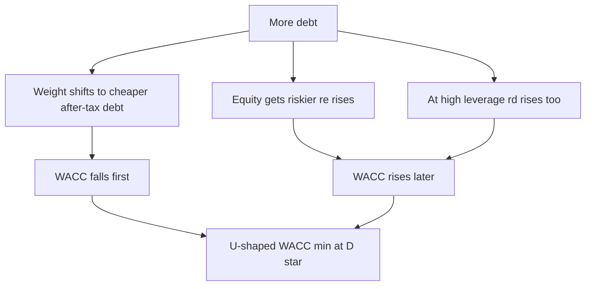
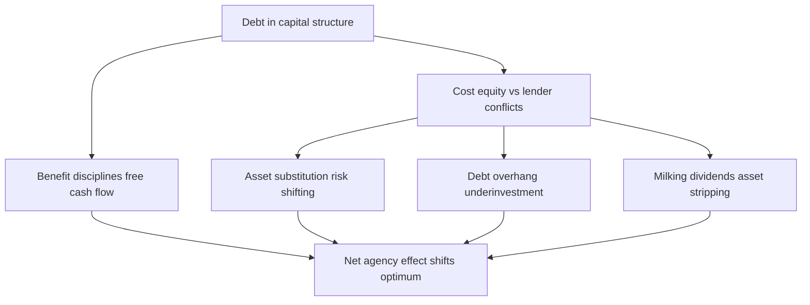

# Optimal Capital Structure & Financial Distress

## The Problem / Why this matters

In a Modigliani–Miller world with no taxes, no bankruptcy costs, and no information problems, capital structure is **irrelevant** — the value of the firm is set entirely by the cash flows its assets produce, and slicing that pie into debt and equity does not change the size of the pie. That is a beautiful benchmark, and it is also obviously false as a description of the real world. If leverage were truly irrelevant, we would not see mature industrials clustering around 30–40% debt-to-capital while software firms carry almost none and private-equity buyouts push debt to 6x EBITDA and beyond. Something real is being traded off.

The moment you re-introduce corporate taxes, MM tells you debt is a tax shield and therefore *more debt is always better* — the tax-adjusted MM Proposition I says firm value rises linearly with debt, which absurdly implies every firm should be 100% debt-financed. That is equally false. The whole intellectual content of this chapter lives in the gap between those two wrong extremes: **debt has a real, quantifiable benefit (the interest tax shield) and a real, quantifiable cost (financial distress and its knock-on agency effects), and the optimal capital structure is the leverage point where the marginal benefit equals the marginal cost.**

This matters for every finance seat you might interview for:

- **Equity research / valuation** — the cost of capital (WACC) that discounts your DCF depends on the capital structure you assume; get leverage wrong and your target price is wrong. You also need to judge whether a company's balance sheet is a risk to the equity story.
- **Credit / leveraged finance / DCM** — your entire job is sizing debt capacity, pricing distress risk, and understanding where a rating breaks.
- **FP&A / corporate finance** — you will be asked to recommend a target capital structure, a dividend/buyback policy, or whether to fund a project with debt or equity.
- **Investment banking / M&A / LBO** — recapitalizations, dividend recaps, and buyout debt sizing are bread-and-butter.

The trade-off theory of capital structure is one of the two or three most-tested conceptual frameworks in all of corporate finance interviews. If you can derive it from first principles, quantify it, and know its limitations, you are ahead of most candidates.

## Core Idea

**A firm's value with leverage equals its all-equity (unlevered) value, plus the present value of the tax shields debt creates, minus the present value of the costs debt creates (financial distress, bankruptcy, and agency costs).** In one line:

$$V_L = V_U + PV(\text{tax shield}) - PV(\text{financial distress costs})$$

The tax-shield term pulls you *toward* debt. The distress term pulls you *away* from it. Because the tax benefit grows roughly linearly with debt while distress costs accelerate (they are convex — they explode as you get close to the edge), there is an interior maximum. That maximum is the **optimal capital structure**: the debt level that maximizes firm value, which is equivalently the debt level that **minimizes WACC**.

Everything else in this chapter — credit ratings, debt capacity, agency costs, leveraged recaps — is either a refinement of the distress term, a tool for measuring where the optimum is, or an action that moves the firm toward (or exploits) that optimum.

## Why it works this way — first principles

Start with the pie. The firm generates a stream of operating cash flows. Those cash flows get divided among **claimants**: equity holders, debt holders, and — crucially — two "leakage" claimants who take a slice without adding value: the **government** (taxes) and the **deadweight costs of distress** (lawyers, lost customers, fire-sale asset values, distracted management).

The insight of trade-off theory is that *capital structure changes how much leaks to those two parasitic claimants*:

1. **Debt shrinks the government's slice.** Interest is tax-deductible; dividends and retained earnings are not. Every dollar of interest paid shields `tax rate × $1` from corporate tax. So substituting debt for equity moves value from the government back to the investors (debt + equity together). This is pure value creation — nothing about the operating business changed, but the pie left for investors grew. This is *why* leverage can add value.

2. **Debt grows the distress slice.** Debt is a *fixed, non-negotiable promise*. Equity is a *residual, flexible claim* — you can cut a dividend in a bad year and nobody can sue you. Miss a coupon or a principal payment and you have triggered default, which hands control to a process (restructuring or bankruptcy) that is expensive and destroys value in ways that have nothing to do with the underlying business: customers flee, suppliers demand cash-on-delivery, key employees leave, assets get sold at fire-sale prices, and management spends its time with restructuring lawyers instead of running the company. The *probability* of hitting that state rises with leverage, and the *cost if you hit it* is largely fixed, so the expected distress cost rises more than proportionally with debt.

So you are trading a benefit that scales roughly linearly (tax shield) against a cost that is small and ignorable at low leverage but accelerates viciously at high leverage. The sum has a hump. The top of the hump is the optimum.

Why do the distress costs accelerate rather than stay linear? Because the *probability of financial distress* is a convex, S-shaped function of leverage. Add the first turn of debt to an unlevered firm and the chance you ever miss a payment is essentially zero — the expected distress cost is trivial. Keep adding debt and at some point interest coverage gets thin; now a normal recession is enough to cause a miss. The probability climbs steeply. Multiply a rising probability by a roughly constant cost-given-distress and you get a convex expected-cost curve. Convex cost minus linear benefit ⇒ interior optimum. That is the entire mathematical skeleton.

There is a second, subtler force layered on top: **agency costs.** Debt does not just create *bankruptcy* risk; it changes the *incentives* of equity holders and managers even before default, sometimes for good (disciplining empire-builders, the "free cash flow" benefit) and sometimes for ill (asset substitution, debt overhang, the incentive to underinvest or gamble). These agency effects shift the location of the optimum and are a favorite of thoughtful interviewers because they show whether you understand incentives, not just formulas.

## Full technical content

### 1. The building block: MM with taxes and the tax shield

Recall the Modigliani–Miller results, because trade-off theory is built directly on top of them.

**MM Proposition I, no taxes:** $V_L = V_U$. Leverage is irrelevant.

**MM Proposition I, with corporate taxes:** the levered firm is worth the unlevered firm *plus* the present value of the interest tax shield:

$$V_L = V_U + PV(\text{ITS})$$

For **permanent, fixed debt** of face value $D$, with a corporate tax rate $t_c$, where interest is discounted at the cost of debt $r_d$:

$$PV(\text{ITS}) = \frac{t_c \cdot r_d \cdot D}{r_d} = t_c \cdot D$$

So with permanent debt, each dollar of debt adds $t_c$ dollars of value. If $t_c = 25\%$, a firm with \$400m of permanent debt carries a tax shield worth \$100m. This is the clean, memorable version — and its absurd corollary (100% debt is optimal) is exactly the launchpad for the distress term.

**Important caveats interviewers probe:**

- The $PV(\text{ITS}) = t_c D$ formula assumes the debt is **permanent and the firm is always profitable enough to use the shield**. If debt is expected to be rebalanced to a target ratio, the shield should be discounted at $r_U$ (the unlevered cost of capital) rather than $r_d$, giving a smaller number (this is the Harris–Pringle / Miles–Ezzell world underlying most WACC-based DCFs).
- The **net** tax advantage is smaller than the corporate rate once you account for **personal taxes** (Miller, 1977). Interest income is taxed at the investor's ordinary rate $t_{pd}$, while equity income is taxed more lightly (capital gains, deferral) at $t_{pe}$. The net gain from leverage per dollar of debt is:

$$G_L = 1 - \frac{(1 - t_c)(1 - t_{pe})}{(1 - t_{pd})}$$

If personal taxes on debt exactly offset the corporate advantage, $G_L$ can shrink toward zero — Miller's point that the *aggregate* tax gain to leverage may be far smaller than $t_c D$ suggests. You do not need to compute this often, but naming it signals depth.

### 2. The distress term: what "financial distress" actually costs

Financial distress is the state where a firm **struggles to meet its fixed obligations** — not necessarily bankruptcy, but the neighborhood of it. Distress costs split cleanly into two buckets:

| Type | Examples | Rough magnitude |
|---|---|---|
| **Direct costs** | Legal fees, court costs, advisory/banker fees, accountants, the machinery of Chapter 11 or restructuring | Small: ~1–5% of firm value for large firms; higher (up to ~20%+) for small firms because they are largely fixed |
| **Indirect costs** | Lost sales (customers fear you won't honor warranties/service), tougher supplier terms (cash upfront), employee flight, management distraction, fire-sale asset disposals, foregone positive-NPV investment, higher input costs | Large and dominant: estimates cluster around **10–25% of pre-distress firm value**, sometimes more for firms selling durable/complex products |

Two features drive everything:

- **Direct costs are largely fixed** ⇒ they hurt small firms disproportionately and are a rounding error for mega-caps.
- **Indirect costs depend on the *nature of the assets and the business*.** A firm whose value lives in **intangible, relationship-dependent, or reputation-sensitive** assets (tech, pharma, consumer brands, anything with warranties or long service relationships) suffers *huge* indirect distress costs — customers and talent evaporate. A firm whose value lives in **tangible, redeployable, liquid** assets (real estate, shipping, utilities, regulated infrastructure) suffers *small* indirect costs — a building is still a building in bankruptcy, and it can be sold or transferred. **This is the single most important determinant of how much debt a firm can safely carry**, and it is a superb interview answer to "why does a software company use no debt but a REIT uses a ton?"

The **expected** present value of distress cost is:

$$PV(\text{distress}) = \underbrace{p(\text{distress})}_{\text{rises with leverage \& business risk}} \times \underbrace{L}_{\text{cost given distress, } \% \text{ of firm value}} \times V$$

- $p$ rises with **leverage** (more/heavier fixed claims) and with **business/asset risk** (volatile cash flows hit the default boundary more often).
- $L$ (the loss rate given distress) rises with **asset intangibility / specificity** and with how **disruptable** the business is.

### 3. Putting it together: the trade-off theory and the optimal point

$$\boxed{V_L = V_U + PV(\text{ITS}) - PV(\text{distress costs})}$$

Graphically: firm value rises with debt (tax shield dominates) up to a point, then bends over and falls (distress dominates). The peak is the optimum $D^*$.

**The dual view via WACC.** Maximizing firm value is equivalent to minimizing the weighted average cost of capital, because $V = \frac{FCF}{WACC}$ (for a perpetuity) — lower discount rate, higher value. As you add cheap, tax-deductible debt, WACC initially falls. But as leverage rises, *both* $r_e$ (equity holders demand more for higher financial risk) and eventually $r_d$ (lenders demand more for default risk) climb, and the rising cost of the pieces overwhelms the benefit of more cheap debt. WACC is U-shaped; its bottom is at the same $D^*$ that maximizes value.

$$WACC = \frac{E}{V} r_e + \frac{D}{V} r_d (1 - t_c)$$

with, from MM Prop II (with taxes),

$$r_e = r_U + (r_U - r_d)\frac{D}{E}(1 - t_c)$$

**Practical determinants of the optimum** — memorize this table; it is the answer to a whole family of "should this company use more/less debt?" questions:

| Factor | Pushes optimal leverage UP | Pushes optimal leverage DOWN |
|---|---|---|
| Tax position | High marginal tax rate, ample taxable income to shield | Low/zero tax rate, NOLs, non-debt tax shields (D&A) already large |
| Cash-flow stability | Stable, predictable, contracted (utilities, telecom, staples) | Volatile, cyclical (commodities, semis, autos) |
| Asset type | Tangible, redeployable, liquid collateral (real estate, planes, ships) | Intangible, firm-specific, growth options (software, pharma R&D) |
| Distress cost of the product | Commodity, no warranty/service (mining) | Durable/complex product needing ongoing support (cars, enterprise software) |
| Growth profile | Mature, low growth, high FCF | High growth needing financing flexibility |
| Financial flexibility need | Low — few future investment needs | High — wants dry powder for opportunities |

### 4. Credit ratings and debt capacity

Debt capacity is the practical, quantified version of "where is the optimum, and where is the cliff?" In practice firms and their bankers do not literally solve for $D^*$ on a curve — they target a **credit rating** and back into the debt level that supports it. Ratings are the market's compressed language for default probability, and rating thresholds map to real, discrete costs (spread, covenant tightness, market access), which is why they anchor capital-structure policy.

**The rating scale (S&P / Fitch, with Moody's equivalents):**

| Grade | S&P / Fitch | Moody's | Meaning |
|---|---|---|---|
| Investment grade | AAA | Aaa | Extremely strong |
| | AA | Aa | Very strong |
| | A | A | Strong |
| | BBB | Baa | Adequate — **lowest IG rung** |
| Speculative / "high yield" / "junk" | BB | Ba | **Highest HY rung** — first below IG |
| | B | B | Highly speculative |
| | CCC/CC/C | Caa/Ca/C | Substantial risk / near default |
| Default | D | — | In default |

**The BBB–/BB+ line (the investment-grade boundary) is the single most important threshold in credit.** Crossing from IG into HY ("falling angel") triggers forced selling by IG-only mandated funds, jumps the spread, and can tighten access to commercial paper and bank lines. Many corporate treasurers manage explicitly to *stay a notch above* BBB– for exactly this reason. Knowing this line and its consequences is a classic credit-interview tell.

**How rating agencies actually think** — a blend of:

- **Quantitative credit metrics** (the ones you compute):

| Metric | Formula | What it captures |
|---|---|---|
| Interest coverage (EBIT) | EBIT / Interest | Can operating profit cover interest? |
| Interest coverage (EBITDA) | EBITDA / Interest | Cash-based coverage cushion |
| Leverage | Total Debt / EBITDA | How many years of EBITDA to repay debt |
| Net leverage | (Debt − Cash) / EBITDA | Leverage net of liquid resources |
| Debt / Capital | Debt / (Debt + Equity) | Balance-sheet gearing |
| FFO / Debt | Funds from operations / Debt | Cash generation vs debt (agencies love this) |
| FCF / Debt | Free cash flow / Debt | Deleveraging capacity |

- **Qualitative factors:** industry cyclicality, competitive position, country/regulatory risk, management financial policy, diversification, liquidity/maturity profile.

Rough EBITDA-leverage feel (varies by sector — utilities tolerate more, cyclicals less): **≤1–2x → strong IG; ~3x → BBB area; 4–5x → BB; 6x+ → B/CCC and squarely LBO territory.**

**Debt capacity** is then the debt level at which the firm's projected metrics — *stressed for a downturn* — still clear the thresholds for the targeted rating. Good analysts size debt off **through-cycle / downside** EBITDA, not peak EBITDA, because coverage must survive the trough.

### 5. Agency costs of debt and equity

Trade-off theory's distress term is really broader than bankruptcy — it includes **agency costs**, the value destroyed because debt and equity holders have *conflicting incentives* and because managers have their own agenda. These operate even before any default and are a favorite deep-dive.

**Agency costs of equity (the manager-vs-owner conflict).** When managers own little of the firm, they may waste free cash flow on empire-building, pet projects, perks, and value-destroying acquisitions rather than returning cash. This is Jensen's **free cash flow problem**. Here debt is the *hero*: fixed interest payments are a **bonding/disciplining device** — they hoover up free cash so managers cannot squander it, and the threat of default keeps them lean. This is a core rationale for LBOs: load a sleepy, cash-rich company with debt and management is *forced* to run it efficiently. So one benefit of debt, separate from taxes, is **discipline**.

**Agency costs of debt (the equity-vs-lender conflict).** Once debt is in place, equity holders (who control the firm and hold the residual, option-like claim) have incentives that hurt lenders. These get worse the closer the firm is to distress, because equity is like a call option on the firm's assets — deep out-of-the-money equity loves volatility and hates paying down debt.

| Agency problem | What equity holders do | Why it destroys value |
|---|---|---|
| **Asset substitution / risk-shifting** | Swap safe projects for risky ones after debt is raised | Equity captures the upside, lenders bear the downside; firm may take negative-NPV gambles because the "heads I win, tails you lose" payoff favors equity |
| **Debt overhang / underinvestment** | Reject positive-NPV projects | If new value mostly accrues to existing lenders (repairing their claim), equity won't fund it — Myers's underinvestment problem; distressed firms starve good projects |
| **Cashing out / milking the property** | Pay large dividends, strip assets | Moves value out of the firm before lenders can claim it |
| **Playing for time / claim dilution** | Delay bankruptcy, issue more/senior debt | Prolongs value destruction; dilutes existing lenders |

Lenders anticipate all this and **price it in** (higher rates) or **contract against it** (covenants: leverage limits, dividend restrictions, negative pledge, anti-layering). Covenants are the market's technology for reducing debt agency costs — which is why heavily levered deals have thick covenant packages, and why "covenant-lite" leveraged loans are a systemic-risk talking point.

The **net** of these agency effects — discipline benefit minus conflict costs — is another force locating the optimum. Firms with lots of free cash flow and few growth options (mature, cash-cow businesses) get a big *discipline* benefit and small *overhang* cost, so they optimally carry more debt. Firms with rich growth options and volatile assets get a big *overhang/asset-substitution* cost, so they optimally carry little debt. This dovetails perfectly with the trade-off table above and with what we observe.

### 6. Where trade-off theory is incomplete: pecking order and market timing

Interviewers love to test whether you know trade-off theory has rivals, because the data don't perfectly obey it (the most profitable firms often have the *least* debt — the opposite of what a pure tax story predicts, since profitable firms have the most taxable income to shield).

- **Pecking-order theory (Myers–Majluf).** Because of **asymmetric information** — managers know more about the firm's true value than outside investors — issuing equity sends a *negative signal* (investors assume you're selling because your stock is overvalued), so firms prefer financing in order: **internal funds first, then debt, then equity as a last resort.** This explains why profitable firms use little debt (they fund from retained earnings) without any appeal to an optimum. There is no target leverage in pure pecking order — leverage is just the cumulative result of financing needs minus internal funds.
- **Market-timing theory.** Firms issue equity when their shares are richly valued and buy back / issue debt when cheap; capital structure is the cumulative outcome of past timing decisions.
- **Signaling (Ross).** Taking on debt can *signal confidence* — managers who privately expect strong cash flows are willing to commit to fixed payments; a debt issue or a leveraged recap can be read as a bullish signal.

The mature synthesis you should articulate: **firms have a target range implied by the trade-off (taxes vs distress/agency), but they move toward it slowly and let pecking-order/timing considerations drive short-run financing choices.** That nuance is exactly what senior interviewers want to hear.

### 7. Recapitalizations and leveraged recaps

A **recapitalization** is a deliberate change in the mix of debt and equity *without* (necessarily) changing the underlying assets — it moves the firm along its capital-structure curve. If a firm believes it is under-levered (below $D^*$, leaving tax shield and discipline benefits on the table), it can **lever up**; if over-levered, it can **de-lever** (pay down debt, issue equity).

**Leveraged recapitalization (leveraged recap):** the firm issues a large slug of new debt and uses the proceeds to **buy back shares** or **pay a large special dividend** (a "dividend recap"). The asset side is unchanged; only the right-hand side of the balance sheet is re-geared toward debt.

**Why do it? The value-creation logic:**

1. **Capture unused tax shield** — moving toward $D^*$ adds $PV(\text{ITS})$.
2. **Impose discipline** — forces out free cash flow, curbs empire-building (the LBO logic applied to a public company).
3. **Signal confidence** — committing to heavy fixed payments signals management believes cash flows are strong.
4. **Concentrate ownership / boost EPS and ROE** — buying back shares with debt shrinks the equity base; if the after-tax cost of debt is below the earnings yield, EPS rises (accretion), and financial leverage magnifies ROE.
5. **Defense** — a leveraged recap can be a **takeover defense**: loading up debt and paying a dividend to shareholders makes the firm a less attractive, less cash-rich target and can deliver the value a raider would have.

**Mechanics of a debt-financed buyback (what actually happens to the numbers):**

- Debt ↑ by the buyback amount; cash unchanged (debt proceeds pass straight through to shareholders).
- Shares outstanding ↓; equity book value ↓ (often goes negative in aggressive recaps).
- Interest expense ↑ ⇒ pre-tax income ↓, but shares fall faster ⇒ **EPS usually rises** if the earnings yield (E/P) exceeds the after-tax cost of debt.
- Financial risk ↑ ⇒ equity beta ↑ ⇒ $r_e$ ↑; the *per-share* value can still rise because value shifts to remaining holders and the tax shield grows.

**A leveraged recap is essentially an LBO the company does to itself** — same mechanics (debt up, equity down, discipline, tax shield), but the company stays public and existing shareholders (rather than a PE sponsor) capture the value. The risks are also the same: you have consumed financial flexibility, raised distress probability, and if the business turns down you are now much closer to the cliff. That is the balanced answer to "should Company X do a leveraged recap?" — *yes if it's under-levered with stable cash flows and redeployable assets and excess FCF; no if it's cyclical, asset-light, growth-hungry, or already near its rating floor.*

## Worked examples

### Worked Example 1 — Finding the optimum via the trade-off (value maximization)

*Setup.* Unlevered firm value $V_U = \$1{,}000$m. Corporate tax rate $t_c = 25\%$. The firm considers permanent debt levels. Assume permanent debt, so $PV(\text{ITS}) = t_c \times D$. The estimated present value of expected distress costs rises convexly with debt as follows:

| Debt $D$ (\$m) | $PV(\text{ITS}) = 0.25D$ | $PV(\text{distress})$ | $V_L = V_U + ITS - Distress$ |
|---:|---:|---:|---:|
| 0 | 0 | 0 | 1,000.0 |
| 200 | 50.0 | 2.0 | 1,048.0 |
| 400 | 100.0 | 10.0 | 1,090.0 |
| 500 | 125.0 | 20.0 | 1,105.0 |
| 600 | 150.0 | 40.0 | **1,110.0** |
| 700 | 175.0 | 80.0 | 1,095.0 |
| 800 | 200.0 | 150.0 | 1,050.0 |

*Working.* At each debt level, value = 1,000 + 0.25D − distress. Notice the tax shield grows linearly (\$25m per \$100m of debt) while distress accelerates (2 → 10 → 20 → 40 → 80 → 150). Value peaks at **D = \$600m, where $V_L = \$1{,}110$m.** Below \$600m the marginal tax shield (\$25m per \$100m) exceeds the marginal distress cost; above \$600m distress rises faster than the shield.

*Check the marginal condition.* From \$500m→\$600m: tax shield +\$25m, distress +\$20m ⇒ net +\$5m (still worth it). From \$600m→\$700m: tax shield +\$25m, distress +\$40m ⇒ net −\$15m (destroys value). The optimum sits where marginal shield ≈ marginal distress, i.e. around \$600m. **Optimal capital structure ≈ \$600m debt, adding \$110m (11%) to firm value vs all-equity.**

*Takeaway line:* "The optimum is where the marginal tax benefit of the next dollar of debt equals its marginal expected distress cost — here about \$600m, lifting value 11%."

### Worked Example 2 — WACC minimization and the U-shape

*Setup.* Unlevered cost of capital $r_U = 10\%$. Risk-free-ish base cost of debt starts at $r_d = 5\%$ but rises as leverage climbs (lenders demand more for default risk). Tax rate $t_c = 25\%$. Firm has \$1,000m of enterprise value we hold fixed for the illustration. Compute WACC at several debt weights, using MM Prop II (with taxes) for $r_e$: $r_e = r_U + (r_U - r_d)\frac{D}{E}(1-t_c)$.

| D/V | E/V | D/E | $r_d$ | $r_e = 10\% + (10\%-r_d)(D/E)(0.75)$ | After-tax $r_d(1-t)$ | WACC |
|---:|---:|---:|---:|---:|---:|---:|
| 0% | 100% | 0.00 | 5.0% | 10.00% | 3.75% | **10.00%** |
| 20% | 80% | 0.25 | 5.0% | 10.94% | 3.75% | 9.50% |
| 40% | 60% | 0.667 | 5.5% | 12.25% | 4.13% | 9.00% |
| 50% | 50% | 1.00 | 6.0% | 13.00% | 4.50% | **8.75%** |
| 60% | 40% | 1.50 | 7.5% | 12.81% | 5.63% | 8.50%? |
| 70% | 30% | 2.333 | 10.0% | 10.00% | 7.50% | 8.25%? |

*Let me recompute the last two rows carefully, because rising $r_d$ changes $(r_U - r_d)$.*

- **D/V = 60%, D/E = 1.5, $r_d = 7.5\%$:** $r_e = 10\% + (10\% - 7.5\%)(1.5)(0.75) = 10\% + 2.5\%\times1.125 = 10\% + 2.81\% = 12.81\%$. After-tax $r_d = 7.5\%\times0.75 = 5.625\%$. WACC $= 0.40\times12.81\% + 0.60\times5.625\% = 5.125\% + 3.375\% = 8.50\%$.
- **D/V = 70%, D/E = 2.333, $r_d = 10\%$:** here $r_d = r_U$, so $(r_U - r_d) = 0$ ⇒ $r_e = 10\%$. After-tax $r_d = 7.5\%$. WACC $= 0.30\times10\% + 0.70\times7.5\% = 3.0\% + 5.25\% = 8.25\%$.

*Wait — this monotonically falls, which is the classic pitfall of the naive MM-with-taxes formula: with a constant tax shield and no explicit distress penalty, WACC keeps dropping toward 100% debt.* That is precisely the flaw trade-off theory fixes. To get the realistic U-shape you must let **distress raise $r_e$ and $r_d$ super-linearly** near the top. Overlay a distress premium that kicks in hard past 50% leverage:

| D/V | WACC (MM only) | + distress premium on capital | Realistic WACC |
|---:|---:|---:|---:|
| 0% | 10.00% | 0 | 10.00% |
| 20% | 9.50% | 0 | 9.50% |
| 40% | 9.00% | +0.05% | 9.05% |
| 50% | 8.75% | +0.20% | **8.95%** |
| 60% | 8.50% | +0.70% | 9.20% |
| 70% | 8.25% | +1.80% | 10.05% |

*Result.* With a realistic distress premium, WACC bottoms around **D/V ≈ 40–50% at ~8.95%**, then rises. **The minimum-WACC leverage is the optimal capital structure** — the same $D^*$ that maximizes firm value.

*Takeaway line:* "The naive tax-only WACC falls forever toward 100% debt — that's the tell that you've forgotten distress. Add a convex distress premium and WACC becomes U-shaped, bottoming at the optimal leverage."

### Worked Example 3 — Debt capacity from a target rating

*Setup.* A cable company has EBITDA of \$500m, expected to be \$400m in a downside/trough case. Existing net debt \$1,200m. The treasurer targets a **BBB** rating, and for this sector the agency guideline is **net debt / EBITDA ≤ 3.0x through the cycle** and **EBITDA / interest ≥ 4.0x**. Blended cost of new debt is 6%. How much additional debt can it raise and still hold BBB?

*Step 1 — Leverage constraint on downside EBITDA (the binding, conservative test).*
Max net debt = 3.0 × downside EBITDA = 3.0 × \$400m = **\$1,200m.**
The firm is *already at* \$1,200m net debt on a downside basis ⇒ **zero additional debt capacity** if you size off the trough. On peak EBITDA (\$500m) the cap would be \$1,500m, i.e. \$300m of headroom — but sizing off peak is exactly the mistake that turns BBB issuers into fallen angels in a recession.

*Step 2 — Coverage constraint.*
At \$1,200m debt × 6% = \$72m interest. Downside coverage = \$400m / \$72m = **5.6x** (≥ 4.0x ✓). Peak coverage = \$500m/\$72m = 6.9x. Coverage is comfortable; **leverage, not coverage, is the binding constraint** — typical for a stable, capital-intensive business.

*Step 3 — If it raised \$300m more (to \$1,500m) off peak EBITDA:* net debt/EBITDA = 1,500/500 = 3.0x at peak but **1,500/400 = 3.75x in the downturn**, breaching the 3.0x BBB line ⇒ likely **downgrade to BB (fallen angel)** exactly when markets are worst. Interest = \$1,500m×6% = \$90m; downside coverage = 400/90 = 4.4x (still ok), confirming leverage is the binding metric.

*Conclusion.* Prudent incremental debt capacity at BBB ≈ **\$0 on a through-cycle basis** (or up to ~\$300m only if management accepts downgrade risk in a downturn). The lesson: **debt capacity is set by the trough, the binding metric, and the rating you're unwilling to lose.**

### Worked Example 4 — A leveraged recapitalization (EPS/ROE and value)

*Setup.* An under-levered consumer-staples firm:

- Shares outstanding: 100m at \$50 ⇒ equity value \$5,000m; no debt.
- EBIT \$600m; tax rate 25%; so net income = \$600m×0.75 = \$450m; **EPS = \$4.50**; P/E = \$50/\$4.50 = 11.1x; earnings yield E/P = 9.0%.
- ROE = \$450m / \$5,000m = 9.0%.

*Action.* Leveraged recap: issue \$2,000m of debt at 6% and buy back shares at \$50 ⇒ repurchase 40m shares, leaving **60m shares.**

*Step 1 — New interest and net income.*
Interest = \$2,000m × 6% = \$120m. New pre-tax income = \$600m − \$120m = \$480m. Net income = \$480m × 0.75 = **\$360m.**

*Step 2 — New EPS.*
EPS = \$360m / 60m = **\$6.00** (up from \$4.50 ⇒ **+33% accretion**). It rose because the earnings yield (9.0%) exceeds the after-tax cost of debt (6%×0.75 = 4.5%); borrowing at 4.5% after-tax to retire equity yielding 9% is accretive.

*Step 3 — New ROE.*
New book equity ≈ \$5,000m − \$2,000m = \$3,000m. ROE = \$360m / \$3,000m = **12.0%** (up from 9.0%) — financial leverage magnified returns to the remaining owners.

*Step 4 — Value created (the tax shield).*
Permanent-debt tax shield = $t_c \times D$ = 0.25 × \$2,000m = **\$500m** of new value. On the pre-recap 100m share base that is \$5/share of value creation; the remaining 60m holders capture it (the 40m who sold got \$50 cash). Post-recap equity value ≈ old equity \$5,000m + tax shield \$500m − cash paid out \$2,000m = \$3,500m over 60m shares ≈ **\$58.3/share** of value for continuing holders (illustrative, ignoring distress).

*Step 5 — The catch.*
Interest coverage fell from ∞ to \$600m/\$120m = **5.0x**; debt/EBITDA = 2,000/600 = **3.3x** (BBB-ish). Equity beta rises with the higher D/E, so $r_e$ climbs. If EBIT ever fell 40% to \$360m, coverage would be 360/120 = 3.0x — getting tight. **The recap created value (tax shield + accretion + discipline) but consumed the flexibility cushion.** For a stable staples business with redeployable assets, that trade is usually attractive; for a cyclical or asset-light one it might not be.

*Takeaway line:* "The recap is accretive because the earnings yield exceeds the after-tax cost of debt, it lifts ROE via leverage, and it captures roughly \$500m of tax shield — but it takes coverage from infinite to 5x, so it only makes sense given stable cash flows."

## How it is tested in interviews

**Q: "Walk me through how you'd think about a company's optimal capital structure."**
Model answer: "Start from MM: in a frictionless world, capital structure is irrelevant. Then add the two big frictions. Taxes make debt attractive — interest is deductible, so debt shields income and adds value, roughly the tax rate times the debt for permanent debt. But debt also raises the probability and cost of financial distress — direct legal/restructuring costs and, more importantly, indirect costs like lost customers, supplier terms, and fire-sale asset values. The tax benefit grows roughly linearly with debt; distress costs grow convexly. The optimum is where the marginal tax benefit of the next dollar of debt equals its marginal distress cost — equivalently, where WACC is minimized. In practice I'd anchor it to a target credit rating and check that stressed coverage and leverage metrics still support that rating through a downturn."

**Q: "Why doesn't a software company use debt while a REIT or utility uses a lot?"**
Crisp line: "Three reasons, all from the trade-off. First, asset type: a REIT/utility has tangible, redeployable, financeable assets that hold value in distress, so its distress costs are low; software's value is intangible growth options and talent that evaporate in distress. Second, cash-flow stability: regulated/contracted cash flows can safely service fixed debt; software cash flows are volatile. Third, tax and growth: high-growth software wants financing flexibility and often has less need to shield income, while a REIT/utility has stable taxable income and few growth options — so debt's discipline benefit is high and its overhang cost is low."

**Q: "What are the costs of financial distress — be specific."**
Say: "Two buckets. Direct costs — legal, court, and advisory fees — which are largely fixed and hurt small firms most, maybe a few percent of value for large firms. Indirect costs — the big ones — lost sales because customers doubt you'll be around for warranties and service, suppliers demanding cash upfront, key employees leaving, management distracted by restructuring, forced asset sales at fire-sale prices, and passing up good projects. Indirect costs can run 10–25% of firm value and depend heavily on how intangible and reputation-sensitive the business is."

**Q: "What is asset substitution / risk-shifting?"**
Say: "It's an agency cost of debt. Equity is like a call option on the firm's assets, so once debt is in place, equity holders have an incentive to take on riskier projects — they capture the upside while lenders bear the downside. Near distress they may even take negative-NPV gambles because it's 'heads I win, tails the lender loses.' Lenders anticipate this and protect themselves with covenants and higher rates."

**Q: "What is debt overhang / the underinvestment problem?"**
Say: "Also an agency cost of debt, from Myers. A heavily indebted firm may pass up positive-NPV projects because most of the new value would go to repairing existing lenders' claims rather than to equity, so equity holders won't fund it. Distressed firms therefore starve good investments — which is itself an indirect distress cost."

**Q: "How does debt add value beyond the tax shield?"**
Say: "Discipline. Jensen's free-cash-flow argument: fixed interest payments soak up cash that managers might otherwise waste on empire-building or bad acquisitions, and the threat of default keeps them lean. That's a core rationale for LBOs and leveraged recaps — debt is a bonding device that aligns managers with owners."

**Q: "A company wants to do a leveraged recap / large debt-funded buyback. Good idea?"**
Say: "It depends on where they are versus their optimum. If they're under-levered with stable cash flows and redeployable assets, yes — it captures unused tax shield, is usually EPS-accretive if the earnings yield exceeds the after-tax cost of debt, lifts ROE, imposes discipline, and signals confidence. But it consumes financial flexibility, raises distress probability, and pushes them toward or below their rating floor — so for a cyclical, asset-light, or high-growth firm it can be value-destructive. I'd size it to a target rating and stress the coverage."

**Q (numerical): "Firm buys back stock with debt — what happens to EPS, ROE, and risk?"**
Answer structure: EPS rises if earnings yield > after-tax cost of debt (show the interest hit vs the lower share count); ROE rises because leverage magnifies returns on a smaller equity base; risk rises — coverage falls, equity beta and $r_e$ climb, and financial flexibility shrinks. Always mention all three.

**Q: "Why can't a firm just be 100% debt-financed if debt has a tax shield?"**
Say: "Because that ignores distress. MM-with-taxes alone says value rises linearly with debt, implying 100% debt — but that's the model telling you it's missing the distress term. Add convex distress and agency costs and value humps over: past the optimum, rising distress costs and cost of capital overwhelm the tax benefit."

**Q: "What's the significance of the BBB–/BB+ line?"**
Say: "It's the investment-grade boundary. Falling below it — becoming a 'fallen angel' — triggers forced selling by IG-mandated funds, jumps your spread, and can cut off commercial paper and cheap bank funding. Many treasurers manage explicitly to stay a notch above BBB– for that reason, so it effectively caps prudent leverage."

**Q: "Trade-off theory vs pecking order?"**
Say: "Trade-off says there's a target leverage balancing tax shields against distress and agency costs. Pecking order, from asymmetric information, says firms have no target — they just prefer internal funds, then debt, then equity last because issuing equity signals overvaluation. Pecking order explains why the most profitable firms often carry the *least* debt, which pure trade-off struggles with. The realistic synthesis: firms have a target range but adjust slowly and let information/flexibility concerns drive short-run choices."

## Traps & common mistakes

- **Forgetting the distress term and concluding more debt is always better.** The naive MM-with-taxes WACC falls monotonically to 100% debt — if your model does that, you've omitted distress. Interviewers set this trap deliberately.
- **Confusing financial distress with bankruptcy.** Distress (and its costs) starts well *before* default — lost customers and tight supplier terms happen while the firm is still solvent. Bankruptcy is the extreme case, not the whole cost.
- **Treating all assets the same.** The optimum depends enormously on asset tangibility/redeployability. "It has strong cash flow so it can take debt" is incomplete without asking whether the *value survives distress*.
- **Sizing debt off peak EBITDA.** Debt capacity must be tested on *trough/downside* cash flows. Peak-EBITDA sizing is how BBB issuers become fallen angels in a recession.
- **Ignoring which metric binds.** Sometimes leverage (Debt/EBITDA) binds, sometimes coverage (EBITDA/Interest). Check both; size to the tighter one.
- **Assuming the full $t_c D$ tax shield always applies.** It requires permanent debt *and* enough taxable income to use the shield. Firms with NOLs, low profitability, or large non-debt tax shields (heavy D&A) get little tax benefit — so they should use less debt, not more.
- **Saying a debt-funded buyback "creates value" only because EPS rose.** EPS accretion is not value creation per se — it can rise while risk-adjusted value is flat. The real value sources are the tax shield and discipline; always mention the higher risk and lower flexibility.
- **Ignoring agency costs entirely.** Many candidates stop at taxes-vs-bankruptcy. Mentioning asset substitution, debt overhang, and the free-cash-flow discipline benefit signals real depth.
- **Forgetting personal taxes / the Miller critique.** The *net* tax advantage of debt is smaller than $t_c$ once personal taxes on interest are considered.
- **Thinking the optimum is a single number.** It's a *range*; firms keep flexibility and adjust slowly. Precision beyond "target range around a chosen rating" is false confidence.

## First-principles recap

- Capital structure matters only because of **frictions**: taxes make debt cheap (deductible interest), while distress and agency costs make it dangerous. No frictions ⇒ MM irrelevance.
- **Value = unlevered value + PV(tax shield) − PV(distress & agency costs).** Linear benefit vs convex cost ⇒ an interior optimum.
- The optimum is equivalently the **minimum-WACC** leverage: cheap after-tax debt lowers WACC until rising $r_e$ and $r_d$ from financial risk overwhelm it, making WACC **U-shaped**.
- **Distress costs are mostly indirect** (lost customers, suppliers, talent, fire sales) and depend on **asset tangibility and business type** — the master variable for how much debt is safe.
- **Debt cuts both ways on agency:** it disciplines free cash flow (a benefit, the LBO logic) but creates equity-vs-lender conflicts — asset substitution, debt overhang, milking — that covenants exist to contain.
- **Debt capacity is anchored to a target credit rating**, sized off **stressed/trough** metrics, and gated at the **investment-grade line**.
- A **leveraged recap** deliberately moves an under-levered firm toward its optimum — capturing tax shield, imposing discipline, lifting EPS/ROE — at the cost of flexibility and higher distress risk.

## Quick-reference

| Concept | Formula / Rule |
|---|---|
| MM Prop I, no tax | $V_L = V_U$ |
| MM Prop I, with tax | $V_L = V_U + PV(\text{ITS})$ |
| PV of tax shield, permanent debt | $PV(\text{ITS}) = t_c \cdot D$ |
| PV of tax shield, rebalanced debt | discount ITS at $r_U$ (smaller than $t_cD$) |
| Trade-off theory | $V_L = V_U + PV(\text{ITS}) - PV(\text{distress})$ |
| Optimal leverage | marginal tax benefit = marginal distress cost ⇔ min WACC |
| WACC | $\frac{E}{V}r_e + \frac{D}{V}r_d(1-t_c)$ |
| Levered cost of equity (MM Prop II, tax) | $r_e = r_U + (r_U - r_d)\frac{D}{E}(1-t_c)$ |
| Net tax gain (Miller, personal taxes) | $G_L = 1 - \frac{(1-t_c)(1-t_{pe})}{(1-t_{pd})}$ |
| Expected distress cost | $p(\text{distress}) \times L \times V$ |
| Interest coverage | EBIT / Interest (also EBITDA / Interest) |
| Leverage ratio | Total Debt / EBITDA; Net Debt / EBITDA |
| IG rating floor | BBB– (S&P/Fitch) / Baa3 (Moody's); below = high yield / fallen angel |
| Rough leverage-to-rating | ≤2x strong IG · ~3x BBB · 4–5x BB · 6x+ B/CCC (LBO) |
| Buyback accretive if | earnings yield (E/P) > after-tax cost of debt $r_d(1-t_c)$ |
| Debt discipline (Jensen) | fixed payments soak up free cash flow ⇒ curbs waste |
| Agency costs of debt | asset substitution, debt overhang, milking, claim dilution |
| Pecking order | internal funds → debt → equity (last); no target leverage |
| Leveraged recap | issue debt → buy back shares / special dividend; move toward $D^*$ |
| Size debt capacity off | **trough/downside** EBITDA, binding metric, target rating |
