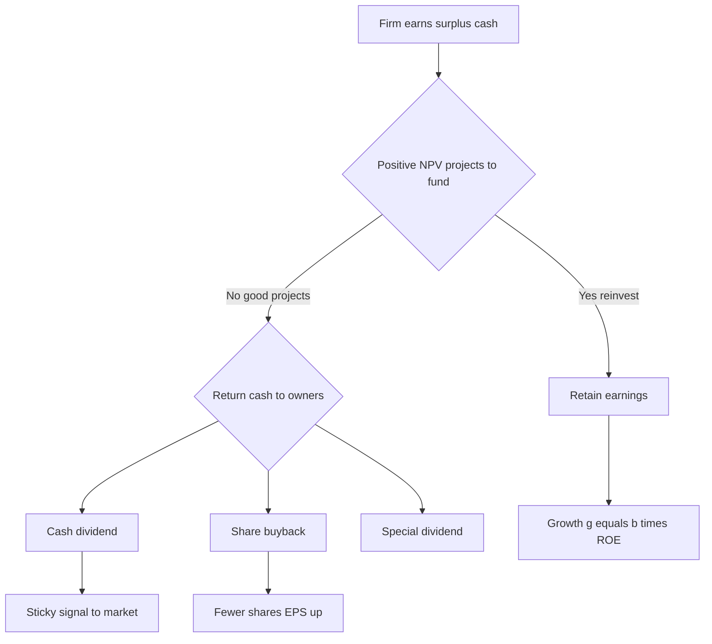
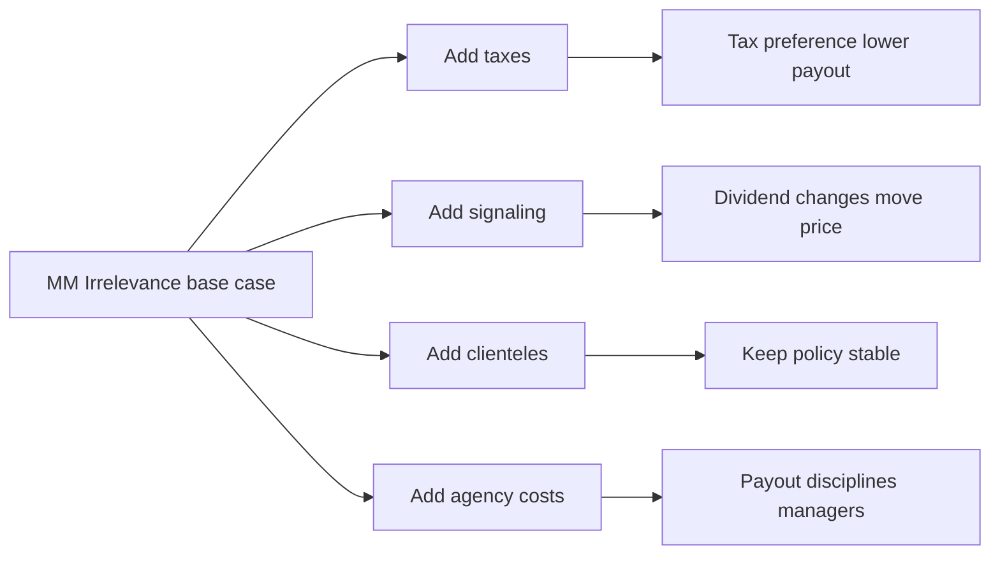

# Dividend Policy & Payout

## The Problem / Why this matters

A profitable company earns cash. Once the bills are paid, the reinvestment is funded, and the interest is serviced, a pile of surplus cash sits on the balance sheet. Someone has to decide what to do with it. The company can:

1. **Keep it** — reinvest in projects, build a cash buffer, pay down debt, or make acquisitions.
2. **Return it to shareholders** — as a **cash dividend** or by **repurchasing shares** (a buyback).

That single decision — *how much of earnings to retain versus return, and in what form* — is **payout policy**. It sits at the intersection of the three big corporate-finance decisions (investment, financing, payout), and it is the one that most directly touches the shareholder's pocket.

Why does an interviewer care? Because payout policy is a **stress test of whether you actually understand valuation and the balance sheet**, not just memorized formulas. If a candidate says "dividends make a stock more valuable," a good interviewer immediately knows they have not internalized the most important idea in the subject: in a frictionless world, **how you slice the cash-return pie does not change the size of the pie**. Everything interesting in dividend policy comes from the *frictions* — taxes, signaling, agency costs, transaction costs — that break that clean result.

You will be asked this in equity research ("is this dividend sustainable?"), in credit ("is the payout starving the balance sheet?"), in FP&A ("what's our residual cash available for distribution?"), and in IB ("should the client do a special dividend or a buyback?"). This chapter builds the whole thing from first principles and then shows you exactly how it gets tested.

---

## Core Idea

Strip it to one sentence: **Payout policy is the decision of how to hand cash back to owners, and in a perfect market the decision is irrelevant to firm value — but real-world frictions make the amount and the form (dividend vs buyback) genuinely matter.**

Three layers to hold in your head:

- **Layer 1 — Irrelevance (Modigliani–Miller, 1961):** In perfect markets, a shareholder is indifferent between receiving a dividend and having the firm retain the cash, because they can create their own "homemade" dividend by selling shares (or undo a dividend by reinvesting). Value comes from the **earning power of assets and the investment policy**, not from the packaging of returns.

- **Layer 2 — Frictions make it relevant:** Taxes (dividends historically taxed differently and often more heavily than capital gains), signaling (managers know more than the market, and a dividend change *tells* the market something), clienteles (different investors want different payouts), agency costs (payout disciplines managers who would otherwise waste cash), and transaction costs (homemade dividends aren't actually free).

- **Layer 3 — Form matters too:** Even holding *total* payout constant, choosing a **dividend** versus a **buyback** changes share count, EPS, ownership concentration, tax timing, and the signal sent. A buyback is flexible and tax-efficient; a dividend is sticky and a strong commitment signal.

That's the whole chapter in miniature. Now let's earn each claim.

---

## Why it works this way — first-principles reasoning

### The conservation-of-value argument

Start from the most basic identity. A firm's value is the present value of the cash its assets will generate, discounted at the appropriate rate. Nothing about *the timing of when you personally extract that cash* changes the assets or the discount rate — in a world with no taxes and no transaction costs.

Think of a shareholder who owns 1% of a company worth ₹1,000 (so their stake is worth ₹10). Suppose the firm pays a ₹100 total dividend. The shareholder gets ₹1 in cash, and the firm is now worth ₹900 (it just shipped ₹100 of cash out the door), so their stake is worth ₹9. Total: ₹1 + ₹9 = ₹10. **Unchanged.** The dividend just moved ₹1 from the "share value" pocket to the "cash in hand" pocket.

Now flip it. Suppose the firm pays *no* dividend but the shareholder wants ₹1 of income. They sell ₹1 of stock. They now hold ₹9 of stock and ₹1 of cash. **Identical outcome.** This is the **homemade dividend**: investors can manufacture any payout stream they want, so they won't pay a premium for the firm to do it for them.

The mirror image is the **homemade dividend reversal**: an investor who receives an unwanted dividend can reinvest it by buying more shares, undoing the payout. So neither "too much" nor "too little" dividend is a problem the investor can't fix themselves — *for free, in a perfect market*.

That is the engine of irrelevance. Every real-world reason dividends matter is a reason that homemade-dividend machine is not actually free or frictionless.

### Where the frictions bite

- **Taxes are the biggest wedge.** If dividends are taxed at a higher rate than capital gains (or taxed *now* rather than deferrable), then the homemade-dividend machine has a cost, and investors prefer the firm to retain or buy back rather than pay a taxed dividend. This is the "tax preference" school.

- **Information asymmetry** means managers know the true earning power and the market doesn't. A dividend is a *credible* signal precisely because it's costly to fake — a firm that raises its dividend is effectively saying "we are confident this cash flow is permanent," because cutting it later is punished brutally.

- **Agency** — free cash flow in the hands of empire-building managers gets wasted on value-destroying pet projects. Committing to pay it out removes the temptation. (Jensen's free-cash-flow hypothesis.)

- **Transaction costs & indivisibilities** — selling shares to make a homemade dividend incurs brokerage and, for small retail holders, is a hassle; some investors (endowments, retirees) are structurally unable or unwilling to "dip into principal."

Hold those four frictions in mind. They are the answer to almost every dividend interview question.

---

## Full technical content

### 1. The vocabulary and mechanics

**Payout choices:**

| Form | What happens | Cash out? | Shares change? |
|---|---|---|---|
| **Cash dividend** | Firm pays ₹X per share to holders | Yes | No |
| **Special (one-time) dividend** | Large, explicitly non-recurring cash payment | Yes | No |
| **Share repurchase / buyback** | Firm buys its own shares back | Yes | Yes (shares fall) |
| **Stock dividend / bonus issue** | New shares issued pro-rata, no cash | No | Yes (shares rise) |
| **Stock split** | Each share divided into N shares, no cash | No | Yes (shares rise) |

Note the last two are **not payout** — no cash leaves the firm. A 2-for-1 split just relabels the pizza into more slices; a bonus issue capitalizes reserves into share capital. They change the *per-share* optics (lower price, more shares) but not value. Interviewers love to check you don't confuse a bonus issue with a real distribution.

**The dividend timeline (know these four dates cold):**

| Date | Meaning |
|---|---|
| **Declaration date** | Board announces the dividend; it becomes a legal liability |
| **Ex-dividend date** | First day the stock trades *without* the right to the dividend. Buy on/after this date → you do NOT get it |
| **Record date** | Firm checks its books; holders on record get paid (usually 1 business day after ex-date under T+1 settlement) |
| **Payment date** | Cash actually hits accounts |

On the **ex-date**, the share price mechanically drops by roughly the dividend amount (in a tax-free world, by exactly the dividend). If a ₹500 stock pays a ₹10 dividend, it opens around ₹490 ex-dividend. Nothing was created or destroyed — the ₹10 just left the firm.

### 2. Payout ratios and yield

**Dividend Payout Ratio:**
$$\text{Payout Ratio} = \frac{\text{Dividends}}{\text{Net Income}} = \frac{DPS}{EPS}$$

**Retention (Plowback) Ratio:**
$$b = 1 - \text{Payout Ratio} = \frac{\text{Retained Earnings}}{\text{Net Income}}$$

**Dividend Yield:**
$$\text{Dividend Yield} = \frac{DPS}{\text{Price per share}}$$

**Total Payout Ratio** (the one analysts actually use for modern firms):
$$\text{Total Payout Ratio} = \frac{\text{Dividends} + \text{Buybacks}}{\text{Net Income}}$$

Ignoring buybacks when computing "how much cash is returned" is a rookie error — for many US large-caps, buybacks exceed dividends. Always ask "gross or net of issuance?" A firm buying back ₹100 while issuing ₹60 of stock to employees has a **net buyback of ₹40**.

### 3. The sustainable growth link

Payout is not a free variable — it's chained to growth. From the DuPont/sustainable-growth logic:

$$g = b \times ROE$$

where $g$ = sustainable growth rate of earnings/equity, $b$ = retention ratio, $ROE$ = return on equity. A firm that pays out everything ($b=0$) grows at 0% from internal funds. A firm that retains 60% at a 15% ROE grows sustainably at $0.60 \times 15\% = 9\%$.

This is the pivot between dividend policy and valuation. Plug it into the **Gordon Growth (constant-growth DDM)** model:

$$P_0 = \frac{D_1}{r - g} = \frac{EPS_1 \times (1 - b)}{r - (b \times ROE)}$$

The famous punchline: **raising the payout ratio raises the numerator but lowers $g$ in the denominator.** Whether value rises or falls depends entirely on whether $ROE > r$ or $ROE < r$:

- If **ROE > r** (firm reinvests above its cost of equity): retaining more *creates* value; a higher payout *destroys* value. The firm should retain.
- If **ROE < r** (firm reinvests below its cost of equity): retaining destroys value; the firm should pay out. A higher payout *raises* the stock.
- If **ROE = r**: payout is irrelevant to value. (This is MM irrelevance re-derived from the DDM — a beautiful thing to show an interviewer.)

### 4. The residual dividend policy

The **residual model** says dividends are the *leftover* after funding all positive-NPV investment at the target capital structure:

$$\text{Residual Dividend} = \text{Net Income} - (\text{Equity portion of Capital Budget})$$

Steps:
1. Determine the optimal capital budget (all positive-NPV projects).
2. Determine the equity portion needed to fund it, using the target debt/equity mix.
3. Fund that equity from retained earnings first.
4. **Pay out whatever's left as dividends.** If nothing's left, pay nothing.

Residual policy is *theoretically pure* (it never raises expensive external equity just to pay a dividend, only to take it back) but produces **volatile, unpredictable dividends** — which markets hate. So in practice firms use residual logic to set the *long-run average* payout but **smooth the actual dividend**.

### 5. Lintner's stylized facts and dividend smoothing

John Lintner interviewed managers in the 1950s and found dividends behave nothing like a mechanical residual. The stylized facts (still true, still tested):

1. Firms have a **long-run target payout ratio**.
2. Managers focus on the **change** in dividends, not the level.
3. Dividends are **sticky / smoothed** — firms partially adjust toward the target, moving slowly.
4. Managers are **extremely reluctant to cut** dividends and will not raise them unless confident the higher level is sustainable.

Lintner's partial-adjustment model:
$$\Delta D_t = \text{SOA} \times (\text{Target } DPS - D_{t-1})$$
where SOA is the "speed of adjustment" (typically 0.3–0.5). A firm won't jump straight to target; it closes ~a third of the gap per year. This is why dividends look like a slowly rising staircase while earnings zig-zag.

### 6. The three schools of thought on relevance

| School | Claim | Key names | Implication |
|---|---|---|---|
| **Irrelevance** | Payout doesn't affect value in perfect markets | Modigliani–Miller (1961) | Focus on investment policy, not payout |
| **Bird-in-the-hand** | Investors prefer certain dividends now to uncertain gains later, so higher payout → higher value / lower $r$ | Gordon, Lintner | Higher payout raises value |
| **Tax preference** | Dividends taxed worse than gains, so higher payout → lower value | Litzenberger–Ramaswamy | Lower payout raises value |

The **bird-in-the-hand** argument is a classic trap. It *sounds* wise ("a dividend today is safer than a gain tomorrow") but it's a **fallacy** under MM: paying a dividend doesn't reduce the *risk* of the firm's cash flows. The riskiness of $D_1$ and the riskiness of the capital gain are the *same underlying business risk*. Moving cash from the capital-gain pocket to the dividend pocket doesn't de-risk it. Be ready to say "bird-in-the-hand is intuitively appealing but analytically wrong — the discount rate is set by asset risk, not by whether returns are packaged as dividends."

### 7. Signaling theory (information content of dividends)

Because managers know more than investors, the *act* of changing a dividend transmits information:

- **Dividend increase** → "management is confident earnings are permanently higher." Stock typically **rises** on the announcement.
- **Dividend cut/omission** → "management fears cash flows can't support the old level." Stock typically **falls hard** — often more than the cash impact justifies, because of the negative *information*.

The signal is credible because it's **costly to fake**: a weak firm that mimics a high dividend will run out of cash and be forced to cut, incurring the punishment. This is why the *change* carries so much weight and why boards agonize over dividend decisions.

### 8. The clientele effect

Different investors self-sort into stocks whose payout matches their needs:

- **High-payout clientele:** tax-exempt entities (pension funds, endowments), retirees who want income, income-focused mutual funds. They face no dividend tax penalty and value the cash stream.
- **Low-payout clientele:** high-tax-bracket individuals (prefer deferrable capital gains), growth investors who want reinvestment.

**Consequence:** Because a stable clientele already holds the stock, *changing* your payout policy mainly forces your existing shareholders to churn (and incur taxes/transaction costs) — it doesn't create value, it just annoys people. The clientele effect explains **why firms keep policy stable** and why the *marginal* investor is roughly tax-neutral, weakening (but not eliminating) the tax argument.

### 9. Agency cost / free-cash-flow discipline

Jensen: managers with lots of free cash and few good projects tend to overinvest, diworsify, or pad the corporate jet. Committing to pay out cash:

- forces the firm back to capital markets to raise money (subjecting it to scrutiny),
- reduces the temptation to waste cash,
- can *raise* value for cash-rich, mature, low-growth firms.

This is a positive case for payout that has nothing to do with taxes or signaling — it's about **discipline**. It's why activists demand buybacks/special dividends from cash-hoarding companies.

### 10. Dividends vs Buybacks — the head-to-head

This is the single most-tested comparison. Master this table:

| Dimension | Cash Dividend | Share Buyback |
|---|---|---|
| **Cash to shareholders** | Yes, to all holders pro-rata | Yes, only to those who sell |
| **Share count** | Unchanged | Falls |
| **EPS effect** | None directly | Rises (fewer shares) — mechanical |
| **Ownership %** | Unchanged for all | Rises for non-sellers |
| **Signal** | Strong commitment (sticky) | Softer, flexible; "shares undervalued" |
| **Flexibility** | Low — cuts are punished | High — can start/stop quietly |
| **Tax treatment (investor)** | Taxed as dividend, on everyone, now | Only sellers taxed, as capital gain, when they choose |
| **Best for** | Stable, recurring surplus | Lumpy/uncertain surplus; undervaluation |
| **Balance sheet** | Cash ↓, Retained earnings ↓ | Cash ↓, Treasury stock ↑ / equity ↓ |

**Why buybacks boost EPS (and why that's not free value):** fewer shares means net income is divided among fewer shares, so EPS mechanically rises. **But** the firm spent cash (lost the interest it earned, or took on debt with interest cost). The EPS accretion is *real* only if the earnings yield on the shares bought back exceeds the after-tax return the cash was earning. A buyback funded by cash earning ~0% is almost always EPS-accretive; a buyback of an expensive (high P/E, low earnings-yield) stock funded by expensive debt can be EPS-*dilutive*. Never say "buybacks always increase EPS" without the funding-cost caveat.

**Buyback mechanics (know the three methods):**

| Method | How | Use case |
|---|---|---|
| **Open-market repurchase** | Firm buys shares gradually on the exchange, like any investor | Most common; flexible, no obligation to complete |
| **Fixed-price tender offer** | Firm offers to buy N shares at a set price (usually a premium) by a deadline | Fast, large repurchase; signals confidence |
| **Dutch-auction tender** | Firm specifies a price *range*; shareholders submit the min price they'll accept; firm finds the lowest clearing price | Large repurchase at a market-discovered price |

Also: **accelerated share repurchase (ASR)** — the firm buys a big block immediately from an investment bank, which borrows the shares and unwinds over time. Used when a firm wants an *immediate* share-count reduction.

### 11. How payout hits the three statements

Interviewers *love* the "walk me through what a dividend/buyback does to the statements" question. Memorize both:

**A ₹100 cash dividend:**
- **Income statement:** *No effect.* Dividends are NOT an expense — they're a distribution of after-tax profit. (Trap: candidates who put dividends on the P&L fail instantly.)
- **Cash flow statement:** Cash Flow from Financing (CFF) −₹100. Total cash −₹100.
- **Balance sheet:** Cash −₹100 (asset side); Retained Earnings −₹100 (equity side). Balances.

**A ₹100 buyback:**
- **Income statement:** No direct effect (but future EPS rises via lower share count).
- **Cash flow statement:** CFF −₹100.
- **Balance sheet:** Cash −₹100; Shareholders' equity −₹100 (via Treasury stock contra-equity or retirement of shares). Balances.

**Declaring a dividend not yet paid:** creates "Dividends Payable" (current liability) and reduces Retained Earnings at declaration; the cash outflow hits later at payment.

### 12. Constraints on payout (the real-world limiters)

A firm can't just pay whatever it wants:

- **Legal / capital-impairment rules:** most jurisdictions bar paying dividends out of capital — only out of profits/free reserves. In India, the Companies Act (and Dividend Rules) restricts dividends to current + accumulated profits and caps dividends out of reserves.
- **Debt covenants:** loan agreements frequently cap dividends (e.g., "restricted payments" baskets) or require a minimum interest-coverage/leverage ratio before any distribution.
- **Liquidity:** you can be profitable on paper but cash-poor; dividends need actual cash.
- **Access to capital / growth needs:** a young firm reinvesting at high ROE rationally pays nothing (Amazon paid its first-ever dividend only in 2024).
- **Tax regime:** e.g., India abolished the Dividend Distribution Tax in 2020, shifting dividend taxation to shareholders — which changed the buyback-vs-dividend calculus.

---

---

## Worked examples

### Worked Example 1 — Payout, sustainable growth, and the DDM value pivot

**Setup.** Zenith Ltd earns EPS of ₹20 next year ($EPS_1$). Its ROE is 18%. Cost of equity $r$ = 12%. Consider two payout policies.

**Policy A — Pay out 40% (retain 60%):**
- Retention $b = 0.60$, so $g = b \times ROE = 0.60 \times 18\% = 10.8\%$.
- $D_1 = EPS_1 \times (1-b) = 20 \times 0.40 = ₹8$.
- $P_0 = \dfrac{D_1}{r-g} = \dfrac{8}{0.12 - 0.108} = \dfrac{8}{0.012} = ₹666.67$.

**Policy B — Pay out 70% (retain 30%):**
- $b = 0.30$, $g = 0.30 \times 18\% = 5.4\%$.
- $D_1 = 20 \times 0.70 = ₹14$.
- $P_0 = \dfrac{14}{0.12 - 0.054} = \dfrac{14}{0.066} = ₹212.12$.

**Result.** Paying out *more* **slashed** value from ₹666.67 to ₹212.12. **Why?** Because ROE (18%) > r (12%): every rupee retained earns 18% but is only "charged" 12%, creating value. Cutting retention to pay a bigger dividend forfeits that spread.

**Self-check / the pivot.** Now suppose ROE were only 12% (= r). Policy A: $g = 0.60 \times 12\% = 7.2\%$, $P_0 = 8 / (0.12-0.072) = 8/0.048 = ₹166.67$. Policy B: $g = 0.30 \times 12\% = 3.6\%$, $P_0 = 14/(0.12-0.036) = 14/0.084 = ₹166.67$. **Identical.** When ROE = r, payout is irrelevant — MM proven inside the DDM. That contrast (18% → payout matters; 12% → payout irrelevant) is a killer thing to show an interviewer.

---

### Worked Example 2 — Dividend vs Buyback: value, EPS, and per-share wealth

**Setup.** Meridian Corp: 10,000,000 shares, price ₹100 (market cap ₹1,000m). Net income ₹80m → EPS = ₹8, P/E = 12.5×. It has ₹50m surplus cash to return. Ignore taxes for the base case.

**Option A — Cash dividend of ₹50m.**
- DPS = 50m / 10m = ₹5 per share.
- Ex-dividend price ≈ 100 − 5 = ₹95.
- A holder of 100 shares: 100 × ₹95 = ₹9,500 in stock + ₹500 cash = **₹10,000**.
- Share count unchanged (10m), so EPS unchanged at ₹8. (Net income unaffected by a dividend.)

**Option B — Buyback of ₹50m at ₹100.**
- Shares repurchased = 50m / 100 = 500,000. New count = 9,500,000.
- Market cap after = 1,000m − 50m cash out = ₹950m; price = 950m / 9.5m = **₹100** (unchanged).
- New EPS = 80m / 9.5m = **₹8.42** (up 5.3%).
- A holder of 100 shares who does NOT sell: still 100 shares × ₹100 = **₹10,000**, and now owns a *slightly larger %* of the firm. A holder who sells proportionally (5% of their 100 shares = 5 shares): 5 × ₹100 = ₹500 cash + 95 × ₹100 = ₹9,500 = **₹10,000**.

**Result.** In a tax-free world **total wealth is ₹10,000 either way** — MM again. What differs: the buyback raised EPS (₹8 → ₹8.42) and kept the price at ₹100 (so the P/E fell to ~11.9×), while the dividend dropped the price to ₹95 and left EPS at ₹8. **The buyback's EPS bump is not new value** — it's the same pie over fewer slices.

**Now add taxes.** Suppose dividends are taxed at 30% and capital gains at 10% for the marginal holder, and the holder wants the cash.
- Dividend route: ₹500 gross → tax 30% = ₹150 → **₹350 net cash**, plus ₹9,500 stock = ₹9,850.
- Buyback route (sell 5 shares, cost basis ₹100 each so ~no gain, or small gain): ≈ ₹500 cash − minimal gains tax → ~**₹500 net**, plus ₹9,500 stock = ₹10,000.
- The buyback is **₹150 better after tax** here because it converts a fully-taxed dividend into a lightly-taxed (and self-timed) capital transaction. This is the core tax argument for buybacks.

---

### Worked Example 3 — Residual dividend policy with a target capital structure

**Setup.** Ashford Ltd has net income of ₹120m this year. Target capital structure: **40% debt, 60% equity**. Its capital budget (all positive-NPV projects) is **₹150m**. It follows a strict residual dividend policy. What dividend does it pay, and what's the payout ratio?

**Step 1 — Equity portion of the capital budget.**
Equity needed = 60% × ₹150m = **₹90m**. (Debt funds the other ₹60m.)

**Step 2 — Fund equity from retained earnings first.**
Net income = ₹120m. Use ₹90m to fund the equity portion → retain ₹90m.

**Step 3 — Residual = dividend.**
Residual = 120m − 90m = **₹30m dividend.**
Payout ratio = 30 / 120 = **25%.**

**Step 4 — Now vary the capital budget to show the volatility problem.**
Suppose next year net income is again ₹120m but the capital budget jumps to **₹220m** (great project set).
- Equity portion = 60% × 220 = ₹132m > ₹120m net income.
- The firm needs ₹132m of equity but only has ₹120m of earnings → **dividend = ₹0**, and it must even raise ₹12m of external equity.
- Payout ratio = **0%.**

**Result.** Same earnings, wildly different dividend (25% → 0%) purely because investment opportunities changed. This is exactly why pure residual policy produces **erratic dividends** and why real firms use it only to set a *target average* and then **smooth** (Lintner) around it. Great answer to "why don't firms just use the residual model?"

---

### Worked Example 4 — Lintner smoothing (bonus mechanics)

**Setup.** Novacom paid ₹6.00 DPS last year. Its target payout is 50%, and this year's EPS is ₹16, so the *target* DPS = ₹8.00. Its speed of adjustment (SOA) is 0.4. What does it actually pay?

**Apply Lintner:**
$$\Delta D = \text{SOA} \times (\text{Target} - D_{t-1}) = 0.4 \times (8.00 - 6.00) = 0.4 \times 2.00 = ₹0.80.$$
New DPS = 6.00 + 0.80 = **₹6.80.**

**Interpretation.** Even though the "correct" dividend is ₹8, the firm only moves 40% of the way there — to ₹6.80 — because it wants to be *sure* the higher earnings are permanent before committing. Next year, if EPS holds, it closes another 40% of the remaining gap. That's the staircase. It also protects the firm from having to *cut* if EPS dips back down.

---

## How it is tested in interviews

Below are the exact questions, what the interviewer is checking, and crisp lines to say.

**Q1. "Does dividend policy affect firm value?"**
*What they're checking:* Do you know MM and, more importantly, the frictions.
> "In a perfect market — no taxes, no transaction costs, symmetric information — Modigliani-Miller shows it's irrelevant: investors can make homemade dividends by selling shares, so value comes from investment policy, not payout packaging. In the real world it matters through four frictions: taxes, which favor buybacks and retention; signaling, because a dividend change reveals management's confidence; clienteles, so you keep policy stable; and agency costs, where payout disciplines cash-rich managers. So my one-liner: *how* you return cash matters at the margin, but *whether the underlying projects earn above the cost of capital* matters far more."

**Q2. "A company wants to return ₹500m. Dividend or buyback — how do you advise?"**
> "I'd anchor on four things. One, *sustainability of the surplus*: if it's recurring, a dividend commits credibly; if it's lumpy or uncertain, a buyback is flexible and doesn't create a cut risk. Two, *taxes*: buybacks are generally more tax-efficient because only sellers are taxed, as capital gains, when they choose. Three, *valuation*: buying back overvalued stock destroys value for holders — only repurchase if you believe shares are at/below intrinsic value. Four, *signaling and shareholder base*: a first dividend or a hike is a strong permanence signal; a buyback signals 'we think we're cheap.' For a mature firm with stable cash and an income-oriented base, I'd lean dividend; for a firm with lumpy cash that believes it's undervalued, buyback."

**Q3. "Walk me through what a ₹100 dividend does to the three statements."**
> "Income statement: nothing — dividends aren't an expense, they're a distribution of after-tax profit. Cash flow: financing outflow of ₹100. Balance sheet: cash down ₹100, retained earnings down ₹100 — it balances. If it's declared but unpaid, I'd book Dividends Payable as a current liability and reduce retained earnings at declaration, with the cash hitting at payment."

**Q4. "Do buybacks always increase EPS?"**
> "No. Mechanically fewer shares raise EPS, but the firm spent cash that was earning a return — or borrowed at a cost. The buyback is accretive only if the after-tax cost of the cash used is less than the earnings yield of the stock, i.e., the inverse P/E. Buying a low-earnings-yield, high-P/E stock with expensive debt can be *dilutive*. And even when it's accretive, higher EPS isn't new value — it's the same earnings over fewer shares; the P/E adjusts."

**Q5. "Why do stocks fall so hard when a company cuts its dividend?"**
> "Because of the information content. Dividends are sticky and costly to fake, so managers only set a level they're confident they can sustain. A cut signals they've lost that confidence about future cash flows — the price falls on the *information*, often more than the cash saved. It also forces the income clientele to sell, adding pressure."

**Q6. "What's the bird-in-the-hand argument, and is it right?"**
> "It claims investors prefer certain dividends today to uncertain capital gains tomorrow, so higher payout lowers the required return and raises value. It's intuitive but analytically wrong: paying a dividend doesn't change the risk of the underlying cash flows. The discount rate is set by the firm's asset risk, not by whether you receive returns as dividends or gains. MM and the clientele effect both undercut it."

**Q7. "This company has a 90% payout ratio and its dividend equals 110% of free cash flow. React."**
> "That's a red flag for sustainability. A payout above free cash flow means the dividend is being funded by debt, asset sales, or the cash balance — not by operations. I'd check the FCF-payout ratio over several years, look at leverage and covenants, and view it as elevated cut risk. In equity research I'd flag the yield as potentially a 'value trap.' The sustainable payout must be funded by recurring free cash flow, and growth is constrained by g = b × ROE."

**Q8. "On the ex-dividend date, what happens to the price and why?"**
> "It drops by roughly the dividend amount — exactly the dividend in a tax-free world. Buyers on/after the ex-date don't receive the dividend, so they'll only pay a price that excludes it. No value is created or destroyed; ₹X of firm value just moved from share price into shareholders' pockets."

**Q9. "When should a firm pay NO dividend?"**
> "When it has abundant positive-NPV projects earning above its cost of equity — retention creates value there, since g = b × ROE and every retained rupee earns the spread. Young, high-ROE growth firms rationally pay nothing. It also makes sense when the firm faces tight liquidity, restrictive covenants, or wants to avoid the tax and clientele friction of a dividend it might have to cut."

**Q10. Numerical: "EPS ₹10, ROE 20%, cost of equity 15%, payout 40%. What's the stock worth, and should they pay more or less?"**
> "g = 0.6 × 20% = 12%. D1 = 10 × 0.4 = ₹4. P = 4 / (0.15 − 0.12) = ₹133.33. Since ROE 20% > r 15%, they should pay *less* and retain more — reinvestment creates value. If forced to a higher payout, value falls."

---

## Traps & common mistakes

1. **Putting dividends on the income statement.** They are never an expense. This single error fails candidates. Dividends hit retained earnings and CFF, never the P&L.

2. **Saying "buybacks always raise EPS / create value."** Only if the cash's opportunity cost < earnings yield of the shares. And EPS accretion ≠ value creation.

3. **Confusing bonus issues / stock splits with payout.** No cash leaves the firm; no value returned. They only change per-share optics.

4. **Believing bird-in-the-hand.** A dividend doesn't de-risk the firm's cash flows. The discount rate reflects asset risk, not payout form.

5. **Ignoring buybacks when measuring payout.** Use *total* payout (dividends + net buybacks). For many firms buybacks dominate.

6. **Thinking a higher dividend always raises value.** Only if ROE < r. If ROE > r, higher payout *destroys* value.

7. **Confusing the dividend *level* with the *change*.** Markets react to the change (signal), not the absolute level. A ₹5 dividend that was ₹8 last year is bad news; a ₹5 that was ₹3 is good news.

8. **Forgetting funding source when judging sustainability.** A dividend "covered" by earnings but not by *free cash flow* is being financed by debt or the balance sheet — unsustainable.

9. **Treating the residual model as what firms actually do.** It's a theoretical benchmark; real firms smooth (Lintner). Pure residual → erratic dividends markets punish.

10. **Assuming payout is tax-neutral.** The dividend-vs-gain tax wedge and the *timing* option (you choose when to sell) are central to the buyback preference.

11. **Double-counting in the ex-date.** The price drop *is* the dividend leaving — the shareholder isn't richer by both the dividend and the pre-drop price.

---

## First-principles recap

- **Value comes from assets and investment policy, not from how you package the cash return.** In a perfect market, payout is irrelevant (MM) because investors make homemade dividends for free.
- **Everything interesting is a friction:** taxes (favor buybacks/retention), signaling (changes reveal information), clienteles (keep policy stable), agency (payout disciplines cash), transaction costs (homemade dividends aren't free).
- **The payout–value link runs through g = b × ROE inside the DDM.** Higher payout helps only when **ROE < r**; when ROE > r it destroys value; when ROE = r it's irrelevant.
- **Dividends are a sticky commitment; buybacks are flexible.** Cuts are punished, so managers smooth (Lintner) and treat the *change* as the signal.
- **Buybacks return cash selectively, raise EPS mechanically, and are usually tax-advantaged** — but EPS accretion is not value creation, and buying overvalued stock destroys value.
- **Sustainability is a cash question:** the payout must be funded by recurring free cash flow, within legal, covenant, and liquidity limits.
- **Dividends never touch the income statement** — they flow through retained earnings and financing cash flow.

---

## Quick-reference

| Concept | Formula / Rule |
|---|---|
| Payout ratio | Dividends / Net Income = DPS / EPS |
| Retention (plowback) | b = 1 − payout |
| Dividend yield | DPS / Price |
| Total payout ratio | (Dividends + Buybacks) / Net Income |
| Sustainable growth | g = b × ROE |
| Gordon Growth value | P0 = D1 / (r − g) = EPS1(1−b) / (r − b·ROE) |
| Value pivot | ROE > r → retain; ROE < r → pay out; ROE = r → irrelevant |
| Residual dividend | Net Income − (equity % × capital budget) |
| Lintner adjustment | ΔD = SOA × (Target DPS − Prior DPS) |
| Ex-date price drop | ≈ dividend per share (exact if no tax) |
| Buyback share count | Shares bought = Buyback ₹ / Price |
| Dividend on statements | IS: none. CFF: −cash. BS: cash ↓, RE ↓ |
| Buyback on statements | IS: none direct. CFF: −cash. BS: cash ↓, equity ↓ |
| Buyback accretive if | After-tax cost of cash < earnings yield (E/P) of stock |

| School | Claim | Verdict |
|---|---|---|
| MM Irrelevance | Payout doesn't affect value (perfect markets) | Correct baseline |
| Bird-in-the-hand | Higher payout → higher value | Fallacy (risk unchanged) |
| Tax preference | Lower payout → higher value | Holds when dividends taxed worse |

| Buyback method | Mechanism |
|---|---|
| Open-market | Gradual purchases on exchange; flexible |
| Fixed-price tender | Buy N shares at set premium price by deadline |
| Dutch-auction tender | Shareholders name min price; firm finds clearing price |
| ASR | Immediate block from a bank, unwound over time |
