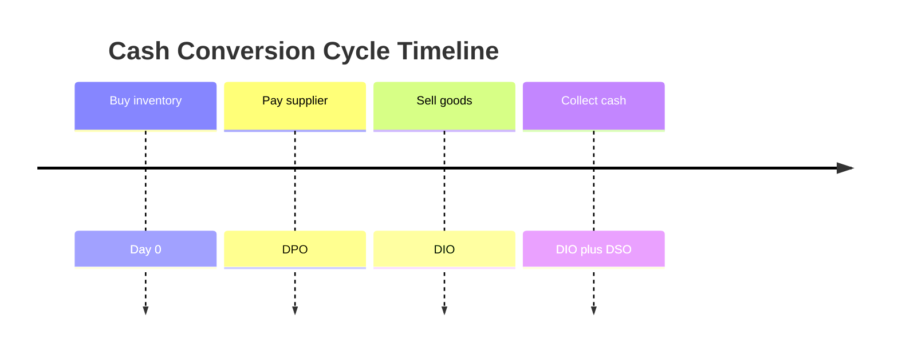
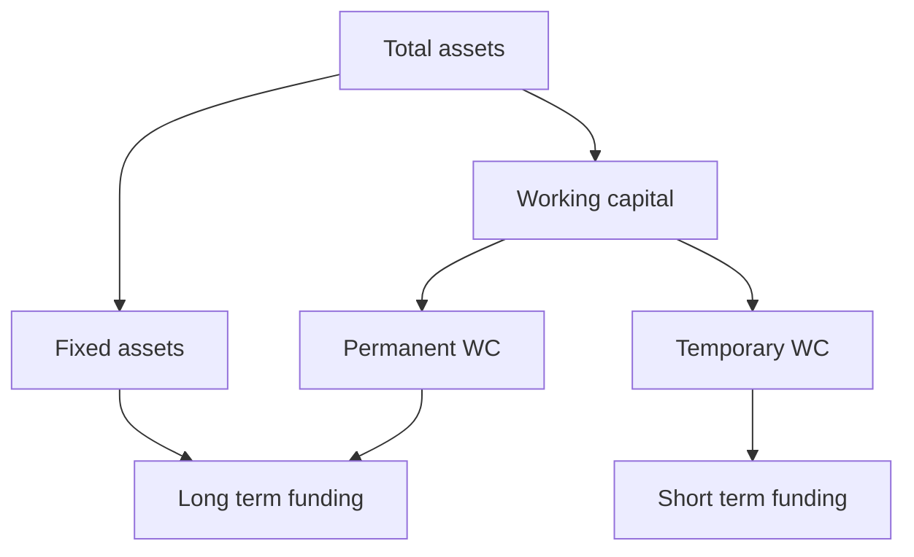

# Working Capital Management

## The Problem / Why this matters

A company can be profitable on paper and still go bankrupt. This is not a paradox — it is the single most important lesson in corporate finance that the income statement will never teach you. Profit is an accrual concept: you book revenue when you *earn* it and expenses when you *incur* them, regardless of when cash actually moves. But you cannot pay wages with "accrued revenue." You cannot settle a supplier invoice with a "receivable." You pay with cash, and cash arrives and leaves on its own schedule — a schedule governed almost entirely by **working capital**.

Consider the classic death spiral of a fast-growing distributor. Sales double year over year. The founder is euphoric. But every unit sold has to be bought and stocked *before* it is sold (inventory), and every rupee of sales is collected 60 days *after* the sale (receivables), while suppliers demand payment in 30 days (payables). The faster the company grows, the more cash it sinks into inventory and receivables *ahead* of the cash it collects. Growth *consumes* cash. The more successful the company is, the deeper the hole — until the bank line is exhausted and payroll bounces. The business dies of success.

This is why working capital management sits at the intersection of every finance role you might interview for:

- **Equity research**: a rising Days Sales Outstanding is often the first quantitative footprint of channel stuffing or deteriorating demand — it shows up in the cash flow statement long before it hits the P&L.
- **Credit / lending**: the entire discipline of asset-based lending, borrowing-base certificates, and covenant design is built on the liquidity buried in receivables and inventory.
- **FP&A / corporate**: your cash-flow forecast, your revolver draw schedule, and your "how much can we afford in capex" answer all hinge on the working-capital swing.
- **Investment banking**: the free-cash-flow bridge in every DCF and every LBO model has a line called "changes in net working capital," and getting the sign and the magnitude right separates analysts who understand the business from those who mechanically link cells.

Working capital is where the accounting rubber meets the cash road. Master it and you will understand why great businesses (think a subscription software company or a supermarket) are cash machines, while structurally identical-looking businesses (a construction contractor, a bespoke machinery maker) are cash furnaces.

## Core Idea

**Working capital is the money tied up in running the business day to day — the cash frozen inside inventory and unpaid customer invoices, less the free financing you get from suppliers who haven't been paid yet.**

Formally:

$$\text{Net Working Capital (NWC)} = \text{Current Assets} - \text{Current Liabilities}$$

But for cash-flow and operating purposes we strip out financing items (cash itself, and short-term debt) and focus on **operating working capital**:

$$\text{Operating NWC} = (\text{Receivables} + \text{Inventory} + \text{Other CA}) - (\text{Payables} + \text{Accruals} + \text{Other CL})$$

The central mechanism is the **cash conversion cycle (CCC)** — the number of days between paying cash *out* to suppliers and getting cash *in* from customers. During that gap, the business must fund itself. The whole art of working-capital management is a single sentence: **collect faster, hold less inventory, pay suppliers slower — without breaking the business** (losing customers to harsh credit terms, losing sales to empty shelves, or losing suppliers to late payment).

Every decision is a **trade-off between liquidity and return**. Cash sitting idle is safe but earns nothing. Cash invested in extra inventory or generous credit terms can drive sales and profit but exposes you to a liquidity crunch. Working-capital management is the discipline of placing that dial correctly.

## Why it works this way — first principles

Start from the physics of a business. A firm buys inputs, transforms or holds them, sells them, and collects cash. Cash is the lifeblood; the operating cycle is the circulatory system.

**Principle 1 — Cash has a timeline, profit does not.** Accrual accounting deliberately *decouples* the recognition of revenue/expense from the movement of cash, so that the income statement measures economic performance in a period. That decoupling is useful for measuring profit but dangerous for managing solvency. The gap between "earned" and "collected" *is* working capital. So working capital is literally the accounting bridge between accrual profit and cash flow.

**Principle 2 — Money has a time value, so timing is worth real money.** A rupee collected today can be reinvested, used to pay down a revolver at, say, 10%, or returned to shareholders. A rupee stuck in a receivable for 60 days is a rupee on which you are implicitly *paying* your cost of capital. Speeding up collections and slowing down payments is therefore not "administrative housekeeping" — it is genuine value creation, measurable in currency.

**Principle 3 — Suppliers are a source of financing.** When a supplier lets you pay in 45 days, they have lent you the value of the goods, interest-free, for 45 days. Trade payables are **spontaneous financing** — they arise automatically from operations, they scale with the business, and (within terms) they are free. This is why stretching payables is the cheapest form of financing available — up to the point where you forgo early-payment discounts or damage the relationship.

**Principle 4 — Growth pulls cash forward.** If each rupee of sales requires, say, ₹0.15 of net working capital, then adding ₹100 of sales *consumes* ₹15 of cash *before* those sales convert. Working capital is a function of the *level* of sales, so *changes* in working capital are driven by the *growth* in sales. Fast growth with positive working-capital intensity is a cash *drain*; the same growth with *negative* working capital is a cash *fountain*. Same growth, opposite cash consequences — the difference is entirely the working-capital model.

**Principle 5 — Liquidity is insurance, and insurance has a cost.** Holding lots of cash, fat inventory buffers, and generous customer credit reduces the risk of a stock-out, a lost sale, or a payroll miss. But every one of those buffers is capital earning a low return. The optimum is not "minimum working capital" (that maximises fragility) nor "maximum liquidity" (that destroys return) — it is the point where the marginal cost of carrying one more rupee of liquidity equals the marginal benefit of the risk it removes.

Put those five together and the entire chapter follows: manage the *timeline* of cash (CCC), price the *time value* of each day (cost of trade credit, cost of financing), exploit *free* supplier financing, respect the *growth* dynamics, and set the liquidity dial by *trade-off*, not by reflex.

## Full technical content

### 1. The operating cycle and the cash conversion cycle

The **operating cycle (OC)** is the time from acquiring inventory to collecting cash from the sale of that inventory. It has two legs:

$$\text{Operating Cycle} = \text{DIO} + \text{DSO}$$

where **DIO** = Days Inventory Outstanding (how long inventory sits before sale) and **DSO** = Days Sales Outstanding (how long customers take to pay).

The **cash conversion cycle (CCC)** subtracts the financing your suppliers give you:

$$\boxed{\text{CCC} = \text{DIO} + \text{DSO} - \text{DPO}}$$

where **DPO** = Days Payable Outstanding (how long you take to pay suppliers).

The component formulas:

| Metric | Formula | Intuition |
|---|---|---|
| DIO | (Average Inventory ÷ COGS) × 365 | Days a rupee sits as stock |
| DSO | (Average Receivables ÷ Revenue) × 365 | Days a rupee waits as an unpaid invoice |
| DPO | (Average Payables ÷ COGS) × 365 | Days you delay paying suppliers |
| Operating Cycle | DIO + DSO | Inventory-to-cash duration, ignoring supplier credit |
| CCC | DIO + DSO − DPO | Net days your own cash is tied up |

Notes that separate an analyst from a memoriser:

- **Base matters.** DSO is on **revenue** (customers owe you sale price). DIO and DPO are on **COGS** (inventory and payables are carried at cost). Mixing bases (e.g., DPO on revenue) is a classic error and inflates the number by the gross-margin factor.
- **Average vs. ending.** Use the average of opening and closing balances when you have both, especially for seasonal or fast-growing firms; use ending balances for a snapshot ratio. Be consistent and state which you used.
- **365 vs. 360.** Either is fine; be consistent. Banks often use 360 for money-market conventions. Interview default: 365.
- **CCC can be negative.** If DPO > DIO + DSO, suppliers and customers are *financing your operations* — you collect from customers before you pay suppliers. This is the holy grail (Amazon, Dell in its prime, most supermarkets).

The CCC is the *net* funding gap. If DIO = 60, DSO = 45, DPO = 30, then Operating Cycle = 105 days, but you only need to self-fund 105 − 30 = **75 days** because your supplier bankrolls the first 30.

### 2. Estimating the working-capital investment from the cycle

The CCC translates directly into a rupee funding requirement. A rough but powerful estimate:

$$\text{Working Capital Investment} \approx \text{CCC} \times \frac{\text{Total Operating Cost per day}}{1}$$

More precisely, build each block on its own base:

$$\text{WC} = \underbrace{\frac{\text{COGS}}{365}\times \text{DIO}}_{\text{inventory}} + \underbrace{\frac{\text{Revenue}}{365}\times \text{DSO}}_{\text{receivables}} - \underbrace{\frac{\text{COGS}}{365}\times \text{DPO}}_{\text{payables}}$$

This is the bridge from *policy* (how many days) to *balance sheet* (how many rupees), and it is how FP&A teams forecast working capital: project revenue and COGS, hold the days assumptions, and the balances fall out.

### 3. Working-capital *intensity* and the growth drain

Define working-capital intensity as NWC as a percent of sales:

$$\text{WC intensity} = \frac{\text{NWC}}{\text{Sales}}$$

The cash consumed by growth in a period is:

$$\Delta \text{NWC} \approx \text{WC intensity} \times \Delta \text{Sales}$$

This single line is why the FCF bridge subtracts increases in working capital: cash tied up in *new* receivables and inventory is cash unavailable to investors.

$$\text{FCF} = \text{EBIT}(1-t) + \text{D\&A} - \text{Capex} - \Delta \text{NWC}$$

An **increase** in NWC is a **use** of cash (subtract); a **decrease** is a **source** of cash (add). Sign discipline here is the most-tested mechanic in IB/FP&A interviews.

### 4. Managing receivables — credit policy

Receivables exist because offering credit *sells more*. The policy question is: does the incremental profit from extra sales justify the incremental cost of carrying (and occasionally losing) the receivables? Credit policy has four levers:

1. **Credit standards** — *who* qualifies for credit (the 5 Cs: Character, Capacity, Capital, Collateral, Conditions).
2. **Credit terms** — the *deal*: net period and any discount, written as "2/10 net 30" (2% off if paid within 10 days, otherwise full amount due in 30 days).
3. **Credit period** — *how long* customers get to pay.
4. **Collection policy** — *how hard* you chase (reminders, dunning, factoring, legal).

**The credit-policy decision framework.** Relax credit (extend period, loosen standards) if and only if:

$$\Delta \text{Contribution from new sales} > \Delta \text{Carrying cost of receivables} + \Delta \text{Bad debts} + \Delta \text{Discount cost} + \Delta \text{Collection cost}$$

where the carrying cost is the opportunity cost of capital tied up in the *incremental investment in receivables*:

$$\text{Investment in receivables} = \frac{\text{Total cost of credit sales}}{365}\times \text{DSO}$$

(Use *cost*, not revenue, for the investment because the true cash you have sunk into a receivable is the cost to produce it, not the marked-up price — the margin is profit you never paid out. Some textbooks use sales value for simplicity; state your assumption. The margin portion is only "at risk" for bad-debt purposes.)

**Ageing schedule** — the collections analyst's core tool: bucket receivables by how overdue they are (0–30, 31–60, 61–90, 90+). A lengthening tail signals collection problems or channel stuffing.

**Factoring and receivables financing.** A firm can sell receivables to a factor for immediate cash at a discount. **Recourse** factoring: the firm eats the bad debt. **Non-recourse**: the factor bears default risk (and charges more). Factoring converts DSO to near-zero at the cost of the factor's fee — a liquidity-for-return trade.

### 5. Managing inventory

Inventory is a buffer that decouples supply from demand — but every rupee of inventory is a rupee of frozen capital plus storage, insurance, obsolescence, and shrinkage. The costs split into two opposing forces:

- **Ordering/setup costs** — rise if you order small and often.
- **Carrying/holding costs** — rise if you order big and rarely.

The classic reconciliation is the **Economic Order Quantity (EOQ)**:

$$\boxed{Q^* = \sqrt{\frac{2DS}{H}}}$$

where D = annual demand (units), S = fixed cost per order, H = carrying cost per unit per year. EOQ minimises total (ordering + carrying) cost; at the optimum, total ordering cost equals total carrying cost.

Supporting formulas:

| Concept | Formula |
|---|---|
| Number of orders per year | D ÷ Q* |
| Total ordering cost | (D ÷ Q) × S |
| Total carrying cost | (Q ÷ 2) × H |
| Reorder point (ROP) | (Daily demand × Lead time) + Safety stock |
| Safety stock | Buffer for demand/lead-time variability |

**Modern inventory philosophies:**

- **Just-in-Time (JIT)** — drive inventory toward zero by synchronising delivery with demand. Slashes DIO and carrying cost but raises stock-out and supply-chain-disruption risk (the liquidity-vs-resilience trade, exposed brutally in the 2020–21 supply shocks).
- **ABC analysis** — not all SKUs matter equally: the "A" items (few SKUs, most value) get tight control; "C" items get loose control.

### 6. Managing payables and the cost of trade credit

Payables are free financing — *until they aren't*. Two things make trade credit expensive:

1. **Forgoing an early-payment discount** has a startlingly high implied cost.
2. **Stretching beyond terms** damages supplier relationships, invites COD terms, or loses priority in scarce-supply situations.

**The cost of forgoing a cash discount.** Given terms "d/t₁ net t₂" (discount d% if paid by day t₁, else full by day t₂), the annualised cost of *not* taking the discount is:

$$\boxed{\text{Cost} = \frac{d}{100-d}\times\frac{365}{t_2 - t_1}}$$

The first fraction is the *effective interest rate for the extra credit period*; the second annualises it. Using **effective annual compounding** instead of the simple annualisation:

$$\text{EAR} = \left(1 + \frac{d}{100-d}\right)^{\frac{365}{t_2 - t_1}} - 1$$

For "2/10 net 30," the simple cost is (2/98)×(365/20) = **37.2%** — which is why forgoing that discount to fund the business with supplier credit is almost always a terrible deal versus a bank line at 10–12%. **Rule: always take the discount unless your marginal cost of funds exceeds the implied cost of forgoing it.**

**Stretching payables (leaning on the trade).** Paying at day 45 instead of 30 lowers the annualised cost (you spread the same discount forgone over more days), but the non-financial costs — lost goodwill, worse future terms — are real and not in the formula.

### 7. Short-term financing

Working capital that isn't funded spontaneously (by payables/accruals) must be funded by short-term sources. The menu, cheapest/most-flexible first:

| Source | Description | Cost / notes |
|---|---|---|
| Trade credit (payables) | Spontaneous, from suppliers | Free within terms; costly if discounts forgone |
| Accruals | Wages/taxes owed but unpaid | Free, spontaneous, but limited and legally bounded |
| Bank line / revolver | Committed revolving facility, drawn as needed | Interest on drawn balance + commitment fee on undrawn |
| Cash credit / overdraft | Draw up to a limit against security | Interest on utilisation; common in India |
| Commercial paper (CP) | Unsecured short-term note, large firms only | Below prime for top credits; needs market access |
| Factoring / receivables finance | Sell/borrow against receivables | Fee/discount; converts DSO to cash |
| Inventory financing | Borrow against stock (floating lien, warehouse receipt) | Secured; advance rate < 100% |
| Bill discounting / trade finance | Discount a trade bill or use an LC | Common in trade-heavy businesses |

**Financing strategy — the maturity-matching principle.** Match the *life* of the asset to the *life* of the financing:

- **Permanent working capital** (the minimum WC the business always needs — a baseline of inventory and receivables that never goes to zero) should be funded with **long-term** capital.
- **Temporary/seasonal working capital** (peaks around a festival or harvest) should be funded with **short-term** sources that can be repaid when the peak recedes.

Three strategies sit on a risk-return spectrum:

- **Conservative** — fund even part of temporary WC with long-term money. Low liquidity risk, lower return (you pay long-term rates and carry idle cash off-peak).
- **Aggressive** — fund even part of permanent WC with short-term money. Higher return (short rates usually lower), higher risk (rollover/refinancing risk if credit tightens).
- **Matching (hedging)** — the balanced middle: permanent → long-term, temporary → short-term.

### 8. The trade-off: liquidity vs. return

Every working-capital policy sits on a spectrum:

- **Fat (conservative) policy** — high cash, high inventory, generous customer credit, quick payment to suppliers. **High liquidity, low risk, low return.** Current ratio high; ROA dragged down by idle assets.
- **Lean (aggressive) policy** — minimal cash, tight inventory, strict credit, stretched payables. **Low liquidity, high risk, high return.** Higher asset turnover and ROA, but one demand shock or credit-market freeze from a crisis.

The measurable link: **return on assets rises as working capital falls** (fewer low-earning current assets in the denominator), but **liquidity risk rises too**. The optimum balances the expected cost of illiquidity (stock-outs, lost sales, emergency financing, distress) against the return drag of carrying liquidity.

Liquidity metrics used to locate a firm on this spectrum:

| Ratio | Formula | Reads as |
|---|---|---|
| Current ratio | Current Assets ÷ Current Liabilities | Coverage of short-term obligations |
| Quick (acid-test) ratio | (CA − Inventory) ÷ CL | Coverage without relying on selling stock |
| Cash ratio | (Cash + Marketable securities) ÷ CL | Coverage from cash alone |
| Net working capital | CA − CL | Absolute liquidity cushion |

### 9. Negative working capital — feature or bug?

Negative operating working capital (current operating liabilities > current operating assets) means **customers and suppliers fund the business**. It is a *feature* when it arises from a structurally advantaged model:

- **Sell before you pay:** collect cash from customers immediately (retail, cash-and-carry, subscription prepaid) while paying suppliers weeks later. Supermarkets, Amazon, Dell (build-to-order) are canonical.
- **Float:** the negative WC is essentially interest-free financing from stakeholders that *grows as the business grows* — so growth *generates* cash instead of consuming it.

It is a *bug / red flag* when it arises from distress:

- **Stretched payables because you can't pay** — DPO ballooning while the business is struggling is not a moat; it is a solvency warning.
- **Collapsing inventory because you can't restock** — negative WC from starvation, not strength.

The diagnostic: *why* is WC negative? Sustainable negative WC comes from the **business model** (favourable terms customers/suppliers accept willingly); dangerous negative WC comes from **strain**. In interviews, always explain the *source*, never just the sign.

## Worked examples

### Worked Example 1 — Cash conversion cycle and the funding requirement

**Given:** Revenue ₹3,650,000; COGS ₹2,555,000. Average inventory ₹280,000; average receivables ₹450,000; average payables ₹210,000. Use 365 days.

**Step 1 — DIO:** (280,000 ÷ 2,555,000) × 365 = 0.10959 × 365 = **40.0 days**.

**Step 2 — DSO:** (450,000 ÷ 3,650,000) × 365 = 0.12329 × 365 = **45.0 days**.

**Step 3 — DPO:** (210,000 ÷ 2,555,000) × 365 = 0.08219 × 365 = **30.0 days**.

**Step 4 — Operating cycle:** 40 + 45 = **85 days**.

**Step 5 — CCC:** 85 − 30 = **55 days**.

**Interpretation:** the firm must fund 55 days of operations from its own capital. At a daily COGS of 2,555,000 ÷ 365 = ₹7,000, and daily revenue of ₹10,000, the invested working capital is inventory (40 × 7,000 = 280,000) + receivables (45 × 10,000 = 450,000) − payables (30 × 7,000 = 210,000) = **₹520,000**, which exactly equals CA − CL (280,000 + 450,000 − 210,000). Cross-check passes.

**Value of improvement:** if the firm cuts DSO from 45 to 35 days through tighter collections, receivables fall to 35 × 10,000 = ₹350,000, releasing **₹100,000** of cash — a one-time cash inflow that can repay the revolver. At a 12% cost of funds, that saves ₹12,000 a year, every year.

### Worked Example 2 — Cost of trade credit and the financing decision

**Given:** A supplier offers terms **2/10 net 45**. The firm can borrow short-term from its bank at **14%** per annum. Should it take the discount?

**Step 1 — Effective rate for the extra credit period.** By paying on day 45 instead of day 10, the firm keeps its cash 35 extra days but forgoes a 2% discount. It effectively pays 2 to keep 98:

$$\frac{d}{100-d} = \frac{2}{98} = 0.020408 = 2.0408\%$$

for a 35-day period.

**Step 2 — Annualise (simple):**

$$0.020408 \times \frac{365}{45-10} = 0.020408 \times \frac{365}{35} = 0.020408 \times 10.4286 = 0.2129 = \mathbf{21.29\%}$$

**Step 3 — Effective annual rate (compounded):**

$$(1.020408)^{365/35} - 1 = (1.020408)^{10.4286} - 1 = 1.2361 - 1 = \mathbf{23.61\%}$$

**Step 4 — Decide.** The implied cost of *forgoing* the discount (21.3% simple, 23.6% compounded) far exceeds the 14% bank rate. **Take the discount** — pay on day 10, funding it with the bank line if needed. Doing so earns a ~7–9 point spread over the cost of the borrowed funds.

**Sanity check on the intuition:** if instead terms were **1/10 net 30**, cost = (1/99) × (365/20) = 0.010101 × 18.25 = **18.43%**. Still above 14%, so still take it. The rule of thumb — small discounts over short windows are *expensive* credit — holds.

### Worked Example 3 — Credit policy relaxation (incremental analysis)

**Given:** A firm currently has annual credit sales of ₹10,000,000, all on "net 30" (DSO = 30). Variable cost is 70% of sales (contribution margin 30%). It considers relaxing terms to "net 60" to attract new customers. Expected effects: sales rise by ₹2,000,000; DSO on *all* sales rises to 60 days; bad debts on the *new* sales run 4% (existing sales stay at 1%); required pre-tax return on investment in receivables = 20%. Use 365 days; base receivables investment on **cost**.

**Step 1 — Incremental contribution from new sales.** New sales ₹2,000,000 × 30% margin = **₹600,000**.

**Step 2 — Incremental bad debts.** New sales: 2,000,000 × 4% = 80,000. Existing sales bad-debt rate unchanged at 1% on 10,000,000 = 100,000 before and after, so no incremental existing bad debt. Incremental bad debt = **₹80,000**.

**Step 3 — Incremental investment in receivables (at cost).**

*Old receivables investment:* total cost of sales = 10,000,000 × 70% = 7,000,000; at DSO 30 → (7,000,000 ÷ 365) × 30 = **₹575,342**.

*New receivables investment:* new total sales = 12,000,000; total cost = 12,000,000 × 70% = 8,400,000; at DSO 60 → (8,400,000 ÷ 365) × 60 = **₹1,380,822**.

*Incremental investment:* 1,380,822 − 575,342 = **₹805,480**.

**Step 4 — Cost of carrying the incremental investment.** 805,480 × 20% = **₹161,096**.

**Step 5 — Net effect.**

| Item | ₹ |
|---|---|
| Incremental contribution | +600,000 |
| Incremental bad debts | −80,000 |
| Incremental carrying cost | −161,096 |
| **Net benefit** | **+358,904** |

**Decision: relax the credit terms.** The extra contribution of ₹600,000 comfortably covers the ₹80,000 of extra defaults and the ₹161,096 opportunity cost of the larger receivables book, leaving ~₹359k of incremental pre-tax profit.

**Cross-check sensitivity:** if the required return were a punishing 40% instead of 20%, carrying cost doubles to ₹322,192, and net benefit falls to 600,000 − 80,000 − 322,192 = **₹197,808** — still positive, so the decision is robust. It would only flip negative if the carrying cost exceeded ₹520,000, i.e., a required return above ~64.6% — implausible. Relaxing is clearly value-accretive.

### Worked Example 4 — EOQ and total inventory cost

**Given:** Annual demand D = 24,000 units; ordering cost S = ₹150 per order; carrying cost H = ₹8 per unit per year.

**Step 1 — EOQ:**

$$Q^* = \sqrt{\frac{2 \times 24{,}000 \times 150}{8}} = \sqrt{\frac{7{,}200{,}000}{8}} = \sqrt{900{,}000} = \mathbf{948.7 \text{ units}}$$

**Step 2 — Orders per year:** 24,000 ÷ 948.7 = **25.3 orders**.

**Step 3 — Total ordering cost:** 25.3 × 150 = **₹3,795**.

**Step 4 — Total carrying cost:** (948.7 ÷ 2) × 8 = 474.35 × 8 = **₹3,795**.

**Verification:** at EOQ, ordering cost = carrying cost (both ₹3,795) — the hallmark of the optimum. Total relevant inventory cost = **₹7,590**. Any other order quantity produces a higher total; e.g., ordering 2,000 units gives ordering cost (12 × 150 = 1,800) + carrying (1,000 × 8 = 8,000) = ₹9,800 > ₹7,590. EOQ confirmed as the minimum.

### Worked Example 5 — Negative working capital and the growth cash fountain

**Given:** A retailer collects cash on sale (DSO = 2 days), turns inventory every 20 days (DIO = 20), and pays suppliers in 60 days (DPO = 60). Annual COGS ₹18,250,000; revenue ₹25,550,000.

**Step 1 — CCC:** 20 + 2 − 60 = **−38 days**. Negative.

**Step 2 — Rupee working capital.** Daily COGS = 18,250,000 ÷ 365 = ₹50,000; daily revenue = 70,000. Inventory = 20 × 50,000 = 1,000,000; receivables = 2 × 70,000 = 140,000; payables = 60 × 50,000 = 3,000,000. Operating WC = 1,000,000 + 140,000 − 3,000,000 = **−₹1,860,000**. The business runs on ₹1.86m of *other people's money*.

**Step 3 — Growth effect.** Suppose sales (and COGS) grow 30%. New WC scales with volume to −1,860,000 × 1.30 = −₹2,418,000. The *change* in WC = −2,418,000 − (−1,860,000) = **−₹558,000** — a **cash inflow** of ₹558,000 generated purely by growing. Growth *funds itself and then some.* Contrast a positive-WC firm (Example 1) where the same 30% growth would *consume* 0.30 × 520,000 = ₹156,000 of cash. Same growth, opposite sign — the model is destiny.

## How it is tested in interviews

**Q: "Walk me through the cash conversion cycle."**
Model answer: "CCC equals DIO plus DSO minus DPO. It's the number of days between paying cash out to suppliers and collecting cash in from customers — the window the firm has to finance itself. DIO is inventory over COGS times 365; DSO is receivables over revenue times 365; DPO is payables over COGS times 365. A shorter or negative CCC means less cash tied up in operations. I'd want to benchmark each leg against peers to see whether the firm collects, stocks, or pays better or worse than the industry."
Crisp line: **"CCC is how long the firm's own cash is locked in the operating cycle — lower is better, negative is a cash machine."**

**Q: "A company is profitable but keeps running out of cash. Why?"**
Model answer: "Almost always a working-capital problem. Profit is accrual; cash isn't. If the firm is growing fast with positive working-capital intensity, every new sale sinks cash into inventory and receivables before it's collected, while payables don't stretch enough to cover it — so growth consumes cash. Or DSO is blowing out (customers not paying), or inventory is bloating. I'd pull the cash flow statement, look at the change in net working capital, and decompose DSO, DIO, DPO to find the leak."
Crisp line: **"Profit is an opinion, cash is a fact — and the gap between them is working capital."**

**Q: "Terms are 2/10 net 30. What's the cost of not taking the discount, and what would you do?"**
Model answer: "2 over 98 gives the effective rate for the extra 20 days — about 2.04%. Annualised, times 365 over 20, is roughly 37%. That's far above any normal borrowing cost, so I'd take the discount, even funding it on the revolver if I had to. You only skip the discount if your marginal cost of funds is above ~37%, which would mean you're in distress."
Crisp line: **"Forgoing 2/10 net 30 is borrowing at 37% — always take the discount unless you literally can't."**

**Q: "How does an increase in working capital affect free cash flow?"**
Model answer: "It reduces it. FCF is EBIT after tax plus D&A minus capex minus the change in net working capital. An increase in NWC — say receivables or inventory building — is a use of cash, so you subtract it. A decrease is a source, so you add it. This is why a company can grow revenue and EBIT but show weak or negative FCF: the growth is being eaten by working-capital investment."
Crisp line: **"Rising working capital is a cash outflow — it's the line that reconciles growing profit with shrinking cash."**

**Q: "Is negative working capital good or bad?"**
Model answer: "Depends entirely on *why*. If it's structural — the firm collects from customers before it pays suppliers, like a supermarket or Amazon — it's excellent: suppliers and customers finance the business, and growth generates cash. If it's because the firm is stretching payables it can't afford to pay, it's a distress signal. Same sign, opposite meaning — I'd always trace the source before judging."
Crisp line: **"Negative working capital is a superpower when it's a business model and a red flag when it's a symptom."**

**Q: "If you could improve one working-capital line to free up cash, how would you think about it?"**
Model answer: "I'd size each lever: releasing cash from DSO means tighter collections and possibly factoring; from DIO means leaner inventory or JIT; from DPO means negotiating longer terms. I'd quantify the one-time cash release — for DSO, days reduced times daily sales — and weigh it against the business cost: harsher credit can lose customers, thin inventory risks stock-outs, over-stretching suppliers damages relationships. It's a liquidity-versus-return trade, and I'd push the lever with the best cash-per-unit-of-risk."

**Q: "What's the difference between the operating cycle and the cash conversion cycle?"**
Model answer: "The operating cycle is DIO plus DSO — the full inventory-to-cash journey. The CCC subtracts DPO because suppliers finance the first stretch of that journey for free. The operating cycle is the whole gap; the CCC is the part *you* have to fund."

## Traps & common mistakes

- **Wrong base for the ratio.** DSO uses revenue; DIO and DPO use COGS. Putting DPO on revenue understates it (you're mixing a cost-based liability with a price-based denominator).
- **Sign errors on ΔNWC in FCF.** An *increase* in NWC is a cash *outflow* (subtract). Under stress, candidates flip the sign and turn a cash drain into a cash source.
- **Confusing profit with cash.** Booking a sale doesn't collect cash; it creates a receivable. Never say "the company made money so it has cash."
- **Treating negative WC as automatically good (or bad).** The sign is meaningless without the *source*. Always diagnose why.
- **Annualising trade-credit cost wrong.** The window is (net period − discount period), *not* the full net period. For 2/10 net 30, the extra credit is 20 days, not 30.
- **Using sales value instead of cost for receivables investment** — overstates the true cash sunk (the margin was never a cash outlay). Fine to use sales value if you *say so*, but be consistent.
- **Forgetting the non-financial cost of stretching payables.** The formula says stretching is cheaper; the relationship damage isn't in the formula.
- **Ignoring seasonality.** A single balance-sheet snapshot of a seasonal firm gives a misleading DSO/DIO. Use averages, and know where in the cycle the snapshot sits.
- **Maturity mismatch.** Funding permanent working capital with short-term debt looks cheap until the credit market freezes and you can't roll it — the classic aggressive-policy blow-up.
- **Assuming lower working capital is always better.** Zero buffers maximise return *and* fragility. The goal is the *optimal* dial, not the minimum.

## First-principles recap

- **Working capital is the bridge between accrual profit and cash flow** — it's the cash frozen in the gap between earning and collecting, net of the free credit suppliers extend.
- **The cash conversion cycle (DIO + DSO − DPO) is the number of days your own money is locked in operations** — and every day has a measurable cost equal to your cost of capital.
- **Suppliers are a free bank within terms** — trade credit is the cheapest financing there is, until you forgo a discount, which is shockingly expensive credit.
- **Growth times working-capital intensity equals cash consumed** — positive WC makes growth a cash furnace; negative WC makes growth a cash fountain.
- **Every working-capital choice is a liquidity-versus-return trade** — buffers buy safety at the cost of return; leanness buys return at the cost of fragility.
- **Match the maturity of financing to the life of the asset** — permanent WC funded long, temporary WC funded short.
- **The sign of working capital is meaningless without its source** — negative WC is a moat when it's a model and a warning when it's a symptom.

## Quick-reference

| Concept | Formula / Rule |
|---|---|
| Net working capital | Current Assets − Current Liabilities |
| Operating NWC | (Receivables + Inventory + other CA) − (Payables + accruals + other CL) |
| DIO | (Avg Inventory ÷ COGS) × 365 |
| DSO | (Avg Receivables ÷ Revenue) × 365 |
| DPO | (Avg Payables ÷ COGS) × 365 |
| Operating cycle | DIO + DSO |
| Cash conversion cycle | DIO + DSO − DPO |
| WC investment | (COGS/365)·DIO + (Rev/365)·DSO − (COGS/365)·DPO |
| ΔNWC cash effect | Increase = use of cash (−); decrease = source (+) |
| FCF | EBIT(1−t) + D&A − Capex − ΔNWC |
| Cost of forgoing discount (simple) | [d ÷ (100−d)] × [365 ÷ (t₂ − t₁)] |
| Cost of forgoing discount (EAR) | (1 + d/(100−d))^(365/(t₂−t₁)) − 1 |
| Investment in receivables | (Total cost of credit sales ÷ 365) × DSO |
| EOQ | √(2DS ÷ H) |
| Reorder point | (Daily demand × Lead time) + Safety stock |
| Current ratio | CA ÷ CL |
| Quick ratio | (CA − Inventory) ÷ CL |
| Cash ratio | (Cash + Marketable securities) ÷ CL |
| WC intensity | NWC ÷ Sales |
| Cash from growth | −(WC intensity × ΔSales) |
| Maturity matching | Permanent WC → long-term funds; temporary WC → short-term funds |
| Take the discount rule | Take it if cost of forgoing > marginal cost of funds |
