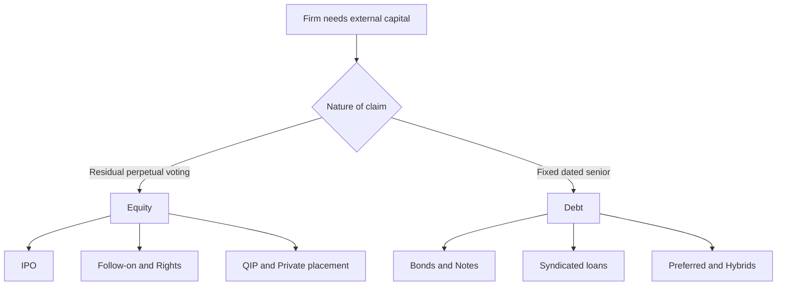
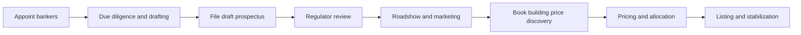
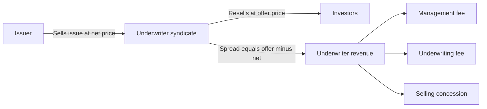
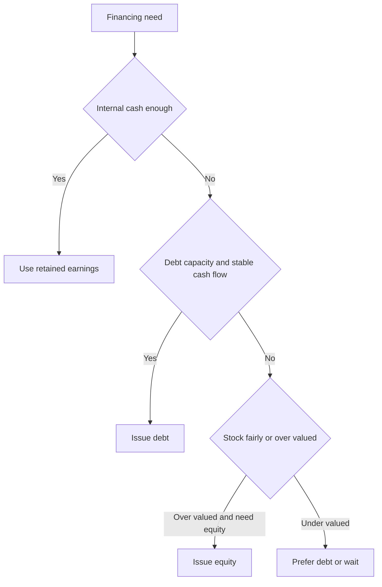

# Raising Capital: Equity & Debt

## The Problem / Why this matters

Every operating company eventually hits a wall its own cash flow cannot climb. A retailer wants to open 200 new stores; a biotech needs three years of runway before its first drug earns a rupee or a dollar; a manufacturer must refinance a wall of bonds coming due next year. The internally generated cash is not enough, or is not timely enough, or is too precious to lock into a long-lived asset. So the company must go **outside** — to public shareholders, private funds, banks, and bondholders — and **raise capital**.

Raising capital is not a back-office chore. It is one of the three legs of corporate finance (the other two being the investment decision and the payout decision), and it is the leg where finance careers are made. An investment banker's entire job is to help issuers raise capital. An equity research analyst must understand how a follow-on offering dilutes EPS. A credit analyst lives inside the bond and loan documents that a financing produces. An FP&A professional models the interest cost and covenant headroom of every new tranche of debt. If you cannot speak fluently about IPOs, rights issues, book-building, underwriting, bond issuance, syndicated loans, issuance costs, and the debt-versus-equity choice, you cannot pass a finance interview — and you cannot do the job.

This chapter builds the entire capital-raising toolkit from first principles: **what** the instruments are, **why** the mechanics look the way they do, **how** the numbers work (with fully solved examples), and **exactly how** interviewers probe your understanding.

## Core Idea

A firm has two fundamental sources of external capital, distinguished by the **nature of the claim** the provider receives:

- **Equity** — a *residual, perpetual, control-bearing* ownership claim. Equity holders own what is left after everyone else is paid, they never have to be repaid, and they vote. Their upside is unlimited; their downside is a total loss.
- **Debt** — a *fixed, dated, senior, contractual* claim. Debt holders are promised specific cash flows (interest + principal) on specific dates, they rank ahead of equity in liquidation, and they do not vote. Their upside is capped at getting repaid; their downside is default risk.

Everything else — preferred stock, convertibles, mezzanine, hybrid notes — sits on a **spectrum** between these two poles. And every *transaction* that delivers this capital (an IPO, a rights issue, a QIP, a private placement, a bond deal, a syndicated loan) is just a different **channel and process** for moving equity or debt from investors to the firm. Master the two claim-types and the handful of processes, and the whole subject organizes itself.

## Why it works this way — first principles

Why do these two claim-types exist at all, and why does the machinery around them (underwriters, book-building, prospectuses, covenants) look the way it does? Three deep forces explain almost everything.

**1. Risk-sharing and the demand for different payoffs.** Investors differ in risk appetite. A pension fund wants predictable cash flows and capital preservation; a venture fund wants asymmetric upside. A single security cannot satisfy both. By *tranching* the firm's cash flows into a senior fixed claim (debt) and a junior residual claim (equity), the firm sells each slice to whoever values it most — lowering its overall cost of capital. This is the Modigliani-Miller world made real: capital structure is the art of carving the same cash-flow pie into pieces that different investors will pay more for.

**2. Information asymmetry.** Insiders (managers, founders) know more about the firm's prospects than outside investors do. Outsiders, fearing they are being sold a lemon, demand a discount. Almost every feature of the capital-raising apparatus exists to *bridge* this asymmetry: the **prospectus** and due diligence force disclosure; the **underwriter** lends its reputation as a certification device; **book-building** aggregates dispersed investor information into a price; **IPO underpricing** compensates investors for revealing their true demand; **covenants** in a loan protect lenders from post-loan behavior they cannot observe. If information were symmetric and free, most of this machinery would vanish.

**3. Agency and control.** Whoever supplies capital worries the managers will misuse it. Debt disciplines managers with a hard repayment schedule and covenants (you *must* generate cash). Equity disciplines through votes and takeover threat. The choice between them, and the terms within each, is a negotiation over **who bears risk and who holds control**.

Hold these three forces — risk-sharing, information asymmetry, and agency — in your head, and you can *derive* the answer to almost any capital-raising question rather than memorizing it.

---

## Full technical content

### 1. The equity-financing lifecycle

A company's equity story unfolds in stages, each with a different investor base and a different instrument.

| Stage | Typical investors | Instrument | Key feature |
|---|---|---|---|
| Seed / early | Angels, VC | Preferred equity, SAFE/convertible note | High risk, illiquid, control terms |
| Growth (private) | Late-stage VC, PE, crossover funds | Preferred equity | Large rounds, still private |
| **IPO** | Public — institutions + retail | Common shares | First public sale, liquidity event |
| Post-IPO | Public markets | Follow-on, rights, QIP | Raising more as a listed firm |

The dividing line is **listing**: before the IPO the shares are private and illiquid; after, they trade on an exchange. The IPO is therefore both a *financing event* (the company may sell new shares and raise money) and a *liquidity event* (existing holders — founders, VCs — may sell some shares).

**Primary vs secondary shares.** This distinction is tested constantly and confuses many candidates:
- **Primary shares** are *newly created* shares sold by the company. Proceeds go **to the company** and it raises capital. Share count rises → dilution.
- **Secondary shares** are *existing* shares sold by current holders. Proceeds go **to the selling shareholder**, not the company. Share count is unchanged; ownership just transfers.

A single IPO can contain both: a "fresh issue" (primary) plus an "offer for sale / OFS" (secondary).

### 2. The IPO process, end to end

An IPO is a long, choreographed process. The mainstream method in modern markets is **book-building**.

**Step 1 — Mandate and syndicate.** The company appoints investment banks. The **lead / bookrunning managers** (BRLMs) run the deal; junior banks fill out the **syndicate**. Banks are chosen on reputation, research coverage, distribution, and league-table standing.

**Step 2 — Due diligence and the prospectus.** Bankers, lawyers, and auditors scrub the business. The company files a **draft prospectus** (in India, the **Draft Red Herring Prospectus, DRHP**; in the US, the **S-1 registration statement**). It discloses the business, financials, risk factors, use of proceeds, and management. Purpose: reduce information asymmetry and create legal liability for misstatements.

**Step 3 — Regulator review.** The regulator (SEBI in India, SEC in the US) reviews for adequate disclosure — *not* for merits or price. It issues comments; the company revises.

**Step 4 — Marketing and roadshow.** Management and bankers pitch institutional investors in a **roadshow**. Analysts publish (or, in the US, observe quiet-period rules). The goal is to build a pipeline of demand.

**Step 5 — Book-building (price discovery).** Instead of fixing the price in advance, the underwriter sets a **price band** (floor–cap). Institutional investors submit **bids**: quantity + price. The accumulating demand schedule is the **book**. The underwriter observes where genuine demand lies and sets the final **offer price** — usually toward the top of the band if the book is strong, with a deliberate discount to leave money on the table (see underpricing).

**Step 6 — Allocation and pricing.** The final price is set; shares are **allocated**. Institutions (QIBs) often get discretionary allocation (rewarding those who gave honest, early demand signals); retail is typically allotted pro-rata or by lottery if oversubscribed. Reserved buckets (QIB / NII-HNI / Retail) are set by regulation.

**Step 7 — Listing and stabilization.** Shares list and trade. The underwriter may **stabilize** the price using a **greenshoe / over-allotment option** — the right to sell up to ~15% extra shares and buy them back in the aftermarket to support the price. This is a legal price-support mechanism for a limited window.

**Fixed-price vs book-built issues.**

| Feature | Fixed price | Book-built |
|---|---|---|
| Price | Set upfront in prospectus | Discovered via a band + bids |
| Demand visible | Only after close | During the process (the book) |
| Price efficiency | Lower | Higher — reflects real demand |
| Use today | Small / SME issues | The default for meaningful IPOs |

### 3. IPO underpricing — the central puzzle

**Underpricing** = the offer price is set below the price the market pays on day one. If a stock is offered at 100 and closes day one at 130, the **first-day "pop" / underpricing = 30%**. Empirically, average first-day returns are strongly positive across markets and decades — money "left on the table" by issuers.

Why would a rational issuer and banker systematically underprice? Several first-principles explanations, all worth naming in an interview:

- **Winner's curse (Rock's model).** Uninformed retail investors get *full* allocation in bad deals (informed investors stay away) but *rationed* allocation in good deals (informed pile in). To keep uninformed investors in the game at all, issues must be underpriced on average.
- **Information revelation / bookbuilding.** Underpricing is the *bribe* paid to institutions to reveal truthful demand during book-building. Those who bid honestly get favorable allocation in underpriced deals.
- **Certification and cascades.** A visible pop signals a "hot" deal, sparking demand and reducing the risk of a failed offering. Underwriters value their reputation for pricing deals that trade up.
- **Litigation risk (US).** Pricing low reduces the chance of being sued by investors for an overpriced deal.

Underpricing is a **cost to the pre-IPO owners** (they sold too cheap) but is distinct from the explicit **gross spread**. Both are part of the total cost of going public.

### 4. Follow-on offerings, rights issues, and QIPs

Once listed, a firm has several routes to raise **more** equity.

**(a) Follow-on public offer (FPO) / seasoned equity offering (SEO).** A listed company sells additional shares to the public, again via book-building (or an accelerated bookbuild). Can be primary (new shares, company raises cash) or secondary (a big holder exits). Because there is already a market price, the new shares are usually placed at a **small discount to market** to clear.

**(b) Rights issue.** The company offers new shares **to existing shareholders pro rata**, at a **discount** to the current price, in a fixed **ratio** (e.g., 1 new share for every 4 held = "1:4"). The right is usually **tradable** (renounceable) so a shareholder who does not want to subscribe can sell the right.

*Why rights issues exist:* they protect existing shareholders from dilution of both **ownership** and **value** — if you exercise your rights, your percentage ownership is preserved. They are cheaper (less marketing, no need to find new investors) and avoid the adverse-selection signal of selling to outsiders. The **theoretical ex-rights price (TERP)** and the **value of a right** are core numeric skills (worked below).

**(c) Qualified Institutional Placement (QIP).** An Indian-market fast route: a listed company places shares (or convertibles) *only* with **Qualified Institutional Buyers (QIBs)** — no retail, minimal paperwork, priced off a regulated formula (floor = average of last 2 weeks' prices, with a limited permitted discount). Extremely fast (days, not months) and cheap. The global analogue is an **accelerated bookbuild (ABB)** or **PIPE**.

**(d) Preferential allotment / private placement of equity.** Shares issued to select identified investors (a strategic partner, promoter, PE fund) at a regulated price, often with a lock-in. Fast and negotiated, but subject to pricing and disclosure rules to protect minority holders.

| Route | Investor base | Speed | Cost | Dilution control |
|---|---|---|---|---|
| FPO/SEO | Broad public | Weeks | Higher | New investors |
| Rights | Existing holders | Weeks | Lower | Preserved if exercised |
| QIP / ABB | QIBs only | Days | Low | New institutions |
| Preferential / PIPE | Named investors | Days–weeks | Low | Concentrated |

### 5. Private placements and private capital

Not all capital is public. In a **private placement**, securities are sold directly to a small number of sophisticated investors (institutions, funds) without a public offering. Legally this relies on exemptions from full public-registration rules (e.g., Rule 144A / Reg D in the US; private-placement provisions under the Companies Act / SEBI in India).

Advantages: **speed, confidentiality, lower issuance cost, tailored terms, no full prospectus**. Disadvantages: **smaller pool of buyers, illiquidity (buyers demand a yield/price premium), resale restrictions**. Private placements exist for both **debt** (privately placed notes, direct lending) and **equity** (PIPEs, preferential allotments, late-stage private rounds).

### 6. Underwriting — the risk-transfer engine

The underwriter is the bank that stands between issuer and investors. Two archetypes:

- **Firm-commitment underwriting.** The bank **buys** the entire issue from the company at a fixed price and resells to investors, bearing the risk of unsold shares. The issuer's proceeds are guaranteed. This is standard for major IPOs and bond deals. The bank's compensation is the **gross spread** = (price to public − price paid to issuer).
- **Best-efforts underwriting.** The bank merely *agrees to try* to sell the issue and bears **no** inventory risk; unsold shares simply are not sold. Used for riskier/smaller deals.

A related structure: **standby underwriting** of a rights issue — the underwriter agrees to buy any rights shares not taken up by shareholders, guaranteeing the company its money.

**The gross spread** typically decomposes into three fees:
1. **Management fee** — for structuring/running the deal (to the lead banks).
2. **Underwriting fee** — for bearing risk.
3. **Selling concession** — for actually placing the shares (to the syndicate/brokers).

Gross spread as a % of proceeds is the headline "cost" of the deal. US IPOs famously cluster around a **7% spread**; large deals and bond deals are far cheaper (often <1% for investment-grade bonds).

### 7. Debt issuance — bonds and notes

On the debt side, the two workhorses are **bonds** (capital-markets debt sold to many investors) and **loans** (bank debt). A bond issuance mirrors the IPO process but for a fixed claim.

**Anatomy of a bond.** Face/par value; coupon (fixed or floating, e.g. SOFR + spread); maturity; seniority (senior secured → senior unsecured → subordinated); covenants; call/put features. **Price and yield move inversely.** The all-important pricing metric is the **yield to maturity (YTM)** and, for corporates, the **credit spread over the risk-free benchmark**.

**The issuance process.** Rating agencies assign a **credit rating** (investment grade BBB−/Baa3 and above; below is **high yield / junk**). Bankers run an (often one-day) marketing process, announce **initial price talk (IPT)** as a spread over the benchmark, build a book of orders, and **tighten** the spread as demand builds until they set **final terms**. Investment-grade bonds price at a tight spread; high-yield bonds require covenants and higher coupons.

Key pricing identities to have at your fingertips:

- **Bond price** = present value of coupons + present value of par:
  `P = Σ [C / (1+y)^t] + F / (1+y)^n`
- **Corporate yield** ≈ **risk-free rate + credit spread**. The spread compensates for **default probability × loss given default** plus a liquidity premium.
- **Current yield** = annual coupon / price. **YTM** = the single discount rate equating price to all future cash flows.

**Why a firm issues bonds vs borrows from a bank:** bonds tap a *broad, deep* investor base, often at **lower rates for large amounts and longer tenors**, with **fewer/looser covenants** (incurrence-based) and no single-lender relationship risk — but they require a rating, public disclosure, and less flexibility to renegotiate. Loans are **faster, private, renegotiable, prepayable**, but usually **floating-rate, shorter, more heavily covenanted (maintenance covenants), and secured**.

### 8. Syndicated loans

When a single bank will not (or cannot, for concentration/regulatory reasons) lend the whole amount, a **syndicate** of banks lends together under one agreement.

- A **lead arranger / bookrunner** (the "**mandated lead arranger, MLA**") structures the deal, underwrites or arranges it, and **syndicates** (sells down) portions to other banks and institutional investors.
- The loan is documented in a single **credit agreement**; an **agent bank** administers payments and covenant compliance.
- Common tranches: a **revolving credit facility (RCF/revolver)** for working capital, and **term loans** — **Term Loan A** (amortizing, bank-held) and **Term Loan B** (bullet-ish, minimal amortization, sold to institutional investors / CLOs). Leveraged loans are floating-rate (benchmark + margin) and typically **senior secured**.
- **Covenants:** *maintenance* covenants (tested every quarter, e.g. max Net Debt/EBITDA, min interest coverage) in bank loans vs *incurrence* covenants (tested only on an action, e.g. taking on new debt) in bonds and "cov-lite" loans.

Syndication exists to spread risk across many lenders (diversification and regulatory limits), to raise larger amounts than one bank can, and to let the arranger earn fees while limiting its final hold.

### 9. The cost of issuance

Raising capital is never free. Total cost has **explicit** and **implicit** components.

**Explicit (flotation) costs:**
- Underwriting **gross spread** (the biggest line for equity).
- Legal, accounting, printing, listing, regulatory filing fees.
- Rating agency fees (for debt).

**Implicit costs:**
- **IPO underpricing** — the first-day pop is value transferred from issuer to new investors.
- **Announcement effect** — a seasoned equity issue often triggers a **share-price drop** (a negative signal, see §10).
- **Management time and distraction.**

Rough orders of magnitude (illustrative, varies by market and size):

| Instrument | Typical all-in issuance cost (% of proceeds) |
|---|---|
| IPO (spread only) | 3–7% (smaller deals higher) |
| IPO (incl. underpricing) | often 10–20%+ effectively |
| Seasoned equity / FPO | 2–5% |
| Rights issue | 1.5–4% (cheaper) |
| QIP / ABB | 1–3% |
| Investment-grade bond | 0.3–1% |
| High-yield bond | 1.5–3% |
| Syndicated loan | arrangement + commitment fees, deal-specific |

**Flotation costs and the WACC / NPV.** The correct treatment (heavily tested) is to treat flotation cost as a **one-time cash outflow that raises the project's initial investment**, *not* as a permanent add-on to the discount rate. If flotation cost is a fraction `f` of gross proceeds and you need `A` net, you must raise `A / (1 − f)` gross.

### 10. The debt-vs-equity choice and signaling

Given a financing need, should a firm issue debt or equity? This is the capital-structure question in transaction form, and it is a favorite interview topic. Frameworks:

**(a) Trade-off theory.** Debt has a **tax shield** (interest is tax-deductible → the "interest tax shield" raises firm value) but increases **financial distress / bankruptcy costs**. The optimal leverage balances the marginal tax benefit against the marginal expected distress cost. More stable, tangible-asset-heavy firms can bear more debt.

**(b) Pecking-order theory (Myers-Majluf).** Because of information asymmetry, firms prefer financing in order: **internal funds first → debt next → equity last.** Managers issue equity only when they believe it is overvalued; investors know this, so an equity issue signals "management thinks the stock is dear" → price falls on announcement. Debt, being less information-sensitive, sends a milder signal. This is why seasoned equity issues have negative announcement returns and firms treat equity as a last resort.

**(c) Signaling (Ross).** Taking on debt can be a *credible positive* signal: only managers confident in future cash flows will commit to a fixed repayment schedule. Raising the dividend or doing a debt-financed buyback signals confidence; issuing equity can signal the opposite.

**(d) Market timing & practical factors.** Firms issue equity when valuations are high and windows are open; debt when rates are low. Practical checklist for a candidate to recite:

| Favor **debt** when… | Favor **equity** when… |
|---|---|
| Stable, predictable cash flows | Volatile / early-stage cash flows |
| Tangible assets to pledge | Intangible-heavy, few collateralizable assets |
| Profitable (can use tax shield) | Loss-making (no tax shield to use) |
| Stock looks cheap | Stock looks richly valued |
| Want to preserve control | Willing to bring in new owners |
| Low existing leverage / covenant headroom | Already highly levered / near distress |
| Rates are low | Equity market window is open |

**The EPS / EBIT break-even (indifference) analysis** is the quantitative heart of this choice and is worked in Example 3. The **key line** to remember: debt boosts EPS when the firm earns more on the borrowed money than it pays in after-tax interest, but it also raises the **financial break-even** and makes EPS more volatile (higher financial leverage). Equity dilutes EPS but reduces risk and preserves flexibility.

---

## Worked examples

### Example 1 — IPO economics: primary vs secondary, gross spread, underpricing, and greenshoe

**Setup.** RetailCo does an IPO. It sells **10 million primary shares** (new) and existing VC holders sell **4 million secondary shares**. The offer price is **₹200** per share. The underwriting **gross spread is 5%**. There is a **15% greenshoe** (over-allotment) on the total base deal. On day one the stock closes at **₹250**.

**(a) Total base offering size.**
Total shares = 10m primary + 4m secondary = **14m shares**.
Base deal value = 14m × ₹200 = **₹2,800m (₹280 crore).**

**(b) Proceeds to the company vs to selling shareholders (before fees).**
- Company (primary): 10m × ₹200 = **₹2,000m**.
- Selling VCs (secondary): 4m × ₹200 = **₹800m**.
(The company only ever receives the **primary** proceeds — a classic trap.)

**(c) Gross spread (underwriter fee) and net proceeds.**
Total spread = 5% × ₹2,800m = **₹140m**.
The spread applies to *all* shares sold, so it is shared pro rata:
- On company's primary: 5% × ₹2,000m = ₹100m fee → **net to company = ₹1,900m**.
- On VCs' secondary: 5% × ₹800m = ₹40m → net to VCs = ₹760m.

**(d) First-day underpricing / "money left on the table."**
Underpricing % = (250 − 200) / 200 = **25%**.
Money left on the table (base deal) = (250 − 200) × 14m = **₹700m**. This is the *implicit* cost, dwarfing the ₹140m explicit spread — the headline lesson of IPO economics.

**(e) Greenshoe.**
15% of the 14m base = 2.1m additional shares the underwriter may allot. If exercised at ₹200, extra base proceeds = 2.1m × ₹200 = ₹420m (split primary/secondary in the same proportions, if the greenshoe is on primary). The greenshoe lets the bank over-allot and then either buy back in the market (supporting price if it falls) or exercise the option (if the stock rises).

**Sanity check:** company receives net ₹1,900m; explicit cost 5%; implicit underpricing 25% on 14m shares = ₹700m — total effective cost of going public is far above the 5% spread. Internally consistent. ✓

### Example 2 — Rights issue: TERP, value of a right, and the "no free lunch" check

**Setup.** ShakthiCorp has **100 million shares** trading at **₹150**. It announces a **rights issue of 1 new share for every 4 held (1:4)** at a **subscription price of ₹100**.

**Step 1 — New shares and cash raised.**
New shares = 100m / 4 = **25m**.
Cash raised = 25m × ₹100 = **₹2,500m**.

**Step 2 — Theoretical Ex-Rights Price (TERP).**
TERP = (Market value of existing shares + cash raised) / total shares after issue
= (100m × 150 + 25m × 100) / (100m + 25m)
= (15,000m + 2,500m) / 125m
= 17,500m / 125m = **₹140**.

**Step 3 — Value of one right.**
A right lets you buy a ₹140 share for ₹100, so the gain per new share = 140 − 100 = ₹40.
Value of a right (per *new* share) = TERP − subscription price = **₹40**.
Value attached to each *existing* share = (TERP − sub price) / (N held per new share) = 40 / 4 = **₹10** per existing share.
Check via formula: right per existing share = (Cum-rights price − sub price) / (n + 1), where n = 4 → (150 − 100)/(4+1) = 50/5 = **₹10.** ✓

**Step 4 — "No free lunch" wealth check for a shareholder with 400 shares.**
Before: 400 × ₹150 = **₹60,000**.
Rights received: 400/4 = 100 new shares; cost to subscribe = 100 × ₹100 = ₹10,000.
After subscribing: shares = 500; value at TERP = 500 × ₹140 = ₹70,000; but she paid ₹10,000 cash → **net wealth = 70,000 − 10,000 = ₹60,000.** Unchanged. ✓
Alternative — she *sells* the rights: keeps 400 shares worth 400 × 140 = ₹56,000 + sells 100 rights at ₹40 = ₹4,000 → **₹60,000.** Identical. ✓
The discount is *not* a gift — it is exactly offset by the fall from ₹150 (cum-rights) to ₹140 (ex-rights). The only shareholder who loses is one who **neither subscribes nor sells** the rights (loses the ₹10/share value → ₹4,000). This is the key teaching point.

### Example 3 — Debt vs equity: EBIT–EPS break-even (indifference point)

**Setup.** Bharat Industries needs **₹100m** to fund expansion. It currently has **10m shares** and **no debt**. Tax rate **25%**. Two plans:
- **Plan D (debt):** borrow ₹100m at **10%** interest (₹10m/yr interest), issue no shares.
- **Plan E (equity):** issue **2m new shares at ₹50** to raise ₹100m → 12m shares total, no interest.

**EPS formula:** EPS = [(EBIT − Interest) × (1 − Tax)] / Shares.

**Step 1 — EPS at an assumed EBIT of ₹30m.**
- Plan D: [(30 − 10) × 0.75] / 10 = (20 × 0.75)/10 = 15/10 = **₹1.50**.
- Plan E: [(30 − 0) × 0.75] / 12 = 22.5/12 = **₹1.875**.
At EBIT = 30, **equity gives higher EPS** (interest burden hurts debt).

**Step 2 — EPS at EBIT of ₹60m.**
- Plan D: [(60 − 10) × 0.75]/10 = 37.5/10 = **₹3.75**.
- Plan E: [(60) × 0.75]/12 = 45/12 = **₹3.75**.
They are **equal** at EBIT = 60 → this is the **break-even (indifference) EBIT.**

**Step 3 — Solve the indifference point algebraically (verify).**
Set [(EBIT − 10) × 0.75]/10 = [(EBIT) × 0.75]/12.
Divide both sides by 0.75: (EBIT − 10)/10 = EBIT/12.
Cross-multiply: 12(EBIT − 10) = 10·EBIT → 12·EBIT − 120 = 10·EBIT → 2·EBIT = 120 → **EBIT\* = ₹60m.** ✓

**Step 4 — Interpretation (the interview payoff).**
- **Above** EBIT = ₹60m, **debt** produces higher EPS (leverage amplifies returns on the cheaply borrowed money).
- **Below** ₹60m, **equity** is better (you avoid the fixed ₹10m interak drag).
- Break-even EPS at EBIT = 60 is ₹3.75 under both.
- Higher expected EBIT and confidence in stability → favor debt; uncertainty and downside risk → favor equity. Debt raises the *slope* of EPS vs EBIT (financial leverage) — more upside **and** more downside. Note debt's break-even also means a fixed financial burden: if EBIT falls below ₹10m, Plan D has negative pre-tax income while Plan E is still positive.

### Example 4 — Bond pricing and the flotation-cost adjustment

**Setup (bond price/yield).** A firm issues a **5-year bond**, **face ₹1,000**, **annual coupon 8%** (₹80/yr). Investors require a yield of **10%** (because the credit spread widened). Find the price.

`P = Σ 80/(1.10)^t (t=1..5) + 1000/(1.10)^5`.
Annuity factor for 5 yrs at 10% = (1 − 1.10⁻⁵)/0.10. 1.10⁵ = 1.61051, so 1.10⁻⁵ = 0.62092.
Annuity factor = (1 − 0.62092)/0.10 = 0.37908/0.10 = 3.7908.
PV of coupons = 80 × 3.7908 = **₹303.26**.
PV of par = 1000 × 0.62092 = **₹620.92**.
**Price = 303.26 + 620.92 = ₹924.18.** The bond trades at a **discount** because the coupon (8%) is below the required yield (10%). ✓ (Inverse price–yield relationship confirmed.)

**Setup (flotation cost).** The same firm wants **₹100m net** from a bond deal whose all-in issuance cost is **f = 2%** of gross proceeds. How much must it raise gross, and what is the effective cost?
Gross needed = Net / (1 − f) = 100 / (1 − 0.02) = 100 / 0.98 = **₹102.04m.**
Flotation cost paid = 102.04 − 100 = **₹2.04m** (note: 2% of *gross* 102.04 = 2.04, i.e. 2.04% of the net raised). The correct NPV treatment: add ₹2.04m to the project's initial outlay — **do not** bump the discount rate. ✓

---

## How it is tested in interviews

Below are the questions that actually get asked, with model answers and crisp lines to deliver.

**Q: "Walk me through an IPO."**
*Model answer (60 seconds):* "The company appoints bookrunning banks, runs due diligence, and files a draft prospectus — the DRHP or S-1 — disclosing the business, financials, risk factors, and use of proceeds. The regulator reviews for disclosure, not merits. Management does a roadshow to market to institutions. Rather than fix the price, the banks set a price band and run a book-build, collecting bids to discover demand. They set the offer price — usually with a deliberate discount to leave a first-day pop — allocate shares favoring investors who gave honest demand signals, and the stock lists. A greenshoe lets the bank stabilize the price for about 30 days."
*Crisp line:* "The prospectus fights information asymmetry; the book-build discovers price; underpricing is the price of getting institutions to reveal honest demand."

**Q: "Primary vs secondary shares — who gets the money?"**
*Answer:* "Primary shares are newly issued — the **company** gets the cash and share count rises, so existing holders are diluted. Secondary shares are existing shares sold by current owners — the **selling shareholder** gets the cash, share count is unchanged. An IPO can have both: a fresh issue plus an offer for sale."

**Q: "Why are IPOs underpriced?"**
*Answer:* "Underpricing compensates investors for revealing demand during book-building and protects uninformed investors from the winner's curse — they'd otherwise only get full allocations in bad deals. It also reduces the risk of a failed offering and, in the US, litigation risk. It's a real cost to pre-IPO owners — money left on the table — separate from the gross spread."

**Q: "Firm-commitment vs best-efforts underwriting?"**
*Answer:* "In firm-commitment the bank buys the whole issue and bears the risk of unsold shares, so the issuer's proceeds are guaranteed — standard for big IPOs and bonds. In best-efforts the bank only agrees to try, bearing no inventory risk. The bank's pay is the gross spread: offer price minus what it pays the issuer."

**Q: "What's a rights issue and how do you price the shares after it? / What is TERP?"**
*Answer + formula:* "A rights issue offers new shares to existing holders pro rata at a discount, preserving their ownership. The theoretical ex-rights price is the blended price after the issue: TERP = (old market cap + cash raised) / total shares after. The value of a right per existing share is (cum-rights price − subscription price) / (n + 1), where n is old shares per new share. The discount isn't a gift — the price drops from cum- to ex-rights by exactly the value of the right." (Then do the Example-2 numbers if asked.)

**Q: "Debt or equity — how does a company decide?"**
*Answer:* "First-principles: debt is cheaper — it's senior, tax-deductible, and doesn't dilute — but it adds fixed obligations and distress risk. So favor debt when cash flows are stable, assets are tangible and pledgeable, the firm is profitable enough to use the tax shield, and it wants to keep control. Favor equity when cash flows are volatile, the firm is asset-light or loss-making, it's already levered, or when the stock looks richly valued so equity is 'cheap' to issue. Pecking order says firms go internal cash → debt → equity, because issuing equity signals management thinks the stock is overvalued, which is why SEO announcements usually drop the price."
*Crisp line:* "Debt disciplines and doesn't dilute; equity cushions and preserves flexibility. The EBIT–EPS break-even tells you where debt starts adding EPS."

**Q: "A company issues equity and the stock falls — why?"**
*Answer:* "The Myers-Majluf signaling story: managers know more than the market and tend to issue equity when they think it's overvalued. Investors anticipate this, so an equity issue is read as a negative signal about intrinsic value and the price adjusts down. Debt issues don't carry the same adverse signal."

**Q: "Bonds vs bank loans — when would a company pick each?"**
*Answer:* "Bonds tap a deep public investor base, usually get lower rates for large, long-tenor financing, and carry looser incurrence covenants — but need a rating, disclosure, and are hard to renegotiate. Loans, especially syndicated, are private, faster, prepayable, and renegotiable, but they're typically floating-rate, secured, shorter, and carry maintenance covenants tested every quarter. Investment-grade issuers lean on bonds; leveraged buyouts use Term Loan B plus high-yield bonds."

**Q: "What's a syndicated loan / Term Loan A vs B?"**
*Answer:* "A group of banks lends together under one credit agreement, led by a mandated lead arranger who structures and sells down the exposure, with an agent bank administering it. Term Loan A amortizes and is held by banks; Term Loan B has minimal amortization, is priced higher, and is bought by institutional investors and CLOs. There's usually a revolver for working capital alongside."

**Q: "How do you treat flotation costs in a valuation?"**
*Answer:* "As a one-time cash outflow that increases the project's initial investment — not as a permanent bump to the discount rate. If you need A net and flotation is fraction f of gross, you raise A/(1 − f). Adding it to the WACC would wrongly penalize every future year's cash flow."

**Q (curveball): "Why doesn't the company just skip the bank and IPO directly?"**
*Answer:* "It can — that's a direct listing — but it forgoes underwriting, price stabilization, guaranteed proceeds, and the bank's certification and distribution. Banks bridge information asymmetry with their reputation and reach a dispersed investor base efficiently. The 7% spread is essentially paying for certification, risk-bearing, and distribution."

## Traps & common mistakes

- **Confusing primary and secondary proceeds.** Only **primary** shares put money in the *company's* pocket. Secondary proceeds go to selling holders. Interviewers deliberately mix both in one deal.
- **Thinking the rights-issue discount is free value.** It isn't — the cum-rights price falls to TERP by exactly the right's value. The only loser is a holder who neither exercises nor sells the right.
- **Adding flotation costs to the discount rate.** Wrong. Treat them as an upfront cash outflow; gross-up via A/(1 − f).
- **Confusing underpricing with the gross spread.** The spread is the explicit fee (~7% for US IPOs). Underpricing (the first-day pop) is a separate, often larger, *implicit* cost.
- **Saying "equity is cheaper because there's no interest."** Backwards. Equity is the **most expensive** capital: shareholders bear the most risk and demand the highest return, and dividends aren't tax-deductible. Debt is cheaper due to seniority and the tax shield.
- **Ignoring the signaling direction.** An SEO usually *lowers* the price (adverse selection); a debt-financed buyback or a leverage increase can *raise* it (confidence signal). Get the sign right.
- **Forgetting maintenance vs incurrence covenants.** Bank loans = maintenance (tested every quarter). Bonds / cov-lite = incurrence (tested only on an action). This is a credit-interview staple.
- **Treating YTM and coupon as the same.** Coupon is fixed on the face; YTM is the market's required return. Price is below par when YTM > coupon (discount) and above par when YTM < coupon (premium).
- **Mixing up firm-commitment and best-efforts.** Firm-commitment = bank bears unsold-share risk, issuer proceeds guaranteed. Best-efforts = no risk transfer.
- **Assuming a QIP is available to retail.** It is QIB-only by definition; that's *why* it's fast and cheap.

## First-principles recap

- All external capital is either a **residual, perpetual, voting claim (equity)** or a **fixed, dated, senior, contractual claim (debt)**; everything else is a blend on the spectrum between them.
- The entire capital-raising apparatus exists to solve three problems: **risk-sharing** (tranche cash flows to whoever values each slice most), **information asymmetry** (disclosure, underwriter certification, book-building, underpricing), and **agency/control** (covenants, votes, the discipline of debt).
- **Book-building discovers price**; a prospectus and due diligence create disclosure and liability; **underwriters transfer risk and lend reputation** in exchange for the gross spread.
- **Underpricing** is a rational, information-driven cost of going public — money left on the table to induce honest demand and avoid the winner's curse — and it usually exceeds the explicit spread.
- **Rights issues preserve existing ownership**: the discount is offset exactly by the cum-to-ex price fall; no wealth is created or destroyed for a holder who exercises or sells.
- The **debt-vs-equity** choice trades the tax shield and non-dilution of debt against its fixed obligations and distress risk; the **pecking order** (internal → debt → equity) follows from information asymmetry, which is also why equity issues signal overvaluation and drop the price.
- **Flotation costs** are an upfront cash outflow (gross-up by A/(1 − f)), never an add-on to the discount rate.

## Quick-reference

| Concept | Formula / rule |
|---|---|
| Primary vs secondary | Primary → company gets cash + dilution; Secondary → seller gets cash, no dilution |
| Gross spread | Offer price − price paid to issuer; = underwriter's fee (US IPO ≈ 7%) |
| Underpricing (first-day) | (Close₁ − Offer) / Offer; money left = (Close₁ − Offer) × shares |
| TERP | (Old mkt cap + cash raised) / total shares after issue |
| Value of a right (per existing share) | (Cum-rights price − Sub price) / (n + 1), n = old shares per new |
| EPS under a plan | [(EBIT − Interest)(1 − T)] / Shares |
| EBIT–EPS indifference | Set EPS(debt) = EPS(equity); solve for EBIT\* |
| Bond price | Σ C/(1+y)ᵗ + F/(1+y)ⁿ |
| Corporate yield | Risk-free rate + credit spread |
| Price–yield | YTM > coupon → discount; YTM < coupon → premium |
| Flotation gross-up | Gross = Net / (1 − f); treat as upfront outflow, not in WACC |
| Firm-commitment | Bank buys issue, bears unsold risk; proceeds guaranteed |
| Best-efforts | Bank only tries; no risk transfer |
| Maintenance vs incurrence covenant | Loan = tested quarterly; Bond/cov-lite = tested on an action |
| Pecking order | Internal funds → Debt → Equity |
| Trade-off theory | Optimal leverage = tax shield benefit vs distress cost |
| Signaling | Equity issue → price ↓ (overvaluation signal); leverage ↑ → confidence signal |
| Greenshoe | Over-allotment option ≤ ~15% to stabilize aftermarket price |
| QIP / ABB | Equity to QIBs only; fast, cheap, no retail |
