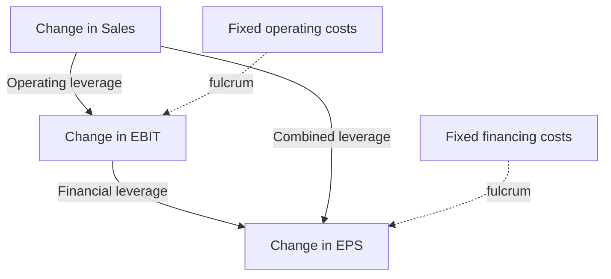
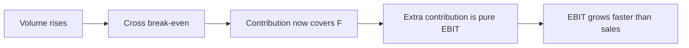
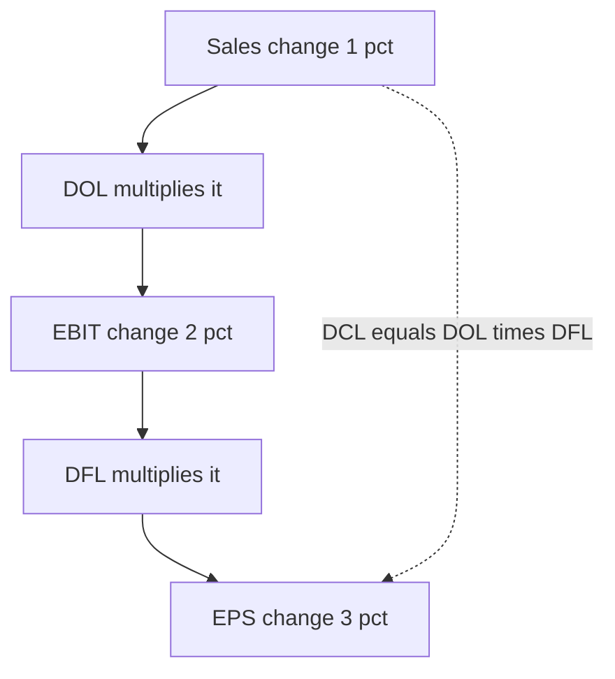
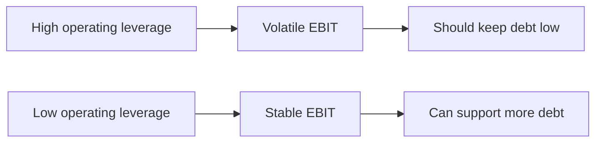

# Operating & Financial Leverage

## The Problem / Why this matters

Two companies can report the exact same revenue, the same operating profit, and even the same net income in a given year — and yet be radically different businesses to own. One might double its profit if sales rise 10%; the other might barely move. One might survive a 20% demand shock comfortably; the other might breach a loan covenant and hand the keys to its lenders. The difference is not in what they earned this year. It is in the *shape of their cost structure* and the *shape of their capital structure* — in other words, their **leverage**.

Leverage is the single most important lens for understanding how *risk* and *return* are manufactured inside a firm. It answers the question every analyst, investor, and lender secretly cares about: **"If the top line moves, what happens to the bottom line — and how much can go wrong before this company is in trouble?"**

You cannot escape leverage in finance interviews. It sits at the crossroads of four disciplines that recruit MBAs:

- **Equity research / fundamental investing** — "This is a high-operating-leverage business, so we expect margin expansion as it scales." That one sentence, said with numbers behind it, separates a candidate who *gets it* from one who memorized ratios.
- **Credit / leveraged finance** — the whole job is sizing how much fixed financial burden (debt) a business can carry given how volatile its operating cash flows already are. Operating leverage and financial leverage *interact*, and a credit analyst who ignores that will mis-price risk.
- **FP&A / corporate finance** — break-even analysis, contribution margin, and "what happens to EPS if volume drops 8%" are the daily bread of a planning analyst.
- **Investment banking** — pitching an LBO, defending a capital structure, or modeling an acquisition's accretion all rest on how leverage amplifies earnings.

Get leverage deeply — not as three formulas but as *one idea seen from three altitudes* — and a huge amount of finance suddenly clicks into place.

## Core Idea

**Leverage means using something with a fixed cost to magnify the effect of a change in activity.** That's it. Whenever a cost stays *fixed* while some driver above it *varies*, the fixed cost acts like a fulcrum: a small change in the driver produces a larger percentage change in what's left below.

There are two distinct fulcrums inside a firm, stacked on top of each other:

1. **Operating leverage** comes from **fixed operating costs** — rent, salaries, depreciation, R&D. It sits between **sales** and **operating profit (EBIT)**. A firm with lots of fixed operating costs sees EBIT swing hard when sales move.

2. **Financial leverage** comes from **fixed financial costs** — interest on debt, and preferred dividends. It sits between **EBIT** and **earnings per share (EPS)**. A firm with lots of debt sees EPS swing hard when EBIT moves.

Stack them and you get **combined (total) leverage**: the full amplification from a change in sales all the way down to EPS.

The key insight is that leverage is **symmetric and double-edged**. The same fulcrum that magnifies gains on the way up magnifies losses on the way down. Leverage does not create value out of thin air — it *redistributes and concentrates risk*. High leverage means "more torque, less shock absorption."



## Why it works this way — first principles

Let's build the whole edifice from a single, almost trivial fact and watch it cascade.

**The seed fact: variable costs scale with volume, fixed costs do not.**

Suppose you sell `Q` units at price `P`. Each unit costs `V` in variable cost (materials, per-unit labor, shipping — costs that exist *because* you made that unit). Above the units sits a block of fixed cost `F` that you pay whether you sell zero units or a million (rent, salaried staff, machinery depreciation).

Your operating profit is:

```
EBIT = P·Q − V·Q − F  =  (P − V)·Q − F
```

The quantity `(P − V)` is the **contribution margin per unit** — what each unit *contributes* toward covering fixed costs and then profit, after paying for itself. Call total contribution `C = (P − V)·Q`.

Now ask: if `Q` rises by a small amount, how does EBIT respond? Because `F` is a constant, it *disappears* when we take the change:

```
ΔEBIT = (P − V)·ΔQ
```

The `F` term contributes nothing to the *change* — it's dead weight that got covered once and then sits there. So **every incremental unit of contribution flows straight to EBIT**. That is the entire magic. When sales are only a little above break-even, EBIT is a *small* number sitting on top of a *large* fixed base; a given rupee of extra contribution is huge *relative to* that small EBIT. Percentage-wise, EBIT explodes. Hence:

**Percentage change in EBIT > percentage change in sales** — and the gap is bigger the more fixed cost you carry and the closer you are to break-even. That ratio *is* the degree of operating leverage.

**Now stack the second fulcrum.** Below EBIT sits interest `I`, a fixed financial cost. Earnings to shareholders (pre-tax) are `EBIT − I`. Take the change: `I` is fixed, so `Δ(EBIT − I) = ΔEBIT`. The *same rupee* change in EBIT now lands on a *smaller* base (`EBIT − I` is smaller than `EBIT`), so its percentage impact is amplified again. Interest is the operating-leverage story replayed one floor down, with EBIT as the "sales" and net earnings as the "profit."

This is why the two leverages **multiply** rather than add. Operating leverage amplifies sales→EBIT by some factor; financial leverage amplifies EBIT→EPS by another; the total sales→EPS amplification is the *product*. A firm that is 2× on operations and 2× on financing is 4× overall — a 5% sales bump becomes a 20% EPS swing.

**Why is it double-edged?** Nothing in the derivation assumed `ΔQ` was positive. Fixed costs don't care which direction volume moves; they must be paid regardless. So the magnification is perfectly symmetric. Fixed costs are a *promise you made* — to a landlord, to salaried employees, to a lender. Promises are rigid. Rigidity is exactly what turns a small revenue wobble into a large profit swing. **Leverage is the financial consequence of rigid commitments.**

That's the whole theory. Everything below is bookkeeping on top of this one idea.

## Full technical content

### 1. The cost structure: fixed vs variable

| Cost type | Behavior vs volume | Examples | Role in leverage |
|---|---|---|---|
| **Variable** | Rises proportionally with units | Raw materials, per-unit labor, sales commission, packaging, freight | Sets the contribution margin |
| **Fixed** | Constant over the relevant range | Rent, salaried staff, depreciation, insurance, R&D, head-office cost | The operating-leverage fulcrum |
| **Semi-variable / mixed** | Has a fixed base + variable slope | Electricity (base charge + usage), maintenance, some telecom | Split into fixed + variable parts (high-low method) |
| **Step (semi-fixed)** | Fixed within a band, jumps at capacity thresholds | Supervisors per shift, additional machine, extra warehouse | Fixed within the relevant range; new step resets break-even |

Two cautions that interviewers love to probe:

- **"Fixed" only within the *relevant range*.** Rent is fixed until you outgrow the building. Push volume far enough and step costs kick in. Leverage math assumes you stay inside the current range.
- **Fixed vs variable is about *behavior*, not the accounting label.** Depreciation is fixed even though it's a "cost of goods sold" line for a manufacturer. Sales commission is variable even though it's an "operating expense."

### 2. Contribution margin — the workhorse

**Contribution margin (CM)** is revenue minus *variable* cost. It is what's left to "contribute" to fixed costs and profit.

```
Contribution per unit      = P − V
Total contribution         = (P − V)·Q  = Sales − Variable costs
Contribution margin ratio  = (P − V) / P  =  Contribution / Sales   (also called P/V ratio)
```

The **P/V ratio** (profit-volume ratio) is contribution as a percentage of sales. It tells you how many paise of every rupee of sales survives variable costs to attack fixed costs. It is central to break-even and to CVP (cost-volume-profit) analysis.

Relationships worth memorizing:

```
EBIT               = Contribution − Fixed costs
Contribution ratio = 1 − Variable cost ratio
```

### 3. Break-even analysis

Break-even is the volume at which EBIT = 0 — total contribution exactly covers fixed cost.

```
Break-even (units)   = Fixed costs / (P − V)          = F / contribution per unit
Break-even (₹ sales) = Fixed costs / (P/V ratio)      = F / contribution margin ratio
```

To hit a **target profit** `T` (pre-tax), just treat target profit as additional fixed cost to cover:

```
Required units = (F + T) / (P − V)
Required sales = (F + T) / (P/V ratio)
```

If the target is *after-tax* profit `T_at` at tax rate `t`, gross it up first: `T = T_at / (1 − t)`.

**Margin of safety (MoS)** — how far current sales sit above break-even. It is the cushion before losses start:

```
MoS (₹)  = Actual sales − Break-even sales
MoS (%)  = (Actual sales − Break-even sales) / Actual sales
```

A crucial identity ties the margin of safety directly to operating leverage (derived below):

```
Degree of operating leverage = 1 / Margin of safety (%)
```

So a firm operating with a 25% margin of safety has a DOL of 4. This is one of the most elegant and interview-friendly results in all of cost accounting.



### 4. Degree of operating leverage (DOL)

**Definition (the one that always holds):** DOL is the ratio of the percentage change in EBIT to the percentage change in sales (or units):

```
DOL = %ΔEBIT / %ΔSales
```

**Point formula (algebraic, for a single-product CVP world):** Starting from `EBIT = (P−V)·Q − F`, we showed `ΔEBIT = (P−V)·ΔQ`. Divide the percentage change in EBIT by the percentage change in Q:

```
DOL = [ (P−V)·ΔQ / EBIT ] / [ ΔQ / Q ]
    = (P−V)·Q / EBIT
    = Contribution / EBIT
    = Contribution / (Contribution − Fixed costs)
```

**This is the formula to burn into memory:** `DOL = Contribution / EBIT`.

Read it as a lever: EBIT is contribution *net of* fixed cost, so the more fixed cost, the smaller the denominator relative to the numerator, and the larger the DOL. When fixed cost is zero, contribution = EBIT and DOL = 1 (no leverage — EBIT moves exactly with sales). As EBIT → 0 (at break-even), DOL → infinity.

**Deriving the margin-of-safety link:**
```
DOL = Contribution / EBIT = Contribution / (Contribution − F)
```
Since break-even contribution equals F, and MoS% = (Sales − BE Sales)/Sales = (Contribution − F)/Contribution = EBIT/Contribution, we get `DOL = 1 / MoS%`. 

**Key properties of DOL:**
- DOL is **not a constant** — it depends on the base volume. It is highest just above break-even and *falls toward 1* as volume climbs (EBIT grows, fixed cost becomes a smaller share).
- DOL applies symmetrically up and down (near break-even, small demand drops are brutal).
- High DOL ⇔ high fixed-cost intensity ⇔ high **business risk** (volatility of EBIT for a given volatility of sales).

### 5. Degree of financial leverage (DFL)

Financial leverage arises when the firm finances assets with **fixed-cost capital** — debt (interest) and preferred stock (preferred dividends). These fixed charges sit between EBIT and the earnings available to common shareholders.

**Definition:**
```
DFL = %ΔEPS / %ΔEBIT
```

**Point formula (debt only):** Pre-tax earnings to equity = `EBIT − I`. Since interest is fixed, `Δ(EBIT − I) = ΔEBIT`. EPS ∝ (EBIT − I)(1 − t)/shares, and the tax factor and share count cancel in the ratio:

```
DFL = EBIT / (EBIT − I)
```

**With preferred dividends** `D_p` (which are paid *after* tax, so gross them up):

```
DFL = EBIT / [ EBIT − I − D_p / (1 − t) ]
```

Read it as a lever: interest shrinks the denominator, so more debt ⇒ larger DFL ⇒ bigger EPS swings per unit of EBIT swing. With no debt, `I = 0`, DFL = 1 (EPS moves exactly with EBIT). As `EBIT → I` (interest eats all operating profit — the *financial* break-even), DFL → infinity.

**Financial break-even** is the EBIT level at which EPS = 0: `EBIT = I + D_p/(1−t)`. Below it, the levered firm posts losses to equity.

High DFL ⇔ high debt/fixed-charge intensity ⇔ high **financial risk** (volatility of EPS for a given volatility of EBIT), *plus* solvency risk — the fixed charges must be paid in cash or the firm defaults. Note DOL is about *variability*; DFL adds a *default* dimension operating leverage doesn't have.

### 6. Degree of combined leverage (DCL / DTL)

Stack the two. The combined (or *total*) leverage measures how a change in *sales* flows all the way to *EPS*:

```
DCL = %ΔEPS / %ΔSales = DOL × DFL
```

Because it's a chain rule (`%ΔEPS/%ΔSales = (%ΔEPS/%ΔEBIT)·(%ΔEBIT/%ΔSales)`), the two leverages **multiply**:

```
DCL = (Contribution / EBIT) × (EBIT / (EBIT − I))
    = Contribution / (EBIT − I)
    = Contribution / (Contribution − F − I)
```

The EBIT cancels beautifully, leaving `DCL = Contribution / (EBIT − I)` — contribution over pre-tax equity earnings. It says: near the *combined* break-even (where contribution barely covers both fixed operating and fixed financial costs), a tiny sales move whipsaws EPS.



### 7. The three leverages at a glance

| Leverage | Measures sensitivity of | To a change in | Source of fixed cost | Point formula | Risk it creates |
|---|---|---|---|---|---|
| **Operating (DOL)** | EBIT | Sales / units | Fixed operating costs (rent, deprec., salaries) | Contribution / EBIT | Business risk |
| **Financial (DFL)** | EPS | EBIT | Interest, preferred dividends | EBIT / (EBIT − I) | Financial + solvency risk |
| **Combined (DCL)** | EPS | Sales / units | Both | Contribution / (EBIT − I) = DOL × DFL | Total risk |

### 8. How leverage amplifies earnings *and* risk — the master framework

The clean way to think like an analyst: a firm chooses a **point on two dials**.

- **Operating dial** (DOL): trade higher fixed cost for lower variable cost per unit. Automating a factory, building your own logistics, investing in R&D-heavy products — all raise fixed cost, cut variable cost, raise contribution margin, and raise DOL. You're betting on volume.
- **Financial dial** (DFL): trade equity for debt. Debt is cheaper (interest is tax-deductible, lenders demand less than equity holders) but rigid. You're betting on stable-enough EBIT to service it.

The two dials interact. A business that is *already* high on operating leverage (airlines, semiconductors, steel, hotels — huge fixed assets, volatile demand) should be *conservative* on financial leverage, because its EBIT is already volatile and piling debt on top risks default in a downturn. Conversely, a business with *low* operating leverage and stable demand (regulated utilities, consumer staples, mature software with recurring revenue) can safely carry *lots* of debt — its EBIT is predictable, so fixed charges are safe. This trade-off is a core credit and corporate-finance principle: **total risk should be managed by balancing the two leverages.**



## Worked examples

### Example 1 — Operating leverage, break-even, margin of safety, and the DOL identity

**Setup.** *Aster Appliances* sells a single product.
- Price `P` = ₹500/unit
- Variable cost `V` = ₹300/unit
- Fixed operating costs `F` = ₹40,00,000
- Current volume `Q` = 30,000 units

**Step 1 — Contribution.**
- Contribution per unit = 500 − 300 = **₹200**
- P/V ratio = 200/500 = **40%**
- Total contribution = 200 × 30,000 = **₹60,00,000**

**Step 2 — EBIT.**
- EBIT = Contribution − F = 60,00,000 − 40,00,000 = **₹20,00,000**

**Step 3 — Break-even.**
- BE units = F / (P−V) = 40,00,000 / 200 = **20,000 units**
- BE sales = F / (P/V) = 40,00,000 / 0.40 = **₹1,00,00,000** (i.e., 20,000 × ₹500 ✓)

**Step 4 — Margin of safety.**
- Actual sales = 30,000 × 500 = ₹1,50,00,000
- MoS = 1,50,00,000 − 1,00,00,000 = ₹50,00,000, i.e. MoS% = 50/150 = **33.33%**

**Step 5 — DOL.**
- DOL = Contribution / EBIT = 60,00,000 / 20,00,000 = **3.0**
- Cross-check with MoS: DOL = 1 / MoS% = 1 / 0.3333 = **3.0** ✓

**Step 6 — Verify the amplification by brute force.** Push volume up 10% to 33,000 units.
- New contribution = 200 × 33,000 = ₹66,00,000
- New EBIT = 66,00,000 − 40,00,000 = ₹26,00,000
- %ΔEBIT = (26 − 20)/20 = **+30%** for a **+10%** sales change → amplification = 3.0 ✓✓

The DOL of 3 predicted it exactly: 10% × 3 = 30%. Note the symmetry — a 10% *drop* to 27,000 units gives EBIT = 200×27,000 − 40,00,000 = ₹14,00,000, a **−30%** swing. Same torque, opposite direction.

**Interview soundbite:** *"At 30,000 units Aster runs a DOL of 3, so it's amplifying every sales move threefold at EBIT. Its 33% margin of safety is the mirror image — it can lose a third of sales before it hits break-even."*

### Example 2 — Financial leverage, combined leverage, and EPS amplification

**Setup.** Same *Aster* operating profile (EBIT = ₹20,00,000, contribution = ₹60,00,000). Now the financing: Aster has ₹1,00,00,000 of 12% debt and 4,00,000 shares of common equity. Tax rate `t` = 30%. No preferred stock.

**Step 1 — Interest.**
- I = 12% × 1,00,00,000 = **₹12,00,000**

**Step 2 — EPS today.**
- EBT = EBIT − I = 20,00,000 − 12,00,000 = ₹8,00,000
- Net income = EBT × (1−t) = 8,00,000 × 0.70 = ₹5,60,000
- EPS = 5,60,000 / 4,00,000 = **₹1.40**

**Step 3 — DFL.**
- DFL = EBIT / (EBIT − I) = 20,00,000 / 8,00,000 = **2.5**

**Step 4 — DCL.**
- DCL = DOL × DFL = 3.0 × 2.5 = **7.5**
- Cross-check: DCL = Contribution / (EBIT − I) = 60,00,000 / 8,00,000 = **7.5** ✓

**Step 5 — Verify with a 10% sales increase (33,000 units, from Ex. 1 new EBIT = ₹26,00,000).**
- New EBT = 26,00,000 − 12,00,000 = ₹14,00,000
- New NI = 14,00,000 × 0.70 = ₹9,80,000
- New EPS = 9,80,000 / 4,00,000 = ₹2.45
- %ΔEPS = (2.45 − 1.40)/1.40 = **+75%**

A **+10%** sales move produced a **+75%** EPS move → combined amplification = 7.5, exactly DCL ✓✓. And note the chain: +10% sales → +30% EBIT (DOL 3) → EPS: %ΔEPS/%ΔEBIT = 75/30 = 2.5 = DFL ✓.

**The double-edge, quantified.** Now run a **10% sales *decline*** to 27,000 units (EBIT = ₹14,00,000 from Ex. 1):
- EBT = 14,00,000 − 12,00,000 = ₹2,00,000; NI = ₹1,40,000; EPS = ₹0.35
- %ΔEPS = (0.35 − 1.40)/1.40 = **−75%**

A mere 10% sales dip wipes out three-quarters of EPS. That is what a DCL of 7.5 *feels* like, and it's exactly why a highly leveraged firm is fragile.

**Interview soundbite:** *"Aster stacks a 2.5 DFL on top of a 3.0 DOL for a combined leverage of 7.5 — meaning EPS is seven-and-a-half times as volatile as sales. That's a lot of torque for a business already carrying meaningful fixed costs; I'd want very stable demand before endorsing that capital structure."*

### Example 3 — Capital-structure choice: the EBIT-EPS indifference point

This is the classic IB/corporate-finance decision: *should we finance an expansion with debt or equity?* Leverage analysis answers it.

**Setup.** *Borealis Foods* needs to raise **₹5,00,00,000** for expansion. Current EBIT is expected to be **₹1,20,00,000** and is fairly stable. Tax rate 30%. Existing capital: 10,00,000 shares, no debt. Two financing plans:

- **Plan E (all equity):** issue 5,00,000 new shares at ₹100 → 15,00,000 total shares, no interest.
- **Plan D (all debt):** borrow ₹5,00,00,000 at 10% → interest = ₹50,00,000, shares stay at 10,00,000.

**EPS under each plan at expected EBIT = ₹1,20,00,000:**

*Plan E:* NI = 1,20,00,000 × 0.70 = ₹84,00,000; EPS = 84,00,000/15,00,000 = **₹5.60**
*Plan D:* EBT = 1,20,00,000 − 50,00,000 = ₹70,00,000; NI = ₹49,00,000; EPS = 49,00,000/10,00,000 = **₹4.90**

At the *expected* EBIT, equity actually gives higher EPS. But the point of leverage is *how EPS behaves as EBIT changes*. Find the **indifference EBIT** where both plans give the same EPS:

```
(EBIT)(1−t)/N_E  =  (EBIT − I)(1−t)/N_D
```

The (1−t) cancels:
```
EBIT / 15,00,000 = (EBIT − 50,00,000) / 10,00,000
10·EBIT = 15·(EBIT − 50,00,000)
10·EBIT = 15·EBIT − 7,50,00,000
5·EBIT = 7,50,00,000
EBIT* = ₹1,50,00,000
```

**Interpretation.** At EBIT = ₹1,50,00,000, both plans yield the same EPS. Check: Plan E → 1,50,00,000×0.7/15,00,000 = ₹7.00; Plan D → (1,50,00,000−50,00,000)×0.7/10,00,000 = 100,00,000×0.7/10,00,000 = ₹7.00 ✓.

- **Above** ₹1,50,00,000 EBIT → **debt wins** (fewer shares split a bigger post-interest pie; leverage pays off).
- **Below** ₹1,50,00,000 EBIT → **equity wins** (interest burden hurts more than share dilution).

Since Borealis *expects* only ₹1,20,00,000 — **below** the crossover — and the analyst should also weigh downside risk, the equity plan is safer *and* higher-EPS at the expected level. Debt only becomes attractive if management is confident EBIT will run comfortably above ₹1.5 crore.

**DFL sanity check under Plan D at expected EBIT:** DFL = 120/(120−50) = 120/70 = **1.71**. A 20% EBIT drop to ₹96,00,000 would cut Plan-D EPS by ~34% (to ₹3.22) versus only 20% under all-equity — the risk you take on for the upside.

**Interview soundbite:** *"The EBIT-EPS indifference point is ₹1.5 crore. Because Borealis only expects ₹1.2 crore and its EBIT isn't bulletproof, I'd lean equity — you don't want to sit below the crossover carrying fixed interest, since that's exactly where leverage works against you."*

## How it is tested in interviews

Interviewers rarely ask "define operating leverage." They ask questions that reveal whether you *understand* it. Here are the real ones with model answers.

**Q1. "What is operating leverage, and why do two firms with the same revenue have different operating leverage?"**
> *Model answer:* "Operating leverage is the sensitivity of EBIT to a change in sales, and it comes from fixed operating costs. Two firms with the same revenue differ because their *cost structures* differ — one might have high fixed costs and low variable costs (say a software firm or a steel mill), giving it a high contribution margin and a high DOL, so its EBIT swings hard with volume. The other might be labor- or materials-heavy with mostly variable costs, so EBIT tracks sales closely. Same top line, totally different risk profile below it."

**Q2. "Give me a high-operating-leverage business and a low one, and tell me why it matters for investing."**
> *Crisp line:* "High: airlines, semiconductors, hotels, software — big fixed asset or fixed cost base, so profits explode past break-even and collapse below it. Low: a distributor or a staffing firm — costs flex with revenue. It matters because a high-DOL business is a *bet on volume and the cycle*: you want to own it going into an upturn for the margin expansion, and avoid it going into a downturn because the same operating leverage crushes margins."

**Q3. "A company has DOL of 2 and DFL of 3. Sales rise 5%. What happens to EPS?"**
> *Model answer:* "Combined leverage is 2 × 3 = 6, so EPS moves 6 × 5% = **30%**. And it's symmetric — a 5% sales drop takes 30% off EPS. That combined leverage of 6 tells me EPS is six times as volatile as the top line, which is aggressive."

**Q4. "Should a company with high operating leverage take on a lot of debt?"**
> *Model answer:* "Generally no. Operating leverage already makes its EBIT volatile, and debt adds fixed charges that must be paid out of that volatile EBIT. Stacking high financial leverage on high operating leverage gives a huge combined leverage and real default risk in a downturn — a bad demand year could push EBIT below interest. The principle is to *balance* the two: capital-intensive, cyclical firms (airlines, semis) should stay conservatively financed, while stable, low-operating-leverage firms (utilities, staples) can safely carry more debt."

**Q5. "Walk me through break-even and contribution margin."**
> *Crisp line:* "Contribution margin is price minus variable cost — what each unit contributes to fixed costs and profit. Break-even units = fixed costs ÷ contribution per unit; in rupees it's fixed costs ÷ the contribution-margin ratio. Below break-even you're eating fixed costs; above it, every extra unit's full contribution drops to EBIT, which is exactly why operating leverage kicks in near break-even."

**Q6. "How are DOL and margin of safety related?"**
> *Model answer:* "They're reciprocals: DOL = 1 ÷ margin-of-safety percentage. A firm with a 20% margin of safety has a DOL of 5. It's intuitive — a thin safety cushion means you're close to break-even, where EBIT is small and every sales move is magnified. It's a great two-second sanity check in an interview: they give you margin of safety, you hand back DOL instantly."

**Q7. "Debt vs equity to fund an acquisition — how do you decide with EBIT-EPS analysis?"**
> *Model answer:* "I'd find the EBIT-EPS indifference point — the EBIT where both financing plans give identical EPS. Above it, debt is accretive because fewer shares share a bigger after-interest profit; below it, equity is better. Then I compare it to the firm's *expected* EBIT and, crucially, its EBIT *volatility*. If expected EBIT sits comfortably above the crossover and cash flows are stable, debt creates value; if it's near or below the crossover or EBIT is shaky, I'd favor equity to avoid the downside where leverage bites."

**Q8. "What's the difference between business risk and financial risk?"**
> *Crisp line:* "Business risk is the volatility of EBIT — driven by demand, cost structure, and operating leverage; it exists even with zero debt. Financial risk is the *additional* volatility of EPS (and the default risk) that debt piles on via financial leverage. Total shareholder risk = business risk amplified by financial leverage. A firm chooses its financial risk; its business risk is largely dictated by its industry and cost structure."

## Traps & common mistakes

- **Thinking DOL is a fixed number for a company.** It isn't. DOL changes with the operating point — highest near break-even, falling toward 1 as volume grows. Always ask "DOL *at what sales level*?" Quoting a single DOL without a base volume is a red flag.
- **Adding the leverages instead of multiplying.** DCL = DOL × DFL, not DOL + DFL. It's a chain rule. Adding a DOL of 3 and DFL of 2.5 to get 5.5 (instead of 7.5) is a classic slip that instantly signals shallow understanding.
- **Forgetting leverage is symmetric.** Candidates love the "amplifies profits" upside and forget the identical downside. The whole *risk* story lives in the downside. Always mention both directions.
- **Confusing high margin with high operating leverage.** A high *contribution* margin drives high operating leverage, but a high *net* margin does not necessarily — a debt-free, low-fixed-cost business can be very profitable with *low* DOL. Keep contribution margin (variable-cost driven) separate from profitability.
- **Using EBIT-based DOL when there are non-operating items.** DOL is a *sales → EBIT* relationship. Make sure EBIT is *operating* profit; stray non-operating income corrupts the ratio.
- **Ignoring preferred dividends in DFL, or forgetting to gross them up.** Preferred dividends are fixed financial charges too, but they're paid *after* tax, so they enter the DFL formula as `D_p/(1−t)`. Interest is pre-tax and enters directly.
- **Treating debt as free because "interest is tax-deductible."** The tax shield lowers the *cost* of debt, but it does nothing to soften the *rigidity*. Interest must be paid in cash regardless of profits; that rigidity is the source of financial risk and default.
- **Assuming the relevant range is infinite.** Break-even and DOL math assume fixed costs stay fixed. Big volume changes trigger step costs (new plant, more supervisors) that reset the whole calculation.
- **Believing leverage creates value.** Leverage redistributes and concentrates risk and (via the debt tax shield) can add modest value, but it does not manufacture returns from nothing. A great EBIT year with debt looks brilliant; a bad one looks catastrophic. The *expected* value added by pure leverage is small; the change in *risk* is large.
- **Mixing up units and rupees in break-even.** BE units uses contribution *per unit*; BE sales uses the *ratio*. Don't divide fixed cost by the ratio and call it units.

## First-principles recap

- **Leverage = a fixed cost acting as a fulcrum.** Because fixed costs don't change when the driver changes, they vanish from the *change* equation, so whatever is below them swings by a larger percentage than the driver above. That single mechanism explains all three leverages.
- **Two fulcrums, stacked.** Fixed *operating* costs sit between sales and EBIT (operating leverage). Fixed *financial* costs sit between EBIT and EPS (financial leverage). Combined leverage is the full sales-to-EPS ride.
- **They multiply, not add**, because it's a chain rule: sales → EBIT → EPS. DCL = DOL × DFL = Contribution / (EBIT − I).
- **Leverage is perfectly symmetric** — the derivation never assumed the driver moved up. The upside torque equals the downside torque. That symmetry *is* the risk.
- **DOL = Contribution / EBIT** and **DFL = EBIT / (EBIT − I)** — memorize these two, and everything else (break-even, margin of safety, DCL) falls out. DOL = 1/MoS% is the elegant shortcut.
- **Operating leverage creates business risk; financial leverage creates financial (and default) risk.** Total risk is business risk amplified by financial leverage — and a well-run firm *balances* the two dials.
- **Leverage concentrates risk; it doesn't create returns.** The right amount depends on how stable EBIT already is.

## Quick-reference

| Concept | Formula |
|---|---|
| Contribution per unit | `P − V` |
| Contribution margin / P/V ratio | `(P − V) / P` = Contribution / Sales |
| EBIT | `Contribution − Fixed costs` |
| Break-even (units) | `F / (P − V)` |
| Break-even (sales ₹) | `F / (P/V ratio)` |
| Target-profit units | `(F + T) / (P − V)` |
| Margin of safety (%) | `(Sales − BE Sales) / Sales` |
| **DOL** | `%ΔEBIT / %ΔSales` = `Contribution / EBIT` = `1 / MoS%` |
| **DFL** | `%ΔEPS / %ΔEBIT` = `EBIT / (EBIT − I)`  (add `− D_p/(1−t)` for preferred) |
| **DCL** | `%ΔEPS / %ΔSales` = `DOL × DFL` = `Contribution / (EBIT − I)` |
| Financial break-even EBIT | `I + D_p/(1−t)` |
| EBIT-EPS indifference | `EBIT(1−t)/N₁ = (EBIT − I)(1−t)/N₂` |
| No leverage benchmark | DOL, DFL, DCL all = 1 |

**The one-liner to remember:** *fixed costs are promises, promises are rigid, and rigidity turns small revenue wobbles into large profit swings — up and down alike.*
