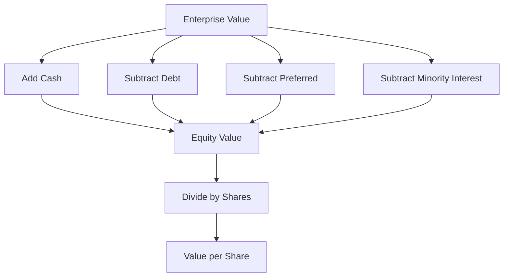
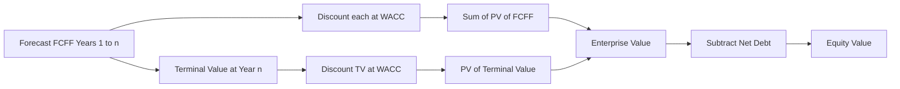
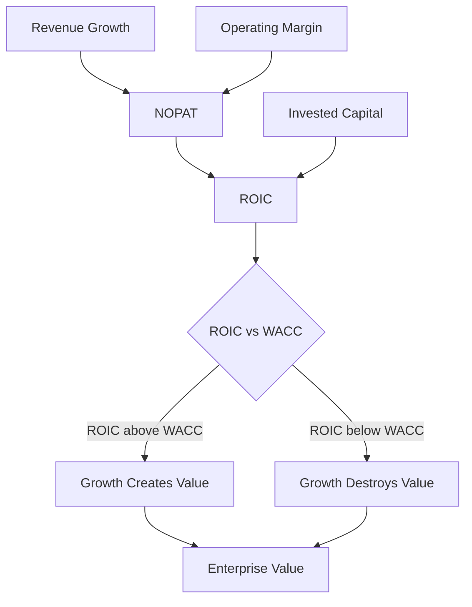
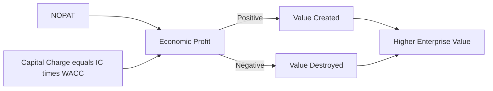

# Corporate Valuation Basics

## The Problem / Why this matters

Every decision in corporate finance eventually collapses into one question: **what is this worth?** Should we buy this company? Should we issue equity at today's price or is the stock cheap? Should the board accept the takeover offer on the table? Is the credit safe enough to lend against? Should we invest in this division or sell it? Behind each of these sits a *valuation*.

Valuation is also the single most heavily tested area in finance interviews. Equity research analysts live in DCF and multiples. IB analysts build LBO and DCF models and pitch "the company is worth $X per share." Credit analysts value the *enterprise* to see how much cushion sits above the debt. FP&A professionals run value-based management — deciding which projects, products, and business units actually *create* value versus merely growing revenue.

And yet most candidates get valuation subtly wrong in ways that a good interviewer spots in ten seconds:

- They confuse **enterprise value** with **equity value** and add cash when they should subtract it.
- They discount **free cash flow to the firm (FCFF)** at the **cost of equity** instead of WACC.
- They compute a beautiful DCF where **80% of the value sits in the terminal value** and never notice that the terminal growth rate they picked implies the company eventually becomes larger than the world economy.
- They quote an EV/EBITDA multiple but pair it with **net income** in the numerator's logic, mixing an enterprise metric with an equity metric.
- They say "growth creates value" without realizing that **growth only creates value when ROIC exceeds the cost of capital** — otherwise growth *destroys* it.

This chapter builds valuation from first principles so none of those mistakes are possible for you. It is deliberately the *bridge* chapter: it gives you a rigorous, self-contained foundation — EV vs equity value, an honest introduction to DCF (FCFF/FCFE, WACC, terminal value), multiples, value drivers, and value-based management — while pointing forward to the dedicated Valuation book for the full machinery.

## Core Idea

Three ideas, and everything else is detail.

**1. A business is worth the present value of the cash it will generate for its investors.** Not its accounting profit, not its book value, not its revenue — the *cash* that can be pulled out and handed to the people who financed it, discounted back at a rate that reflects the risk of those cash flows. That is the intrinsic-value view, and DCF is its formalization.

**2. There are two "sizes" of the pie, and you must never confuse them.** **Enterprise value** is the value of the *whole operating business*, financed by everyone — debt holders and equity holders together. **Equity value** is the slice that belongs to shareholders alone, *after* the lenders have been paid. The bridge between them is net debt (and a few other claims). Get the bridge right and half of valuation is already correct.

**3. Value is created by earning more on invested capital than that capital costs.** Growth, margins, capital efficiency, and reinvestment are the *drivers*, but they only translate into value through one master relationship: **return on invested capital (ROIC) versus the weighted average cost of capital (WACC)**. When ROIC > WACC, growth adds value; when ROIC < WACC, growth burns it; when ROIC = WACC, growth is value-neutral. Value-based management is simply running a company by that rule.

## Why it works this way — first principles

**Why cash, not earnings?** Because you cannot spend earnings. Accounting earnings include non-cash items (depreciation), ignore the cash locked up in receivables and inventory (working capital), and ignore the cash spent maintaining and growing the asset base (capex). Two companies with identical net income can have wildly different cash generation. Investors ultimately receive *cash* — dividends, buybacks, interest, debt repayment — so value must be built on cash.

**Why discount?** A dollar next year is worth less than a dollar today for two reasons: you could have invested today's dollar and earned a return (time value), and next year's dollar is uncertain (risk). Discounting at a risk-adjusted rate bundles both. The riskier and more distant the cash flow, the more it is shrunk.

**Why separate enterprise value from equity value?** Because operations and financing are different questions. The operating business throws off cash flows that are, to a first approximation, *independent of how you financed it* (this is the Modigliani–Miller intuition from the capital-structure chapters). Enterprise value captures the operating engine. Then financing decides how that value is *split* between lenders and owners. Separating the two lets you value the engine once and then hand out the pieces — and it lets you compare two companies with very different debt loads on an apples-to-apples basis.

**Why does ROIC vs WACC decide whether growth creates value?** Think of the firm as a machine that takes in capital and produces returns. If you feed it $100 of new capital and it earns 15% while the capital costs 10%, you have manufactured a 5% spread on $100 = $5/year of pure value creation, capitalized into a lump sum. Feed the same machine when it earns only 8% on 10% capital and each new dollar *loses* value — you would be better off returning the cash to investors. Growth is a *multiplier*: it multiplies whatever spread the business earns. A positive spread times more growth = more value. A negative spread times more growth = more destruction. This single insight separates people who understand valuation from people who just build models.

## Full technical content

### 1. Enterprise value vs equity value — the bridge

**Enterprise value (EV)** is the value of the core operating business, available to *all* providers of capital. **Equity value** (also "market capitalization" when using market prices) is what belongs to common shareholders.

The bridge, written from equity to enterprise:

```
Enterprise Value = Equity Value
                 + Total Debt
                 + Preferred Stock
                 + Minority (Non-controlling) Interest
                 − Cash and Cash Equivalents
                 (± other claims: pensions, operating leases, etc.)
```

Rearranged the other way (enterprise to equity), which is how a DCF flows:

```
Equity Value = Enterprise Value
             − Total Debt
             − Preferred Stock
             − Minority Interest
             + Cash and Cash Equivalents
             (∓ other claims)
```

The compact version most people memorize:

```
EV = Equity Value + Net Debt        (Net Debt = Total Debt − Cash)
```

**Why each adjustment?**

| Item | Add or subtract to get EV from equity | Reason |
|---|---|---|
| Total debt | **Add** | Lenders are also owners of the enterprise; their claim is part of the whole. |
| Preferred stock | **Add** | A senior claim ahead of common equity; part of the capital that funds operations. |
| Minority interest | **Add** | Consolidated financials include 100% of a subsidiary's EBITDA/assets but the parent owns <100%; adding MI puts the *whole* enterprise on top to match the *whole* EBITDA below. |
| Cash | **Subtract** | Cash is a non-operating asset; you could use it to pay down the purchase price. Buying the firm, you "get the cash back." |

**Why cash is subtracted — the intuition that sticks:** Imagine buying a company for $100 of equity value that happens to hold $30 of cash in the bank. The moment you own it, you can take that $30 out. Your *net* cost of owning the operating business is effectively $70. Enterprise value strips out the cash so it reflects the price of the *operations only*.

**The pairing rule (this is what interviews test):** every valuation metric is either an *enterprise* metric or an *equity* metric, and numerator must match denominator.

| Enterprise-level (paired with EV) | Equity-level (paired with Equity Value / Price) |
|---|---|
| Revenue (available to all) | Net income |
| EBITDA | EPS |
| EBIT | Book value of equity |
| Unlevered free cash flow (FCFF) | Levered free cash flow (FCFE) |
| NOPAT | Dividends |

Metrics *above* the interest line (revenue, EBITDA, EBIT, FCFF) are shared by debt and equity → **enterprise**. Metrics *below* interest (net income, EPS, FCFE, dividends) belong to equity only → **equity**. If you ever pair EV with net income or Price with EBITDA, you have made a category error.



### 2. Discounted cash flow — the intrinsic method

DCF says value = present value of expected future free cash flows. Two clean flavors, matching the two "sizes":

**FCFF (free cash flow to the firm) → discount at WACC → get Enterprise Value.**
FCFF is the cash the operating business produces *before* any financing choices — available to both lenders and owners.

```
FCFF = EBIT × (1 − tax rate)          [this is NOPAT]
     + Depreciation & Amortization
     − Capital Expenditures
     − Increase in Net Working Capital
```

Equivalently, working down from net income:

```
FCFF = Net Income
     + Interest Expense × (1 − tax rate)
     + D&A
     − Capex
     − ΔNWC
```

**FCFE (free cash flow to equity) → discount at cost of equity → get Equity Value directly.**
FCFE is what's left for shareholders *after* lenders are serviced.

```
FCFE = Net Income
     + D&A
     − Capex
     − ΔNWC
     + Net Borrowing            (new debt raised − debt repaid)
```

Or from FCFF:

```
FCFE = FCFF − Interest × (1 − tax) + Net Borrowing
```

**The consistency rule (a favorite trap):**

| Cash flow | Discount rate | Output |
|---|---|---|
| FCFF (unlevered) | WACC | Enterprise value |
| FCFE (levered) | Cost of equity (Kₑ) | Equity value |

Never cross the streams. Discounting FCFF at the cost of equity, or FCFE at WACC, is one of the most common and most instantly-disqualifying errors in an interview. FCFF is paid to everyone, so discount at everyone's blended rate (WACC). FCFE is paid to equity only, so discount at equity's rate (Kₑ).

**WACC — the blended discount rate:**

```
WACC = (E/V) × Kₑ + (D/V) × Kd × (1 − tax rate)
```

where E = market value of equity, D = market value of debt, V = E + D, Kₑ = cost of equity (usually from CAPM: Rf + β × ERP), Kd = pre-tax cost of debt, and the (1 − tax) term captures the **tax shield** on interest (interest is tax-deductible, so debt's effective cost is lower). WACC is derived in full in the cost-of-capital chapters; here we just use it.

**The two-stage DCF structure.** In practice you can't forecast cash flows forever, so you split time into:

1. **Explicit forecast period** (typically 5–10 years) where you model FCFF year by year.
2. **Terminal value (TV)** — a single number capturing all cash flows *beyond* the forecast, placed at the end of the explicit period and discounted back.

```
Enterprise Value = Σ [ FCFFₜ / (1 + WACC)ᵗ ]  for t = 1..n
                 + TVₙ / (1 + WACC)ⁿ
```

### 3. Terminal value — the two methods

Terminal value captures everything after year *n*, and it usually dominates the DCF (often 60–80% of total value), so it deserves respect.

**Method 1 — Gordon Growth (perpetuity growth):**

```
TVₙ = FCFFₙ₊₁ / (WACC − g)
    = FCFFₙ × (1 + g) / (WACC − g)
```

where g is the perpetual growth rate of cash flows *forever*. This assumes the business settles into steady, constant growth.

**Method 2 — Exit multiple:**

```
TVₙ = EBITDAₙ × (chosen EV/EBITDA multiple)
```

You apply a "mature-company" multiple to the final-year metric, as if you sold the business at year *n*.

**Sanity checks that interviewers love:**

- **g must be below long-run nominal GDP growth** (roughly 2–4% in developed markets). If g > GDP forever, the company eventually becomes larger than the entire economy — impossible. A g of 5–6% is a red flag.
- **g must be below WACC**, or the formula returns a negative or infinite number (mathematically absurd).
- **Cross-check the two methods:** back out the *implied* perpetuity g from your exit multiple, and back out the *implied* exit multiple from your Gordon growth. If the exit multiple implies g = 7%, something is wrong.
- **The implied ROIC in perpetuity** should be reasonable — the reinvestment needed to sustain g should imply a return that isn't fantastical (more on this under value drivers).



### 4. Mid-year convention (a detail that shows polish)

The plain formula assumes all cash arrives on the last day of each year. In reality cash flows roughly evenly through the year, so on average it arrives mid-year. The **mid-year convention** discounts each year's flow using exponents 0.5, 1.5, 2.5, … instead of 1, 2, 3. This pulls cash forward half a year and *raises* the valuation modestly (typically a few percent). Mentioning it unprompted signals you've built real models.

### 5. Multiples — relative valuation

Multiples value a company by comparison: "similar companies trade at 10× EBITDA, so this one should too." A multiple is a *shorthand for a DCF* — it silently bundles growth, risk, and returns into a single ratio.

**The two families, again governed by the pairing rule:**

| Enterprise multiples | Equity multiples |
|---|---|
| EV / Revenue | P / E (Price ÷ EPS) |
| EV / EBITDA | P / B (Price ÷ Book value) |
| EV / EBIT | P / Sales (equity, occasionally) |
| EV / FCFF | PEG (P/E ÷ growth) |

**Why EV/EBITDA is the workhorse:** EBITDA is *before* interest (so capital-structure-neutral — you can compare a debt-heavy and a debt-light firm), *before* taxes (jurisdiction-neutral), and *before* D&A (so different depreciation policies and asset ages don't distort it). Because the numerator (EV) and denominator (EBITDA) are both *enterprise*-level, they match. This makes EV/EBITDA the default for comparing operating businesses.

**Why P/E is popular but treacherous:** it's intuitive (price per dollar of earnings) and needs no bridge. But EPS is *after* interest, so P/E is distorted by leverage — a company can juice EPS with buybacks or cheap debt without creating operating value. P/E is meaningless for loss-making firms and heavily affected by one-off items.

**How to actually use multiples:**

1. Pick genuinely comparable companies (same industry, size, growth, margins, geography).
2. Compute each comp's multiple; take the median (robust to outliers) — mean is skewed by extremes.
3. Apply the median multiple to your target's metric.
4. If it's an EV multiple, you get EV → bridge down to equity → divide by shares.

**The link between a multiple and fundamentals.** For P/E, from the Gordon dividend model you can show:

```
P/E = payout ratio × (1 + g) / (Kₑ − g)
```

So a company deserves a high P/E when it has high growth (g), low risk (low Kₑ), or high payout for a given growth (i.e., high ROIC needing little reinvestment). This is why a multiple is never "just a number" — it encodes fundamentals. Interviewers ask "why does Company A trade at 25× and Company B at 12×?" and the answer is always some mix of *growth, risk, and returns on capital.*

### 6. DCF vs multiples — when to use which

| Dimension | DCF | Multiples |
|---|---|---|
| Basis | Intrinsic (own cash flows) | Relative (peers) |
| Strength | Rigorous, driver-transparent, no need for comparables | Fast, market-grounded, reflects current sentiment |
| Weakness | Garbage-in-garbage-out; sensitive to assumptions; TV-heavy | Needs true comps; imports the market's mispricing; hides drivers |
| Best when | Stable, forecastable cash flows; unusual capital structure | Many close comparables; quick triangulation; sentiment matters |

Good practice is to use **both** and triangulate: a DCF for intrinsic value, comps for a market reality check. When they disagree wildly, the disagreement itself is the insight.

### 7. Value drivers — what actually moves value

Strip a DCF down to its economic engine and only a handful of levers matter. A clean way to see it: for a firm in steady state,

```
Value = NOPAT × (1 − g/ROIC) / (WACC − g)
```

This "value-driver formula" (from McKinsey's *Valuation*) is worth understanding deeply because it packs every driver into one line:

- **NOPAT** = EBIT × (1 − tax) — the after-tax operating profit (a *margin × revenue* story).
- **g** = growth rate of NOPAT.
- **ROIC** = NOPAT ÷ invested capital — how efficiently capital is turned into profit.
- **WACC** = the cost of that capital.
- **The reinvestment rate** = g / ROIC — the fraction of NOPAT you must plow back to grow at g.

**Read the formula:** the term `(1 − g/ROIC)` is the *free-cash-flow conversion*. To grow faster (higher g) you must reinvest more (g/ROIC rises), leaving less free cash *today*. Whether that trade-off is worth it depends entirely on **ROIC vs WACC**.

**The master relationship:**

| Relationship | Effect of growth |
|---|---|
| ROIC > WACC | Growth **creates** value (positive spread multiplied) |
| ROIC = WACC | Growth is **value-neutral** (you're just recycling capital at cost) |
| ROIC < WACC | Growth **destroys** value (you'd be worth more shrinking) |

**The four drivers and how each moves value:**

| Driver | What it is | How it creates value |
|---|---|---|
| **Growth (g)** | Rate of revenue/NOPAT expansion | Multiplies the ROIC–WACC spread — *only* valuable when spread is positive |
| **Margins** | NOPAT/EBIT as % of revenue | Directly lifts NOPAT and, holding capital fixed, lifts ROIC |
| **ROIC / capital efficiency** | NOPAT ÷ invested capital | The spread itself; higher ROIC means each growth dollar creates more value and needs less reinvestment |
| **Reinvestment / WACC** | g/ROIC and the discount rate | Lower reinvestment need (high ROIC) and lower risk (low WACC) both raise value |

**The punchline that separates candidates:** a low-growth business with ROIC of 30% can be worth far more than a high-growth business with ROIC of 6% against a 9% WACC. Growth is not free; it is only good when it's *profitable* growth.



### 8. Value-based management (VBM)

VBM is running a company so that every major decision is judged by whether it creates value — measured as returns above the cost of capital, not by accounting earnings or revenue.

**Economic profit / EVA (economic value added):**

```
Economic Profit = Invested Capital × (ROIC − WACC)
                = NOPAT − (Invested Capital × WACC)
```

This is the *cleanest single number* in value-based management: profit *after* charging for the capital used. Accounting profit charges you for debt (interest) but gives equity a free pass; economic profit charges for *all* capital. A business can post a rising net income while destroying value if it earns less than WACC on the capital it's tying up.

**The connection to valuation:** enterprise value = invested capital + present value of all future economic profits. A company is worth *more than* its invested capital only if it can earn *above* WACC — the extra is the "market value added." This reframes the whole game: the job of management isn't to grow, it's to grow the *spread × capital*.

**What VBM changes in practice:**

- Capital budgeting: fund projects with positive NPV (which is just economic profit discounted).
- Performance metrics: reward economic profit / ROIC, not just EPS or revenue — because EPS can be gamed with leverage and buybacks.
- Portfolio decisions: exit or fix businesses earning below WACC even if they're profitable on paper.
- Incentives: tie bonuses to sustained ROIC–WACC spread so managers don't chase empire-building growth.



## Worked examples

### Worked Example 1 — EV/Equity bridge both directions

**Given:** A company has 100 million shares trading at $40. It has $1,200m of total debt, $200m of preferred stock, $150m of minority interest, and $350m of cash. It reported EBITDA of $600m and net income of $180m.

**Part A — Equity value and enterprise value.**

```
Equity value = 100m shares × $40 = $4,000m
Net debt     = 1,200 − 350 = $850m
EV = Equity + Debt + Preferred + Minority − Cash
   = 4,000 + 1,200 + 200 + 150 − 350
   = $5,200m
```

**Part B — Multiples, correctly paired.**

```
EV / EBITDA = 5,200 / 600 = 8.7×   (enterprise ÷ enterprise ✓)
P / E       = 4,000 / 180 = 22.2×  (equity ÷ equity ✓)
```

**Part C — reverse the bridge.** Suppose a DCF gives EV = $5,200m. Recover the price per share:

```
Equity value = EV − Debt − Preferred − Minority + Cash
             = 5,200 − 1,200 − 200 − 150 + 350 = $4,000m
Price/share  = 4,000 / 100 = $40.00 ✓
```

Consistent both ways — the bridge is symmetric.

### Worked Example 2 — Full two-stage FCFF DCF

**Given:** A company expects EBIT of $500m next year, growing 8% per year for 5 years. Tax rate 25%. D&A runs $120m/yr (assume flat for simplicity), capex $150m/yr, and increase in net working capital $40m/yr — take these three as flat for the illustration. WACC = 10%. Terminal growth g = 3%. Net debt = $900m. Shares outstanding = 200m.

**Step 1 — Build FCFF each year.** FCFF = EBIT×(1−t) + D&A − Capex − ΔNWC. With D&A − Capex − ΔNWC = 120 − 150 − 40 = **−70** each year, FCFF = EBIT×0.75 − 70.

| Year | EBIT | NOPAT = EBIT×0.75 | − 70 = FCFF |
|---|---|---|---|
| 1 | 500.0 | 375.0 | 305.0 |
| 2 | 540.0 | 405.0 | 335.0 |
| 3 | 583.2 | 437.4 | 367.4 |
| 4 | 629.9 | 472.4 | 402.4 |
| 5 | 680.2 | 510.2 | 440.2 |

(EBIT grows 8%: 500 → 540 → 583.2 → 629.9 → 680.2.)

**Step 2 — Discount each FCFF at 10%.**

| Year | FCFF | Discount factor 1/1.1ᵗ | PV |
|---|---|---|---|
| 1 | 305.0 | 0.9091 | 277.3 |
| 2 | 335.0 | 0.8264 | 276.9 |
| 3 | 367.4 | 0.7513 | 276.1 |
| 4 | 402.4 | 0.6830 | 274.8 |
| 5 | 440.2 | 0.6209 | 273.4 |

Sum of PV of explicit FCFF = 277.3 + 276.9 + 276.1 + 274.8 + 273.4 = **$1,378.5m**.

**Step 3 — Terminal value (Gordon growth) at end of Year 5.**

```
FCFF₆ = FCFF₅ × (1 + g) = 440.2 × 1.03 = 453.4
TV₅   = 453.4 / (0.10 − 0.03) = 453.4 / 0.07 = $6,477.1m
```

**Step 4 — Discount TV back 5 years.**

```
PV of TV = 6,477.1 × 0.6209 = $4,021.6m
```

**Step 5 — Enterprise value, then equity value, then per share.**

```
EV          = 1,378.5 + 4,021.6 = $5,400.1m
Equity value = EV − net debt = 5,400.1 − 900 = $4,500.1m
Value/share  = 4,500.1 / 200 = $22.50
```

**Step 6 — the TV sanity check every interviewer wants:**

```
TV as % of EV = 4,021.6 / 5,400.1 = 74.5%
```

Nearly three-quarters of the value sits in the terminal value — completely normal, but it means the whole valuation hinges on g = 3% and WACC = 10%. That's why we sanity-check g against GDP (3% is fine) and run sensitivities.

**Mini-sensitivity (per-share value):**

| | g = 2% | g = 3% | g = 4% |
|---|---|---|---|
| WACC 9% | ~$24.7 | ~$28.0 | ~$33.3 |
| WACC 10% | ~$20.4 | **$22.5** | ~$25.5 |
| WACC 11% | ~$17.4 | ~$18.9 | ~$21.0 |

A single percentage point either way swings the answer 15–25%. The honest takeaway you say out loud: *"A DCF is a range, not a point estimate."*

### Worked Example 3 — Does growth create or destroy value?

**Setup:** Two divisions, each with NOPAT of $100m next year and WACC of 10%. Division A earns ROIC = 15%; Division B earns ROIC = 6%. Both can grow at g = 5% if they reinvest. Use the value-driver formula: `Value = NOPAT × (1 − g/ROIC) / (WACC − g)`.

**Division A (ROIC 15% > WACC 10%):**

```
Reinvestment rate = g/ROIC = 5%/15% = 0.3333
FCF conversion    = 1 − 0.3333 = 0.6667
Value = 100 × 0.6667 / (0.10 − 0.05) = 66.67 / 0.05 = $1,333m
```

Compare to the *no-growth* value (g = 0): Value = 100 / 0.10 = $1,000m. **Growth added $333m.**

**Division B (ROIC 6% < WACC 10%):**

```
Reinvestment rate = 5%/6% = 0.8333
FCF conversion    = 1 − 0.8333 = 0.1667
Value = 100 × 0.1667 / (0.10 − 0.05) = 16.67 / 0.05 = $333m
```

Compare to the no-growth value: 100 / 0.10 = $1,000m. **Growth destroyed $667m** — Division B is worth *far less* growing at 5% than standing still.

**The lesson, in one line for an interview:** *"Same NOPAT, same growth, same WACC — but A's growth is worth +$333m and B's is worth −$667m. The only difference is ROIC vs WACC. Growth is a multiplier of the spread, not a virtue in itself."*

**Economic-profit cross-check.** Division A generates economic profit; its ROIC of 15% on capital costing 10% earns a 5% spread. Division B's 6% ROIC *below* its 10% WACC means every dollar of capital it holds is a value leak — which is exactly why growing it (tying up *more* capital below cost) makes things worse.

### Worked Example 4 — Multiples valuation with the bridge

**Given:** You're valuing PrivateCo, which has EBITDA of $250m, net debt of $400m, and 50m shares. Three public comparables trade at EV/EBITDA multiples of 7.5×, 9.0×, and 10.5×.

**Step 1 — pick the multiple.** Median of {7.5, 9.0, 10.5} = **9.0×** (robust to the outliers on either end).

**Step 2 — implied enterprise value.**

```
EV = EBITDA × multiple = 250 × 9.0 = $2,250m
```

**Step 3 — bridge to equity and per share.**

```
Equity value = EV − net debt = 2,250 − 400 = $1,850m
Value/share  = 1,850 / 50 = $37.00
```

**Step 4 — range, not a point.** Using the low (7.5×) and high (10.5×) comps:

```
Low:  EV = 1,875 → equity 1,475 → $29.50/share
High: EV = 2,625 → equity 2,225 → $44.50/share
```

So you'd say: *"On EV/EBITDA, PrivateCo is worth roughly $37/share, in a range of about $30–$45 depending on where in the comp set it deserves to sit — and I'd argue for the upper half if its margins and growth beat the median comp."* That last clause — tying the multiple back to fundamentals — is what turns a mechanical answer into a good one.

## How it is tested in interviews

**Q: "Walk me through the difference between enterprise value and equity value."**
Model answer: *"Enterprise value is the value of the whole operating business, available to all capital providers — debt and equity. Equity value is only the shareholders' slice, after debt is paid. You bridge from enterprise to equity by subtracting net debt, preferred, and minority interest. The key intuition: EV is capital-structure-neutral, so you use it to compare companies with different leverage, and you pair it with pre-interest metrics like EBITDA. Equity value pairs with post-interest metrics like net income."*

**Q: "Why do you subtract cash to get enterprise value?"**
Crisp line: *"Because cash is a non-operating asset — when you buy the company you get its cash back, so it reduces your effective cost of the operations. EV reflects the price of the business's operations only."*

**Q: "Why would you use EV/EBITDA over P/E?"**
Crisp line: *"EV/EBITDA is capital-structure- and tax-neutral, so it lets me compare companies with different leverage and in different tax regimes, and it's not distorted by depreciation policy. P/E sits below the interest line, so it's affected by how a company is financed — a buyback or cheap debt can flatter EPS without any operating improvement."*

**Q: "Walk me through a DCF."**
Model answer (say it in this order): *"Project unlevered free cash flow — FCFF — for five to ten years: take EBIT, tax it to get NOPAT, add back D&A, subtract capex and the increase in working capital. Discount each year at WACC. Then estimate a terminal value at the end — either Gordon growth, FCFF times one-plus-g over WACC-minus-g, or an exit EBITDA multiple — and discount that back too. Sum them to get enterprise value. Subtract net debt to get equity value, divide by shares for per-share value. Then I'd sanity-check that terminal value isn't an unreasonable share of the total and run sensitivities on WACC and g."*

**Q: "What discount rate do you use for FCFF? For FCFE?"**
Crisp line: *"FCFF at WACC — it's cash to all investors, so I use the blended cost of all capital, and it gives enterprise value. FCFE at the cost of equity — it's cash to shareholders only, and it gives equity value directly. The one thing you never do is cross them."*

**Q: "Your DCF has 80% of value in the terminal value. Is that a problem?"**
Model answer: *"It's normal, not necessarily a problem — most of a company's cash flows lie beyond the explicit forecast. But it does mean the valuation is highly sensitive to the terminal assumptions, so I'd (1) check that g is below long-run GDP, (2) confirm g is well below WACC, (3) cross-check the implied exit multiple against comparables, and (4) verify the implied ROIC in perpetuity is sensible. If those hold, I'm comfortable; if the exit multiple implied by my g is wild, I revisit."*

**Q: "Does growth always create value?"**
This is the one that separates good candidates. Model answer: *"No — growth only creates value when ROIC exceeds WACC. Growth is a multiplier on the spread between return on invested capital and the cost of that capital. If ROIC is above WACC, faster growth is worth more; if ROIC is below WACC, faster growth actively destroys value because you're tying up more capital at a negative spread. A slow-growing 30%-ROIC business can be worth far more than a fast-growing 6%-ROIC business."*

**Q: "What's the single most important driver of value?"**
Crisp line: *"The ROIC–WACC spread, sustained over time. Margins and growth feed it, but the spread is the master variable — it's literally economic profit, NOPAT minus a capital charge."*

**Q: "If a company raises debt, what happens to enterprise value and equity value?"**
Model answer: *"To a first approximation, raising debt and holding the cash raised leaves enterprise value unchanged — debt goes up, but so does cash, so net debt and EV are flat, and operations are untouched. Equity value is also roughly unchanged at the moment of issuance. What changes is the capital structure and, over time, the WACC and the value of the tax shield. If instead the company uses the debt to buy back stock, net debt rises, equity value falls by the buyback amount, and EV is roughly unchanged."*

**Q (numerical, common): "Company has 50m shares at $20, debt of $300m, cash of $100m, EBITDA of $150m. What's EV/EBITDA?"**
Say the working out loud: *"Equity = 50 × 20 = $1,000m. Net debt = 300 − 100 = $200m. EV = 1,000 + 200 = $1,200m. EV/EBITDA = 1,200 / 150 = 8.0×."*

## Traps & common mistakes

| Trap | Why it's wrong | Fix |
|---|---|---|
| Adding cash / subtracting debt in the wrong direction | Reverses the bridge; you'll be off by 2× net debt | Memorize: *from EV to equity, subtract debt, add cash* |
| Discounting FCFF at cost of equity (or FCFE at WACC) | FCFF belongs to all investors → needs the blended rate | Match the flow to the claimant: FCFF↔WACC, FCFE↔Kₑ |
| Pairing EV with net income or Price with EBITDA | Mixes enterprise and equity levels | Above interest = enterprise; below interest = equity |
| Terminal g ≥ WACC, or g > GDP | Formula breaks or implies company > world economy | Keep g < WACC and g ≤ long-run nominal GDP (~2–4%) |
| Ignoring the reinvestment needed to sustain g | You count growth's benefit but not its cost | Use `(1 − g/ROIC)`; higher g demands more reinvestment |
| Treating all growth as good | Growth below WACC destroys value | Always ask: is ROIC > WACC? |
| Using the mean of comps | One outlier warps the answer | Use the median, and screen for true comparability |
| Forgetting minority interest / preferred in the bridge | EV understated vs consolidated EBITDA | Add both; they're claims ahead of common equity |
| Double-counting non-operating assets | Cash and investments valued twice | Value operations via FCFF, add non-operating assets separately, subtract only operating claims |
| Judging performance on EPS growth | EPS ignores the equity capital charge | Use economic profit / ROIC–WACC spread |
| Quoting a multiple with no "why" | Signals you don't understand what it encodes | Tie the multiple to growth, risk, and ROIC |

## First-principles recap

- **Value = present value of future free cash flows** discounted at a risk-adjusted rate. Cash, not earnings, because you can only spend cash.
- **Enterprise value is the whole operating business; equity value is the shareholders' slice.** Bridge = net debt (+ preferred + minority). Never confuse the two, and always pair numerator with denominator at the same level.
- **Match the cash flow to the discount rate:** FCFF ↔ WACC → enterprise value; FCFE ↔ cost of equity → equity value. Crossing them is a disqualifying error.
- **Terminal value usually dominates a DCF**, so its assumptions (g and WACC) must survive sanity checks — g below GDP, g below WACC, implied exit multiple sensible.
- **Growth only creates value when ROIC > WACC.** Growth is a multiplier of the spread, not a virtue in itself; the same growth can add or destroy value depending on the spread.
- **The four drivers — growth, margins, ROIC, reinvestment — all funnel into one master variable: the ROIC–WACC spread**, which is economic profit.
- **Value-based management runs the firm by that spread**: charge for all capital, reward economic profit not EPS, and grow only where returns beat the cost of capital.

## Quick-reference

| Concept | Formula |
|---|---|
| EV from equity | EV = Equity + Debt + Preferred + Minority − Cash |
| Equity from EV | Equity = EV − Debt − Preferred − Minority + Cash |
| Net debt | Total Debt − Cash |
| FCFF | EBIT×(1−t) + D&A − Capex − ΔNWC |
| FCFE | Net Income + D&A − Capex − ΔNWC + Net Borrowing |
| FCFF ↔ FCFE | FCFE = FCFF − Interest×(1−t) + Net Borrowing |
| WACC | (E/V)Kₑ + (D/V)Kd(1−t) |
| Enterprise value (DCF) | Σ FCFFₜ/(1+WACC)ᵗ + TVₙ/(1+WACC)ⁿ |
| Terminal value (Gordon) | FCFFₙ×(1+g)/(WACC−g) |
| Terminal value (exit) | EBITDAₙ × EV/EBITDA multiple |
| ROIC | NOPAT / Invested Capital |
| Economic profit / EVA | IC×(ROIC−WACC) = NOPAT − IC×WACC |
| Value-driver value | NOPAT×(1−g/ROIC)/(WACC−g) |
| Reinvestment rate | g / ROIC |
| Implied P/E | payout × (1+g)/(Kₑ−g) |
| Value-creation rule | Growth adds value iff ROIC > WACC |

| Cash flow → rate → output | | |
|---|---|---|
| FCFF | WACC | Enterprise value |
| FCFE | Cost of equity | Equity value |

| Metric | Level | Pair with |
|---|---|---|
| EBITDA, EBIT, Revenue, FCFF | Enterprise | EV |
| Net income, EPS, FCFE, dividends | Equity | Price / Equity value |
