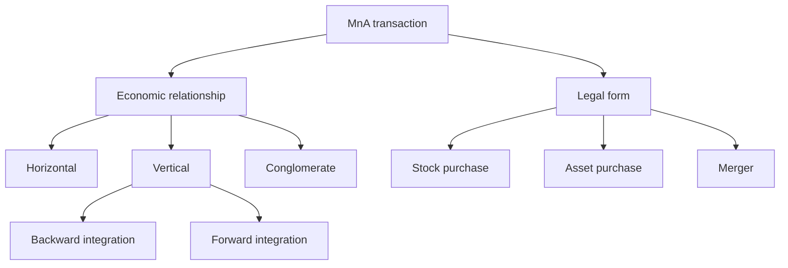
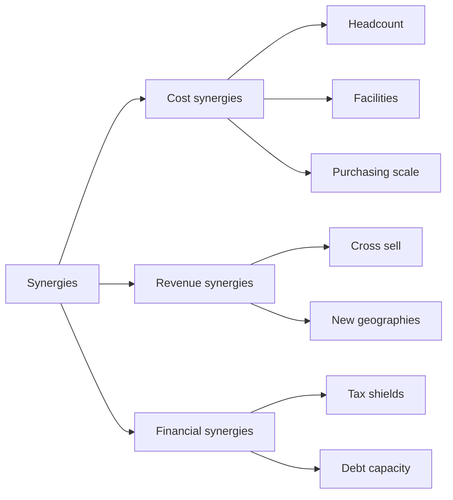
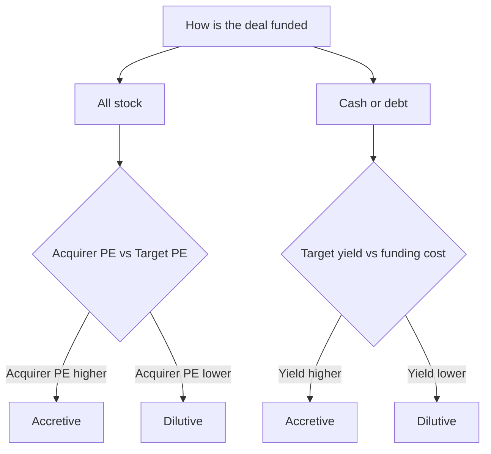

# Mergers & Acquisitions

## The Problem / Why this matters

A company that wants to grow has exactly two doors. It can build — hire people, buy machines, open plants, write software, win customers one at a time. This is **organic growth**, and it is slow, uncertain, and bounded by how fast an organisation can execute. Or it can **buy** — acquire another company that already has the customers, the technology, the factory, the brand, or the market position. This second door is **mergers and acquisitions (M&A)**, and it is the single most powerful, most expensive, and most dangerous lever in all of corporate finance.

It is powerful because a good acquisition can vault a company years ahead of where organic growth would take it. It is expensive because you almost never buy a company at its "fair" standalone value — you pay a **premium**, often 20–40% above the pre-deal share price. And it is dangerous because the majority of large deals, when studied years later, **destroy** value for the acquirer's shareholders rather than create it. The acquirer overpays, the promised synergies never show up, two cultures collide, and the stock that funded the deal turns out to have been the smart currency to spend.

For anyone preparing for finance interviews — investment banking, equity research, credit, corporate development, FP&A — M&A is not optional. It is the beating heart of the interview. IB analysts build merger models. Equity research analysts have to opine on whether a deal their covered company just announced is smart or stupid. Credit analysts have to judge whether a debt-funded acquisition just torched the balance sheet. FP&A teams model the combined entity. And **every** finance interviewer, regardless of desk, loves M&A questions because they test three things at once: your accounting, your valuation, and your business judgment. If you can walk through why a stock-for-stock deal is accretive, explain what a control premium is and why it exists, and articulate why most deals disappoint — you have signalled that you actually understand corporate finance, not just formulas.

This chapter builds M&A from first principles: the strategic *why*, the synergy math, the accretion/dilution mechanics that dominate interviews, the cash-versus-stock financing decision, the premium puzzle, and a full basic merger-model walkthrough you can reproduce on a whiteboard.

## Core Idea

An acquisition is, at its core, one simple economic trade:

> **You pay a price today for a stream of future economic benefits, and the deal creates value only if what you receive is worth more than what you pay.**

What you *pay* is the purchase price — the target's standalone value **plus a premium**. What you *receive* is the target's standalone cash-flow stream **plus synergies** — the extra value that exists only because the two companies are combined. So the master equation of every deal is:

$$\text{Value created for acquirer} = \underbrace{(\text{Target standalone value} + \text{Synergies})}_{\text{what you get}} - \underbrace{(\text{Target standalone value} + \text{Premium paid})}_{\text{what you pay}}$$

which simplifies to the only sentence you truly need to remember:

$$\boxed{\text{Value created} = \text{Synergies} - \text{Premium paid}}$$

Everything else in M&A — the deal types, the financing structure, the accretion/dilution analysis — is machinery around this one idea. **A deal creates value if and only if the synergies are worth more than the premium the acquirer pays to capture them.** The target's shareholders capture the premium (that is why they agree to sell). The acquirer's shareholders capture whatever synergy is left over *after* paying that premium. If the acquirer pays away 100% of the synergy as premium, the target's shareholders get everything and the acquirer breaks even — for a lot of risk. If the acquirer pays more than the synergy is worth, the acquirer's shareholders lose, and this is the depressingly common case.

## Why it works this way — first principles

Why does an acquirer have to pay a premium at all? Why can't it just buy the target at its market price? Because control is worth something, and because the target's shareholders will not part with their shares for nothing extra.

Think about it from the seller's side. If a target trades at ₹100 per share, that price reflects the value of the company **as it is currently run**, in the hands of its current management, with its current strategy. Any shareholder can sell into the market at ₹100 tomorrow. So why would they hand their shares to an acquirer at ₹100? They wouldn't — they'd get nothing for giving up their stake. To induce them to sell *the whole company at once* and hand over **control**, the acquirer must offer more than the market price. That "more" is the premium.

And the premium is economically justified — sometimes — because whoever controls the company can do things an ordinary shareholder cannot: replace management, change strategy, cut duplicated costs, cross-sell products, refinance the debt, redeploy the assets. This bundle of rights is the **control premium**, and it is only worth paying if the controller can extract value (synergies) that the standalone company could not. The premium is the *price of control*; the synergies are the *payoff from control*. The deal makes sense only when payoff > price.

This is also why **finance treats the acquirer and the target asymmetrically**. On announcement, the target's stock almost always jumps — toward the offer price — because target shareholders are being handed a premium, a near-certain gain. The acquirer's stock frequently *falls*, because the market is making a bet that the acquirer just paid away more in premium than it will ever recover in synergy. The market, in aggregate, is skeptical of acquirers for a good empirical reason: it is usually right.

The final first-principles point: **synergy is fragile and premium is certain.** The moment a deal closes, the premium is a sunk, paid-in-cash-or-stock fact. The synergies are a *promise* — cost cuts that require painful integration, revenue cross-sell that requires two salesforces to cooperate, all of it discounted by execution risk and time. You are trading a certain cost for an uncertain benefit. That asymmetry is the deep reason most deals disappoint, and we will return to it.

## Full technical content

### 1. Types of M&A

M&A transactions are classified along two independent axes: **the economic relationship** between the two businesses, and **the legal/structural form** of the transaction.

#### 1a. By economic relationship

| Type | Definition | Primary rationale | Classic example |
|---|---|---|---|
| **Horizontal** | Acquirer and target are competitors in the **same industry, same stage** of the value chain | Market share, scale economies, eliminate a competitor, cost synergies | Two banks merging; Vodafone–Idea |
| **Vertical** | Acquirer and target are at **different stages of the same supply chain** (buyer buys its supplier or its customer) | Secure supply, capture margin, control distribution, reduce transaction costs | A carmaker buying a battery maker; a refiner buying a retailer |
| **Conglomerate** | Acquirer and target are in **unrelated businesses** | Diversification, deploy excess cash, financial engineering | A tobacco company buying a food company |

**Vertical** deals split further into:
- **Backward integration** — buying *upstream*, toward your raw materials/suppliers (a steelmaker buying an iron-ore mine).
- **Forward integration** — buying *downstream*, toward your customers/distribution (a manufacturer buying a retail chain).

A subtle but interview-relevant sub-type is the **market-extension** or **product-extension** merger (sometimes called "concentric"): the two firms sell related products or serve related markets but are not direct competitors — e.g., a bank buying an insurer to cross-sell to the same customers. These sit between horizontal and conglomerate and are where **revenue synergies** are most credible.

**Why the classification matters for synergies:** the *type* of deal predicts the *type* of synergy. Horizontal deals are dominated by **cost synergies** (overlapping functions to cut). Vertical deals produce **margin capture and supply security**. Conglomerate deals, in theory, offer **diversification** — but finance is deeply skeptical of diversification as a rationale, because shareholders can diversify themselves far more cheaply by simply buying both stocks. This is the **"diversification discount"**: conglomerates often trade at *less* than the sum of their parts, precisely because the market does not value managers diversifying on shareholders' behalf.

#### 1b. By legal/structural form

| Term | Meaning |
|---|---|
| **Merger** | Two companies combine into one surviving legal entity; often "of equals" in name, rarely in reality |
| **Acquisition** | One company (acquirer) takes control of another (target); target may survive as a subsidiary |
| **Stock purchase** | Acquirer buys the target's **shares** from its shareholders; acquirer inherits **all** assets and **all** liabilities (including hidden/contingent ones) |
| **Asset purchase** | Acquirer buys **specific assets** (and assumes specific liabilities); cleaner, lets you cherry-pick, but can trigger taxes and require re-titling every asset |
| **Tender offer** | Acquirer bypasses the board and offers to buy shares directly from shareholders |
| **Hostile takeover** | Acquisition opposed by the target's board; pursued via tender offer or proxy fight |
| **Merger of equals** | Marketing label for a roughly-equal combination; one side almost always ends up in control |

### 2. Strategic rationale and synergies

A **synergy** is value that exists in the combined company but in *neither* company standalone. It is the entire economic justification for paying a premium. Synergies come in two great families.

#### 2a. Cost synergies

Cost synergies are reductions in the combined cost base achievable *because* the two firms are now one. They are the more **credible, quantifiable, and controllable** of the two families — you are removing your own costs, which is largely within your control.

Sources:
- **Headcount / overhead elimination** — you need only one CEO, one CFO, one HR department, one head office, one board.
- **Facility consolidation** — close overlapping plants, warehouses, branches, data centres.
- **Purchasing scale** — larger combined volume gives more bargaining power over suppliers.
- **Distribution and logistics** — combine networks, cut duplicated routes.
- **Technology / systems** — run one ERP, one CRM instead of two.

Cost synergies flow to **operating margin** and are usually modelled as a permanent addition to combined EBIT/EBITDA, phased in over 1–3 years, net of one-time **integration costs** (severance, IT migration, rebranding) to *achieve* them.

#### 2b. Revenue synergies

Revenue synergies are *increases* in combined revenue that neither firm could achieve alone:
- **Cross-selling** — sell the target's products to the acquirer's customers and vice versa.
- **Distribution reach** — push the target's product through the acquirer's larger footprint or new geographies.
- **Bundling and pricing power** — combined product suite commands a premium or reduces churn.
- **Filling product gaps** — a complete product line wins deals that neither could win alone.

Revenue synergies are **notoriously unreliable**. They depend on *customers* behaving as hoped — cross-buying, not defecting — which is outside management's control. Two salesforces have to cooperate; customers may resent reduced choice; the combined entity may face antitrust limits. **Rule for interviews and for life: heavily discount revenue synergies. Sophisticated acquirers and analysts often value them at zero or a large haircut, and pay premiums that can be justified on cost synergies alone.**

#### 2c. Financial and other synergies (secondary)

- **Tax** — using the target's tax-loss carryforwards, or interest tax shields from acquisition debt.
- **Debt capacity / lower cost of capital** — a larger, more diversified cash-flow stream can support cheaper borrowing.
- **Excess-cash deployment** — a cash-rich, low-growth acquirer buying growth.

These are real but secondary, and financial synergies in particular are viewed skeptically because shareholders can often replicate them.

#### 2d. Valuing a synergy

A recurring synergy is just a perpetual (or growing) cash flow and is valued like any other:

$$\text{PV of synergy} = \frac{\text{After-tax annual synergy}}{r - g} \; - \; \text{PV of one-time costs to achieve}$$

The **maximum premium** an acquirer can rationally pay equals the PV of net synergies. Pay less and the acquirer keeps the difference; pay exactly that and you break even; pay more and you destroy value.

### 3. Premiums — and why most deals disappoint

The **control premium** (or **acquisition premium**) is the excess of the offer price over the target's pre-announcement share price:

$$\text{Premium \%} = \frac{\text{Offer price per share} - \text{Unaffected share price}}{\text{Unaffected share price}}$$

The **unaffected price** is the target's share price *before* any rumour or leak moved it — typically measured one day, or a volume-weighted average over 20–30 days, *before* the announcement, to strip out any "run-up" from leaked information.

Typical control premiums run **20–40%**, higher in competitive auctions or hostile situations, lower in negotiated deals for distressed targets.

**Why deals disappoint — the structural reasons:**

1. **The winner's curse.** In a competitive auction, the winner is by definition the bidder who was willing to pay the most — i.e., the most *optimistic* about synergies. Systematic optimism means the winner tends to overpay. The very act of winning is evidence you bid too high.
2. **Synergy is uncertain; premium is certain.** You pay the premium in full at close; synergies are a discounted, risky promise phased over years.
3. **Integration risk.** Cultures clash, key talent leaves, systems don't merge, customers churn during the disruption. Integration is operationally brutal and routinely underestimated.
4. **Managerial incentives (agency).** Executives are rewarded for *size* (bigger company, bigger pay, more prestige — "empire building"). CEO hubris and overconfidence drive overpayment. The deal can be great for the CEO and bad for shareholders.
5. **Overpaying / anchoring.** Bankers and boards anchor on precedent premiums; process momentum ("deal fever") makes walking away feel like failure.
6. **Financing cost.** A debt-funded deal loads the balance sheet; a stock-funded deal may signal the acquirer thinks its own shares are overvalued (which itself depresses the stock).

The empirical record: on announcement, **target shareholders reliably gain** (they pocket the premium), while **acquirer shareholders on average lose or roughly break even**, and large deals in particular tend to underperform over the following years. The value doesn't vanish — it transfers from the acquirer's shareholders to the target's shareholders. That is the one-line summary of the "most deals disappoint" literature.

### 4. Deal structure and financing: cash vs stock

An acquirer can pay the purchase price with **cash**, **stock**, or a **mix**. The choice drives the economics, the risk-sharing, and the accretion/dilution outcome.

#### 4a. Cash deals

The acquirer pays cash — from its balance sheet, or (more commonly for large deals) from **new debt**. Characteristics:
- **No new shares issued** → no dilution of existing shareholders' ownership.
- The acquirer's shareholders bear **100% of the synergy risk** — and keep **100% of the synergy upside**.
- Funded by debt → adds **interest expense**, raises leverage, consumes debt capacity, and creates a **tax shield** on the interest.
- Signals **confidence**: the acquirer would rather pay in cash than dilute, implying it does not think its shares are overpriced (and doesn't want to share the upside).

#### 4b. Stock deals

The acquirer issues **new shares** to the target's shareholders. Characteristics:
- **Dilutes** existing acquirer shareholders' ownership.
- **Risk is shared**: target shareholders now own a slice of the combined company, so if synergies fail to materialise, *they* share the pain; if the deal soars, they share the gain.
- No cash outflow, no new interest expense, preserves debt capacity.
- Can **signal overvaluation**: a rational manager issues stock when they believe it is *expensive* (paying with "cheap" currency). The market knows this, so stock deals often see the acquirer's stock fall on announcement.
- The real economic cost is the acquirer's **cost of equity** — not "free" just because there's no cash out the door.

#### 4c. The financing hierarchy (cost)

For an all-else-equal accretion analysis, the after-tax cost of each funding source usually ranks:

$$\text{Cost of cash on hand} < \text{Cost of new debt} < \text{Cost of new equity}$$

- **Cash** earns a tiny after-tax yield, so using it "costs" only that forgone interest — cheapest.
- **Debt** costs the after-tax interest rate = interest × (1 − tax rate) — the tax shield makes it cheaper than equity.
- **Equity** is most expensive: you give away a permanent claim on all future earnings, priced at the earnings yield (E/P = 1 ÷ P/E).

This ranking is the engine of accretion/dilution, which we turn to next.

### 5. Accretion / dilution analysis — the interview centerpiece

**Accretion/dilution (A/D)** analysis answers one question: *does the deal increase or decrease the acquirer's earnings per share (EPS) in the first full year after close?*

- **Accretive** → pro-forma EPS **rises** vs standalone EPS.
- **Dilutive** → pro-forma EPS **falls**.
- **Breakeven** → unchanged.

$$\text{Pro-forma EPS} = \frac{\text{Combined net income} + \text{after-tax synergies} - \text{after-tax new interest}}{\text{Acquirer shares} + \text{new shares issued}}$$

$$\text{Accretion / (Dilution) \%} = \frac{\text{Pro-forma EPS} - \text{Acquirer standalone EPS}}{\text{Acquirer standalone EPS}}$$

**Why analysts obsess over EPS accretion:** EPS is a headline number the market watches, and a dilutive deal is a red flag that the acquirer may be overpaying. **Crucial caveat to say out loud in interviews:** *accretion is NOT the same as value creation.* A deal can be EPS-accretive and still destroy value (e.g., a cheap all-debt deal that piles on risk), or EPS-dilutive yet value-creating (a great growth asset paid for with stock). Accretion is a useful, fast screen — not the verdict.

#### 5a. The P/E "rule of thumb" for stock deals

For an **all-stock** deal with **no synergies**, there is a beautiful shortcut:

> **The deal is accretive if the acquirer's P/E is HIGHER than the target's P/E (i.e., the acquirer's forward P/E > the price-to-earnings multiple it pays for the target). It is dilutive if the acquirer's P/E is lower.**

Intuition: in a stock deal you are effectively "printing" your own shares to buy the target's earnings. If your shares are richly valued (high P/E) and you use them to buy cheaper earnings (low P/E target), each new share you issue buys *more* earnings than it dilutes — accretive. Buy expensive earnings with cheap stock and it's dilutive. High-P/E acquirers buying low-P/E targets is the classic accretive stock deal.

#### 5b. The cash-deal rule of thumb

For a **cash deal** (funded with cash or debt), compare the **after-tax cost of the cash/debt** to the **earnings yield of the target** (the inverse of the P/E you're paying):

> A cash/debt-funded deal is **accretive** if the target's after-tax earnings yield (target net income ÷ purchase equity value, adjusted) **exceeds** the after-tax cost of the funding (after-tax interest rate on the debt, or forgone yield on cash).

Put crudely: if you borrow at 6% pre-tax (≈4.5% after 25% tax) to buy earnings that yield 8%, you pocket the spread — accretive. Borrow at 4.5% after tax to buy a 3%-yielding asset — dilutive. Cheap debt + cheap target = accretive; that is why low interest rates fuel M&A booms.

### 6. A basic merger-model walkthrough

A merger model builds **pro-forma** (combined) financials and computes accretion/dilution. The skeleton, step by step:

**Step 1 — Purchase price (equity value of the deal).**
Offer price per share × target diluted shares outstanding = **equity purchase price**. If you're told a premium, apply it to the unaffected price first.

**Step 2 — Sources & uses of funds.**
*Uses:* equity purchase price + refinance target debt (if applicable) + transaction fees.
*Sources:* new debt + cash on hand + new equity (stock issued). Sources must equal uses.

**Step 3 — New shares issued (for the stock portion).**
New shares = (stock consideration ÷ acquirer's share price). This is the dilution.

**Step 4 — Combine the income statements.**
Add acquirer + target revenue, expenses, EBIT.

**Step 5 — Adjustments (the "pro-forma" magic).**
- **+ Synergies** (after tax), phased.
- **− New interest expense** on acquisition debt (after tax).
- **− Forgone interest** on cash used (after tax).
- **±** New **D&A** from asset write-ups and **intangible amortisation** created in purchase accounting (a real drag, often ignored in the "rule of thumb").

**Step 6 — Pro-forma net income and EPS.**
Combined adjusted net income ÷ (acquirer shares + new shares) = pro-forma EPS.

**Step 7 — Accretion/dilution.**
Compare pro-forma EPS to the acquirer's standalone EPS.

We now grind through three fully worked examples.

## Worked examples

### Worked Example 1 — All-stock deal and the P/E rule

**Setup.**
- **Acquirer A:** Net income ₹1,000 crore; 500 crore shares; share price ₹100. → EPS = ₹2.00; **P/E = 100 / 2 = 50×**.
- **Target T:** Net income ₹200 crore; 100 crore shares; share price ₹40. → EPS = ₹2.00; **P/E = 40 / 2 = 20×**.
- Deal: A acquires T in an **all-stock** deal at a **25% premium**, **no synergies**.

**Step 1 — Offer price.** Unaffected price ₹40 × 1.25 = **₹50 per share**.

**Step 2 — Equity purchase price.** ₹50 × 100 crore shares = **₹5,000 crore**.

**Step 3 — New shares issued.** A pays in its own stock at ₹100/share → new shares = 5,000 / 100 = **50 crore new shares**.

**Step 4 — Combined net income (no synergies, no new interest).** 1,000 + 200 = **₹1,200 crore**.

**Step 5 — Pro-forma share count.** 500 + 50 = **550 crore shares**.

**Step 6 — Pro-forma EPS.** 1,200 / 550 = **₹2.1818**.

**Step 7 — Accretion.** (2.1818 − 2.00) / 2.00 = **+9.1% accretive.**

**Self-check with the P/E rule.** Acquirer P/E 50× > the effective P/E paid for the target. What P/E did A pay? Purchase price ₹5,000 / target earnings ₹200 = **25×**. A's own P/E (50×) is far above the 25× it paid → the deal *must* be accretive. Confirmed. Notice: T's standalone P/E was 20×, but after the 25% premium A actually paid **25×** — the premium raises the multiple you pay, yet 25× is still below A's 50×, so it stays accretive. The premium ate into the accretion but didn't reverse it.

**Sensitivity insight.** How high a premium could A pay before the deal turns dilutive? Break-even is when the P/E paid equals A's own P/E of 50×. P/E paid = purchase price / 200 = 50 → purchase price = ₹10,000 crore → per share = ₹100 → premium = (100 − 40)/40 = **150%**. A could pay up to a 150% premium on this deal before all-stock accretion flips to dilution. That is the power of a high-P/E currency.

### Worked Example 2 — All-cash (debt-funded) deal

**Setup.**
- **Acquirer A:** Net income ₹1,000 crore; 500 crore shares → EPS ₹2.00.
- **Target T:** Net income ₹200 crore; purchase equity value **₹5,000 crore** (same ₹50/share × 100 crore as Example 1).
- Deal: **all cash**, funded entirely by **new debt of ₹5,000 crore** at **8% interest**. Tax rate **25%**. No synergies. Ignore purchase-accounting D&A for now.

**Step 1 — New interest expense.** 5,000 × 8% = ₹400 crore pre-tax.

**Step 2 — After-tax interest.** 400 × (1 − 0.25) = **₹300 crore**.

**Step 3 — Combined net income.** Acquirer 1,000 + Target 200 − after-tax interest 300 = **₹900 crore.**

**Step 4 — Shares.** No stock issued → shares stay at **500 crore**.

**Step 5 — Pro-forma EPS.** 900 / 500 = **₹1.80**.

**Step 6 — Accretion/dilution.** (1.80 − 2.00) / 2.00 = **−10% → dilutive.**

**Self-check with the yield rule.** Target after-tax earnings yield on the price paid = target net income / purchase price = 200 / 5,000 = **4.0%**. After-tax cost of debt = 8% × (1 − 0.25) = **6.0%**. You are borrowing at 6% after tax to buy a 4% yield → you lose 2% of ₹5,000 = ₹100 crore of pre-... let's verify: the drag is (4.0% − 6.0%) × 5,000 = **−₹100 crore** of net income vs standalone acquirer. Standalone A net income ₹1,000; combined ₹900. Drop of ₹100 crore. Confirmed — the yield rule and the full build agree.

**Interview punchline.** *Same target, same price. The all-STOCK version (Example 1) was +9% accretive; the all-CASH-with-8%-debt version is −10% dilutive.* Why the flip? Because A's stock is an extremely cheap currency (50× P/E = 2% earnings yield to issue), while 8% debt is expensive relative to the target's 4% yield. **Financing choice alone flipped the deal.** This is the single most important lesson of A/D analysis.

### Worked Example 3 — Full model with synergies, mixed financing, and value creation

**Setup.**
- **Acquirer A:** Net income ₹1,000 crore; 500 crore shares; price ₹100 (EPS ₹2.00, P/E 50×).
- **Target T:** 100 crore shares; unaffected price ₹40; net income ₹200 crore.
- Deal terms: **30% premium**; financed **50% stock / 50% new debt**; debt at **8%**, tax **25%**.
- **Synergies:** ₹150 crore pre-tax annual cost synergies (fully phased in year 1).

**Step 1 — Offer price and purchase value.** ₹40 × 1.30 = **₹52/share**. Equity purchase price = 52 × 100 = **₹5,200 crore.**

**Step 2 — Split the financing.** Stock ₹2,600 crore; debt ₹2,600 crore.

**Step 3 — New shares.** 2,600 / 100 = **26 crore new shares.** Pro-forma shares = 500 + 26 = **526 crore.**

**Step 4 — New after-tax interest.** 2,600 × 8% = ₹208 pre-tax; × (1 − 0.25) = **₹156 crore.**

**Step 5 — After-tax synergies.** 150 × (1 − 0.25) = **₹112.5 crore.**

**Step 6 — Pro-forma net income.**
Acquirer 1,000 + Target 200 + Synergies (after tax) 112.5 − Interest (after tax) 156 = **₹1,156.5 crore.**

**Step 7 — Pro-forma EPS.** 1,156.5 / 526 = **₹2.1987.**

**Step 8 — Accretion.** (2.1987 − 2.00) / 2.00 = **+9.9% accretive.**

**Now the value question — did it CREATE value?** Accretion ≠ value. Let's check synergy vs premium.
- **Premium paid** = (52 − 40) × 100 crore shares = **₹1,200 crore** (this is the extra above standalone value handed to T's shareholders).
- **Value of synergies** = after-tax annual synergy capitalised. Take a perpetuity at, say, a 10% discount rate, no growth: PV = 112.5 / 0.10 = **₹1,125 crore.**
- **Value created for A's shareholders** = PV of synergies − premium = 1,125 − 1,200 = **−₹75 crore.**

**The lesson, sharp and memorable:** *this deal is +9.9% EPS-accretive yet destroys ₹75 crore of value.* A paid a ₹1,200 crore premium to capture ₹1,125 crore of synergy value — it overpaid by ₹75 crore, handing all the synergy (and a bit more) to the seller. **Accretion told a happy story; the value math told the truth.** If asked "is this a good deal?", the sophisticated answer is: "It's accretive, but at a 30% premium the synergies don't quite cover the premium at a 10% discount rate, so it modestly destroys value for the acquirer — I'd want either lower premium or ~₹160 crore+ of after-tax synergies to justify it." (Break-even synergy value = premium ₹1,200 → required after-tax annual synergy = 1,200 × 10% = ₹120 crore after tax = ₹160 crore pre-tax.)

**Cross-check the break-even.** Required pre-tax synergy ₹160 crore vs assumed ₹150 crore — we're ₹10 crore of pre-tax synergy short, consistent with the small ₹75 crore value shortfall (₹10 crore pre-tax × 0.75 after tax ÷ 0.10 = ₹75 crore). Internally consistent.

## How it is tested in interviews

Interviewers reuse a tight set of M&A questions. Here are the exact ones with model answers and crisp lines to say.

**Q1. "Walk me through the different types of M&A."**
> *Crisp answer:* "Along the economic axis: horizontal — same industry, same stage, driven by scale and cost synergies; vertical — different stages of one supply chain, either backward toward suppliers or forward toward customers, driven by margin capture and supply security; and conglomerate — unrelated businesses, justified by diversification, though the market usually discounts that rationale because shareholders can diversify themselves more cheaply."

**Q2. "What's the difference between an accretive and a dilutive deal?"**
> "Accretive means pro-forma EPS after the deal is higher than the acquirer's standalone EPS; dilutive means it's lower. It's a quick screen for whether the acquirer overpaid — but I'd flag that accretion isn't value creation. A deal can be accretive and still destroy value, and vice versa."

**Q3. "In an all-stock deal with no synergies, when is it accretive?"**
> "When the acquirer's P/E is higher than the P/E it pays for the target. You're issuing your own shares as currency — if your stock is richly valued relative to the earnings you're buying, each new share buys more earnings than it dilutes, so it's accretive. High-P/E buying low-P/E is the textbook accretive stock deal."

**Q4. "Company A has a 20× P/E, Company B has a 15× P/E. A buys B in an all-stock deal. Accretive or dilutive?"**
> "Accretive — the acquirer's 20× is above the target's 15×, so before any premium and synergies it's accretive. If A pays a premium, the effective multiple paid rises above 15×; it stays accretive as long as that effective multiple stays below A's 20×." *(This tests whether you remember the premium raises the multiple paid.)*

**Q5. "You buy a target with debt at 8% pre-tax, tax rate 25%. The target's earnings yield on the price you pay is 5%. Accretive or dilutive?"**
> "After-tax cost of debt is 8% × 0.75 = 6%. You're borrowing at 6% after tax to buy a 5% yield, so you lose 1% on the funded amount — dilutive. Rule: cash/debt deal is accretive only when the target's after-tax yield beats your after-tax cost of funding."

**Q6. "Why do most acquisitions fail to create value for the acquirer?"**
> "Structurally, the premium is certain and paid up front, while synergies are uncertain and phased over years. Add the winner's curse — the most optimistic bidder wins the auction and tends to overpay — plus integration risk, culture clash, and management incentives to build empires. Empirically the premium transfers value from acquirer shareholders to target shareholders, which is why target stocks pop on announcement and acquirer stocks often fall."

**Q7. "Cash or stock — which should an acquirer use, and what does the choice signal?"**
> "Cash — usually via debt — doesn't dilute, keeps 100% of the synergy upside for existing shareholders, and adds a tax shield, but it raises leverage and puts all the risk on the acquirer. Stock shares both risk and reward with the target's holders and preserves debt capacity, but it dilutes and can signal the acquirer thinks its own shares are overvalued — which is why acquirer stocks often dip on stock-deal announcements. Cheap debt favours cash; a richly-valued stock favours paying with equity."

**Q8. "What is a control premium and why does it exist?"**
> "It's the excess of the offer price over the target's unaffected share price, typically 20–40%. It exists because a controlling owner can do things ordinary shareholders can't — change management, cut costs, redeploy assets, capture synergies. The premium is the price of control; it's only justified if the synergies from that control are worth more than the premium."

**Q9. "Build me a quick merger model in your head."** *(They want the 7-step skeleton.)*
> "Purchase price = offer per share × diluted shares. Sources and uses to fund it — debt, cash, stock. New shares from the stock portion. Combine the two income statements. Adjust: plus after-tax synergies, minus after-tax new interest and forgone interest on cash, minus incremental D&A from write-ups. Divide combined adjusted net income by the new total share count for pro-forma EPS, and compare to standalone EPS for accretion/dilution."

**Q10. "A deal is 10% accretive. Is it a good deal?"**
> "Not necessarily. Accretion just says EPS went up — but I'd check whether the synergies exceed the premium in present-value terms. A cheap all-debt deal can be accretive while loading on risk and even destroying value. I'd want the PV of after-tax synergies to exceed the premium paid before I call it a good deal."

## Traps & common mistakes

1. **Confusing accretion with value creation.** The number-one interview trap. EPS up ≠ value up. Always separate the two: A/D is an *earnings* screen; value creation is *synergies vs premium* in PV terms.
2. **Forgetting the premium raises the multiple you pay.** The target's standalone P/E is *not* the P/E you pay — apply the premium first. A 20× target bought at a 30% premium costs you 26×.
3. **Treating stock as "free."** No cash leaves the building, but you gave away a permanent claim on all future earnings. Its cost is the acquirer's cost of equity (earnings yield), and for a low-P/E acquirer that can be very expensive.
4. **Taking revenue synergies at face value.** They depend on customers, not on you. Discount them hard or zero them out; justify the premium on cost synergies.
5. **Ignoring integration costs and purchase-accounting D&A.** One-time severance/IT/rebranding costs and new intangible amortisation are real EPS drags the "rule of thumb" omits.
6. **Forgetting the tax shield on debt.** Always use *after-tax* cost of debt = rate × (1 − tax) when comparing to the target's yield. Using the pre-tax rate overstates dilution.
7. **Using the affected (post-rumour) price to compute the premium.** Use the *unaffected* price before any leak/run-up, else you understate the true premium.
8. **Assuming a "merger of equals" is truly equal.** One side almost always controls; find who gets the CEO seat and board majority.
9. **Sources ≠ Uses.** In the model, every rupee of use (purchase price + refinanced debt + fees) must be funded by a source (debt + cash + stock). If they don't tie, the model is wrong.
10. **Diversification as a rationale.** Don't praise a conglomerate deal for "reducing risk" — shareholders diversify themselves for the cost of a brokerage commission; the market applies a conglomerate discount, not a premium.

## First-principles recap

- **A deal creates value only when synergies exceed the premium paid.** Everything else is machinery around that one equation.
- **You pay a premium because control is worth something** — but only if the controller can extract synergies the standalone company couldn't.
- **Synergy is uncertain and phased; premium is certain and up-front.** That asymmetry is the deep reason most deals disappoint and value transfers from acquirer to target shareholders.
- **Cost synergies are credible; revenue synergies are hope.** Fund the premium on cost synergies; discount revenue synergies hard.
- **Financing choice can flip a deal on its own.** High-P/E stock is cheap currency; expensive debt is not — the same target at the same price can be accretive on stock and dilutive on debt.
- **Accretion/dilution is an EPS screen, not a value verdict.** A deal can be accretive and value-destroying; always cross-check synergies vs premium in PV.
- **The rules of thumb:** all-stock is accretive if acquirer P/E > P/E paid; cash/debt is accretive if target after-tax yield > after-tax cost of funding.

## Quick-reference

| Concept | Formula / Rule |
|---|---|
| Master value equation | Value created = PV of synergies − Premium paid |
| Premium % | (Offer price − Unaffected price) / Unaffected price |
| Control premium range | Typically 20–40% |
| Equity purchase price | Offer price/share × target diluted shares |
| New shares (stock deal) | Stock consideration ÷ acquirer share price |
| After-tax interest | New debt × rate × (1 − tax) |
| After-tax synergies | Pre-tax synergy × (1 − tax) |
| Pro-forma EPS | (Combined NI + after-tax synergies − after-tax new interest) ÷ (acquirer shares + new shares) |
| Accretion/Dilution % | (Pro-forma EPS − Standalone EPS) ÷ Standalone EPS |
| All-stock rule (no synergy) | Accretive if acquirer P/E > P/E paid for target |
| Cash/debt rule | Accretive if target after-tax yield > after-tax cost of funding |
| P/E paid | Purchase price ÷ target net income |
| Effective earnings yield | 1 ÷ P/E |
| Cost hierarchy | Cash < Debt (after-tax) < Equity |
| Max rational premium | ≈ PV of net after-tax synergies |
| Break-even synergy (perpetuity) | Required after-tax synergy = Premium × discount rate |
| Value ≠ accretion | Accretive deals can destroy value; check synergy vs premium in PV |
| Sources = Uses | Debt + Cash + Stock = Purchase price + Refi debt + Fees |
