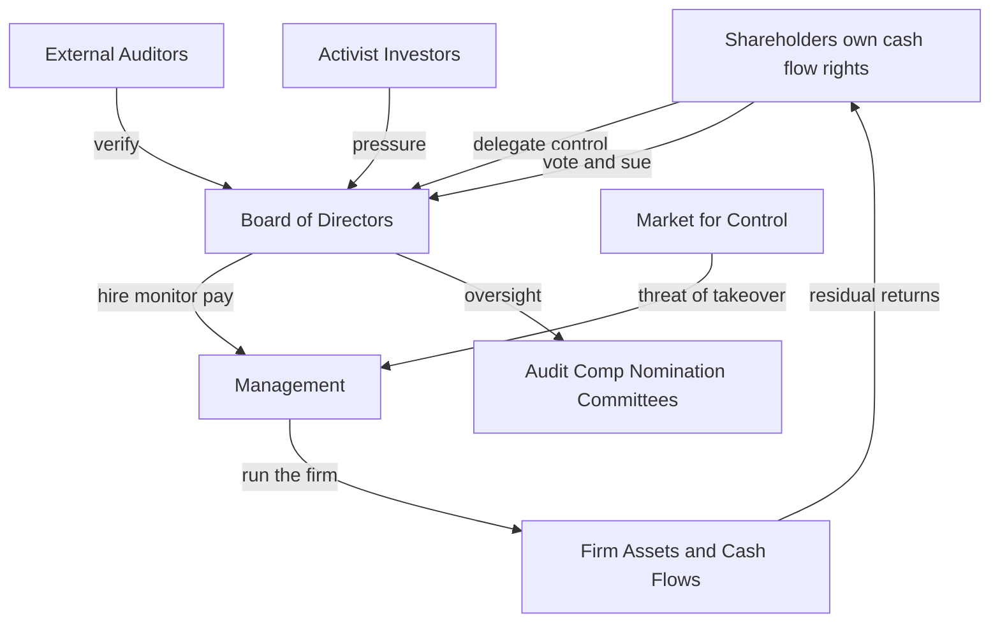
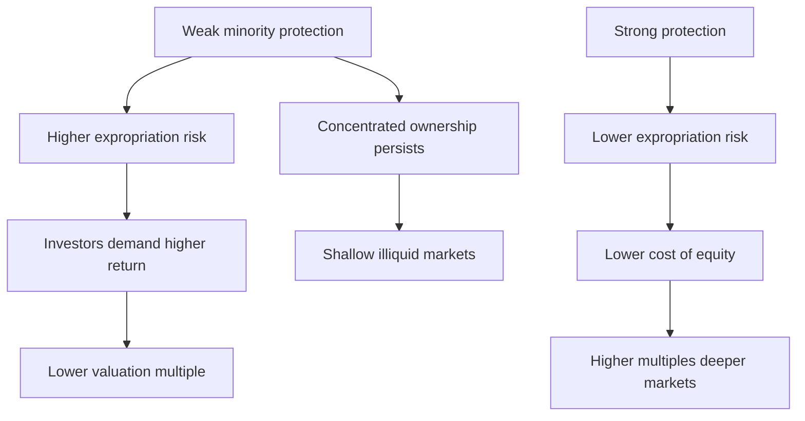

# Corporate Governance

## The Problem / Why this matters

A company is a legal fiction. It cannot act, decide, or feel guilt. Every action a "company" takes is actually taken by a **person** — a CEO signing a contract, a plant manager approving overtime, a treasurer wiring cash. Those people are spending money that is **not theirs**. The money belongs to shareholders (residual owners), to lenders (fixed claimants), and in a broader sense to employees, customers, and the state.

This creates the single deepest problem in all of finance: the people who **control** the firm's resources are almost never the same people who **own** them. The owner of a share of Infosys or Apple has no ability to walk into a factory and stop a value-destroying acquisition. The manager who launches that acquisition may keep his salary and prestige even if shareholders lose billions. Whenever decision rights and cash-flow rights are split, the decision-maker has both the **opportunity** and the **incentive** to divert value toward himself.

Corporate governance is the entire system of rules, incentives, monitors, and disclosures designed to make sure that the people controlling other people's money behave — roughly — as those people would want. Adam Smith saw it in 1776: directors of joint-stock companies, "being the managers rather of other people's money than of their own, cannot well be expected" to watch it with the same anxious vigilance as the owners.

Why should a finance interviewee care? Because governance is where **valuation, risk, and ethics collide**, and it is tested constantly:

- An equity research analyst who ignores governance overpays for a promoter-controlled firm that will tunnel out cash.
- A credit analyst who ignores governance underestimates the risk that a controlling shareholder strips assets before default, leaving lenders with an empty shell.
- An FP&A or IB professional structuring a deal, an ESOP, or a board recommendation must know how incentives actually shape behavior.
- Governance failures — Enron, WorldCom, Satyagraha/Satyam, Wirecard, Lehman, Adani short-seller episodes, Yes Bank, IL&FS — are the classic "walk me through what went wrong" interview stories.

Governance is not soft. It is the mechanism that determines whether the cash flows in your DCF actually reach the investor, or leak out along the way.

## Core Idea

Corporate governance solves an **agency problem**. Owners (principals) hire managers (agents) to run the firm, but managers have their own goals — bigger empires, safer careers, fatter pay, private jets — that diverge from the owners' single goal of maximizing risk-adjusted long-term value. Because owners cannot observe everything managers do (information asymmetry), they cannot simply write a contract that says "maximize my wealth" and walk away.

Governance answers the question: **how do we get self-interested agents to act in the principals' interest, when we cannot watch them?** It does this with three levers, layered on top of each other:

1. **Monitoring** — put watchers over management: a board of directors, independent directors, audit committees, external auditors, rating agencies, analysts, activist investors, the press.
2. **Incentive alignment** — pay managers in a way that makes their wealth move with shareholders' wealth: equity, options, performance shares, clawbacks, deferred bonuses.
3. **Discipline and rights** — give owners real power to punish bad managers: the vote, the right to sue, the right to sell (which invites takeovers), and legal protection against expropriation.

A crucial refinement: in most of the world outside the US and UK, the agency problem is **not** "dispersed owners vs. entrenched managers." It is "**controlling shareholder vs. minority shareholders**." A promoter family owning 55% doesn't need to worry about being fired — they ARE management. The danger shifts from managers shirking to insiders **tunneling** value away from minority investors. Emerging-market governance is mostly about this second conflict, and interviewers love to probe whether you understand the difference.

## Why it works this way — first-principles reasoning

Start from three unavoidable facts of the corporate form and everything else follows.

**Fact 1 — Separation of ownership and control.** To raise large amounts of capital, a firm sells shares to thousands of investors. No single investor then owns enough to bother monitoring management, and each free-rides on the others' monitoring. This is the **collective action problem** (Berle & Means, 1932): dispersed ownership means *no one* watches the store, so managers gain de facto control. The board exists precisely to be a **delegated, concentrated monitor** on behalf of scattered owners.

**Fact 2 — Contracts are incomplete.** You cannot write a contract specifying the right action in every future state of the world — the world is too complex and the future unknowable. So someone must hold **residual control rights** — the right to decide in situations the contract didn't foresee. Shareholders, as residual claimants (paid last, after everyone else), are given residual control rights (the vote) because they have the sharpest incentive to maximize the pie: every extra rupee of value, after fixed claims, is theirs. Governance is the architecture of who holds residual control and how it's exercised.

**Fact 3 — Information is asymmetric.** Managers know more about the business than owners do. This makes both **hidden action** (moral hazard — you can't see whether the CEO worked hard or golfed) and **hidden information** (adverse selection — you can't tell a good project from empire-building) possible. Every governance tool is a response to asymmetry: disclosure reduces it, independent directors and auditors verify it, and equity pay makes the manager internalize outcomes so you don't need to observe effort directly.

From these three facts, the toolkit is derived, not invented:

- Because owners are dispersed and rational, they won't monitor individually → **delegate to a board**.
- Because the board can be captured by the CEO who nominates them, pays them, and controls their information → require **independent directors** and board committees insulated from management.
- Because monitoring is always imperfect → also **align incentives** so the agent *wants* the right outcome (pay-for-performance).
- Because incentives can be gamed (managers manipulate the metrics they're paid on) → add **clawbacks, deferral, and multiple metrics**.
- Because insiders can still expropriate → give minorities **legal rights**: to vote, to information, to sue, to fair treatment in related-party transactions and takeovers.
- Because a bad manager who survives all of the above still destroys value → keep the ultimate discipline of the **market for corporate control** (hostile takeovers) and the **product/labor/capital markets**.

The reason governance "works" at all is that it stacks many imperfect mechanisms so that the *joint* probability of unchecked misbehavior falls. No single mechanism is sufficient; the system is defense-in-depth.

## Full technical content

### 1. The agency framework, quantified

The costs of the agency conflict are called **agency costs** (Jensen & Meckling, 1976). They come in three parts:

| Component | Meaning | Example |
|---|---|---|
| Monitoring costs | Borne by principals to watch agents | Auditor fees, board costs, proxy advisory subscriptions |
| Bonding costs | Borne by agents to credibly commit to good behavior | CEO taking large equity stake, accepting clawbacks, covenants |
| Residual loss | Value still lost because alignment is never perfect | Empire-building, perks, suboptimal effort |

**Total agency cost = Monitoring + Bonding + Residual loss.** Good governance minimizes the *sum*, not any single term. Spending infinite money on monitoring is itself wasteful. The optimal governance structure trades these off.

Two classic agency conflicts:

- **Type I — Owner vs. Manager** (dispersed ownership; US/UK). Manager entrenchment, empire-building, excessive perks, risk-aversion (managers under-lever because their human capital is undiversified).
- **Type II — Controlling vs. Minority shareholder** (concentrated ownership; India, most of Asia, Europe, LatAm). Tunneling, related-party transactions, pyramids, dilution of minorities.

There's also **Owner vs. Creditor** (shareholders may take excessive risk or pay large dividends at lenders' expense — "asset substitution" and "milking the property") — governed mainly by debt covenants, not the board.

### 2. The Board of Directors

The board is the apex governance body — the delegated monitor and the legal fiduciary. Core functions:

1. **Hire, evaluate, compensate, and fire the CEO** (the single most important thing a board does).
2. **Approve strategy and major capital allocation** (M&A, large capex, dividends, buybacks).
3. **Oversee risk, controls, and integrity of financial reporting.**
4. **Ensure legal and ethical compliance** and succession planning.

**Fiduciary duties** owed by directors:

- **Duty of care** — act with the diligence a reasonably prudent person would. Protected by the **business judgment rule**: courts won't second-guess an informed, good-faith, disinterested decision even if it turns out badly.
- **Duty of loyalty** — put the company's interest above personal interest; no self-dealing, no usurping corporate opportunities. This is the duty that related-party transactions and insider trading violate.
- **Duty of good faith / disclosure** — deal candidly with shareholders.

**Board structure — two models:**

| Feature | One-tier (US, UK, India) | Two-tier (Germany, Netherlands) |
|---|---|---|
| Structure | Single board of exec + non-exec directors | Supervisory board over a management board |
| Employee role | Limited | Codetermination — workers on supervisory board |
| CEO/Chair | Often combined (US) | Strictly separated |

**Key board-composition levers:**

- **Board independence** — proportion of independent directors. Higher independence generally improves monitoring but can reduce firm-specific knowledge.
- **CEO duality** — one person as both CEO and Chairman. Concentrates power and weakens the board's ability to monitor its own boss. Best practice (and increasingly law) separates them or appoints a **lead independent director**.
- **Board size** — too small lacks expertise/committees; too large suffers free-riding and slow decisions. Empirically ~8–12 is common.
- **Busy boards / overboarding** — directors on too many boards monitor poorly.
- **Diversity** — of skills, gender, background; linked to better oversight and reduced groupthink.
- **Staggered (classified) board** — directors elected in classes (e.g., 1/3 per year) so an acquirer can't replace the whole board in one meeting. A powerful **anti-takeover** and **entrenchment** device.

### 3. Board committees

The full board delegates specialized oversight to committees staffed (mostly or entirely) by independent directors.

| Committee | Core mandate | Why independence matters |
|---|---|---|
| **Audit Committee** | Oversee financial reporting, internal controls, internal + external audit, whistleblower mechanism | Management prepares the numbers; the committee must be able to challenge the CFO. Must be fully independent and financially literate |
| **Nomination / Governance** | Board composition, director search, succession, board evaluation | Breaks the CEO's grip on who joins "his" board |
| **Compensation / Remuneration** | Design and approve executive pay, set performance targets | The CEO must not set his own pay; independence curbs self-dealing on comp |
| **Risk Committee** | Enterprise and (for banks) financial risk appetite and controls | Separates risk oversight from revenue-driven management |

The **audit committee** is the one most heavily tested. Under India's Companies Act 2013 / SEBI LODR, listed companies need an audit committee with a majority of independent directors and a chair who is independent; under the US, SOX 2002 requires a fully independent audit committee, at least one "financial expert," and gives it direct authority to hire/fire the external auditor.

### 4. Independent directors

An **independent director** is a non-executive director with no material pecuniary relationship with the company, its promoters, or management that could impair judgment. The logic: a monitor captured by the monitored is worthless. Independence is defined by **bright-line tests** — not an employee, not a relative of promoters, no material transactions, within tenure limits, etc.

**What they're supposed to do:** provide objective challenge, protect minority shareholders, chair key committees, and act as the conscience of the board.

**Why independence often fails in practice (the deep point interviewers want):**

- **Selection capture** — the CEO/promoter still influences who gets nominated; "independent" on paper, loyal in fact.
- **Information asymmetry** — directors see only what management shows them; they meet a few days a year.
- **Reputation and fees** — directors want to keep lucrative, prestigious seats and rarely rock the boat.
- **Diffusion of responsibility** — everyone assumes someone else is checking.
- **Expertise gap** — a retired diplomat cannot challenge a complex derivatives book.

This is why Satyam (2009) had a "blue-ribbon" independent board including a Harvard professor and still missed a $1bn+ fabricated cash balance. Independence is necessary but not sufficient.

### 5. Executive compensation and incentive alignment

Pay is the **incentive** lever. The goal: make the manager's payoff a monotonic, steep function of long-term shareholder value — without inducing manipulation or excessive risk. Components:

| Component | Horizon | Aligns with | Risk it creates |
|---|---|---|---|
| Base salary | Annual | Nothing — fixed | Rewards presence, not performance |
| Annual bonus (STI) | 1 year | Short-term metrics (EPS, revenue, EBIT) | Short-termism, metric gaming |
| Stock options | Multi-year, vesting | Share price appreciation above strike | Asymmetric upside → excessive risk-taking; repricing |
| Restricted stock / RSUs | Vesting (3–4 yr) | Absolute share price + retention | Rewards even in falling market unless indexed |
| Performance shares (LTI/PSUs) | 3 yr | Relative TSR, ROIC, EPS growth vs peers | Metric selection games |
| Deferred cash / bonus banks | Multi-year | Sustained performance | Complexity |

**Pay-for-performance sensitivity** measures how much the executive's wealth changes per unit of shareholder wealth change. For options, the sensitivity is captured by **delta** (change in option value per $1 of stock) and the risk incentive by **vega** (sensitivity to volatility). High delta = alignment; high vega = incentive to gamble.

**Options — why they were loved and then distrusted:**
- Loved: zero cash cost to the firm at grant (pre-2006 accounting), leveraged upside aligns manager with a rising stock.
- Distrusted: they are a **call option** — the manager captures the upside but doesn't share the full downside (worst case: option expires worthless, but salary continues). This convexity encourages **excessive risk**. They also invite **backdating** (choosing a low-price grant date retroactively — a fraud that felled several execs in 2006) and **repricing** (lowering the strike after the stock falls — rewarding failure). Post-FAS 123R / IFRS 2, options must be expensed, killing the "free" accounting appeal, and RSUs and performance shares have largely replaced plain options.

**Key alignment mechanisms and guardrails:**

- **Vesting and deferral** — pay out over years so the manager can't cash out on a temporary pop.
- **Clawback / malus** — recover paid or forfeit unvested comp if results are later restated or misconduct emerges (mandated by SOX §304 and Dodd-Frank).
- **Share ownership guidelines** — require executives to hold N× salary in stock; puts real downside skin in the game.
- **Relative performance evaluation (RPE)** — pay on performance *relative to peers* to filter out luck (a rising market shouldn't enrich a mediocre CEO).
- **Say-on-pay** — an advisory (sometimes binding) shareholder vote on the comp package (Dodd-Frank in the US; binding in the UK on policy).
- **Pay ratio disclosure** — CEO-to-median-worker pay ratio, a political/optics tool.

**The "optimal contracting" vs. "managerial power" debate (Bebchuk & Fried):** Is executive pay the efficient output of arm's-length bargaining (optimal contracting), or is it partly a symptom of the agency problem itself — powerful CEOs extracting rents from captured boards, disguised by "camouflage" (perks, pensions, gross-ups) to avoid outrage? The truth is both. A great interview answer names this tension.

### 6. Shareholder rights and activism

Shareholders' ultimate power is the **residual control right** — the vote — plus rights to information, to distributions declared, to sue, and to sell.

**Core shareholder rights:**

- **Voting** — elect directors, approve mergers, amend charter, ratify auditors, say-on-pay.
- **One-share-one-vote vs. dual-class** — the default is proportional voting. **Dual-class shares** (e.g., Google/Alphabet, Meta, Indian firms' differential voting rights) let founders keep control (10× or 20× voting super-shares) while owning a minority of cash flows. This is a **wedge** between control and ownership — great for founder vision, dangerous for entrenchment.
- **Preemptive / rights issue** — right to buy new shares pro-rata to avoid dilution.
- **Right to call meetings, table resolutions, appoint proxies.**
- **Appraisal / dissent rights** — in a squeeze-out, dissenting minorities can demand a court-determined fair price.
- **Derivative suits and class actions** — sue on behalf of the company against errant insiders.
- **Tag-along / drag-along** (in shareholder agreements) — minorities can join a controlling-stake sale on the same terms.

**Shareholder activism** is the market response to the collective-action problem: a large, motivated investor internalizes enough of the gains from monitoring to make it worthwhile.

| Activist type | Toolkit | Objective |
|---|---|---|
| **Hedge-fund activist** (Elliott, ValueAct, Icahn, Third Point) | Build a stake, public letters, proxy fights, board seats | Unlock value — buybacks, spin-offs, cost cuts, sell the company, replace CEO |
| **Institutional / index funds** (BlackRock, Vanguard, LIC) | Engagement, voting guidelines, "vote no" campaigns | Governance quality, ESG, long-term stewardship |
| **Proxy advisors** (ISS, Glass Lewis) | Voting recommendations that sway institutional votes | Influence outcomes at scale |

**Mechanics of a proxy fight:** the activist solicits other shareholders' proxies to vote its slate of directors or its resolution against the board's recommendation. The board defends with its own solicitation. Winning requires persuading the big institutions — hence proxy advisors' outsized influence.

**Stewardship codes** (UK Stewardship Code 2010→, India's SEBI/IRDAI/PFRDA stewardship principles) push institutions from passive to *engaged* owners — to actually vote and hold boards accountable rather than free-ride.

### 7. Governance in emerging markets and promoter-driven firms

This is where a candidate targeting Indian or EM finance roles must be strong. The defining feature is **concentrated ownership**: a promoter family or the state holds a controlling block. The agency conflict flips from Type I to **Type II — controlling vs. minority**.

**Control-enhancing mechanisms** that create a wedge between control rights and cash-flow rights:

| Mechanism | How it separates control from ownership |
|---|---|
| **Pyramids** | Promoter owns 51% of A, which owns 51% of B, which owns 51% of C → controls C with ~13% economic stake |
| **Cross-holdings** | Group firms hold each other's shares, locking in insider control |
| **Dual-class / DVR shares** | Super-voting shares held by promoter |
| **Promoter as chairman + related management** | Control regardless of formal % |

Because the promoter's **cash-flow rights are far below their control rights**, they capture only a fraction of value they create for *all* shareholders but 100% of value they **divert to themselves** — so the temptation to tunnel is structural, not merely a matter of bad character.

**Tunneling** — the transfer of resources out of a firm for the benefit of the controlling shareholder:

- **Cash-flow tunneling** — related-party transactions at non-market prices: the listed firm buys inputs from a promoter-owned private firm at inflated prices, or sells output cheap to it; pays inflated "royalty" or "brand" fees to the parent; extends loans/guarantees to group firms.
- **Asset tunneling** — transferring assets or opportunities to promoter entities.
- **Equity tunneling** — dilutive preferential allotments to insiders, related-party mergers at unfair ratios, freeze-out of minorities.

**Propping** is the reverse — the promoter injects resources to keep a distressed group firm alive (often to preserve the pyramid or avoid cross-default), which can also disadvantage minorities in the *healthy* firm.

**Why EM governance is hard:** weak courts and slow enforcement, concentrated media/political power, related-party opacity, and a "controlling mind" that is judge, jury, and beneficiary. The offset comes from: SEBI-style regulation, mandatory independent directors and audit committees, related-party transaction (RPT) approval by **minority-only** votes ("majority of the minority"), mandatory open offers on control change (SEBI Takeover Code — 25% trigger, 26% open offer), and reputational bonding via ADR/GDR listings under stricter regimes ("bonding hypothesis").

**Classic cases to know:** Satyam (fabricated cash, promoter confession, 2009 — India's Enron); IL&FS (2018 — opaque group, hidden leverage, rating failure); Yes Bank (2020 — founder-driven risk, evergreening); Adani (2023 Hindenburg allegations of related-party and offshore structures); globally, Parmalat and the Korean *chaebol* pyramids.

### 8. ESG governance

ESG = **Environmental, Social, Governance**. The "G" is the oldest and, for finance, the most directly value-relevant — it *is* corporate governance. E and S have been folded in because they are increasingly **financially material risks** (stranded assets, carbon taxes, litigation, boycotts, talent) and because capital allocators demand them.

**Governance dimension of ESG covers:** board independence and diversity, executive pay alignment, shareholder rights (dual-class, poison pills), audit quality, related-party transactions, anti-corruption, tax transparency, whistleblower protection.

**Key frameworks and why they matter:**

| Framework | Focus | Note |
|---|---|---|
| **TCFD** | Climate risk disclosure (governance, strategy, risk, metrics) | Now folded into ISSB |
| **ISSB (IFRS S1/S2)** | Global baseline sustainability + climate disclosure | Investor-focused, "financial materiality" |
| **GRI** | Broad impact reporting | "Impact materiality" — effect on world |
| **SASB** | Industry-specific material metrics | Merged into ISSB/IFRS Foundation |
| **SEBI BRSR** | India's mandatory ESG report for top listed firms | BRSR Core assured |
| **CSRD / EU Taxonomy** | EU mandatory, double materiality | Broad scope, assurance |

**Single vs. double materiality** is a favorite exam distinction:
- **Financial (single) materiality** — sustainability issues that affect *enterprise value* (investor lens; ISSB).
- **Double materiality** — also issues where the *company affects the world* even without a clear financial hit (EU CSRD lens).

**The finance-relevant critiques:** greenwashing, inconsistent ratings (the same firm scores high on one agency, low on another — low correlation across ESG raters, unlike credit ratings), and the debate over whether ESG constraints raise the cost of capital for "brown" firms (transition risk pricing) or destroy alpha. A sharp candidate frames ESG-G as **risk management and cash-flow protection**, not virtue: bad governance is a tail-risk multiplier that belongs in the discount rate and the downside scenario.

### 9. Mechanisms that protect minority shareholders

Pulling the toolkit together, here are the concrete protections — the "answer bank" for any minority-protection question:

**A. Structural / board-level**
- Independent directors and independent-majority audit and RPT oversight.
- Separation of Chair and CEO / lead independent director.
- Minority-nominated directors (some jurisdictions allow **cumulative voting** so a minority bloc can elect at least one director).

**B. Transactional**
- **Related-party transaction controls** — RPTs above thresholds need audit-committee and shareholder approval, with the *interested* (controlling) party barred from voting → **"majority of the minority"** vote.
- **Mandatory open offer / tag-along** on change of control (SEBI Takeover Code; EU Takeover Directive) so minorities can exit at the control premium.
- **Fair merger ratios** vetted by independent valuers and, in squeeze-outs, **appraisal rights**.
- **Preemptive rights** against dilutive issuance to insiders.

**C. Legal / enforcement**
- **Derivative suits** — sue insiders on the company's behalf.
- **Class actions** for securities fraud.
- **Oppression and mismanagement remedies** (e.g., India's NCLT under Companies Act §241–242) — minorities can petition a tribunal against prejudicial conduct.
- **Insider-trading and disclosure rules** — level the information field.

**D. Market / reputational**
- Analyst and media scrutiny, proxy advisors, activist investors.
- **Cross-listing** on a stricter exchange (bonding), higher free float, credible independent auditors.
- **Continuous disclosure** and equal access to information.

**The valuation payoff:** better minority protection → lower expected expropriation → lower required return → **higher multiples**. La Porta, Lopez-de-Silanes, Shleifer & Vishny (LLSV) showed empirically that **common-law countries** with stronger investor protection have deeper capital markets, more dispersed ownership, higher valuations, and larger dividend payouts than weak-protection **civil-law** countries. Governance is priced.

### 10. Anti-takeover defenses (control-market interaction)

The **market for corporate control** is the ultimate external discipline: if managers underperform, the share price falls, an acquirer buys control, and replaces them. Managers defend with:

| Defense | Mechanism | Governance read |
|---|---|---|
| **Poison pill (shareholder rights plan)** | Existing holders can buy shares cheap if a raider crosses a threshold, massively diluting the raider | Strong deterrent; entrenching if not put to a vote |
| **Staggered board** | Only 1/3 of directors up yearly → 2 years to gain control | Powerful entrenchment |
| **Golden parachutes** | Huge exec severance on change of control | Aligns exec to accept good deals but can be a cost |
| **Supermajority / fair-price provisions** | Higher vote thresholds for mergers | Protects minorities but entrenches |
| **White knight / Pac-Man / crown-jewel** | Friendly bidder / counter-bid / sell key asset | Situational |
| **Dual-class shares** | Founders keep voting control | Immunizes from takeover entirely |

Defenses are double-edged: they can protect long-term value from lowball raids (bargaining power) **or** entrench weak managers against needed discipline. Interviewers test whether you can argue both sides.

## Worked examples

### Worked Example 1 — Pyramid control: how little ownership controls a firm

**Setup.** A promoter owns 51% of Holdco A. A owns 51% of Listco B. B owns 51% of Opco C. Each firm has one class of shares, one-share-one-vote. Question: (a) What is the promoter's *control* over C? (b) What is the promoter's *cash-flow* (economic) stake in C? (c) If C diverts ₹100 of value to a promoter-owned private entity, and separately if C earns ₹100 of legitimate profit, how does the promoter fare in each case? (d) Interpret the incentive.

**Step 1 — Control.** Control runs through the majority chain. Promoter controls A (51%), which controls B (51%), which controls C (51%). At each level the promoter has a *majority*, so the promoter **effectively controls 100% of C's decisions** despite tiny ownership. Control = decisive.

**Step 2 — Cash-flow rights.** Economic stake multiplies down the chain:
Cash-flow stake = 0.51 × 0.51 × 0.51 = **0.132651 ≈ 13.3%**.

**Step 3 — Tunneling ₹100.** If C is made to overpay ₹100 to a 100%-promoter-owned private firm, the promoter receives the **full ₹100** (private firm) but bears only their share of C's loss = 13.3% × ₹100 = ₹13.27 as a shareholder of the chain.
Net gain to promoter from tunneling ₹100 = 100 − 13.27 = **+₹86.73**.
Loss to minority shareholders of the chain = 100 − 13.27 = **₹86.73** (they bear 86.7% of C, plus the leaked value at B and A levels).

**Step 4 — Legitimate ₹100 profit.** If instead C earns ₹100 honestly and pays it up as dividends, the promoter receives only their economic share = **₹13.27**; the other ₹86.73 goes to outside investors across the pyramid.

**Step 5 — Interpret.** The promoter earns **₹86.73 by stealing** vs. **₹13.27 by creating** the same ₹100. The wedge (control 100% vs. ownership 13.3%) makes expropriation ~6.5× more rewarding to the insider than honest value creation. This is the structural engine of tunneling — no villainy required, just misaligned cash-flow and control rights. **Governance response:** RPT approval by majority-of-minority, independent valuation, and disclosure — remove the ability to set the ₹100 transfer price unilaterally.

*Self-check:* 0.51³ = 0.132651 ✓. 100 − 13.2651 = 86.7349 ✓. Ratio 86.73/13.27 = 6.54 ✓.

### Worked Example 2 — Executive stock options: alignment, dilution, and the risk-taking problem

**Setup.** A CEO is granted 1,000,000 at-the-money options, strike = current price ₹200, 4-year vesting, on a firm with 100m shares outstanding. Assume Black–Scholes value per option = ₹60 (given). (a) Grant-date accounting cost. (b) If the stock rises to ₹300 at vesting, the CEO's gross gain and the % dilution to old shareholders (ignore tax, assume net exercise). (c) Compute the option's approximate **delta** alignment: for a ₹1 rise in the stock, how much does the CEO's option wealth rise, if delta ≈ 0.6? (d) Explain the risk-incentive distortion.

**Step 1 — Accounting cost at grant.** Expense = number × fair value = 1,000,000 × ₹60 = **₹60,000,000 (₹6 crore)**, amortized over the 4-year vesting period ≈ ₹1.5 crore/year. (Post-IFRS 2 / FAS 123R this hits the P&L.)

**Step 2 — Payoff if stock = ₹300.** Intrinsic value per option = 300 − 200 = ₹100.
CEO gross gain = 1,000,000 × ₹100 = **₹100,000,000 (₹10 crore).**

Dilution: 1,000,000 new shares on a 100,000,000 base = 1,000,000 / (100,000,000 + 1,000,000) = **0.990%** of the enlarged share count transferred to the CEO. Value transferred from old holders ≈ 1,000,000 × ₹300 × (100/101)... simpler: new shares worth 1,000,000 × ₹300 = ₹30 crore of market cap, of which CEO paid strike 1,000,000 × ₹200 = ₹20 crore into the firm, net ₹10 crore of value shifts to the CEO — matching Step 2. Dilution to existing holders ≈ **~1% of shares**.

**Step 3 — Delta alignment.** Δ CEO wealth per ₹1 stock move = shares under option × delta = 1,000,000 × 0.6 = **₹600,000 per ₹1**. So the CEO gains ₹6 lakh for every ₹1 the stock rises — genuine alignment: he *wants* the price up.

**Step 4 — Risk distortion.** The option is a **call**: convex payoff. If the stock falls to ₹100, the option is worthless (gain = 0) — but the CEO's loss is *capped at zero*, he doesn't pay for the downside. Contrast a shareholder who loses ₹100/share. Because the CEO keeps all upside but is insulated from downside, options increase his appetite for **volatility** (high vega): a risky project that might send the stock to ₹400 or ₹80 is attractive to the option-holder (average payoff of the option rises with volatility) even if it's value-neutral or negative for diversified shareholders. **Governance fix:** blend options with restricted stock (symmetric downside), add clawbacks, index the strike to peers (RPE), and impose share-ownership requirements so the CEO holds real equity, not just convex claims.

*Self-check:* Intrinsic 100 × 1m = ₹10 cr ✓. New shares/enlarged = 1/101 = 0.990% ✓. Delta wealth 1m × 0.6 = ₹6 lakh ✓.

### Worked Example 3 — Pricing the governance discount into cost of equity and value

**Setup.** Two identical firms, each with expected FCFE growing at g = 5% forever, next-year FCFE = ₹100 crore. Firm G (good governance, strong minority protection) has cost of equity ke = 12%. Firm B (poor governance, tunneling risk) is otherwise identical but investors demand a **governance risk premium** of 3%, so ke = 15%. Additionally, in Firm B investors expect ~10% of each year's cash flow to be tunneled away before it reaches them. (a) Value each on the discount-rate effect alone. (b) Add the cash-flow-leakage effect for Firm B. (c) Express the total governance discount.

**Step 1 — Gordon growth value, Firm G.**
Value = FCFE₁ / (ke − g) = 100 / (0.12 − 0.05) = 100 / 0.07 = **₹1,428.6 crore.**

**Step 2 — Firm B, discount-rate effect only.**
Value = 100 / (0.15 − 0.05) = 100 / 0.10 = **₹1,000 crore.**
Discount from higher ke alone = (1428.6 − 1000)/1428.6 = **30.0%.**

**Step 3 — Add cash-flow leakage.** Minorities actually receive only 90% of cash flow: effective FCFE₁ to minorities = 90.
Value to minorities = 90 / (0.15 − 0.05) = **₹900 crore.**

**Step 4 — Total governance discount.**
(1428.6 − 900) / 1428.6 = 528.6 / 1428.6 = **37.0%.**

**Interpretation.** Poor governance destroys ~37% of intrinsic value from the minority investor's seat — split into a **discount-rate channel** (higher required return for expropriation and opacity risk, ~30%) and a **cash-flow channel** (value that never reaches minorities, a further ~7 points). This is exactly why an equity analyst applies a **governance/holding-company discount** and a credit analyst widens spreads for opaque promoter groups. Good governance is not decoration — it is worth roughly a third of the equity here.

*Self-check:* 100/0.07 = 1428.57 ✓. 100/0.10 = 1000 ✓. 90/0.10 = 900 ✓. 528.57/1428.57 = 0.370 ✓.

### Worked Example 4 — "Majority of the minority": defeating a self-dealing RPT

**Setup.** Listco has 100m shares. Promoter owns 60m (60%); public float 40m. The promoter proposes an RPT: Listco will pay a ₹50-crore annual "brand royalty" to a promoter-owned private firm. Under SEBI rules, on a material RPT the **interested party (promoter) cannot vote**, and approval needs a majority of the *remaining* votes cast. Suppose 30m of the 40m public shares vote: 11m in favor (e.g., allied parties), 19m against. (a) Does the resolution pass? (b) What if the ordinary rule (promoter votes) applied? (c) Lesson.

**Step 1 — MoM rule.** Only the 40m non-promoter shares can vote; 30m voted. For pass, need > 50% of votes cast = > 15m. In favor = 11m < 15m. **Resolution FAILS.** Minorities block the extraction.

**Step 2 — If promoter could vote.** Promoter's 60m all vote in favor. Total in favor = 60m + 11m = 71m; against = 19m. 71m > 45m (majority of 90m cast). **Resolution PASSES** — the ₹50 crore leaks out annually.

**Step 3 — Lesson.** The *same* transaction fails or passes purely based on **who is allowed to vote**. Disenfranchising the conflicted controller converts the vote from a rubber stamp into a genuine minority veto. This is the single most important transactional protection in concentrated-ownership markets. Value protected ≈ present value of ₹50 crore/year of avoided leakage — at a 10% discount rate roughly ₹500 crore of enterprise value defended.

*Self-check:* MoM threshold = >15m; 11 < 15 → fail ✓. Ordinary: 71 > 45 → pass ✓.

## How it is tested in interviews

Governance shows up in ER, credit, IB, and FP&A interviews as conceptual, judgment, and light-numerical questions. Below are the exact questions, crisp model answers, and lines to actually say.

**Q: "What is the agency problem, in one minute?"**
Model answer: *"The people who control a company's resources — managers, or a controlling shareholder — usually aren't the same people who own the cash flows. Because their incentives diverge and owners can't observe everything they do, controllers can divert value: empire-building, perks, or outright tunneling. Governance is the set of monitors, incentives, and legal rights that shrinks that gap. In the US the conflict is managers vs. dispersed owners; in India it's the promoter vs. minority shareholders — and the tools differ."*
Line to say: **"Separation of ownership and control is the root; everything else is a patch."**

**Q: "Company A is a well-run MNC subsidiary; Company B is a promoter-controlled group firm. Same financials — would you pay the same multiple?"**
Model answer: *"No. B carries expropriation risk — related-party leakage, tunneling, opaque pyramids — so I'd apply a governance discount through two channels: a higher cost of equity and a haircut to the cash flows minorities actually receive. I'd want to see RPT disclosures, independent-director quality, audit rotation, and whether material RPTs go to a majority-of-the-minority vote before I narrow the discount."*
Line: **"Governance goes in the discount rate AND the downside case, not a footnote."**

**Q: "How do stock options misalign incentives even though they're supposed to align them?"**
Model answer: *"Options are calls — convex. The executive keeps all the upside but the downside is capped at zero, he doesn't fund the loss. That rewards volatility, not just value: he'll prefer a risky bet that could double the stock even if it's value-neutral for diversified shareholders. Fixes are restricted stock for symmetric downside, clawbacks, relative-performance vesting, and share-ownership requirements."* Line: **"Delta aligns direction; vega distorts risk."**

**Q: "Are independent directors actually independent?"**
Model answer: *"On paper yes, in practice often not. The CEO or promoter still influences nomination, directors see only what management shows them, they meet a few days a year, and reputational and fee incentives discourage rocking the boat. Satyam had a star independent board and still missed a fabricated billion-dollar cash balance. Independence is necessary but not sufficient — you also need real information access, committee power, and skin in the game."*

**Q: "Walk me through a governance failure."**
Have one ready. Satyam: *"Founder-chairman Ramalinga Raju fabricated over ₹7,000 crore of cash and margins for years, propped by a fake acquisition of promoter-owned firms to bury the hole; the independent board and auditors (PwC) didn't catch it. Root causes: promoter dominance, weak audit challenge, and toothless independent directors. It triggered India's Clause 49 and Companies Act 2013 reforms — mandatory audit-committee independence, auditor rotation, and RPT controls."* Keep it to 45 seconds and end on the reform/lesson.

**Q: "What protects a minority shareholder in a promoter-controlled firm?"**
Model answer, rattle the list: *"Structural — independent directors and independent audit/RPT oversight; transactional — related-party approvals by majority of the minority, mandatory open offers on control change, appraisal rights in squeeze-outs, preemptive rights against dilution; legal — derivative suits, class actions, oppression-and-mismanagement remedies at the NCLT; and market — proxy advisors, activists, cross-listing on stricter exchanges. Empirically, LLSV showed stronger protection means higher multiples and deeper markets."*

**Q: "What's the difference between financial and double materiality in ESG?"**
Model answer: *"Financial (single) materiality — used by the ISSB — is about sustainability issues that affect enterprise value, the investor lens. Double materiality — the EU CSRD lens — adds issues where the company affects society and the environment even without a clear financial hit. As a valuation person I care most about financial materiality: governance and climate risks that show up in cash flows or the discount rate."*

**Q (numerical): "A promoter controls a firm through a 51/51/51 chain. What's his economic stake, and why does he tunnel?"**
Answer on the spot: *"0.51 cubed ≈ 13%. He controls 100% but owns 13%, so if he diverts a rupee to a wholly-owned private entity he keeps the whole rupee but bears only 13 paise of the firm's loss — stealing pays about 6–7× more than the same rupee of honest profit. That wedge is the structural driver of tunneling."*

**Q: "Is a poison pill good or bad for shareholders?"**
Model answer (argue both sides): *"Both. It deters coercive lowball raids and gives the board bargaining power to extract a higher premium — good if the board is a faithful agent. But it also entrenches weak managers against value-improving takeovers — bad if the board is captured. The tell is whether it's a short-term negotiating tool put to a shareholder vote, or a permanent shield paired with a staggered board."*

**How to sound senior:** always (1) name which agency conflict — Type I manager vs. owner or Type II controller vs. minority; (2) connect governance to valuation (discount rate + cash flows); (3) give both sides of any defense/mechanism; (4) cite one real case and its reform.

## Traps & common mistakes

- **Assuming the US model everywhere.** The dispersed-owner/entrenched-manager conflict is a US/UK phenomenon. In India, Asia, and Europe the conflict is controller vs. minority. Answering an India question with "align the CEO's options" misses the point — the controller *is* the CEO and already owns huge equity.
- **Treating "more equity pay = better."** Equity pay via options can *worsen* risk-taking (convexity) and invite manipulation of the metrics and grant dates. Alignment must be symmetric (stock, not just options) and protected (clawbacks, deferral).
- **Believing independence solves everything.** Independent directors are captured by nomination, information, and reputation. Satyam and Enron both had well-credentialed boards.
- **Confusing cash-flow rights with control rights.** In pyramids and dual-class firms they diverge sharply — the whole tunneling story lives in that gap. Multiply *cash-flow* stakes down the chain; *control* is the minimum majority link.
- **Ignoring the creditor angle.** Governance for lenders is largely covenants and structural seniority, not the board. Shareholders and creditors can conflict (asset substitution, leveraged recaps).
- **Reciting ESG as virtue.** In finance, frame ESG-G as *material risk and cash-flow protection*, not ethics — and know the greenwashing and rating-divergence critiques.
- **Calling all takeover defenses bad (or all good).** They cut both ways; the answer depends on whether the board is a faithful agent.
- **Forgetting say-on-pay is usually advisory.** In the US it's non-binding; the board can (and sometimes does) ignore a failed vote — reputational, not legal, force. (In the UK the policy vote is binding.)
- **Double materiality vs. financial materiality mix-up.** ISSB = financial/enterprise value; CSRD = double.
- **Assuming proxy advisors are neutral referees.** ISS/Glass Lewis wield enormous power, face conflicts of interest, and are themselves lightly governed — a nuance that impresses.

## First-principles recap

- Governance exists because **control and ownership are separated**; the controller spends money that isn't his and can't be perfectly watched — the agency problem.
- The toolkit is **derived, not arbitrary**: dispersed owners can't monitor → delegate to a board; boards get captured → require independence and committees; monitoring is imperfect → align pay; pay is gameable → clawbacks and deferral; insiders still expropriate → legal minority rights; bad managers survive → the takeover market disciplines.
- There are **two agency conflicts**: Type I (manager vs. dispersed owner, US/UK) and Type II (controller vs. minority, emerging markets). Know which one the question is about.
- **Incentive alignment is a double-edged sword**: options align direction (delta) but distort risk (vega) and invite manipulation; symmetric equity plus guardrails is better.
- In concentrated-ownership firms the danger is **tunneling**, driven structurally by a **wedge between control rights and cash-flow rights** — stealing pays more than creating.
- **Governance is priced**: stronger minority protection lowers the cost of equity and raises the cash flows minorities actually receive → higher multiples and deeper markets (LLSV).
- No single mechanism is sufficient; governance is **layered defense-in-depth**, and every defense (pills, staggered boards) cuts both ways depending on whether the board is a faithful agent.

## Quick-reference

| Concept | Formula / Rule | Key point |
|---|---|---|
| Total agency cost | Monitoring + Bonding + Residual loss | Minimize the sum, not one term |
| Pyramid cash-flow stake | Product of ownership fractions down the chain | Control = min majority link; ownership multiplies |
| Tunneling incentive | Insider keeps 100% diverted, bears only cash-flow share of loss | Wedge = control minus cash-flow rights |
| Option accounting cost | Number × fair value, amortized over vesting | Post-IFRS 2 / FAS 123R it hits P&L |
| Option payoff | max(0, S − K) × number | Convex → rewards volatility (vega) |
| Alignment measure | Δ wealth per ₹1 = shares × delta | Delta aligns, vega distorts |
| Governance discount | Higher ke + haircut to minority cash flows | Two channels: discount rate and cash flow |
| Gordon value | FCFE₁ / (ke − g) | Governance raises ke, cuts FCFE reaching minorities |
| MoM vote | Interested party barred; majority of remaining votes | Turns the vote into a real minority veto |
| Takeover trigger (India) | 25% stake → mandatory open offer for 26% | Lets minorities exit at control premium |
| Say-on-pay | Advisory (US) / binding policy vote (UK) | Reputational force in US |
| Materiality | Financial = enterprise value (ISSB); Double = + impact on world (CSRD) | Investor lens vs. EU lens |
| Business judgment rule | Courts won't second-guess informed, good-faith, disinterested decisions | Protects duty of care |
| Fiduciary duties | Care, Loyalty, Good faith | Loyalty is what RPTs/insider trading breach |
| Type I vs Type II | Manager vs owner / Controller vs minority | Diagnose before answering |
