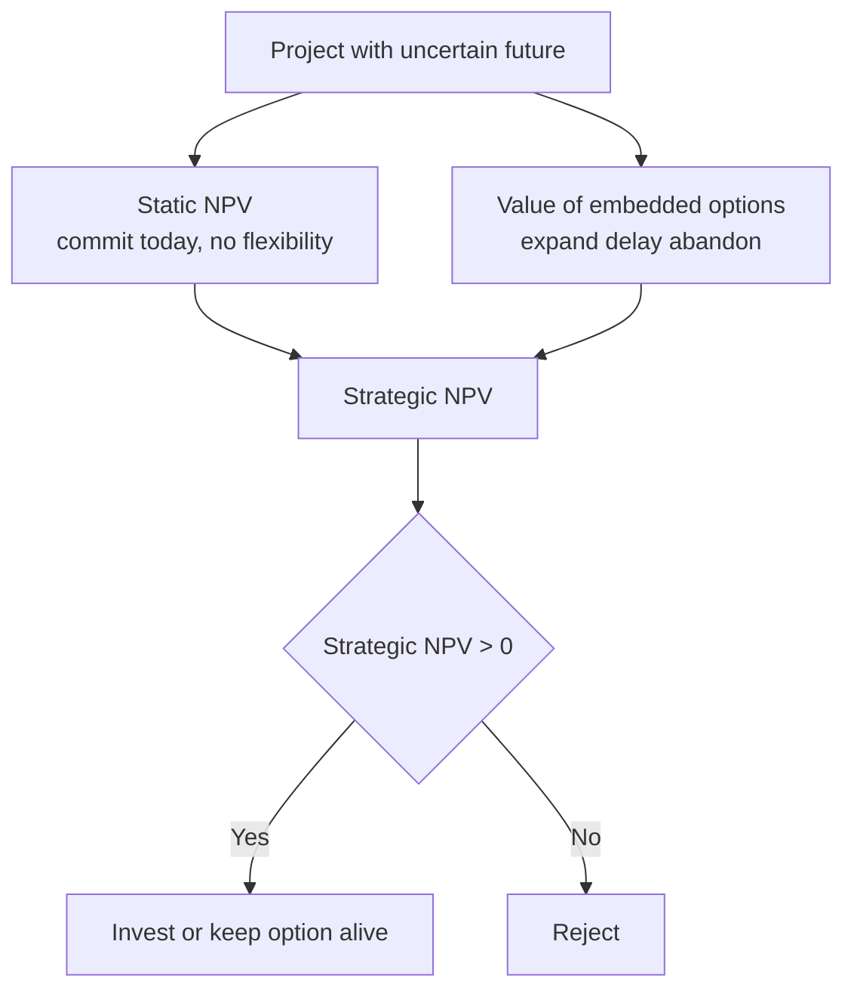
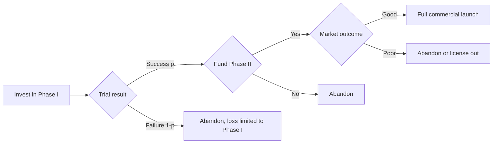
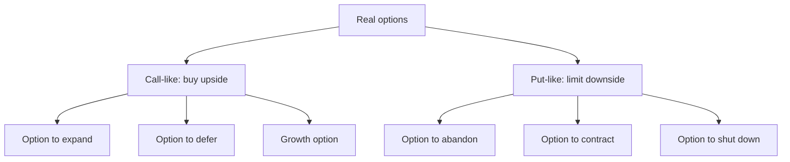

# Real Options & Advanced Capital Budgeting

## The Problem / Why this matters

Classical capital budgeting hands you one instruction: forecast the free cash flows, discount them at a risk-adjusted rate, and if the NPV is positive, invest. It is a clean, defensible rule and it is correct — as far as it goes. The trouble is that the standard NPV calculation quietly assumes that management is a **passive spectator**. It says: we commit today, then the world unfolds, and we sit and collect whatever cash flows the model projected. Fire the arrow, walk away.

Real businesses are nothing like that. A pharma company that funds a Phase II trial is not committing to build a factory — it is buying the *right* to build a factory if the drug works, and the right to walk away if it doesn't. An oil producer with a developed field does not have to pump at a loss; it can shut the wells when crude is cheap and reopen them when prices recover. A retailer opening one store in a new city is not betting the company — it is buying a cheap look at whether the format travels, with the option to roll out 200 stores if it does. In every one of these cases, **managerial flexibility has value**, and a naïve NPV that bakes in a single committed path either ignores that value or, worse, kills good projects because it measures them as if the flexibility didn't exist.

This is where the money is in interviews. Anyone can build a DCF. The candidate who stands out is the one who can look at a DCF and say: "This model is undervaluing the project because it ignores the option to expand," or "The reason this negative-NPV pilot is worth doing is the option value of information." Real-options thinking is the single most reliable way to sound like you understand *strategy* and *finance* at the same time — which is exactly the blend equity research, IB, and corporate development interviewers are screening for.

This chapter also folds in **Adjusted Present Value (APV)**, a valuation method that decomposes a project into its all-equity value plus the value of financing side-effects. APV belongs here because it is the other place where the "single discount rate, static structure" assumption of textbook WACC-NPV breaks down — and interviewers love to probe whether you know *when* WACC quietly lies.

## Core Idea

Here is the whole chapter in three sentences.

1. **A real option is the right, but not the obligation, to take a business action** — expand, delay, contract, abandon, switch — in the future, at terms that are fixed or partly fixed today. Because you only exercise it when it pays, it can only add value, never subtract it.

2. **Standard NPV understates the value of a project whose future is uncertain and whose management can respond to that uncertainty.** The correct value is the *static* (passive) NPV **plus** the value of the embedded options: `Expanded NPV = Static NPV + Option Value`.

3. **APV values a project by adding up its parts** — the value it would have if financed entirely with equity, plus the present value of financing side-effects (mainly the interest tax shield) — instead of cramming everything into one WACC. It is the right tool when leverage changes over the project's life.

Notice the deep symmetry between real options and financial options. A financial call option gives you the right to buy a stock at a strike price; you exercise only if the stock rises above the strike. A real "option to expand" gives you the right to invest more capital (the strike) to get a bigger project (the underlying asset); you exercise only if the project turns out well. The mapping is not a loose metaphor — it is close enough that the same pricing intuition (and sometimes the same formulas) applies.

## Why it works this way — first principles

Why can flexibility only add value? Because an **option is a right, not an obligation**. You will exercise it only in the states of the world where exercising makes you better off, and you will let it lapse everywhere else. The downside is truncated; the upside is kept. Mathematically, the payoff is `max(something, 0)` — and the expected value of a `max(·, 0)` payoff is strictly positive whenever there is any uncertainty and any chance the "something" is positive. Formally, by **Jensen's inequality**, because `max(x, 0)` is a convex function of the uncertain quantity `x`:

```
E[ max(x, 0) ] >= max( E[x], 0 )
```

The left side is what the flexible manager gets (decide *after* seeing the outcome); the right side is what the committed manager gets (decide *now* on the average). The gap between them **is** the option value, and it is driven entirely by uncertainty. Kill the uncertainty (make `x` known) and the two sides collapse to equality — the option is worthless. This is the single most important idea in the chapter and it explains a result that shocks newcomers: **more volatility makes a real option more valuable**, even though volatility is "risk" and risk is supposedly bad. It is bad for a *committed* position and good for an *optional* one, because the option lets you keep the good tail and discard the bad tail.

Why does NPV miss this? Because the DCF machine discounts a *single, pre-committed* stream of expected cash flows. When analysts build scenarios, they typically take a probability-weighted average of cash flows and discount that — which is exactly the right-hand side `max(E[x], 0)`. They average first and decide never; the option value is the difference from deciding-after-averaging. NPV isn't "wrong"; it is answering a different question — "what is this project worth if we commit to the whole plan today?" — and that question has the wrong answer whenever management will, in fact, adapt.

Why does APV exist alongside WACC? Because the WACC method handles financing by *adjusting the discount rate*: it lowers the rate to reflect the tax deductibility of interest, and it assumes the firm keeps a *constant debt-to-value ratio* forever. That assumption is convenient but often false — in an LBO the debt is enormous at close and paid down aggressively; in a project-financed infrastructure asset the debt schedule is fixed in dollars, not as a ratio. When the capital structure is changing, a single WACC is the wrong rate at every point in time. APV sidesteps the problem: value the operating asset as if unlevered (so financing never touches the discount rate), then add the financing benefits separately, each discounted at its own appropriate rate. Same underlying logic — value cash flows at rates that reflect their risk — but the bookkeeping is honest about a moving capital structure.

## Full technical content

### 1. What is a real option, precisely?

A **real option** is the right — without the obligation — to undertake a business decision on a *real* (non-financial) asset. "Real" distinguishes it from a *financial* option written on a security. The core anatomy maps one-for-one onto a financial option:

| Financial option term | Real option analogue |
|---|---|
| Underlying asset (stock) | The project / the PV of the project's operating cash flows |
| Strike / exercise price `K` | The investment cost to exercise (expand, build, etc.) |
| Time to expiry `T` | How long the decision can be deferred |
| Volatility `σ` | Uncertainty in project value / cash flows |
| Risk-free rate `r` | Risk-free rate |
| Dividends / carry | Cash flows or value lost by waiting (e.g. competitors entering) |
| Option premium | The value of the flexibility |

Because you exercise only when favourable, every real option obeys `Value >= 0`.

### 2. The taxonomy of real options

| Option type | The right it confers | It is a … | Payoff at exercise | Typical setting |
|---|---|---|---|---|
| **Option to expand / grow** | Invest more capital to scale up if things go well | Call | `max(V_expansion − K_expand, 0)` | Pilot stores, R&D platforms, modular capacity |
| **Option to delay / defer** | Wait before committing, to learn more | Call | `max(V − K, 0)` at chosen time | Undeveloped land, mineral leases, patents |
| **Option to abandon** | Exit and recover salvage value if things go badly | Put | `max(Salvage − V_continue, 0)` | Capital-intensive, resaleable assets |
| **Option to contract** | Shrink scale, save cost, if demand disappoints | Put | `max(Cost_saved − Value_forgone, 0)` | Outsourcing, modular plants |
| **Option to switch** | Change inputs, outputs, or process | Portfolio of calls/puts | varies | Dual-fuel plants, flexible factories |
| **Option to temporarily shut down** | Halt operations when variable cost > revenue, restart later | Strip of options | `max(Revenue − VarCost, 0)` per period | Mines, oil wells, seasonal plants |
| **Compound options** | Options on options (each stage unlocks the next) | Sequential calls | staged | Multi-phase R&D, staged VC funding |

**Growth (expand)** and **defer** options are *calls* — the right to buy upside for a cost. **Abandon** and **contract** options are *puts* — the right to sell/shrink to protect against downside. Learning this call/put mapping cold is the highest-leverage thing you can memorise for interviews.

### 3. The valuation identity

The central equation of the whole field:

```
Expanded (Strategic) NPV = Static NPV  +  Value of embedded real options
```

- **Static NPV** (also "passive" or "base-case" NPV) = the ordinary DCF assuming you commit today and never adapt.
- **Option value** ≥ 0 always.

So `Strategic NPV ≥ Static NPV` always. A project can have a *negative* static NPV and still be worth doing because the option value more than offsets it — the classic justification for pilots, R&D, and toeholds.

### 4. Three ways to actually value a real option

**(a) Decision trees / decision-tree analysis (DTA).** Map the future as a tree of chance nodes (uncertainty resolves) and decision nodes (management chooses). Roll back from the leaves: at each *decision* node take the `max` over choices; at each *chance* node take the probability-weighted average; discount as you go. Intuitive, handles many-branch problems, communicates beautifully. **Weakness:** it uses a single risk-adjusted discount rate throughout, but flexibility *changes the risk* of the payoff (an option is riskier than its underlying), so DTA can misprice unless you adjust rates — which is fiddly. Great for teaching and for interviews; imperfect for precision.

**(b) Risk-neutral / option-pricing valuation.** Use a binomial lattice or Black–Scholes. Model the *underlying* (project value) as evolving up/down, compute risk-neutral probabilities, and discount option payoffs at the **risk-free rate**. This is theoretically correct because it prices the option by replication/no-arbitrage, sidestepping the "what discount rate?" problem entirely. **Weakness:** requires estimating volatility of project value and assumes you can (conceptually) replicate — heroic for real assets, but the discipline is valuable.

**(c) Simulation (Monte Carlo).** Simulate thousands of paths of the underlying, apply the decision rule on each path, average the payoffs. Flexible for complex, path-dependent options (though American-style early exercise needs techniques like Longstaff–Schwartz).

### 5. The binomial (one-step) model — the workhorse

Let the project value now be `V₀`. Over one period it goes **up** to `V·u` with "real" probability `p`, or **down** to `V·d`, where `u > 1 > d`. The option pays `Cᵤ` in the up state and `C_d` in the down state.

The trick is the **risk-neutral probability** `q` — the probability under which every asset earns the risk-free rate `r`:

```
q = ( (1 + r) − d ) / ( u − d )
```

Then the option value is the risk-neutral expected payoff discounted at the risk-free rate:

```
Option value = [ q · Cᵤ + (1 − q) · C_d ] / (1 + r)
```

Two things to burn into memory: (1) we discount at `r`, **not** a risky rate, because the risk-neutral trick already handled the risk; (2) `q` is a *pricing* device, **not** the real-world probability `p` — do not confuse them.

### 6. Black–Scholes for real options

For a European-style option (single exercise date), map the project onto Black–Scholes:

```
Call value C = S₀ · N(d₁) − K · e^(−rT) · N(d₂)

d₁ = [ ln(S₀ / K) + (r + σ² / 2) · T ] / ( σ · √T )
d₂ = d₁ − σ · √T
```

where `S₀` = PV of the underlying project's cash flows, `K` = investment cost, `T` = time to decide, `σ` = volatility of project value, `r` = risk-free rate, `N(·)` = cumulative standard normal. The put (abandon/contract) follows from put–call parity: `P = C − S₀ + K·e^(−rT)`.

You will rarely be asked to *compute* Black–Scholes by hand in a corporate-finance interview, but you must be able to *name the five inputs and say which way each moves value*:

| Input rises | Call (expand/defer) value | Put (abandon) value |
|---|---|---|
| Underlying value `S₀` | ↑ | ↓ |
| Strike / cost `K` | ↓ | ↑ |
| Volatility `σ` | ↑ | ↑ |
| Time `T` | ↑ | ↑ (usually) |
| Risk-free `r` | ↑ | ↓ |

The volatility row is the interview money-shot: **more uncertainty raises option value on both calls and puts.**

### 7. When real-options thinking actually matters

Real-options analysis is not free — it is complex and easy to abuse. It earns its keep only when **all three** conditions hold:

1. **Genuine uncertainty** — the future is materially unknown (high `σ`). No uncertainty, no option value.
2. **Managerial flexibility** — you can actually respond (delay, expand, abandon) and are not contractually locked in. A right you cannot exercise is worthless.
3. **Information arrives over time** — you learn something *before* you must decide, and that learning is decision-relevant.

Where the static NPV is *strongly* positive or *strongly* negative, options rarely change the decision — just invest or don't. Real-options thinking matters most **at the margin**, where static NPV is near zero, uncertainty is high, and the flexibility is real: R&D, natural resources, technology platforms, staged expansion, real estate.

### 8. Adjusted Present Value (APV)

APV values a levered project by **separating operations from financing**:

```
APV = Base-case NPV (all-equity financed)  +  PV of financing side-effects
```

The dominant side-effect is the **interest tax shield**; others include issuance costs, subsidised loans, and costs of financial distress.

**Step 1 — Base-case (unlevered) value.** Discount the project's free cash flows at the **unlevered cost of equity** `r_U` (the "asset" or "all-equity" cost of capital — the return the assets would demand if the firm had no debt):

```
Base NPV = Σ  FCFₜ / (1 + r_U)ᵗ   −  Initial investment
```

**Step 2 — Value the tax shield.** If interest in year *t* is `Iₜ` and the tax rate is `T_c`, the shield is `T_c · Iₜ`. Discount it at a rate reflecting its risk — commonly `r_D` (debt is safe-ish) or `r_U`:

```
PV(tax shield) = Σ  (T_c · Iₜ) / (1 + r_D)ᵗ
```

For **perpetual, fixed** debt `D`, this collapses to the famous:

```
PV(tax shield) = T_c · D
```

**Step 3 — Add the other side-effects** (issuance costs as a negative, subsidy benefits as a positive, expected distress costs as a negative) and sum:

```
APV = Base NPV + PV(tax shield) + PV(subsidies) − Issuance costs − PV(distress costs)
```

**APV vs WACC — the decision rule for interviews:**

| Use **WACC-NPV** when | Use **APV** when |
|---|---|
| Capital structure (D/V) is roughly **constant** | Capital structure is **changing** over time |
| Mature, stable firm | LBOs, project finance, staged deals |
| You want one clean number | You want to see *where* value comes from |
| Debt grows with firm value | Debt is a fixed dollar schedule being paid down |

They give the **same answer** when assumptions are consistent (constant leverage, shield discounted at the right rate). APV is more transparent and more robust to changing leverage — which is why LBO and project-finance shops favour it.

### 9. Diagrams

The relationship between the two NPVs and the driver of the wedge:



A decision tree for a staged R&D investment (a compound option):



The call/put map of the option taxonomy:



APV decomposition:


## Worked examples

### Example 1 — Option to abandon (a put), via a two-step decision tree

**Setup.** A shipping firm invests **$100m** today in a specialised vessel. In one year, demand resolves:
- **Good market (prob 0.5):** the project's continuing value (PV of future cash flows) is **$140m**.
- **Bad market (prob 0.5):** continuing value is only **$60m**.

The vessel can be **sold for $90m salvage** at the end of year 1 (the abandonment option). The risk-adjusted discount rate is **10%**.

**Step 1 — Static NPV (no abandonment).** You are forced to keep the vessel in both states.

```
E[value in 1yr] = 0.5 × 140 + 0.5 × 60 = 70 + 30 = 100
Static NPV = 100 / 1.10 − 100 = 90.91 − 100 = −9.09m
```

Naïve NPV says **reject** (−$9.09m).

**Step 2 — Value with the abandonment option.** In each state, management takes `max(continue, salvage)`:
- Good: `max(140, 90) = 140` (keep it).
- Bad: `max(60, 90) = 90` (**abandon**, take salvage).

```
E[value with option] = 0.5 × 140 + 0.5 × 90 = 70 + 45 = 115
Strategic NPV = 115 / 1.10 − 100 = 104.55 − 100 = +4.55m
```

**Step 3 — Isolate the option value.**

```
Option to abandon = Strategic NPV − Static NPV = 4.55 − (−9.09) = 13.64m
```

Check directly: the option pays `max(90 − 60, 0) = 30` only in the bad state.
`PV = 0.5 × 30 / 1.10 = 15 / 1.10 = 13.64m`. ✓ Consistent.

**Punchline for interview:** "Static NPV is −$9m so a naïve analyst rejects it. But the $90m salvage floor is a put option worth $13.6m — it turns a reject into a +$4.5m accept. The flexibility, not the base case, is what makes the project."

### Example 2 — Option to expand (a growth option), binomial risk-neutral pricing

**Setup.** A retailer opens **one pilot store** for **$10m**. The pilot itself is expected to be roughly break-even (small negative static NPV of **−$0.5m**), but success would let the firm roll out a **large expansion** in one year. The expansion:
- Costs **$60m** to build (the strike `K`).
- If the format works (**up state**), the expansion is worth **$100m**.
- If it flops (**down state**), the expansion is worth **$40m**.

Underlying (expansion project value) today `V₀ = $50m`. One-year factors: `u = 2.0` (→$100m), `d = 0.8` (→$40m). Risk-free rate `r = 5%`.

**Step 1 — Risk-neutral probability.**

```
q = ((1 + r) − d) / (u − d) = (1.05 − 0.8) / (2.0 − 0.8) = 0.25 / 1.20 = 0.2083
```

**Step 2 — Option payoffs at expiry** (`max(V − K, 0)`):

```
Up:   max(100 − 60, 0) = 40
Down: max(40 − 60, 0)  = 0
```

**Step 3 — Value the expansion (call) option.**

```
Call = [ q × 40 + (1 − q) × 0 ] / (1 + r)
     = [ 0.2083 × 40 ] / 1.05
     = 8.333 / 1.05
     = 7.94m
```

**Step 4 — Total strategic value of the pilot.**

```
Strategic NPV = Pilot static NPV + Expansion option
              = −0.5 + 7.94 = +7.44m
```

**Punchline:** "The pilot loses $0.5m on its own, so a static DCF kills it. But the pilot *buys* a growth option worth ~$7.9m — the right, not obligation, to invest $60m for a project that could be worth $100m. Net, the pilot creates $7.4m of value. This is why companies run 'unprofitable' pilots."

### Example 3 — Option to delay, and the same project valued by APV

**Part A — Option to delay (defer).** A developer holds land and can build now or wait one year.
- Build now: project worth `V₀ = $200m`, cost `K = $180m` → static NPV `= 200 − 180 = $20m`.
- Wait one year: value evolves to **$260m (up)** or **$150m (down)**; construction cost stays $180m; `r = 6%`.
- `u = 1.30`, `d = 0.75`.

Risk-neutral probability:

```
q = (1.06 − 0.75) / (1.30 − 0.75) = 0.31 / 0.55 = 0.5636
```

Payoffs from waiting (`max(V − 180, 0)`):

```
Up:   max(260 − 180, 0) = 80
Down: max(150 − 180, 0) = 0
```

Value of the option to wait:

```
= [0.5636 × 80 + 0.4364 × 0] / 1.06 = 45.09 / 1.06 = 42.54m
```

Since **$42.5m (wait) > $20m (build now)**, the developer should **not build yet** — the deferral option is worth more than immediate exercise, even though building now is already positive-NPV. Waiting preserves the ability to avoid the down state. (The gap, ~$22.5m, is the pure timing/flexibility premium.)

**Part B — APV of the "build now" project with leverage.** Suppose the developer funds the $180m build with **$100m of debt at 7%**, tax rate **T_c = 25%**, project life 3 years, debt held flat then repaid at year 3, unlevered cost of equity `r_U = 12%`. The unlevered free cash flows are $70m, $80m, $90m in years 1–3 (these discount to the $200m base value; using them here for illustration).

**Step 1 — Base-case NPV** (discount FCF at `r_U = 12%`):

```
PV = 70/1.12 + 80/1.12² + 90/1.12³
   = 62.50 + 63.78 + 64.06 = 190.34
Base NPV = 190.34 − 180 = 10.34m
```

**Step 2 — PV of interest tax shield** (interest = 7% × $100m = $7m/yr; shield = 25% × 7 = $1.75m/yr; discount at r_D = 7%):

```
PV(shield) = 1.75/1.07 + 1.75/1.07² + 1.75/1.07³
           = 1.636 + 1.529 + 1.429 = 4.59m
```

**Step 3 — APV.**

```
APV = Base NPV + PV(shield) = 10.34 + 4.59 = 14.93m
```

**Punchline:** "The all-equity project is worth $10.3m; the $100m of debt adds $4.6m of tax-shield value, so the levered project is worth $14.9m by APV. APV shows me *exactly* how much of the value comes from operations versus financing — a WACC-NPV would blend them into one number and hide it."

*Self-check on APV vs WACC:* if instead we'd computed a WACC using D/V based on these values and discounted the FCFs, we'd land near the same $14.9m provided leverage were held at a constant ratio — but because the debt here is a fixed $100m being repaid on a schedule (not a constant ratio), APV is the cleaner, more accurate tool. That mismatch is the whole reason to reach for APV.

## How it is tested in interviews

**Q1. "Your DCF says a project is slightly negative-NPV, but the team wants to do it. How can that be rational?"**
> Model answer: "Because a static DCF ignores managerial flexibility. If the project embeds real options — say the option to expand if it works, or to abandon if it doesn't — the true value is `Static NPV + Option Value`, and the option value can more than offset a negative base case. Pilots, R&D, and toeholds are usually negative-NPV on a standalone basis precisely because their value *is* the option they create." Crisp line: **"You're not buying the cash flows, you're buying the right to the cash flows."**

**Q2. "Name the real options in a project and tell me which are calls and which are puts."**
> "Options to *expand, defer, and grow* are **calls** — you pay a strike to capture upside. Options to *abandon and contract* are **puts** — you protect the downside. Switching options are portfolios of both." Interviewers just want the clean call/put mapping delivered without hesitation.

**Q3. "Does higher uncertainty make a project more or less attractive?"**
> "For a *committed* position, more risk is bad. But if the project contains real options, higher volatility *raises* their value — a call and a put both get more valuable as `σ` rises, because the option keeps the good tail and discards the bad one. So uncertainty can make an *optioned* project more attractive." This is the answer that separates memorisers from understanders.

**Q4. "How does a real option map to Black–Scholes?"**
> "Underlying `S` = PV of the project; strike `K` = investment cost; time `T` = how long you can wait; `σ` = uncertainty in project value; `r` = risk-free. A growth option is a call on the project." Bonus: name that **you discount at the risk-free rate under risk-neutral pricing**, because replication removes the risk-premium question.

**Q5. "When would you use APV instead of WACC?"**
> "When leverage changes over the life of the deal — LBOs, project finance, anything with a debt paydown schedule. WACC assumes a *constant* D/V ratio; when that's false, a single WACC is the wrong rate. APV values the unlevered business at `r_U` and adds the tax shield separately, so it stays correct as the capital structure moves and shows exactly where value comes from." Crisp line: **"WACC hides financing in the discount rate; APV puts it on its own line."**

**Q6. "Walk me through valuing an abandonment option." (numerical)**
> Reproduce Example 1's logic verbally: compute static NPV, then at each future node take `max(continue, salvage)`, re-average, discount, and the difference is the option value. Interviewers care that you take the `max` *after* uncertainty resolves, not before.

**Q7. "Why can't standard NPV capture this — isn't scenario analysis enough?"**
> "Scenario analysis averages cash flows and *then* discounts — it decides on the average and never adapts. Real-options valuation lets you decide *after* seeing each outcome, taking the `max` at every decision node. By Jensen's inequality, `E[max(x,0)] ≥ max(E[x],0)` — the gap is the option value scenario analysis throws away."

**Q8. "What's the risk-neutral probability and why do we use it?"**
> "`q = ((1+r) − d)/(u − d)`. It's the probability under which the underlying earns the risk-free rate, so we can value the option by no-arbitrage replication and discount at `r`. It is *not* the real-world probability — it's a pricing device that lets us dodge the impossible question of what risk premium an option deserves."

## Traps & common mistakes

- **Confusing risk-neutral `q` with the real probability `p`.** `q` is a pricing construct; `p` never enters the option value in a binomial model. Mixing them is an instant red flag.
- **Discounting the option payoff at a risky rate under risk-neutral pricing.** Once you use `q`, you *must* discount at the risk-free rate. Using WACC double-counts risk.
- **Averaging before deciding.** Taking `E[cash flows]` and discounting = static NPV. The option value only appears if you take `max(·)` at each decision node *after* uncertainty resolves.
- **Claiming option value where there is no flexibility or no uncertainty.** If management is contractually locked in, or the outcome is certain, option value is zero. Don't sprinkle "real options" on every project to justify it — that's how the concept gets abused.
- **Forgetting that waiting has a cost.** Deferral options aren't free: competitors enter, cash flows are forgone, patents expire. These are the "dividends" that reduce a call's value and can make immediate exercise optimal.
- **Ignoring that more volatility raises option value.** Newcomers instinctively penalise risky projects; with embedded options, higher `σ` is *good*.
- **Using one WACC when leverage is changing.** In an LBO the D/V ratio plummets as debt is repaid — a constant WACC misprices it. Reach for APV.
- **Discounting the tax shield at the wrong rate in APV.** Match the discount rate to the shield's risk: use `r_D` if the debt (hence the shield) is fixed and safe, `r_U` if the shield's risk tracks the assets. State your assumption.
- **Double-counting the shield.** If you discount FCFs at WACC (which already contains the after-tax cost of debt) *and* add a separate tax shield, you've counted it twice. WACC-NPV and APV are alternatives, not additive.
- **Treating decision-tree analysis as exact.** DTA uses one risk-adjusted rate throughout, but flexibility changes risk — DTA is great for intuition and communication, but risk-neutral/option pricing is the theoretically clean method.

## First-principles recap

- An option is a **right, not an obligation**, so its payoff is `max(·, 0)` — it can only add value; the downside is truncated, the upside kept.
- By **Jensen's inequality**, `E[max(x,0)] ≥ max(E[x],0)`: deciding *after* uncertainty resolves beats deciding on the average — and the gap **is** the option value.
- **`Strategic NPV = Static NPV + Option Value`.** A negative static NPV can be a great investment if the embedded options are worth more than the shortfall.
- **Volatility raises option value** for both calls and puts, because the option discards the bad tail — the one place in finance where more risk is unambiguously good.
- Real-options thinking matters only when **uncertainty, flexibility, and learning-over-time** all coexist; otherwise just use NPV.
- **Risk-neutral pricing** values options by replication and discounts at the **risk-free rate**; the risk-neutral probability `q` is a pricing device, not a forecast.
- **APV = unlevered value + financing side-effects.** It beats WACC when leverage changes, because it never hides financing inside the discount rate.

## Quick-reference

| Concept | Formula / rule |
|---|---|
| Strategic value | `Strategic NPV = Static NPV + Option Value` |
| Option value floor | `Option Value ≥ 0` always |
| Jensen (why options add value) | `E[max(x,0)] ≥ max(E[x],0)` |
| Risk-neutral probability | `q = ((1+r) − d) / (u − d)` |
| Binomial option value | `[q·Cᵤ + (1−q)·C_d] / (1+r)` |
| Black–Scholes call | `C = S₀·N(d₁) − K·e^(−rT)·N(d₂)` |
| `d₁`, `d₂` | `d₁ = [ln(S₀/K)+(r+σ²/2)T]/(σ√T)`; `d₂ = d₁ − σ√T` |
| Put–call parity | `P = C − S₀ + K·e^(−rT)` |
| Expand / defer / growth | **Call** — `max(V − K, 0)` |
| Abandon / contract | **Put** — `max(K − V, 0)` |
| Volatility effect | ↑σ ⇒ ↑ value (calls **and** puts) |
| APV | `APV = Base NPV + PV(tax shield) + subsidies − issuance − distress` |
| Base NPV | discount FCF at unlevered `r_U` |
| Tax shield (annual) | `T_c × Interest`, discounted at `r_D` (or `r_U`) |
| Tax shield (perpetual fixed debt) | `T_c × D` |
| Use APV when | leverage **changes** (LBOs, project finance) |
| Use WACC when | leverage (D/V) is roughly **constant** |
| Real options matter when | uncertainty **and** flexibility **and** learning all present |
