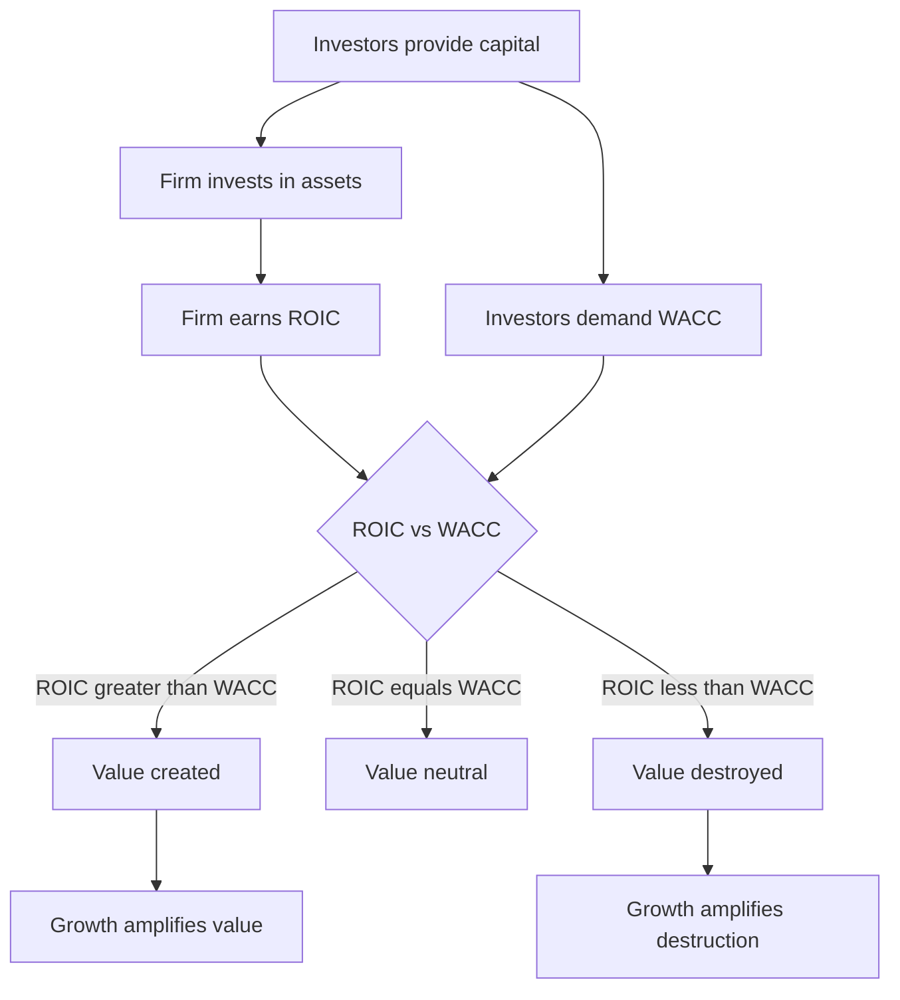
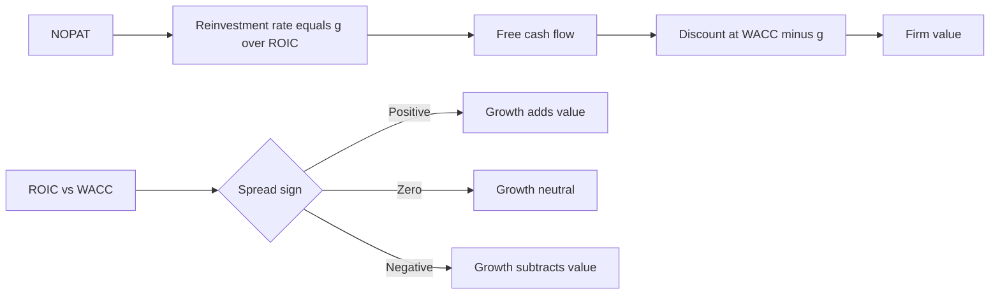
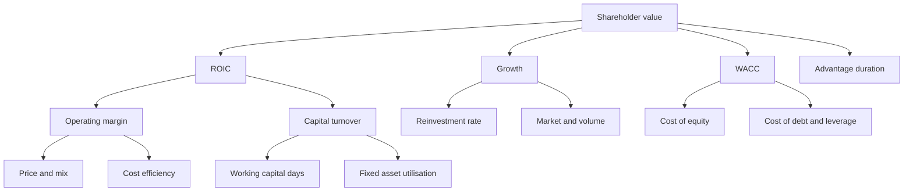

# Value Creation: ROIC vs WACC & EVA

## The Problem / Why this matters

Two companies both grow revenue 15% a year. Both grow earnings per share (EPS) 15% a year. Both look identical on a growth screen. Yet over five years one triples its share price and the other goes nowhere. What separates them?

The answer is the single most important idea in corporate finance, and the one most badly-run companies (and most weak interview candidates) get wrong: **growth is only valuable when the return on the capital invested to fund that growth exceeds the cost of that capital.** Growth itself is neither good nor bad. Growth is a *multiplier*. It multiplies value creation when returns beat the cost of capital, and it multiplies value *destruction* when they don't.

This chapter is the capstone of the corporate-finance sequence. Everything you learned earlier — the weighted average cost of capital (WACC), free cash flow, return on invested capital (ROIC), the DCF — comes together here into one governing relationship:

> **A company creates shareholder value if and only if ROIC > WACC.**

If you internalise this one inequality and everything that flows from it — the ROIC-WACC *spread*, the interaction between spread and growth, economic value added (EVA), the value-driver tree — you will be able to answer the "why" behind almost any valuation, capital-allocation, or strategy question an interviewer throws at you. Equity-research analysts use it to explain why one stock trades at 25x earnings and its competitor at 9x. Credit analysts use its cousin (returns vs cost of debt) to judge whether a borrower is compounding or slowly liquidating. FP&A teams use it to decide which projects and business units deserve capital. Investment bankers use it to argue why a merger or a buyback creates or destroys value. It is, quite literally, the theory of what a business is *for*.

This chapter builds the whole edifice from first principles and then shows you exactly how it is tested.

## Core Idea

Strip away the jargon and the idea is almost embarrassingly simple. A business does one thing: it raises money from investors (debt and equity), invests that money in assets (factories, inventory, receivables, brands, people), and earns a return on those assets.

- The **return** it earns on the invested money is **ROIC** — return on invested capital.
- The **cost** of that money — what debt and equity investors collectively demand — is **WACC** — the weighted average cost of capital.

Value creation is the arbitrage between the two:

- If ROIC > WACC, every rupee invested earns more than it costs. The business is a value-creation machine. Growth pours fuel on the fire — the faster it invests, the more value it creates.
- If ROIC = WACC, the business earns exactly its cost of capital. It is running to stand still. Growth is *value-neutral* — it adds size but not value. A rupee invested is worth exactly a rupee.
- If ROIC < WACC, every rupee invested earns less than it costs. The business destroys value. Now growth is *toxic* — the faster it grows, the more value it burns. Such a company should shrink, return cash, or fix its returns.

**EVA (Economic Value Added)** simply puts a rupee figure on this spread for a single period:

> EVA = (ROIC − WACC) × Invested Capital = a rupee measure of value created this year, after paying *all* providers of capital, including equity.

The spread (ROIC − WACC) is the *rate* of value creation. Multiply it by the capital base and you get the *rupee amount* of value created. Grow the capital base at that spread and you get the *stream* of value creation, whose present value is the company's competitive-advantage-driven worth above its invested capital.

That's the whole chapter in four sentences. The rest is making it rigorous and interview-ready.

## Why it works this way — first principles

Let's derive the ROIC > WACC rule from the ground up, because interviewers love to ask "*why*, prove it to me."

**Step 1 — What investors demand.** Anyone who gives capital to a firm has an *opportunity cost*: they could have invested elsewhere at similar risk. WACC is precisely the return investors could earn on an equally-risky alternative. It is the *hurdle rate*, the minimum acceptable return. This is not an accounting cost you'll find on the income statement — the cost of *equity* never appears in reported profit. That omission is the whole reason a company can report positive net income and still be destroying value.

**Step 2 — What the firm earns.** ROIC measures the after-tax operating return the firm actually generates per rupee of capital tied up in the business:

$$\text{ROIC} = \frac{\text{NOPAT}}{\text{Invested Capital}}$$

where NOPAT = net operating profit after tax = EBIT × (1 − tax rate). NOPAT is the profit the operations throw off *before* any financing choices — it belongs to *all* capital providers.

**Step 3 — The comparison is the point.** Investors handed over capital expecting WACC. The firm delivered ROIC. The difference, per rupee, is the value created (or destroyed) for each rupee of capital:

$$\text{Value spread} = \text{ROIC} - \text{WACC}$$

If the firm earns 15% on capital that costs 10%, it is generating a 5-percentage-point surplus over what investors could have earned themselves. That surplus is *economic profit* — profit above and beyond the opportunity cost of capital. Accounting profit can be positive while economic profit is negative; only economic profit signals genuine value creation.

**Step 4 — Why growth amplifies.** Take the classic value-of-growth intuition. A firm reinvests a fraction of its profits (the *reinvestment rate*) back into the business. Those reinvested rupees earn ROIC. If ROIC > WACC, each reinvested rupee is worth more than a rupee (it produces a stream of surplus returns whose present value exceeds the rupee invested), so shovelling more rupees in — i.e. growing faster — increases value. If ROIC < WACC, each reinvested rupee is worth less than a rupee, so growth *reduces* value. This is why growth is a multiplier, not a virtue.

We can make this exact. In a stable-growth world, firm value equals:

$$\text{Value} = \frac{\text{NOPAT} \times \left(1 - \dfrac{g}{\text{ROIC}}\right)}{\text{WACC} - g}$$

The term $g/\text{ROIC}$ is the reinvestment rate (to grow NOPAT at rate g you must reinvest $g/\text{ROIC}$ of it). Stare at this formula and the whole chapter falls out:

- If ROIC = WACC, the equation collapses to Value = NOPAT / WACC, *independent of g*. Growth adds nothing. Proof, not assertion, that value-neutral growth exists.
- If ROIC > WACC, raising g raises value.
- If ROIC < WACC, raising g *lowers* value.

We derive this formula in the technical section. It is the mathematical heart of value-based management, and being able to sketch it in an interview marks you out instantly.

**Step 5 — Why the spread eventually fades.** Excess returns (ROIC > WACC) attract competition. Rivals copy the product, undercut the price, and bid away the surplus. In the very long run, in a competitive industry, ROIC is dragged toward WACC and the spread → 0. The *duration* of the spread — how long a firm can hold ROIC above WACC — is set by its *competitive advantage* (its "moat"). Value, then, is a function of three things: the **size** of the spread, the **amount** of capital you can deploy at that spread, and the **duration** over which the spread persists. Warren Buffett's entire philosophy — wide moats, high returns on capital, long runways for reinvestment — is nothing but this sentence.

## Full technical content

### 1. Invested Capital — the denominator

Everything starts with **Invested Capital (IC)**: the total capital investors have tied up in the *operations* of the business. Two equivalent routes to it:

**Financing (right-hand-side) approach:**

$$\text{IC} = \text{Total Debt} + \text{Equity} + \text{Minority Interest} - \text{Cash and Equivalents}$$

(We subtract excess cash because idle cash isn't operating capital; more precisely, subtract non-operating cash.)

**Operating (left-hand-side / asset) approach:**

$$\text{IC} = \text{Net Working Capital} + \text{Net PP\&E} + \text{Other Operating Assets} - \text{Other Operating Liabilities}$$

where Net Working Capital = (Operating Current Assets − Operating Current Liabilities), excluding cash and short-term debt.

Both routes must reconcile — the money raised (financing side) equals the money deployed (operating side). A common interview curveball: "Should goodwill be in invested capital?" Answer: it depends on the question. *Including* goodwill measures the return to shareholders on what they actually paid (acquisitions included) — good for judging whether the firm created value net of acquisition premiums. *Excluding* goodwill measures the operating performance of the underlying assets — good for judging operational quality and comparing against peers. State the distinction; that's the mark of someone who's done it for real.

### 2. NOPAT — the numerator

**NOPAT (Net Operating Profit After Tax)** is the after-tax profit generated by operations, *before* financing costs:

$$\text{NOPAT} = \text{EBIT} \times (1 - \text{tax rate})$$

Key properties:
- It is *capital-structure-neutral*. It ignores interest expense entirely, so two firms with identical operations but different leverage have the same NOPAT. This is deliberate — the *financing* decision is captured in WACC, not in NOPAT. Never double-count leverage.
- The tax rate used is usually the *marginal cash tax rate* or a normalised effective rate, applied to EBIT (sometimes called "cash taxes on EBIT" or NOPLAT — net operating profit less adjusted taxes; the terms are near-synonyms in practice).
- Because we tax EBIT directly, we deliberately ignore the interest tax shield here — that shield is picked up by using the *after-tax* cost of debt inside WACC. Again: no double counting.

### 3. ROIC — putting it together

$$\boxed{\text{ROIC} = \frac{\text{NOPAT}}{\text{Invested Capital}} = \frac{\text{EBIT} \times (1 - t)}{\text{Debt} + \text{Equity} - \text{Cash}}}$$

Convention note: use *average* invested capital (beginning + ending)/2 when the capital base is moving materially, or beginning-of-period capital (returns are earned over the year on capital that was in place at the start). Be consistent and state your convention.

ROIC decomposes into a DuPont-style identity that is pure interview gold:

$$\text{ROIC} = \underbrace{\frac{\text{NOPAT}}{\text{Sales}}}_{\text{operating margin}} \times \underbrace{\frac{\text{Sales}}{\text{Invested Capital}}}_{\text{capital turnover}}$$

Value can be built two ways: fat margins (a luxury brand — high margin, modest turns) or fast turns (a discount retailer — thin margin, rapid turns). Both can clear the WACC hurdle. This decomposition is the bridge from strategy to returns.

### 4. WACC — the hurdle

$$\text{WACC} = \frac{E}{V} \cdot k_e + \frac{D}{V} \cdot k_d \cdot (1 - t)$$

where E = market value of equity, D = market value of debt, V = E + D, $k_e$ = cost of equity (usually from CAPM: $k_e = r_f + \beta(r_m - r_f)$), $k_d$ = pre-tax cost of debt, and t = tax rate. WACC is covered in depth in its own chapter; here it is simply the *bar* ROIC must clear. Crucially, WACC includes the cost of *equity*, which never appears on the income statement — that's why economic profit differs from accounting profit.

### 5. The value spread and its meaning

$$\text{Value spread} = \text{ROIC} - \text{WACC}$$

| Spread | Interpretation | What growth does | What management should do |
|---|---|---|---|
| ROIC − WACC > 0 | Value-creating; earns economic profit | Amplifies value creation | Grow, reinvest aggressively, protect the moat |
| ROIC − WACC = 0 | Value-neutral; earns exactly cost of capital | Adds size, not value | Grow only if strategically necessary; else return cash |
| ROIC − WACC < 0 | Value-destroying; earns economic loss | Amplifies value destruction | Shrink, fix returns, divest, or return cash |

### 6. EVA — Economic Value Added

EVA (a trademarked refinement of *residual income*, popularised by Stern Stewart & Co.) converts the spread into a single-period rupee amount:

$$\boxed{\text{EVA} = (\text{ROIC} - \text{WACC}) \times \text{Invested Capital}}$$

Equivalently, since ROIC × IC = NOPAT and WACC × IC = the total rupee cost of capital (the "capital charge"):

$$\text{EVA} = \text{NOPAT} - (\text{WACC} \times \text{Invested Capital}) = \text{NOPAT} - \text{Capital Charge}$$

The genius of EVA is the **capital charge** — WACC × IC. Ordinary accounting subtracts the cost of debt (interest) but *never* the cost of equity. EVA subtracts a charge for *all* capital, equity included. A firm with positive net income but EVA < 0 is quietly destroying shareholder value: it is earning a profit for the accountant but a loss for the economist, because it hasn't covered what equity holders demanded.

**Residual Income** is the more general, equity-level version of the same idea:

$$\text{Residual Income} = \text{Net Income} - (k_e \times \text{Equity})$$

Here we work at the equity level (net income, cost of equity, book equity) rather than the firm level (NOPAT, WACC, invested capital). EVA is the firm-level, whole-capital analogue. Both say the same thing: *charge for equity, then see what's left.* In equity research the residual-income model gives an alternative valuation that anchors to book value and doesn't depend on a terminal-value guess as heavily as DCF.

**Market Value Added (MVA)** connects EVA to the stock price. MVA is the present value of all future EVAs:

$$\text{MVA} = \sum_{t=1}^{\infty} \frac{\text{EVA}_t}{(1 + \text{WACC})^t} = \text{Market Value of Firm} - \text{Invested Capital}$$

This is a profound identity: **the premium a company's market value carries over the capital invested in it is exactly the present value of its future economic profits.** A company trading far above its invested capital is one the market expects to earn ROIC > WACC for years. A company trading below invested capital is expected to destroy value. This is why "the market prices the spread, not the growth."

### 7. Deriving the value-of-growth formula

Start from the constant-growth free-cash-flow (FCFF) DCF:

$$\text{Value} = \frac{\text{FCFF}_1}{\text{WACC} - g}$$

Free cash flow to the firm equals NOPAT minus net reinvestment:

$$\text{FCFF} = \text{NOPAT} - \text{Reinvestment} = \text{NOPAT} \times (1 - \text{RR})$$

where RR is the reinvestment rate. Now the crucial link: to grow NOPAT at rate g, you must reinvest enough capital, and reinvested capital earns ROIC, so:

$$g = \text{RR} \times \text{ROIC} \quad\Longrightarrow\quad \text{RR} = \frac{g}{\text{ROIC}}$$

Substitute:

$$\boxed{\text{Value} = \frac{\text{NOPAT} \times \left(1 - \dfrac{g}{\text{ROIC}}\right)}{\text{WACC} - g}}$$

This is the master equation. Some observations that interviewers probe:

- Set ROIC = WACC: numerator becomes NOPAT(1 − g/WACC) = NOPAT(WACC − g)/WACC, and dividing by (WACC − g) gives **Value = NOPAT/WACC**, independent of g. Growth is worthless when ROIC = WACC.
- The value of a firm can be split into: **value of assets in place** + **value of growth**. Growth contributes positively only when ROIC > WACC.
- The higher the ROIC, the *lower* the reinvestment needed for a given g — so high-ROIC firms are also *capital-light* growers, which is doubly attractive (they throw off more free cash while growing).

### 8. The value-driver tree

Every driver of shareholder value can be traced back to just a handful of levers. The *value-driver tree* decomposes value from the top (share price / enterprise value) down to operational levers a manager can actually pull. This is the master map FP&A and strategy teams use to connect a warehouse manager's inventory-days target to the CEO's share price.

At the top, firm value depends on four master value drivers:

1. **NOPAT / operating margin** — how profitable each rupee of sales is.
2. **Invested capital / capital efficiency** — how much capital is tied up per rupee of sales (working-capital days, asset turnover).
3. **Growth (g)** — how fast NOPAT compounds.
4. **WACC** — the discount rate / risk.

And the meta-driver behind them all: the **duration of competitive advantage** — how long ROIC stays above WACC.

Reading the tree: to lift the share price you either widen margin (raise price, improve mix, cut cost), spin capital faster (cut inventory and receivable days, sweat the assets), grow profitably (only while ROIC > WACC), lower risk (reduce WACC), or extend the moat. Every corporate initiative — a pricing project, a lean-inventory program, an R&D bet, a refinancing — maps onto exactly one branch of this tree. That mapping is what "value-based management" means in practice.

### 9. Connecting operating performance to shareholder value — the capstone

Here is the full causal chain, the thing this entire corporate-finance sequence has been building toward:

**Operations → NOPAT and Invested Capital → ROIC → (compared to WACC) → economic profit / EVA → discounted over the advantage period → MVA → market value → share price.**

A frontline improvement — say, cutting inventory days from 60 to 45 — reduces invested capital, which raises ROIC (same NOPAT, smaller denominator), which widens the spread over WACC, which increases EVA, which — capitalised over the years the advantage persists — lifts MVA and hence the share price. The value-driver tree is the wiring diagram; ROIC vs WACC is the switch that determines whether current flows toward value or away from it; EVA is the ammeter that measures it each period; MVA is the accumulated charge visible in the share price.

This is why elite analysts don't just ask "is it growing?" They ask: "*What is the ROIC, is it above WACC, is the spread widening or narrowing, how long can it last, and how much capital can be deployed at that spread?*" Answer those and you've valued the business.

## Worked examples

### Example 1 — The two identical-growth companies (why spread is everything)

Two firms, **Alpha** and **Beta**, each start with Invested Capital of ₹1,000 and NOPAT of ₹150. Both reinvest to grow NOPAT at g = 6% per year. Both face WACC = 10%. The only difference: Alpha earns ROIC = 15%, Beta earns ROIC = 7.5%. Value them.

**Alpha (ROIC 15% > WACC 10%):**
- Reinvestment rate RR = g/ROIC = 6%/15% = 0.40, so 40% of NOPAT is reinvested.
- FCFF₁ = NOPAT × (1 − RR) grown one year... use the master formula directly with current NOPAT ₹150:
- Value = NOPAT × (1 − g/ROIC) / (WACC − g) = 150 × (1 − 0.40) / (0.10 − 0.06) = 150 × 0.60 / 0.04 = 90 / 0.04 = **₹2,250**.

**Beta (ROIC 7.5% < WACC 10%):**
- RR = g/ROIC = 6%/7.5% = 0.80, so it must reinvest 80% of NOPAT to hit the same growth.
- Value = 150 × (1 − 0.80) / (0.10 − 0.06) = 150 × 0.20 / 0.04 = 30 / 0.04 = **₹750**.

**Result.** Same NOPAT (₹150), same growth (6%), same WACC (10%) — yet Alpha is worth **₹2,250** and Beta only **₹750**, a 3x difference. Alpha trades at 2.25x invested capital (MVA = +₹1,250); Beta trades at 0.75x invested capital (MVA = −₹250, i.e. it is worth *less* than the capital sunk into it).

**The killer insight for interviews:** Beta has to reinvest *twice as much* of its profit to achieve the *same* growth, because its low ROIC makes growth expensive — and even then that growth destroys value because ROIC < WACC. If Beta stopped growing entirely (g = 0), its value would be NOPAT/WACC = 150/0.10 = ₹1,500 — *double* the ₹750 it's worth while growing. **For Beta, growth is actively destroying ₹750 of value.** That is the whole chapter in one number.

### Example 2 — Full EVA / MVA computation

**Zenith Manufacturing.** From the financials:
- EBIT = ₹500; tax rate t = 30%.
- Total debt = ₹1,200; equity (book) = ₹1,800; cash = ₹200.
- WACC = 11%.

**Step 1 — NOPAT.** NOPAT = EBIT × (1 − t) = 500 × 0.70 = **₹350**.

**Step 2 — Invested Capital.** IC = Debt + Equity − Cash = 1,200 + 1,800 − 200 = **₹2,800**.

**Step 3 — ROIC.** ROIC = NOPAT / IC = 350 / 2,800 = **12.5%**.

**Step 4 — Spread.** ROIC − WACC = 12.5% − 11% = **+1.5%**. Value-creating, but only just.

**Step 5 — Capital charge.** WACC × IC = 0.11 × 2,800 = **₹308**.

**Step 6 — EVA.** EVA = NOPAT − Capital Charge = 350 − 308 = **₹42**. Cross-check via spread: EVA = (ROIC − WACC) × IC = 0.015 × 2,800 = **₹42**. ✓ Consistent.

**Interpretation.** Zenith earns ₹42 of *genuine* economic profit this year — profit above and beyond the ₹308 that all its capital providers demanded. If instead Zenith had reported net income of, say, ₹250 (after ₹100 interest and its tax), a naïve analyst would call it "profitable." But the equity holders' demanded return is buried in the ₹308 capital charge; only ₹42 is left after satisfying *everyone*. Positive but thin — Zenith is a marginal value creator.

**Step 7 — MVA (if EVA grows at 3% forever).** MVA = EVA₁ / (WACC − g) = (42 × 1.03) / (0.11 − 0.03) = 43.26 / 0.08 = **₹540.75**. So the firm's market value ≈ IC + MVA = 2,800 + 541 = **₹3,341**, a premium of ₹541 over invested capital — the capitalised value of its modest but persistent economic profits.

### Example 3 — Operating improvement flows to value (the capstone in numbers)

**Meridian Retail** currently:
- Sales = ₹5,000; NOPAT margin = 6% → NOPAT = ₹300.
- Invested Capital = ₹2,500 (of which inventory = ₹1,000, i.e. inventory days ≈ 73 on COGS — assume so).
- WACC = 10%.

**Baseline metrics.**
- ROIC = 300 / 2,500 = **12.0%**. Spread = 12% − 10% = +2%.
- EVA = (0.12 − 0.10) × 2,500 = 0.02 × 2,500 = **₹50**.

**The initiative.** A lean-inventory program cuts inventory from ₹1,000 to ₹600 (a ₹400 release of working capital), with no change to sales or margin. NOPAT stays ₹300; invested capital falls to ₹2,100.

**Post-initiative metrics.**
- ROIC = 300 / 2,100 = **14.29%**. Spread = 14.29% − 10% = +4.29%.
- EVA = (0.1429 − 0.10) × 2,100 = 0.0429 × 2,100 = **₹90**. Cross-check: NOPAT − WACC×IC = 300 − 0.10×2,100 = 300 − 210 = **₹90**. ✓

**Value impact.** EVA jumped from ₹50 to ₹90 — up ₹40 per year — purely from freeing working capital, with *zero* change to the P&L. If we capitalise the ₹40 uplift at WACC (no growth): ΔValue = 40 / 0.10 = **₹400**. Notice that equals exactly the ₹400 of capital released — the released cash can be returned to investors or redeployed at ROIC > WACC. Meanwhile the ₹400 that was sitting in inventory earning nothing but incurring a 10% capital charge (₹40/year) stops bleeding.

**The interview takeaway:** a supply-chain manager cutting inventory days looks like an "operations" story, but it is *directly* a shareholder-value story — smaller denominator → higher ROIC → wider spread → higher EVA → higher share price. This is the value-driver tree working end to end.

### Example 4 — When "growth" is a trap (bonus)

**Titan Expansion Co.** is under pressure to double in size. Current NOPAT = ₹200, IC = ₹2,000, so ROIC = 10%. WACC = 12%. A new expansion would add ₹2,000 of invested capital and generate incremental NOPAT of ₹200 (same 10% return).

**Analysis.**
- Incremental ROIC on the expansion = 200 / 2,000 = 10% < WACC 12%.
- Incremental EVA = (0.10 − 0.12) × 2,000 = −0.02 × 2,000 = **−₹40 per year**.
- The expansion, though it grows NOPAT by a headline 100%, *destroys* ₹40 of value every year — capitalised, roughly 40/0.12 = **−₹333 of shareholder value**.

**The lesson interviewers want:** doubling NOPAT is not the goal. The board should reject this "growth" and either return the ₹2,000 to shareholders or find projects earning above 12%. A candidate who says "great, EPS-accretive, do it!" fails. The one who checks incremental ROIC vs WACC passes.

## How it is tested in interviews

Interviewers across equity research, credit, IB, and FP&A test this relentlessly because it separates candidates who *memorised formulas* from those who *understand value*. Here are the exact questions and model answers.

**Q1. "When does growth create value?"**
Model answer: "Growth creates value only when the return on invested capital exceeds the cost of capital. If ROIC > WACC, each reinvested rupee earns more than it costs, so faster growth creates more value. If ROIC = WACC, growth is value-neutral — it adds size but not value. If ROIC < WACC, growth destroys value, so the firm should shrink or return cash. Growth is a multiplier of the ROIC-minus-WACC spread, not a good in itself."
Crisp line to say: *"Growth is fuel; the ROIC-WACC spread decides whether you're feeding a fire or a flood."*

**Q2. "A company grew EPS 20% but the stock fell. How?"**
Model answer: "EPS growth tells you nothing about value if the returns on the capital funding that growth are below the cost of capital. The company likely grew by pouring capital into projects earning below WACC — that raises EPS in accounting terms but destroys economic value. The market saw ROIC falling below WACC, or the spread narrowing, and repriced the stock down. Value tracks economic profit — NOPAT minus a full capital charge — not accounting EPS."

**Q3. "What is EVA and why is it better than net income?"**
Model answer: "EVA is economic value added: NOPAT minus a capital charge of WACC times invested capital. Equivalently, the ROIC-minus-WACC spread times invested capital. It's superior to net income because net income only subtracts the cost of *debt* — interest — and never charges for equity capital. EVA subtracts the cost of *all* capital, including equity. So a company can show positive net income yet negative EVA, meaning it's profitable for the accountant but destroying value for shareholders. EVA is the rupee measure of true economic profit."
Crisp line: *"Net income forgets that equity isn't free. EVA remembers."*

**Q4. "Walk me through how cutting inventory days raises the share price."**
Model answer: "Lower inventory means less invested capital for the same NOPAT, so ROIC rises. A higher ROIC widens the spread over WACC, which raises EVA — economic profit per period. Capitalised over the years the advantage persists, higher EVA means higher MVA — the premium of market value over invested capital — so the share price rises. It's a straight line from a working-capital lever to shareholder value through the value-driver tree." (Cite Example 3 numbers if asked.)

**Q5. "Two firms have the same ROIC and growth but trade at different multiples. Why?"**
Model answer: "Three usual suspects: WACC — the lower-risk firm has a lower discount rate and higher multiple; the *durability* of the spread — the firm with the wider moat can sustain ROIC above WACC for longer, so more years of economic profit are capitalised; and the *reinvestment runway* — the firm that can deploy more capital at the high spread creates more total value. Same spread today, different *duration* and *scale* of that spread tomorrow."

**Q6. "Should this company do a value-neutral acquisition to grow?"**
Model answer: "If the acquisition earns exactly WACC, it's value-neutral — it makes the company bigger but not more valuable, and dilutes management attention while adding integration risk. If it earns below WACC after the premium paid, it destroys value regardless of EPS accretion. EPS accretion is not value creation — a deal funded with cheap debt can be accretive while ROIC on the deal is below WACC. The only test is incremental ROIC vs WACC net of the control premium."

**Q7 (numerical, common).** "NOPAT 350, invested capital 2,800, WACC 11%. Is value being created, and by how much?"
Model answer: "ROIC = 350/2,800 = 12.5%, which exceeds WACC of 11%, so yes, value is created. EVA = (12.5% − 11%) × 2,800 = 1.5% × 2,800 = ₹42, or equivalently NOPAT 350 minus capital charge of 0.11 × 2,800 = 308, giving ₹42. Positive but thin — a marginal value creator." (This is Example 2 — practice saying it in under 30 seconds.)

**Q8. "If ROIC equals WACC, what's the firm worth?"**
Model answer: "NOPAT divided by WACC, independent of growth. When ROIC = WACC the growth term vanishes from the value equation — the firm is worth its steady-state operating profit capitalised at the cost of capital, no more. It's the mathematical proof that value-neutral growth exists." (Be ready to sketch Value = NOPAT(1 − g/ROIC)/(WACC − g) and set ROIC = WACC.)

**Q9. "How would you improve a company's ROIC?"**
Model answer: "Two levers from the DuPont decomposition — margin and capital turnover. Raise NOPAT margin via pricing, mix, or cost efficiency; or raise capital turnover by cutting working capital (inventory and receivable days), sweating fixed assets, or divesting low-return capital. Either lever, holding the other constant, raises ROIC. And critically, only pursue growth in the parts of the business where ROIC already beats WACC."

## Traps & common mistakes

1. **Treating growth as inherently good.** The single most common error. Growth is value-neutral at ROIC = WACC and value-*destructive* below it. Always check the spread first. "EPS is growing" ≠ "value is created."

2. **Forgetting the cost of equity.** Accounting net income subtracts interest but never charges for equity. A firm can be "profitable" and still destroy value (EVA < 0). The whole point of EVA is to charge for *all* capital.

3. **Double-counting leverage.** NOPAT is deliberately capital-structure-neutral (EBIT-based, no interest). The financing benefit lives in WACC's after-tax cost of debt. If you subtract interest from NOPAT *and* use after-tax WACC, you've counted the tax shield twice.

4. **Mismatching numerator and denominator.** ROIC pairs an *operating, all-capital* profit (NOPAT) with *all* invested capital. Don't put NOPAT over equity (that's a garbled ROE) or net income over invested capital. Keep the "return to whom" consistent: NOPAT↔invested capital↔WACC (firm level); net income↔equity↔cost of equity (equity level / residual income).

5. **Using book vs market value carelessly.** WACC weights use *market* values of debt and equity. Invested capital uses *book* capital. MVA = market value − book invested capital. Mixing them corrupts the comparison.

6. **Confusing EVA with free cash flow.** EVA is a *period* economic-profit measure; FCFF is cash available to investors. A high-growth firm can have strong EVA but *negative* FCFF (because it's reinvesting heavily). Both matter; they answer different questions.

7. **Ignoring the goodwill question in acquisitions.** Include goodwill to judge whether shareholders earned a return on what they *paid*; exclude it to judge the *operating* asset quality. Pick deliberately and state it.

8. **Assuming the spread lasts forever.** ROIC > WACC attracts competition and fades. Sophisticated DCFs *fade* ROIC toward WACC over an explicit competitive-advantage period. Perpetual high spreads are a red flag in a model.

9. **Chasing "value-neutral" acquisitions for EPS accretion.** A deal earning exactly WACC creates zero value but adds risk. EPS accretion via cheap debt is financial engineering, not value creation.

10. **Using net income in the growth formula.** The master value formula uses NOPAT and ROIC (firm level). Plugging in net income and ROE gives a *different* (equity) model — valid, but don't mix the plumbing.

## First-principles recap

- A business raises capital, invests it, and earns a return. **Value is created only when that return (ROIC) beats the cost of that capital (WACC).** This one inequality governs everything.
- **The spread (ROIC − WACC) is the rate of value creation; EVA is the rupee amount** — the spread times invested capital, equivalently NOPAT minus a full capital charge that includes the cost of equity.
- **Growth is a multiplier of the spread, not a virtue.** Positive spread → growth creates value; zero spread → growth is neutral; negative spread → growth destroys value. Proven by Value = NOPAT(1 − g/ROIC)/(WACC − g).
- **Accounting profit ignores the cost of equity; economic profit doesn't.** A firm can report net income yet have negative EVA — profitable for the accountant, value-destroying for the shareholder.
- **MVA — the premium of market value over invested capital — is the present value of all future EVAs.** The market prices the durability and scale of the spread, not headline growth.
- **Value has three ingredients: the size of the spread, the capital deployable at that spread, and the duration (moat) over which it persists.** Great businesses have all three.
- **The value-driver tree connects the shop floor to the share price:** margin and capital turnover build ROIC; ROIC vs WACC sets the spread; growth scales it; WACC and moat duration finish the valuation.

## Quick-reference

| Concept | Formula | One-line meaning |
|---|---|---|
| NOPAT | EBIT × (1 − t) | After-tax operating profit for all capital providers |
| Invested Capital | Debt + Equity − Cash | Capital tied up in operations |
| ROIC | NOPAT / Invested Capital | Return the business earns on its capital |
| WACC | (E/V)kₑ + (D/V)k_d(1−t) | The hurdle — investors' opportunity cost |
| Value spread | ROIC − WACC | Rate of value creation per rupee of capital |
| EVA | (ROIC − WACC) × IC = NOPAT − WACC×IC | Rupee economic profit this period |
| Capital charge | WACC × Invested Capital | Rupee cost of all capital, equity included |
| Residual income | Net income − kₑ × Equity | Equity-level economic profit |
| MVA | Market value − Invested capital = Σ EVA/(1+WACC)ᵗ | Capitalised future economic profit |
| Reinvestment rate | g / ROIC | Fraction of NOPAT reinvested to grow at g |
| Growth identity | g = RR × ROIC | Growth comes from reinvesting at ROIC |
| Master value eqn | NOPAT(1 − g/ROIC) / (WACC − g) | Value when growth interacts with spread |
| ROIC DuPont | (NOPAT/Sales) × (Sales/IC) | Margin × capital turnover |
| Value-neutral test | Set ROIC = WACC → Value = NOPAT/WACC | Growth adds nothing when spread is zero |

**The one sentence to memorise:** *A company creates value only when ROIC exceeds WACC; the spread is the rate, invested capital is the base, EVA is the rupee result, growth is the multiplier, and the moat's duration is how long it lasts.*
