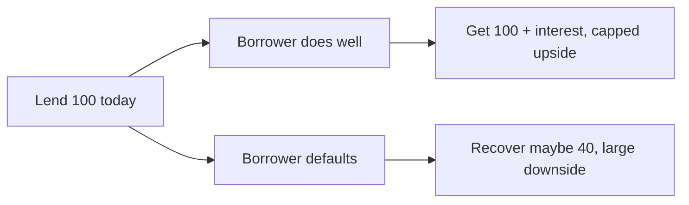
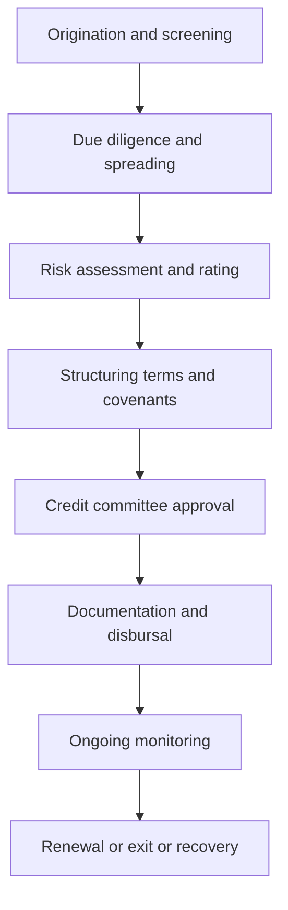

# What Credit Analysis Is & the Lender's Mindset

## The Problem / Why this matters
A lender hands over money today in exchange for a *promise* of repayment tomorrow. Unlike an equity investor, the lender does not share in the upside if the borrower doubles in size — the best case is simply getting paid back in full, on time, with interest. The whole discipline of credit analysis exists to answer one deceptively simple question: **will I be repaid, in full and on time, and what do I lose if I am not?** Get it wrong and a single default can wipe out the thin margin earned on dozens of good loans.

## Core Idea
Credit analysis is the **structured assessment of a borrower's ability and willingness to service and repay debt**, plus the **loss the lender suffers if they don't**. It combines quantitative work (spreading financials, computing leverage and coverage ratios, modelling cash flow) with qualitative judgement (management quality, industry position, structure and covenants).

## Why it works this way — the lender's asymmetry
The defining feature of credit is an **asymmetric payoff**. If a company you lent ₹100 to thrives, you still only get your ₹100 plus interest back. If it fails, you can lose most or all of it.

This asymmetry forces a **downside-first mindset**: the credit analyst spends most of their time asking "what could go wrong and how bad is it?" rather than "how big could this get?" It also explains why lenders obsess over **cash flow** (the source of repayment), **structure** (seniority, security, covenants that protect them) and **capital** (the equity cushion that absorbs losses before debt is hit).

## Full technical content

**Ability vs willingness to pay.** Two independent questions:
- *Ability* — does the business generate enough cash to service and repay debt? Assessed through cash flow, leverage and coverage.
- *Willingness* — will they choose to pay even when stressed? Assessed through track record, governance and reputation (the "character" C).

A borrower can be able but unwilling (strategic default) or willing but unable (genuine distress). Both end in loss.

**The two pillars of every credit view:**
| Pillar | Question | Tools |
|---|---|---|
| **Business risk** | How stable and defensible are the cash flows? | Industry analysis, competitive position, cyclicality, customer concentration |
| **Financial risk** | How much debt sits on those cash flows and can they service it? | Leverage (Debt/EBITDA), coverage (ICR, DSCR), liquidity |

The golden rule: **business risk sets the tolerable financial risk.** A stable utility can carry 6x Debt/EBITDA; a cyclical commodity trader cannot safely carry 3x.

**Types of lending** (the analysis flexes by type):
- **Corporate / term lending** — funding capex or acquisitions, repaid from operating cash flow over years.
- **Working-capital lending** — cash credit, overdraft, drawing-power based, repaid from the operating cycle.
- **Project / infrastructure finance** — non-recourse, repaid only from the project's own ring-fenced cash flows.
- **NBFC / financial-institution lending** — lending to a lender; assess their asset quality and ALM.
- **Retail / SME** — statistical, scorecard-driven, portfolio approach.

**The credit process** (origination to exit):

## Worked examples

**Example 1 — Ability without willingness.** Company A generates ₹500 cr of operating cash flow against ₹120 cr of debt service — comfortably able. But the promoter has a history of diverting funds to related parties and has defaulted on another group entity. *Credit view:* strong financials, but character risk caps the rating; require ring-fencing, escrow of cash flows, and tighter covenants, or decline.

**Example 2 — Willingness without ability.** Company B has an honest, committed management but sits in a collapsing sector with EBITDA of ₹40 cr against ₹75 cr of annual debt service (DSCR 0.53). No amount of good intent repays a ₹35 cr annual shortfall. *Credit view:* unable to service; restructuring or exit, not new lending.

**Example 3 — Business risk framing financial risk.** Two firms both at 4.0x Debt/EBITDA. Firm X is a regulated gas utility with contracted cash flows; Firm Y is a steel trader. Same leverage, very different risk: 4.0x is conservative for X and aggressive for Y. *Lesson:* leverage is only meaningful against the stability of the cash flow beneath it.

## How it is tested in interviews
- **"What is credit analysis / what does a credit analyst do?"** — "Assess whether a borrower can and will repay its debt, and size the loss if it can't. I focus on cash flow as the source of repayment, leverage and coverage as the burden, and structure and covenants as my protection — always downside-first."
- **"How is credit different from equity analysis?"** — "Asymmetric payoff. Equity is paid for upside; credit is capped at par and punished on the downside, so I analyse the worst case, not the base case."
- **"What matters most in a credit — the business or the balance sheet?"** — "Both, but business risk sets how much financial risk is tolerable. Stable cash flows can support far more leverage than volatile ones."
- **"A company is profitable — is it a good credit?"** — "Not necessarily. Profit is accrual; debt is repaid with cash. I'd check operating cash flow, the maturity profile, and liquidity before answering."

## Traps & common mistakes
- Confusing **profit with repayment capacity** — cash, not net income, services debt.
- Judging leverage **in isolation** from business risk.
- Ignoring **willingness** — great numbers under a promoter who has defaulted elsewhere is still a bad credit.
- Forgetting the lender's job is **loss avoidance**, not picking winners — you can be right on the company and still lose if the structure is weak.

## First-principles recap
- Credit's payoff is asymmetric: capped upside, large downside — so analyse downside-first.
- Repay­ment needs both **ability** (cash flow) and **willingness** (character).
- **Business risk sets tolerable financial risk.**
- Cash flow repays debt; structure and covenants protect the lender; capital is the cushion.
- The output is a view on **probability of default** and **loss if it happens**.

## Quick-reference
| Concept | One-liner |
|---|---|
| Credit question | Repaid in full, on time — and loss if not? |
| Ability | Cash flow vs debt service |
| Willingness | Character, governance, track record |
| Business risk | Stability/defensibility of cash flows |
| Financial risk | Leverage + coverage on those flows |
| Golden rule | Business risk sets tolerable financial risk |
| Source of repayment | Operating cash flow (not profit) |
