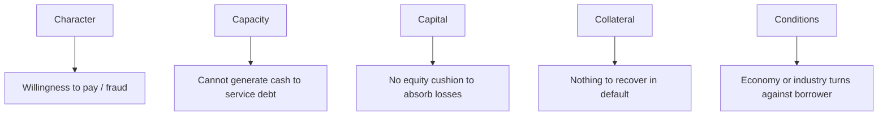

# The 5 Cs of Credit

## The Problem / Why this matters
Before spreadsheets and rating models, lenders needed a **checklist that would not let them forget anything that has historically killed a loan**. The 5 Cs — Character, Capacity, Capital, Collateral, Conditions — are that checklist. They are the oldest framework in credit and still the first thing an interviewer expects you to reel off, because they organise everything else you do into five buckets that map to the real ways loans go bad.

## Core Idea
A sound credit decision requires all five: an honest borrower (**Character**) with enough cash flow (**Capacity**), a real equity cushion (**Capital**), backed by assets (**Collateral**), operating in a supportive environment (**Conditions**). Weakness in one can sometimes be offset by strength in another — strong collateral can rescue thin capacity — but a fatal flaw in Character usually cannot be offset at all.

## Why it works this way
Each C corresponds to a distinct failure mode observed over centuries of lending:

Miss any one and you have re-created a historical loss. The 5 Cs force breadth so that a strong number in one area doesn't blind you to a hole in another.

## Full technical content

**1. Character — the willingness to pay.** The borrower's integrity, track record and credit history. Evidence: past repayment behaviour, credit-bureau records (CIBIL), conduct of existing accounts, related-party dealings, promoter reputation, quality and stability of management, auditor changes and qualifications. Character is the one C that, if failed, is rarely curable — you cannot structure your way around a borrower who won't pay.

**2. Capacity — the ability to pay.** The cash-generating ability to service and repay debt. This is the quantitative heart: operating cash flow, EBITDA, free cash flow, and the coverage ratios (interest coverage, DSCR). Capacity answers "does the business throw off enough cash to cover the debt, with headroom?"

**3. Capital — the owner's stake.** The equity the owners have invested and the net worth cushion that absorbs losses before creditors are touched. High capital (low leverage) means the owners lose first and have "skin in the game," aligning incentives. Measured by Debt/Equity, gearing, tangible net worth.

**4. Collateral — the fallback.** Assets pledged as security that the lender can seize and sell if the borrower defaults. Reduces **loss given default**, not probability of default. Quality matters: liquid, easily valued, unencumbered collateral (property, plant, receivables, cash) beats specialised or fast-depreciating assets. Assessed on realisable (not book) value with a haircut.

**5. Conditions — the environment.** The macro and industry backdrop, the purpose of the loan, and the terms. Includes interest-rate cycle, sector outlook, regulation, competitive dynamics, and how the funds will be used. A perfectly good borrower can be sunk by a sector collapse.

| C | Failure mode it guards against | Key evidence |
|---|---|---|
| Character | Won't pay / fraud | Bureau record, track record, governance |
| Capacity | Can't generate cash | Cash flow, EBITDA, ICR, DSCR |
| Capital | No loss-absorbing cushion | D/E, gearing, net worth |
| Collateral | Nothing to recover | Security value, haircut, seniority |
| Conditions | Environment turns | Industry, macro, loan purpose |

## Worked examples

**Example 1 — a hole in one C.** A borrower scores well on Capacity (DSCR 2.0x), Capital (D/E 0.5), Collateral (property worth 1.5x the loan) and Conditions (growing sector) — but the promoter defaulted on a sister company last year (Character). *Decision:* the Character flaw dominates; either decline or lend only with ring-fenced cash-flow escrow and personal guarantees, at a punitive spread.

**Example 2 — Collateral offsetting Capacity.** A property developer has lumpy, uncertain cash flow (weak Capacity) but pledges completed, saleable inventory worth 2x the loan (strong Collateral). *Decision:* lendable as an asset-backed facility with conservative loan-to-value and drawdown tied to sales — Collateral compensates for Capacity.

**Example 3 — Conditions sinking a good borrower.** A textile exporter with clean Character, solid Capacity and Capital faces a sudden 30% currency appreciation and a new import tariff in its main market (Conditions). Historical strength is irrelevant to a demand shock. *Decision:* stress the cash flows for the new environment before extending credit.

## How it is tested in interviews
- **"What are the 5 Cs of credit?"** — Name them and give one line each; then add the insight that **Character is the one you can't structure around**, and **Capacity is where the numbers live**.
- **"Which C is most important?"** — "Character for willingness and Capacity for ability — a loan needs both. Collateral and Capital are cushions that reduce loss, not substitutes for cash flow."
- **"How do Collateral and Capital differ?"** — "Capital is the owners' equity absorbing losses first; Collateral is specific assets I can seize. Capital reduces the chance of default; Collateral reduces my loss if it happens."
- **"How would you assess Character?"** — "Bureau/CIBIL record, conduct of existing accounts, related-party transactions, promoter and management track record, and any auditor red flags."

## Traps & common mistakes
- Treating Collateral as a substitute for cash flow — **"lend against cash flow, not collateral."** Collateral is plan B, not plan A.
- Skipping Character because the numbers look good.
- Confusing Capital (equity cushion, reduces PD) with Collateral (assets, reduces LGD).
- Ignoring Conditions / loan purpose — a good borrower funding a bad project is still a bad loan.

## First-principles recap
- Five buckets, each guarding a historical way loans fail.
- **Character** (willingness) and **Capacity** (ability) are the core; a loan needs both.
- **Capital** reduces probability of default; **Collateral** reduces loss given default.
- **Conditions** can sink even a strong borrower.
- A fatal flaw in one C usually can't be fully offset by strength in another — especially Character.

## Quick-reference
| C | One-liner | Maps to |
|---|---|---|
| Character | Will they pay? | PD / willingness |
| Capacity | Can they pay? | PD / cash flow |
| Capital | Owners' cushion | PD / leverage |
| Collateral | Fallback assets | LGD / recovery |
| Conditions | Environment & purpose | Systematic risk |
