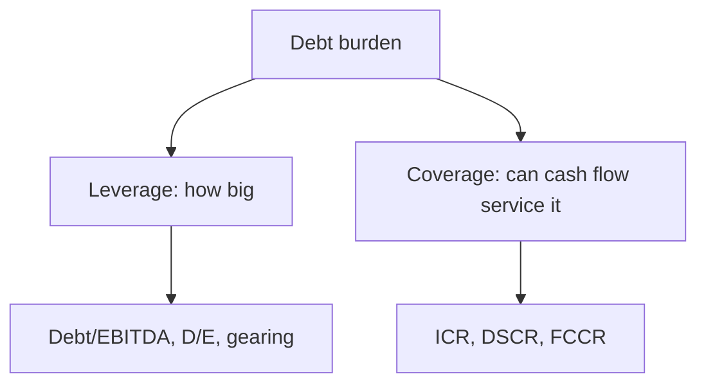

# Leverage & Coverage Ratios

## The Problem / Why this matters
Once the financials are spread, the lender needs a small set of numbers that answer, at a glance: **how much debt is this, relative to the cash flow and equity beneath it, and can that cash flow comfortably cover the payments?** Leverage and coverage ratios are those numbers. They are the language of every credit committee, every covenant, and every rating methodology — and interviewers expect you to define them precisely and know good-vs-bad ranges.

## Core Idea
- **Leverage ratios** measure the *size* of the debt burden relative to earnings or equity (how deep the hole).
- **Coverage ratios** measure the *serviceability* — whether recurring cash flow comfortably covers interest and principal (can they climb out).

You need both: a firm can have modest leverage but thin coverage if rates spike, or heavy leverage but strong coverage if cash flow is huge and stable.

## Why it works this way
Leverage tells you the stock of the problem; coverage tells you the flow. Debt is repaid from cash flow, so coverage is often the more binding constraint, while leverage sets the medium-term risk. Rating agencies and covenants use both because each catches a different failure: over-borrowing (leverage) and cash-flow shortfall (coverage).

## Full technical content

**Leverage ratios**
| Ratio | Formula | Reads |
|---|---|---|
| Debt / EBITDA | Total debt ÷ EBITDA | Years of earnings to repay debt |
| Net Debt / EBITDA | (Debt − cash) ÷ EBITDA | Same, netting surplus cash |
| Debt / Equity (gearing) | Total debt ÷ tangible net worth | Debt relative to owners' cushion |
| Debt / Capital | Debt ÷ (Debt + Equity) | Share of capital from debt |

Rules of thumb (adjust for sector): Debt/EBITDA below ~2x is conservative, 2–4x moderate, 4–6x aggressive, above 6x highly leveraged; investment-grade corporates typically sit under ~3–3.5x. Utilities tolerate more; cyclicals less.

**Coverage ratios**
| Ratio | Formula | Reads |
|---|---|---|
| Interest Coverage (ICR) | EBIT ÷ Interest | Times operating profit covers interest |
| EBITDA Interest Coverage | EBITDA ÷ Interest | Cash-based interest cover |
| **DSCR** | Cash available for debt service ÷ (Interest + Principal) | Can it cover interest AND principal |
| FCCR | (EBITDA − capex − tax) ÷ (Interest + Principal + leases) | Broadest fixed-charge cover |

DSCR is the most important for term loans and project finance. **DSCR > 1.0** means the borrower generates enough to meet its full debt service; lenders usually require a cushion (e.g., 1.2x–1.5x). Below 1.0x the borrower must draw on reserves or refinance.

**How the two interact.** A firm at 5x Debt/EBITDA (high leverage) with EBITDA/interest of 6x and DSCR of 1.6x may still be fine short-term — cash flow covers payments — but is fragile to an earnings dip. A firm at 3x leverage but DSCR of 1.05x is closer to the edge on serviceability. Read them together.

## Worked examples

**Example 1 — full ratio set.** EBITDA ₹100 cr, D&A ₹20 cr (so EBIT ₹80 cr), interest ₹25 cr, principal due ₹35 cr, capex ₹15 cr, tax ₹10 cr, total debt ₹400 cr, cash ₹40 cr, tangible net worth ₹200 cr.
- Debt/EBITDA = 400/100 = **4.0x**; Net Debt/EBITDA = 360/100 = **3.6x**
- D/E = 400/200 = **2.0x**
- ICR (EBIT) = 80/25 = **3.2x**; EBITDA interest cover = 100/25 = **4.0x**
- DSCR = (EBITDA − tax) / (interest + principal) = (100 − 10)/(25 + 35) = 90/60 = **1.5x**
- FCCR = (100 − 15 − 10)/(25 + 35) = 75/60 = **1.25x**
*View:* moderately-high leverage (4.0x) but healthy DSCR (1.5x) and FCCR (1.25x) — serviceable, with some cushion. Watch leverage on any EBITDA decline.

**Example 2 — coverage binding before leverage.** Firm at only 2.5x Debt/EBITDA but EBITDA barely covers interest plus a heavy amortization schedule: DSCR 1.02x. Low leverage is deceptive — a small earnings dip breaches DSCR. *Restructure the amortization or reject.*

**Example 3 — leverage binding.** Firm at 6.5x Debt/EBITDA with DSCR 1.4x today (cheap current rates). Serviceable now, but a refinancing at higher rates or an EBITDA fall makes 6.5x untenable. *High leverage = refinancing risk even with adequate current coverage.*

## How it is tested in interviews
- **"What's the difference between leverage and coverage?"** — "Leverage sizes the debt burden (Debt/EBITDA, D/E); coverage tests whether cash flow services it (ICR, DSCR). I need both."
- **"What is DSCR and why does it matter?"** — "Cash available for debt service over interest plus principal. Above 1.0 means the borrower can meet full debt service; lenders want a 1.2–1.5x cushion. It's the key serviceability metric for term loans."
- **"Company at 3x Debt/EBITDA — safe?"** — "Depends on the sector's stability and on coverage. 3x is fine for a utility, aggressive for a cyclical; and I'd check DSCR before concluding."
- **"Walk me through the ratios you'd compute."** — List leverage (Debt/EBITDA, D/E) then coverage (ICR, DSCR, FCCR), and note DSCR is usually the binding covenant.

## Traps & common mistakes
- Using **EBIT vs EBITDA** inconsistently in coverage — state which.
- Forgetting DSCR includes **principal**, not just interest (that's the whole point vs ICR).
- Reading leverage **without the sector** context.
- Ignoring **off-balance-sheet debt** (from spreading) — it inflates the true ratios.
- Treating a single year's ratio as the truth — use the **trend** and a stressed case.

## First-principles recap
- Leverage = size of debt (Debt/EBITDA, D/E); coverage = serviceability (ICR, DSCR, FCCR).
- **DSCR** is the key term-loan metric; > 1.0 with a cushion is the target.
- ICR covers only interest; DSCR adds principal; FCCR adds capex/leases.
- Interpret every ratio against **sector stability** and the **trend**, not in isolation.
- Use spread, off-balance-sheet-adjusted numbers.

## Quick-reference
| Ratio | Formula | Good-ish |
|---|---|---|
| Debt/EBITDA | Debt/EBITDA | < 3–3.5x (IG) |
| Net Debt/EBITDA | (Debt−Cash)/EBITDA | lower is better |
| D/E | Debt/Net worth | < 1–2x sector-dependent |
| ICR | EBIT/Interest | > 3x comfortable |
| DSCR | CADS/(Int+Principal) | > 1.2–1.5x |
| FCCR | (EBITDA−capex−tax)/fixed charges | > 1.2x |
