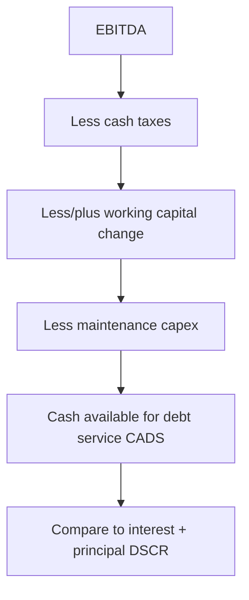

# Cash Flow Analysis for Credit

## The Problem / Why this matters
Debt is not repaid with profit, revenue, or EBITDA — it is repaid with **cash**. A company can report record net income and still default because the "profit" is tied up in receivables and inventory, or consumed by capex and taxes. The single most important skill in credit is tracing where cash actually comes from and whether enough is genuinely **available to service debt** after everything else the business must pay. This is where good credit analysts separate themselves from ratio-readers.

## Core Idea
Cash-flow analysis for credit rebuilds the borrower's cash from operations, strips out what the business unavoidably consumes (working-capital swings, maintenance capex, taxes), and arrives at **cash available for debt service (CADS)** — the real number that repays lenders. From there you test it against required debt service and stress it.

## Why it works this way
EBITDA is a starting proxy for cash, but it ignores three real cash costs: **taxes**, **working-capital changes**, and **capex**. A growing firm ploughs cash into receivables and inventory; a capital-intensive firm ploughs it into equipment. Both can have strong EBITDA and negative free cash flow. Lenders therefore walk EBITDA down to the cash that actually reaches the debt-service line.

## Full technical content

**The cash-flow waterfall (from EBITDA to CADS):**
| Step | Item |
|---|---|
| Start | EBITDA (normalized, recurring) |
| − | Cash taxes |
| ± | Change in working capital (increase = use of cash) |
| = | Operating cash flow (CFO) |
| − | Maintenance capex (the capex needed to keep running) |
| = | **Cash available for debt service (CADS)** |
| − | Interest + scheduled principal |
| = | Cash after debt service (build/deplete reserves) |
| − | Growth capex, dividends | (discretionary — can be cut in stress) |

**Key distinctions:**
- **Recurring vs one-off cash** — cash from asset sales or a working-capital release is not repeatable; don't rely on it for term debt.
- **Maintenance vs growth capex** — only maintenance capex is unavoidable; growth capex can be deferred in stress, so it sits below the debt-service line.
- **Quality of earnings** — compare **CFO to net income**: if profit rises while CFO falls, earnings quality is poor (receivables/inventory build or aggressive accruals) — a classic credit red flag.
- **Free cash flow (FCF)** = CFO − total capex; sustained positive FCF is the deleveraging engine.

**Sources of repayment hierarchy** (what actually repays the loan):
1. **Primary** — operating cash flow (what you underwrite to).
2. **Secondary** — refinancing / asset sales (fragile, market-dependent).
3. **Tertiary** — collateral enforcement (last resort, lossy).
A sound credit is repaid from the primary source; relying on secondary/tertiary is a weak credit.

## Worked examples

**Example 1 — EBITDA to CADS.** EBITDA ₹100 cr; cash tax ₹15 cr; working capital increased ₹20 cr (use of cash); maintenance capex ₹18 cr. CADS = 100 − 15 − 20 − 18 = **₹47 cr**. Against interest ₹20 cr + principal ₹15 cr = ₹35 cr debt service, DSCR = 47/35 = **1.34x**. Note: the ₹100 EBITDA looked like huge cover, but real CADS is less than half of it.

**Example 2 — profit up, cash down.** Net income grows 20% to ₹60 cr, but receivables jumped ₹90 cr on aggressive credit terms, so CFO fell to ₹5 cr. *Red flag:* the growth is being financed by extending credit to customers, not by cash generation — leverage will rise and liquidity tighten. A ratio-only analyst misses this; a cash-flow analyst catches it.

**Example 3 — capex hiding the risk.** Two firms both at EBITDA ₹80 cr and 3x leverage. Firm A is asset-light (maintenance capex ₹5 cr → CADS ₹65 cr); Firm B is capital-intensive (maintenance capex ₹45 cr → CADS ₹25 cr). Same EBITDA and leverage, very different debt-service capacity. *Lesson:* EBITDA-based leverage flatters capital-intensive borrowers.

## How it is tested in interviews
- **"Why do you focus on cash flow, not profit?"** — "Debt is repaid with cash. Profit is accrual and can be tied up in working capital or consumed by capex and tax. I walk EBITDA down to cash available for debt service."
- **"Walk me from EBITDA to cash available for debt service."** — EBITDA − cash tax ± working-capital change − maintenance capex = CADS; then compare to interest + principal.
- **"Net income is up but operating cash flow is down — concern?"** — "Yes — a classic earnings-quality red flag. Likely a receivables or inventory build, or aggressive accruals. It means the growth isn't cash-generative and leverage/liquidity will worsen."
- **"What repays a loan?"** — "Primarily operating cash flow; refinancing and asset sales are secondary; collateral is the last resort. I underwrite to the primary source."

## Traps & common mistakes
- Equating **EBITDA with cash** — it ignores tax, working capital and capex.
- Counting **one-off** cash (asset sales, WC release) as repeatable.
- Not splitting **maintenance vs growth capex** — overstating unavoidable spend or ignoring it.
- Missing the **CFO-vs-net-income** quality signal.
- Relying on **secondary/tertiary** repayment sources for a term loan.

## First-principles recap
- Cash, not profit, repays debt — walk EBITDA down to CADS.
- CADS = EBITDA − cash tax ± Δ working capital − maintenance capex.
- Compare CFO to net income for earnings quality.
- Underwrite to the **primary** source (operating cash flow); collateral is last resort.
- Only maintenance capex is unavoidable; growth capex and dividends can be cut in stress.

## Quick-reference
| Item | Note |
|---|---|
| CADS | EBITDA − cash tax ± ΔWC − maint. capex |
| DSCR | CADS ÷ (Interest + Principal) |
| FCF | CFO − total capex |
| Quality flag | CFO falling while NI rising |
| Repayment order | Operating CF > refinancing/asset sales > collateral |
