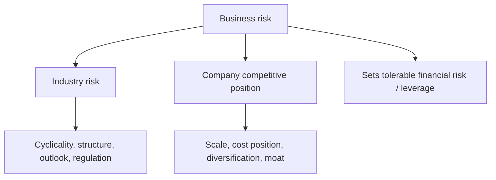
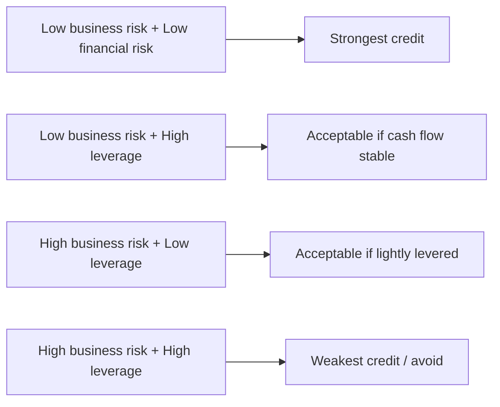

# Business & Industry Risk Assessment

## The Problem / Why this matters
Two companies can have identical financials today and completely different creditworthiness, because one operates in a stable, defensible industry and the other in a volatile, competitive one. **Business risk — the stability and defensibility of a borrower's cash flows — determines how much financial risk (leverage) is safe.** Ignore it and you will lend prudently-leveraged money to a business whose cash flows can halve in a downturn. This qualitative work is what turns a spreadsheet into a credit judgement.

## Core Idea
Business-risk analysis asks: **how reliable are the future cash flows that will repay this debt?** It assesses the industry (cyclicality, structure, outlook) and the company's position within it (scale, cost position, diversification, competitive moat), to set the tolerable leverage and the right rating.

## Why it works this way
Debt service is fixed; cash flow is variable. The more variable and less defensible the cash flow, the more likely it falls below the fixed debt service in a bad year. So a lender pairs **low leverage with high business risk** and can accept **high leverage with low business risk**.

## Full technical content

**Industry risk factors:**
| Factor | What to assess |
|---|---|
| Cyclicality | How much do revenues/margins swing with the economy? |
| Industry structure | Fragmented vs consolidated; a Porter five-forces read |
| Growth & maturity | Growing, mature, or declining demand |
| Capital intensity | High fixed costs magnify downturns (operating leverage) |
| Regulation | Tariffs, price controls, licensing, ESG rules |
| Barriers to entry | Do incumbents earn durable returns? |
| Technology / disruption | Risk of obsolescence |

**Company competitive-position factors:**
| Factor | What to assess |
|---|---|
| Scale & market share | Cost and pricing advantages of size |
| Cost position | Low-cost producer survives downturns |
| Diversification | By product, customer, geography, supplier |
| Customer/supplier concentration | Reliance on a few counterparties |
| Moat | Brand, switching costs, network, IP, contracts |
| Management quality | Strategy, execution, capital discipline |
| Contract/recurring revenue | Visibility and stickiness of cash flow |

**The synthesis — the risk matrix.** Combine business risk and financial risk into a rating grid:

Rating agencies formalize exactly this: a business-risk score and a financial-risk score map to an anchor rating.

## Worked examples

**Example 1 — same leverage, different risk.** A regulated electricity distributor and a steel producer both at 4.0x Debt/EBITDA. The utility has contracted, inflation-linked, recession-resistant cash flows (low business risk) — 4.0x is comfortable, investment-grade. The steel producer's EBITDA can halve in a down-cycle (high business risk) — 4.0x could become 8.0x in a trough, sub-investment-grade. *Same number, opposite conclusions.*

**Example 2 — concentration risk.** A component maker earns 70% of revenue from a single auto OEM. Financials look solid at 2.5x leverage, but the loss of that one customer would be catastrophic. *Business risk (concentration) caps the rating despite low leverage; require diversification covenants or a lower exposure.*

**Example 3 — cost position in a downturn.** In a commodity glut, prices fall to the industry's marginal cost. The low-cost producer (first-quartile cost) stays cash-positive; the high-cost producer bleeds. Same industry, same leverage — the low-cost producer is a far better credit because it survives the trough.

## How it is tested in interviews
- **"How does business risk affect a credit decision?"** — "It sets the tolerable leverage. Stable, defensible cash flows can support more debt; volatile ones can't. I pair low leverage with high business risk."
- **"Two firms at 4x leverage — how do you tell them apart?"** — Use the utility-vs-cyclical example: same leverage, different cash-flow stability, so different ratings.
- **"What business-risk factors do you look at?"** — Industry cyclicality/structure/regulation and company scale/cost-position/diversification/moat/management.
- **"Why does customer concentration matter for credit?"** — "It creates a single point of failure — losing one counterparty can wipe out cash flow regardless of current leverage."

## Traps & common mistakes
- Judging a credit on **financials alone**, ignoring cash-flow stability.
- Treating all sectors at a given leverage as equal.
- Missing **concentration** (customer, supplier, geography, product).
- Overrating a firm's position without checking its **cost quartile** — position in a downturn is what matters.
- Ignoring **regulatory/technology disruption** that can reset an entire industry.

## First-principles recap
- Business risk = stability and defensibility of future cash flows.
- It **sets the tolerable financial risk** (leverage).
- Assess industry (cyclicality, structure, regulation) and company (scale, cost, diversification, moat, management).
- Concentration and cost position are decisive in stress.
- Combine business and financial risk into the rating.

## Quick-reference
| Dimension | Key questions |
|---|---|
| Industry | Cyclical? Consolidated? Regulated? Growing? |
| Position | Scale? Low-cost? Diversified? Moat? |
| Concentration | One customer/supplier/geography? |
| Synthesis | Low business risk → tolerate more leverage |
| Rating | Business-risk score × financial-risk score → anchor |
