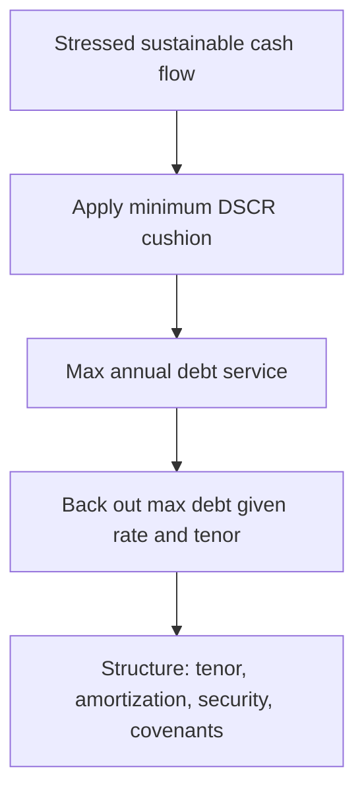

# Debt Capacity & Structuring

## The Problem / Why this matters
Approving a borrower is only half the job. The other half is deciding **how much to lend, on what terms, repaid how and over how long, and with what protections** — so that the loan is serviceable even if things go moderately wrong. A good borrower financed with the wrong structure (too much debt, too fast an amortization, a bullet at a bad time) still defaults. Structuring is where the analyst turns a credit view into a specific, safe transaction.

## Core Idea
**Debt capacity** is the maximum debt a borrower can support from its *stressed* cash flow while keeping coverage above a safe threshold. **Structuring** then shapes the facility — size, tenor, amortization, security, pricing, covenants — to match the borrower's cash-flow profile and protect the lender.

## Why it works this way
Debt service must fit inside cash flow with a cushion, in bad years as well as good. So capacity is sized off a *stressed* case, not the base case, and the repayment schedule is shaped to the cash the business actually throws off over time. Matching structure to cash flow is what keeps DSCR above 1.0 through the cycle.

## Full technical content

**Sizing debt capacity.** Start from **sustainable, stressed** EBITDA/cash flow, apply a required minimum DSCR, and solve for the debt the cash flow can service.
- Max annual debt service = CADS ÷ required DSCR.
- Given an interest rate and tenor, back out the maximum principal an annuity of that debt service supports.
- Cross-check against a maximum leverage (e.g., Debt/EBITDA cap) appropriate to the sector.

**Structuring levers:**
| Lever | Choice | Effect |
|---|---|---|
| **Amount** | Sized to capacity | Keeps DSCR safe |
| **Tenor** | Match asset/cash-flow life | Long assets → long tenor |
| **Amortization** | Bullet, straight-line, sculpted, balloon | Shape repayment to cash flow |
| **Seniority** | Senior secured → subordinated | Drives recovery/pricing |
| **Security** | Fixed/floating charge, pledge, guarantee | Reduces LGD |
| **Pricing** | Spread over benchmark | Compensates for risk |
| **Covenants** | Maintenance + incurrence | Early-warning + control |

**Repayment shapes:**
- **Bullet** — interest only, principal at maturity; maximizes refinancing risk.
- **Straight-line amortization** — equal principal instalments; de-risks steadily.
- **Sculpted** — instalments track projected cash flow (common in project finance to hold DSCR near constant).
- **Balloon** — partial amortization plus a large final payment.

**Match structure to cash-flow profile:** stable, growing cash flow can take a bullet or back-loaded schedule; lumpy or declining cash flow needs faster front-loaded amortization while the cash is there. Tenor should not exceed the economic life of what's being financed ("don't fund a 3-year asset with 10-year debt, or a 20-year toll road with a 5-year bullet").

## Worked examples

**Example 1 — sizing capacity.** Stressed CADS ₹60 cr; required minimum DSCR 1.5x. Max annual debt service = 60/1.5 = **₹40 cr**. If interest is ~10% and the lender wants a 5-year amortizing loan, the ₹40 cr/year annuity supports roughly **₹150 cr** of debt (annuity PV at 10%, 5 yrs ≈ 3.79 × 40 ≈ 151). Cross-check leverage: if EBITDA is ₹70 cr, that's ~2.1x — comfortable. Lend up to ~₹150 cr.

**Example 2 — tenor mismatch.** A toll road with 20-year concession cash flows is offered a 5-year bullet. Cash flow easily covers interest, but there's no way to repay the principal in year 5 except refinancing — huge refinancing risk. *Restructure* to a long-tenor, sculpted amortization matching the concession.

**Example 3 — sculpting to hold DSCR.** A project's cash flow ramps from ₹30 cr to ₹90 cr over its life. Straight-line principal would breach DSCR in the early low-cash years. *Sculpt* principal so debt service tracks cash flow, keeping DSCR ~1.3x throughout.

## How it is tested in interviews
- **"How would you size a loan?"** — "From stressed cash flow: max debt service = CADS ÷ required DSCR, then back out the principal that service supports at the given rate and tenor, cross-checked against a leverage cap."
- **"How do you decide the repayment structure?"** — "Match it to the cash-flow profile and asset life: front-load amortization for lumpy/declining cash flow, sculpt for ramping projects, avoid tenor mismatches and unnecessary bullets."
- **"Why is a bullet riskier than an amortizing loan?"** — "It concentrates repayment at maturity, so it relies on refinancing or a lump of cash being available then — refinancing risk."
- **"What's the danger of a tenor mismatch?"** — "Funding a long-life asset with short debt forces repeated refinancing; funding a short-life asset with long debt leaves debt outstanding after the asset stops earning."

## Traps & common mistakes
- Sizing off **base-case** rather than **stressed** cash flow.
- **Tenor mismatch** with asset/cash-flow life.
- Over-reliance on **bullets** (refinancing risk).
- Ignoring the **leverage cap** cross-check — DSCR can look fine at dangerous leverage if rates are temporarily low.
- Structuring without covenants — no early warning or control.

## First-principles recap
- Debt capacity is set by **stressed** cash flow and a required DSCR cushion.
- Max debt = f(max serviceable debt service, rate, tenor), capped by sector leverage.
- **Match amortization and tenor to the cash-flow profile and asset life.**
- Bullets create refinancing risk; sculpting holds DSCR steady.
- Structure and covenants convert a credit view into a safe transaction.

## Quick-reference
| Item | Rule |
|---|---|
| Max debt service | CADS ÷ required DSCR |
| Max debt | PV of that service at rate & tenor |
| Tenor | ≤ economic life of asset/cash flow |
| Amortization | Match to cash-flow shape |
| Cross-check | Debt/EBITDA within sector cap |
