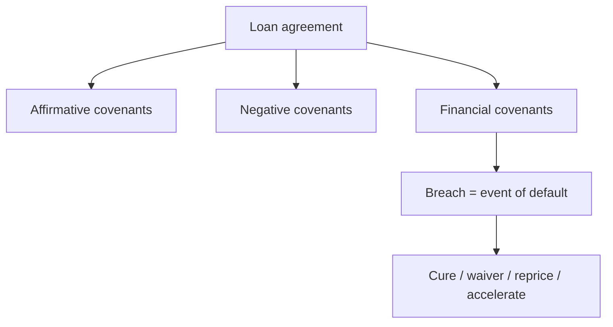

# Covenants & Loan Documentation

## The Problem / Why this matters
Once money is lent, the borrower controls the business and the lender is a passenger — until something goes wrong, by which point it may be too late to act. **Covenants are the contractual controls that give the lender early warning and the right to intervene** before a struggling borrower burns through the cash and assets that back the loan. They are the difference between finding out about trouble in time to protect your position and finding out when the borrower stops paying.

## Core Idea
Covenants are promises in the loan agreement that constrain the borrower's behaviour and require it to maintain agreed financial thresholds. Breach them and the lender gains rights — to renegotiate, reprice, demand cure, or accelerate the loan. They convert a passive loan into an actively monitored, controllable exposure.

## Why it works this way
The lender's protection is only as good as its information and its ability to act early. Financial covenants act as tripwires that fire while the borrower still has value to protect; restrictive covenants stop the borrower from taking actions (extra debt, asset sales, big dividends) that would strip that value away from creditors.

## Full technical content

**Three families of covenants:**
| Type | Purpose | Examples |
|---|---|---|
| **Affirmative** | Things the borrower must do | Provide audited statements on time, maintain insurance, pay taxes, keep assets in good order |
| **Negative (restrictive)** | Things the borrower can't do without consent | Incur additional debt, grant liens, sell assets, pay dividends above a limit, make acquisitions, change control |
| **Financial** | Maintain agreed metrics | Max leverage, min DSCR/ICR, min net worth, max capex |

**Maintenance vs incurrence covenants:**
- **Maintenance** — tested every period; the borrower must *stay* within limits (e.g., Debt/EBITDA ≤ 4.0x each quarter). Common in bank loans. Fire early.
- **Incurrence** — tested only when the borrower takes an *action* (issuing new debt, paying a dividend). Common in high-yield bonds; looser, borrower-friendly.

**Typical financial covenant package** (bank term loan):
- Leverage: Debt/EBITDA ≤ a stepping-down cap.
- Coverage: DSCR ≥ 1.2–1.5x; interest cover ≥ a floor.
- Minimum tangible net worth.
- Maximum annual capex.
- Sometimes a minimum liquidity/cash balance.

**Headroom & step-downs.** Covenants are set with **headroom** above the base case (e.g., covenant leverage 4.5x vs projected 3.5x) so ordinary volatility doesn't trip them, and often **step down** over time as the borrower is expected to deleverage.

**Events of default (EoD).** Breach of a covenant, non-payment, cross-default (default on other debt triggers this one), insolvency, material adverse change. On EoD the lender can waive, agree a cure period, reprice for the extra risk, tighten terms, or **accelerate** (demand immediate repayment) and enforce security.

**Security & guarantees** (documented alongside): fixed and floating charges over assets, pledge of shares, personal/corporate guarantees, and the inter-creditor agreement governing ranking among lenders.

## Worked examples

**Example 1 — a maintenance covenant firing early.** Loan has Debt/EBITDA ≤ 4.0x tested quarterly. EBITDA dips and leverage rises to 4.3x. The borrower is still paying, but the breach triggers a conversation *now*: the lender can require an equity cure, tighten terms, or reprice — months before any missed payment. That early warning is the whole point.

**Example 2 — negative covenant blocking value leakage.** A struggling borrower wants to pay a large dividend to the promoter. A restricted-payments covenant blocks it without lender consent, keeping cash inside the business to service debt. Without it, cash walks out the door ahead of creditors.

**Example 3 — cross-default.** A borrower defaults on a bond held by another lender. The cross-default clause in your loan lets you treat it as your default too, so you're not left waiting while other creditors act. It keeps lenders on an equal footing.

## How it is tested in interviews
- **"What are covenants and why do they matter?"** — "Contractual controls that give the lender early warning and the right to act before a struggling borrower destroys value. Financial covenants are tripwires; restrictive covenants stop value leakage."
- **"Maintenance vs incurrence covenants?"** — "Maintenance are tested every period and fire early (bank loans); incurrence are tested only on an action like issuing debt (high-yield bonds), so they're looser."
- **"Give examples of financial covenants."** — Max Debt/EBITDA, min DSCR/ICR, min net worth, max capex.
- **"What happens on a covenant breach?"** — "It's an event of default: the lender can waive, require a cure, reprice, tighten terms, or accelerate and enforce security."

## Traps & common mistakes
- Confusing **maintenance** (periodic, early-firing) with **incurrence** (action-triggered).
- Setting covenants with **no headroom** (constant technical breaches) or **too much** (never fire).
- Forgetting **cross-default** — it's what keeps you level with other creditors.
- Treating a breach as automatic acceleration — usually it opens options (cure/waiver/reprice), not instant repayment.
- Ignoring restrictive covenants' role in **preventing value leakage** (dividends, extra debt, asset sales).

## First-principles recap
- Covenants give the lender **information and control** — early warning plus the right to act.
- Affirmative (must do), negative (can't do), financial (must maintain).
- Maintenance = periodic tripwires; incurrence = action-triggered.
- Breach = event of default → waive / cure / reprice / accelerate.
- Set with headroom and step-downs; back with security and cross-default.

## Quick-reference
| Concept | One-liner |
|---|---|
| Affirmative | Borrower must do (report, insure) |
| Negative | Borrower can't (extra debt, dividends, asset sales) |
| Financial | Maintain leverage/coverage/net worth |
| Maintenance | Tested each period, fires early |
| Incurrence | Tested on an action, looser |
| EoD remedies | Waive, cure, reprice, accelerate, enforce |
