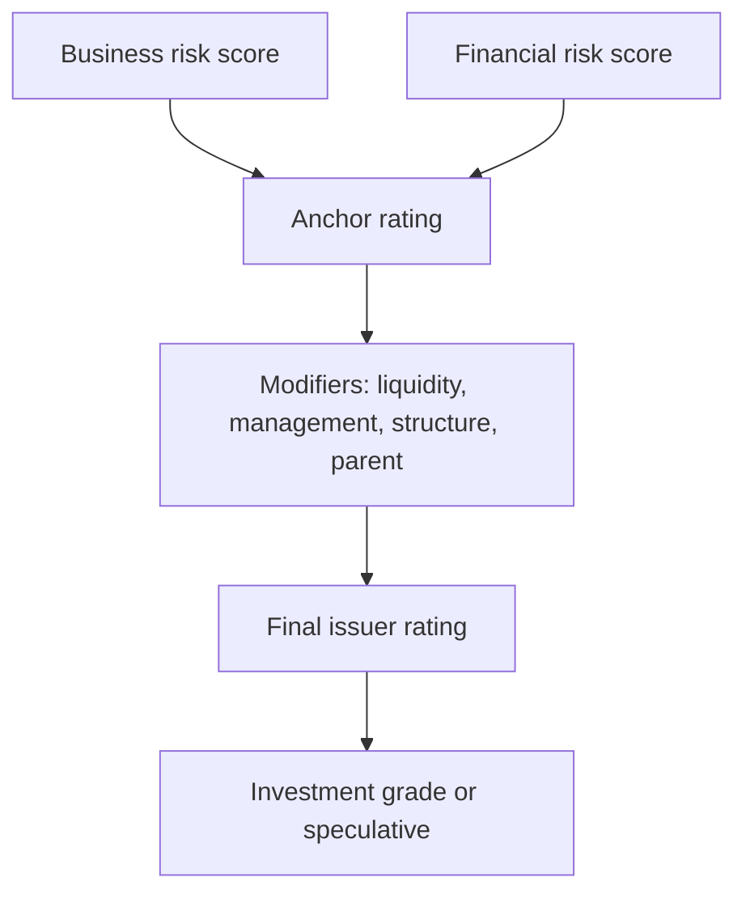

# Credit Ratings & the Agencies

## The Problem / Why this matters
Investors buying thousands of bonds cannot spread every issuer themselves. They need an independent, comparable, standardized opinion of creditworthiness — and that is what **credit rating agencies** provide. Ratings drive who can buy a bond, how much capital a bank must hold against it, and the spread the issuer pays. A single-notch downgrade can raise borrowing costs by tens of basis points and, at the investment-grade boundary, force a wave of forced selling. Every credit interview expects you to know the scale and what moves a rating.

## Core Idea
A **credit rating** is an agency's opinion of the relative likelihood that an issuer will default on its obligations (and, for some scales, the expected loss). It compresses a full business- and financial-risk analysis into a single symbol on a comparable scale, letting investors price and compare credit across the whole market.

## Why it works this way
Ratings solve an information and comparability problem at scale. By using a consistent methodology across issuers, an agency lets an investor treat a BBB Indian manufacturer and a BBB European utility as broadly comparable in default risk, even though their businesses are nothing alike. That comparability is what makes bond markets liquid.

## Full technical content

**The rating scale** (S&P / Fitch style; Moody's in brackets):
| Grade | Ratings | Meaning |
|---|---|---|
| **Investment grade** | AAA (Aaa), AA, A, BBB (Baa) | Low-to-moderate default risk |
| **Speculative / "junk"** | BB (Ba), B, CCC (Caa), CC, C | Higher default risk |
| **Default** | D | In default |

The critical line is **BBB−/Baa3 (the lowest investment grade) vs BB+/Ba1 (the highest speculative)**. Crossing below it ("fallen angel") can force index and mandate-driven investors to sell, widening spreads sharply. Notches within a grade are shown with +/− (S&P/Fitch) or 1/2/3 (Moody's).

**Indian agencies:** CRISIL, ICRA, CARE, India Ratings (Fitch), Acuité, Brickwork — they use an equivalent scale prefixed for the market (e.g., CRISIL AAA, AA, A, BBB…). SEBI regulates them.

**How a rating is built** (agency methodology):
1. **Business risk** — industry risk + competitive position (country risk overlaid).
2. **Financial risk** — leverage, coverage, cash flow, financial policy.
3. Combine into an **anchor** rating via a matrix.
4. **Modifiers** — diversification, liquidity, management/governance, capital structure, and parent/group support (notching up or down).
5. Result: the **issuer credit rating**; individual instruments may be notched for seniority/security.

**Issuer vs issue rating.** The issuer rating reflects overall default risk; a specific bond may be rated higher (senior secured) or lower (subordinated) based on expected recovery.

**Through-the-cycle vs point-in-time.** Agency ratings aim to be **through-the-cycle** (stable, not reacting to every quarter), whereas market spreads and internal PD models are more point-in-time.

**Rating triggers & watch.** Bonds/loans may have rating-linked terms (step-up coupons, covenants). Agencies signal likely changes via "outlook" (positive/negative/stable) and "credit watch."

## Worked examples

**Example 1 — the investment-grade cliff.** A firm rated BBB− (lowest IG) is downgraded to BB+ (highest speculative). Nothing about the business changed dramatically — but many funds and indices can only hold IG, so they must sell. Forced selling widens the spread far more than the one-notch move suggests, and the firm's future borrowing cost jumps. *This is why the IG boundary matters more than any other notch.*

**Example 2 — issue notching.** An issuer is rated BB. Its senior secured loan, with strong collateral and high expected recovery, is notched up to BB+; its subordinated bond, with low recovery, is notched down to BB−. Same issuer, different instrument ratings driven by seniority and security.

**Example 3 — parent support.** A standalone subsidiary would be rated BB, but it's strategically core to a AAA parent that is highly likely to support it. The agency notches the subsidiary up to, say, A− reflecting expected parental support. Remove the support assumption and the rating falls.

## How it is tested in interviews
- **"What's the investment-grade cutoff?"** — "BBB− / Baa3. Below that is speculative or high-yield. Crossing it can force index/mandate selling and widen spreads sharply."
- **"How is a rating determined?"** — "Business-risk and financial-risk scores combine into an anchor, then modifiers (liquidity, management, group support) adjust it to the final rating."
- **"What does a downgrade do?"** — "Raises borrowing cost, widens spreads, can trigger rating-linked covenants or step-ups, and at the IG boundary forces selling."
- **"Issuer vs issue rating?"** — "Issuer reflects overall default risk; a specific instrument is notched up or down for its seniority and expected recovery."

## Traps & common mistakes
- Not knowing the **BBB−/Baa3** boundary and why it matters.
- Treating a rating as a **default probability** — it's a relative, ordinal opinion, not a precise PD.
- Ignoring **outlook/watch** signals of a pending change.
- Confusing **issuer** and **issue** ratings.
- Forgetting **group/parent support** can drive a subsidiary's rating.

## First-principles recap
- A rating is a standardized, comparable opinion of relative default risk.
- Investment grade (AAA–BBB−) vs speculative (BB+ and below); the IG boundary is decisive.
- Built from business + financial risk → anchor → modifiers → final rating.
- Issue ratings notch off the issuer for seniority/recovery.
- Downgrades raise cost, widen spreads, and can force selling.

## Quick-reference
| Item | Note |
|---|---|
| IG range | AAA to BBB− (Baa3) |
| Speculative | BB+ (Ba1) and below |
| Key boundary | BBB−/BB+ (fallen angel) |
| Indian agencies | CRISIL, ICRA, CARE, India Ratings |
| Build | Business + financial risk → anchor → modifiers |
| Issue vs issuer | Notch for seniority/recovery |
