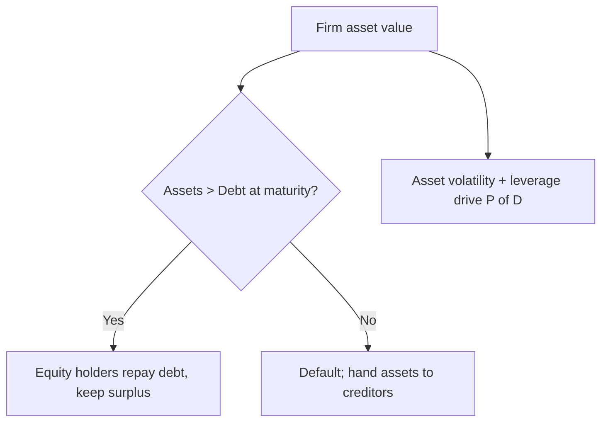

# Default Probability: Altman Z & Merton

## The Problem / Why this matters
Ratios and judgement give a qualitative sense of risk, but modern credit needs a **number** — the probability that this borrower defaults. Quantifying default lets you price loans, compute expected loss, hold the right capital, and rank a whole portfolio consistently. Two classic models sit behind almost every default-probability conversation: **Altman's Z-score** (an accounting-ratio model) and the **Merton structural model** (an options-based model). Interviewers love both because they test whether you understand what actually drives default.

## Core Idea
- **Altman Z-score** — a weighted combination of five accounting ratios that classifies a firm into safe, grey, or distress zones. Simple, transparent, ratio-based.
- **Merton model** — treats a firm's equity as a **call option on its assets**; default happens when asset value falls below the debt due. It links default to asset volatility and leverage, and underpins market-based PD (e.g., Moody's KMV).

## Why it works this way
Default is fundamentally about **assets falling below liabilities** (or cash falling below obligations). Altman captures this empirically through ratios that historically separated defaulters from survivors. Merton captures it structurally: equity holders own the upside and can "walk away" if assets fall below debt, exactly like a call option — so option maths gives the default probability.

## Full technical content

**Altman Z-score (original, manufacturing):**
Z = 1.2·X1 + 1.4·X2 + 3.3·X3 + 0.6·X4 + 1.0·X5, where
- X1 = Working Capital / Total Assets (liquidity)
- X2 = Retained Earnings / Total Assets (cumulative profitability/age)
- X3 = EBIT / Total Assets (operating profitability)
- X4 = Market Value of Equity / Total Liabilities (leverage/cushion)
- X5 = Sales / Total Assets (asset turnover)

Zones: **Z > 2.99 = safe; 1.81–2.99 = grey; Z < 1.81 = distress.** Variants exist for private firms (Z′, using book equity) and non-manufacturers (Z″, dropping X5). It's a scorecard: transparent, quick, but backward-looking and accounting-based.

**Merton structural model (intuition + mechanics):**
- Firm assets V follow a random walk with volatility σ_V; debt face value D is due at time T.
- Equity = a call option on assets with strike D: max(V − D, 0) at T.
- **Distance to default (DD)** ≈ (V − D) / (V·σ_V) — how many standard deviations of asset value sit between today's assets and the default point.
- **PD** = probability assets end below D = N(−DD) (a normal-distribution tail).
- Higher leverage (lower V/D) and higher asset volatility (σ_V) → smaller DD → higher PD.

The insight: **default risk rises with leverage AND with asset volatility.** Two firms at the same leverage differ in default risk if their asset volatility differs — which ties straight back to business risk.

**Structural vs reduced-form vs scorecards:**
| Approach | Basis | Used for |
|---|---|---|
| Structural (Merton/KMV) | Asset value & volatility from equity market | Listed firms, market-based PD |
| Reduced-form | Default as a random event calibrated to spreads | Pricing credit derivatives |
| Scorecards (Altman, internal) | Weighted ratios / logistic regression | Private firms, banks' internal ratings |

## Worked examples

**Example 1 — Altman Z.** A manufacturer: WC/TA 0.15, RE/TA 0.20, EBIT/TA 0.10, MVE/TL 0.80, Sales/TA 1.10.
Z = 1.2(0.15) + 1.4(0.20) + 3.3(0.10) + 0.6(0.80) + 1.0(1.10) = 0.18 + 0.28 + 0.33 + 0.48 + 1.10 = **2.37** → grey zone: watch closely, not yet distress.

**Example 2 — distance to default.** Assets ₹1,000 cr, debt due ₹700 cr, asset volatility 25%. DD ≈ (1000 − 700)/(1000 × 0.25) = 300/250 = **1.2 standard deviations**. PD ≈ N(−1.2) ≈ **11.5%**. If asset volatility rose to 40%, DD ≈ 300/400 = 0.75 → PD ≈ N(−0.75) ≈ **22.7%** — same leverage, double the default risk from higher volatility.

**Example 3 — leverage effect.** Same assets ₹1,000 cr and σ 25%, but debt rises to ₹850 cr. DD ≈ 150/250 = 0.6 → PD ≈ N(−0.6) ≈ **27%**. More debt shrinks the cushion and raises PD sharply.

## How it is tested in interviews
- **"How would you estimate probability of default?"** — "Scorecards like Altman's Z for private firms, or a structural Merton/KMV model for listed firms where equity market data gives asset value and volatility, plus internal logistic-regression models."
- **"Explain the Merton model."** — "Equity is a call option on the firm's assets; default is when assets fall below debt at maturity. PD depends on distance to default, which falls with higher leverage and higher asset volatility."
- **"What drives default risk in Merton?"** — "Leverage and asset volatility. Two equally-levered firms differ in PD if their asset volatility differs."
- **"What is the Altman Z-score?"** — Five weighted ratios; Z < 1.81 distress, > 2.99 safe; quick, transparent, but accounting-based and backward-looking.

## Traps & common mistakes
- Treating Altman Z as precise — it's a **classifier**, and coefficients are dated/sector-specific.
- Forgetting Merton needs **asset** value/volatility, inferred from **equity** (only works well for listed firms).
- Ignoring that **volatility**, not just leverage, drives PD.
- Confusing **structural** (asset-based) and **reduced-form** (spread-calibrated) models.

## First-principles recap
- Default ≈ assets falling below debt; models quantify that probability.
- **Altman Z** = weighted accounting ratios → safe/grey/distress zones.
- **Merton** = equity as a call on assets; PD = N(−distance to default).
- PD rises with **leverage** and **asset volatility** — volatility ties to business risk.
- Structural for listed firms, scorecards for private, reduced-form for pricing derivatives.

## Quick-reference
| Model | Formula / rule |
|---|---|
| Altman Z | 1.2X1+1.4X2+3.3X3+0.6X4+1.0X5; <1.81 distress |
| Distance to default | (V − D)/(V·σ_V) |
| Merton PD | N(−DD) |
| Drivers | Leverage ↑, asset volatility ↑ → PD ↑ |
