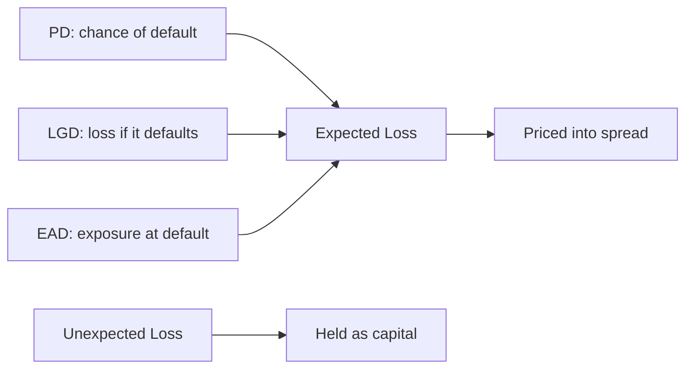

# PD, LGD, EAD & Expected Loss

## The Problem / Why this matters
Knowing a borrower *might* default isn't enough to price a loan or hold capital against it. You need to turn "risky" into a rupee number: **how much do I expect to lose on this exposure, on average, over a year?** That number — expected loss — is the foundation of loan pricing, provisioning (IFRS 9), and regulatory capital (Basel). It decomposes into three intuitive pieces: how likely default is, how much you lose if it happens, and how much is exposed at that moment.

## Core Idea
**Expected Loss (EL) = PD × LGD × EAD.**
- **PD** (Probability of Default) — chance the borrower defaults over the horizon (usually 1 year).
- **LGD** (Loss Given Default) — the fraction of exposure you *lose* if it defaults = 1 − recovery rate.
- **EAD** (Exposure at Default) — how much will actually be outstanding when default occurs.

## Why it works this way
Loss only happens if the borrower defaults (PD), and even then you recover some of it (so you lose only LGD), applied to whatever is actually drawn at that time (EAD). Multiplying the three gives the average, or *expected*, loss. Because it's an average, you price it into the spread as a cost of doing business; the *unexpected* loss (volatility around the average) is what capital is held against.

## Full technical content

**The three parameters:**
| Parameter | Definition | Drivers |
|---|---|---|
| **PD** | Probability of default over the horizon | Rating, financials, models (Altman/Merton/scorecard) |
| **LGD** | 1 − recovery rate | Seniority, security/collateral, structure, industry |
| **EAD** | Expected outstanding at default | Current drawn + likely further drawdowns on committed lines |

**Expected vs unexpected loss:**
- **Expected loss (EL)** = PD × LGD × EAD — the *average* loss; covered by **provisions** and **pricing** (built into the spread).
- **Unexpected loss (UL)** — the volatility of losses around EL (many borrowers defaulting together in a downturn); covered by **economic/regulatory capital**. You price EL; you hold capital for UL.

**Point-in-time vs through-the-cycle PD.** PIT PD reflects current conditions (rises in recessions); TTC PD is a cycle-average (more stable). Basel and IFRS 9 use different flavours; rating-based PDs are more TTC.

**EAD nuance.** For a term loan fully drawn, EAD ≈ outstanding balance. For a **revolving/committed line**, borrowers tend to **draw more as they approach default** (drawing on remaining availability while they still can), so EAD > current drawn; modelled with a **credit conversion factor (CCF)** on the undrawn amount.

**Link to provisioning and capital:**
- **IFRS 9 ECL** = PD × LGD × EAD (discounted), staged 1/2/3 as credit deteriorates (12-month ECL in stage 1, lifetime ECL in stages 2–3).
- **Basel** uses PD, LGD, EAD in the internal-ratings-based (IRB) capital formula, where capital is sized to *unexpected* loss at a high confidence level.

## Worked examples

**Example 1 — expected loss.** Exposure ₹100 cr, PD 2%, recovery 40% (so LGD 60%). EL = 0.02 × 0.60 × 100 = **₹1.2 cr**. That's the average annual loss — it should be covered by charging at least ~120 bps of spread on the ₹100 cr just for credit cost, before profit and capital.

**Example 2 — LGD from structure.** Same borrower (PD 2%, EAD ₹100 cr), two facilities: a senior secured loan with 70% recovery (LGD 30%) → EL = 0.02 × 0.30 × 100 = **₹0.6 cr**; a subordinated bond with 20% recovery (LGD 80%) → EL = 0.02 × 0.80 × 100 = **₹1.6 cr**. Same default risk, very different loss because of seniority/security — which is why the sub bond pays a wider spread.

**Example 3 — EAD on a revolver.** A ₹100 cr committed line is currently ₹40 cr drawn. As default nears, the borrower draws more; with a 60% CCF on the ₹60 cr undrawn, EAD = 40 + 0.6 × 60 = **₹76 cr**. Using current drawn (₹40 cr) would badly understate exposure and expected loss.

## How it is tested in interviews
- **"How do you calculate expected loss?"** — "PD × LGD × EAD. Probability of default, times loss given default (1 − recovery), times exposure at default."
- **"What's the difference between expected and unexpected loss?"** — "Expected loss is the average, priced into the spread and covered by provisions. Unexpected loss is the volatility around it and is covered by capital."
- **"Two bonds, same issuer, different spreads — why?"** — "Same PD but different LGD: the senior secured one recovers more (lower LGD, tighter spread); the subordinated one recovers less."
- **"Why can EAD exceed current drawings?"** — "On committed lines, borrowers draw down further as they approach default; we model that with a credit conversion factor."

## Traps & common mistakes
- Forgetting **LGD = 1 − recovery**, not the recovery itself.
- Using **current drawn** as EAD on a revolver (ignoring drawdown behaviour).
- Confusing **expected** loss (priced/provisioned) with **unexpected** loss (capital).
- Assuming PD, LGD, EAD are independent — in downturns they all worsen together (correlation).
- Mixing **PIT and TTC** PDs without stating which.

## First-principles recap
- **EL = PD × LGD × EAD** — the average loss, priced into the spread.
- **LGD = 1 − recovery**, driven by seniority and security.
- **EAD** can exceed current drawings on committed lines (CCF).
- Expected loss → pricing/provisions; unexpected loss → capital.
- IFRS 9 ECL and Basel IRB both build on these three parameters.

## Quick-reference
| Term | Definition |
|---|---|
| PD | Probability of default (horizon) |
| LGD | 1 − recovery rate |
| EAD | Exposure at default (drawn + CCF × undrawn) |
| EL | PD × LGD × EAD |
| Covered by | EL → spread/provisions; UL → capital |
