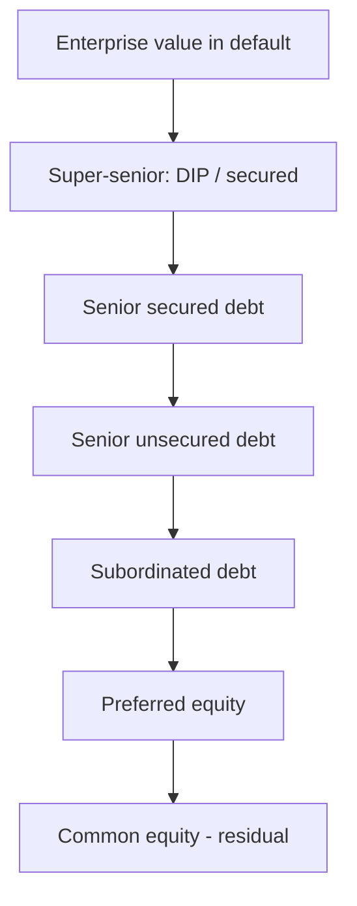

# Recovery, Seniority & the Capital-Structure Waterfall

## The Problem / Why this matters
When a borrower defaults, there usually *is* value left — just not enough to pay everyone. Who gets paid, in what order, and how much is left over for you depends entirely on **where your claim sits in the capital structure** and whether it is secured. Two lenders to the same defaulted company can recover 90% and 10% respectively purely because of seniority and security. Understanding the **waterfall** is what lets you estimate LGD, price subordinated debt, and structure a facility to protect your recovery.

## Core Idea
In default, a company's value is distributed to claimants in a strict **priority order** — the waterfall. Secured and senior claims are paid first (high recovery, low LGD); subordinated and equity claims are paid last, often getting little or nothing. **Recovery is driven by seniority, security, and the value available**, and LGD = 1 − recovery.

## Why it works this way
Debt is a contract with an agreed rank. Lenders accept lower returns for higher priority; subordinated lenders and equity accept lower priority for higher expected return. In bankruptcy, the **absolute priority rule** enforces that senior claims are paid in full before junior claims receive anything — that's the deal each layer signed up for.

## Full technical content

**The priority waterfall (typical order of payment):**
| Rank | Claim | Typical recovery |
|---|---|---|
| 1 | Administrative/insolvency costs, super-priority (DIP) financing | High |
| 2 | **Senior secured** (fixed/floating charge over specific assets) | 60–90% |
| 3 | **Senior unsecured** | 30–50% |
| 4 | **Subordinated / junior** debt | 10–30% |
| 5 | Preferred equity | Low |
| 6 | **Common equity** (residual) | Often ~0 |

(Statutory dues — employee wages, taxes — often rank ahead in many jurisdictions; India's IBC has its own waterfall under Section 53.)

**What drives recovery (and thus LGD):**
- **Seniority** — higher rank, more of the value.
- **Security/collateral** — a specific charge on quality assets means you're paid from those assets first; quality and liquidity of the collateral matter.
- **Enterprise value in default** — a viable business sold as a going concern recovers far more than a liquidation of assets at fire-sale prices.
- **Industry & asset type** — tangible-asset-heavy firms (real estate, utilities) recover more than asset-light ones (services, tech).
- **Structural position** — debt at an operating subsidiary (closer to the assets) outranks debt at a holding company (**structural subordination**).

**Secured vs unsecured, fixed vs floating charge:** a **fixed charge** attaches to specific assets (best protection); a **floating charge** covers a changing pool (inventory, receivables) and crystallizes on default. Secured lenders are paid from their collateral first; any shortfall ranks as unsecured for the balance.

**Going concern vs liquidation.** Restructuring/resolution that keeps the business running (a going-concern sale) usually preserves more value than piecemeal liquidation — which is the logic behind modern insolvency regimes (Chapter 11 in the US, the IBC in India) that favour resolution over liquidation.

## Worked examples

**Example 1 — the waterfall in action.** A defaulted firm's assets realize ₹600 cr. Claims: senior secured ₹400 cr, senior unsecured ₹300 cr, subordinated ₹200 cr.
- Senior secured: paid in full ₹400 cr → **recovery 100%, LGD 0%.**
- Remaining ₹200 cr to senior unsecured (₹300 cr claim): **recovery 67%, LGD 33%.**
- Subordinated: nothing left → **recovery 0%, LGD 100%.**
Same company, recoveries of 100% / 67% / 0% purely by rank.

**Example 2 — collateral quality.** Two senior secured lenders. Lender A holds a fixed charge on prime real estate (liquid, holds value) → ~85% recovery. Lender B holds a floating charge on specialised, fast-depreciating machinery → ~40% recovery. Same seniority label, very different LGD because collateral quality differs.

**Example 3 — structural subordination.** HoldCo bondholders and OpCo lenders both lend ₹100 cr. The assets sit in the OpCo. On default, OpCo lenders are paid from the OpCo assets first; HoldCo bonds only receive whatever is left *after* OpCo creditors are satisfied — effectively subordinated despite being "senior" on paper. *Lesson:* lend as close to the assets as possible.

## How it is tested in interviews
- **"What determines recovery in a default?"** — "Seniority, security/collateral quality, the enterprise value available (going concern vs liquidation), and structural position — how close your claim is to the assets."
- **"Explain the capital-structure waterfall."** — Admin/super-senior → senior secured → senior unsecured → subordinated → preferred → common equity, paid in strict priority (absolute priority rule).
- **"Two bonds, same issuer, 80% vs 20% recovery — why?"** — "Different seniority/security: the senior secured is paid from collateral first; the subordinated gets the residual."
- **"What is structural subordination?"** — "HoldCo debt ranks behind OpCo creditors because the assets and operating creditors sit at the OpCo, which is paid first."

## Traps & common mistakes
- Assuming "senior" always recovers well — **collateral quality** and **enterprise value** matter as much as rank.
- Ignoring **structural subordination** (HoldCo vs OpCo).
- Forgetting **statutory dues** (wages, taxes) can rank ahead.
- Confusing **going-concern** value with liquidation value — they can differ hugely.
- Treating recovery as fixed — it varies with the cycle (recoveries fall in downturns, when defaults rise).

## First-principles recap
- Default value is distributed by a strict **priority waterfall** (absolute priority rule).
- Recovery is driven by **seniority, security, enterprise value, and structural position.**
- LGD = 1 − recovery; senior secured → low LGD, subordinated → high LGD.
- Collateral quality and going-concern vs liquidation swing recoveries widely.
- Lend as **close to the assets** as possible (avoid structural subordination).

## Quick-reference
| Rank | Claim | Recovery |
|---|---|---|
| 1 | Admin / super-senior (DIP) | Highest |
| 2 | Senior secured | 60–90% |
| 3 | Senior unsecured | 30–50% |
| 4 | Subordinated | 10–30% |
| 5–6 | Preferred / common equity | ~0 |
| LGD | = 1 − recovery | |
