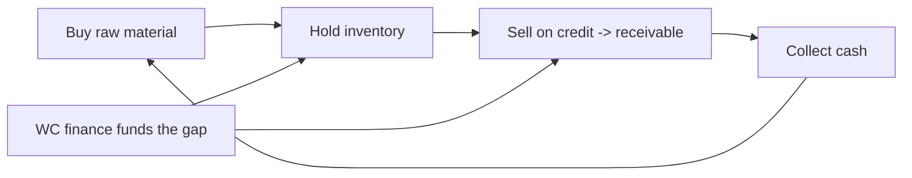

# Working-Capital & Trade-Finance Credit

## The Problem / Why this matters
Not all lending funds long-term assets. A huge share of bank credit funds the **day-to-day operating cycle** — the gap between paying for inventory and collecting from customers — and the **risks of trade**, especially cross-border trade where buyer and seller don't trust each other. This is the bread-and-butter of commercial banking, and it uses a different toolkit from term lending: limits sized to the operating cycle, self-liquidating structures, and instruments like letters of credit and factoring. Interviewers for corporate/commercial banking and NBFC roles test it directly.

## Core Idea
Working-capital finance funds the **current-asset cycle** (inventory + receivables, net of payables) and is repaid as that cycle turns over — it is *self-liquidating*. Trade finance de-risks specific transactions between counterparties who lack trust, using bank credit (letters of credit, guarantees) or receivables-based funding (factoring, forfaiting).

## Why it works this way
A business must pay for raw materials and hold inventory and wait for customers to pay — that tied-up cash is working capital, and it grows with sales. Financing it against the underlying current assets is naturally self-liquidating: as inventory sells and receivables collect, the loan is repaid, then re-drawn for the next cycle. Trade finance works because a *bank's* promise to pay is more trusted than a distant buyer's.

## Full technical content

**Sizing working-capital limits.** Limits track the operating cycle and the working-capital gap:
- The **cash conversion cycle** = DIO + DSO − DPO (days). Longer cycle → more financing needed.
- Bank methods: the **drawing-power** approach (advance a percentage against eligible current assets, e.g., 75% of receivables under 90 days + inventory less margin, minus creditors), or turnover/Nayak-committee style methods for SMEs.
- Facility types: **cash credit / overdraft** (revolving, against a drawing-power base), **working-capital demand loan**, **bill discounting**.

**Trade-finance instruments:**
| Instrument | What it does |
|---|---|
| **Letter of Credit (LC)** | Bank guarantees payment to the seller once compliant shipping documents are presented — replaces buyer's credit risk with the bank's |
| **Bank Guarantee (BG)** | Bank promises to pay a beneficiary if the applicant fails to perform (performance/financial guarantee) |
| **Factoring** | Seller sells receivables to a financier for immediate cash (with or without recourse) |
| **Forfaiting** | Purchase of medium-term export receivables without recourse to the seller |
| **Bill discounting** | Bank advances against a bill of exchange before its due date |
| **Supply-chain finance** | Financing the payables/receivables between a large anchor and its suppliers |

**LC mechanics** (documentary credit): the buyer's bank (issuing bank) issues an LC in favour of the seller; the seller ships and presents documents; if documents comply, the bank pays regardless of the buyer's willingness. It shifts risk from the buyer to the (typically stronger) issuing bank, and is governed by UCP 600.

**Recourse vs non-recourse factoring.** With recourse, the seller bears the default risk if the customer doesn't pay; without recourse (and forfaiting), the financier takes the credit risk — priced accordingly.

**Self-liquidating principle.** The lender lends against assets that will turn into cash in the normal course (receivables collect, inventory sells), so the facility repays itself. Diversion of these funds to fixed assets ("diversion of working capital to capex") is a classic warning sign of stress.

## Worked examples

**Example 1 — sizing a cash-credit limit.** A firm has average receivables ₹120 cr (advance 75% → ₹90 cr) and eligible inventory ₹80 cr (advance 60% → ₹48 cr), less creditors ₹30 cr. Drawing power = 90 + 48 − 30 = **₹108 cr**. The bank sanctions a cash-credit limit around this, adjusted each month as the current-asset base moves.

**Example 2 — LC replacing buyer risk.** An Indian exporter ships ₹5 cr of goods to a first-time overseas buyer it doesn't trust. The buyer opens an LC through a strong international bank. The exporter ships, presents compliant documents, and is paid by the bank — it never relied on the buyer's creditworthiness, only the bank's. Risk transformed from buyer to bank.

**Example 3 — factoring for cash flow.** A supplier with ₹50 cr of receivables due in 90 days needs cash now. It factors them without recourse at a 2% fee plus interest, receiving ~₹48.5 cr immediately. The financier now bears the customers' credit risk and collects at maturity. The supplier trades a small cost for immediate liquidity and offloaded risk.

## How it is tested in interviews
- **"What is working-capital finance and how is it repaid?"** — "Funds the operating cycle — inventory and receivables net of payables — and is self-liquidating: it's repaid as inventory sells and receivables collect, then re-drawn."
- **"What is a letter of credit?"** — "A bank's promise to pay the seller on the buyer's behalf once compliant shipping documents are presented — it swaps the buyer's credit risk for the bank's."
- **"How would you size a cash-credit limit?"** — "Drawing power: a margin-adjusted advance against eligible receivables and inventory, less creditors; tracks the working-capital gap and cash conversion cycle."
- **"Recourse vs non-recourse factoring?"** — "With recourse the seller keeps the default risk; without recourse the financier takes it and charges more."
- **"What's a red flag in working-capital lending?"** — "Diversion of working-capital finance into fixed assets or promoter uses — the facility stops being self-liquidating."

## Traps & common mistakes
- Treating working-capital limits as **term** debt — they should turn over, not fund fixed assets.
- Missing **diversion of funds** as a stress signal.
- Confusing an **LC** (payment undertaking on documents) with a **bank guarantee** (pays on non-performance).
- Ignoring **collateral/margin** on the drawing base (advancing 100% of receivables).
- Overlooking **recourse** terms in factoring — who actually bears the default risk.

## First-principles recap
- Working-capital finance funds the operating cycle and is **self-liquidating**.
- Limits track the **cash conversion cycle** and drawing power against current assets.
- **LCs and BGs** substitute a bank's credit for a counterparty's in trade.
- **Factoring/forfaiting** turn receivables into immediate cash, shifting credit risk (with/without recourse).
- Diversion of working-capital funds to fixed assets is a classic warning sign.

## Quick-reference
| Item | Note |
|---|---|
| Cash conversion cycle | DIO + DSO − DPO |
| Drawing power | Margined advance vs receivables + inventory − creditors |
| LC | Bank pays seller on compliant docs (UCP 600) |
| BG | Bank pays on applicant's non-performance |
| Factoring | Sell receivables for cash (recourse/non-recourse) |
| Red flag | WC funds diverted to fixed assets |
