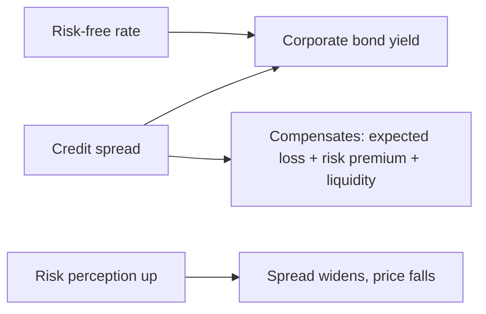

# Bond & Fixed-Income Credit

## The Problem / Why this matters
Credit isn't only bank loans — most large-company debt trades as **bonds** in public markets, where the price of credit risk is visible every second as the **credit spread**. For anyone in fixed income, credit research, or risk, you must understand what a spread is, what moves it, how ratings map to spreads, and how to find value in credit. This is where credit analysis meets market pricing.

## Core Idea
A corporate bond's yield = a **risk-free rate** + a **credit spread**. The spread is the extra yield investors demand to bear the bond's default and liquidity risk. Credit investing is the business of judging whether that spread **over-compensates or under-compensates** for the actual risk — and how the spread will move.

## Why it works this way
A lender to a risky borrower must be paid for the expected loss (PD × LGD) plus a premium for the *uncertainty* of that loss and for illiquidity. The market prices this as a spread over the risk-free curve. When perceived risk rises (weaker economy, worse fundamentals), required spread widens and bond prices fall; when risk falls, spreads tighten and prices rise.

## Full technical content

**Bond yield decomposition:** Yield = risk-free rate + credit spread. The spread compensates for (i) **expected loss** (PD × LGD), (ii) a **risk premium** for uncertainty/undiversifiable credit risk, and (iii) **liquidity**.

**Spread measures:**
| Measure | What it is |
|---|---|
| Nominal spread | Yield − matching-maturity govt yield |
| **Z-spread** | Constant spread over the whole spot curve that prices the bond |
| **OAS** (option-adjusted spread) | Z-spread adjusted for embedded options (calls/puts) |
| Asset-swap spread | Spread over the swap curve via an asset swap |
| CDS spread | Cost of default protection (a cleaner default read) |

**Price–yield and spread duration.** Bond price moves inversely to yield; a **1 bp spread widening** cuts price by roughly (spread duration × 1 bp). So credit P&L ≈ −spread duration × change in spread. Longer-dated, lower-coupon bonds have higher spread duration and more spread sensitivity.

**Rating ↔ spread mapping.** Lower ratings carry wider spreads: AAA a few tens of bps, BBB moderately more, BB/B several hundred bps, CCC very wide. The **investment-grade vs high-yield** divide (BBB−/BB+) is a step-change in spread and investor base. Spreads also embed a cycle: they widen in recessions (when defaults rise) and compress in booms.

**Investment grade vs high yield:**
| | Investment grade | High yield |
|---|---|---|
| Rating | BBB− and above | BB+ and below |
| Spread | Tight | Wide |
| Driver | Rates + modest spread | Spread/default-dominated |
| Covenants | Lighter (incurrence) | Tighter, more analysis |

**Relative value / finding value in credit.** Compare a bond's spread to (i) its fundamentals-implied fair spread, (ii) peers of the same rating/sector, and (iii) the same issuer's other bonds and its CDS (basis). Buy bonds whose spread over-pays for the risk; avoid those that under-pay. Watch the **credit cycle** — spreads mean-revert and gap wider in stress.

**The credit-spread cycle.** Spreads are tight and complacent late in an expansion, then gap violently wider in a downturn as defaults and risk aversion rise — the single biggest driver of credit returns.

## Worked examples

**Example 1 — yield build-up.** 5-year G-Sec yields 7.0%. A BBB corporate of the same maturity trades at a 200 bp spread → yield **9.0%**. A BB peer trades at 450 bp → **11.5%**. The 250 bp gap between BBB and BB is the market's price for the extra default risk and the IG/HY divide.

**Example 2 — spread P&L.** You hold a bond with spread duration 6. Its spread widens 50 bp on weak results. Price impact ≈ −6 × 0.50% = **−3.0%**. Even with no move in government yields, credit deterioration cost 3% — that's spread risk.

**Example 3 — relative value.** Two BBB bonds in the same sector: Bond A at 180 bp, Bond B at 240 bp, similar duration and fundamentals. If the 60 bp gap isn't justified by any real difference (liquidity, structure), Bond B is *cheap* — you'd buy B and expect its spread to tighten toward A.

## How it is tested in interviews
- **"What is a credit spread?"** — "The extra yield over the risk-free rate that compensates for default and liquidity risk. Yield = risk-free + spread."
- **"What makes spreads widen?"** — "Deteriorating fundamentals, a weakening economy, rising risk aversion, or an issuer downgrade — all raise required compensation, so spreads widen and prices fall."
- **"How does a bond's price move if its spread widens 50 bp?"** — "Down by roughly spread duration × 50 bp; for a duration of 6 that's about 3%."
- **"IG vs high yield?"** — "BBB− and above vs BB+ and below; high yield has much wider spreads, tighter covenants, and is spread/default-driven rather than rates-driven."
- **"How do you find value in credit?"** — "Compare a bond's spread to its fair spread from fundamentals and to peers/its own CDS; buy where the spread over-pays for the risk, mindful of the credit cycle."

## Traps & common mistakes
- Confusing **yield** with **spread** — spread is yield *minus the risk-free rate*.
- Ignoring **spread duration** when sizing credit risk.
- Forgetting the **credit cycle** — tight spreads late-cycle are the most dangerous.
- Treating **OAS** and nominal spread as the same (OAS strips out option effects).
- Overlooking **liquidity** as a component of spread (illiquid bonds pay more).

## First-principles recap
- Corporate yield = risk-free rate + credit spread; the spread pays for default + liquidity risk.
- Spreads widen (prices fall) as risk rises; credit P&L ≈ −spread duration × Δspread.
- Ratings map to spreads; the IG/HY boundary is a step-change.
- Value = spread over-paying vs fair/peers/CDS; respect the credit cycle.
- Spreads gap wider in downturns — the dominant driver of credit returns.

## Quick-reference
| Item | Note |
|---|---|
| Yield | Risk-free + credit spread |
| Spread compensates | Expected loss + risk premium + liquidity |
| Z-spread / OAS | Curve spread / option-adjusted |
| Credit P&L | ≈ −spread duration × Δspread |
| IG vs HY | BBB− and above vs BB+ and below |
