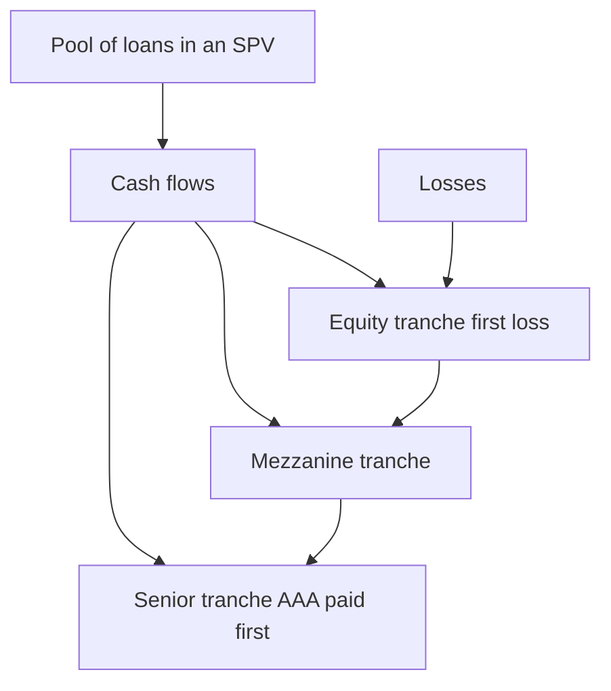

# Securitization & Structured Credit

## The Problem / Why this matters
A bank with thousands of illiquid loans (mortgages, auto loans, receivables) has capital tied up and risk concentrated. Securitization lets it **pool those loans and sell them as tradable securities**, freeing capital and transferring risk to investors who want it. Done well, it channels credit efficiently and lets investors buy precisely the risk-return they want. Done badly — with opaque, mispriced, over-rated tranches — it was at the centre of the 2008 crisis. Every credit and risk interview expects you to explain tranching and the 2008 lessons.

## Core Idea
**Securitization** pools many loans into a special-purpose vehicle (SPV) and issues securities backed by the pool's cash flows, **sliced into tranches by risk**. Senior tranches are paid first (safest, lowest yield); the equity/junior tranche absorbs first losses (riskiest, highest yield). Investors pick the tranche matching their risk appetite.

## Why it works this way
Individually, loans are illiquid and each carries idiosyncratic risk. Pooling diversifies idiosyncratic risk; **tranching** then redistributes the pool's losses so that most of the structure can be made low-risk (senior) at the cost of concentrating losses in a thin equity slice. This "credit enhancement by subordination" is what lets a pool of BBB-ish loans support a large AAA-rated senior tranche.

## Full technical content

**The mechanics:**
1. An **originator** (bank/NBFC) sells a pool of loans to a bankruptcy-remote **SPV** (true sale, off the originator's balance sheet).
2. The SPV issues **tranches** of notes backed by the pool's cash flows.
3. **The waterfall:** interest and principal flow top-down (senior first); **losses** flow bottom-up (equity/first-loss first, then mezzanine, then senior).
4. **Credit enhancement** makes the senior tranche safe: subordination (junior tranches below it), over-collateralization, excess spread, and reserve accounts.

**Product zoo:**
| Product | Underlying pool |
|---|---|
| **ABS** | Auto loans, credit cards, consumer receivables |
| **RMBS / MBS** | Residential mortgages |
| **CMBS** | Commercial mortgages |
| **CLO** | Leveraged corporate loans |
| **CDO** | A pool of bonds/ABS tranches (a securitization of securitizations) |

**Why tranching creates AAA from BBB.** The senior tranche only takes a loss after all junior tranches are wiped out. If the equity + mezzanine tranches are (say) 20% of the structure, the pool must lose more than 20% before the senior 80% is touched — so the senior can be rated far above the average pool quality. This is powerful but relies on the **loss and correlation assumptions being right**.

**The 2008 lessons (what went wrong):**
- **Poor underlying quality** — subprime mortgages with weak underwriting fed the pools ("garbage in").
- **Correlation underestimated** — models assumed home prices in different regions were roughly independent; in a national housing bust they fell *together*, so diversification vanished and even senior tranches took losses.
- **Rating over-reliance & opacity** — investors trusted AAA labels on complex CDOs they didn't understand; CDOs-of-CDOs layered leverage on leverage.
- **Misaligned incentives** — originate-to-distribute meant originators didn't keep the risk, so underwriting standards collapsed.

Post-crisis reforms: **risk retention** ("skin in the game," originators keep ~5%), better disclosure, simpler/standardized structures, and tougher rating scrutiny.

## Worked examples

**Example 1 — tranching and loss allocation.** An SPV holds a ₹1,000 cr loan pool: senior ₹800 cr (AAA), mezzanine ₹150 cr, equity ₹50 cr. If the pool loses ₹40 cr, the **equity** tranche absorbs it all (loses 80% of its ₹50 cr); senior and mezzanine are untouched. If losses reach ₹120 cr, equity is wiped (₹50 cr) and mezzanine takes ₹70 cr (47% loss); senior still safe. Senior only bleeds if losses exceed ₹200 cr (20% of the pool).

**Example 2 — how AAA is manufactured.** With 20% subordination beneath it, the ₹800 cr senior tranche is protected against the first 20% of pool losses. Historically such losses were rare for the pool type, so agencies rated it AAA — *provided* the 20% cushion and the loss/correlation assumptions hold.

**Example 3 — 2008 correlation failure.** Models assumed regional mortgage defaults were largely uncorrelated, so a 20% cushion looked ample. When US house prices fell nationally, defaults spiked *everywhere at once* — realized correlation approached 1, losses blew through the cushion, and "AAA" tranches took losses. The lesson: **correlation, not just average default rate, drives senior-tranche risk.**

## How it is tested in interviews
- **"What is securitization?"** — "Pooling illiquid loans in an SPV and issuing tradable securities backed by their cash flows, tranched by risk. It frees the originator's capital and transfers risk to investors."
- **"How does tranching work / how do you get AAA from a BBB pool?"** — "Losses hit the equity tranche first, then mezzanine, then senior. Subordination gives the senior a loss cushion, so it can be rated well above the pool's average quality."
- **"What went wrong in 2008?"** — "Weak subprime underlying, underestimated default correlation (regional diversification failed in a national bust), over-reliance on AAA ratings for opaque CDOs, and originate-to-distribute misaligning incentives."
- **"What is a CLO?"** — "A securitization of leveraged corporate loans, tranched senior to equity."

## Traps & common mistakes
- Thinking tranching **removes** risk — it **redistributes** it; total pool risk is unchanged.
- Ignoring **correlation** — the key driver of senior-tranche risk (2008's lesson).
- Trusting the **AAA label** without understanding the collateral and structure.
- Confusing **ABS/MBS** (loans) with **CDO** (a pool of bonds/tranches).
- Forgetting **originate-to-distribute** incentive problems (now mitigated by risk retention).

## First-principles recap
- Securitization pools loans in an SPV and issues **tranched** securities; senior paid first, equity absorbs first losses.
- Subordination manufactures a large safe senior tranche from a riskier pool.
- Tranching redistributes, not removes, risk — total risk is conserved.
- **Correlation** drives senior-tranche risk; underestimating it caused 2008.
- Reforms: risk retention, disclosure, simpler structures.

## Quick-reference
| Term | Note |
|---|---|
| SPV | Bankruptcy-remote issuer of the notes |
| Waterfall | Cash top-down; losses bottom-up |
| Tranches | Senior (AAA) → mezzanine → equity (first loss) |
| Enhancement | Subordination, over-collateralization, excess spread |
| ABS/MBS/CLO/CDO | Consumer / mortgage / loans / bonds-tranches |
| 2008 lesson | Correlation + underwriting, not just default rate |
