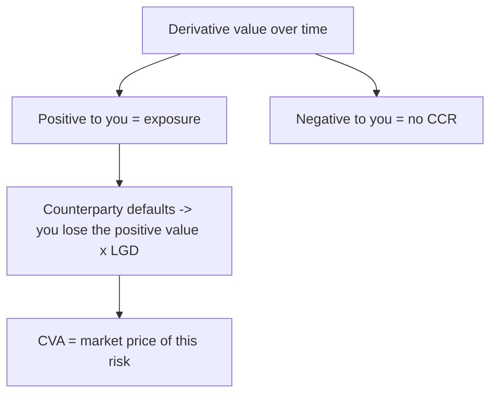

# Counterparty Credit Risk & CVA

## The Problem / Why this matters
When two banks enter a 10-year interest-rate swap, neither lends the other money up front — yet each is exposed to the other. If the swap moves in your favour, the counterparty *owes* you, and if they default before paying, you lose that gain. This is **counterparty credit risk**: the risk that the other side of a derivative defaults while the trade is worth money to you. It nearly sank the financial system in 2008 (AIG, Lehman), and pricing it — via **CVA** — is now core to any derivatives, risk, or quant-credit role.

## Core Idea
**Counterparty credit risk (CCR)** is the risk that a derivatives counterparty defaults before settling, when the contract has positive value to you. Because a derivative's value swings over its life, the exposure is uncertain and two-sided. **CVA (Credit Valuation Adjustment)** is the market price of that risk — the amount you deduct from a derivative's risk-free value to reflect the counterparty's default risk.

## Why it works this way
Unlike a loan (where exposure = amount lent), a derivative's exposure **changes with the market**. Today the swap may be worth +₹5 cr to you; next year, ±₹20 cr. You only lose on default if the trade is *in your favour* at that moment — so exposure is the positive part of a random future value. Since default risk has a price (a spread), the fair value of a derivative with a risky counterparty must be *lower* than with a risk-free one; CVA is that difference.

## Full technical content

**Exposure measures:**
| Measure | Meaning |
|---|---|
| Current exposure | max(mark-to-market, 0) today |
| **Potential Future Exposure (PFE)** | A high-percentile of possible future exposure (how bad it could get) |
| Expected Exposure (EE) | Average positive exposure at a future date |
| Expected Positive Exposure (EPE) | Time-average of EE (used in capital) |

**CVA — the price of counterparty risk.** Conceptually:
**CVA ≈ Σ (discounted Expected Exposure) × (counterparty PD) × LGD** across future time buckets. It rises with (i) larger/more volatile exposure, (ii) higher counterparty default probability (wider CDS spread), and (iii) higher LGD. The **xVA** family extends this: DVA (own default), FVA (funding), MVA (margin), KVA (capital).

**Risk mitigants:**
- **Netting** — under an ISDA master agreement, all trades with a counterparty net to a single exposure, so in-the-money and out-of-the-money trades offset (huge reduction).
- **Collateral / margin (CSA)** — counterparties post collateral as the mark-to-market moves (variation margin) plus a buffer (initial margin), cutting exposure to near zero between margin calls.
- **Central clearing (CCPs)** — standardized derivatives are novated to a central counterparty that margins both sides and mutualizes losses; post-2008 reform pushed most vanilla derivatives to CCPs.

**Wrong-way risk.** The dangerous case where exposure and counterparty default probability are **positively correlated** — e.g., buying protection on a company from a counterparty highly correlated to that company (AIG selling CDS on assets that fell exactly when AIG itself weakened). Exposure is largest precisely when the counterparty is most likely to default.

## Worked examples

**Example 1 — exposure is one-sided.** You have a swap worth +₹8 cr to you. If the counterparty defaults now, you lose that ₹8 cr × LGD (say 60%) = ₹4.8 cr. If instead the swap were worth −₹8 cr to you (you owe them), their default costs you nothing — you'd simply settle what you owe. *Counterparty risk only bites when the trade is in your favour.*

**Example 2 — netting.** With one counterparty you have Trade A at +₹20 cr and Trade B at −₹15 cr. Without netting, your exposure is ₹20 cr (you ignore what you owe on B). With an ISDA netting agreement, exposure = max(20 − 15, 0) = **₹5 cr** — a 75% reduction. Netting is the single biggest CCR mitigant.

**Example 3 — CVA and spread.** Two identical swaps, expected exposure profile the same. Counterparty X has a CDS spread of 100 bp (low PD); counterparty Y trades at 500 bp (high PD). The CVA charge on the trade with Y is roughly 5× that with X — so you'd quote Y a worse price (or demand collateral) to compensate for the higher counterparty risk.

## How it is tested in interviews
- **"What is counterparty credit risk?"** — "The risk that a derivatives counterparty defaults before settling when the trade is in your favour. Exposure is uncertain because the derivative's value moves with the market — it's the positive part of a random future value."
- **"What is CVA?"** — "The market price of counterparty default risk — the adjustment that lowers a derivative's value from its risk-free value. It's roughly expected exposure × counterparty PD × LGD."
- **"How is counterparty risk mitigated?"** — "Netting under an ISDA master, collateral/margin under a CSA, and central clearing through CCPs."
- **"What is wrong-way risk?"** — "When exposure rises exactly as the counterparty's default probability rises — they're positively correlated, like AIG selling protection on assets tied to its own health."

## Traps & common mistakes
- Treating derivative exposure like a **loan** (fixed) rather than a **random, market-driven** amount.
- Forgetting exposure is **one-sided** (only positive MtM matters).
- Ignoring **netting and collateral** when sizing exposure.
- Overlooking **wrong-way risk** — the most dangerous CCR.
- Confusing **CVA** (counterparty's default) with **DVA** (your own).

## First-principles recap
- CCR = a derivatives counterparty defaults while the trade is in your favour.
- Exposure is the **positive** part of an uncertain future value (PFE/EE).
- **CVA** prices it ≈ expected exposure × PD × LGD; it widens with the counterparty's CDS spread.
- Mitigated by **netting, collateral/margin, and central clearing**.
- **Wrong-way risk** (exposure correlated with default) is the tail danger.

## Quick-reference
| Term | Note |
|---|---|
| CCR | Counterparty defaults with trade in your favour |
| Exposure | max(MtM, 0); PFE = high-percentile future |
| CVA | ≈ EE × PD × LGD (price of CCR) |
| Mitigants | Netting (ISDA), collateral (CSA), CCP clearing |
| Wrong-way risk | Exposure ↑ as counterparty PD ↑ |
