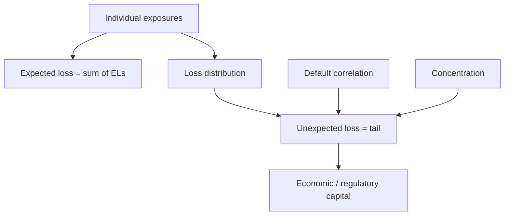

# Portfolio Credit Risk & Concentration

## The Problem / Why this matters
A single loan can be analysed borrower-by-borrower, but a bank holds thousands. What matters to the *institution* is not any one default but the **loss distribution of the whole portfolio** — and, crucially, whether losses arrive independently or all at once. Two portfolios with identical average default rates can have wildly different risk if one is concentrated and correlated. Managing **correlation and concentration** is what separates a bank that survives a downturn from one that doesn't. This is core to portfolio-management, risk, and NBFC roles.

## Core Idea
Portfolio credit risk is the loss distribution of a book of exposures. **Expected loss** is just the sum of individual expected losses, but **unexpected loss** — the tail — is driven by **default correlation** and **concentration**. Diversification reduces unexpected loss; correlation and concentration amplify it. Capital is held against the tail, not the average.

## Why it works this way
If defaults were independent, a large portfolio's loss would be very stable (the law of large numbers) and you'd need little capital. But borrowers share common risk factors — the economy, a sector, a region — so they tend to default *together* in downturns. That common factor creates correlation, fattens the tail of the loss distribution, and is the reason banks need substantial capital and stress testing.

## Full technical content

**Expected vs unexpected portfolio loss:**
- **Portfolio EL** = Σ (PDᵢ × LGDᵢ × EADᵢ) — additive, unaffected by correlation.
- **Portfolio UL** — the standard deviation / tail of the loss distribution — **depends heavily on correlation**. Higher correlation → fatter tail → more capital.

**Credit VaR / economic capital.** Just as market VaR, **Credit VaR** is a high-percentile (e.g., 99.9%) of the portfolio loss distribution over a horizon. **Economic capital ≈ Credit VaR − EL** (capital covers *unexpected* loss beyond the expected, which pricing/provisions already cover). Basel's IRB formula is a single-factor version of exactly this.

**What drives the tail:**
| Driver | Effect |
|---|---|
| **Default correlation** | Higher correlation → losses cluster → fatter tail |
| **Name concentration** | A few large exposures → single defaults move the whole book |
| **Sector concentration** | Many borrowers in one industry default together |
| **Geographic concentration** | Regional shock hits many at once |
| **Systematic factor exposure** | Sensitivity to the common economic factor |

**Diversification and its limits.** Spreading across uncorrelated names, sectors and regions reduces UL — but you can only diversify away *idiosyncratic* risk. The **systematic** component (common exposure to the economy) cannot be diversified away, which is why even a broad book takes heavy losses in a severe recession.

**Managing concentration:** single-name limits, sector/geography caps, correlation-aware limits, and portfolio actions (loan sales, securitization, credit default swaps, index hedges) to shed concentrated risk.

**Stress testing the book.** Because tail losses come from common factors, banks stress the whole portfolio against scenarios (a recession, a sector collapse, a rate shock) to see clustered losses that normal VaR under models — regulators require it.

## Worked examples

**Example 1 — correlation fattens the tail.** Two 100-loan portfolios, each loan PD 2%, LGD 50%, EAD ₹1 cr. Both have **EL = 100 × 0.02 × 0.5 × 1 = ₹1 cr**. Portfolio A's defaults are near-independent → in a bad year maybe 4–5 defaults (loss ~₹2–2.5 cr). Portfolio B's borrowers all serve one cyclical sector (high correlation) → in a downturn 20 default *together* (loss ~₹10 cr). **Same expected loss, 4× the tail** — B needs far more capital.

**Example 2 — concentration.** A ₹1,000 cr book: Portfolio X has 100 loans of ₹10 cr each; Portfolio Y has 10 loans of ₹100 cr each. Same total. One default in X costs ₹10 cr (1% of book); one default in Y costs ₹100 cr (10%). Y's lumpiness makes single defaults material — concentration risk, even at the same average PD.

**Example 3 — diversification limit.** A well-diversified retail book has low idiosyncratic risk, but every borrower is exposed to the domestic economy. In a national recession, defaults rise across the whole book simultaneously — the *systematic* loss that no amount of name diversification removes. This is why the tail, not the average, sizes capital.

## How it is tested in interviews
- **"How is portfolio credit risk different from single-name?"** — "Expected loss is just the sum of individual ELs, but the risk that matters — the tail / unexpected loss — is driven by default correlation and concentration, not the average."
- **"Why does correlation matter so much?"** — "It determines whether defaults arrive independently or cluster. High correlation fattens the loss tail, so you need much more capital for the same expected loss."
- **"Two books, same average PD — which is riskier?"** — "The more concentrated and correlated one — a few large, sector-clustered exposures move the whole portfolio together."
- **"What can you diversify away in a credit portfolio?"** — "Idiosyncratic, name-specific risk. The systematic exposure to the economy can't be diversified away — which is why severe recessions hit even broad books."
- **"What is economic capital for credit?"** — "Roughly Credit VaR minus expected loss — capital held against unexpected (tail) losses."

## Traps & common mistakes
- Assuming defaults are **independent** — they cluster via common factors.
- Sizing risk on **average** PD and ignoring the **tail**.
- Missing **concentration** (name, sector, geography).
- Believing diversification removes **all** risk — the systematic part remains.
- Using normal-market **VaR** without **stress testing** for clustered downturn losses.

## First-principles recap
- Portfolio EL is additive; **UL (the tail) is driven by correlation and concentration**.
- Capital covers unexpected loss (Credit VaR − EL), not the average.
- Diversification removes idiosyncratic, not systematic, risk.
- Concentration (name/sector/geography) makes single events move the whole book.
- Stress test for clustered, downturn losses that models understate.

## Quick-reference
| Concept | Note |
|---|---|
| Portfolio EL | Σ PDᵢ × LGDᵢ × EADᵢ |
| Unexpected loss | Tail; driven by correlation |
| Credit VaR | High-percentile portfolio loss |
| Economic capital | ≈ Credit VaR − EL |
| Diversifiable | Idiosyncratic only (not systematic) |
| Controls | Limits, caps, loan sales, CDS, securitization |
