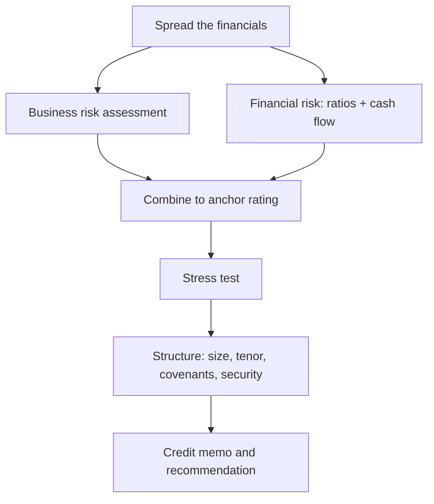

# A Credit Case: Building an Internal Rating & Credit Memo (Capstone)

## The Problem / Why this matters
Everything in this book — spreading, ratios, cash flow, business risk, structure, PD/LGD, recovery — comes together in one deliverable: the **credit memo** that recommends whether and how to lend, and the **internal rating** that anchors the pricing and the capital. This capstone walks a complete case end to end, exactly as you'd do it on the job and describe it in an interview when asked "how would you assess this borrower?"

## Core Idea
A credit assessment flows in a fixed sequence: **spread → analyse (business + financial risk) → stress → rate → structure → recommend**. The internal rating combines a business-risk score and a financial-risk score into an anchor grade; the memo documents the analysis, the rating, the proposed structure, the risks, and the recommendation.

## Why it works this way
Credit committees need a consistent, auditable path from raw financials to a decision. Structuring the analysis the same way every time forces completeness (nothing skipped), comparability (this borrower vs the book), and accountability (the rationale is written down). The rating makes risk comparable and drives pricing and capital.

## Full technical content — the worked case

**The borrower:** MidCo, an auto-components manufacturer seeking a ₹150 cr term loan for capacity expansion.

**Step 1 — Spread & normalize.** Revenue ₹800 cr; reported EBITDA ₹130 cr, but it includes a ₹15 cr one-off land-sale gain and excludes ₹5 cr of operating-lease rent → **normalized EBITDA ₹120 cr**. Reported debt ₹300 cr; add ₹40 cr factored receivables and ₹20 cr capitalized leases → **adjusted debt ₹360 cr**. Tangible net worth ₹200 cr.

**Step 2 — Financial risk (ratios & cash flow).**
- Leverage: adjusted Debt/EBITDA = 360/120 = **3.0x**; D/E = 360/200 = **1.8x**.
- Coverage: EBIT (₹95 cr) / interest (₹30 cr) = **3.2x**.
- Cash flow: EBITDA 120 − cash tax 20 − ΔWC 15 − maintenance capex 20 = **CADS ₹65 cr**; DSCR = 65 / (interest 30 + principal 20) = 65/50 = **1.3x**.
- Read: moderate leverage (3.0x), adequate coverage (DSCR 1.3x), positive CADS. *Financial risk: intermediate.*

**Step 3 — Business risk.** Auto components: **cyclical** (tied to auto demand), moderately competitive, but MidCo is a **top-3 supplier** to two large OEMs with long-standing relationships. Risks: **customer concentration** (60% from two OEMs), commodity (steel) cost pass-through lag, EV-transition risk to legacy parts. *Business risk: intermediate-to-high, chiefly from cyclicality and concentration.*

**Step 4 — Anchor rating.** Intermediate business risk × intermediate financial risk → an anchor around **BBB (internal grade ~4 on a 1–8 scale)**. Modifiers: adequate liquidity (+), experienced management with a clean track record (+), customer concentration (−). Net internal rating ≈ **BBB / grade 4**.

**Step 5 — Stress test.** Downside: auto demand falls, EBITDA drops 25% to ₹90 cr; steel costs squeeze margins. Stressed CADS ≈ ₹45 cr; stressed DSCR = 45/50 = **0.9x** — a shortfall. *Conclusion:* the base case is serviceable but a moderate downturn breaches DSCR — so **structure must build in cushion and controls.**

**Step 6 — Structure the facility.**
- **Size** ₹150 cr (post-facility Debt/EBITDA ≈ (360+150)/? — actually expansion lifts EBITDA; size to keep stressed DSCR near 1.2x). Right-size and/or phase drawdown.
- **Tenor** 7 years, matching the asset life; **amortization** front-loaded/straight-line while cash flow is strong (avoid a bullet given cyclicality).
- **Security** first charge on the new plant + hypothecation of current assets; corporate guarantee.
- **Covenants** (maintenance): Debt/EBITDA ≤ 3.5x (stepping down), DSCR ≥ 1.2x, minimum net worth, capex cap, and a restricted-payments limit; cross-default.
- **Pricing** spread reflecting the BBB internal rating and expected loss.

**Step 7 — The credit memo (structure of the write-up):**
1. Executive summary & recommendation (approve/decline, amount, rating).
2. Transaction & purpose.
3. Borrower & management overview.
4. Business & industry risk.
5. Financial analysis (spread, ratios, cash flow, trend).
6. Stress test & sensitivities.
7. Proposed structure, security & covenants.
8. Internal rating & pricing.
9. Key risks & mitigants.
10. Recommendation.

**The recommendation:** *Approve ₹150 cr, internal rating BBB/grade 4, 7-year amortizing, first charge + guarantee, maintenance covenants (Debt/EBITDA ≤ 3.5x, DSCR ≥ 1.2x), priced at [spread]. Key risks: cyclicality and customer concentration, mitigated by front-loaded amortization, covenants, security, and phased drawdown.*

## How it is tested in interviews
- **"How would you assess a borrower / walk me through a credit."** — Recite the sequence: **spread & normalize → financial risk (ratios + cash flow) → business risk → anchor rating → stress test → structure & covenants → recommendation.** Then apply it to whatever example they give.
- **"How do you decide how much to lend?"** — From stressed cash flow and a target DSCR, sized to keep stressed DSCR near 1.2x, cross-checked against a leverage cap.
- **"This borrower has 3x leverage and 1.3x DSCR — approve?"** — "Base case is serviceable, but I'd stress it: if a moderate downturn takes DSCR below 1.0x, I approve only with structure — front-loaded amortization, tight covenants, security, and possibly a smaller/phased facility."
- **"What goes in a credit memo?"** — The ten sections above, ending in a clear rating and recommendation.

## Traps & common mistakes
- Jumping to a decision **without the stress test** — the base case always looks fine.
- Rating on **financials alone**, ignoring business risk (cyclicality, concentration).
- Sizing the loan off **base-case** rather than **stressed** cash flow.
- A memo that **describes** without **recommending** — the committee needs a clear call and rating.
- Forgetting to tie **structure and covenants** back to the specific risks identified.

## First-principles recap
- The credit flow: **spread → analyse (business + financial) → rate → stress → structure → recommend.**
- The internal rating combines business-risk and financial-risk scores into an anchor, adjusted by modifiers.
- Size and structure off the **stressed** case to hold DSCR above ~1.2x.
- Tie every covenant and security feature to a specific identified risk.
- The memo ends in a clear rating and a clear recommendation.

## Quick-reference — the credit checklist
| Step | Output |
|---|---|
| Spread & normalize | Clean recurring numbers |
| Financial risk | Leverage, coverage, DSCR, CADS |
| Business risk | Industry + position + concentration |
| Anchor rating | Business × financial → grade |
| Stress test | Stressed DSCR/leverage |
| Structure | Size, tenor, amortization, security, covenants |
| Memo | 10 sections → rating + recommendation |
