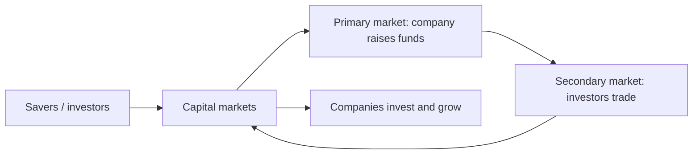

# Overview of Equity & Capital Markets

## The Problem / Why this matters
Companies need long-term capital to grow; savers need somewhere to put their money to earn a return. **Capital markets are the machinery that connects the two** — channelling household and institutional savings into productive businesses, and giving investors tradable claims on those businesses. Understanding how this system is structured — primary vs secondary, equity vs debt, the players and the plumbing — is the foundation for every equity, research, and markets role.

## Core Idea
Capital markets are where **long-term funds** are raised and traded. The **primary market** is where new securities are issued and the company actually raises money; the **secondary market** is where those securities then trade among investors, providing the liquidity that makes the primary market work. Equity gives ownership; debt gives a creditor claim.

## Why it works this way
Investors will only fund companies in the primary market if they believe they can **exit** later by selling to someone else — that exit is the secondary market. Liquidity in the secondary market lowers the return investors demand, which lowers the company's cost of capital. So the two markets are symbiotic: primary raises capital, secondary provides the liquidity that makes raising capital cheap.

## Full technical content

**Money markets vs capital markets:**
| | Money market | Capital market |
|---|---|---|
| Maturity | Short-term (< 1 yr) | Long-term (> 1 yr) |
| Instruments | T-bills, CP, CDs, repo | Equities, bonds |
| Purpose | Liquidity management | Long-term funding/investment |

**Equity vs debt:**
| | Equity | Debt |
|---|---|---|
| Claim | Ownership, residual | Creditor, fixed |
| Return | Dividends + capital gains, uncapped | Interest, capped |
| Risk | Last in line, higher risk | Senior, lower risk |
| Control | Voting rights | Usually none |

**Primary vs secondary market:**
- **Primary** — first issuance: IPO, follow-on (FPO), rights issue, QIP, private placement, bond issuance. *The company receives the cash.*
- **Secondary** — subsequent trading on an exchange between investors. *The company gets nothing; it provides price discovery and liquidity.*

**Functions of capital markets:**
1. **Capital formation** — channelling savings into investment.
2. **Price discovery** — continuous pricing of companies via trading.
3. **Liquidity** — the ability to convert holdings to cash.
4. **Risk transfer & sharing** — spreading risk across many investors.
5. **Corporate governance** — market discipline and monitoring by investors.

**The ecosystem** (previewing later chapters): issuers (companies), investors (retail, mutual funds, insurers, FPIs, pension funds), intermediaries (investment banks, brokers, exchanges, depositories, clearing houses), and the regulator (SEBI in India).

## Worked examples

**Example 1 — primary vs secondary cash flow.** Company Z raises ₹1,000 cr in an IPO (primary) — that ₹1,000 cr goes to the company (or selling shareholders in an OFS). The next day, an investor buys ₹5 cr of Z shares on the NSE (secondary) — that ₹5 cr goes to the *seller*, not to Z. *Z only receives money at issuance.*

**Example 2 — why liquidity lowers cost of capital.** Two identical companies raise equity. Company A's shares will list on a liquid exchange (easy exit); Company B's won't trade at all. Investors demand a higher return from B for locking up their money, so B's cost of equity is higher and its shares are worth less. Liquidity is valuable.

**Example 3 — equity vs debt in a good year and a bad year.** A firm earns ₹100 cr. Bondholders get their fixed ₹20 cr interest either way. In a great year (₹200 cr), equity keeps the extra upside; in a terrible year (₹10 cr), equity is wiped out first while bondholders still rank ahead. Equity = uncapped upside, first-loss downside.

**Example 4 — a worked cost-of-capital comparison showing why capital-formation efficiency matters at the economy level.** Country A has deep, liquid capital markets; a mid-size company there raises equity at a 10% cost of capital. Country B has shallow, illiquid markets with few institutional investors; an identical company there faces a 16% cost of capital purely from the illiquidity/risk premium investors demand. Over a 10-year project requiring steady reinvestment, Country A's company can fund materially more positive-NPV projects (anything returning above 10%) than Country B's company (which can only justify projects returning above 16%) — the same underlying business opportunity set, but a shallower capital market structurally funds less real economic investment. This is the macro-level version of Part 1's "capital formation" function, and a useful answer to "why do governments care about capital-market development, not just individual companies."

**Example 5 — tracing money markets and capital markets working together in one transaction.** A company needs ₹50 cr for two purposes: ₹10 cr to cover a short-term working-capital gap for the next 60 days, and ₹40 cr to fund a new manufacturing line with a 10-year payback. For the ₹10 cr, it issues commercial paper (a money-market instrument, sub-1-year, matching the short-term need). For the ₹40 cr, it issues long-term bonds or raises equity via a QIP (capital-market instruments, matching the long-term asset being funded). Using a short-term money-market instrument to fund a 10-year asset (or vice versa) creates a maturity mismatch that's a classic, well-documented source of financial fragility (a firm forced to repeatedly refinance short-term debt to fund a long-term asset is exposed to refinancing risk if credit markets tighten at the wrong moment) — matching instrument maturity to the underlying need's time horizon is a first-principles capital-structure discipline, not just a formality.

## How it is tested in interviews
- **"Difference between primary and secondary markets?"** — "Primary is where the company issues new securities and actually raises money; secondary is where investors trade those securities among themselves, giving liquidity and price discovery. The company only receives cash in the primary market."
- **"When Infosys shares trade on the NSE, does Infosys get the money?"** — "No — that's the secondary market. Infosys only raised money at its IPO/issuances."
- **"Equity vs debt?"** — "Equity is ownership with uncapped, residual, higher-risk returns; debt is a senior, fixed, capped, lower-risk claim."
- **"What are the functions of capital markets?"** — Capital formation, price discovery, liquidity, risk sharing, governance.

## Traps & common mistakes
- Thinking the company receives money from **secondary** trading.
- Confusing **money markets** (short-term) with **capital markets** (long-term).
- Treating equity and debt returns as symmetric — equity's downside is first-loss.
- Underrating the role of **liquidity** in lowering cost of capital.

## First-principles recap
- Capital markets connect savers to companies needing long-term funds.
- **Primary** raises capital (company gets cash); **secondary** provides liquidity (investors trade).
- Equity = ownership/residual/uncapped; debt = senior/fixed/capped.
- Functions: capital formation, price discovery, liquidity, risk sharing, governance.
- Secondary-market liquidity lowers the primary-market cost of capital.

## Quick-reference
| Concept | One-liner |
|---|---|
| Primary market | New issue; company raises cash |
| Secondary market | Investors trade; liquidity & price discovery |
| Money vs capital market | Short-term vs long-term |
| Equity | Ownership, residual, uncapped |
| Debt | Creditor, fixed, senior |
