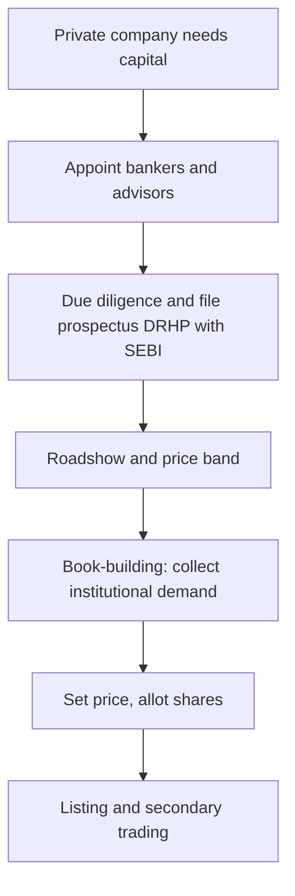

# Primary Markets & the IPO Process

## The Problem / Why this matters
The most visible event in capital markets is a company **going public** — the IPO. It's how a private company raises large-scale equity, gives early investors an exit, and joins the public market. Understanding the IPO process — why companies list, how the price is set (book-building), who does what (the bankers, the regulator), and the risks (underpricing, lock-ups) — is essential for equity capital markets, investment banking, and research roles, and it comes up constantly in interviews.

## Core Idea
The **primary market** is where companies issue securities to raise capital for the first time or afresh. An **IPO (Initial Public Offering)** is a private company's first sale of shares to the public, priced via **book-building**, intermediated by investment banks, and regulated (by SEBI in India). Beyond IPOs, primary issuance includes follow-ons, rights issues, QIPs and private placements.

## Why it works this way
A company needs a mechanism to (i) discover a fair price when there's no market price yet, and (ii) distribute shares to many investors while managing risk. Book-building solves price discovery by collecting demand from institutions across a price band; underwriters manage distribution and (sometimes) guarantee the raise; the regulator protects investors through disclosure (the prospectus).

## Full technical content

**Why companies go public:** raise growth capital, give founders/PE/VC an exit (offer for sale), acquire currency (listed shares) for M&A, raise profile/credibility, and enable employee stock liquidity. Costs: disclosure, scrutiny, short-term market pressure, listing expense, dilution.

**Types of primary issuance:**
| Type | What it is |
|---|---|
| **IPO** | First public sale of shares |
| **FPO / follow-on** | Further public issue by an already-listed firm |
| **Rights issue** | Offer of new shares to existing holders, usually at a discount |
| **QIP** | Qualified Institutional Placement — quick raise from institutions (India) |
| **Private placement / preferential** | Shares sold to select investors |
| **OFS** | Offer for Sale — existing holders sell (company gets no cash) |

**Fresh issue vs offer for sale.** A **fresh issue** creates new shares — the *company* receives the money (dilutes existing holders). An **OFS** sells *existing* shares — the selling shareholders receive the money (no dilution, no new company capital). Most IPOs are a mix.

**The IPO process (India):**
1. Appoint **merchant bankers (BRLMs)**, legal counsel, auditors, registrar.
2. Due diligence; draft the **DRHP** (Draft Red Herring Prospectus) and file with **SEBI**.
3. SEBI review and observations; finalize the RHP.
4. **Roadshow** — market to institutions; set a **price band**.
5. **Book-building** — collect bids across the band from QIBs, non-institutional, and retail categories (India reserves quotas for each).
6. Determine the **cut-off price** from the demand book; allot shares.
7. **Listing** on NSE/BSE; secondary trading begins.

**Pricing methods:** **book-building** (price discovered from demand within a band — the norm) vs **fixed price** (set upfront). **Anchor investors** (large institutions) may be allotted a day before to signal quality.

**Key phenomena:**
- **Underpricing** — IPOs often "pop" on day one (priced below where they trade), leaving money on the table but rewarding investors and ensuring a successful listing.
- **Lock-up period** — insiders/pre-IPO holders can't sell for a set period after listing, preventing an immediate flood of stock.
- **Greenshoe (over-allotment) option** — lets underwriters stabilize the price post-listing by selling up to ~15% extra and buying back if it falls.
- **Winner's curse / oversubscription** — hot IPOs are heavily oversubscribed; retail allotment is scaled/lottery-based.

## Worked examples

**Example 1 — fresh issue vs OFS.** An IPO raises ₹2,000 cr: ₹1,200 cr fresh issue (new shares → goes to the *company* for expansion) and ₹800 cr OFS (existing PE investor sells → goes to the *PE fund*, not the company). Only the ₹1,200 cr strengthens the company's balance sheet.

**Example 2 — book-building price discovery.** Price band ₹95–100. Institutional demand is strong at ₹100 (book covered 8× at the top), so the cut-off is set at **₹100**. Weak demand would have set it lower in the band. The market's bids, not the company's wish, set the price.

**Example 3 — underpricing pop.** Shares priced at ₹100 open at ₹135 on listing (+35%). Investors who got allotment gain; the company "left money on the table" (could have priced higher) but secured a strong, well-received listing and goodwill for future raises.

**Example 4 — a full worked IPO subscription and allotment case study.** A company issues 2 crore shares (fresh issue only, no OFS) at a price band of ₹450-₹475, reserved as: 50% QIB (Qualified Institutional Buyers), 15% NII (Non-Institutional Investors, i.e. HNIs), and 35% retail. At close: QIB portion subscribed 18x, NII portion subscribed 42x, retail portion subscribed 3.2x. **Cut-off price**: given the QIB book (the category whose demand carries the most weight in price discovery, since institutions do the deepest diligence) is subscribed nearly 20x even at the top of the band, the cut-off is set at ₹475 — the top of the band. **Retail allotment mechanics**: with the retail portion 3.2x oversubscribed, not every retail applicant gets shares — allotment is via a lottery/proportionate mechanism (for retail, typically each applicant either gets one full lot or nothing, decided by a computerised draw, rather than a proportionate partial allotment, since retail lot sizes are already small) — so a retail investor applying for the minimum lot has roughly a 1-in-3.2 (≈31%) chance of allotment in this scenario, a probability an analyst should be able to explain when asked "how does retail allotment actually work in an oversubscribed IPO." **NII allotment**, by contrast, is typically proportionate (not lottery-based) — an NII applicant subscribed 42x receives roughly 1/42nd of what they applied for, scaled across all NII applicants, reflecting the different allotment methodology SEBI mandates for the NII category versus retail.

**Example 5 — a down-round / weak-demand IPO, contrasted with Example 4.** A different company, same structure, sees QIB subscription of only 0.8x at the top of the band (i.e. the QIB book is *undersubscribed*) — under SEBI rules, if the QIB portion isn't at least fully subscribed, the issue may not proceed at all (a minimum-subscription threshold), forcing the company to either withdraw the IPO, extend the bidding period, or in some structures reduce the price band and re-open bidding. This scenario — contrasted directly against Example 4's strong 18x QIB demand — is what an analyst means by "the IPO market read this company's valuation as too aggressive": weak institutional demand at the top of the band is the market's most direct, unambiguous pricing signal, well before the stock ever lists and trades.

## How it is tested in interviews
- **"Walk me through an IPO."** — Appoint bankers → due diligence and file DRHP with SEBI → roadshow and price band → book-building → set cut-off and allot → list and trade.
- **"Fresh issue vs OFS?"** — "Fresh issue creates new shares and the company gets the cash; OFS sells existing shares and the selling holders get the cash — no new capital for the company."
- **"What is book-building?"** — "Price discovery by collecting institutional demand across a price band and setting the cut-off from the demand book."
- **"Why are IPOs often underpriced?"** — "To ensure a successful, well-subscribed listing and reward investors for the uncertainty; it 'pops' but the issuer leaves some money on the table."
- **"What is a greenshoe / lock-up?"** — Greenshoe stabilizes the price via over-allotment; lock-up stops insiders dumping stock right after listing.

## Traps & common mistakes
- Confusing **fresh issue** (company gets cash, dilution) with **OFS** (holders get cash, no dilution).
- Thinking the **company** sets the price — book-building lets **demand** set it.
- Forgetting **SEBI/DRHP** disclosure as the investor-protection backbone.
- Missing the purpose of **lock-ups and greenshoe** (orderly aftermarket).

## First-principles recap
- Primary market = companies issue securities to raise capital.
- IPO = first public sale, priced by **book-building**, filed via **DRHP** with SEBI.
- **Fresh issue** funds the company; **OFS** cashes out existing holders.
- Underpricing, lock-ups, greenshoe, and anchor investors shape a successful listing.
- Beyond IPOs: FPO, rights, QIP, private placement.

## Quick-reference
| Term | Note |
|---|---|
| IPO | First public share sale |
| DRHP | Draft prospectus filed with SEBI |
| Book-building | Demand-based price discovery in a band |
| Fresh issue vs OFS | Company cash vs selling-holder cash |
| Greenshoe | Over-allotment price stabilization |
| Lock-up | Insiders can't sell for a set period |
