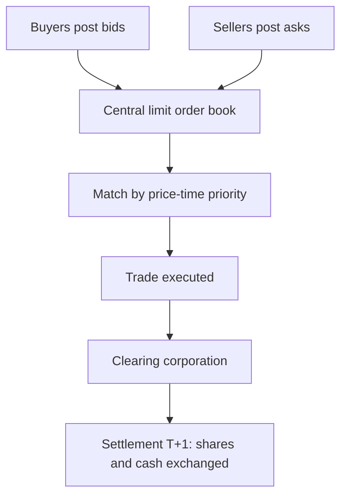

# Secondary Markets & Trading Mechanics

## The Problem / Why this matters
Once shares list, they trade — millions of times a day — on exchanges. How that trading actually works (order types, the order book, bid-ask spreads, matching, settlement) determines the price you get, the cost you pay, and the liquidity you rely on. Anyone touching markets — research, trading, operations, risk — must understand the plumbing. Interviewers test order types, the bid-ask spread, and settlement (T+1) directly.

## Core Idea
The secondary market is a **continuous auction**: buyers post bids, sellers post asks, and the exchange's matching engine pairs them by price-time priority. The **bid-ask spread** is the cost of immediacy; **liquidity** is how easily you trade without moving the price; and every trade must **clear and settle** through depositories and clearing corporations.

## Why it works this way
Price discovery needs a mechanism that continuously aggregates supply and demand. An **order-driven** market does this via a central limit order book where anyone can post orders and the best-priced ones execute first. Spreads exist because liquidity providers must be compensated for the risk of quoting; settlement infrastructure exists so buyers and sellers who never meet can trust that shares and cash actually change hands.

## Full technical content

**Market structures:** **order-driven** (a central limit order book, as on NSE/BSE) vs **quote-driven** (dealers/market-makers quote two-way prices). Most modern equity markets are order-driven with electronic matching by **price-time priority** (best price first; at equal price, earliest order first).

**The order book & bid-ask spread.** The book shows all resting buy orders (bids) and sell orders (asks) at each price. The **best bid** and **best ask** define the spread; a **narrow spread = liquid**, a wide spread = illiquid and expensive to trade. **Depth** (quantity available near the top) shows how much you can trade without moving the price (**market impact**).

**Order types:**
| Order | Behaviour |
|---|---|
| **Market** | Execute now at the best available price (certainty of execution, not price) |
| **Limit** | Execute only at your price or better (certainty of price, not execution) |
| **Stop-loss** | Becomes a market/limit order once a trigger price is hit |
| **Stop-limit** | Stop that becomes a limit order |
| Others | IOC, GTC, iceberg, day orders |

**Liquidity providers.** Market makers and high-frequency traders continuously quote both sides, earning the spread and supplying immediacy; they narrow spreads and add depth (see market microstructure).

**Long vs short.** Going **long** = buy, profit if price rises (max loss = amount invested). **Short selling** = sell borrowed shares to buy back cheaper; profit if price falls, but loss is theoretically unlimited (price can rise without bound). Shorting requires a stock-borrow and is regulated.

**Clearing & settlement.** After a trade: the **clearing corporation** (NSE Clearing / Indian Clearing) becomes central counterparty and nets obligations; **depositories** (NSDL, CDSL) hold shares in **demat** form and transfer them; cash and securities settle on **T+1** in India (among the fastest globally; India is moving toward T+0/instant). **Rolling settlement**, margining, and a settlement guarantee fund underpin trust.

**Circuit breakers & price bands** limit extreme moves (index-level halts and stock-level bands) to curb panic.

## Worked examples

**Example 1 — market vs limit order.** Best bid ₹99.8, best ask ₹100.2 (spread 0.4). A **market buy** executes immediately at ₹100.2 (pays the spread for certainty). A **limit buy at ₹100.0** sits in the book and only fills if a seller drops to ₹100.0 — better price, but it might never execute. Choose by whether you value price or certainty.

**Example 2 — spread and liquidity.** Stock A (large-cap) shows spread ₹0.05 with 50,000 shares at the top — deep and liquid; you trade large size cheaply. Stock B (small-cap) shows spread ₹2.00 with 200 shares — illiquid; a modest order moves the price sharply (high market impact). Same rupee value order, very different execution cost.

**Example 3 — settlement.** You buy 100 shares on Monday (T). Under T+1, the shares are credited to your demat and cash debited on Tuesday (T+1). The clearing corporation guarantees the trade so you don't bear your counterparty's default risk.

**Example 4 — a circuit breaker halting a stock mid-session.** A mid-cap stock with a 10% price band hits its lower circuit after a sudden negative news flash, and trading in that stock halts entirely — no further trades execute at any price below the circuit limit until the next session (or until the exchange revises the band). Contrast this with an index-level circuit breaker (e.g. a 10%/15%/20% Nifty/Sensex decline within a session), which halts trading market-wide for a defined cooling-off period across all stocks, not just one. Both mechanisms serve the same purpose (Part 20's discussion) — preventing a self-reinforcing panic cascade by forcing a pause for information to be digested — but operate at completely different scopes (single-stock vs market-wide), a distinction worth stating precisely rather than conflating the two when asked "what's a circuit breaker."

**Example 5 — a worked market-impact cost calculation for an institutional order.** A fund needs to buy ₹5 cr worth of a stock currently trading at ₹250, with the order book showing depth of roughly ₹40 lakh at the best few price levels before the price starts moving meaningfully. Executing the full ₹5 cr as a single market order would "walk the book" through many price levels, likely averaging perhaps ₹253-255 versus the ₹250 quoted price — an implicit cost of roughly 1.5-2% purely from market impact, well beyond the visible bid-ask spread alone. This is precisely why institutional desks use algorithmic execution (VWAP/TWAP slicing, covered in the Technical Research material) to spread a large order over time rather than executing it all at once, and why a research analyst recommending a position size for an institutional client should sanity-check the name's actual liquidity depth, not just its market cap, before assuming a position can be built or exited cheaply.

## How it is tested in interviews
- **"Market order vs limit order?"** — "Market executes now at the best price (certain execution, uncertain price); limit executes only at your price or better (certain price, uncertain execution)."
- **"What is the bid-ask spread and what does a wide spread mean?"** — "The gap between best bid and best ask — the cost of immediacy. A wide spread means illiquidity and expensive trading."
- **"What's the max loss on a short?"** — "Theoretically unlimited, because the price can rise without bound; a long's max loss is what you invested."
- **"How does settlement work in India?"** — "T+1 rolling settlement: shares (via NSDL/CDSL demat) and cash exchange one day after the trade, guaranteed by the clearing corporation as central counterparty."
- **"What does market depth tell you?"** — "How much you can trade near the top of the book without moving the price — your likely market impact."

## Traps & common mistakes
- Confusing **market** (execution certainty) and **limit** (price certainty) orders.
- Forgetting a short's loss is **unlimited**.
- Ignoring **market impact/depth** — a big order in a thin book moves the price against you.
- Not knowing India settles at **T+1** (and is moving faster).
- Overlooking the **clearing corporation** as central counterparty removing settlement risk.

## First-principles recap
- Secondary trading is a continuous auction matched by **price-time priority**.
- The **bid-ask spread** is the cost of immediacy; narrow = liquid.
- **Market** = certain execution; **limit** = certain price; **stop-loss** triggers on a level.
- Short selling has **unlimited** loss potential.
- Trades **clear and settle** via clearing corporations and depositories, T+1 in India.

## Quick-reference
| Item | Note |
|---|---|
| Order book | Resting bids/asks by price-time priority |
| Spread | Best ask − best bid (cost of immediacy) |
| Market order | Now, best price |
| Limit order | Your price or better |
| Short loss | Unlimited |
| Settlement | T+1 (NSDL/CDSL demat, clearing corp CCP) |
