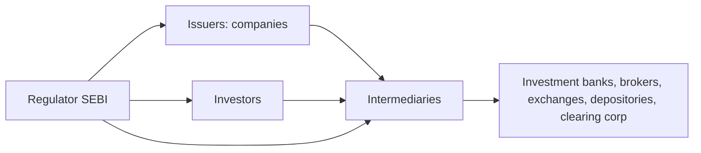

# Market Participants & Intermediaries

## The Problem / Why this matters
Markets don't run themselves — a web of participants and intermediaries makes issuance, trading, clearing and custody happen safely. Knowing **who does what** — issuers, the different investor types and their motivations, and the intermediaries (banks, brokers, exchanges, depositories, clearing corporations) — tells you how order flow moves, why prices react to certain investors, and where you'd fit in the ecosystem. Interviewers expect you to map the players cleanly.

## Core Idea
The capital-market ecosystem has three groups: **issuers** who need capital, **investors** who supply it (each with different horizons and motivations), and **intermediaries** who connect and service them. Overlaying all of it is the **regulator** (SEBI) ensuring fairness, disclosure and investor protection.

## Why it works this way
Issuers and investors can't transact directly at scale — they need someone to underwrite issues, match trades, hold securities, guarantee settlement and enforce rules. Each intermediary exists to solve a specific friction (distribution, execution, custody, counterparty risk, oversight), and the mix of investors determines how "smart," patient or reactive the money in a stock is.

## Full technical content

**Issuers:** companies (private and public), governments (bonds), and other entities raising capital.

**Investors (by type and motivation):**
| Investor | Horizon / motivation |
|---|---|
| **Retail** | Individuals; varied horizons; price-takers |
| **Mutual funds / AMCs** | Pooled retail money; benchmark-driven |
| **Insurance & pension funds** | Long-term, liability-matching, stable |
| **FPIs / FIIs** | Foreign institutional flows; can be large and fast |
| **Domestic institutions (DIIs)** | Banks, insurers, MFs domestically |
| **Hedge funds / PMS / AIFs** | Absolute-return, flexible, can short/leverage |
| **Promoters / strategic** | Control-oriented, long-term holders |

Institutional flows (FPI/DII) often drive index moves; "smart money" positioning is watched closely.

**Intermediaries:**
| Intermediary | Role |
|---|---|
| **Investment bank / merchant banker (BRLM)** | Advise on and underwrite issues; M&A; capital raising |
| **Brokers / trading members** | Execute investor orders on the exchange |
| **Stock exchanges (NSE, BSE)** | Provide the trading platform and price discovery |
| **Depositories (NSDL, CDSL)** | Hold securities in demat; effect transfer |
| **Clearing corporations** | Central counterparty; net and guarantee settlement |
| **Custodians** | Safekeep assets for institutions; settlement support |
| **Registrars & Transfer Agents (RTAs)** | Maintain shareholder records, process corporate actions |
| **Rating agencies / research** | Independent credit/equity opinions |
| **Investment advisers / distributors** | Advise and distribute to end investors |

**The regulator — SEBI.** Sets rules for issuers (disclosure), intermediaries (registration, conduct), and markets (surveillance, insider-trading and manipulation enforcement); protects investors and develops the market. RBI oversees banking/monetary aspects; IRDAI insurance.

**Sell-side vs buy-side (preview).** *Sell-side* (banks, brokers) creates products, executes and publishes research to win client business. *Buy-side* (asset managers, funds) invests client money and consumes that research to make decisions.

## Worked examples

**Example 1 — the chain of a single trade.** A mutual fund (investor) instructs its **broker** (intermediary) to buy 1 lakh shares on the **NSE** (exchange); the trade matches, the **clearing corporation** guarantees it, the **depository (CDSL/NSDL)** moves the shares into the fund's **custodian's** demat account on T+1. Five different intermediaries touched one trade, each solving a distinct friction.

**Example 2 — why the investor mix matters.** Two similar mid-caps: Stock A is 70% held by long-term insurers and index funds (stable, patient); Stock B is 40% held by fast FPIs and traders (volatile, flow-driven). A negative headline moves B far more, because its holder base reacts and rotates quickly. *Knowing the holder base predicts volatility.*

**Example 3 — SEBI's role.** A promoter tries to sell shares on undisclosed bad news (insider trading). SEBI's surveillance flags the trades, investigates, and penalizes — protecting other investors and preserving trust that keeps the market liquid.

**Example 4 — a hedge fund/PMS using leverage and shorting that a mutual fund can't.** A long-only mutual fund identifies an overvalued stock but has no mandate to short it — it can only underweight or avoid holding it, a comparatively weak way to express a negative view. A hedge fund or PMS with a flexible mandate can short the same stock directly, and can additionally use leverage to size a high-conviction long position beyond what its raw capital would allow. This mandate difference — not skill or information — is often the real reason a hedge fund and a mutual fund reach different position sizes or even opposite trades on the same stock, an important nuance when a candidate is asked to compare institutional investor types.

**Example 5 — custodian vs broker in an actual settlement failure scenario.** An institutional buy order executes on the exchange via the fund's broker, but on settlement date the fund's custodian reports a shortfall — the securities weren't available to deliver from the counterparty side. The clearing corporation's settlement-guarantee mechanism (Part on secondary markets) steps in to make the buyer whole (via the exchange's default/shortfall-handling process, typically an auction to source the shares or a cash equivalent), while the custodian's role throughout is purely to report and reconcile the fund's actual holdings against what was expected — illustrating concretely why an institution needs both a broker (who executed a trade that, from the fund's side, looked completely normal) and an independent custodian (whose job is precisely to catch and report a settlement discrepancy the broker relationship alone wouldn't surface).

## How it is tested in interviews
- **"Who are the main market participants?"** — Issuers; investors (retail, mutual funds, insurers/pensions, FPIs, DIIs, hedge funds/PMS, promoters); intermediaries (banks, brokers, exchanges, depositories, clearing corporations, custodians, RTAs); regulator (SEBI).
- **"What does a depository do?"** — "Holds securities in dematerialized form and effects their transfer — NSDL and CDSL in India."
- **"What's the difference between sell-side and buy-side?"** — "Sell-side creates, executes and researches to serve clients; buy-side invests client money and consumes that research."
- **"Why do FPI flows matter?"** — "They're large and can move quickly, so they often drive index-level moves and volatility."
- **"What does SEBI do?"** — "Regulates issuers, intermediaries and markets — disclosure, conduct, surveillance, and investor protection."

## Traps & common mistakes
- Confusing **depository** (holds shares) with **clearing corporation** (guarantees settlement) with **exchange** (matches trades) — three different roles.
- Lumping all investors together — horizons and behaviour differ sharply.
- Mixing up **sell-side** and **buy-side**.
- Forgetting the **regulator** as the backbone of trust.

## First-principles recap
- Three groups: issuers, investors, intermediaries — plus the regulator.
- Each intermediary solves a friction: distribution, execution, custody, settlement, records.
- The **investor mix** shapes a stock's volatility and behaviour.
- Exchange (match) ≠ clearing corp (guarantee) ≠ depository (hold).
- SEBI ensures disclosure, conduct and investor protection.

## Quick-reference
| Player | Role |
|---|---|
| Investment bank / BRLM | Underwrite/advise issues |
| Broker | Execute orders |
| Exchange (NSE/BSE) | Match trades, price discovery |
| Depository (NSDL/CDSL) | Hold & transfer demat shares |
| Clearing corporation | CCP, guarantee settlement |
| SEBI | Regulate & protect investors |
