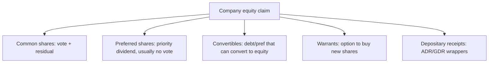

# Equity Instruments

## The Problem / Why this matters
"Equity" isn't a single thing. Companies issue common shares, preferred shares, depositary receipts, warrants, and convertibles — each with different rights to cash flow, control and risk. Knowing the instruments, their rights, and where they sit in the capital structure lets you understand what you actually own, how it's valued, and why one class trades differently from another. It's foundational for equity research and capital markets roles.

## Core Idea
Equity instruments are claims on a company's **residual value and control**, ranging from plain common shares (full ownership and residual risk) through preferred shares (a hybrid with priority) to derivative-like claims (warrants, convertibles) and cross-border wrappers (ADRs/GDRs). Each differs in cash-flow priority, voting rights, and payoff.

## Why it works this way
Different investors want different risk-return-control packages, and companies want to tailor securities to tap the widest, cheapest capital. So the market slices the equity claim into instruments: some trade voting rights for a fixed dividend (preferred), some bundle upside options (warrants, convertibles), and some repackage foreign shares for local investors (depositary receipts).

## Full technical content

**Common (equity/ordinary) shares:** full ownership — voting rights, residual claim on profits (dividends, discretionary) and on assets in liquidation (last in line). Uncapped upside, first-loss downside. The default meaning of "a share."

**Preferred shares:** a hybrid. Priority over common for **dividends** (often fixed) and in **liquidation**, but usually **no vote**. Variants: **cumulative** (missed dividends accrue), **participating** (share in extra upside), **convertible** (can convert to common), **redeemable/callable**. Sits between debt and common equity in the capital structure.

**Depositary receipts:** let investors hold foreign shares locally.
- **ADR** (American Depositary Receipt) — a US-listed certificate representing shares of a non-US company (e.g., Infosys ADR on NYSE).
- **GDR** (Global Depositary Receipt) — similar, listed outside the home and US markets.
- Purpose: access foreign capital and investors without a full foreign listing.

**Warrants:** a company-issued option giving the holder the right to buy **new** shares at a set price for a period. Exercise creates new shares (dilutive). Often attached to bonds as a sweetener.

**Convertible securities:** bonds or preferred shares that can convert into common equity at a set ratio. Give the holder debt-like downside protection plus equity upside; give the issuer a lower coupon. Convert when the equity is worth more than the bond.

**Rights & entitlements:** existing shareholders may receive **rights** (to buy new shares at a discount — see corporate actions) or **bonus** shares.

**Key rights of a shareholder:** vote (elect directors, major decisions), dividends (if declared), residual assets in liquidation, information/disclosure, pre-emption (rights issues), and to transfer shares.

**Where each sits (priority in liquidation):** secured debt → unsecured debt → **preferred equity** → **common equity** (last). Higher priority = lower risk = lower expected return.

## Worked examples

**Example 1 — common vs preferred in a bad year.** A firm can pay ₹10 cr of dividends. Preferred holders are owed a fixed ₹6 cr (cumulative) — they're paid first; common gets the remaining ₹4 cr (discretionary). In a terrible year with ₹4 cr available, preferred takes it all and common gets nothing (and cumulative preferred arrears accrue). Preferred = priority but capped; common = residual and variable.

**Example 2 — convertible economics.** A ₹1,000 convertible bond converts into 8 shares (conversion price ₹125). If the stock is ₹100, the holder keeps the bond (worth more than 8 × ₹100 = ₹800) and enjoys downside protection. If the stock rises to ₹180, converting gives 8 × ₹180 = ₹1,440 — the holder converts and captures the equity upside. The issuer paid a low coupon for embedding that option.

**Example 3 — ADR arbitrage link.** Infosys trades in Mumbai and as an ADR in New York. If the ADR (adjusted for the ratio and FX) diverges from the Mumbai price, arbitrageurs trade both until they realign — so the ADR essentially tracks the home share.

**Example 4 — a worked ADR ratio and arbitrage-band calculation.** An Indian company's ADR represents 2 underlying home-market shares (an ADR ratio of 2:1). The home share trades at ₹840, and USD/INR is 83.5. The ADR's "fair" USD price = (840 × 2) / 83.5 ≈ **$20.12**. If the actual ADR price is $20.60, it's trading at a premium of roughly ($20.60 − $20.12)/$20.12 ≈ 2.4% to fair value — small enough that transaction costs (brokerage, FX conversion spread, the operational cost of the deposit/withdrawal mechanism connecting the ADR to the underlying share) likely exceed the arbitrage profit, which is exactly why small ADR premiums/discounts can persist despite the theoretical arbitrage link; a wider gap (say 8-10%) would be a much more actionable, and more surprising, signal worth investigating for a data or execution error before assuming a genuine mispricing.

**Example 5 — why a company chooses preferred shares over a straight bond to raise capital.** A company wants to raise ₹200 cr without adding to its formal debt covenants (which would trip financial-ratio limits already set with existing lenders) and without immediately diluting common shareholders' voting control. Issuing cumulative redeemable preferred shares achieves both: preferred shares typically aren't counted as "debt" for covenant purposes (they're equity on the balance sheet, even though they behave economically like a hybrid), and standard preferred structures carry no voting rights, leaving common shareholders' control unchanged. The cost: preferred dividends aren't tax-deductible the way interest expense is, making preferred capital more expensive after-tax than equivalent debt — a trade-off (covenant/control flexibility vs after-tax cost) a candidate should be able to state explicitly when asked "why would a company use preferred stock instead of just borrowing."

## How it is tested in interviews
- **"Common vs preferred shares?"** — "Common has voting rights and a residual, variable claim (uncapped upside, first-loss). Preferred usually has no vote but priority on a fixed dividend and in liquidation — a hybrid between debt and common."
- **"What is an ADR?"** — "A US-listed certificate representing shares of a foreign company, letting US investors hold it in dollars without a foreign listing."
- **"How does a convertible bond work?"** — "A bond that can convert into equity at a set ratio; the holder gets debt downside protection plus equity upside, and the issuer pays a lower coupon for that option."
- **"Where does preferred sit in the capital structure?"** — "Below debt, above common — priority over common for dividends and liquidation, but behind all creditors."

## Traps & common mistakes
- Thinking preferred is "safer equity" without noting it's still **below all debt**.
- Confusing **warrants** (company issues new shares, dilutive) with exchange-traded **options** (no new shares).
- Forgetting convertibles are **dilutive** on conversion.
- Treating ADRs/GDRs as different companies rather than **wrappers** on the same shares.

## First-principles recap
- Equity instruments slice the ownership claim by cash-flow priority, control and payoff.
- **Common** = vote + residual (uncapped/first-loss); **preferred** = priority dividend, usually no vote.
- **Convertibles** = debt/pref with an equity option; **warrants** = right to buy new shares (dilutive).
- **ADR/GDR** = wrappers letting foreign investors hold local shares.
- Priority: debt → preferred → common.

## Quick-reference
| Instrument | Key feature |
|---|---|
| Common share | Vote + residual claim |
| Preferred share | Priority dividend, usually no vote |
| Convertible | Converts debt/pref → equity |
| Warrant | Right to buy new shares (dilutive) |
| ADR / GDR | Foreign-share wrapper |
| Priority | Debt > preferred > common |
