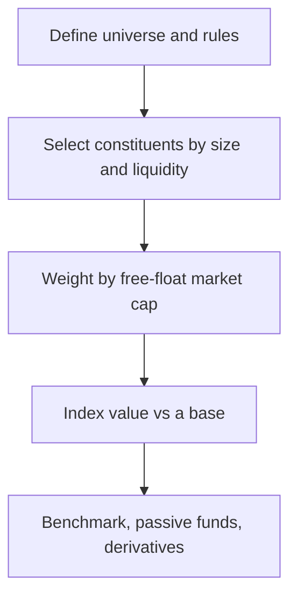

# Market Indices

## The Problem / Why this matters
"The market was up 1% today" — but what *is* "the market"? An **index** is the number that represents it. Indices are how performance is measured, how passive funds are built, how benchmarks are set, and how derivatives (index futures/options) are priced. Understanding how they're constructed (and their quirks) matters for research, portfolio, and derivatives roles — and interviewers ask how the Nifty/Sensex are built and what "free-float market-cap weighted" means.

## Core Idea
A market index is a **single number tracking the value of a defined basket of stocks**, used as a barometer of the market or a segment. Most modern indices are **free-float market-capitalization weighted**: each stock's weight is proportional to the market value of its publicly tradable shares.

## Why it works this way
Investors need a comparable, investable benchmark. Weighting by free-float market cap makes the index reflect where investable money actually sits (bigger, more freely-traded companies matter more) and makes it **replicable** by index funds. It also self-adjusts: as a stock rises, its weight rises, mirroring a real buy-and-hold portfolio.

## Full technical content

**Construction methods (weighting):**
| Method | Weight by | Examples |
|---|---|---|
| **Free-float market-cap** | Value of publicly tradable shares | Nifty 50, Sensex, S&P 500 |
| Full market-cap | Total shares × price | older indices |
| **Price-weighted** | Share price (not size) | Dow Jones, Nikkei |
| Equal-weighted | Same weight each | equal-weight indices |

**Free-float** excludes promoter/strategic/locked holdings — only shares actually available to trade count, so the index reflects investable value.

**Indian benchmarks:**
- **Nifty 50** (NSE) — 50 large-caps, free-float market-cap weighted.
- **Sensex** (BSE) — 30 large-caps, free-float weighted.
- Broader: Nifty Next 50, Nifty 100/500, Nifty Midcap/Smallcap, and sectoral indices (Bank Nifty, Nifty IT, etc.).

**The divisor & continuity.** An index uses a **divisor** so that mechanical changes (constituent additions/deletions, corporate actions, new share issuance) don't create artificial jumps — the divisor is adjusted to keep the index continuous. This is why a stock split doesn't move the index.

**Rebalancing.** Indices are reviewed periodically (e.g., semi-annually for Nifty) to add/drop constituents by size and liquidity rules. Index inclusion/exclusion drives real flows (passive funds must buy the added stock), so it moves prices.

**Uses of indices:**
1. **Benchmark** — measure a portfolio's relative performance (alpha).
2. **Passive investing** — index funds and ETFs replicate the index cheaply.
3. **Derivatives** — index futures and options (Nifty/Bank Nifty are among the world's most traded).
4. **Market sentiment** — a barometer of the economy/segment.

**Price return vs total return index.** A **price index** ignores dividends; a **total return index (TRI)** reinvests dividends — TRI is the fair benchmark for a fund that also earns dividends.

## Worked examples

**Example 1 — free-float weighting.** Company X has ₹1,000 cr total market cap but the promoter holds 60% (locked), so free-float = 40% = ₹400 cr. Company Y has ₹600 cr market cap, 100% free-float = ₹600 cr. Despite X being "bigger," Y gets a larger index weight (₹600 cr vs ₹400 cr of investable value). *Free-float, not total size, drives weight.*

**Example 2 — why a split doesn't move the index.** A constituent does a 1:1 split — price halves, shares double, market cap unchanged. The index divisor absorbs the mechanical change so the index value is unaffected. Corporate actions don't distort the index.

**Example 3 — index inclusion flow.** A stock is added to the Nifty 50 at the next rebalance. Every passive fund tracking the Nifty must buy it to match the index, creating real buying pressure — the stock often rises into and on inclusion. Index membership has real cash-flow consequences.

**Example 4 — sizing the actual passive-flow impact of an index change.** Estimated total AUM tracking the Nifty 50 (index funds + ETFs + closet-indexers benchmarked to it) is roughly ₹4,50,000 cr. A stock is added to the index with an assigned weight of 0.6%. The mechanical passive buying this triggers is approximately 0.6% × 4,50,000 cr ≈ **₹2,700 cr** of forced buying across the tracking-fund universe, concentrated around the effective date of the change. If the stock's free-float market cap is, say, ₹40,000 cr and its average daily traded value is ₹150 cr, then ₹2,700 cr of buying represents roughly **18 days' worth of average trading volume** that needs to clear near the rebalance date — explaining why index-inclusion candidates often see meaningfully outsized price moves and volume spikes specifically in the days around the effective date, and why some active managers explicitly trade *ahead* of an anticipated inclusion (once a stock's growing market cap makes inclusion likely at the next scheduled review) to front-run this predictable flow.

**Example 5 — why a stock's index weight can change even with no rebalance and no price move.** A promoter sells a 10% stake via an open-market block deal, reducing their holding from 55% to 45% — free-float rises from 45% to 55% of total shares. Even with the share price completely unchanged, the stock's free-float market cap (and therefore its index weight) rises proportionally, since free-float weighting (Section 6.1) is a function of *tradable* value, not just price. This is why an index's divisor and constituent weights are reviewed and adjusted not only at scheduled rebalance dates, but also on ad hoc "specified events" like a material shareholding change — a detail that separates a candidate who understands index mechanics from one who only knows the "market-cap weighted" headline.

## How it is tested in interviews
- **"How is the Nifty/Sensex constructed?"** — "Free-float market-capitalization weighted baskets of large-caps (Nifty 50 on NSE, Sensex 30 on BSE); weights reflect the value of publicly tradable shares."
- **"What does free-float mean and why use it?"** — "Only publicly tradable shares (excluding promoter/locked holdings). It makes the index reflect investable value and be replicable by index funds."
- **"Why doesn't a stock split move the index?"** — "The divisor adjusts for mechanical changes so the index stays continuous; market cap is unchanged by a split."
- **"Price-weighted vs market-cap-weighted?"** — "Price-weighted (Dow) weights by share price regardless of size; market-cap weighted (Nifty/S&P) weights by company value — the latter reflects the real market."
- **"Price return vs total return index?"** — "TRI reinvests dividends; it's the fair benchmark for a fund that also collects dividends."

## Traps & common mistakes
- Saying "market-cap weighted" without the **free-float** nuance for Nifty/Sensex.
- Thinking a **split or bonus** moves the index (the divisor absorbs it).
- Confusing **price-weighted** (Dow) with **market-cap-weighted** (S&P/Nifty).
- Benchmarking a fund against a **price index** instead of the **total-return** index.

## First-principles recap
- An index = a single number tracking a defined basket; the market's barometer.
- Nifty/Sensex are **free-float market-cap weighted** — investable value drives weight.
- A **divisor** keeps the index continuous through corporate actions and rebalances.
- Indices power benchmarking, passive funds, and derivatives.
- Use the **total-return** index to fairly benchmark dividend-earning funds.

## Quick-reference
| Item | Note |
|---|---|
| Nifty 50 / Sensex | Free-float market-cap weighted (50 / 30 stocks) |
| Free-float | Publicly tradable shares only |
| Divisor | Keeps index continuous through changes |
| Price-weighted | Dow, Nikkei (by share price) |
| TRI | Reinvests dividends (fair benchmark) |
| Inclusion | Forces passive-fund buying (real flow) |
