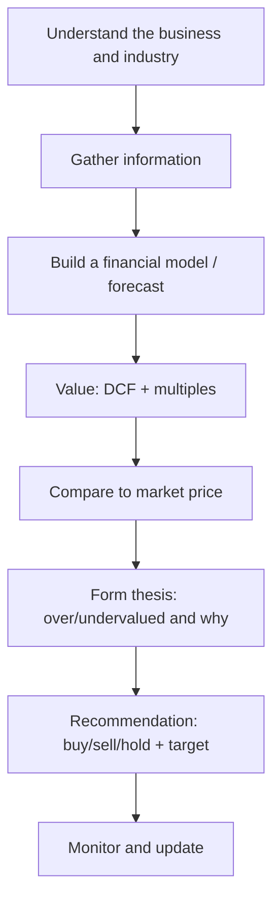

# The Equity Research Process

## The Problem / Why this matters
An equity research analyst's job is to form and defend a **view on a stock** — is it worth more or less than the market says, and why? That view drives buy/sell/hold recommendations that clients act on. Knowing the end-to-end process — coverage, information gathering, modelling, valuation, thesis, and the recommendation — is exactly what an equity research or investment-analyst interview tests, often as "walk me through how you'd analyse a company."

## Core Idea
Equity research is a repeatable process: **understand the business → model its financials → value it → compare to the market price → form a thesis and recommendation → monitor.** The output is an investment view supported by a model and a written note.

## Why it works this way
Markets are mostly efficient, so to add value an analyst must either know something the market underappreciates or interpret known facts better. That requires deeply understanding the business and its drivers, building a defensible forecast, and translating it into a value that can be compared to the price — then articulating *why* the market is wrong.

## Full technical content

**Step 1 — Understand the business & industry.** What does the company do, how does it make money (revenue model, unit economics), what's its competitive position and moat, who are its customers and competitors, and what drives the industry (see fundamental analysis).

**Step 2 — Gather information.** Annual reports/10-Ks, quarterly results and concalls, management guidance, industry data, channel checks, expert networks, competitor filings, and news. Rigorous, primary-source-driven.

**Step 3 — Build the model.** A three-statement model with a **driver-based forecast** (revenue drivers → costs → the three linked statements), producing the free cash flows and metrics valuation needs (see the modeling chapter).

**Step 4 — Value.** Intrinsic (DCF) and relative (comps/multiples), triangulated to a value range and a target price (see applied valuation).

**Step 5 — Form the thesis.** The core argument: *why* the stock is mispriced. A good thesis is **differentiated** (a view the market doesn't fully hold), **specific**, and **falsifiable** (you can say what would prove you wrong). Identify the **catalysts** that will close the value gap and the **risks**.

**Step 6 — Recommendation.** Buy / Hold / Sell (or Overweight/Neutral/Underweight) with a **target price** and time horizon, and the expected return vs the current price.

**Step 7 — Write and communicate.** The research note (initiation or update) and verbal pitch to clients/PMs; then **monitor** results, news and thesis, updating the view as facts change.

**The analyst's edge — three sources of alpha:**
| Edge | Description |
|---|---|
| **Informational** | Knowing a fact the market hasn't priced (rare, and insider info is illegal) |
| **Analytical** | Interpreting known facts better (better model/insight) |
| **Behavioural/time-horizon** | Exploiting others' biases or short-termism |

Most legitimate edge is **analytical** and **behavioural**.

**Quality markers of good research:** a clear, differentiated thesis; a defensible model with sensible assumptions; explicit catalysts and risks; and intellectual honesty (state what would make you wrong).

## Worked examples

**Example 1 — the process end to end.** Analyst covers an FMCG firm. Understands the business (rural distribution moat); models revenue off volume × price with margin expansion from premiumization; DCFs it and cross-checks EV/EBITDA vs peers → intrinsic ₹1,200 vs market ₹1,000. Thesis: the market underrates margin expansion from premiumization (differentiated view); catalyst: next two quarters of margin beats; risk: rural slowdown. Recommendation: **Buy, target ₹1,200, +20%.**

**Example 2 — differentiated vs consensus thesis.** Two analysts value the same stock at ₹1,000, exactly the market price, agreeing with consensus. Neither adds value — a research view is only useful when it *differs* from the price and has a reason. The job is to find and defend the gap.

**Example 3 — thesis falsification.** An analyst's Buy rests on a new product driving 15% volume growth. She states: "If the first two quarters show under 8% volume growth, the thesis is broken and I'll downgrade." That falsifiability is what separates research from cheerleading.

## How it is tested in interviews
- **"Walk me through how you'd analyse a company / research a stock."** — Recite: understand the business → gather info → model → value (DCF + comps) → compare to price → form a differentiated thesis with catalysts and risks → recommend with a target → monitor.
- **"What makes a good investment thesis?"** — "Differentiated from consensus, specific, with clear catalysts and risks, and falsifiable — you can state what would prove you wrong."
- **"Where does an analyst's edge come from?"** — "Mostly analytical (better interpretation) and behavioural (exploiting short-termism/biases); informational edge is rare and insider info is illegal."
- **"How do you decide buy vs sell?"** — "Compare intrinsic value/target to the market price; the gap and catalysts drive the rating and expected return."

## Traps & common mistakes
- Producing a view that **matches consensus/price** — it adds no value.
- A model with no **thesis** — data without a differentiated argument.
- No **catalysts** (why does the gap close?) or **risks** (what if you're wrong?).
- Not stating what would **falsify** the thesis — a recipe for holding losers.
- Chasing **informational edge** into insider-trading territory.

## First-principles recap
- Research = understand → model → value → compare to price → thesis → recommend → monitor.
- Value is only added when your view **differs from the market**, with a reason.
- A good thesis is differentiated, specific, catalyst-driven, and **falsifiable**.
- Edge is mostly analytical and behavioural.
- The output is a rating, a target price, and a defensible note.

## Quick-reference
| Step | Output |
|---|---|
| Understand business | Revenue model, moat, drivers |
| Model | Driver-based 3-statement forecast |
| Value | DCF + multiples → target |
| Thesis | Why mispriced + catalysts + risks |
| Recommendation | Buy/Hold/Sell + target + horizon |
| Edge | Analytical + behavioural |
