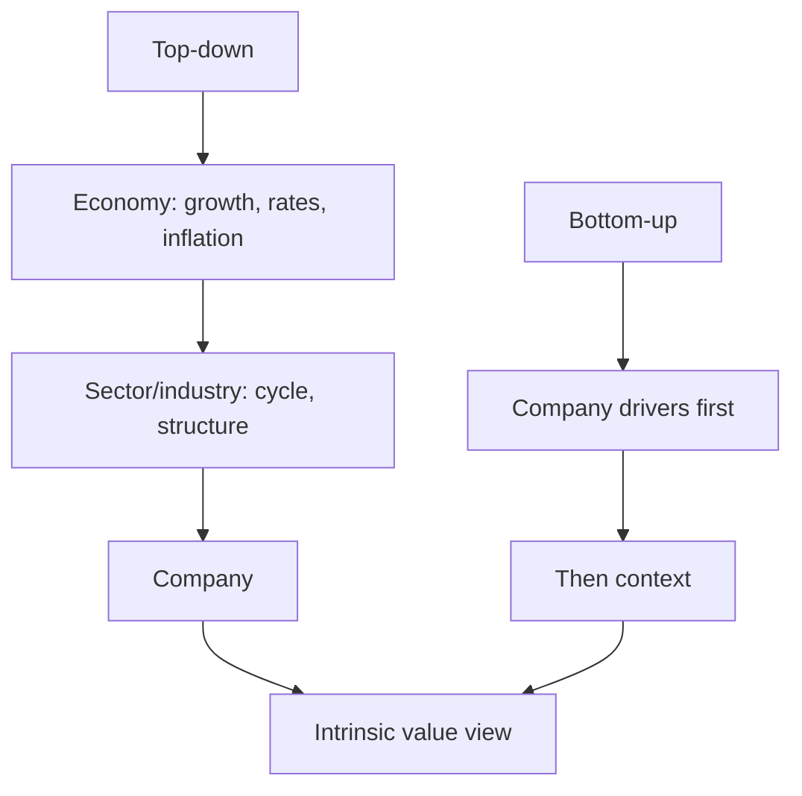

# Fundamental Analysis: Top-Down & Bottom-Up

## The Problem / Why this matters
To decide whether a stock is cheap or dear, you must first understand the *fundamentals* — the real economic drivers of the business and its environment. **Fundamental analysis** is the discipline of assessing a company's intrinsic worth from the economy, industry and company up (or down). It's the core skill of equity research and long-term investing, and interviewers probe whether you can structure an analysis rather than just quote a P/E.

## Core Idea
Fundamental analysis estimates a company's intrinsic value from its underlying economics. It's done **top-down** (economy → sector → company) and **bottom-up** (company-specific analysis first), usually combining both: understand the macro and industry context, then dig into the specific company's drivers, quality and valuation.

## Why it works this way
A company's results are shaped by forces at three levels — the macro economy (growth, rates, inflation), the industry (structure, cycle, competition), and the company itself (strategy, execution, moat). Ignoring any level gives a wrong answer: a great company in a collapsing industry, or a mediocre one riding a boom, will disappoint if you only looked at one layer.

## Full technical content

**Top-down analysis (economy → sector → stock):**
1. **Macro** — GDP growth, interest rates, inflation, currency, policy. Sets the tailwind or headwind (e.g., rate cuts favour rate-sensitives).
2. **Sector/industry** — pick sectors positioned to benefit; assess industry structure and cycle.
3. **Stock** — pick the best companies within the chosen sectors.

**Bottom-up analysis (company first):** start with the individual company's fundamentals — competitive position, financials, management, valuation — largely regardless of the macro call, on the belief that a great business at a fair price wins over time. Most research combines both.

**Analysing the company — the toolkit:**
| Dimension | What to assess |
|---|---|
| **Revenue model & unit economics** | How it makes money; per-unit profitability |
| **Competitive position / moat** | Brand, cost, switching costs, network, scale, IP (Porter's five forces) |
| **Growth drivers** | Volume, price, mix, new products, markets |
| **Margins & operating leverage** | Profitability trajectory and its drivers |
| **Returns** | ROE, ROIC vs cost of capital (value creation) |
| **Balance sheet & cash flow** | Leverage, working capital, FCF generation |
| **Management & governance** | Track record, capital allocation, alignment |
| **Valuation** | Is the price sensible vs intrinsic value? |

**Qualitative + quantitative.** The numbers (financials, ratios) show *what* happened; the qualitative work (moat, management, industry) explains *why* and whether it's sustainable. Great analysis fuses both.

**Growth vs value styles.** *Value* investors seek cheap stocks relative to fundamentals; *growth* investors pay up for superior growth. Both are fundamental — they weight the drivers differently.

**Catalysts.** Fundamental value only matters to a trade if something will make the market recognize it — new products, margin inflection, deleveraging, management change, sector re-rating. Identifying catalysts turns a valuation gap into an actionable idea.

## Worked examples

**Example 1 — top-down chain.** Macro: rates are falling and consumption is recovering → favour consumer discretionary. Sector: within it, organized retail is gaining share from unorganized. Stock: pick the best-positioned retailer with a scale/cost moat and clean balance sheet. The macro call, sector selection, and stock pick compound.

**Example 2 — bottom-up quality.** An analyst ignores the noisy macro and focuses on a company with a durable brand moat, 25% ROIC (well above its ~11% WACC → strong value creation), consistent FCF, and disciplined capital allocation. Even through cycles, a business earning far above its cost of capital compounds value — a classic bottom-up buy.

**Example 3 — good company, bad price.** A wonderful franchise (high ROIC, wide moat) trades at 60× earnings, pricing in flawless growth for a decade. Fundamentally excellent, but the *price* already reflects it — the fundamental analyst concludes the stock, not the business, is the problem, and passes. Quality ≠ a buy at any price.

**Example 4 — a worked Porter's Five Forces on a real sector structure.** Applying the framework to Indian organised retail: threat of new entrants is moderate (real estate/capex barriers are high, but e-commerce lowers the barrier for a purely online entrant); bargaining power of buyers is rising (price transparency via apps, easy switching); bargaining power of suppliers is generally low for large retailers (scale gives negotiating leverage over most FMCG suppliers, though it's lower against a must-stock category leader with its own brand power); threat of substitutes is high and growing (quick-commerce, D2C brands bypassing retail entirely); competitive rivalry is intense (multiple well-funded organised players plus unorganised trade still holding majority share). The synthesis an analyst should reach: an industry with intense rivalry and rising buyer power rewards the specific players with genuine structural advantages (private-label margin, supply-chain scale, prime real estate locked in early) over those competing purely on price — exactly the kind of company-specific differentiation a bottom-up analysis (Example 2) should then dig into for the actual stock pick.

**Example 5 — separating a cyclical earnings beat from genuine fundamental improvement.** A cement company reports 40% YoY EBITDA growth, driving a sharp stock rally. A rigorous fundamental analyst decomposes the beat before extrapolating it: how much came from volume growth (durable, driven by real demand), how much from price/realisation increases (check whether industry-wide, suggesting pricing discipline, or company-specific, suggesting a one-off), and how much from a temporary fuel/input-cost tailwind (coal/pet-coke prices, which are cyclical and can reverse). If the input-cost tailwind explains most of the beat, extrapolating the 40% growth rate forward into a DCF or forward-multiple assumption would materially overstate fair value once costs normalise — the analyst's job is precisely this decomposition, not accepting a reported growth number at face value, directly connecting back to Part 6's "understand the business" discipline applied to a single quarter's result.

## How it is tested in interviews
- **"What is fundamental analysis?"** — "Estimating a company's intrinsic value from its underlying economics — the macro, the industry, and the company's own drivers, quality and valuation."
- **"Top-down vs bottom-up?"** — "Top-down starts from the economy and sector and drills to the stock; bottom-up starts with the company's fundamentals. Most research combines both."
- **"How would you analyse a company's competitive position?"** — Porter's five forces / moat sources (brand, cost, switching costs, network, scale, IP) and returns vs cost of capital.
- **"How do you know a company creates value?"** — "ROIC above WACC — it earns more than the cost of the capital it uses."
- **"Why do you need a catalyst?"** — "A valuation gap only pays off if something makes the market recognize it — new products, a margin inflection, deleveraging, a re-rating."

## Traps & common mistakes
- Doing only **one level** (company without industry, or macro without the company).
- Confusing a **great business** with a **great stock** — price matters.
- All numbers, no **qualitative** judgment (moat, management, sustainability).
- Ignoring **ROIC vs WACC** — growth without returns above cost of capital destroys value.
- No **catalyst** — a permanently "cheap" stock can stay cheap.

## First-principles recap
- Fundamental analysis derives intrinsic value from economy, industry and company.
- **Top-down** (macro → sector → stock) and **bottom-up** (company first) — usually both.
- Fuse quantitative (financials, ROIC) with qualitative (moat, management).
- Value creation = **ROIC > WACC**; a great business isn't a buy at any price.
- Catalysts turn a valuation gap into an actionable idea.

## Quick-reference
| Level | Focus |
|---|---|
| Macro | Growth, rates, inflation, policy |
| Sector | Structure, cycle, competition |
| Company | Moat, drivers, margins, returns, management |
| Value creation | ROIC > WACC |
| Catalyst | What makes the market re-rate |
