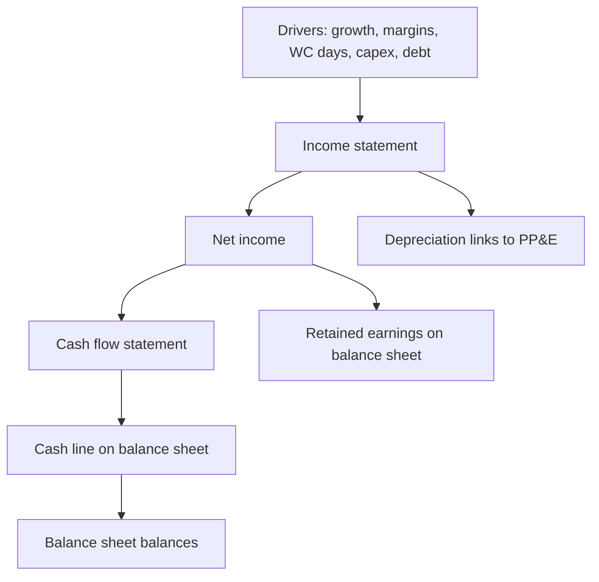

# Three-Statement Modeling for Research

## The Problem / Why this matters
A research view needs numbers: a forecast of what the company will earn and how much cash it will generate. The **three-statement model** — a linked income statement, balance sheet and cash flow driven off a few assumptions — is the workhorse that produces those numbers and feeds valuation. Building and defending one is a core equity-research and IB skill, and "walk me through a 3-statement model" is a standard interview question.

## Core Idea
A three-statement model projects the **income statement, balance sheet and cash flow statement**, fully linked so they stay internally consistent, from a set of **operating drivers** (revenue growth, margins, working-capital days, capex, financing). Change an assumption and the whole model — including free cash flow — updates coherently.

## Why it works this way
The three statements are connected in reality (net income flows to retained earnings and to cash flow; depreciation links the P&L and the asset base; debt links financing and interest), so a credible forecast must respect those links. Driving everything off a small set of assumptions makes the model transparent, defensible, and easy to sensitize.

## Full technical content

**Build order (typical):**
1. **Revenue** — from drivers (volume × price, or growth rate; segment build).
2. **Costs & margins** — COGS and opex as % of revenue or per-unit; get to EBITDA and EBIT.
3. **Supporting schedules** — depreciation (off PP&E + capex), working capital (off days: DSO, DIO, DPO), debt & interest, equity.
4. **Complete the income statement** — interest (from the debt schedule), taxes, net income.
5. **Build the cash flow** — start from net income, add back D&A, adjust for working-capital changes (from the WC schedule), subtract capex, add/subtract financing.
6. **Complete the balance sheet** — cash (from CF), PP&E (prior + capex − depreciation), working-capital items, debt, retained earnings (prior + NI − dividends).
7. **Check it balances** — assets = liabilities + equity every year; cash ties to the cash-flow statement.

**The links that make it consistent:**
- Net income → retained earnings (BS) and top of cash flow (CF).
- Depreciation → reduces PP&E (BS), non-cash add-back (CF), expense (IS).
- Capex → increases PP&E (BS), investing outflow (CF).
- Working-capital changes → BS balances and CF operating adjustment.
- Debt → BS balance, interest on the IS, financing flows on the CF.

**Circularity.** Interest depends on debt, debt depends on cash, cash depends on interest — a circular reference. Handled with **iterative calculation** (Excel's circular switch) or a **circularity breaker** (average debt / copy-paste). A classic modeling interview question.

**Best practices:** separate **inputs** (assumptions) from **calculations**; drive off a few clear drivers; keep formulas consistent across columns; build **checks** (balance-sheet balances, cash ties to CF); make scenarios toggle-able; label units. A clean, auditable model beats a clever one.

**From model to valuation:** the model outputs the **free cash flows** (FCFF/FCFE) that the DCF discounts and the **metrics** (EBITDA, EPS) that multiples apply to — so the model is the engine behind the valuation.

## Worked examples

**Example 1 — driver-based revenue.** A retailer: stores 100 growing to 120, revenue/store ₹5 cr growing 4%/yr. Year-1 revenue = 100 × 5 = ₹500 cr; Year-2 = 110 × 5.2 ≈ ₹572 cr. Costs at 85% of revenue → EBITDA 15% margin. The forecast flows from store count and sales density, not a guessed growth number — defensible and sensitizable.

**Example 2 — the balancing check.** Net income ₹70 cr, dividends ₹20 cr → retained earnings up ₹50 cr. Cash flow shows net change in cash +₹30 cr. On the balance sheet, cash rises ₹30 cr and retained earnings rise ₹50 cr; other moves (PP&E, debt, working capital) must net so that assets = liabilities + equity. If it doesn't balance, there's a linking error — the check catches it.

**Example 3 — the circularity.** Adding a revolver whose interest depends on the average debt balance creates a circular reference (interest ↔ debt ↔ cash). Turning on iterative calculation lets Excel converge; alternatively, compute interest on opening (not average) debt to break the loop. Interviewers love this: "where's the circular reference in a 3-statement model?"

## How it is tested in interviews
- **"Walk me through a three-statement model."** — Build revenue and costs → schedules (depreciation, working capital, debt) → complete the income statement → cash flow from net income → balance sheet → check it balances. Emphasize the *links*.
- **"How are the three statements linked?"** — Net income → retained earnings and CF; depreciation → PP&E, IS and CF; capex → PP&E and CF; debt → BS, interest and financing.
- **"Where is the circular reference?"** — "Interest ↔ debt ↔ cash. Solved with iterative calculation or by using opening-debt interest."
- **"What checks do you build?"** — "The balance sheet must balance every year, and cash on the balance sheet must equal the cash-flow statement's ending cash."

## Traps & common mistakes
- Hard-coding numbers instead of driving off **assumptions**.
- Forgetting a **link** (e.g., depreciation not flowing to PP&E) so the model doesn't balance.
- Not handling **circularity** (or leaving it broken).
- No **checks** — errors go undetected.
- Over-complex models no one (including you) can audit.

## First-principles recap
- A 3-statement model links IS, BS and CF, driven off a few operating assumptions.
- Build revenue → costs → schedules → complete IS → CF → BS → **check it balances**.
- Net income, depreciation, capex, working capital and debt are the key links.
- Handle **circularity** (interest ↔ debt ↔ cash) with iteration or a breaker.
- The model outputs the FCF and metrics that feed valuation.

## Quick-reference
| Link | From → To |
|---|---|
| Net income | IS → retained earnings (BS) & CF |
| Depreciation | IS expense, CF add-back, PP&E ↓ |
| Capex | CF outflow, PP&E ↑ |
| Working capital | CF adjustment, BS items |
| Debt | BS, interest (IS), financing (CF) |
| Check | BS balances; CF cash = BS cash |
