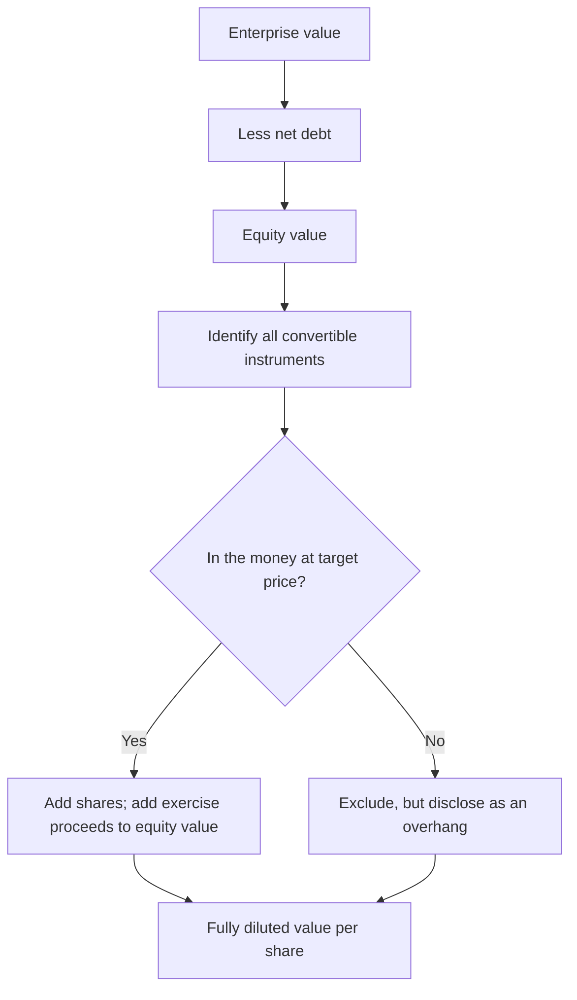

# Convertibles, Warrants and Equity-Linked Instruments

## The Problem / Why this matters
A company's share count is not a fixed number. Convertible bonds, promoter warrants, employee options and similar instruments create claims on equity that do not appear in the current shares outstanding but will dilute existing holders when exercised. An analyst who values a company correctly and then divides by the wrong share count has done all the hard work and produced a wrong per-share number — which is the only number that matters to the client.

## Core Idea
Value the enterprise, then work carefully down to **the share count that will actually exist** when the value is realised — including every instrument that can become equity, valued for both its dilution and the cash it brings in.

## Why it works this way
Equity-linked instruments are options: the holder converts only when it is profitable to do so, which is precisely when the shares are valuable. Dilution therefore arrives in the good scenarios and not in the bad ones — an asymmetry that a simple "add the potential shares" treatment misses in one direction and a "ignore them until converted" treatment misses in the other.

## Full technical content

### The instruments to look for

| Instrument | Where disclosed | Dilution character |
|---|---|---|
| **Convertible bonds / FCCBs** | Borrowings note; separate note on terms | Converts at a fixed price; debt disappears on conversion |
| **Warrants** (often issued to promoters or investors) | Share capital note; exchange filings | Upfront payment of a portion, balance on exercise within a defined window |
| **Employee stock options and RSUs** | ESOP note; separate disclosure of outstanding and vested | Continuous, recurring dilution |
| **Compulsorily convertible preference shares / debentures** | Borrowings or share capital note | Conversion is certain, not optional — treat as equity now |
| **Contingent/earn-out shares** | Business combination note | Issued only if performance conditions are met |

**The compulsorily convertible instruments are the ones most often mishandled.** Because conversion is not optional, the instrument is economically equity already. Including it in debt while excluding its shares from the count double-counts against the equity holder; the correct treatment is to convert it in the model at the stated ratio.

### The treasury stock method

The standard approach for options and warrants, and the one to be able to execute cleanly:

1. Take all **in-the-money** options and warrants — those with an exercise price below the relevant share price.
2. Assume they are exercised, producing **new shares issued** and **cash proceeds** to the company.
3. Assume the proceeds are used to repurchase shares at the market price.
4. **Net new shares = shares issued − shares repurchased.**

**Worked illustration.** 4.0mn options outstanding at an exercise price of ₹180; the share price is ₹600.
- Shares issued: 4.0mn. Proceeds: 4.0 × 180 = ₹720mn.
- Shares repurchased: 720 ÷ 600 = 1.2mn.
- **Net dilution: 2.8mn shares.**

Note that the dilution depends on the share price — as the price rises, the proceeds buy back fewer shares and the net dilution increases. **This means the dilution should be computed at your target price, not at the current price**, when calculating a target. Analysts routinely compute it at spot and understate the dilution embedded in their own bull case.

### The if-converted method for convertible bonds

For a convertible bond, compare two states:

| | Not converted | Converted |
|---|---|---|
| Share count | Base | Base + conversion shares |
| Interest expense | Present | Removed |
| Debt in net debt | Present | Removed |

Compute value per share both ways and **use the lower** — because the holder will convert if and only if it is advantageous to them, which is disadvantageous to existing shareholders. This is the same conservative logic as the treasury method: assume the option is exercised against you when it is rational to do so.

### Promoter warrants — the India-specific case

Warrants issued preferentially to promoters are common in Indian mid and small caps, and they carry information beyond the dilution arithmetic:

- The promoter pays a portion upfront and the balance on exercise within a defined period, with the upfront amount forfeited if the warrant lapses.
- **Issuance is a mildly positive signal** — the promoter is committing capital at a price fixed today, which implies a belief the shares will be worth more.
- **Lapse is a strongly negative signal.** A promoter forfeiting the upfront payment rather than exercising is a public statement that they do not consider the shares worth the exercise price. This is one of the more reliable negative signals available and is easy to miss, because a lapse is a non-event in the news flow.
- Check the **pricing** against the regulatory floor and against the market price at issuance — warrants issued at a steep discount to a depressed price shortly before a sharp recovery is a governance pattern worth noting.

### ESOP dilution — the recurring kind

Unlike a one-off convertible, employee options dilute continuously. Practical treatment:

- **Model the run-rate.** If the company has been granting 0.7% of equity annually and the plan pool supports continuation, build that into forward share counts rather than treating the current diluted count as static.
- **Check whether the company's "adjusted" earnings exclude share-based compensation.** If so, the cost is real but missing from the number, and the correct response is to deduct it — the alternative is to accept that shareholders pay employees in equity for free.
- **High-growth and technology companies** are where this matters most, sometimes running to several percent of equity a year, which compounds into a large claim over a five-year forecast.
- **Repricing** of underwater options is a governance signal: it transfers value from shareholders to employees after the shares have fallen, and shareholders do not get their losses repriced.

### Building it into the valuation properly

The sequence that avoids the common errors:

1. Compute **enterprise value** from the operating forecast.
2. Deduct **net debt**, treating compulsorily convertible instruments as equity rather than debt.
3. Arrive at **equity value**.
4. Determine which optional instruments are **in the money at the target price** — not at spot.
5. **Add exercise proceeds** to equity value and **add the shares** to the count.
6. Divide to get **value per share**.
7. Iterate if necessary, since the target price affects which instruments are in the money.

Step 5 is where the most common single error occurs: adding the dilutive shares while forgetting the cash the exercise brings in, which overstates the dilution.

### The overhang effect

Beyond arithmetic dilution, a large convertible or warrant position can suppress the share price:
- Convertible arbitrage holders frequently **short the underlying** to hedge, creating persistent selling pressure.
- A known future issuance caps the price near the conversion level, since new supply arrives there.
- **Disclose this in the note** as a technical factor, distinct from the fundamental view.

## Common mistakes
- Using **basic** shares outstanding when a materially different diluted count exists.
- Computing option dilution at the **spot price** rather than at the target price.
- Adding dilutive shares while **omitting the exercise proceeds**.
- Treating **compulsorily convertible** instruments as debt and excluding their shares.
- Accepting "adjusted" earnings that exclude share-based compensation.
- Ignoring the **run-rate** of future ESOP grants over a multi-year forecast.
- Missing a **lapsed promoter warrant**, a strong negative signal that generates no news.
- Ignoring convertible-arbitrage short pressure as a technical overhang.

## Interview angle
"The company has convertible bonds outstanding. How does that affect your target price?" Work through the if-converted comparison: value the equity both with the bond outstanding — interest expense in the P&L, debt in net debt, base share count — and with it converted, where the interest and debt disappear but the share count rises, then use the lower of the two per-share values, because the holder converts exactly when it hurts existing shareholders. Extend the point to options and warrants using the treasury method, and flag the detail that shows care: the dilution must be computed at your target price rather than at spot, since a higher price means the exercise proceeds repurchase fewer shares and the net dilution is larger — so the bull case carries more dilution than the current-price calculation shows. Mention too that the exercise proceeds are cash coming into the company and must be added to equity value, which is the step most often dropped.
