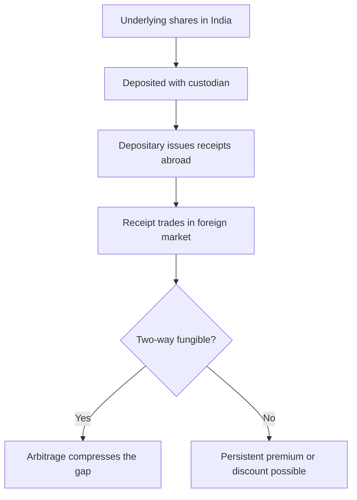

# Overseas Listings — ADRs, GDRs and Dual-Listed Structures

## The Problem / Why this matters
A number of large Indian companies have securities listed abroad as depositary receipts, and Indian investors increasingly hold foreign-listed shares directly. An analyst covering such a company faces two prices for the same economic claim, quoted in different currencies, in markets that are open at different times, and frequently trading at a persistent premium or discount to one another. Explaining that gap correctly — and knowing when it is information rather than noise — is a recurring practical question.

## Core Idea
A depositary receipt is a **claim on the same underlying shares**, so any price difference beyond currency conversion must be explained by a specific friction: convertibility limits, transaction costs, index membership, or the local investor base's willingness to pay.

## Why it works this way
Where receipts are freely two-way fungible, arbitrage compresses the gap: a trader can cancel receipts and sell the underlying, or buy the underlying and create receipts. Where fungibility is restricted, the arbitrage cannot operate, and the two prices are free to diverge by whatever the two separate investor bases decide.

## Full technical content

### The structures

| Structure | Nature |
|---|---|
| **ADR** (American Depositary Receipt) | Receipt traded in the US against Indian shares held by a custodian; sponsored levels differ in disclosure and listing requirements |
| **GDR** (Global Depositary Receipt) | Similar, typically listed in London or Luxembourg, historically used for capital raising |
| **Direct foreign listing** | Shares listed abroad rather than receipts, subject to the permitted regulatory framework |
| **IFSC / GIFT City listing** | An Indian jurisdiction with a distinct regulatory and tax regime, intended to onshore some of this activity |

**The ratio matters.** One receipt may represent one, two, or a fraction of an underlying share. Every price comparison must be adjusted for the ratio before anything is concluded — a "premium" that is simply an unadjusted ratio is an embarrassing and common error.

### Computing the premium or discount correctly

**Implied local price = (Receipt price × FX rate) ÷ Receipts per share**

Compare that to the domestic share price. The difference is the premium or discount.

**Two disciplines:**
1. **Use synchronous prices.** The US and Indian markets have limited overlap, so comparing an Indian close to a US close introduces a several-hour gap during which the world changed. Apparent premiums are frequently just this timing artefact.
2. **Use the correct FX rate**, at the same timestamp.

### Why persistent gaps exist

| Driver | Effect |
|---|---|
| **Restricted fungibility** | If receipts cannot be freely created and cancelled, arbitrage is blocked and the gap persists |
| **Investor-base differences** | A foreign investor base with fewer comparable options may pay more; index inclusion abroad adds a passive bid |
| **Capital-control frictions** | Costs and approvals for cross-border movement widen the band within which arbitrage is unprofitable |
| **Liquidity difference** | The more liquid line may carry a liquidity premium |
| **Tax treatment** | Different withholding and capital-gains treatment for the two holder bases |
| **Voting and rights differences** | Receipt holders often have restricted or intermediated voting rights, which is worth something |

**The analytical rule:** a gap is only informative once these frictions are accounted for. A stable 6% premium explained by restricted fungibility and index membership abroad tells you nothing; a premium that suddenly doubles tells you one investor base has changed its view, and it is worth finding out which and why.

### What the foreign line offers the analyst

- **Extended price discovery.** The foreign line trades while India is closed, so it prices overnight global news before the Indian market opens — genuinely useful for gap analysis and for understanding what the domestic open will reflect.
- **A second sentiment reading.** Divergence between the two lines indicates the two investor bases disagree, which is worth investigating.
- **Additional disclosure.** US-listed issuers file under US requirements, which can include reconciliations, risk-factor discussion and governance disclosure not present in the Indian annual report. **This is under-used and frequently contains material not available elsewhere.**

### Valuation treatment

- The **underlying economics are identical**, so the fundamental valuation is one exercise, not two.
- Produce a **rupee target for the domestic line** and translate at a stated FX assumption for the foreign line, disclosing the assumption. Do not model two independent valuations.
- **Be explicit about currency**: a foreign holder's return is the local-currency return plus the currency move, so a correct fundamental call can produce a poor dollar outcome if the rupee depreciates. Where the client base is foreign, state the return in their currency.
- Where a persistent structural premium exists, **do not forecast its disappearance** unless a specific mechanism (a fungibility change, an index event) will cause it.

### The delisting and conversion risk

Companies periodically terminate depositary programmes, converting receipt holders into holders of the underlying or cashing them out. For an analyst covering a name with a foreign line:
- **A programme termination announcement** typically collapses any premium immediately.
- Holders may face practical difficulties in holding the underlying directly, which forces selling.
- This is a dated, disclosed, forecastable event of exactly the kind the flow chapters describe, and it belongs on the monitorable list.

### Cross-listed peers as analytical inputs

Separately from the two-price question, foreign listings of comparable businesses are useful:
- **Global peer multiples** for sectors where the domestic peer set is thin, subject to the adjustments in the cross-market valuation chapter.
- **Read-across from foreign-listed peers' results** — a global peer reporting weak demand in a shared end market is early information for the Indian name, and often precedes the domestic disclosure by weeks.
- **Disclosure arbitrage**: a foreign-listed competitor may disclose segment or geographic detail that the Indian company does not, allowing inference about the Indian company's markets.

That last point is a genuine and under-exploited research edge — the data exists publicly, and most domestic analysts do not read foreign filings.

## Common mistakes
- Comparing prices **without adjusting for the receipt ratio**.
- Comparing **non-synchronous** closes and calling the timing gap a premium.
- Treating a **structurally explained** premium as a mispricing.
- Producing two independent valuations for one economic claim.
- Ignoring the **currency component** of a foreign holder's return.
- Missing the additional disclosure in foreign regulatory filings.
- Overlooking programme-termination risk as a dated event.
- Not reading foreign-listed peers' filings for read-across.

## Interview angle
"The ADR trades at an 8% premium to the local shares. What does that tell you?" Start by checking whether it is real: adjust for the receipts-per-share ratio, use synchronous prices rather than two closes hours apart, and apply the FX rate at the same timestamp — a large share of apparent premiums fail one of those tests. If the gap survives, explain it through frictions rather than mispricing: restricted two-way fungibility blocks the arbitrage that would otherwise close it, index membership abroad adds a passive bid, and the two investor bases face different tax and voting positions. Then make the point that matters analytically — the level of the premium is uninformative, but a *change* in it means one investor base has revised its view, and identifying which one and why is the actual research question. Add that you read the foreign regulatory filings for disclosure the Indian annual report does not contain.
