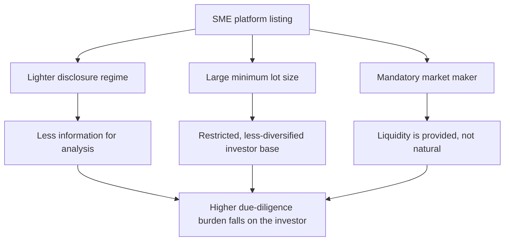

# The SME Platform and Micro-Cap Listings

## The Problem / Why this matters
The NSE Emerge and BSE SME platforms host hundreds of very small listed companies, and periods of enthusiasm have produced extraordinary listing gains, heavy retail participation and regulatory concern. An analyst may be asked to look at this segment either as an opportunity or as a risk indicator for the broader market. The segment has genuinely different rules — disclosure, lot sizes, migration, market making — and applying main-board habits to it produces both bad analysis and bad risk management.

## Core Idea
The SME platform is **structurally different, not merely smaller**: lighter disclosure, thin float, minimal institutional participation and low liquidity mean the price is set by a small number of participants, and standard valuation work is only as good as financials that receive far less scrutiny.

## Why it works this way
Regulators created a lighter-touch regime deliberately, to let small companies access capital without main-board compliance costs. The trade-off is less disclosure and less scrutiny — which is a reasonable policy design and simultaneously a much harder analytical environment for an outside investor.

## Full technical content

### Structural features that differ from the main board

| Feature | SME platform | Implication |
|---|---|---|
| **Disclosure frequency** | Reduced relative to the main board (half-yearly reporting has applied historically) | Longer gaps between data points; stale information |
| **Minimum lot size** | Large, so a single trade requires substantial capital | Excludes small retail; concentrates the holder base |
| **Market maker** | Mandatory for a defined period post-listing | Quoted liquidity is contractual, not organic — it may vanish when the obligation ends |
| **Migration to main board** | Permitted on meeting eligibility criteria | A genuine, dated re-rating catalyst |
| **Institutional participation** | Minimal | No analyst coverage, no institutional price discipline |
| **Float** | Very thin | Prices move on tiny volumes |

### Why the analytical burden is higher

**Less audited scrutiny.** Smaller audit firms, smaller fees, fewer resources. The audit-report chapter's checks matter more here, not less, and the base rate of accounting problems is higher.

**Shorter track record.** Many issuers list with two or three years of meaningful history, often showing rapid growth in the pre-IPO period. **Pre-IPO margin and growth inflation is a recognised pattern** — the periods presented in the offer document are the periods management most wanted to look strong. Comparing post-listing performance to the pre-listing trajectory is the single highest-value check in this segment.

**Related-party dependence.** Very small companies frequently transact with promoter-owned entities for supply, distribution or premises. Revenue and margin may not be arm's-length.

**Customer concentration.** A single customer at 40% of revenue is common and is an existential risk, not a footnote.

**Working-capital fragility.** These businesses typically have limited access to credit; a stretched receivable that a large company absorbs can be terminal here.

### The liquidity reality

This is the constraint that most often makes the analysis academic:

- **Position exit is the binding problem.** A stock trading ₹35 lakh a day cannot support an institutional position at any size, and even a modest position may take weeks to exit — precisely when you most want to, in a falling market, liquidity disappears entirely.
- **Impact cost is large in both directions.** The price at which you can buy and the price at which you can sell differ materially from the screen price.
- **Market-maker withdrawal** at the end of the obligation period is a scheduled liquidity event.
- **The price is not a valuation.** In a stock where a few lakh rupees moves the price several percent, the quoted price reflects the last marginal trade, not a market consensus on value.

### Migration to the main board

The one clean, dated catalyst in the segment:
- Migration brings **higher disclosure requirements, main-board investor eligibility, smaller lot sizes and index eligibility** over time.
- It expands the investor base substantially, which is a genuine re-rating driver rather than a flow artefact.
- **The eligibility criteria are published**, so an analyst can identify companies approaching them and estimate timing — a rare instance of a forecastable catalyst.
- The associated risk is that the increased disclosure reveals things the lighter regime did not require.

### Doing the work properly, if you do it at all

A defensible process for this segment:

1. **Start with the offer document** and compare every projection or trend presented against what actually happened post-listing.
2. **Audit report first**, per the audit chapter — the auditor's identity, any qualification, CARO items on statutory dues.
3. **Cash versus profit**, cumulatively. In this segment the check has a much higher hit rate.
4. **Related-party note in full** — quantify the proportion of revenue, purchases and premises involving promoter entities.
5. **Customer and supplier concentration**, from the disclosures and from primary work.
6. **Site or channel verification** where feasible — for a company this small, a plant visit or distributor conversation is disproportionately informative relative to the effort.
7. **Promoter background** — prior ventures, any regulatory actions, other listed entities in the group.
8. **Liquidity test before valuation** — establish the deployable position size first, because if the answer is "too small to matter," the remaining work has no purpose.

Step 8 belongs first in practice, however illogical it looks in a list: the most common waste of research effort in this segment is completing a thorough analysis of a company nobody can take a position in.

### As a market indicator

Independently of individual stocks, the SME segment is a useful **sentiment gauge**:
- Sustained large listing-day gains, heavy oversubscription of small issues, and price moves disconnected from any fundamental development are characteristic of late-cycle retail enthusiasm.
- Regulatory attention to the segment typically follows such periods and is itself a risk to the segment's valuations.
- **This read-across is more reliably useful to most analysts than the individual stock work**, and it costs almost nothing to monitor.

## Common mistakes
- Applying main-board **valuation multiples** without a liquidity and disclosure discount.
- Doing full fundamental work **before** establishing the deployable position size.
- Treating the quoted price as a market consensus on value when a few lakh rupees sets it.
- Trusting **pre-IPO financials** without comparing them to post-listing performance.
- Ignoring **related-party dependence** in revenue and costs.
- Assuming quoted liquidity persists after the **market-maker obligation** ends.
- Missing migration eligibility as a forecastable catalyst.
- Reading the segment's exuberance as a bullish rather than a late-cycle signal.

## Interview angle
"Would you cover SME-platform companies?" Answer with the structural differences rather than a simple yes or no: lighter disclosure and less frequent reporting mean fewer and staler data points; audits are typically by smaller firms, so the forensic checks carry more weight; float and liquidity are thin enough that the quoted price reflects the last marginal trade rather than a consensus. Say that the first step is a liquidity test — establishing what position size is actually deployable and exitable — because completing full fundamental work on a company nobody can hold is the standard waste of effort in this segment. Where the work is justified, the highest-value checks are comparing post-listing performance against the pre-IPO financials in the offer document, quantifying related-party dependence, and mapping customer concentration. Add that the segment's behaviour is a useful late-cycle sentiment indicator for the broader market even when you own nothing in it.
